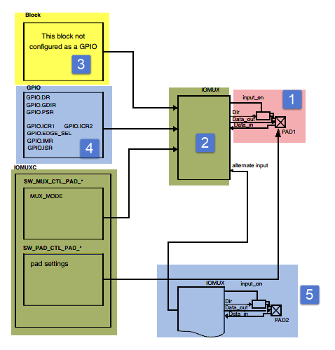
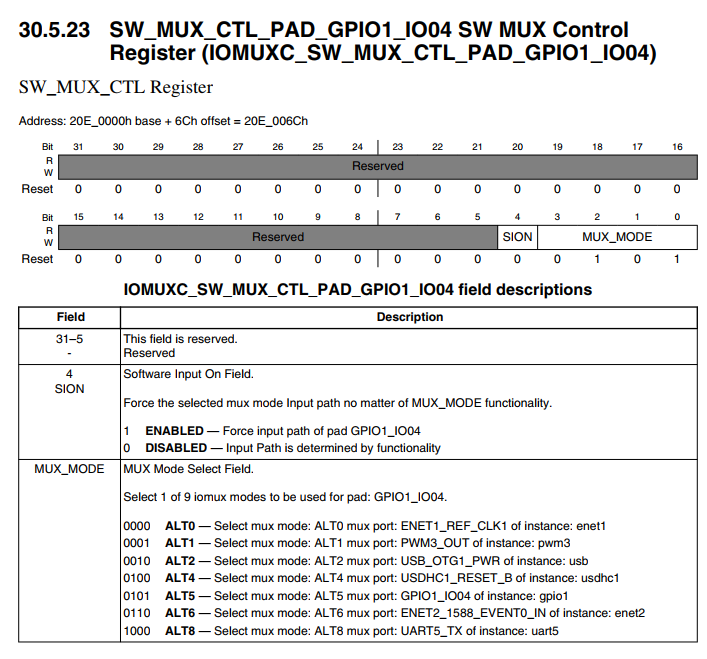
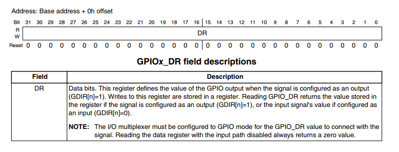
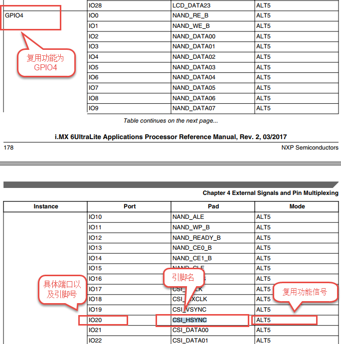
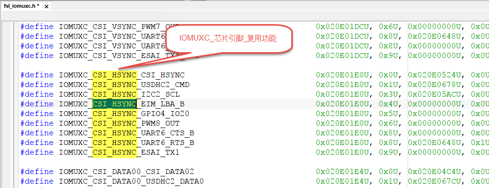
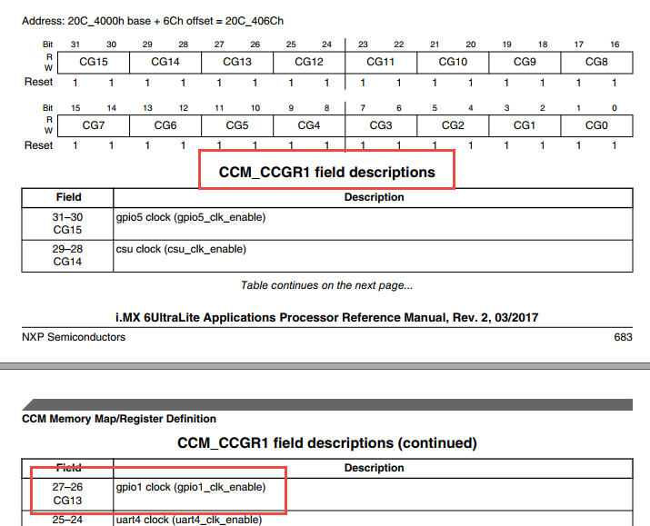
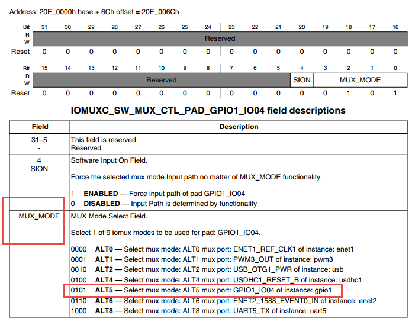
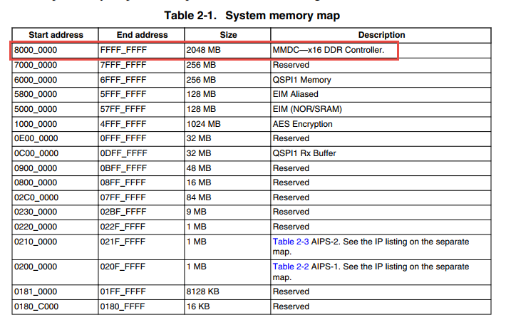

.. vim: syntax=rst

汇编点亮LED灯
--------

本章节内容处于开发笔记状态，还待整理至最终版的教程。

本章节内容处于开发笔记状态，还待整理至最终版的教程。

从本章开始我们正式开启基于i.MX6ULL的裸机开发，本章将会带领大家用用汇编语言从零开始写一个点亮LED程序。可能部分读者会担心自己的汇编基础不好或者不会汇编，这都没关系，因为我们只用到了一些或者可以说是几个常用的汇编指令。

本章主要包括两部分，第一部分讲解i.MX6ULL的GPIO,配置方法以及常用寄存器介绍，i.MX6ULL的GPIO配置方法与STM32单片机稍有不同，我们将详细介绍这部分内容。第二部分讲解具体的实现代码以及程序的编译下载。

学习重点：

-  掌握i.MX6ULL GPIO配置方法，能够熟练的将IO口配置为我们需要的功能。

-  掌握交叉编译器的使用方法。

GPIO简介
~~~~~~

i.MX 6U芯片的GPIO被分成很5组,并且每组GPIO的数量不尽相同，例如GPIO1拥有32个引脚GPIO2拥有22个引脚，其他GPIO分组的数量以及每个GPIO的功能请参考《i.MX 6UltraLite Applications Processor Reference
Manual》第26章General Purpose Input/Output (GPIO)（P1133），和STM32以及RT1052类似。

GPIO框图剖析
~~~~~~~~

|asembl002|

图 48‑1 GPIO结构框图

通过GPIO硬件结构框图，就可以从整体上深入了解GPIO外设及它的各种应用模式。该图从最右端看起，①中的就表示i.MX 6U芯片引出的GPIO引脚，其余部件都位于芯片内部。

基本结构分析
^^^^^^

下面我们按图 49‑1中的编号对GPIO端口的结构部件进行说明。

PAD
'''

PAD代表了一个i.MX 6U的GPIO引脚。在它的左侧是一系列信号通道及控制线，如input_on控制输入开关，Dir控制引脚的输入输出方向，Data_out控制引脚输出高低电平，Data_in作为信号输入，这些信号都经过一个IOMUX的器件连接到左侧的寄存器。

另外，对于每个引脚都有很多关于属性的配置，这些配置是由图 49‑2中的框架结构实现的。

|asembl003|

图 48‑2 PAD接口框架

①PAD引脚

框图中的最右侧的PAD同样是代表一个i.MX 6U的引脚。

②输出缓冲区

当输出缓冲区使能时，引脚被配置为输出模式。在输出缓冲区中，又包含了如下的属性配置：

-  DSE驱动能力

DSE可以调整芯片内部与引脚串联电阻R0的大小，从而改变引脚的驱动能力。例如，R0的初始值为260欧姆，在3.3V电压下其电流驱动能力为12.69mA，通过DSE可以把R0的值配置为原值的1/2、1/3…1/7等。

-  SRE压摆率配置

压摆率是指电压转换速率，可理解为电压由波谷升到波峰的时间。增大压摆率可减少输出电压的上升时间。i.MX 6U的引脚通过SRE支持低速和高速压摆率这两种配置。压摆率是大信号特性，下面的带宽是小信号特性。

-  SPEED带宽配置

通过SPEED可以设置IO的带宽，分别可设置为50MHz、100MHz以及200MHz。带宽的意思是能通过这个IO口最高的信号频率，通俗点讲就是方波不失真，如果超过这个频率方波就变正弦波。但是这个带宽要区别于IO的翻转速率，IO的翻转速率的信号来自于GPIO这个外设，而IO的带宽只是限制了IO口引脚
的物理特性，IO口的信号可以来自于内部定时器输出的PWM信号，也可以来自于GPIO翻转输出的信号，两者相比之下，PWM信号的频率是远远高于GPIO翻转输出的信号频率。

-  ODE开漏输出配置

通过ODE可以设置引脚是否工作在开漏输出模式。在该模式时引脚可以输出高阻态和低电平，输出高阻态时可由外部上拉电阻拉至高电平。开漏输出模式常用在一些通讯总线中，如I2C。

③输入缓冲区

当输入缓冲区使能时，引脚被配置为输入模式。在输入缓冲区中，又包含了如下的属性配置

-  HYS滞后使能

i.MX 6U的输入检测可以使用普通的CMOS检测或施密特触发器模式（滞后模式）。施密特触发器具有滞后效应，对正向和负向变化的输入信号有不同的阈值电压，常被用于电子开关、波形变换等场合，其转换特性和对比见图 49‑3及图 49‑4，如检测按键时，使用施密特模式即可起到消抖的功能。

   |asembl004|

图 48‑3施密特触发器的转换特性

|asembl005|

图 48‑4 在CMOS模式和滞后模式下的接收器输出

④Pull/Keeper上下拉、保持器

引脚的控制逻辑中还包含了上下拉、保持器的功能。芯片内部的上拉和下拉电阻可以将不确定的信号钳位在高、低电平，或小幅提高的电流输出能力，上拉提供输出电流，下拉提供输入电流。注意这些上下拉配置只是弱拉，对于类似I2C之类的总线，还是必须使用外部上拉电阻。i.MX
6U芯片的电源模块中包含转换器，当转换器停止工作时，保持器会保持输入输出电压。

上下拉、保持器可以通过如下属性配置：

-  PUS上下拉配置

PUS可配置项可选为100K欧下拉以及22K欧、47K欧及100K欧上拉。

-  PUE上下拉、保持器选择

上下拉功能和保持器功能是二选一的，可以通过PUE来选择。

-  PKE上下拉、保持器配置

上下拉功能和保持器还通过PKE来控制是否使能。

注意，当引脚被配置为输出模式时，不管上下拉、保持器是什么配置，它们都会被关闭。

IOMUX复用选择器
''''''''''

继续分析图 49‑1，图中标注的第2部分IOMUX译为IO复用选择器。i.MX 6U的芯片每个GPIO都通过IOMUX支持多种功能，例如一个IO可用于网络外设ENET的数据接收引脚，也可以被配置成PWM外设的输出引脚，这样的设计大大增加了芯片的适用性，这样可选的功能就是由IOMUX实现的。IOMUX
相当于增加了多根内部信号线与IO引脚相连，最多有8根，也就是说一个IO最多可支持8种可选的功能。

IOMUX由其左侧的IOMUXC控制（C表示Controler），IOMUXC提供寄存器给用户进行配置，它又分成MUX Mode（IO模式控制）以及Pad Settings（Pad配置）两个部分：

-  MUX Mode配置

MUX Mode就是用来配置引脚的复用功能，按上面的例子，即是具体是用于网络外设ENET的数据接收，还是用于PWM外设的输出引脚，当然，也可以配置成普通的IO口，仅用于控制输出高低电平。

-  Pad Settings配置

Pad Settings用于配置引脚的属性，例如驱动能力，是否使用上下拉电阻，是否使用保持器，是否使用开漏模式以及使用施密特模式还是CMOS模式等。关于属性的介绍会在后面给出，在学习各种外设时，也将会接触到这些属性在不同场合下的应用。

在IOMUXC外设中关于MUX Mode和Pad Settings寄存器命名格式见表格 49‑1。

表格 48‑1 IOMUXC寄存器命名的方式

============== ==========================
IOMUXC控制类型 寄存器名称
============== ==========================
MUX Mode       IOMUXC_SW_MUX_CTL_PAD_XXXX
Pad Settings   IOMUXC_SW_PAD_CTL_PAD_XXXX
============== ==========================

每个引脚都包含这两个寄存器，表中的XXXX表示引脚的名字，例如本芯片中有一个名为GPIO1_IO03的引脚，编号为GPIO1.3，你可以在参考手册的IOMUXC章节中找到它的这两个寄存器：IOMUXC_SW_MUX_CTL_PAD_GPIO1_IO04以及IOMUXC_SW_PAD_CTL_PAD_
GPIO1_IO04，以下简称MUX寄存器及PAD寄存器。根据寄存器说明即可对该引脚进行相应的配置。

IOMUXC_SW_MUX_CTL_PAD_XXXX引脚模式寄存器

下面以GPIO1_IO04引脚为例对 MUX寄存器进行说明，该引脚相应的MUX寄存器在参考手册中的描述见图 49‑5。

|asembl006|

图 48‑5 参考手册中对GPIO1.4引脚MUX配置寄存器的说明

可以看到，该寄存器主要有两个配置域，分别是SION和MUX_MODE，其中SION用于设置引脚在输出模式下同时开启输入通道。重点是MUX_MODE的配置，它使用4个寄存器位表示可选的ALT0~ALT7这8个模式，如ALT2模式就是用于usb外设的USB_OTG1_PWR信号；若配置为ALT5则引脚会
用作普通的GPIO功能，用于输出高、低电平。 这也是本章所需要的。

IOMUXC_SW\_ PAD_CTL_PAD_XXXX引脚属性寄存器

类似地，以GPIO1_IO04引脚中PAD寄存器在参考手册中的描述见图 49‑6。

|asembl007|

图 48‑6 参考手册中对GPIO1.4引脚PAD配置寄存器的说明（部分）

相对来说PAD寄存器的配置项就更丰富了，而且图中仅是该寄存器的部分说明，仔细看这些配置项，它们就是前面图 49‑2介绍的各项属性，如HYS设置使用施密特模式的滞后功能，PUS配置上下拉电阻的阻值，其它的还包含PUE、PKE、ODE、SPEED、DSE及SRE的配置。

Block外设功能控制块
''''''''''''

Block是外设功能控制块，例如具有ENET的数据接收功能的引脚，它就需要网络外设ENET的支持，具有PWM输出功能的引脚，它需要PWM外设的支持，这些外设在芯片内部会有独立的功能逻辑控制块，这些控制块通过IOMUX的复用信号与IO引脚相连。使用时通过IOMUX选择具体哪个外设连接到IO。

GPIO外设
''''''

GPIO模块是每个IO都具有的外设，它具有IO控制最基本的功能，如输出高低电平、检测电平输入等。它也占用IOMUX分配的复用信号，也就是说使用GPIO模块功能时同样需要使用IOMUX选中GPIO外设。图中的GPIO.DR、GPIO.GDIR、GPIO.PSR等是指GPIO外设相关的控制寄存器，它们分
别是数据寄存器、方向寄存器以及引脚状态寄存器，功能介绍如下：

GPIO.GDIR方向寄存器

控制一个GPIO引脚时，要先用GDIR方向寄存器配置该引脚用于输出电平信号还是用作输入检测。典型的例子是使用输出模式可以控制LED灯的亮灭，输入模式时可以用来检测按键是否按下。

GDIR寄存器的每一个数据位代表一个引脚的方向，对应的位被设置为0时该引脚为输入模式，被设置为1时该引脚为输出模式，具体见图 49‑7。

|asembl008|

图 48‑7 参考手册中对GDIR的寄存器说明

例如，对GPIO1的GDIR寄存器的bit3位被写入为1，那么GPIO1.3引脚的模式即为输出。

GPIO.DR数据寄存器

DR数据寄存器直接代表了引脚的电平状态，它也使用1个数据位表示1个引脚的电平，每位用1表示高电平，用0表示低电平。DR寄存器在参考手册中的说明见图 49‑8。

|asembl009|

图 48‑8 参考手册中对DR数据寄存器的说明

当GDIR方向寄存器设置引脚为输出模式时，写入DR数据寄存器对应的位即可控制该引脚输出的电平状态，如这时GPIO1的DR寄存器的bit4被写入为1，则引脚为输出高电平。

当GDIR方向寄存器设置引脚为输入模式时，读取DR数据寄存器对应的位即可获取该引脚当前的输入电平状态，例如这里读取GPIO1的DR寄存器的bit4，得到该位的值为0，表示当前引脚的输入状态为低电平。

GPIO.PSR引脚状态寄存器

PSR引脚状态寄存器相当于DR寄存器的简化版，它仅在GDIR方向寄存器设置为输入模式时有效，它的每个位表示一个引脚当前的输入电平状态。PSR寄存器的权限是只读的，对它进行写操作是无效的。

特别地，当引脚被配置成输出模式时，若IOMUXC中的MUX寄存器使能了SION功能（输出通道回环至输入），可以通过PSR寄存器读取回引脚的状态值。

与其它引脚的连接
''''''''

GPIO功能框中的第5项表示另一个引脚PAD2，它与PAD1有一根信号线连接，表示部分引脚的输出可以作为另一个引脚的输入。

GPIO配置方法
~~~~~~~~

首先我们总结上一小节内容，上一小节主要包括PAD、IOMUX复用选选择器以及GPIO外设三部分内容。

-  PAD就是我们拿到芯片能看到的那些金属管脚，在这部分讲解了芯片引脚驱动能力、上下拉、输出最高频率等等和STM32非常相似的内容，但是这部分并没有提供配置GPIO驱动能力、上下拉等属性的寄存器，这些配置寄存器在引脚复用（IOMUX）模块配置。

-  IOMUX复用选择器，这部分虽然内容很多但是很容易理解，简单来说每个可用的引脚拥有两个寄存器，一个用于配置引脚的复用功能，另外一个用于配置引脚的驱动能力、上下拉、带宽等等引脚属性。

-  GPIO外设，需要强调的GPIO不是引脚,GPIO是外设，同串口、SPI一样是芯片的一种片上外设。某个引脚可以通过IOMUX复用选择器选择为GPIO功能，同样也可能可以选择为其他外设的功能引脚。芯片上电后每个引脚有自己的默认复用功能，当然我们可修改它。

..

   GPIO外设和STM32的GPIO外设非常相似，如果用作控制LED灯我们只需要配置GPIO的方向寄存器GPIOx_DR以及GPIO输出状态寄存器GPIOx_DR.

LED初始化流程大致可分为以下三步：

(1) 开启GPIO时钟。

(2) 设置引脚的复用功能以及引脚属性。

(3) 设置引脚方向以及输出电平。

汇编点亮LED灯实验
~~~~~~~~~~

硬件连接
^^^^

打开《野火_EBF6ULL S1 Pro 底板_V1.0_原理图》原理图文档来查看硬件连接，LED灯部分见图 48‑9。

|asembl010|

图 48‑9 RGB灯电路连接图，摘自《野火_EBF6ULL S1 Pro 底板_V1.0_原理图》

这些LED灯的阴极都是连接到i.MX 6U的GPIO引脚，只要我们控制GPIO引脚的电平输出状态，即可控制LED灯的亮灭。若你使用的实验板LED灯的连接方式或引脚不一样，只需根据我们的工程修改引脚即可，程序的控制原理相同。

从原理图可看到RGB灯的三个阴极R、G、B连接分别连接至标号GPIO_4、CSI_HSYNC、CSI_VSYNC，这些标号实际上与配套核心板上i.MX
6U芯片的引脚相连。由于引脚功能众多，绘制原理图时不可避免地无法完全表示引脚信息的所有信息。而无论是具体的引脚名还是复用功能，我们都无法直接得知这些具体是i.MX 6U芯片的哪个引脚。我们需要知道这些引脚是对应的具体GPIO，这样我们才能编写程序进行控制。

由于还不清楚标号GPIO_4、CSI_HSYNC、CSI_VSYNC的具体引脚名，我们首先要在核心板原理图中查看它与i.MX 6U芯片的关系。

查看核心板原理图
^^^^^^^^

打开《野火_EBF6ULL S1 邮票孔核心板_V1.0_原理图》，在PDF阅读器的搜索框输入前面的GPIO_4、CSI_HSYNC、CSI_VSYNC标号，找到它们在i.MX 6U芯片中的标号说明，具体见图 48‑10。

|asembl011|

图 48‑10 核心板上i.MX 6U的信号连接，摘自《野火_EBF6ULL S1 邮票孔核心板_V1.0_原理图》

通过这样32 21 29 29 11的方式，我们查找到了GPIO_4信号的具体引脚名为GPIO1_IO04。但是当我们使用同样的方法查找时发现只能找到CSI_HSYNC、CSI_VSYNC，并没有我们熟悉的GPIOx_IOx标注的引脚名，如图 48‑11所示。

|asembl012|

图 48‑11RGB灯引脚

原因很简单，这两个引脚默认情况下不用作GPIO，而是用作摄像头的某一功能引脚，但是它可以复用为GPIO，我们怎么找到对应的GPIO呢？

第一种，在《i.MX 6UltraLite Applications Processor Reference Manual》的第4章External Signals and Pin Multiplexing搜索引脚名，以CSI_HSYNC为例，如图 49‑13所示。

|asembl013|

图 48‑12在参考手册根据引脚号查找其复用功能

从中可以看出CSI_HSYNC对应的GPIO引脚为GPIO4_IO20。

第二种，在官方写好的文件中查找，我们打开“fsl_iomuxc.h”文件（可以打开IAR工程找到该文件也可以在工程目录下直接搜索）。直接在“fsl_iomuxc.h”文件中搜索图 49‑12所搜得到的LED灯对应的引脚CSI_HSYNC（或CSI_VSYNC）得到如图
49‑14所示的结果（以CSI_HSYNC为例）。

|asembl014|

图 48‑13fsl_iomuxc.h文件

从图中不难看出这就是我们要找的引脚，每个宏定义分“三段”，以宏IOMUXC_CSI_HSYNC_I2C2_SCL为例，IOMUXC代表这是一个引脚复用宏定义，CSI_HSYNC代表原理图上实际的芯片引脚名，I2C2_SCL代表引脚的复用功能。一个引脚有多个复用功能，本章要把CSI_HSYNC用作GP
IO控制LED灯，所以本实验要选择IOMUXC_CSI_HSYNC_GPIO4_IO20宏定义引脚CSI_HSYNC复用为GPIO4_IO20，具体怎么使用程序中再详细介绍。

经查阅，我们把以上连接LED灯的各个i.MX 6U芯片引脚总结出如表 49‑1所示，它展示了各个LED灯的连接信息及相应引脚的GPIO端口和引脚号。前面要有IAR工程讲解，否则应当删除这部分内容

表 48‑1与LED灯连接的各个引脚信息及GPIO复用编号

===== ============ ========== ==================
LED灯 原理图的标号 具体引脚名 GPIO端口及引脚编号
===== ============ ========== ==================
R灯   GPIO_4       GPIO1_IO04 GPIO1_IO04
G灯   CSI_HSYNC    CSI_HSYNC  GPIO4_IO20
B灯   CSI_VSYNC    CSI_VSYNC  GPIO4_IO19
===== ============ ========== ==================

软件设计
^^^^

创建源码文件
''''''

编写软件之前首先要规划好软件的存储位置，本教程按照章节放置程序，例如本章的程序会放在“/home/pan/section4/led”，其中“pan”是我登录使用的用户名。“section4”代表第四部分的代码，“led_s”代表汇编语言编写的led程序。

我们在“led_s”文件夹下创建led.S文件用于存放led汇编驱动代码。创建完成后转到图形界面使用VScode软件打开led.S文件即可。

源码讲解
''''

完整汇编点亮LED程序如代码清单 48‑1所示

代码清单 48‑1led汇编源码（led.S）

1 /第一部分/

2 .text //代码段

3 .align 2 //设置字节对齐

4 .global \_start //定义全局变量

5

6 /第二部分/

7 \_start: //程序的开始

8 b reset //跳转到reset标号处

9

10 /第三部分/

11 reset:

12 mrc p15, 0, r0, c1, c0, 0 /*读取CP15系统控制寄存器 \*/

13 bic r0, r0, #(0x1 << 12) /\* 清除第12位（I位）禁用 I Cache \*/

14 bic r0, r0, #(0x1 << 2) /\* 清除第 2位（C位）禁用 D Cache \*/

15 bic r0, r0, #0x2 /\* 清除第 1位（A位）禁止严格对齐 \*/

16 bic r0, r0, #(0x1 << 11) /\* 清除第11位（Z位）分支预测 \*/

17 bic r0, r0, #0x1 /\* 清除第 0位（M位）禁用 MMU \*/

18 mcr p15, 0, r0, c1, c0, 0 /\* 将修改后的值写回CP15寄存器 \*/

19

20 /第四部分/

21 /*跳转到light_led函数*/

22 bl light_led

23 /*进入死循环*/

24 /第五部分/

25 loop:

26 b loop

27

28

29 /第六部分/

30 /*CCM_CCGR1 时钟使能寄存器地址，默认时钟全部开启*/

31 #define gpio1_clock_enible_ccm_ccgr1 0x20C406C

32

33

34 /*IOMUXC_SW_MUX_CTL_PAD_GPIO1_IO04

35 寄存器地址，用于设置GPIO1_iIO04的复用功能*/

36 #define gpio1_io04_mux_ctl_register 0x20E006C

37 /*IOMUXC_SW_PAD_CTL_PAD_GPIO1_IO04寄存器地址，用于设置GPIO的PAD属性*/

38 #define gpio1_io04_pad_ctl_register 0x20E02F8

39

40

41 /*GPIO1_GDIR寄存器，用于设置GPIO为输入或者输出*/

42 #define gpio1_gdir_register 0x0209C004

43 /*GPIO1_DR寄存器，用于设置GPIO输出的电平状态*/

44 #define gpio1_dr_register 0x0209C000

45

46

47

48 /第七部分/

49 light_led:

50 /*开启GPIO1的时钟*/

51 ldr r0, =gpio1_clock_enible_ccm_ccgr1

52 ldr r1, =0xFFFFFFFF

53 str r1, [r0]

54

55

56 /第八部分/

57 /*将PAD引脚复用为GPIO*/

58 ldr r0, =gpio1_io04_mux_ctl_register

59 ldr r1, =0x5

60 str r1, [r0]

61

62 /第九部分/

63 /*设置GPIO PAD属性*/

64 ldr r0, =gpio1_io04_pad_ctl_register

65 ldr r1, =0x1F838

66 str r1, [r0]

67 /第十部分/

68 /*将GPIO_GDIR.[4] 设置为1， gpio1_io04设置为输出模式*/

69 ldr r0, =gpio1_gdir_register

70 ldr r1, =0x10

71 str r1, [r0]

72

73 /第十一部分/

74 /*将GPIO_DR 设置为0， gpio1全部输出为低电平*/

75 ldr r0, =gpio1_dr_register

76 ldr r1, =0x0

77 str r1, [r0]

78

79 /第十二部分/

80 /*跳出light_led函数，返回跳转位置*/

81 mov pc, lr

整个源码按照功能分成了十部分，集合代码各部分指令讲解如下:

-  第一部分，.text 定义代码段。.align 2 设置字节对齐。.global \_start 生命全局标号_start。

-  第二部分，_start: 定义标号_start: ，它位于汇编的最前面，说以会首先被执行。

..

   b reset ，使用b指令将程序跳转到reset标号处。

-  第三部分，通过修改PC15寄存器（系统控制寄存器）关闭I Cache 、D Cache、MMU等等我们暂时用不到的功能，如果开启可能会影响我们裸机运行，为避免不必要的麻烦暂时关闭这些功能。

-  第四部分，执行“bl”跳转指令，代码将跳转到函数“light_led”执行。回顾我们之前讲的跳转指令，“bl”指令是“可返回”跳转，跳转之前的执行地址保存在lr（连接寄存器）中。“light_led” 函数实现位于第六到十二部分。

-  第五部分，light_led函数返回后就会执行标号loop处的代码，而标号loop处只有一条指令“b loop”，这个指令是代码再次跳转到loop标号处，所以这是一个死循环

-  第六部分，定义我们用到的寄存器地址，这些寄存器在讲解GPIO时已经介绍，这里不再赘述。

-  第七部分，开启GPIO1的时钟。第七部分到第十一部分非常相似，都是向寄存器内写数据，差别是要写的寄存器以及写入的值不同。写入的寄存器地址可以查表得到，我们重点说明一下要写入的值。

..

   这部分是设置的时钟控制寄存器“CCM_CCGR1”，直接在《IMX6ULRM》搜索它可以找到如图 48‑14所示的表格。

   |asembl015|

图 48‑14CCM_CCGR1时钟寄存器

   从图中可以看出CCM_CCGR1[26:27]用于使能GPIO1的时钟，这里不仅仅设置时钟的开或者关，还可以设置在芯片在不同工作模式下的时钟状态如表 48‑2所示。

表 48‑2CGx时钟模式选择

==================== ==============================================
CCM_CCGR1[26:27]的值 时钟状态描述
==================== ==============================================
00                   时钟在所有模式下都是关闭的
01                   时钟在运行模式下为开，但在等待和停止模式下为关
10                   保留
11                   除停止模式外，时钟一直开启
==================== ==============================================

..

   我们将CCM_CCGR1[26:27]设置为11（二进制）即可。仔细观察图 48‑14发现CCM_CCGR1寄存器默认全为1，即默认开启了时钟。为了程序规范我们再次使用代码开启时钟。将CCM_CCGR1寄存器设置全为1。

-  第八部分，设置引脚复用功能为GPIO。这里设置的是GPIO1_04的引脚复用寄存器，我们直接搜索“IOMUXC_SW_MUX_CTL_PAD_GPIO1_IO04”可以找到如图 48‑15所示的寄存器。

..

   |asembl016|

图 48‑15GPIO1_IO04复用功能选择寄存器

从图 48‑15可知IOMUXC_SW_MUX_CTL_PAD_GPIO1_IO04[MUX_MODE]=0101(B)时GPIO1_04复用功能是GPIO。所以在程序中我们将0x5写入该寄存即可。

-  第九部分，设置引脚的PAD属性。同样的方法，在《IMX6ULRM》搜索寄存器定义，然后确定需要写入的值即可。这里设置的是引脚pad属性寄存器“IOMUXC_SW_PAD_CTL_PAD_GPIO1_IO04”

-  第十部分，设置GPIO为输出模式。

-  第十一部分，设置GPIO输出电平为低电平。

-  第十二部分，从light_led函数返回。在第四部分说到，我们使用“bl”指令跳转到light_led函数执行，“bl”指令是“可返回”的跳转指令，返回地址保存在“LR”（连接寄存器）里，这里使用“mov”指令将“lr”寄存器的值写入“pc”寄存器即可。

编译下载
''''

我们学习STM32时大多是基于某一个集成开发环境比如KEIL和IAR，在集成开发环境中程序编写完成后只需点击编译按钮集成开发环境就会自动完成程序的预处理、编译、汇编、链接等等工作，最终生成可供下载的文件。现在我么没有了集成开发环境所以需要我们使用交叉编译工具手动完成这些工作，当然后面的程序会通过编写
makefile 以及连接器脚本帮助我们完成这部分工作。

编译生成.b文件

编译命令：

arm-none-eabi-gcc -g -c led.S -o led.o

-  -g选项，加入GDB能够使用的调试信息,能够使用GDB调试。

-  -c选项，对源程序example.c进行预处理、编译、汇编操作，生成example.o文件。

-  led.S，要编译的源文件。

-  -o，指定输出文件的文件名，不加“-o led.o”默认会输出led.o。

..

   正常情况下执行该命令后会在当前文件夹下生成led.o文件。

   链接命令：

   arm-none-eabi-ld -Ttext 0x80000000 led.o -o led.elf

-  -Ttext 0x80000000选项，设置程序代码段的起始地址为0x80000000。0x80000000是外部内存的起始地址。这个地址是由芯片本身决定的，我们打开《IMX6ULRM》手册在Chapter 2 Memory Maps章节ARM平台内存映射表介绍了这部分内容，如图 48‑16所示。

..

   |asembl017|

图 48‑16内存映射表

   从图中可以看出DDR（外部内存）映射在0X80000000起始地址处。

-  -o选项，指定输出的文件名。

..

   格式转换命令：

   上一步链接生成的.elf文件是带有地址信息的文件，不能放在存储器中执行，要使用格式转换命令转化为二进制文件。

   arm-none-eabi-objcopy -O binary -S -g led.elf led.bin

-  -O binary选项，指定输出文件格式为二进制文件。

-  -S选项，不从源文件中复制重定位信息和符号信息。

-  -g选项，不从源文件中复制可调试信息。

编译成功后会在当前文件夹下生成.bin文件，这个.bin文件也不能直接放到开发板上运行，这次是因为需要在.bin文件缺少启动相关信息。

为二进制文件添加头并烧写到SD卡

在46.2.5 烧写到SD卡章节我们详细讲解了如何将二进制文件烧写到SD卡（烧写工具自动实现为二进制文件添加头）。这里简单说明下载步骤。

-  将一张空SD卡（烧写一定会破坏SD卡中原有数据！！！烧写前请保存好SD卡中的数据），接入电脑后在虚拟机的右下角状态栏找到对应的SD卡。将其链接到虚拟机。

-  进入烧写工具目录，执行“./mkimage.sh <烧写文件路径>”命令,例如要烧写的led.bin位于home目录下，则烧写命令为“./mkimage.sh /home/led.bin”。

-  执行上一步后会列出linux下可烧写的磁盘，选择你插入的SD卡即可。这一步非常危险！！！一定要确定选择的是你插入的SD卡！！，如果选错很可能破坏你电脑磁盘内容，造成数据损坏！！！。确定磁盘后SD卡以“sd”开头，选择“sd”后面的字符即可。例如要少些的sd卡是“sdb”则输入“b”即可。

实验现象
''''

将开发板设置为SD卡启动，接入SD卡，开发板上电，正常情况下可以看到开发板RGB灯红灯亮。

.. |asembl003| image:: media/asembl003.png
   :width: 3.9995in
   :height: 3.73912in
.. |asembl004| image:: media/asembl004.png
   :width: 2.41276in
   :height: 1.49996in
.. |asembl005| image:: media/asembl005.png
   :width: 3.97833in
   :height: 2.67361in

.. |asembl007| image:: media/asembl007.png
   :width: 5.76806in
   :height: 6.67222in
.. |asembl008| image:: media/asembl008.png
   :width: 5.76806in
   :height: 2.23056in

.. |asembl010| image:: media/asembl010.png
   :width: 5.76806in
   :height: 1.96597in
.. |asembl011| image:: media/asembl011.png
   :width: 5.76806in
   :height: 4.15833in
.. |asembl012| image:: media/asembl012.png
   :width: 5.76806in
   :height: 1.91875in

