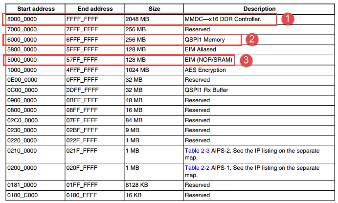
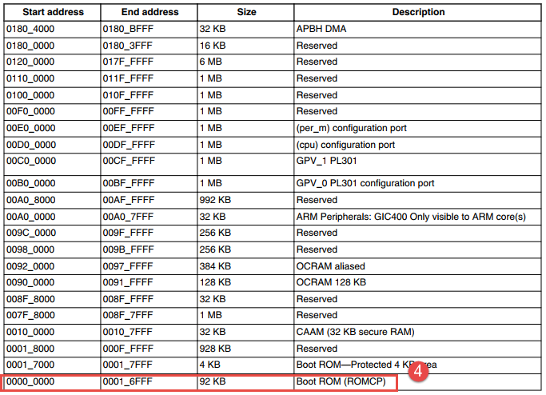
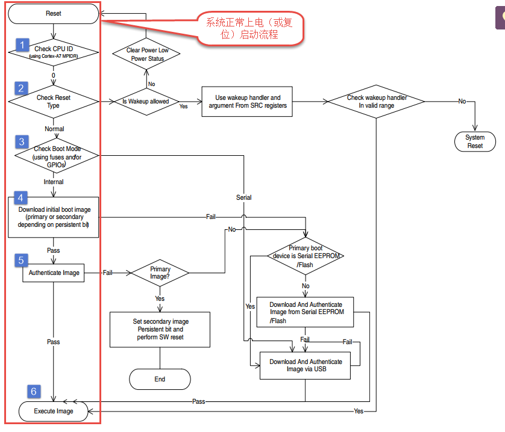
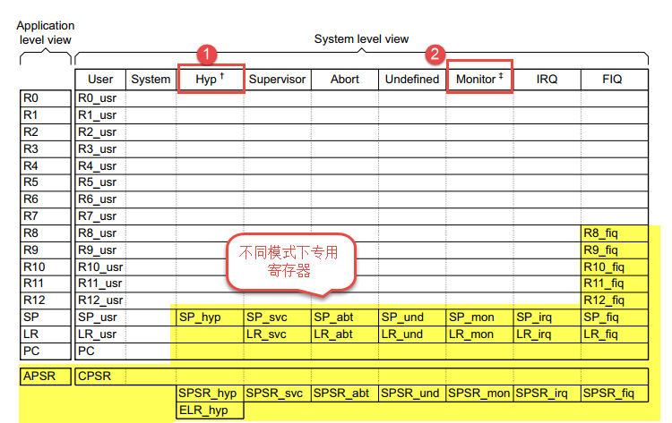
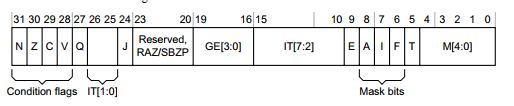
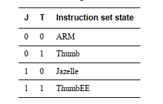
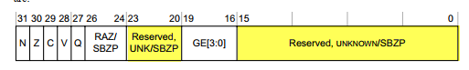

.. vim: syntax=rst

开发前准备
-----

在正式进入裸机开发之前我们必须明白两个问题，第一，i.MX 6U内存映射，第二，i.MX 6U启动流程。

学习重点：

-  了解i.MX6UL内存映射

-  了解i.MX6UL的启动流程

i.MX 6U内存映射
~~~~~~~~~~~

i.MX 6U外设寄存器以及内存被映射到4G的地址空间，如下所示。

这里我们只关系内存映射，结合上图说明如下：

标号①，DDR映射区域。DDR作为i.MX 6U的主内存区域，它被映射在0x8000 0000地址处，最大空间为2G，实际可用大小与选择的DDR芯片容量有关。

标号②，QSPI1映射区域，i.MX 6U可以外接串行norflash，norflahs映射到0x6000
000起始地址处。norflash，支持“本地执行”作用类似于STM32的内部FLASH。NXP的跨界处理器RT1050系列就是用这个外部norflah存储代码。因为开发板已经使用了容量更大的EMMC或nand flash作为主存储器，所以配套开发板并没有外接norFlash

标号③，EIM外扩存储器映射区域。i.MX 6U可以通过EIM总线外扩存储器，我们这里没有用到，不做过多介绍。

标号④，启动引导程序（Boot ROM）内存映射区域，它位于芯片内部。启动引导程序（Boot ROM）位于起始地址0x0000 0000 处。我们知道芯片上电后（或硬件复位）会自动从“0”地址处开始执行。和容易得出，这里就是保存的启动引导代码。有关启动引导程序（Boot
ROM）是如何工作的，我们将在下一小节详细介绍。

从上图我们可以知道i.MX 6U支持将多种存储器映射到4G的地址空间，我们只使用了DDR作为i.MX 6U的主内存区域，起始地址为0x8000 0000 ，大小由实际使用的DDR芯片决定。启动引导程序（Boot ROM）位于“0”地址处，大小为96Kb。

i.MX6UL的启动流程
~~~~~~~~~~~~

i.MX6UL支持多种启动方式，而具体硬件平台支持的启动方式与选择的存储器有关，本教程配套开发板支持nandflash（或EMMC）、SD卡启动、USB启动。本小节将介绍教程配套开发板支持的启动方式，更详细说明请参考《i.MX 6UltraLite Applications Processor
Reference Manual》第八章System Boot。

i.MX6UL完整的启动流程如图 47‑3所示，，完成启动任务的代码位于0x0000 0000 其实地址处的Boot ROM。本小节将以“上电到程序运行”这条主线讲解i.MX6UL启动流程。

我们假设系统是正常的上电启动，那么启动流程过程大致可分为六步。①检查CPU的ID ,②检查复位状态，③获取启动方式，④加载程序映像，⑤校验映像，⑥跳转到映像去执行。下面简要介绍着六个步骤。

检查CPU的ID
''''''''

系统上电或硬件复位后，CPU从0x0000 0000 地址开始执行Boot ROM代码（以下简称为“Boot ROM代码”）。Boot ROM代码首先会检查CPU的ID。这一步官方手册中也没有过多介绍，我们默认检测通过。

检查复位状态。
'''''''

一种情况是正常的硬件复位另外一种情况是从低功耗模式唤醒。先忽略低功耗模式唤醒的情况，继续向下执行。

检查启动方式
''''''

在开发阶段我们可以通过设置i.MX6UL启动相关引脚的电平状态来改变芯片的启动方式。BOOT_MODE[1:0] = 10B ，i.MX6UL将会从“内部”启动，所谓“内部”是相对于“Serial Download”来说的，“内部”可以认为是i.MX6UL支持的启动存储设备，例如emmc
、nandflash、SD card、norFlash等等。具体从那种“内部”设备启动，由BOOT_CFG1[7:4]决定，如下表所示。

表 内部启动方式选择

============== ==============================================
BOOT_CFG1[7:4] Boot device
============== ==============================================
0000           NOR/OneNAND (EIM) （本教程配套开发板没有用到）
0001           QSPI（norFlash启动）
0011           Serial ROM (SPI)（本教程配套开发板没有用到）
010x           SD/eSD/SDXC(SD卡启动)
011x           MMC/eMMC（emmc启动）
1xxx           Raw NAND（nandflash启动）
============== ==============================================

加载程序映像
''''''

知道启动方式后Boot ROM代码并不能立即加载启动映像，因为我们的代码保存在芯片外部存储设备，从这些存储设备读数据之前首先要进行初始化。在Boot
ROM程序根据保存在芯片中的默认配置信息配置这些存储器接口。使用默认的配置信息配置存储器接口大多数情况下并不能发挥外设的最大性能，还需要使用DCD（Device Configuration Data）进行二次配置。

DCD是一个表，表中包含的配置信息，它用于配置各种外围设备，例如NOR flash、DDR等等。既然DCD保存在程序映像中，Boot ROM怎么找到DCD呢？ DCD地址信息保存在IVT(Image Vector Table)中，Boot ROM通过读取IVT得到DCD地址信息。

同样IVT是也是一个表或者说是一个数据结构，它保存有DCD数据的地址、程序的入口等等信息。启动方式确定后Boot ROM从固定地址读取IVT。如下表所示。

表 IVT地址偏移

==================== ======================= =================
启动设备类型         IVT偏移地址             初始加载区域大小
==================== ======================= =================
NOR                  4 Kbyte = 0x1000 bytes  Entire Image Size
OneNAND              256 bytes = 0x100 bytes 1 Kbyte
SD/MMC/eSD/eMMC/SDXC 1 Kbyte = 0x400 bytes   4 Kbyte
SPI EEPROM           1 Kbyte = 0x400 bytes   4 Kbyte
==================== ======================= =================

从上表可知，IVT在存储器中的偏移值是固定的。以SD卡为例，如果从SD卡启动，那么IVG位于SD卡的0x400偏移地址处。

初始化完成后，Boot ROM便可以加载我们编写的程序。

校验映像
''''

在程序执行之前还要进行HAB校验。 HAB可以防止攻击者修改可编程内存中的代码或数据区域，HAB校验更详细的内容请参考《i.MX 6UltraLite Applications Processor Reference Manual》8.3.1节High-Assurance Boot (HAB)。

跳转到映像去执行
''''''''

以SD卡启动为例，在执行跳转之前Boot ROM已经将代码从SD卡加载到了DDR，所以直接跳转到程序的入口地址即可。

ARM工作模式与内核寄存器
~~~~~~~~~~~~~

ARM工作模式简介
'''''''''

为提高系统的稳定性，处理器会被分成多种工作模式，不同工作模式的权限不同。Cortex-M3或者M4内核的的芯片分为特权模式和非特权模式，特权模式下CPU完全控制芯片而非特权模式下不能操作某些特殊的寄存器。i.MX 6U作为一款应用处理器，将CPU工作模式进一步细分，支持九种工作模式下表所示。

表 处理器工作模式

========== ===== ======== ======================== ===============
处理器模式 编码  特权等级 执行（Implemented）      安全状态
========== ===== ======== ======================== ===============
User       10000 PL0      Always                   Both
FIQ        10001 PL1      Always                   Both
IRQ        10010 PL1      Always                   Both
Supervisor 10011 PL1      Always                   Both
Monitor    10110 PL1      With Security Extensions Secure only
Abort      10111 PL1      Always                   Both
Hyp        11010 PL2      With Security Extensions Non-secure only
Undefined  11011 PL1      Always                   Both
System     11111 PL1      Always                   Both
========== ===== ======== ======================== ===============

结合上表处理器的各种工作模式讲解如下：

-  User 用户模式，用户模式是相对于Linux系统来说的，有Linux的情况下Linxu应用程序运行在User模式，i.MX 6U特权等级从低到高被分为3个等级（PL0~PL2），用户模式属于PL0。用户模式下的执行有时被描述为“无特权执行”对系统来说User是安全的，User程序不会破坏系统。

-  FIQ快速中断模式，当发生FIQ中断后CPU就会进入FIQ模式，FIQ即“快速中断”，再中断章节我们将会详细介绍。

-  IRQ中断模式，当发生IRQ中断后CPU会进入中断模式，在中断章节我们将会详细介绍。

-  Supervisor管理模式 ，相比用户模式管理模式权限更高在，在该模式下我们可以操作所有的寄存器。系统上电（复位）后CPU默认处于该模式，我们的裸机程序也是运行在管理模式。

-  Monitor mode监听模式，就像后台服务，这个模式主要用来安全扩展模式，只用于安全

-  Abort mode 终止模式，CPU读取数据错误或者预取错误发生时将会进入终止模式。终止模式可以认为系统“挂了”。

-  Hyp mode 超级的监视模式，它主要用于一些虚拟化的扩展。

-  Undefined mode未定义指令异常模式，当CPU加载到一个无法识别的指令后将会进入该模式，同终止模式一样，是不正常的。

-  System系统模式，以系统模式执行的软件在PL1处执行。系统模式具有与用户模式相同的可用寄存器。

ARM内核寄存器
''''''''

学过STM32或其他单片机的朋友对“寄存器”肯定不陌生，但是我们接触的大多是“外设寄存器”外设寄存器本质是单片机（处理器）地址空间中的一块内存区域，CPU不能直接在内存中进行数据运算。与外设寄存器不同，内核寄存器并没有“地址”的概念，每款CPU的内核寄存是固定的，这些有限的内核寄存器根据功能分为多种
类型，我们这小节带领大家认识ARM内核寄存器。

i.MX 6内核寄存器分类

从应用程序角度看i.MX 6拥有13个32位通用寄存器R0~R12。3个32位特殊功能寄存器分别为 SP(栈指针寄存器)、LR（链接寄存器）
、PC（程序计数寄存器）和一个应用程序状态寄存器APSR。实际情况是不同的CPU工作模式有各自专用的寄存器，不同CPU工作模式也有共用的一些寄存器，从系统角度看CPU寄存器下图所示。

注：标号①处，虚拟化扩展。仅在非安全状态下存在。

标号②处 ，安全扩展的一部分。仅在安全状态下存在。

上图列出了CPU各种各种工作模式下使的寄存器。

i.MX 6内核寄存器介绍

-  SP栈指针寄存器，处理器使用SP作为指向栈的指针，在ARM指令集中大多数指令不能访问SP寄存器。ARM指令集供了对SP寄存器访问的方法使用到是我们再介绍。SP也可以用作通用寄存器但是ARM官方不建议这样做。在程序中SP也和写作R13。

-  LR链接寄存器，链接寄存器用于保存中断或者函数的返回地址。当中断发生时CPU会跳转到对应的中断服务函数中执行，而跳转之前CPU会自动将当前执行地址加4的地址保存在LR寄存器中，中断服务函数执行完成后接着从LR指定的地址处执行。函数调用和中断类似，进入子函数之前CPU自动将当前执行位置保存在LR链接
  寄存器中，子函数返回后接着LR寄存器指定的地址处执行。LR链接寄存器又被称为R14寄存器。

-  PC 程序计数寄存器，程序计数寄存器可理解为“程序的执行位置”，当执行ARM指令时，PC寄存器保存当前执行位置加8，即下一条指定的地址。当执行Thumb指令时，PC寄存器保存当前执行位置加4，即下一条指定的地址。

-  R0~R12 通用寄存器，用于暂存、传递数据。从图 47‑4不难看出所有工作模式共用R0~R7。在FIQ模式有自己的R8~R12，其他工作模式共用R8~R12。

-  PSR 程序状态寄存器，从图 47‑4不难看出PSR稍微复杂，根据工作模式不同，它被分为APSR、CPSR、SPSR。下面简单介绍着三个寄存器。

(1) CPSR和SPSR，CPSR是当前程序状态寄存器（Current Program Status Register），SPSR是备份的程序状态寄存器（Saved Program Status Registers）
。SPSR的作用是当发生异常时备份CPSR的状态，也就是说SPSR保存的是执行异常处理函数前的CPSR的值。在异常返回时CPSR可以从SPSR读回之前的状态。以下只讲解CPSR，SPSR与CPSR相同。

..

   CPSR寄存器如下图所示：

结合上图部分配置为介绍如下，完整的内容请参考《ARM® Architecture Reference Manual》B1.3.3 Program Status Registers (PSRs)。

M[4:0]模式位：

此字段保存处理器的当前模式，处理器工作模式请参考表 47‑3，M[4:0]字段对应表 47‑3第二列的“编码”，通过该位我们就可以知道处理器的当前工作模式。

T[5]和J[24]指令状态位：

此字段保存处理器执行的指令类型，分为ARM指令、Thumb指令、Jazele指令和ThumbEE指令。如下图所示。

A[8]、I[7]、F[6]屏蔽位：

A[8]是异步调试终止屏蔽位，进行程序调试时才会用到。I[7] ,IRQ中断屏蔽位，I[7] = 1B，IRQ中断被屏蔽。同样F[6]是FIQ快速中断屏蔽位，F[6] = 1B，FIQ中断被屏蔽。这些寄存器只能在PL1以及以上优先级的工作模式下才能修改，在任何工作模式下都可读。

E[9]，字节顺序位：

该位用于设置字节序，E[9] = 1B 为大端格式，E[9] = 0B 为小端格式。

注：“大端”是指“高位”数据放在低地址处，“低位”数据放在高地址处，例如数据0x5566保存在0x8000起始地址处，如果是大端格式则地址0x8000 保存的是“0x55”地址0x8001保存的是“0x66”。小端格式正好相反，0x8000 保存的是“0x66” 址0x8001保存的是“0x55”。

(2) APSR（Application Program Status Register），与SPSR、CPSR类似，APSR保存CPU执行状态，不同的是APSR权限受到限制，只有CPSR（或SPSR）的部分功能，如下所示。

从上图可以看出，相比CPSR寄存器，这里的某些字段变为“Reserved”即这些字段已经不可访问了。

ARM内核寄存器相关内容暂时介绍到这里，其他内容使用到时再详细介绍。

