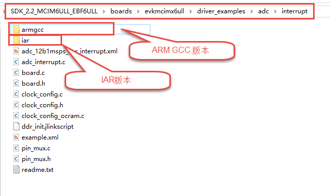
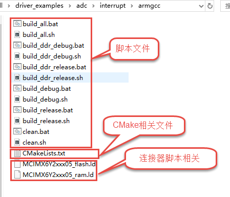
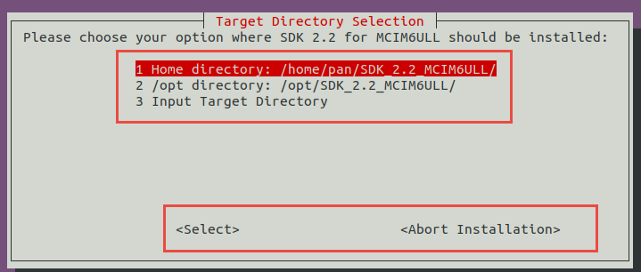
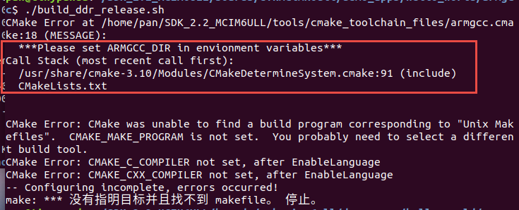
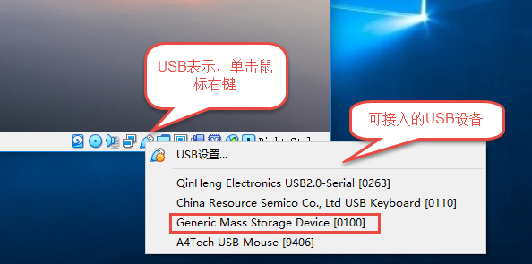
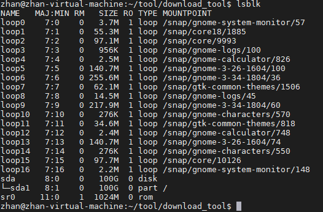
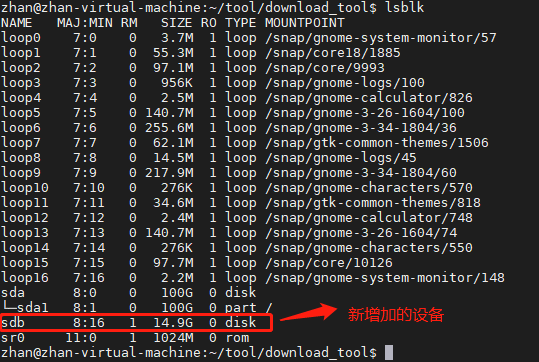
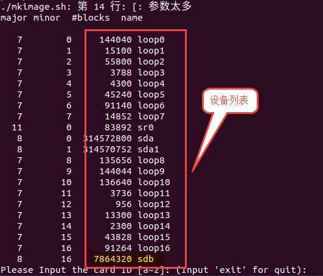
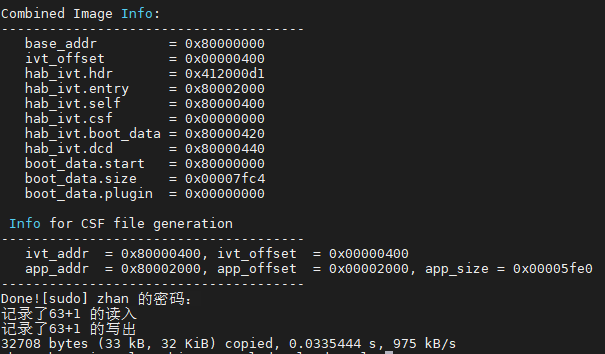
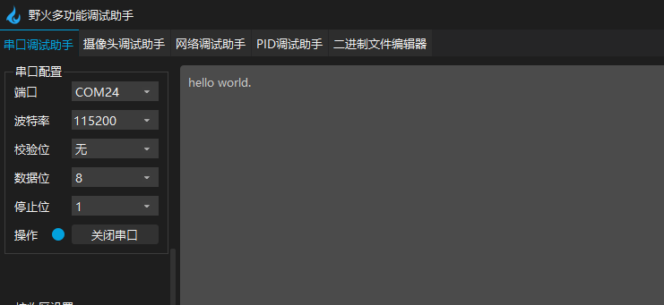

.. vim: syntax=rst

编译下载官方SDK程序到开发板
---------------------------------------------------------------------------

上一章节我们简单介绍了SDK的文件目录结构，这一章节将介绍如何下载官方SDK程序到开发板中，

需要再次说明的是SDK是适配NXP官方评估板的，我们的开发板和官方的SDK存在着细微的差异，但是大部分还是兼容的，
尤其是设置为SD卡启动时，相似度更高。
本章也将会带领大家在linux下编译官方SDK中的"hello world"工程，并烧写到SD卡，最终在我们的开发板上运行。

本章内容并不讲解“hello word”程序如何实现，而是重点讲解在linux下编译SDK工程以及下载到开发板上。
即编译环境的搭建，编译固件、烧写到SD卡的操作流程。

学习目标：

-  能够搭建Linux下编译SDK工程的环境。

-  掌握SDK程序编译、烧写流程，能够烧写SDK例程到开发板。

配套源码以及工具:

-  NXP 官方SDK
   （路径：**~/embed_linux_tutorial/base_code/bare_metal/sdk_nxp** ）。
-  野火裸机下载工具download_tool
   （路径：**~/embed_linux_tutorial/base_code/bare_metal/download-tool/download-tool.tar.bz2** ）。

SDK程序编译、烧写流程分析
~~~~~~~~~~~~~~~~~~~~~~~~~~~~~~~~~~~~~~~~~~~~~~~~~~~~~~~~~~~~~~~~~~~~~~

学习本章请打开SDK源码目录。打开任意一个工程，可以看到每个工程有两个版本如下所示。

由于我们要在linux下编译、下载，所以我们需要选择armgcc版本工程。打开“armgcc”文件夹如下所示。

可以看到arngcc文件夹下包含很多build_xx脚本，这些脚本用于在linux环境下编译生成.bin 可执行文件，
所以我们需要一个arm gcc交叉编译器。CMakeList.txt用于生成编译过程中需要的Makefile，所以我们还需要一个CMake工具。
以.ld结尾的文件是链接器脚本相关文件，根据运行的脚本不同，脚本会自动调用相应的链接文件。

在linux下搭建SDK编译环境
~~~~~~~~~~~~~~~~~~~~~~~~~~~~~~~~~~~~~~~~~~~~~~~~~~~~~~~~~~~~~~~~

安装CMake工具
^^^^^^^^^^^^^^^^^^^^^^^^^^^^^^^^^^^^^^^^^^^^^

执行以下命令：

.. code-block:: sh
   :linenos:

    sudo apt-get install cmake

安装交叉编译工具
^^^^^^^^^^^^^^^^^^^^^^^^^^^^^^^^^^^^^^^^^^^^^^^^

执行以下命令：

.. code-block:: sh
   :linenos:

   sudo apt-get install gcc-arm-none-eabi

添加临时环境变量，执行以下命令：

.. code-block:: sh
   :linenos:

    export ARMGCC_DIR=/usr

注：使用以上命令添加的环境变量只在当前终端上有效，如果虚拟机重启或者重新打开了终端需要再次执行添加环境变量命令。
该环境变量只有在编译官方SDK时才用得到，需要时动态添加即可。

获取官方SDK文件
^^^^^^^^^^^^^^^^^^^^^^^^^^^^^^^^^^^^^^^^^^^^^^^^^^^^^^^^^^^^^^^

官方SDK提供了Windows版本和Linux版本，两者在功能上并没有什么差别，但编码上稍有不同，比如Linux下键盘的“Enter”是“\n”,而Windows下键盘的“Enter”键是“\r\n”。为避免编码带来问题，我们选用Linux下的SDK。SDK可以参照上一章从NXP官网直接下载，也可以
直接使用我们下载好的Linux版的SDK。

使用共享文件夹将“SDK_2.2_MCIM6ULL_RFP_Linux.run” 拷贝到Linux下，存放位置
自定。然后运行.run文件生成SDK，若无法运行可尝试修改.run文件的权限，linux下的源文件命令如下。

.. code-block:: sh
   :linenos:

    sudo ./ SDK_2.2_MCIM6ULL_RFP_Linux.run

注：运行SDK_xxx_xxx.run时可能会出现输入SDK_xxx_xxx.run时“tab”键无法自动补齐，并且手动输入完整文件名也不能运行。原因大多是当前用户没有SDK_xxx_xxx.run文件的执行权限。修改SDK_xxx_xxx.run文件的执行权限即可。

SDK_xxx_xxx.run运行后会弹出图形化的界面，不过鼠标无法对界面上的选项进行操作，只能通过键盘上的方向键选择。例如在路径选择界面如下所示。

我们通过“上下”方向键选择生成的SDK文件保存位置。“左右”方
向键选择“Select”或“Abort Installation”。需要说明的是图 46-3中选项1表示生成的SDK保存在
你当前登录的用户文件夹下，不同用户路径不同。

SDK_xxx_xxx.run运行结束后会在我们制定的目录生成Linux下的SDK。

执行编译
^^^^^^^^^^^^^^^^^^^^^^^^^^^^^^^^

Linux下的SDK生成后，进入工程文件，
“ **SDK_2.2_MCIM6ULL/boards/evkmcimx6ull/demo_apps/hello_world/armgcc** ”
运行build_ddr_release.sh脚本，命令如下：

.. code-block:: sh
   :linenos:

    ./build_ddr_release.sh

build_ddr_release.sh用于生成*.bin文件，运行成功后会在当前文件夹下生成“ddr_release”文件夹，
在文件夹中存在一个sdk20-app.bin文件，将sdk20-app.bin放到SD卡程序并不能直接运行，
根据存储设备不同还要在sdk20-app.bin添加相应的头部信息然后才能在开发板上运行。

注：运行build_ddr_release.sh常见错误如下所示。

从错误提示不难看出，错误原因是没
有添加ARMGCC_DIR环境变量，根据之前讲解添加环境变量
命令“export ARMGCC_DIR=/usr”只在当前端口有效，所以在当前端口再次执行命令

.. code-block:: sh
   :linenos:

   export ARMGCC_DIR=/usr

添加环境变量即可(不建议将环境变量添加到系统环境变量中，因为该环境变量只有编译官方SDK程序才用的到，
后面章节主要是自己写程序，若编译还是错误，在运行./build_ddr_release.sh 前先运行./clean.sh 清除之前编译的内容)。

烧写到SD卡
^^^^^^^^^^^^^^^^^^^^^^^^^^^^^^^^^^^^^^^^^^^^^^^^

配套源码以及工具:

上一步生成的.bin文件并不能直接放到开发板上执行，因为缺少必要的头部信息。
在SDK中“SDK_2.2_MCIM6ULL\tools\imgutil”下readme.txt文件介绍了添加头部信息的步骤，
如果使用官方介绍的步骤会比较繁琐，我们提供了“embedfire_download”烧写工具
(路径：**~/embed_linux_tutorial/base_code/bare_metal/download-tool/download-tool.tar.bz2** )。
下面将基于该烧写工具讲解添加头部信息以及烧写步骤。

“embedfire_download”烧写工具集成了添加头文件和烧写到SD卡等步骤。详细介绍如下：

硬件要求：

-  一张空的SD卡，容量不限，使用前请提前备份您的SD卡内容，因为烧写时会直接写入扇区，SD卡中原来内容会被破坏。

-  一个读卡器。

将内存卡连接到虚拟机
''''''''''''''''''''''''''

将USB读卡器插入电脑后，默认连接到主机，将鼠标放到USB图标上（虚拟机右下角状态栏），
单击鼠标右键如下所示，选择将读卡器连接到虚拟机上。

如何确定那个是USB读卡器？我们可以比较拔出和插入USB读卡器时列表中的内容从而确定那个是USB读卡器。
在插入读卡器之前使用

.. code-block:: sh
   :linenos:

   lsblk

查看当前虚拟机上块设备的情况。

在将读卡器连接到虚拟机之后，再次使用lsblk查看，增加出来的设备就是我们内存卡的标识名。

打开烧写工具执行烧写
''''''''''''''''''''''''''

将烧写工具拷贝到虚拟机，放到合适位置（存放位置没有要求），使用以下命令对工具进行解压。

.. code-block:: sh
   :linenos:

   tar xvf download_tool.tar.bz2

进入解压后的烧写工具目录，
修改“mkImage.sh”的权限（chmod 777 mkImage.sh），执行如下命令：

.. code-block:: sh
   :linenos:

   ./mkImage.sh <需要烧写的文件所在路径>

烧写命令其实是运行 mkImage.sh脚本，并且将要烧写的.bin文件的路径作为参数，如下所示

.. code-block:: sh
   :linenos:

   ./mkimage.sh ~/boards/evkmcimx6ull/demo_apps/hello_world/armgcc/ddr_release/sdk20-app.bin

将 **~/boards/evkmcimx6ull/demo_apps/hello_world/armgcc/ddr_release/sdk20-app.bin** 替换成自己所生产的文件路径，
执行该命令后会列出可烧写的磁盘。如下所示。

没有确定哪个是SD，不要执行烧写！！！选错设备，可能导致电脑数据被破坏！！！！

在我的虚拟机上SD卡的设备名称是“sdb”所以输入“b”即可。如果是“sdc”则输入“c”，根据自己的SD卡设备名来确定具体的输入。

写入成功后会有以下提示

实验现象
''''''''''''''''''''''

将开发板的启动选择开关设置为SD卡启动，使用串口调试助手链接开发板的串口1，将SD卡插入开发板，
启动后正常情况下可以在串口调试助手中看到开发板发出的“hello world”.如图所示：

