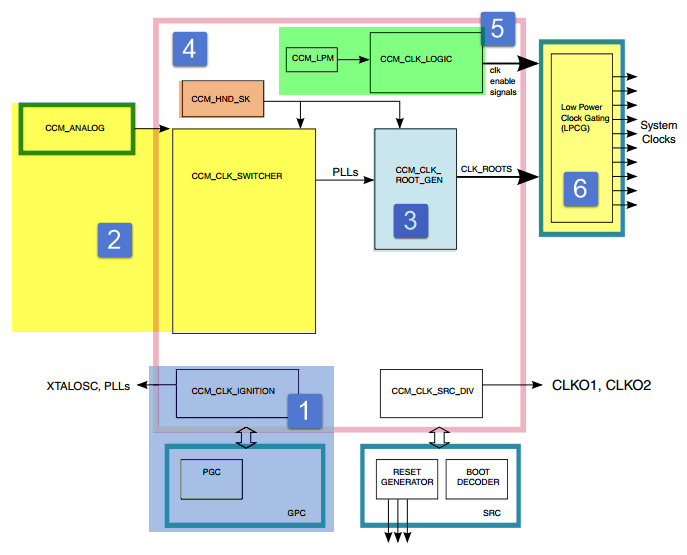
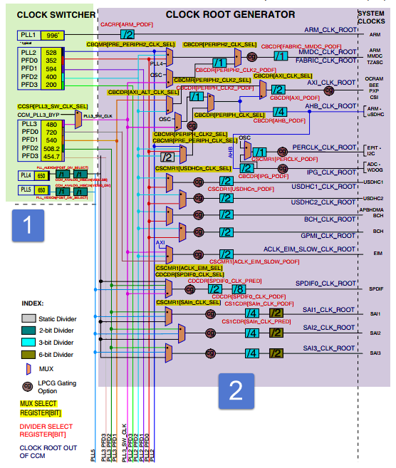
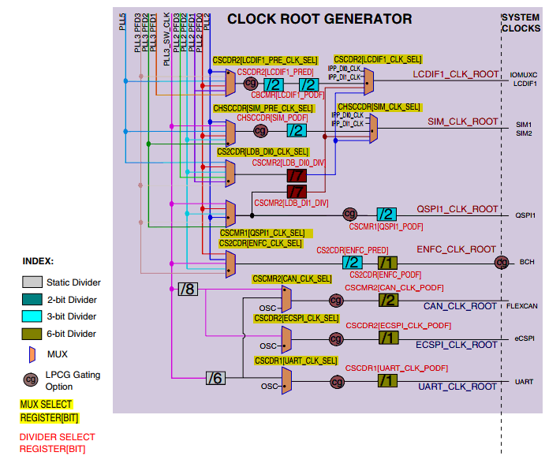
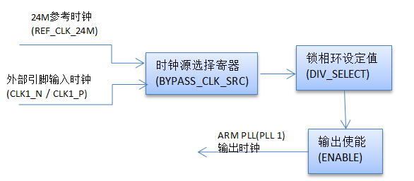
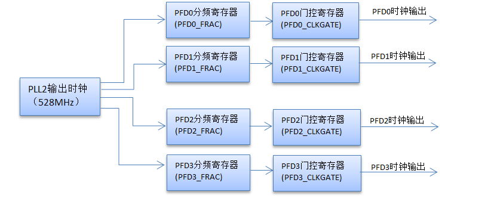
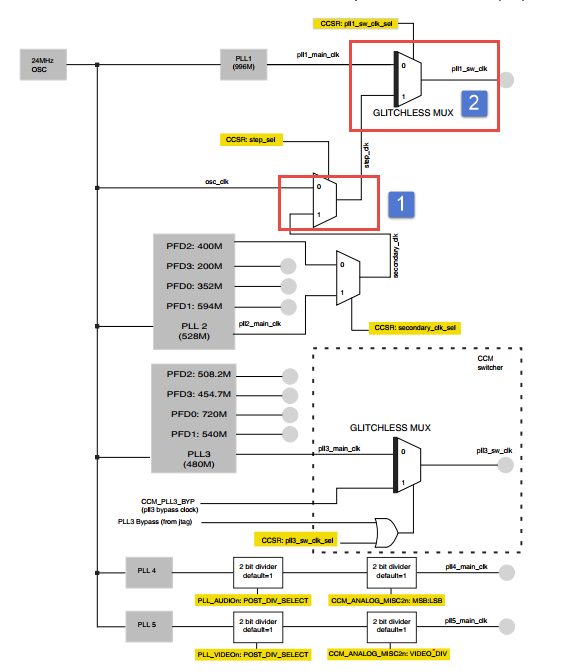
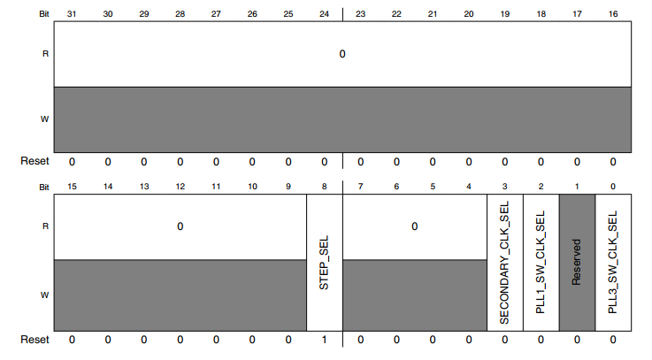
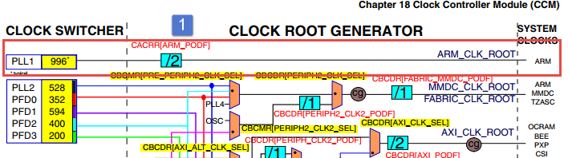
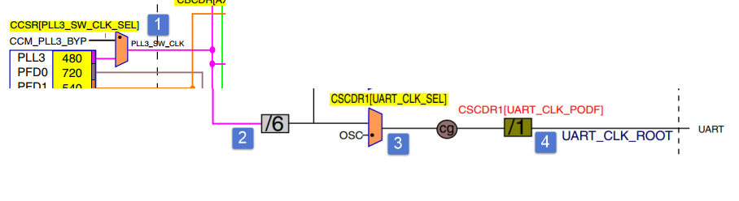

.. vim: syntax=rst

时钟控制模块（CCM）
-------------------------------------------------------

本章参考资料：《IMX6ULRM》（参考手册）。

学习本章时，配合《IMX6ULRM》第18章Clock Controller Module (CCM)，效果会更佳，特别是涉及到寄存器说明的部分。

本章我们主要讲解时钟部分，芯片内部的各个设备都在时钟的驱动下运行，了解整个芯片的时钟树、时钟配置，那么对i.MX 6U的一切时钟的来龙去脉都会了如指掌。

时钟控制模块（CCM）的主要作用

配套源码以及下载工具:
-  路径：~/embed_linux_tutorial/base_code/bare_metal/clock_init
-  野火裸机下载工具download_tool（路
   径：~/embed_linux_tutorial/base_code/bare_metal/download-tool/download-tool.tar.bz2）。

~~~~~~~~~~~~~~~~~~~~~~~~~~~~~~~~~~~~~~~~~~~~~~~~~~~~~~~~~~~~~~~~~~~~~~~~~~~~~~~~

i.MX 6U的时钟系统由时钟控制模块CCM进行控制，其主要功能如下：

-  使用PLL锁相环电路将参考时钟倍频，得到频率更高的时钟。为芯片内核和外设提供
   可选的时钟源。i.MX 6U共有7个PLL锁相环电路，分
   别为 ARM PLL(PLL 1)、System PLL(PLL 2)、
   USB1 PLL(PLL 3)、Audio PLL(PLL 4)、
   Video PLL(PLL5)ENET PLL(PLL 6)、
   USB2 PLL(PLL 7)。

-  提供PLL控制寄存器、时钟选择寄存器、时钟分频寄存器 灵活控制输出到外设和内核的时钟频率。

-  控制低功耗机构。

①CCM_CLK_IGNITION模块
''''''''''''''''''''''''''''''''''''''''''''''''''''''''''''''''''''''''''''

管理从外部晶振时钟到稳定的根时钟输出的整个过程。CCM完成重置之后CCM_CLK_IGNITION模块立即启动。GPC是General Power
Controller的缩写，即总电源管理模块，它不属于CCM，系统电压与时钟关系密切，简单来说，系统电压影响系统最高的时钟频率，CCM又可以控制总电源管理模块（GPC）进入待机或低功耗状态。相关内容将会在GPC章节详细介绍。

②PLL时钟产生
''''''''''''''''''''''''''''''''''''''''''''''''

CCM_ANALOG为CCM的模拟部分，作用是将频率较低的参考时钟（例如24MHz的XTALOSC时钟）使用PLL锁相环电路倍频到更高的时钟。CCM_CLK_SWITCHER模块接收来自CCM_ANALOG模块的锁相环时钟输输出，以及锁相环的旁路时钟，并为CCM_CLK_ROOT_GEN子模块生成切
换时钟输出(pll3_sw_clk)。RT1052共有7个PLL锁相环电路，可以独立配置。其中PLL2与PLL3结合PFD能够输出多个频率可调的时钟。

③根时钟生成
''''''''''''''''''''''''''''''

CCM_CLK_ROOT_GEN接收来自CCM_CLK_SWITCHER模块的PLL或PFD时钟，经过时钟的选择、分频等操作之后产生并输出根时钟。根时钟将会作内核或外设的时钟源。

④时钟同步
'''''''''''''''''''''''''''''''''''

当更改某些时钟的时钟源时需要进行时钟的同步CCM_HND_SK模块用于管理时钟握手，即时钟的同步。

⑤低功耗管理与时钟启用模块
'''''''''''''''''''''''''''''''''''''''''''

CCM_LPM用于管理低功耗模式，管理时钟的开启与关闭。CCM_CLK_LOGIC，根据来自CCM_LPM模块和CCM_IP的信号产生时钟启用或关闭信号。

⑥低功耗时钟门控模块（LPCG）
''''''''''''''''''''''''''''''''''''''''''''''

低功耗时钟门控模块(LPCG)根据CCM_CLK_LOGIC模块输出信号控制时钟输出。时钟越多、频率越高功耗也就越高。关闭没有使用的时钟或降低时钟频率能够有效的降低功耗。

时钟树简介
~~~~~~~~~~~~~~~~~~~~~~~~~~~~~~~~~~~~~~~~

i.MX 6U芯片时钟的结构以时钟树的方式进行描述。当我们设置外设时
钟时大多会参考时钟树进行设置，本章配套程序将以ARM_CLK_ROOT（CPU根时钟）为
例讲解时钟的配置方法。

①PLL与PFD时钟产生
''''''''''''''''''''''''''''''''''''''''''''''''''''''''''''

i.MX 6U外部连接了两个晶振，分别用于提供32.768KHz和24MHz时钟。其中32.768KHz晶振称为
外部低速时钟（CKIL），当芯片上电后要保持该时钟一直处于运行状态，为需要的外设提
供时钟。24Mhz晶振产生的时钟称为外部高速时钟（CKIH），芯片利用内部振荡器产生基准时钟(OSC)，内
部振荡器产生基准时钟(OSC)与外部高速时钟(CKIH)连接，产生24MHz的参考时钟。24MHz参考时钟常用作PLL锁相环电路的输入时钟。

下面以ARM PLL(PLL 1)为例讲解从24MHz参考时钟到ARM PLL(PLL 1)时钟的过程，如下所示。

ARM PLL(PLL 1)只有一个控制寄存器CCM_ANALOG_PLL_ARMn，
 CCM_ANALOG_PLL_ARMn[BYPASS_CLK_SRC]用于选择输入钟源(Fin)，
 一般我们使用24MHz参考时钟，当然也可以选择外部引脚输入
 引脚（CLK1_N /CLK1_P）输入
 的外部时
 钟。CCM_ANALOG_PLL_ARMn[DIV_SELECT]位选
 择锁相环分频值(DIV_SELECT)。取值范围为54到108。输出频率计
 算公式为 ARM_PLL = Fin * DIV_SELECT/2.0。如果选
 择24MHz参
 考
 时钟作为时钟输入，DIV_SELECT选
 择88则ARM PLL的输出
 频率为1056MHz。 CCM_ANALOG_PLL_ARMn[ENABLE]用于配置
 是否
 使能ARM PLL输出，如果
 要使用ARM PLL就需要将该位设置为1 。

从上图中可以看出，PLL2与PLL3下方各
有一组PFD。PFD是Phase Fractional Dividers的
缩写，我们这里翻译为分数分频。PFD的频率由PLL2或PLL3输出
频率分频产生。我们以PLL2产生PFD0~PFD3讲解PFD的产生过程，如下所示。

寄存器CCM_ANALOG_PFD_528n用于控制PFD0~PFD3的输出频率。以PFD0为例，CCM_ANALOG_PFD_528n[PFD0_FRAC]用于设置分频值，取值范围为12到35，PFD0的输出频率计算公式为：

PFD0_out =528*18/ PFD0_FRAC

如果PFD0_FRAC = 27，PFD0的输出频率为352MHz。

CCM_ANALOG_PFD_528n[PFD0_CLKGATE]门控寄存器，用于设置是否使能PFD0的输出。

PLL输出时钟和PFD输出时钟经选择和分频后将作为内核或外设的根时钟。

②根时钟生成模块CLOCK ROOT GEN
''''''''''''''''''''''''''''''''''''''''''''''''''''''''''''''''''

根时钟生成模块主要完成两个工作，第一选择时钟，第二设置时钟分频。

时钟选择器（CLOCK
SWITCHER）输出了多个频率不同的PLL时钟和PFD时钟。每个外设时钟通过MUX模块连接到多个PLL时钟输出，每个MUX实际是一个寄存器，用于选择时钟源。时钟分频也是一个寄存器位。总之就是通过配置对应的寄存器为外设选择时钟源并设置时钟频率。具体是那些寄存器？在图中标记的很清楚，根据图中标注可以很容易、灵活的配置时钟。

下面以“ARM_CLK_ROOT”时钟为例讲解，时钟配置步骤。“ARM_CLK_ROOT”时钟是CPU时钟，也就是我们常说的主频。修改该时钟之前首先要将CPU时钟切换到另外一个可用的时钟，修改完成后再切换回来。具体下所示。（图片太大
，图片中的字看不清楚，请查阅《IMX6ULRM》18.5.1 Clock Generation P631页）

上图中，标号①与标号②处是CCSR时钟选择寄存器的两个配置位，用于设置时钟源。这里假设要将CPU时钟修改为792MHz。步骤如下：（具体代码在讲解代码时会介绍）

(1) 配置CCSR寄存器，将 “ARM_CLK_ROOT”时钟切换到osc_clk（24MHz）

..

   CCSR寄存器如下所示：

这里共用到了CCSR寄存器的两个控制位，第一处CCSR[STEP_SEL] 对应
图标号①处，设置CCSR[STEP_SEL] = 0，表示选择24MHz的osc_clk时
钟，osc_clk时钟是固定的，默认我们选择这个时钟。CCSR[STEP_SEL] =
1，表示选择secondary_clk时钟，这个时钟
暂时用不到，不用关心。第二处CCSR[PLL1_SW_CLK_SEL]对应图标
号②处，设置CCSR[PLL1_SW_CLK_SEL] = 0，表示选择pll1_main_clk时钟。CCSR[PLL1_SW_CLK_SEL] =
1，表示选择step_clk时钟。

我们设置CCSR[STEP_SEL] = 0、CCSR[PLL1_SW_CLK_SEL] = 1，这样
CPU时钟源被切换到了24MHz的osc_clk时钟，下一步就
可以修改PLL1的输出时钟。

(2) 修改PLL1输出时钟。

PLL1输出时钟设置方法已经在55.3 时钟树简介，第一小节介绍，这里不再赘述。

(3) 设置CCSR[PLL1_SW_CLK_SEL] = 1，将CPU时钟切换到pll1_main_clk即PLL1输出时钟。

(4) 修改时钟分频。如下所示。

从上8可以看出，从PLL1到“ARM_CLK_ROOT”还要
经过CACRR[ARM_PODF] 时钟分频寄存器。 进过上一步PLL1的输出时
钟被设置为792MHz，所以这里设置CACRR[ARM_PODF] = 0，不分频。

设置系统时钟实验
~~~~~~~~~~~~~~~~~~~~~~~~~~~~~~~~~~~~~~~~~~~~~~~~

系统时钟设置实验代码由“interrupt_init”代码修改得到，本章也只讲解新增部分代码，完整请参考本章配套源码。

硬件设计
^^^^^^^^^^^^^^^^^^^^^^^^^^^^^^^^

本实验只用RGB灯显示大致显示CPU运行速度，没有用到其他外部电路，LED灯硬件电路这里不再介绍。

2. ..
   rubric:: 软件设计 :name: 软件设计 

   9. ..
      rubric:: 添加源文件并修改makefile :name: 添加源文件并修改makefile

拷贝“~/section5/interrupt_init”程序，并重命名为“~/section5/clock_init”。分别在“~/section5/clock_init/device”、“~/section5/clock_init/include”文件夹下添加clock.c、clock.h。添加
了新的源文件，当然要将其添加到makefile 中。

打开“~/section5/clock_init/ device”目录下的“makefile”文件，将clock.o添加到最终目标的依赖中，代码如下所示。

.. code-block:: c
   :caption: 修改makefile
   :linenos:

      all : button.o  led.o system_MCIMX6Y2.o clock.o
      arm-none-eabi-ld -r $^  -o device.o

添加时钟初始化代码
''''''''''''''''''''''''''''''''''''''''''''''''''''''

时钟初始化代码主要实现更改CPU时钟、设置PLL2、PLL3的输出时钟以及对应的PFD时钟。如下所示。

.. code-block:: c
   :caption: 时钟初始化代码
   :linenos:

      /********************第一部分***********************/
       /* 外部 XTAL (OSC) 时钟频率 */
       uint32_t g_xtalFreq = 24000000;
       /*外部 RTC XTAL 时钟频率 */
       uint32_t g_rtcXtalFreq = 32768;
      
       void system_clock_init(void)
       {
       /********************第二部分***********************/
           /******************* PLL 输出时钟设置************************/
           if ((CCM->CCSR & (0x01 << 2)) == 0) //CPU 使用的是 ARM PLL
           {
               /*将CPU时钟切换到XTAL (OSC) 时钟*/                   
          CCM->CCSR &= ~(0x01 << 8); //控制CCSR: step_sel ，选择 osc_clk 作为时钟源
            CCM->CCSR |= (0x01 << 2); //设置GLITCHLESS MUX 选择 step_clk 作为时钟源
           }
      
       /********************第三部分***********************/
           /*设置PLL1输出时钟为792MHz，它将作为CPU时钟*/
           CCM_ANALOG->PLL_ARM |= (0x42 << 0);
      
           /*将CPU 时钟重新切换到 ARM PLL*/
           CCM->CCSR &= ~(0x01 << 2);
           /*设置时钟分频系数为0，即不分频*/
           CCM->CACRR &= ~(0x07 << 0); //清零分频寄存器   30秒大约闪烁45次
           // CCM->CACRR |= (0x07 << 0); //清零分频寄存器 30秒大约闪烁20次
      
      
       /********************第四部分***********************/
           /*设置PLL2(System PLL) 输出时钟*/
           /* Configure SYS PLL to 528M */
           CCM_ANALOG->PLL_SYS_SS &= ~(0x8000);     //使能PLL2 PFD输出
           CCM_ANALOG->PLL_SYS_NUM &= ~(0x3FFFFFFF);//设置分频系数为0，即不分频。
           CCM_ANALOG->PLL_SYS |= (0x2000); //使能PLL2 输出
           CCM_ANALOG->PLL_SYS |= (1 << 0); //设置输出频率为528M
           while ((CCM_ANALOG->PLL_SYS & (0x80000000)) == 0) //等待设置生效
           {
           }
      
           /*设置PLL3(System PLL) 输出时钟*/
           /* Configure USB PLL to 480M */
           CCM_ANALOG->PLL_USB1 |= (0x2000);    //使能 PLL3时钟输出
           CCM_ANALOG->PLL_USB1 |= (0x1000);    //PLL3上电使能
           CCM_ANALOG->PLL_USB1 |= (0x40);      // 使能USBPHYn
           CCM_ANALOG->PLL_USB1 &= ~(0x01 << 0);//设置输出频率为480MHz
           while ((CCM_ANALOG->PLL_SYS & (0x80000000)) == 0)//等待设置生效
           {
           }
      
           /*关闭暂时不使用的 PLL4 、PLL5  、PLL6 、PLL7*/
           CCM_ANALOG->PLL_AUDIO = (0x1000);    //关闭PLL4
           CCM_ANALOG->PLL_VIDEO = (0x1000);    //关闭PLL5
           CCM_ANALOG->PLL_ENET =  (0x1000);    //关闭PLL6
           CCM_ANALOG->PLL_USB2 =  (0x00);           //关闭PLL7
      
      
        /********************第五部分***********************/
           /******************PFD 输出时钟设置*******************/
           /*禁用PLL2 的所有PFD输出*/
           CCM_ANALOG->PFD_528 |=(0x80U) ;      //关闭PLL2 PFD0
           CCM_ANALOG->PFD_528 |=(0x8000U) ;    //关闭PLL2 PFD1
           // CCM_ANALOG->PFD_528 |=(0x800000U) ;  //关闭PLL2 PFD2 ,
                                    DDR使用的是该时钟源，关闭后程序不能运行。暂时不关闭
           CCM_ANALOG->PFD_528 |=(0x80000000U); //关闭PLL2 PFD3
      
           /*设置PLL2 的PFD输出频率*/
           CCM_ANALOG->PFD_528 &= ~(0x3FU); //清零PLL2 PFD0 时钟分频
           CCM_ANALOG->PFD_528 &= ~(0x3F00U); //清零PLL2 PFD1 时钟分频
           CCM_ANALOG->PFD_528 &= ~(0x3F00U); //清零PLL2 PFD2 时钟分频
           CCM_ANALOG->PFD_528 &= ~(0x3F00U); //清零PLL2 PFD3 时钟分频
      
           CCM_ANALOG->PFD_528 |= (0x1B << 0); //设置PLL2 PFD0 输出频率为 352M
           CCM_ANALOG->PFD_528 |= (0x10 << 8); //设置PLL2 PFD0 输出频率为 594M
           CCM_ANALOG->PFD_528 |= (0x18 << 16); //设置PLL2 PFD0 输出频率为 396M
           CCM_ANALOG->PFD_528 |= (0x30 << 24); //设置PLL2 PFD0 输出频率为 198M
      
           /*启用PLL2 的所有PFD输出*/
           CCM_ANALOG->PFD_528 &= ~(0x80U) ;      //开启PLL2 PFD0
           CCM_ANALOG->PFD_528 &= ~(0x8000U) ;    //开启PLL2 PFD1
           CCM_ANALOG->PFD_528 &= ~(0x800000U) ;  //开启PLL2 PFD2
           CCM_ANALOG->PFD_528 &= ~(0x80000000U); //开启PLL2 PFD3
      
      
       /********************第六部分***********************/
           /*禁用PLL3 的所有PFD输出*/
           CCM_ANALOG->PFD_480 |=(0x80U) ;      //关闭PLL3 PFD0
           CCM_ANALOG->PFD_480 |=(0x8000U) ;    //关闭PLL3 PFD1
           CCM_ANALOG->PFD_480 |=(0x800000U) ;  //关闭PLL3 PFD2
           CCM_ANALOG->PFD_480 |=(0x80000000U); //关闭PLL3 PFD3
      
           /*设置PLL3 的PFD输出频率*/
           CCM_ANALOG->PFD_480 &= ~(0x3FU);   //清零PLL3 PFD0 时钟分频
           CCM_ANALOG->PFD_480 &= ~(0x3F00U); //清零PLL3 PFD1 时钟分频
           CCM_ANALOG->PFD_480 &= ~(0x3F00U); //清零PLL3 PFD2 时钟分频
           CCM_ANALOG->PFD_480 &= ~(0x3F00U); //清零PLL3 PFD3 时钟分频
      
           CCM_ANALOG->PFD_480 |= (0xC << 0); //设置PLL3 PFD0 输出频率为 720M
           CCM_ANALOG->PFD_480 |= (0x10 << 8); //设置PLL3 PFD0 输出频率为 540M
           CCM_ANALOG->PFD_480 |= (0x11 << 16); //设置PLL3 PFD0 输出频率为 508.2M
           CCM_ANALOG->PFD_480 |= (0x13 << 24); //设置PLL3 PFD0 输出频率为 454.7M
      
           /*启用PLL3 的所有PFD输出*/
           CCM_ANALOG->PFD_480 &= ~(0x80U) ;      //开启PLL3 PFD0
           CCM_ANALOG->PFD_480 &= ~(0x8000U) ;    //开启PLL3 PFD1
           CCM_ANALOG->PFD_480 &= ~(0x800000U) ;  //开启PLL3 PFD2
           CCM_ANALOG->PFD_480 &= ~(0x80000000U); //开启PLL3 PFD3
      
       /********************第七部分***********************/
           /******************常用外设根时钟设置****************/
           CCM->CSCDR1 &= ~(0x01 << 6); //设置UART选择 PLL3 / 6 = 80MHz
           CCM->CSCDR1 &= ~(0x3F);     //清零
           /*设置串口根时钟分频值为1，UART根时钟频率为：80M / (dev + 1) = 40MHz*/
           CCM->CSCDR1 |= (0x01 << 0); //
       }

代码很长，但很简单，只修改了几个时钟配置寄存。结合代码各部分讲解如下。

-  第一部分，定义变量g_xtalFreq 、g_rtcXtalFreq分别
   保存XTAL (OSC)时钟 、RTC XTAL时钟。这两个时钟频率后面章节会用到。

-  第二部分和第三部分。设置CPU时钟频率。这部分内容对应时钟树
   简介章节第二部分。简单说明如下：第二部分代码首先判断当CPU时钟是否
   使用pll1_main_clk，如果是，则将其切换到osc_clk时钟。第三部分，修改PLL1输出频率，并将CPU时钟
   源切换到pll1_main_clk。

-  第四部分，设置PLL2~PLL7的输出频率。其
   中PLL2的时钟被设置为528M并开启了PFD输出功能。PLL3的时钟
   被设置为480M并开启了PFD输出功能。PLL4~PLL7我们暂时用不到，直接关
   闭时钟输出。关闭不使用的时钟能够有效的减少功耗。

-  第五部分，设置PLL2的PFD输出。PLL2共有4个PFD输出（PFD0~PFD3）,PLL2的PFD设置
   通过CCM_ANALOG_PFD_528n寄存器实现，如下所示。

.. image:: media/CCM010.png
   :align: center
   :alt: 未找到图片

这里不再介绍CCM_ANALOG_PFD_528寄存器的各个位的作用，结合代码或
者参考《IMX6ULRM》手册Chapter 18 Clock Controller Module (CCM)寄存器介
绍部分很容易知道各个位的作用。初学者不必纠结每个控制位的作用，只需要知道这个寄存器有设置PLL2
的FPD输出功能即可。具体使用到时查手册即可。

PLL2的PFD输出大致分为三部分，第一，禁用PLL2的PFD输出。第二，设
置PFD的输出频率。第三 ，启用PFD输出。特别注意的是这里没有禁用PFD2，因为这
是DDR的时钟源。关闭后程序无法运行。

-  第六部分，设置PLL3的PFD输出，设置方法与设置PLL2的PFD输出完全相同，只是这里设置的是CCM_ANALOG_PFD_480时钟。

-  第七部分，设置串口的根时钟。这里只设置
   了串口，其他外设的时钟频率呢？在BOOT ROM中已经初始化了部
   分外设的时钟，为减少难度，那些没有使用到的外设或者对频率没有严格要求的外
   设我们暂时保持默认的时钟频率。这里设置UART根时钟的目的是以UART为例讲解如何设置外设时钟。UART时钟源产生路径如下所示。

从图中可以看出，从PLL时钟到UART时钟共用用到了两个时钟选择寄存器（标号①和③），两个时钟分频寄存器（标号②和标号④）。我们最终目的是将PLL3时钟作为UART根时钟（UART_CLK_ROOT）的根时钟。按照标号顺序讲解如下：

(1) 标号①选择PLL3时钟还是CCM_PLL3_BYP。我们选
择PLL3输出时钟，寄存器CCSR[PLL3_SW_CLK_SEL] = 0，则表
示选择PLL3时钟。默认情况下是这样设置的。所以我们代码中并没有设置该寄存器。

(2) 标号②设置时钟分频，根据之前的设置，PLL3的输出
频率为480MHz ，这里的时钟分频是固定的6分频，经过分频后的时钟为 480MHz / 6 = 80MHz。

(3) 标号③ 再次选择时钟源。一个是PLL3分频得
到的80MH时钟，另外一个是OSC时钟即24MHz的系统参考时钟。
设置 CSCDR1[UART_CLK_SEL] = 0，选择第一个（80MHz）时钟。

(4) 标号④再次进行时钟分频。这是一个6位的时钟分频
寄存器。分频值为CSCDR1[UART_CLK_PODF]寄存器值加一。程序中将其设
置为1，则分频系数为2，UART_CLK_ROOT时钟频率实际为80MHz / 2 = 40MHz 。

    11.
    ..
    rubric:: 添加简易测试代码 :name: 添加简易测试代码

由于程序中只有按键和RGB灯，所以我们暂时使用RGB灯闪烁频率大致判断程序运行速度。测试代码如下所示。

.. code-block:: c
   :caption: 测试代码
   :linenos:

      /*简单延时函数*/
       void delay(uint32_t count)
       {
           volatile uint32_t i = 0;
           for (i = 0; i < count; ++i)
           {
               __asm("NOP"); /* 调用nop空指令 */
           }
       }
      
      
       int main()
       {
           system_clock_init();  //初始化系统时钟
           rgb_led_init();      //初始化 RGB 灯，初始化后 默认所有灯都不亮。
      
           while (1)
           {
               red_led_off;
               green_led_on;
               delay(0xFFFFF);
      
               green_led_off;
               red_led_on;
               delay(0xFFFFF); 
           }
           return 0;
       }

测试代码很简单，编写一个简易延时函数。在while(1)中控制RGB闪烁。我么可以CPU时钟分频，如下所示。

.. code-block:: c
   :caption: 时钟分频设置
   :linenos:

      void system_clock_init(void)
       {
           /******************* PLL 输出时钟设置************************/
           if ((CCM->CCSR & (0x01 << 2)) == 0) //CPU 使用的是 ARM PLL
           {
               /*将CPU时钟切换到XTAL (OSC) 时钟*/                   
               CCM->CCSR &= ~(0x01 << 8); //控制CCSR: step_sel ，选择 osc_clk 作为时钟源
               CCM->CCSR |= (0x01 << 2);  //设置GLITCHLESS MUX 选择 step_clk 作为时钟源
           }
      
           /*设置PLL1输出时钟为792MHz，它将作为CPU时钟*/
           CCM_ANALOG->PLL_ARM |= (0x42 << 0);
      
           /*将CPU 时钟重新切换到 ARM PLL*/
           CCM->CCSR &= ~(0x01 << 2);
      
           /*设置时钟分频系数为0，即不分频*/
           CCM->CACRR &= ~(0x07 << 0); //清零分频寄存器   不分频
           //CCM->CACRR |= (0x07 << 0);     // 8分频
      
           /**************以下省略*****************/
       }

通过修改时钟分频寄存器修改CPU时钟频率。我们可以对比部分频和8分频的实验效果。

下载验证
''''''''''''''''''''''''

程序编写完成后，在"/section5/ clock_init" 文件夹
下执行make命令，makefile工具便会自动完成程序的编译、链接、格式转
换等工作。正常情况下我们可以在当前目录看到生成的一些中间文件以及我们期待的.bin文件。

在编译下载官方SDK程序到开发板章节我们详细讲解了如何将二进制文件烧写到SD卡（烧写工具自动实现为二进制文件添加头）。这里再次说明下载步骤。

-  将一张空SD卡（烧写一定会破坏SD卡中原有数据！！！烧写前请保存好SD卡中的数据），接入电脑后在虚拟机的右下角状态栏找到对应的SD卡。将其链接到虚拟机。

-  进入烧写工具目录，执行"./mkimage.sh <烧写文件路径>"命令,例如要
   烧写的led.bin位于home目录下，则烧写命令为"./mkimage.sh /home/led.bin"。

-  执行上一步后会列出linux下可烧写的磁盘，选择你插入的SD卡即可。这一步
   非常危险！！！一定要确定选择的是你插入的SD卡！！，如果选错很可能破坏你电脑
   磁盘内容，造成数据损坏！！！。确定磁盘后SD卡以"sd"开头，选择"sd"后面的字符即可。例如要烧写的sd卡是"sdb"则输入"b"即可。

烧写完成，首先将开发板启动方式设置为SD卡启动，将SD卡插入开发板卡槽。接通电源正常可以看到RGB灯闪烁，修改CPU时钟再次下载可以看到RGB灯闪烁频率加快。

.. |CCM010| image:: media/CCM010.png
   :width: 5.76736in
   :height: 5.40694in

