.. vim: syntax=rst

DDR测试
------------------------------

本章参考资料：《IMX6ULRM》（参考手册）。

学习本章时，配合
《IMX6ULRM》Chapter 33: Multi Mode DDR Controller (MMDC) (U一
起阅读，效果会更佳，特别是涉及到寄存器说明的部分。

特别说明，本书内容是以i.MX 6U系列控制器资源讲解。

配套源码以及下载工具:
-  路径：~/embed_linux_tutorial/base_code/bare_metal/DDR_test
-  野火裸机下载工具download_tool（路径：~/embed_linux_tutorial/base_code/bare_metal/download-tool/download-tool.tar.bz2）。

常用RAM存储设备简介
~~~~~~~~~~~

RAM是“Random Access Memory”的缩写，被译为随
机存储器。所谓“随机存取”，指的是当存储器中的消息被读取或写入时，所需要的
时间与这段信息所在的位置无关。这个词的由来是因为早期计算机曾使用磁鼓作为存储器，磁鼓
是顺序读写设备，而RAM可随读取其内部任意地址的数据，时间都是相同的，因此
得名。实际上现在RAM已经专门用于指代作为计算机内存的易失性半导体存储器。

根据RAM的存储机制，又分为动态随机存储器DRAM(Dynamic RAM)以及静态随机存储器SRAM(Static RAM)两种。

DRAM
^^^^

动态随机存储器DRAM的存储单元以电容的电荷来表示数据，有电荷代表1，无电荷代表0，如下图所示。但时间一长，代表1的电容会放电，代表0的电容会吸收电荷，因此它需要定期刷新操作，这就是“动态(Dynamic)”一词所形容的特性。刷新操作会对电容进行检查，若电量大于满电量的1/2，则认为其代表1，并把电容充满电；若电量小于1/2，则认为其代表0，并把电容放电，藉此来保证数据的正确性。

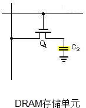

SDRAM
'''''

根据DRAM的通讯方式，又分为同步和异步两种，这两种方式根据通讯时是否需要使用时钟信号来区分。下图是一种利用时钟进行同步的通讯时序，它在时钟的上升沿表示有效数据。

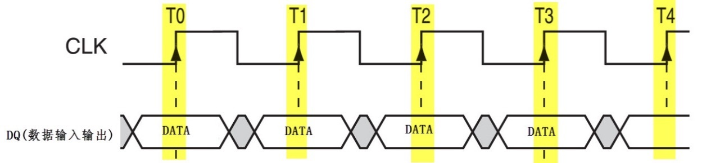

由于使用时钟同步的通讯速度更快，所以同步DRAM使用更为广泛，这种DRAM被称为SDRAM(Synchronous DRAM)。

DDR SDRAM
'''''''''

为了进一步提高SDRAM的通讯速度，人们设计了DDR SDRAM存
储器(Double Data Rate SDRAM)。它的存储特性与SDRAM没有区别，但SDRAM只在
上升沿表示有效数据，在1个时钟周期内，只能表示1个有数据；而DDR
SDRAM在时钟的上升沿及下降沿各表示一个数据，也就是说在1个时钟周期内可以表示2数据，在时钟频率同样的情况下，提高了一倍的速度。至于DDRII和DDRIII，它们的通讯方式并没有区别，主要是通讯同步时钟的频率提高了。

当前个人计算机常用的内存条是DDRIII SDRAM存储器，在一个内存条上包含多个DDRIII SDRAM芯片。

SRAM
''''

静态随机存储器SRAM的存储单元以锁存器来存储数据，见下图。这种电路结构不需要定时刷新充电，就能保持状态(当然，如果断电了，数据还是会丢失的)，所以这种存储器被称为“静态(Static)”RAM。

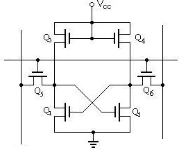

同样地，SRAM根据其通讯方式也分为同步(SSRAM)和异步SRAM，相对来说，异步SRAM用得较多。

DRAM与SRAM的应用场合
^^^^^^^^^^^^^^^^^^^^^^^^^^^^^^^^^^^^^^^^^^^^^^^^^^^^^^^^^^^^^^^^^^^^^^

对比DRAM与SRAM的结构，可知DRAM的结构简单得多，所以生产相同容量的存储器，DRAM的成本要更低，且集成度更高。而DRAM中的电容结构则决定了它的存取速度不如SRAM，特性对比下表。

表  DRAM与SRAM对比

============ ==== ====
特性         DRAM SRAM
============ ==== ====
存取速度     较慢 较快
集成度       较高 较低
生产成本     较低 较高
是否需要刷新 是   否
============ ==== ====

所以在实际应用场合中，SRAM一般只用于CPU内部的高速缓存(Cache)，而外部扩展的内存一般使用DRAM。

DDR简介
~~~~~~~~~~~~~~~~~~~~~~~~~~~~~~~~~~~

DDR结构框图简介
^^^^^^^^^^^^^^^^^^^^^^^^^^^^^^^^^^^^^^^^^^^^^^^^^^^^^^

i.MX 6U 芯片可以通过MMDC接口外接DDR内存芯片，在程序
中DDR作为主内存。DDR与STM32中常用的SDRAM非常相似，读者可先阅读
野火stm32教程的SDRAM介绍会更容易理解DDR。本小节以发板使用的“MT41K256M16”DDR3L芯
片为例讲解DDR，其他型号DDR类似。MT41
K256M16芯片原理框图如下图所示。

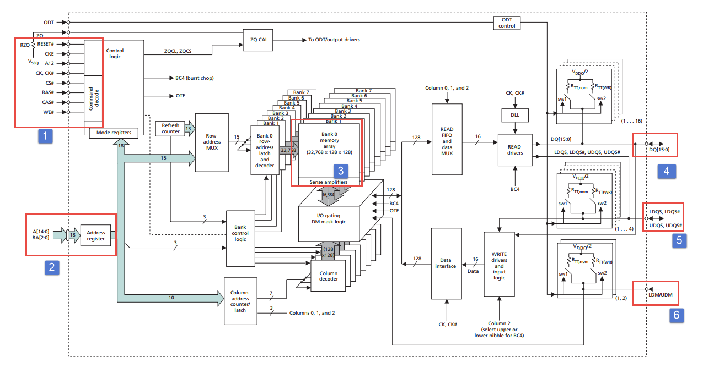

①DDR的信号线
''''''''''''''''''''''''''''''''''''''''''''''''''''''''

上图中标号①、②、③、、处表示的是DDR芯片的控制引脚，其说明见下表。

表 SDRAM控制引脚说明

======== ==== =======================================================================================
信号线   类型 说明
======== ==== =======================================================================================
CK, CK#  I    同步时钟信号，所有输入信号都在CK, CK#两个互补始终的交汇点被采集
CKE      I    时钟使能信号。
CS#      I    片选信号，低电平有效
CAS#     I    列地址选通，为低电平时地址线表示的是列地址
RAS#     I    行地址选通，为低电平时地址线表示的是行地址
WE#      I    写入使能，低电平有效
ODT      I    高电平，使能芯片内部终端电阻（对部分引脚有效）。低电平，禁用芯片内部终端电阻。
A12/BC   I    当在模式寄存器(MR)中启用时，在读取和写入命令期间对A12进行采样，已决定是否执行Burst Chop
ZQ       R    输出驱动校准的外部引脚，该引脚与外接240欧姆下拉电阻。
RESET#   I    复位引脚，低电平有效（产生复位）。
LDQM     I    数据输入/输出掩码信号，表示DQ信号线的有效部分

UDQM          BA[0:2]  I    Bank地址输入，选择要控制的Bank A[0:14]  I    地址输入 DQ[0:15] I/O  数据输入输出信号 ======== ====
=======================================================================================

DDR引脚说明如下：

控制逻辑

标号①处的DDR内部的“控制逻辑”，它指挥着整个系统的
运行，外部可通过CS、WE、CAS、RAS以及地址线来向控制逻
辑输入命令，命令经过“命令器译码器”（Command Decoder）译码，并
将控制参数保存到“模式寄存器中”（Mode Register），控制逻辑依此运行。

地址控制

标号②处是地址线和Bank选择线。地址线A[0:15]共16条，包括行地址和列地址线，其中A[0:15]用作行地址，A[0:9]还用作列地址。。DDR将整个存储区域分为8个bank，如标号④所示，通过BA[0:2]确定操作的bank。

数据线

标号④、⑤、⑥是数据输入、输出相关引脚。标号④是16根数据线，用于数据的输入和输出。标号⑤，DDR的数据选通引脚，读DDR时该引脚用作输出，写DDR时该引脚用作输入。标号⑥，写数据屏蔽引脚，用作写入时，屏蔽DDR数据线上的信息，不执行写入。

③DDR的存储阵列
''''''''''''''''''''''''''''''''''''''''''''''''''''''

标号③处的结构是DDR的存储单元阵列。本DDR包含8个阵列，外部设备使用BA[2:0]地址线对这些阵列进行访问，每个存储阵列的内部结构具体见下图。

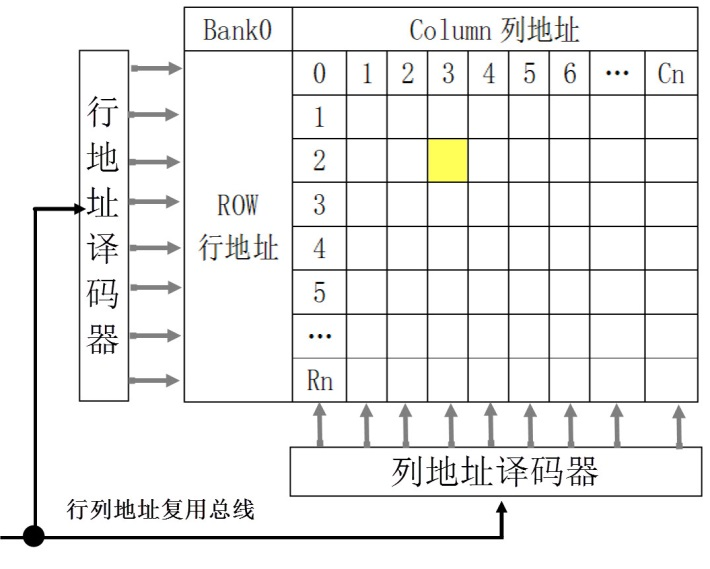

DDR内部包含的存储阵列，可以把它理解成一张表格，数据就填在这张表格上。和表格查找一样，指定一个行地址和列地址，就可以精确地找到目标单元格，这是DDR芯片寻址的基本原理。这样的每个单元格被称为存储单元，而这样的表就是存储阵列(Bank)。。

DDR主要性能参数
^^^^^^^^^^^^^^^^^^^^^^^^^^^^^^^^^^^^^^^^^^^^^^^^^^^^^^^^^^^^^^^

DDR的性能参数很多，具体可参考你使用的DDR芯片数据手册，这里以MT41K256M16为例，选取几个常见的参数，完整介绍清参考MT41K256M16芯片数据手册。

DDR数据读延迟-RL、CL和AL

读延时RL是指从“发出读信号”到数据线上输出有效数据这段时间等于CL+ AL。读延时时序图如下所示。

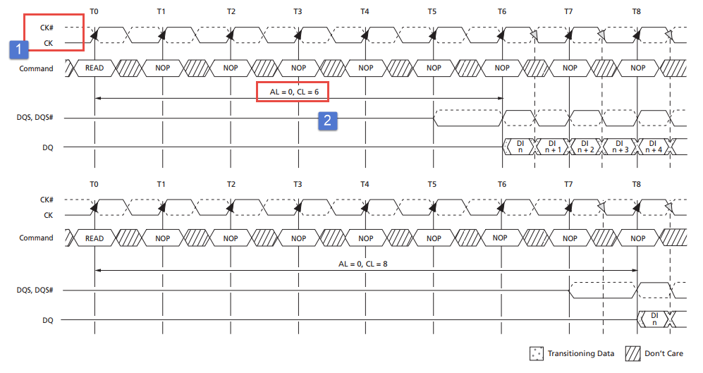

结合上图我们介绍两部分内容，如下所示。

-  标号①处。DDR同步时钟信号。DDR时钟信号与STM32中常用的SDRAM时钟信号不同，SDRAM的时钟信号如下图所示。

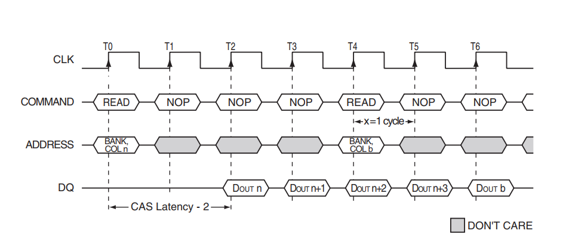

在SDRAM中同步时钟只有CLK，无论数据和命令都只在同步时钟的上升沿进行采样。DDR的同步时钟有两个CK#和CK。两个时钟信号互补输出。命令在CK时钟的上升沿被采样，而数据在CK#与CK的交点处采样。

-  标号②，RL、AL、CL。RL是之前说
   过的“读延迟”。CL是CAS latency缩写。在SDRAM中被称为
   潜伏期，等于BL。在DDR3中RL = AL + CL 。AL是POSTED CAS ADDITIVE latency，的缩写，这里
   译为附加潜伏期。在MT41K256M16中AL =
   0,CL - 1, 或CL – 2。在这里取AL = 0，所以这里RL = CL，我们重点关系CL。

..

   CL被称为“潜伏期”,DDR和SDRAM一样，通过电容存储的电荷(电压)来表示高、低电平，而这个电容不但要定期刷新而且驱动能力很弱，需要放大之后才能将高、低电平输出到数据线，电容的高低电平被放大输出到数据线的过程被称为“读潜伏期”，单位是同步时钟的时钟周期数。CL值是可以设置的，但不能超过系统允许的
   范围。CL的大小直接影响DDR的读、写速度，是DDR的一个重要参数。

行地址与列地址时间间隔- tRCD

我们知道DDR或SDRAM的行地址与列地址复用，读取或写入数据时首先发出行地址，等待tRCD后才能发出列地址。如下图所示。

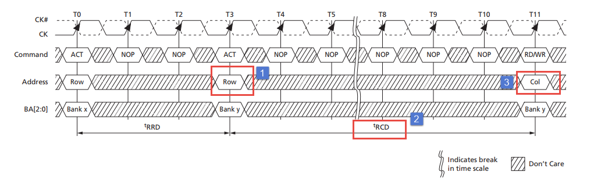

标号①处发出了行地址(Row),等待tRCD（标号②）后发出列地址（Col）。tRCD的单位通常是参考时钟的时钟周期个数。转换成秒需要知道参考时钟的时钟频率。tRCD也是DDR性能的一个重要参数。

预充电有效周期-tRP

根据DDR和SDRAM存储数据的原理，为保证数据不丢失需要定期的刷新，预充电命令就是告诉存储器要刷新数据，刷新期间是不能对DDR进行读、写的。从预充电命令发出到DDR在次可访问（active状态），这段时间被称为tRP。如下图所示。

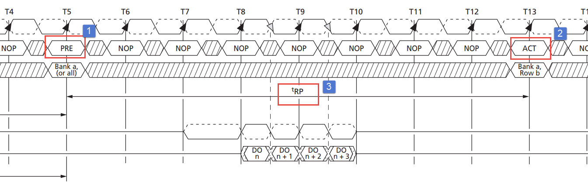

i.MX 6U MMDC接口
~~~~~~~~~~~~~~~~~~~~~~~~~~~~~~~~~~~~~~~~~~~~~~~~~~~~~~~~~~~~~~~~~~~~~~

MMDC接口与STM32的FSMC接口类似，只不过MMDC接口专用于外接DDR，并且MMDC外部引脚不复用。结合MMDC结构体讲解如下，MMDC结构图如下图所示。

.. image:: media/ddr011.png
   :align: center
   :alt: 未找到图片

MMDC由MMDC_CORE和MMDC_PHY组成，时钟以及外部
引脚并没有在途中体现，结合《IMX6ULRM》（参考手册）Chapter 33 Multi Mode DDR Controller (MMDC)章节介绍如下：

MMDC_CORE

MMDC_CORE负责通过axi接口实现DDR命令生成、DDR命令优化和读写数据路径与系统进行通信。控制整个MMDC的功能实现。

MMDC_PHY

MMDC_PHY负责时序调整，它使用特殊校准机制以确保数据被正常收发， 最高支持400 MHz。

MMDC 外部引脚

MMDC外部信号如下表所示。

表  MMDC外部信号

=============== ============================ ================ ========= =========
Signal          Description                  Pad              Mode      Direction
=============== ============================ ================ ========= =========
RAM_ADDR[15:0]  Address Bus Signals          DRAM_A[15:0]     No Muxing O
RAM_CAS         Column Address Strobe Signal DRAM_CAS         No Muxing O
RAM_CS[1:0]     Chip Selects                 DRAM_CS[1:0]     No Muxing O
RAM_DATA[31:0]  Data Bus Signals             DRAM_D[31:0]     No Muxing I/O
RAM_DQM[1:0]    Data Mask Signals            DRAM_DQM[1:0]    No Muxing O
RAM_ODT[1:0]    On-Die Termination Signals   DRAM_SDODT[1:0]  No Muxing O
RAM_RAS         Row Address Strobe Signal    DRAM_RAS         No Muxing O
RAM_RESET       Reset Signal                 DRAM_RESET       No Muxing O
RAM_SDBA[2:0]   Bank Select Signals          DRAM_SDBA[2:0]   No Muxing O
RAM_SDCKE[1:0]  Clock Enable Signals         DRAM_SDCKE[1:0]  No Muxing O
RAM_SDCLK0_N    Negative Clock Signals       DRAM_SDCLK_[1:0] No Muxing O
RAM_SDCLK0_P    Positive Clock Signals       DRAM_SDCLK_[1:0] No Muxing O
RAM_SDQS[1:0]_N Negative DQS Signals         DRAM_SDQS[1:0]_N No Muxing I/O
RAM_SDQS[1:0]_P Positive DQS Signals         DRAM_SDQS[1:0]_P No Muxing I/O
RAM_SDWE        WE signal                    DRAM_SDWE        No Muxing O
RAM_ZQPAD       ZQ signal                    DRAM_ZQPAD       No Muxing O
\
=============== ============================ ================ ========= =========

表 57 2摘自《IMX6ULRM》（参考手册）Table 33-2。表中“RAM_DATA[31:0]”显示
数据线有32条，不清楚为什么是32条，写这部分时没有找到具体说明。查看MMDC外部
引脚更简单的方法是在《IMX6ULRM》（参考手册）Chapter 4 External Signals
and Pin Multiplexing章节查找，MMDC接口的部分引脚如下图所示，（这里只截取了部分引脚，完整内容请查阅《IMX6ULRM》（参考手册））

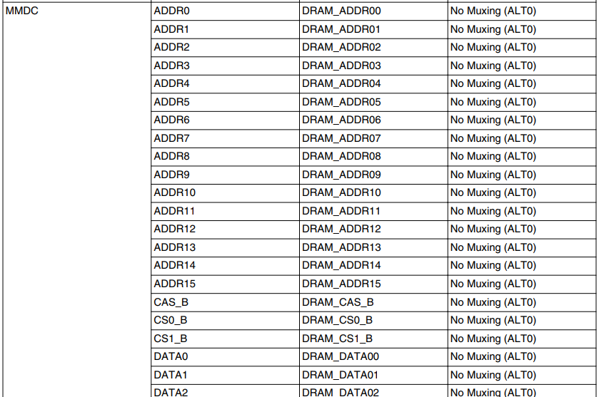

MMDC时钟源

默认情况下PLL2的PFD2时钟输出作为MMDC的根时钟。时钟产生路径如下图所示。

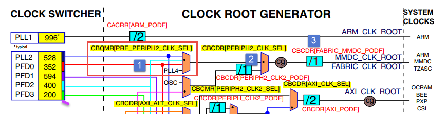

从上图可以看出，PLL2的PFD2经过两个时钟选择寄存器（标号①和②）和一个时钟分频寄存器（标号3）之后连接到MMDC_CLK_ROOT。具体寄存器在时钟树中已经标出。特别注意的是，在程序中不能任意修改时钟选择寄存器以及时钟分频寄存器，因为程序正常运行会使用DDR，而不正确的修改DDR根时
钟会造成系统崩溃。

DDR测试实验
~~~~~~~~~~~~~~~~~~~~~~~~~~~~~~~~~~~

DDR测试不用我们手动编写测试程序，NXP官方提供了完备的测试工具，我们只需要安装、配置测试软件即可完成DDR的测试工作。

硬件设计
^^^^^^^^^^^^^^^^^^^^^^^^^^^^^^^^^^^^

本测试实验无需我们编写程序，这里仅仅简单介绍DDR硬件设计，DDR测试过程中用不到这部分内容。DDR相关硬件原理图如下图所示。

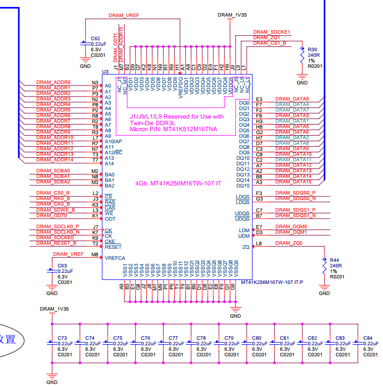

野火_EBF6ULL开发板使用的DDR型号是MT41K256M16TW-107，容量256M*16 共512M字节，数据宽度16位。

测试软件以及配置文件的获取
^^^^^^^^^^^^^^^^^^^^^^^^^^^^^^^^^^^^^^^^^^^^^^^^^^^^^^^^^^^^^^^^^^^^^^^^^^^^^^^^^^^^^^^^^^^^^^^^^^^^^^^^

测试软件以及配置文件可以从官网下载然后按照本教程修改配置文件也可以直接使用教程附带的测试软件以及适配本教程配套开发板的测试文件，位于“~\section5\DDR_test”目录。官网下载地址\ https://community.nxp.com/docs/DOC-102005\ 。

打开下载地址，如下图所示。

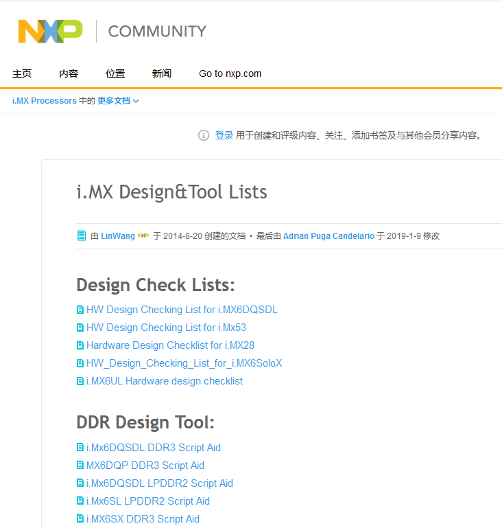

我们需要下载测试软件和测试需要使用的配置文件。如下图所示。

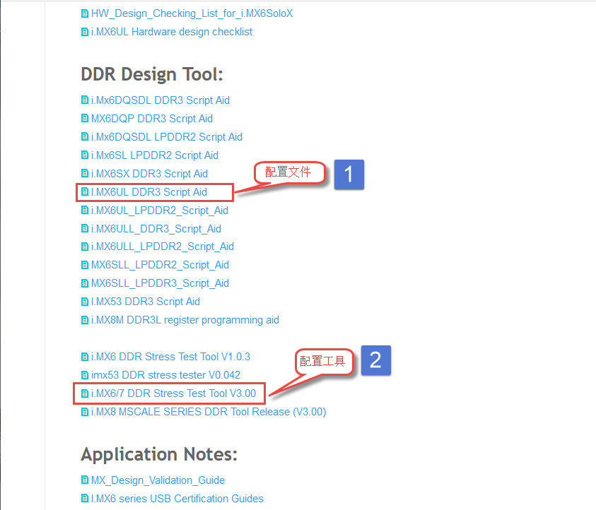

点击标号①，在附件中找到配置文件，点击附件下载即可。如下图所示。

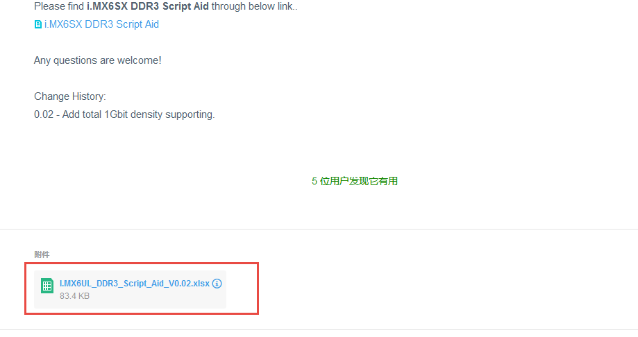

点击标号②，在附件中找到下载工具，下载即可，如下图所示。

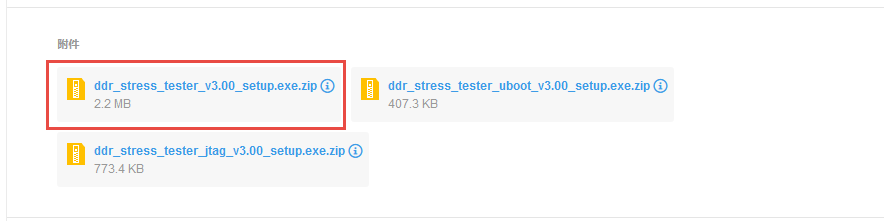

下载完成并解压如下图所示：

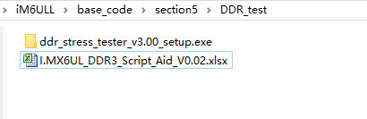

配置文件说明
^^^^^^^^^^^^^^^^^^^^^^^^^^^^^^^^^^^^^^^^^^

打开“I.MX6UL_DDR3_Script_Aid_V0.02.xlsx”文件，如下图所示。

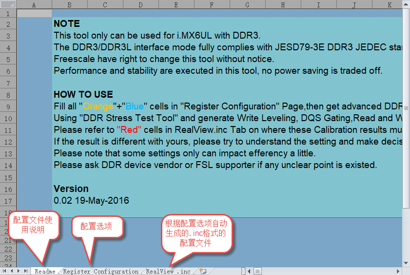

配置文件包括三部分内容，第一部分，配置文件的说明，读者自行阅读即可。第二部分，配置选项，这里列出了DDR测试需要设置的配置选项，修改配置选项将自动更新到第三部分。第三部分，根据第二部分的配置选项自动生成的配置信息，最终我们将这部分内容保存到一个.inc文件中，DDR测试软件会用到这个文件。

配置选项
''''''''''''''''''''''''''''
第二个文件是我们要修改的配置选项，如下图所示。

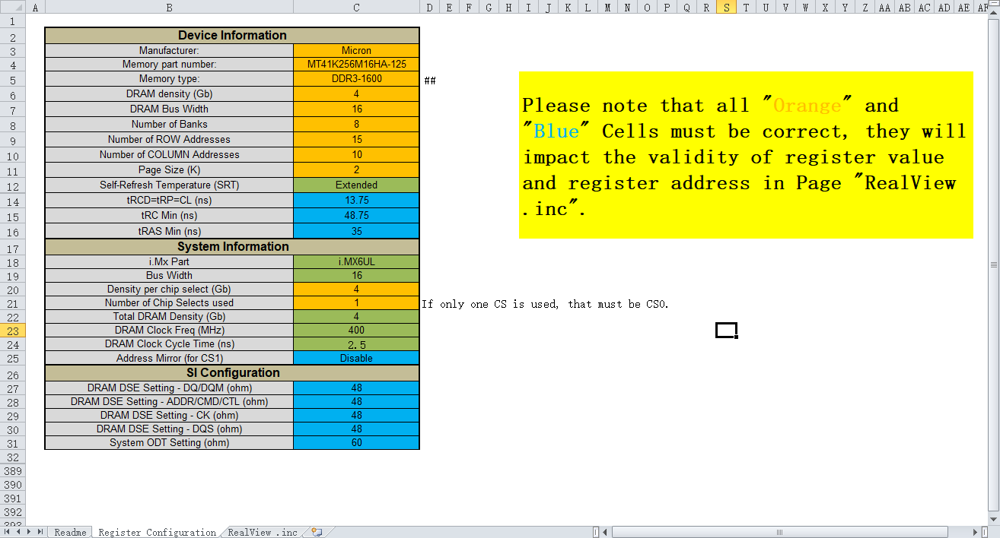

上图中黄色和蓝色选项框需要根据硬件平台选择即可，这里默认是nxp官方评估板的配置参数。如果使用的是本教程配套开发板这些配置参数不用修改，保持默认即可。为了方便配套自己的开发平台，各个配置参数介绍如下：

驱动信息（Device information）

这部分内容配置DDR芯片相关信息。各配置项介绍如下：

-  Manufacturer： DDR芯片制造商，手动输入DDR芯片生产商即可。

-  Memory part number：芯片型号，与芯片厂商一样，手动输入即可，这些对测试没有影响，关键是后面的配置参数。

-  Memory type：DDR类型，这里只能通过下拉框选择，根据你使用的DDR芯片选择即可，我们选择DDR3-1600。

-  DRAM density (Gb)：芯片容量，单位是Gb，我们的DDR容量是512M字节 * 8 = 4Gb。容量根据实际容量选择即可。

-  DRAM Bus Width：数据宽度，16位。

-  Number of Banks：DDR banks 数量，通常情况下DDR3L都是8个bank。如有特殊情况根据实际数量选择即可。

-  Number of ROW Addresses：行地址线数量，i.MX 6U 的MMDC接口行地址也列地址共用15条地址线，行地址使用十五条地址线。

-  Number of COLUMN Addresses：列地址线数量。

-  Page Size (K)：DDR芯片页大小，我们使用的DDR页大小是2K，其他芯片根据芯片手册说明选择即可

-  Self-Refresh Temperature (SRT)：自刷新，这个选项框是对于i.MX 6UL 来说是不可修改的。

-  tRCD=tRP=CL (ns)、tRC Min (ns)、tRAS Min (ns)：DDR相关延
   时相关，这列概念在57.2.2 DDR主要性能参数章节有过简单
   介绍，这里不再赘述，这些参数从DDR芯片数据手册中获得。

系统信息

系统信息大多是固定的，通常情况下不需要修改，具体介绍如下：

-  i.Mx Part：芯片类型，固定为i.MX 6UL。

-  Bus Width：数据总线宽度，16位。

-  Density per chip select (Gb)：每片DDR芯片的容
   量，单位Gb，根据之前讲解，512M字节*8 = 4Gb，根实际使用的DDR芯片选择即可。

-  Number of Chip Selects used：使用了多少片DDR芯片，我们使用了1片，根据实际使用数量选择。

-  Total DRAM Density (Gb)：总共的DDR容量，我们使用了1片512M字节的DDR3L，所以这里选择4。

-  DRAM Clock Freq (MHz)：DDR工作频率，默认400MHz

-  DRAM Clock Cycle Time (ns)：一个时钟周期的时间长度，根据DDR工作频率计算即可，1/400M =2.5ns。

-  Address Mirror (for CS1)：地址镜像，默认不使用。选择Disable。

硬件SI参数

这里设置的是硬件阻抗，保持默认即可。

保存配置信息
''''''''''''''''''''''''''''''''''''''''''

修改完成后，配置信息自动更新到RealView.inc文件，如下图所示：

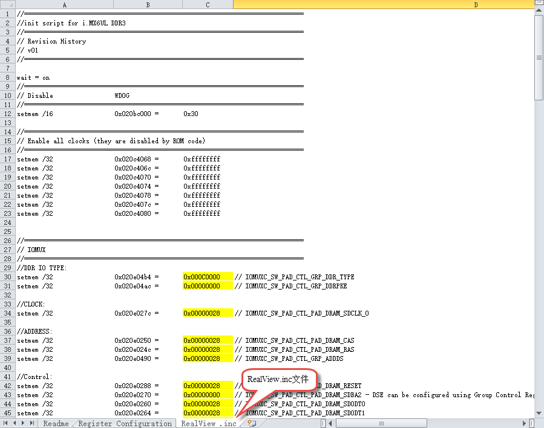

新建一个.inc文件，名字自定，但最好不要用中文。这里将新建的文
件保存在“\section5\DDR_test”路径下，并命名为RealVies.inc。使用VS code 打
开RealVies.inc文件（也可使用其他工具打开）。复制原配置文件中的全部内容到新建的RealVies.inc文件，保存即可。后面测试DDR测试软件会使用到该配置文件

测试软件的使用
^^^^^^^^^^^^^^^^^^^^^^^^^^^^^^^^^^^^^^^^^^^^^^^^^

测试软件的安装

双击ddr_stress_tester_v3.00_setup.exe，软件会自动生成我们需要的测试工具，如下图所示。

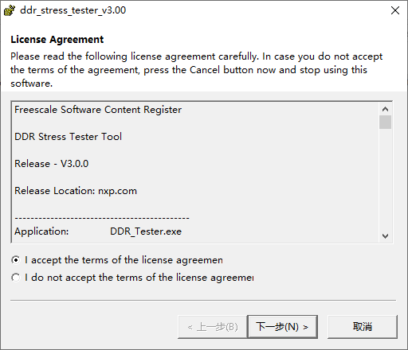

一直点击下一步即可，最终会在当前文件夹下生成我们需要的测试软件如下图所示。

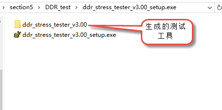

进入生成的工具，如下图所示。

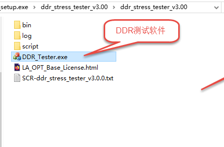

获取校准数据

双击DDR_Tester.exe，打开测试软件如下图所示。

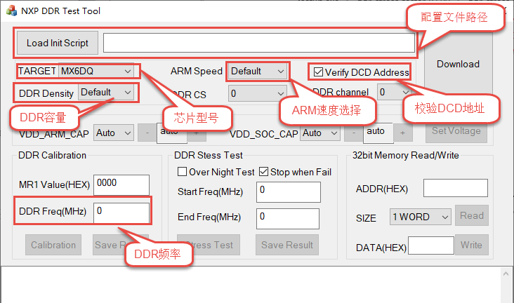

上图中，标记的选项框是需要根据使用的硬件平台进行配置的，具体配置选项的含义很容易理解，这里不再赘述，本教程配套开发板的配置结果如下图所示。

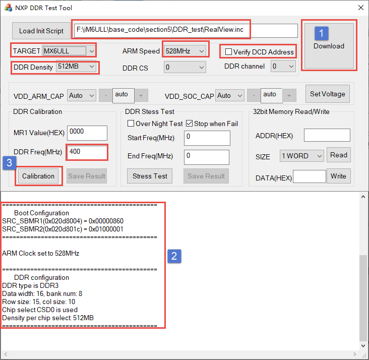

配置完成后，点击Download 如上图标号①处所示。正常情况下会输出
标号②处所示的内容，表示测试程序下载成功，此时标号③处的按钮从灰色变
为可选，点击标号③开始进行DDR的校准。校准时间较长，请耐心等待。

校准完成后会输出校准后的寄存器值，如下图所示。

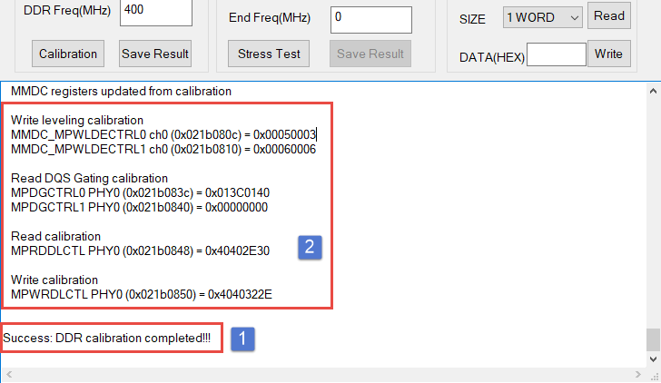

如果校准成功软件会输出成功提示信息，如上图标号①所示。标号②处是校准后得到的6个寄存器的值，我们需要用这些寄存器的值替换校准文件中的值。

例如我们使用的配置文件为“\section5\DDR_test\\RealView.inc”,使
用VS code 打开后直接搜索寄存器地址，例如修改MMDC_MPWLDECTRL0寄存器，则直
接搜索0x021b080c，找到后直接使用校准后的值0x00050003
替换现有值即可。特别提醒，默认情况下，RealView.inc配置文件中找不到MMDC_MPWLDECTRL1和MPDGCTRL1，这两个寄存器直接忽略即可。修改完成后保存即可。

DDR性能测试

上一步我们完成了DDR的校准，获得了校准后的寄存器数据，并将校准数据添加到了“\section5\DDR_test\RealView.inc”文件，这小节将使用校准后的数据测试DDR的性能，测试范围从400MHz到600MHz。测试完成后将会得到DDR稳定运行的最高频率。

首先打开DDR测试软件并添加修改后的配置文件“\section5\DDR_test\RealView.inc”，点击Download等待下载完成，如下图所示。

.. image:: media/ddr029.png
   :align: center
   :alt: 未找到图片

下载完成后会输出配置信息如上图标号②所示，并且标号④处的“Stress Test”按钮
从灰色转为可用。开始测试之前要在标号③处填写测试范围，我们将Start Freq s设置
为400M，将End Freq 设置为600M。设置完成后点击标号④处的Stress Test即可。

测试过程较长，请耐心等待，测试软件自动增加DDR的频率直到出错或达到测试的最大值。

测试完成后，如下图所示。

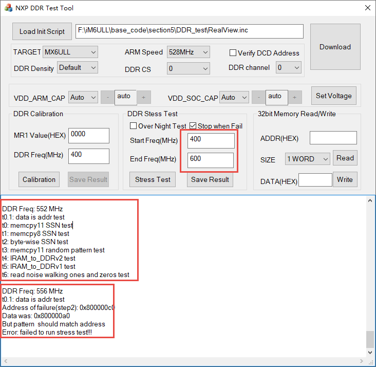

从上图可以看出，当超频到556MHz是出现了错误，说明我测试的这块开发板最高频率为552MHz，不同开发板稍有差别，但都能满足400M的标准工作频率。

.. |ddr011| image:: media/ddr011.png
   :width: 5.76806in
   :height: 3.41319in

.. |ddr029| image:: media/ddr029.png
   :width: 5.76806in
   :height: 5.62639in

