.. vim: syntax=rst

eLCDIF—液晶显示
-------------------------------------------------------

本章参考资料：《IMX6ULRM》（参考手册）Chapter 32: Enhanced LCD Interface (eLCDIF)

配套源码以及下载工具:
-  路径：~/embed_linux_tutorial/base_code/bare_metal/elcdif
-  野火裸机下载工具download_tool（路径：~/embed_linux_tutorial/base_code/bare_metal/download-tool/download-tool.tar.bz2）。

显示器简介
~~~~~~~~~~~~~~~~~~~~~~~~~~~~~~~~~~~

显示器属于计算机的I/O设备，即输入输出设备。它是一种将特定电子信息输出到屏幕上再反射到人眼的显示工具。常见的有CRT显示器、液晶显示器、LED点阵显示器及OLED显示器。

液晶显示器
^^^^^^^^^^^^^^^^^^^^^^^^^^^^^^^^^^^^^^^^^^^^^

液晶显示器，简称LCD(Liquid Crystal Display)，相对于上一代CRT显
示器(阴极射线管显示器)，LCD显示器具有功耗低、体积小、承载的信息量大及不伤眼的优点，因而它成为了现在的主流
电子显示设备，其中包括电视、电脑显示器、手机屏幕及各种嵌入式设备的显示器。下图是液晶电视与CRT电视的外观对比，很明显液晶
电视更薄，“时尚”是液晶电视给人的第一印象，而CRT 电视则感觉很“笨重”。

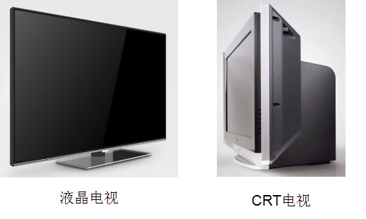

液晶是一种介于固体和液体之间的特殊物质，它是一种有机化合物，常态下呈液态，但是它的分子排列却和固体晶体一样非常规则，因此取名液晶。如果给液晶施加电场，会改变它的分子排列，从而改变光线的传播方向，配合偏振光片，它就具有控制光线透过率的作用，再配合彩色滤光片，改变加给液晶电压大小，就能改变某一颜色透光量
的多少，下图中的就是绿色显示结构。利用这种原理，做出可控红、绿、蓝光输出强度的显示结构，把三种显示结构组成一个显示单位，通过控制红绿蓝的强度，可以使该单位混合输出不同的色彩，这样的一个显示单位被称为像素。

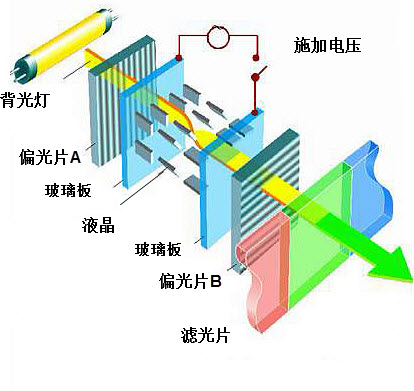

注意液晶本身是不发光的，所以需要有一个背光灯提供光源，光线经过一系列处理过程才到输出，所以输出的光线强度是要比光源的强度低很多的，比较浪费能源(当然，比CRT显示器还是节能多了)。而且这些处理过程会导致显示方向比较窄，也就是它的视角较小，从侧面看屏幕会看不清它的显示内容。另外，输出的色彩变换时，液晶
分子转动也需要消耗一定的时间，导致屏幕的响应速度低。

LED和OLED显示器
^^^^^^^^^^^^^^^^^^^^^^^^^^^^^^^^^^^^^^^^^^^^^^^^^^^^^^^^^^^^^^^^^^^^^^^^^^^^^

LED点阵显示器不存在以上液晶显示器的问题，LED点阵彩色显示器的单个像素点内包含红绿蓝三色LED灯，显示原理类似我们实验板上的LED彩灯，通过控制红绿蓝颜色的强度进行混色，实现全彩颜色输出，多个像素点构成一个屏幕。由于每个像素点都是LED灯自发光的，所以在户外白天也显示得非常清晰，但由于LED灯体
积较大，导致屏幕的像素密度低，所以它一般只适合用于广场上的巨型显示器。相对来说，单色的LED点阵显示器应用得更广泛，如公交车上的信息展示牌、店招等，如下图所示。

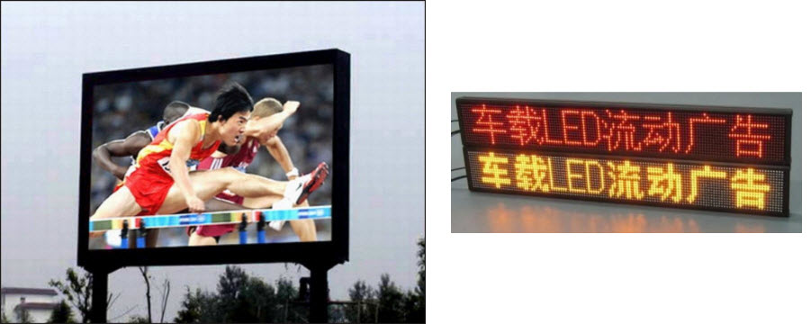

新一代的OLED显示器与LED点阵彩色显示器的原理类似，但由于它采用的
像素单元是“有机发光二极管”(Organic Light Emitting Diode)，所以像素密度比
普通LED点阵显示器高得多，如下图所示。

.. image:: media/LCD005.jpeg
   :align: center
   :alt: 未找到图片

OLED显示器不需要背光源、对比度高、轻薄、视角广及响应速度快等优点。待到生产工艺更加成熟时，必将取代现在液晶显示器的地位，如下所示。

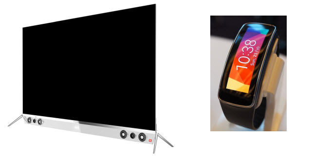

显示器的基本参数
^^^^^^^^^^^^^^^^^^^^^^^^^^^^^^^^^^^^^^^^^^^^^^^^^^^^^^^^^^^^^^^^

不管是哪一种显示器，都有同样的基本参数用于描述它们的特性，各个参数介绍如下：

-  像素

..

   像素是组成图像的最基本单元要素，显示器的像素是指它成像最小的点，即前面讲解液晶原理中提到的一个显示单元。

-  分辨率

..

   一些嵌入式设备的显示器常常以“行像素值x列像素值”表示屏幕的分辨率。如分辨率800x480表示该显示器的每一行有800个像素点，每一列有480个像素点，也可理解为有800列，480行。

-  色彩深度

..

   色彩深度指显示器的每个像素点能表示多少种颜色，一般用“位”(bit)来表示。如单色屏的每个像素点能表示亮或灭两种状态(即实际上能显示2种颜色)，用1个数据位就可以表示像素点的所有状态，所以它的色彩深度为1bit，其它常见的显示屏色深为16bit、24bit。

-  显示器尺寸

..

   显示器的大小一般以英寸表示，如5英寸、21英寸、24英寸等，这个长度是指屏幕对角线的长度， 通过显示器的对角线长度及长宽比可确定显示器的实际长宽尺寸。

-  点距

..

   点距指两个相邻像素点之间的距离，它会影响画质的细腻度及观看距离，相同尺寸的屏幕，若分辨率越高，则点距越小，画质越细腻。如现在有些手机的屏幕分辨率比电脑显示器的还大，这是手机屏幕点距小的原因；LED点阵显示屏的点距一般都比较大，所以适合远距离观看。

液晶控制原理
~~~~~~~~~~~~~~~~~~~~~~~~~~~~~~~~~~~~~~~~~~~~~~~~~~~~~~

下图是两种适合于野火开发板使用的显示屏，如STM32、RT1052和IMX6UL都可以控制这样的显示屏，我们以它为例讲解控制液晶屏的原理。

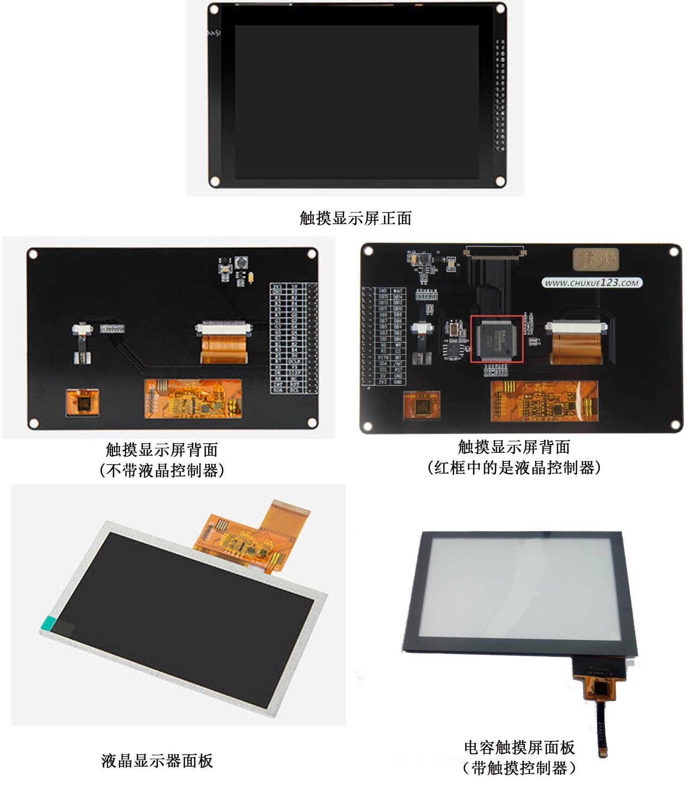

这个完整的显示屏由液晶显示面板、电容触摸面板以及PCB底板构成。图中的触摸面板带有触摸控制芯片，该芯片处理触摸信号并通过引出的信号线与外部器件通讯面板中间是透明的，它贴在液晶面板上面，一起构成屏幕的主体，触摸面板与液晶面板引出的排线连接到PCB底板上，根据实际需要，PCB底板上可能会带有"液晶控制器
芯片"。

因为控制液晶面板需要比较多的资源，所以大部分低级微控制器都不能直接控制液晶面板，需要额外配套一个专用液晶控制器来处理显示过程，外部微控制器只要把它希望显示的数据直接交给液晶控制器即可。例如STM32F103\407系列的微控制器不带液晶控制器功能，所以必须要有额外液晶控制器芯片进行处理。

而不带液晶控制器的PCB底板 ，只有小部分的电源管理电路，液晶面板的信号线
与外部微控制器相连，直接控制。RT1052、STM32F429、IMX6U系列的芯片不需要额外的液
晶控制器，也就是说它把专用液晶控制器的功能集成到RT1052、STM32F429、IMX6U芯片内
部了，节约了额外的控制器成本。

液晶面板的控制信号
^^^^^^^^^^^^^^^^^^^^^^^^^^^^^^^^^^^^^^^^^^^^^^^^^^^^^^^^^^^^^^^^^^^^^^^^^^^^^^^^^

本章我们主要讲解不带控制器的液晶面板，液晶面板的控制信号线见下表。

表 液晶面板的信号线

======== ================
信号名称 说明
======== ================
R[7:0]   红色数据
G[7:0]   绿色数据
B[7:0]   蓝色数据
CLK      像素同步时钟信号
HSYNC    水平同步信号
VSYNC    垂直同步信号
DE       数据使能信号
======== ================

(1) RGB信号线

..

   RGB信号线各有8根，分别用于表示液晶屏一个像素点的红、绿、蓝颜色分量。使用
   红绿蓝颜色分量来表示颜色是一种通用的做法，打开Windows系统自带的画板调色工具，可看到
   颜色的红绿蓝分量值，见下图。常见的颜色表示会在“RGB”后面附带各个颜色分量值的数据位数，如RGB565
   表示红绿蓝的数据线数分别为5、6、5根，一共为16个数据位，可表示2\ :sup:`16`\ 种颜色；而这个液晶屏的
   种颜色分量的数据线都有8根，所以它支持RGB888格式，一共24位数据线，可表示的颜色为2\
   :sup:`24`\ 种。

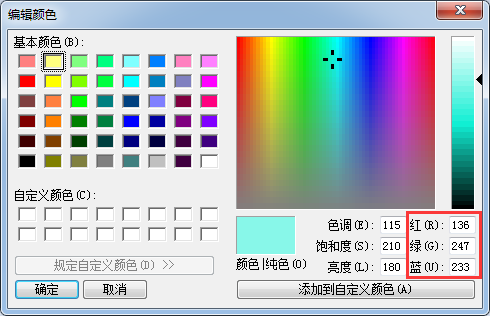

(2) 同步时钟信号CLK

..

   液晶屏与外部使用同步通讯方式，以CLK信号作为同步时钟，在同步时钟的驱动下，每个时钟传输一个像素点数据。

(3) 水平同步信号HSYNC

..

   水平同步信号HSYNC(Horizontal Sync)用于表示液
   晶屏一行像素数据的传输结束，每传输完成液晶屏的一行像素数据时，HSYNC会发生
   电平跳变，如分辨率为800x480的显示屏(800列，480行)，传输一帧的图像HSYNC的电
   平会跳变480次。

(4) 垂直同步信号VSYNC

..

   垂直同步信号VSYNC(Vertical Sync)用于表示液晶屏一帧像素数据
   的传输结束，每传输完成一帧像素数据时，VSYNC会发生电平跳变。其中“帧”是图像的
   单位，一幅图像称为一帧，在液晶屏中，一帧指一个完整屏液晶像素点。人们常常用“帧/秒”来表示液晶屏的
   刷新特性，即液晶屏每秒可以显示多少帧图像，
   如液晶屏以60帧/秒的速率运行时，VSYNC每秒钟电平会跳变60次。

(5) 数据使能信号DE

..

   数据使能信号DE(Data Enable)用于表示数据的有效性，当DE信号线为高电平时，RGB信号线表示的数据有效。

液晶数据传输时序
^^^^^^^^^^^^^^^^^^^^^^^^^^^^^^^^^^^^^^^^^^^^^^^^^^^^^^^^^^^^^^^^

通过上述信号线向液晶屏传输像素数据时，各信号线的时序见下图。图中表示的是向液晶屏传输一帧图像数据的时序，中间省略了多行及多个像素点。

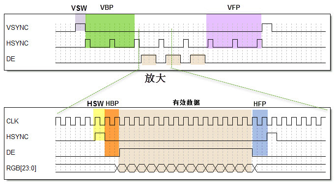

液晶屏显示的图像可看作一个矩形，结合下图来理解。液晶屏有一个显示指针，它指向将要显示的像素。显示指针的扫描方向方向从左到右、从上到下，一个像素点一个像素点地描绘图形。这些像素点的数据通过RGB数据线传输至液晶屏，它们在同步时钟CLK的驱动下一个一个地传输到液晶屏中，交给显示指针，传输完成一行
时，水平同步信号HSYNC电平跳变一次，而传输完一帧时VSYNC电平跳变一次。

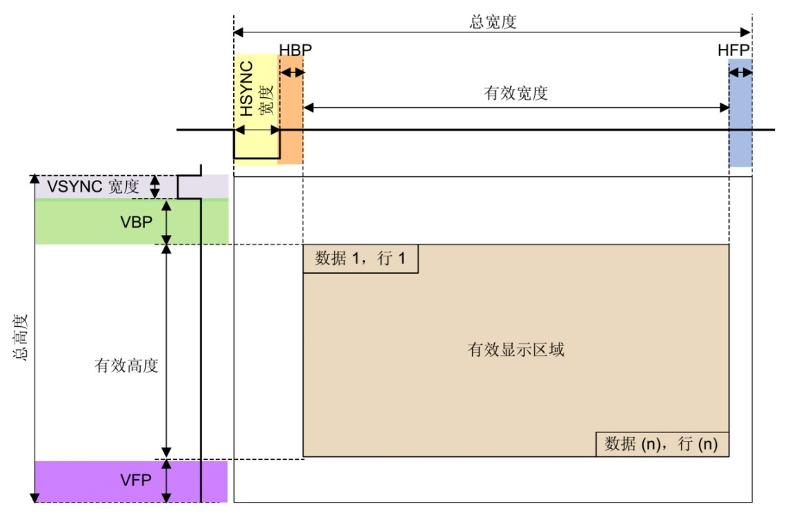

但是，液晶显示指针在行与行之间，帧与帧之间切换时需要延时，而且HSYNC及VSYNC信号本身也有宽度，这些时间参数说明见下表。

表  液晶通讯中的时间参数

============================ =============================================================
时间参数                     参数说明
============================ =============================================================
VBP (vertical back porch)    表示在一帧图像开始时，垂直同步信号以后的无效的行数
VFP (vertical front porch)   表示在一帧图像结束后，垂直同步信号以前的无效的行数
HBP (horizontal back porch)  表示从水平同步信号开始到一行的有效数据开始之间的CLK的个数
HFP (horizontal front porth) 表示一行的有效数据结束到下一个水平同步信号开始之间的CLK的个数
VSW (vertical sync width)    表示垂直同步信号的宽度，单位为行
HSW (horizontal sync width)  表示水平同步信号的宽度，单位为同步时钟CLK的个数
============================ =============================================================

在这些时间参数控制的区域，数据使能信号线“DE”都为低电平，RGB数据线的信号无效，当“DE”为高电平时，RGB数据线表示的数据有效，这时传输的数据会直接影响液晶屏的显示区域。

显存
^^

液晶屏中的每个像素点都是数据，在实际应用中需要把每个像素点的数据缓存起来，再传输给液晶屏，这种存储显示数据的存储器被称为显存。显存一般至少要能存储液晶屏的一帧显示数据，如分辨率为800x480的液晶屏，使用RGB888格式显示，它的一帧显示数据大小为：3x800x480=1152000字节；若使用R
GB565格式显示，一帧显示数据大小为：2x800x480=768000字节。

eLCDIF液晶控制器简介
~~~~~~~~~~~~~~~~~~~~~~~~~~~~~~~~~~~~~~~~~~~~~~~~~~~~~~~~~~~~~~~~~~~~~~~~~~~~~~~~~~~~~~~~~~~

IMX6U系列芯片内部自带一个增强型液晶接口
外设eLCDIF（Enhanced LCD Interface），配合使用DDR作为显存，可直接控制液晶面
板，无需额外增加液晶控制器芯片。IMX6U的eLCDIF液晶控制器最高支持1366x768分辨率的屏幕；可支
持多种颜色格式，包括RGB888、RGB5
65、ARGB8888等(其中的“A”是指透明像素)。还可配合像
素渲染流水线PXP（Pixel Pipeline）进行复杂的图像处理，如格式转换、缩放、翻转以及图层
混合等操作，使IMX6U有非常出色的图形显示性能。

eLCDIF结构框图剖析
~~~~~~~~~~~~~~~~~~~~~~~~~~~~~~~~~~~~~~~~~~~~~~~~~~~~~~~~~~~~~~~~~~~~~~~~~~~~~~~~~~~~

下图是eLCDIF控制器的结构框图，它主要包含信号线、配置寄存器、缓冲区以及与系统总线、控制总线的关系。

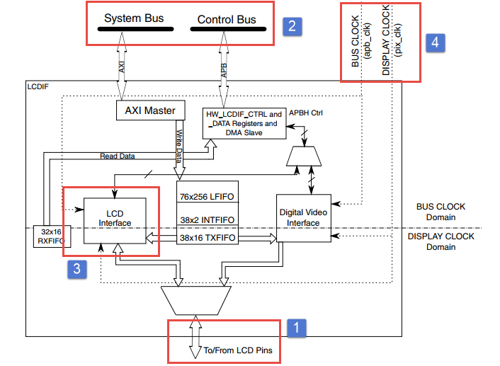

通讯引脚
''''''''''''''''''''''''''''''''

上图的标号处表示eLCDIF的通讯引脚，eLCDIF的通讯引脚与液晶显示面板控制信号一一对应，包含有HSYNC、VSYNC、DE、CLK以及RGB数据线各8根。设计硬件时把液晶面板与IMX6对应的这些引脚连接起来即可，查阅《IMX6ULRM》（参考手册）可获知eLCDIF信号线对应的引脚，
具体见下表。

表格 eLCDIF引脚表

============== ========== ========
eLCDIF外设信号 引脚号     复用模式
============== ========== ========
BUSY           LCD_VSYNC  ALT1
CLK            LCD_CLK    ALT0
CS             LCD_RESET  ALT1
DATA0          LCD_DATA00 ALT0
DATA1          LCD_DATA01 ALT0
DATA2          LCD_DATA02 ALT0
DATA3          LCD_DATA03 ALT0
DATA4          LCD_DATA04 ALT0
DATA5          LCD_DATA05 ALT0
DATA6          LCD_DATA06 ALT0
DATA7          LCD_DATA07 ALT0
DATA8          LCD_DATA08 ALT0
DATA9          LCD_DATA09 ALT0
DATA10         LCD_DATA10 ALT0
DATA11         LCD_DATA11 ALT0
DATA12         LCD_DATA12 ALT0
DATA13         LCD_DATA13 ALT0
DATA14         LCD_DATA14 ALT0
DATA15         LCD_DATA15 ALT0
DATA16         LCD_DATA16 ALT0
DATA17         LCD_DATA17 ALT0
DATA18         LCD_DATA18 ALT0
DATA19         LCD_DATA19 ALT0
DATA20         LCD_DATA20 ALT0
DATA21         LCD_DATA21 ALT0
DATA22         LCD_DATA22 ALT0
DATA23         LCD_DATA23 ALT0
ENABLE         LCD_ENABLE ALT0
HSYNC          LCD_HSYNC  ALT0
RD_E           LCD_ENABLE ALT1
RESET          LCD_RESET  ALT0
RS             LCD_HSYNC  ALT1
VSYNC          LCD_VSYNC  ALT0
WR_RWN         LCD_CLK    ALT1
============== ========== ========

总线接口
''''''''''''''''''''''''''''''''''''''''''''

eLCDIF的液晶接口有两个总线接口，System Bus总线，用于向eLCDIF液晶接
口的FIFO中写入数据。而Control Bus用于设置eLCDIF用于读、写控制寄
存器以及DMA、数据寄存器等等。

液晶接口（LCD Interface）
'''''''''''''''''''''''''''''''''''''''''''''''''''''''''''''''''''''''''''''''''''''''''''''''

上图的标号处表示eLCDIF的液晶接口（LCD Interface），它是eLCDIF外设的主要功
能部件，受控制总线（Control Bus）的寄存器控制，从系统总线（System Bus）获得输入像素
数据，经过一系列转换后通过eLCDIF的通讯引脚发送至外接的液晶面板。

其中控制总线的寄存器可以配置显存地址、输入像素数据的格式、输出的数据信号线宽度、各个控制信号的有效极性以及控制时序中的VSW、VBP等参数，还能配置使用DMA传输。

使用寄存器初始化好eLCDIF的后，它会从“LFIFO”和“TXFIFO”中获取数据进行转换处理（格式转换、移位等操作）并传输出去。当FIFO中的数据量低于一定程度时，它会向系统总线（System
Bus）发起请求，系统总线会把显存地址的数据搬运至FIFO中。FIFO还可以配置阈值，低于该阈值时系统总线会提高获取数据的优先级。

eLCDIF正常运行后，数据从显存到液晶屏全程不需要内核的干预，程序控制时我们只要把像素数据写入到显存即可。

驱动时钟
''''''''''''''''''''''''''''''''''''

elcdf模块包含两个时钟信号，分别是BUS CLOCK（apb_clk）和DISPLAY CLOCK（pix_clk）。

BUS CLOCK（apb_clk）

这个BUS CLOCK（apb_clk）就是指eLCDIF外设的
根时钟LCDIF_CLK_ROOT，它给eLCDIF提供驱动的时钟源，在时钟树中的结构具体如下图所示。

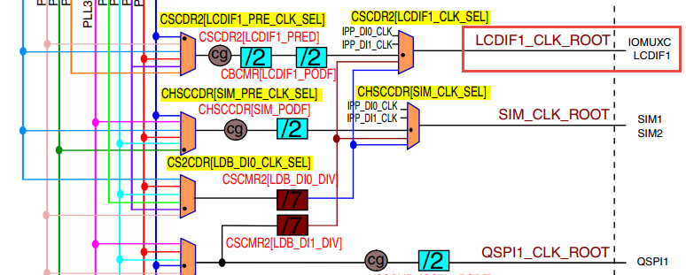

LCDIF_CLK_ROOT根时钟可以选择多种输入时钟源，首先是时钟源预选择器（Pre-multiplexer）支持使用如下时钟：

-  PLL2：System PLL，该时钟频率通常为528MHz。

-  PLL2 PFD0：该时钟常规配置为352MHz。

-  PLL2 PFD1：该时钟常规配置为594MHz。

-  PLL3 PFD3：该时钟常规配置为454.74MHz。

-  PLL3 PFD1：该时钟常规配置为664.62MHz。

-  PLL5：Video PLL，该时钟常规配置为649.52MHz。

预选择器得到的时钟，可根据需要进行分频配置，分频后输入到时钟源选择器（multiplexer）作为LCDIF_CLK_ROOT默认的时钟源，除此之外，图中的时钟的选择器还包含其它可选的输入时钟：ipp_di0_clk、ipp_di1_clk、ldb_di0_clk、ldb_di1_clk，不过关于这
些时钟在参考手册中并没有介绍，而且在寄存器中并没有这些时钟源的分频、选择的配置，也许该选择器是兼容其它设备而保留的内容，所以使用时我们直接选择预选择器得到的时钟作为LCDIF_CLK_ROOT的输入时钟源即可。

DISPLAY CLOCK（pix_clk）

这个DISPLAY CLOCK（pix_clk）是指eLCDIF与液晶面板接口的
像素时钟LCDIF_pix_clk，它的时钟频率与根时钟LCDIF_CLK_ROOT一致，不过它们
的时钟开关是分开的，其中LCDIF_CLK_ROOT使用寄存器位CCM_CCGR2[CG14]控制，而LCDIF_pix_clk使用寄存器位CCM_CCGR3[CG5]控制。

eLCDIF—液晶显示实验
~~~~~~~~~~~~~~~~~~~~~~~~~~~~~~~~~~~~~~~~~~~~~~~~~~~~~~~~~~~~~~~~~~~~~~~~~~~~~~

本小节讲解如何使用eLCDIF外设控制型号为“STD800480”的5寸液晶
屏，见图 58-13，该液晶屏的分辨率为800x480，支持RGB888格式，不过由于RT1052部分液晶信
号数据线与以太网的共用，所以在硬件上本开发板采用了RGB565的连接方式控制液晶屏。

学习本小节内容时，请打开配套的“eLCDIF—液晶显示英文”工程配合阅读。

本教程同样适用于配套的7寸屏，它的分辨率和时序参数与5寸屏相同，驱动程序完全一样。

硬件设计
^^^^^^^^^^^^^^^^^^^^^^^^^^^^^^^^^^^^^^^^

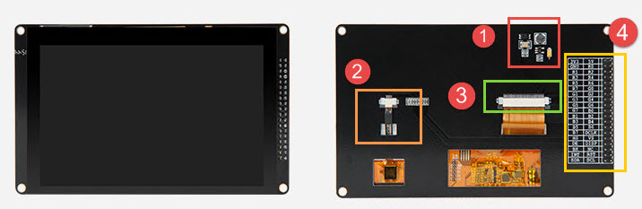

下方四个图分别是升压电路、触摸屏接口、液晶屏接口及排针接口。升压电路把输入的5V电源升压为20V，输出到液晶屏的背光灯中；触摸屏及液晶屏接口通过FPC插座把两个屏的排线连接到PCB电路板上，这些FPC插座与信号引出到屏幕右侧的排针处，方便整个屏幕与外部器件相连。

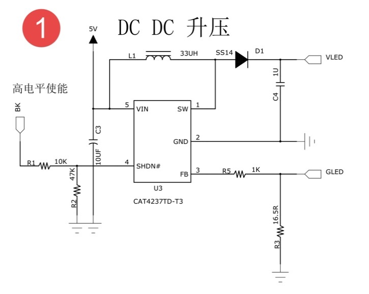

升压电路中的BK引脚可外接PWM信号，控制液晶屏的背光强度，BK为高电平时输出电压。

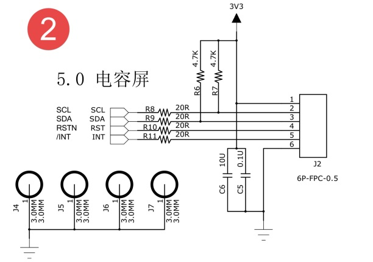

电容触摸屏使用I2C通讯，它的排线接口包含了I2C的通讯引脚SCL、SDA，还包含控制触摸屏芯片复位的RSTN信号以及触摸中断信号INT。

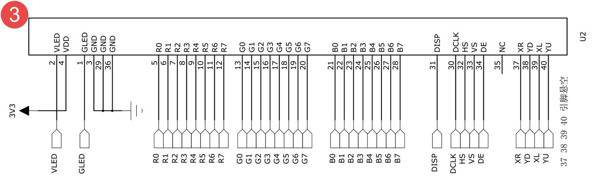

关于这部分液晶屏的排线接口说明见图 58-17。

.. image:: media/LCD017.jpeg
   :align: center
   :alt: 未找到图片

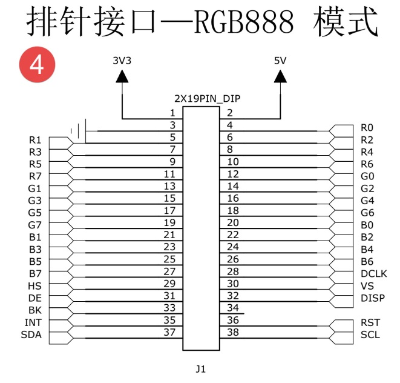

以上是我们i.MX6UL开发板使用的5寸屏原理图，它通过屏幕上的排针或FPC接口连接到开发板的液晶排母或FPC接口，与i.MX6UL芯片的引脚相连，连接关系见下图。

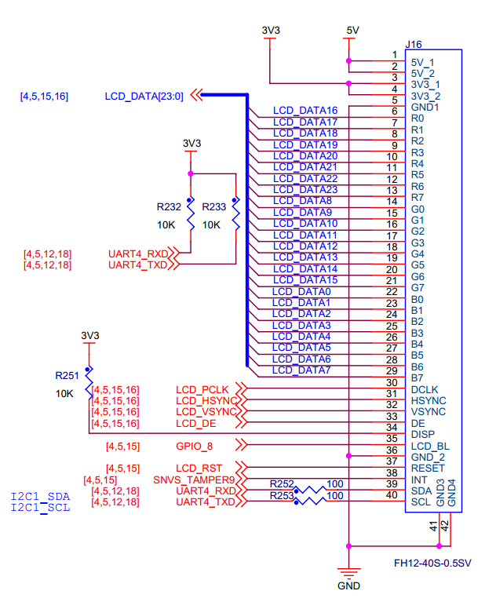

以上原理图可查阅《野火i.MX i.MX6UL底板原理图》文档获知，若你使用的液晶屏或实验板不一样，请根据实际连接的引脚修改程序。

软件设计
^^^^^^^^^^^^^^^^^^^^^^^^^^^^^^^^^^^^

本章配套程序由串口章节的程序修改得到，主要增加了elcdf相关代码。这里只讲解核心的部分代码，有些变量的设置，头文件的包含等并没有涉及到，完整的代码请参考本章配套的工程。

添加源文件并修改makefile
''''''''''''''''''''''''''''''''''''''''''''''''''''''''''''''''''''''''''''''''

首先复制"~\section5\\
uart“代码并更名为”~\section5\elcdf“。在”~\section5\elcdf\device“文件夹下添加elcdf.c文件，在”~\section5\elcdf\include"文件夹下添加elcdf.h文件。elcdf相关代码将会放到elcdf.c和elcdf.h文件内。

添加了源文件，所以要修改makefile ，将源文件编译进
程序。打开“~\section5\\ elcdf \\device”目录下的makefile文件，在最终
目标依赖项中添加“elcdf.o”如下所示。

.. code-block:: c
   :caption: devide目录下的makefile
   :linenos:

   all : button.o  led.o system_MCIMX6Y2.o clock.o uart.o elcdf.o
      arm-none-eabi-ld -r $^  -o device.o

    %.o : %.c
      arm-none-eabi-gcc ${header_file} -c $^

    %.o : %.S
      arm-none-eabi-gcc ${header_file} -c $^
   
    clean:
      -rm -f *.o *.bak

初始化elcdf 外部引脚
'''''''''''''''''''''''''''''''''''''''''''''''''''''''''''''''''

引脚初始化与串口、按键等等外设相同，只不过elcdf使用的引脚很多，引脚初始化这里不再赘述。初始化代码如代码如下所示。

.. code-block:: c
   :caption: elcdf 引脚初始化代码
   :linenos:

   /****************************第一部分********************/
   /* 所有引脚均使用同样的PAD配置 */
   #define LCD_PAD_CONFIG_DATA (SRE_1_FAST_SLEW_RATE |      \
                                DSE_6_R0_6 |                \
                                SPEED_3_MAX_200MHz |        \
                                ODE_0_OPEN_DRAIN_DISABLED | \
                                PKE_1_PULL_KEEPER_ENABLED | \
                                PUE_0_KEEPER_SELECTED |     \
                                PUS_0_100K_OHM_PULL_DOWN |  \
                                HYS_0_HYSTERESIS_DISABLED)
   /* 配置说明 : */
   /* 转换速率: 转换速率快
           驱动强度: R0/6
           带宽配置 : max(200MHz)
           开漏配置: 关闭
           拉/保持器配置: 使能
           拉/保持器选择: 保持器
           上拉/下拉选择: 100K欧姆下拉(
           选择了保持器此配置无效)
           滞回器配置: 禁止 */

   /****************************第二部分********************/
   /* elcdif 显示接口外部引脚初始化
   *
   */
   void lcdif_pin_config(void)
   {
       IOMUXC_SetPinMux(IOMUXC_LCD_CLK_LCDIF_CLK, 0U);
       IOMUXC_SetPinConfig(IOMUXC_LCD_CLK_LCDIF_CLK, LCD_PAD_CONFIG_DATA);

       IOMUXC_SetPinMux(IOMUXC_LCD_DATA00_LCDIF_DATA00, 0U);
       IOMUXC_SetPinConfig(IOMUXC_LCD_DATA00_LCDIF_DATA00, 
       LCD_PAD_CONFIG_DATA);

       IOMUXC_SetPinMux(IOMUXC_LCD_DATA01_LCDIF_DATA01, 0U);
       IOMUXC_SetPinConfig(IOMUXC_LCD_DATA01_LCDIF_DATA01, 
       LCD_PAD_CONFIG_DATA);

       IOMUXC_SetPinMux(IOMUXC_LCD_DATA02_LCDIF_DATA02, 0U);
       IOMUXC_SetPinConfig(IOMUXC_LCD_DATA02_LCDIF_DATA02, 
       LCD_PAD_CONFIG_DATA);

       IOMUXC_SetPinMux(IOMUXC_LCD_DATA03_LCDIF_DATA03, 0U);
       IOMUXC_SetPinConfig(IOMUXC_LCD_DATA03_LCDIF_DATA03, 
       LCD_PAD_CONFIG_DATA);

       IOMUXC_SetPinMux(IOMUXC_LCD_DATA04_LCDIF_DATA04, 0U);
       IOMUXC_SetPinConfig(IOMUXC_LCD_DATA04_LCDIF_DATA04, 
       LCD_PAD_CONFIG_DATA);

       /*******************以下代码省略***************************/
   }

代码比较简单，分为两部分，第一部分定义引脚的PAD 属性，有关PAD属性
请参考LED灯章节。elcdf 外部引脚采用相同的PAD属性。第二部分是
具体的初始化代码，为节省篇幅，这里只列出了部分内容，完整内容请参考本章配套代码。

elcdf 时钟初始化
''''''''''''''''''''''''''''''''''''''''''''''''''''''''''''''''''

elcdf时钟设置比较繁琐，我们需要从PLL开始设置elcdf的时钟。根据CCM章节讲
解IMX6U共有7个PLL 锁相环，它们把24MHz的参考时钟倍频到更高的时钟
为IMX6U内核和外设提供时钟。其中IMX6U的elcdf 使用的时钟来自PLL5(Video PLL)。

.. code-block:: c
   :caption: lcdif时钟初始化代码
   :linenos:

   void lcdif_clock_init(void)
   {
       /*------------------------第一部分---------------------------*/
       /*设置 PLL5  的输出时钟*/
       CCM_ANALOG->PLL_VIDEO_NUM &= (0x3 << 30);   //清零PLL 
       分数分频的分子寄存器
       CCM_ANALOG->PLL_VIDEO_DENOM &= (0x3 << 30); //清零PLL 
       分数分频的分母寄存器

       CCM_ANALOG->PLL_VIDEO = 0;
       // 清零PLL_VIDEO[POST_DIV_SELECT]
       CCM_ANALOG->PLL_VIDEO &= ~(0x3 << 19);
       CCM_ANALOG->PLL_VIDEO |= (0x01 << 19); //设置分频系数为2

       CCM_ANALOG->MISC2 &= ~(0xC0000000); //清零VIDEO_DIV位
       // 配合CCM_ANALOG->PLL_VIDEO寄存器设置时钟分频
       CCM_ANALOG->MISC2 |= (0x3 << 30);

       CCM_ANALOG->PLL_VIDEO &= ~(0x7F); // 清零时钟分频
       CCM_ANALOG->PLL_VIDEO |= (0x1F);  //设置时钟分频为 31(
       十进制)

       CCM_ANALOG->PLL_VIDEO |= 1 << 13; //使能PLL5时钟输出

       /*等待设置生效*/
       while ((CCM_ANALOG->PLL_VIDEO & CCM_ANALOG_PLL_VIDEO_LOCK_MASK) == 
       0)
       {
       }

       /*------------------------第二部分---------------------------
       */
       /*设置从PLL5  到 elcdf 
       根时钟所经过的时钟选择和时钟分频寄存器*/
       CCM->CSCDR2 &= ~(0x07 << 15); //清零
       //设置CSCDR2[LCDIF1_PRE_CLK_SEL] 选择 PLL5 输出时钟
       CCM->CSCDR2 |= (0x02 << 15);

       CCM->CSCDR2 &= ~(0x07 << 12); //清零
       //设置 CSCDR2[LCDIF1_PRED]时钟分频值
       CCM->CSCDR2 |= (0x04 << 12);

       CCM->CBCMR &= ~(0x07 << 23);  //清零
       CCM->CBCMR |= (0x01 << 23);//设置CBCMR[LCDIF1_PODF]

       CCM->CSCDR2 &= ~(0x07 << 9); //清零
       //选择 CSCDR2[LCDIF1_CLK_SEL] 选择 PLL5 输出时钟
       CCM->CSCDR2 |= (0x00 << 9);
   }

elcdf 的时钟初始化非常重要，不考虑LCD 支持的最高刷新频率，时钟决定了LCD显示屏的刷新频率。代码主要分为两部分，介绍如下：

-  第一部分，初始化PLL5（Video PLL）的时钟输出。设置PLL5我们需要设置5个寄存器的值（控制寄存器除外），分别介绍如下：

1. PLL5分数分频分子寄存器CCM_ANALOG_PLL_VIDEO_NUM，为精确的控
制输出时钟，PLL5提供了分数分母寄存器和分数分子寄存器。记为numerator

2. PLL5分数分频分母寄存器CCM_ANALOG_PLL_VIDEO_DENOM，它与分
数分频分子寄存器作用相同，都是为使PLL5输出时钟更灵活、精确。记为denominator

3. PLL5时钟分频寄存器CCM_ANALOG_PLL_VIDEO_DENOM[DIV_SELECT]，时钟的
名字是根据《IMX6ULRM》（参考手册）翻译得到，准确的说这个寄存器是用于设置PLL的倍频系数。记为DIV_SELECT。

4. PLL5 POST分频寄存器CCM_ANALOG_PLL_VIDEO_DENOM [POST_DIV_SELECT]，这个
寄存器才是真正用于分频的。PLL5时钟产生之后经过该寄存器分频才能输出到外部。实际的分频值还要参考CCM_ANALOG_MISC2[VIDEO_DIV]寄存器。

5. 杂项寄存器CCM_ANALOG_MISC2[VIDEO_DIV]，它与PLL5 POST分频
寄存器CCM_ANALOG_PLL_VIDEO_DENOM [POST_DIV_SELECT]，配合使用，用于设置实际的PLL 分频值，如下表所示。

表 PLL 5输出前的时钟分频值设置

==================================================== =================================== ===================
CCM_ANALOG_PLL_VIDEO_DENOM [POST_DIV_SELECT]寄存器值 CCM_ANALOG_MISC2[VIDEO_DIV]寄存器值 PLL5 输出前的分频值
==================================================== =================================== ===================
2                                                    0                                   1
1                                                    0                                   2
2                                                    3                                   4
1                                                    3                                   8
0                                                    3                                   16
==================================================== =================================== ===================

从上表中可以看出CCM_ANALOG_PLL_VIDEO_DENOM [POST_DIV_SELECT]寄存
器和CCM_ANALOG_PLL_VIDEO_DENOM [POST_DIV_SELECT]寄存器共同决定了PLL 输
出前的最后一次分频的分频系数。方便书写这里记为

PLL5的输出频率计算公
式为 PLL5 = OSC24M * (DIV_SELECT + (denominator / numerator)) / postDivider。

第一部分代码从上到下依次
设置numerator = 0、numerator = 0、CCM_ANALOG_PLL_VIDEO_DENOM [POST_DIV_SELECT] = 2、
CCM_ANALOG_MISC2[VIDEO_DIV] = 3、DIV_SELECT = 0x1F
，最终得到的PLL5输出频率为PLL5 = 24 * (0x1F + 0) / 8 = 93MHz。

-  第二部分，设置从PLL5输出到elcdf根时钟所经过的时钟选择寄存器和时钟分频寄存器，时钟选择与时钟分频如下图所示。

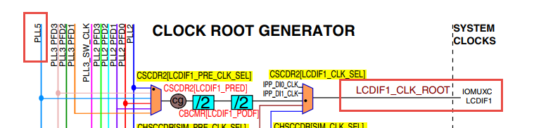

从上图中可以看出,PLL5输出的时钟要经过过两个时钟选择
寄存器和两个时钟分频寄存器，其中时钟选择寄存器的设置是固定的（对于本例程要选择PLL5），而时钟分频
根据自己需要即可。具体的寄存器在图 58-19中已经写出，这里不再赘述寄存器的具体设置方法。

复位LCD 并开启背光
'''''''''''''''''''''''''''''''''''''''''''''''''''''''

LCD有一个复位引脚，正常情况下为高电平，低电平将复位LCD。这部分代码就是在初始化LCD之前想LCD发送一个复位信号，并开启LCD的背光。非常简单，仅仅是操作复位引脚以及LCD背光控制引脚的高低电平。具体代码如下所示。

.. code-block:: c
   :caption: lcdif复位LCD并开启背光
   :linenos:

      void BOARD_InitLcd(void)
   {
       //大致设定elcdf复位信号的持续时间
       volatile uint32_t i = 0x100U;
       /*************第一部分*************/
       GPIO5->GDIR |= (1 << 9); //设置GPIO5_09为输出模式
       GPIO5->DR &= ~(1 << 9);  //设置GPIO5_09输出电平为低电平
       /*等待一段时间，elcdf复位信号保持一段时间*/
       while (i--)
       {
       }
       //设置GPIO5_09输出电平为高电平。 完成elcdf复位
       GPIO5->DR |= (1 << 9);

       /*************第二部分*************/
       /* 设置 LCD D的背光控制引脚为高电平 */
       CCM_CCGR1_CG13(0x3);     //开启GPIO1的时钟
       GPIO1->GDIR |= (1 << 8); //设置GPIO1_08为输出模式
       GPIO1->DR |= (1 << 8);   //设置GPIO1_08输出电平为高电平
   }

代码分为两部分，简单说明如下：

-  第一部分，设置 LCD复位引脚为低电平，延时一段时间后输出高电平，实现LCD 复位。

-  第二部分，设置背光引脚为高电平，点亮LCD的背光。

elcdf接口初始化
''''''''''''''''''''''''''''''''''''''''''''''''''''''''''''

这部分代码完成elcdf接口初始化工作，主要是将LCD显示屏的一些参数填入到elcdf相关的配置寄存器。配置项很多，但是大多是把参数填入寄存器，非常简单，配置代码如下所示。

.. code-block:: c
   :caption: elcdf初始化代码
   :linenos:

      /******************第一部分*******************/
   #define APP_IMG_HEIGHT 480   // 显示屏高度，单位，像素
   #define APP_IMG_WIDTH 800    // 显示屏宽度，单位，像素
   #define APP_HSW 41    //表示水平同步信号的宽度，单位为同步时钟CLK的个数
   #define APP_HFP 4  //表示一行的有效数据结束到下一个水平同步信号开始之间的CLK的个数
   #define APP_HBP 8     //表示从水平同步信号开始到一行的有效数据开始之间的CLK的个数
   #define APP_VSW 10    // 垂直同步信号宽度，单位为行
   #define APP_VFP 4     //垂直同步信号之前的无效行数
   #define APP_VBP 2     //垂直同步信号之后的无效行数
   
   void ELCDIF_RgbModeInit(void)
   {
       /******************第二部分*******************/
       CCM_CCGR3_CG5(0x3); //开启GPIO5的时钟
       ELCDIF_Reset(); //复位LCD
   
       LCDIF->CTRL &= ~(0x300); //根据颜色格式设置 CTRL 寄存器 颜色个事为RGB888
       LCDIF->CTRL |= (0x3 << 8);
   
       LCDIF->CTRL &= ~(0xC00); //设置数据宽度为24位宽
       LCDIF->CTRL |= (0x3 << 10);
   
       LCDIF->CTRL |= (0x20000); // 选择 RGB 模式
       LCDIF->CTRL |= (0x80000); // 选择 RGB 模式 开启显示
       LCDIF->CTRL |= (0x20);    //设置elcdf接口为主模式
   
   
       LCDIF->CTRL1 &= ~(0xF0000);   //清零32位数据有效位
       LCDIF->CTRL1 |= (0x07 << 16); // 设置32位有效位的低24位有效。
   
       /******************第三部分*******************/
       LCDIF->TRANSFER_COUNT |= APP_IMG_HEIGHT << 16; //设置一列 像素数  480
       LCDIF->TRANSFER_COUNT |= APP_IMG_WIDTH << 0;   //设置一行 像素数  800
   
   
       /*生成使能信号*/
       LCDIF->VDCTRL0 |= LCDIF_VDCTRL0_ENABLE_PRESENT_MASK;
       //设置VSYNC周期 的单位为显示时钟的时钟周期
       LCDIF->VDCTRL0 |= LCDIF_VDCTRL0_VSYNC_PERIOD_UNIT_MASK;
       //设置VSYNC 脉冲宽度的单位为显示时钟的时钟周期
       LCDIF->VDCTRL0 |= LCDIF_VDCTRL0_VSYNC_PULSE_WIDTH_UNIT_MASK;
   
       //设置 数据使能信号的有效电平为高电平
       LCDIF->VDCTRL0 |= (1 << 24);
       //设置 VSYNC 有效电平为低电平
       LCDIF->VDCTRL0 &= ~(0x8000000);
       //设置HSYNC有效电平为低电平
       LCDIF->VDCTRL0 &= ~(0x4000000);
       // 设置在时钟的下降沿输出数据，在时钟的上升沿捕获数据。
       LCDIF->VDCTRL0 |= (0x2000000);
   
       LCDIF->VDCTRL0 |= APP_VSW;
   
       /******************第四部分*******************/
       //     以显示时钟为单位的周期。
       //设置VSYNC 信号周期
       LCDIF->VDCTRL1 = APP_VSW + APP_IMG_HEIGHT + APP_VFP + APP_VBP;
   
       //HSYNC 信号有效电平长度
       LCDIF->VDCTRL2 |= (APP_HSW << 18);
       //HSYNC 信号周期
       LCDIF->VDCTRL2 |= (APP_HFP + APP_HBP + APP_IMG_WIDTH + APP_HSW);
   
       LCDIF->VDCTRL3 |= (APP_HBP + APP_HSW) << 16;
       LCDIF->VDCTRL3 |= (APP_VBP + APP_VSW);
   
       LCDIF->VDCTRL4 |= (0x40000);
       LCDIF->VDCTRL4 |= (APP_IMG_WIDTH << 0);
   
       /******************第五部分*******************/
       LCDIF->CUR_BUF = (uint32_t)s_frameBuffer[0];
       LCDIF->NEXT_BUF = (uint32_t)s_frameBuffer[0];
   }

elcdf初始化代码大致分为了五部分，但是各部分之间并没有明显的区分，都是设置elcdf配置寄存器。具体的配置过程不再具体介绍，这里将会结合代码讲解配置参数的作用，读者只需要知道在哪里修改配置参数以及配置参数的作用即可。

-  第一部分，这是定义在elcdif.h文件中的LCD相关参数，不同显示屏配置
   参数可能不同，这些参数的含义在程序的注释以及58.2 液晶控制原理章节有过详细介绍，这里不再赘述。

-  第二部分，进入初始化函数后首先开启elcdif外设的时钟，并复位lecdf，之后修改CTRL控
   制寄存器配置elcdf基本配置信息，从上到下依次设置颜色格式为RGB888、数据宽度为24位、选择RGB模式、选择有效的数据位。

-  第三部分，第三部分与第四部分都是设置与显示屏相关的配置参数。代码第34和35行设置显示
   屏的分辨率。修改时最高修改分辨率对应的宏定义，以为其他地方还会用到分辨率。代码第38到43行使能RGB模
   式并设置VSYNC信号周期的单位（行同步信号数或pix_clk时钟周期数）以及VSYNC信号脉宽的单位（同上），RGB接口应当设置单位为“行同步信号周期数”。代
   码第45到54用于设置VSYNC有效电平以及数据采集的边缘。实际应用中我们很少修改这部分内容。

-  第四部分，设置显示屏相关配置参数。代码第59行，设置传输一帧
   所用的的时间单位是传输“一行”像素所用的时间，或者说是行同步信号周期。代码第62行，设置VSYNC信号宽度，代码第64行，设
   置HSYNC（行同步信号周期），单位为同步时钟CLK的个数。代码第66和67行分别设置行同步信号之后等待的时间（单
   位为同步时钟CLK的个数） 、列同步信号之后等待时间（单位为行同步信号周期）。如图 58-8所示。

-  第五部分，设置当前显存地址和下一个缓存地址。我们把它设置为通一个，如果有需要在后面的程序中再修改。

主函数实现
''''''''''''''''''''''''''''''

初始化完成后我们只需要填充显存并启动显示即可，程序中我们开启帧传输完成中断，在中断服务函数中更新传输状态，实现代码如下所示：

.. code-block:: c
   :caption: elcdf初始化代码
   :linenos:

      /******************第一部分*******************/
    static volatile unsigned char s_frameDone = false;  // elcdf 帧传输状态
    extern uint32_t s_frameBuffer[2][APP_IMG_HEIGHT][APP_IMG_WIDTH];  // elcdif 显存
   
    /******************第二部分*******************/
    /*
    * elcdf 帧传输完成中断
    */
    void APP_LCDIF_IRQHandler(void)
    {
        uint32_t intStatus = 0;
   
        /*获取传输完成中断的状态，*/
        intStatus = ((LCDIF->CTRL1) & (1 <<9));
        /*清除 1 帧传输完成中断标志位*/
        LCDIF->CTRL1_CLR = (1 << 9);
   
        if (intStatus)
        {
            s_frameDone = true;
        }
    }
   
    int main()
    {
        uint8_t ch; //用于暂存串口收到的字符
   
        uint32_t frameBufferIndex = 0;
        /******************第三部分*******************/
        system_clock_init();
        rgb_led_init();           //初始化 RGB 灯，初始化后 默认所有灯都不亮。
        interrupt_button2_init(); 
        //初始化引脚，和引脚的中断方式以及开启引脚中断。
        uart_init();
        UART_WriteBlocking(UART1, txbuff, sizeof(txbuff) - 1);
        /******************第四部分*******************/
        lcdif_pin_config();         //初始 lcdif 引脚
        lcdif_clock_init();         //初始化时钟
        ELCDIF_RgbModeInit();  // 初始化 elcdf 位 RGB 888 模式
   
        SystemInstallIrqHandler(LCDIF_IRQn, \
      (system_irq_handler_t)(uint32_t)APP_LCDIF_IRQHandler, NULL); // 
                                设置中断服务函数
        GIC_EnableIRQ(LCDIF_IRQn); //开启中断
   
        /******************第五部分*******************/
        APP_FillFrameBuffer(s_frameBuffer[frameBufferIndex]);
   
        LCDIF->CTRL1_SET |= (0x2000);  // 使能 elcdf 一帧传输完成中断
        LCDIF->CTRL_SET |= 0x1;    //开启 elcdf 开始显示
        LCDIF->CTRL_SET |= (1 << 17);
        /******************第六部分*******************/
        while (1)
        {
            frameBufferIndex ^= 1U;
            APP_FillFrameBuffer(s_frameBuffer[frameBufferIndex]);
   
            LCDIF->NEXT_BUF = (uint32_t)s_frameBuffer[frameBufferIndex];
   
            s_frameDone = false;
            /* Wait for previous frame complete. */
            while (!s_frameDone)
            {
            }
        }
        return 0;
    }

在主函数中主要调用之前讲解的初始化函数，初始化完成使用官方SDK中的显存填充函数设置显示内容，最后启动传输。结合代码各部分讲解如下：

-  第一部分，定义帧传输状态变量和显存。

-  第二部分，定义帧传输完成中断的中断服务函数，和STM32相似，在中断服务函数
   中检测中断状态并清除中断标志，如果是帧传输完成中断则设置s_frameDone变量为真。

-  第三部分，这是串口章节遗留的初始化代码，除系统时钟初始化代码外，其他初始化代码可以删除。

-  第四部分，初始化elcdif，初始化代码是我们之前讲过的三个初始化函
   数，分别初始化了elcdif 的引脚、时钟、以及elcdif的配置参数。代码第41到44行 初始化ELCDF帧传输完成中断，使能中断。

-  第五部分，使用APP_FillFrameBuffer函数填充显存，之后开启传输完成
   中断。对比第四部分的中断，第四部分设置的是系统中断，表示某一个中断号对应
   的中断被使能。这里设置的是elcdif 可以产生中断请求。一切准备就绪设置CTRL_SET控制寄存器开启elcdif显示。

-  第六部分，在while(1)中循环改变显
   存内容，不断更新显示。

下载验证
^^^^^^^^^^^^^^^^^^^^^^^^^^^^^^^^^^^^^^^^^^^^

程序编写完成后，在“elcdif” 文件夹下执行make命令，makefile工具便会自
动完成程序的编译、链接、格式转换等工作。正常情况下我们可以在当前目录看到生成的一些中间文件以及我们期待的.bin文件。

在编译下载官方SDK程序到开发板章节我们详细讲解了如何将二进制文件烧写到SD卡（烧写工具自动实现为二进制文件添加头）。这里再次说明下载步骤。

-  将一张空SD卡（烧写一定会破坏SD卡中原有数据！！！烧写前请保存好SD卡中的数据），接入电脑后在虚拟机的右下角状态栏找到对应的SD卡。将其链接到虚拟机。

-  进入烧写工具目录，执行“./mkimage.sh <烧写文件路径>”命令,例如要烧写
   的led.bin位于home目录下，则烧写命令为“./mkimage.sh /home/led.bin”。

-  执行上一步后会列出linux下可烧写的磁盘，选择你
   插入的SD卡即可。这一步非常危险！！！一定要确定选择的是你插入的SD卡！！，如果选错很可能破
   坏你电脑磁盘内容，造成数据损坏！！！。确定磁盘后SD卡以“sd”开头，选择“sd”后面的字符即可。例如要烧写的sd卡是“sdb”则输入“b”即可。

烧写完成，首先将开发板启动方式设置为SD卡启动，将SD卡插入开发板卡槽。上电后显示屏右下角会显示一个蓝色方块，并不断向左上角移动。如果显示不正常显示请断电后重新插拔显示屏连接线，确保接触良好。

.. |LCD005| image:: media/LCD005.jpeg
   :width: 2.97708in
   :height: 2.38403in

.. |LCD017| image:: media/LCD017.jpeg
   :width: 4.45347in
   :height: 6.25556in

