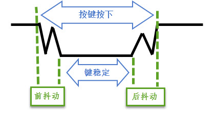
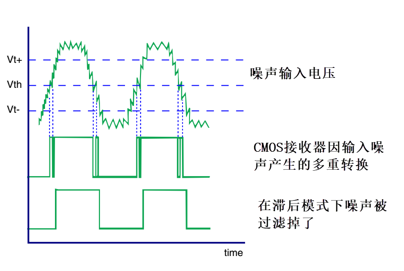
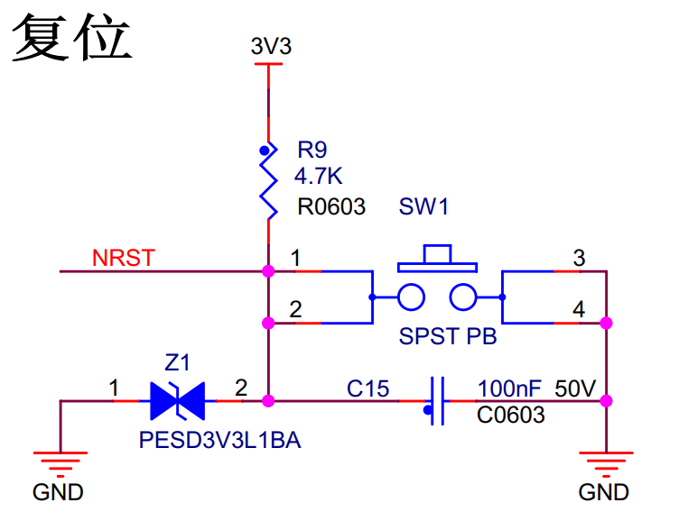
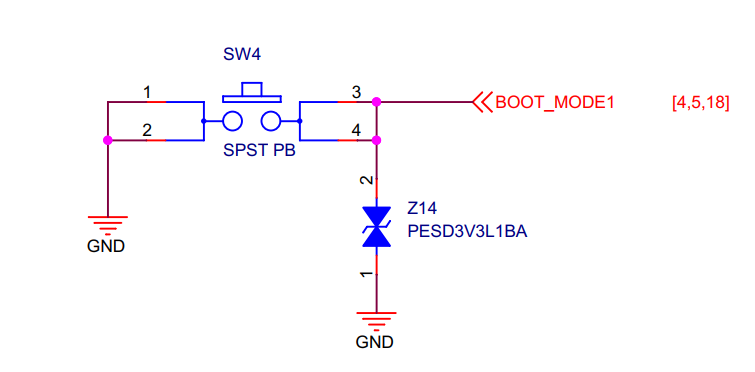
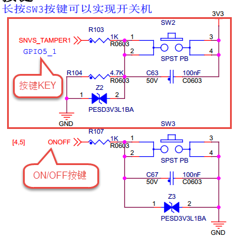
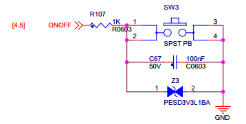

.. vim: syntax=rst

GPIO输入—按键查询检测
-----------------------------------------------------------------

本章节内容处于开发笔记状态，还待整理至最终版的教程。

本章节内容处于开发笔记状态，还待整理至最终版的教程。

按键检测使用到GPIO外设的基本输入功能，本章中不再赘述GPIO外设的概念。

硬件设计
~~~~~~~~~~~~~~~~~~~~~~~~~~~~~~~~~~~~~~~~~~~~~~~~~~~~~~~~~~~~~~~~

按键机械触点断开、闭合时，由于触点的弹性作用，按键开关不会马上稳定接通或一下子断开，使用按键
时会产生图 52‑1中的带波纹信号，需要用软件消抖处理滤波，不方便输入检测。不过i.MX 6U的GPIO引脚带有施密特
触发器功能，使用该功能可以对信号实现消抖处理，见下图，从而简化了软件的工作，软件只需要直接检测引脚的电平即可。

.. image:: media/gpioke003.png
   :align: center
   :alt: 未找到图片

在Pro底板中包含了4个按键：

(1) RST复位按键。该按键连接至i.MX 6U的POR引脚，当该引脚为低电平时会引起i.MX
6U芯片的复位（复位的基本现象是程序从头开始运行）。从按键的原理图可知，该按键在没
有被按下的时候，引脚状态为高电平，当按键按下时，引脚状态为低电平(按键所在的电路导通，引脚接到地)。所以，平时POR_B引脚保
持高电平，芯片正常运行，按下按键时产生复位。 如下所示。

(2) MODE按键。MODE按键最为特殊，它通过一系列电路连接至两个引脚BOOT_MODE[0]和BOOT_MODE[1]，当该按
键按下时，BOOT_MODE[0]引脚状态为高电平，BOOT_MODE[1]则相反为低电平。BOOT_MODE[0]和BOOT_MODE[1]都具有GPIO的功能，即我
们可以选取这二者中任意一个设置成GPIO的输入模式并检测相应的输入电平，来判断按键是否被按下。MODE按键这样设计是为了方便切换芯片的启动方式，芯片复位启动后会检测这两个引脚的电平，根据BOOT_MODE[0]和BOOT_MODE[1]的电平状态来选择FLASH还是USB的启动方式。在本章实验中我们
不使用该按键。MODE按键在原理图中的位置如下所示。

(3) ON/OFF按键。该按键连接至i.MX 6U的ONOFF引脚，长按可以实现
开关机。该按键不要用作普通按键使用。ON/OFF按键在原理图中的位置如下图所示。

(4) KEY按键。该按键连接至SNVS_TAMPER1引脚，用作普通的按键。本实验将用该按键实现GPIO输出功能。KEY按键在原理图中的位置如下图所示。

对这4个按键的信息及相应GPIO端口引脚号的总结具体见下表。

表 各个按键的信息及GPIO端口引脚号

=========== ======== ======================== ==================== ================
按键        丝印编号 GPIO功能                 按键按下时的电平     其它功能
=========== ======== ======================== ==================== ================
RST复位按键 SW1      不支持                   低电平               复位芯片
ON/OFF按键  SW3      不支持                   低电平               从低功耗唤醒
MODE按键    SW4      BOOT_MODE[0]：           BOOT_MODE[0]：高电平 选择芯片启动方式

                     GPIO1_IO04                                    \                    BOOT_MODE[1]：GPIO1_IO05 BOOT_MODE[1]：低电平 KEY按键     SW2      支持
                     低电平               无 =========== ======== ======================== ==================== ================

若你使用的实验板按键的连接方式或引脚不一样，只需根据我们的工程修改引脚即可，程序的控制原理相同。

软件设计
~~~~~~~~~~~~~~~~~~~~~~~~~~~~~~~~~~~~~~~~~~~~~~~~

为简化程序设计，本程序在LED程序基础上修改。我们重点介绍修改的部分，其他与LED章节相同。

编程要点
^^^^^^^^^^^^^^^^^^^^^^^^^^^^^^^^^^^^^^^^^^^^^^^^^^^^^^^^^^^^^^^^^^^^^^^^^^^^^^^^

1. 修改makefile文件。

2. 初始化按键使用到的GPIO引脚。

3. 编写简单的按键检测函数。

复制RGB灯程序
^^^^^^^^^^^^^^^^^^^^^^^^^^^^^^^^^^^^^^^^^^^^^^^^^^^^^^^^^^^^^^^^^^^^^^^^^^^^^^^^^^^^^^^^^^^^^^

本程序在RGB等程序基础上修改，复制“/section4/led_rgb_c”灯程序到“/section4/button”目录下，如下图所示。

将文件“led.c”和“led.lds”分别修改为“button.c”和“button.lds”，添加按键代码我们只需要修改“makefile”文件以及“button.c”文件。

修改makefile
^^^^^^^^^^^^^^^^^^^^^^^^^^^^^^^^^^^^^^^^^^^^^^^^^^^^^^^^^^^^^^^^^^^^^^^^^^^^^^^^^^^^^^^^^^^^^^^^^^^^^^^^^

makefile文件主要是修改文件名，将“led”修改为button，其他内容并没有修改，修改过的makefile 如下所示。

.. code-block:: c
   :caption: makefile 文件
   :linenos:

   all: start.o button.o
   arm-none-eabi-ld -Tbutton.lds $^ -o button.elf
   arm-none-eabi-objcopy -O binary -S -g button.elf button.bin
   %.o : %.S
   arm-none-eabi-gcc -g -c $^ -o start.o
   %.o : %.c
   arm-none-eabi-gcc -g -c $^ -o button.o
   
    .PHONY: clean
    clean:
    rm \*.o \*.elf \*.bin

为简化难度暂时这样修改，后面章节将会介绍更简单易用的修改方式。

修改button.c
^^^^^^^^^^^^^^^^^^^^^^^^^^^^^^^^^^^^^^^^^^^^^^^^^^^^^^^^^^^^^^^^^^^^^^

与led灯引脚设置方法相同，只是配置稍有不同，具体代码如下所示，这里只列出了按键相关的代码，完整代码请参考本章配套例程。

.. code-block:: c
   :caption: 添加按键初始化代码
   :linenos:

       /********************第一部分******************/
    /*按键2 GPIO端口、引脚号及IOMUXC复用宏定义*/
    #define button2_GPIO               GPIO5
    #define button2_GPIO_PIN           (1U)
    #define button2_IOMUXC             IOMUXC_SNVS_SNVS_TAMPER1_GPIO5_IO01
   
        /********************第二部分******************/
    /* 按键PAD配置 */
    #define button_PAD_CONFIG_DATA            (SRE_0_SLOW_SLEW_RATE| \
                                            DSE_6_R0_6| \
                                            SPEED_2_MEDIUM_100MHz| \
                                            ODE_0_OPEN_DRAIN_DISABLED| \
                                            PKE_0_PULL_KEEPER_DISABLED| \
                                            PUE_0_KEEPER_SELECTED| \
                                            PUS_0_100K_OHM_PULL_DOWN| \
                                            HYS_1_HYSTERESIS_ENABLED)   
        /* 配置说明 : */
        /* 转换速率: 转换速率慢
          驱动强度: R0/6 
          带宽配置 : medium(100MHz)
          开漏配置: 关闭 
          拉/保持器配置: 关闭
          拉/保持器选择: 保持器（上面已关闭，配置无效）
          上拉/下拉选择: 100K欧姆下拉（上面已关闭，配置无效）
          滞回器配置: 开启 */ 
   
    int main()
    {
        /********************以下省略RGB灯初始化相关的代码******************/
   
   
        /********************第三部分******************/
        /*按键初始化*/
        CCM_CCGR1_CG15(0x3);  //开启GPIO5的时钟
   
        /*设置 绿灯 引脚的复用功能以及PAD属性*/
        IOMUXC_SetPinMux(RGB_GREEN_LED_IOMUXC,0);     
        IOMUXC_SetPinConfig(RGB_GREEN_LED_IOMUXC, button_PAD_CONFIG_DATA); 
   
        GPIO5->GDIR &= ~(1<<1);  //设置GPIO5_01为输入模式
   
        /********************第四部分******************/
        while(1)
        {
            if((GPIO5->DR)&(1<<1))
            {
                delay(0xFF);
                if((GPIO5->DR)&(1<<1))
                {
                    /*有按键按下，执行绿色led灯翻转*/
                    if((GPIO4->DR)&(1<<20))
                    {
                        GPIO4->DR &= ~(1<<20);    //绿灯亮
                        while((GPIO5->DR)&(1<<1));//等待按键松开
                    }
                    else
                    {
                        GPIO4->DR |= (1<<20);     //绿灯灭
                        while((GPIO5->DR)&(1<<1));//等待按键松开
                    }
                }
            }

        }
        return 0;    
    }

结合代码各部分简单说明如下：

-  第一部分，定义按键使用到的引脚。

-  第二部分，设置按键引脚的PAD属性，与LED灯引脚PAD属性差别是这里开启了滞回器的功能。

-  第三部分，开启GPIO5的时钟并初始化按键引脚。与LED引脚初始化不同这里将引脚设置为输入。

-  第四部分，在while(1)死循环中检测按键的状态，如果按键按下则翻转绿灯状态并等待按键松开。

下载验证
~~~~~~~~~~~~~~~~~~~~~~~~~~~~~~~~~~~~~~~~~~~~~~~~~~~~~~~~

程序编写完成后，在“/section4/button” 文件夹下执行make命令，makefile工具便会自动完成
程序的编译、链接、格式转换等工作。正常情况下我们可以在当前目录看到生成的一些中间文件以及我们期待的.bin文件。

在46.2.5 烧写到SD卡章节我们详细讲解了如何将二进制文件烧写到SD卡（烧写工具自动实现为二进制文件添加头）。这里再次说明下载步骤。

-  将一张空SD卡（烧写一定会破坏SD卡中原有数据！！！烧写前请保存好SD卡中的数据），接入电脑后在虚拟机的右下角状态栏找到对应的SD卡。将其链接到虚拟机。

-  进入烧写工具目录，执行“./mkimage.sh <烧写文件路径>”命令,例如要
   烧写的led.bin位于home目录下，则烧写命令为“./mkimage.sh /home/led.bin”。

-  执行上一步后会列出linux下可烧写的磁盘，选择你插入的SD卡即可。这一步非常危险！！！一定要确定选择的是
   你插入的SD卡！！，如果选错很可能破坏你电脑磁盘内容，造成数据损坏！！！。确定磁盘后SD卡以“sd”开头，选择“sd”后面的字符即可。例如要烧写的sd卡是“sdb”则输入“b”即可。

.. |gpioke003| image:: media/gpioke003.png
   :width: 2.41276in
   :height: 1.49996in

