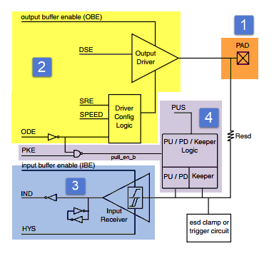
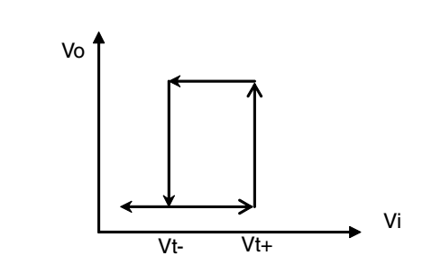
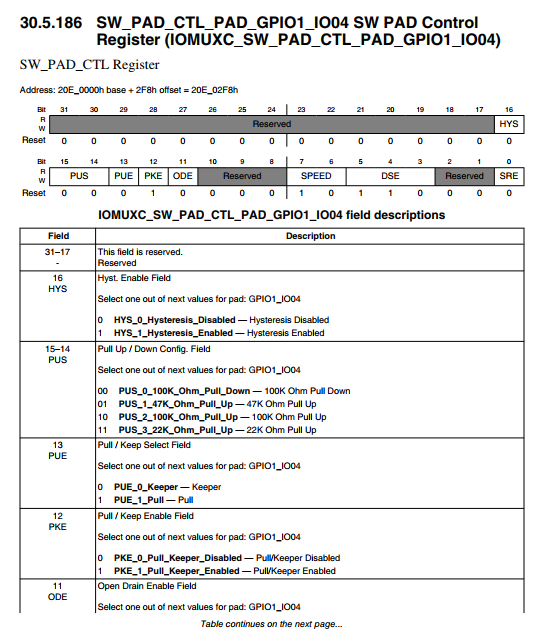
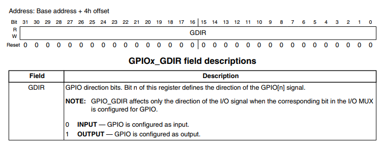
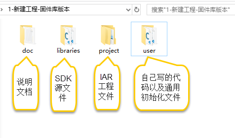
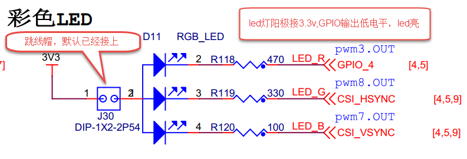
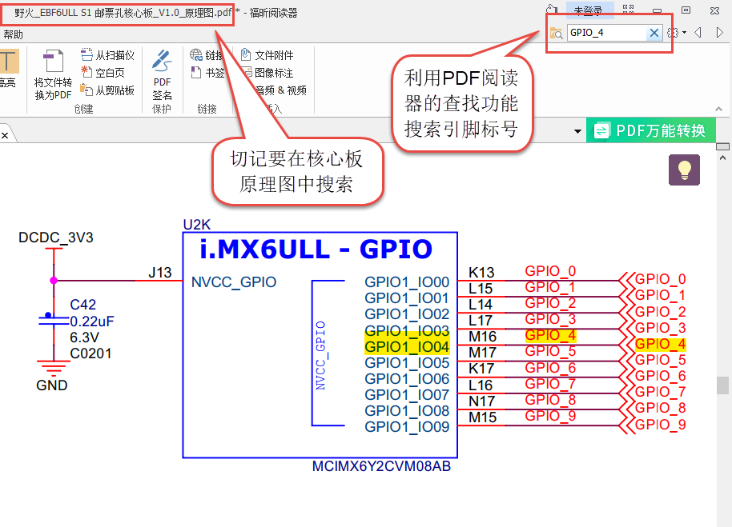
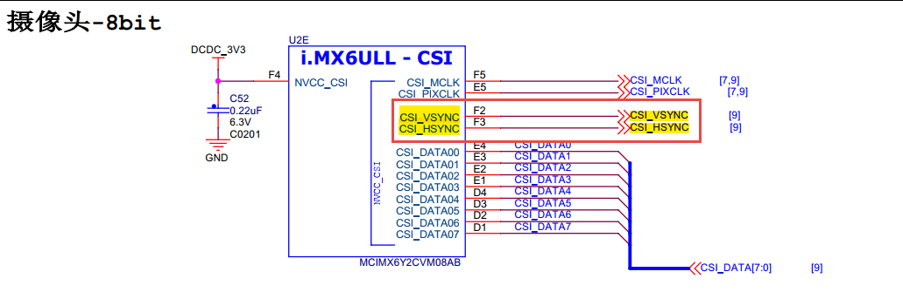
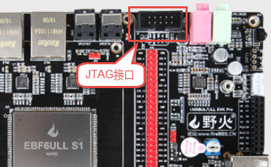
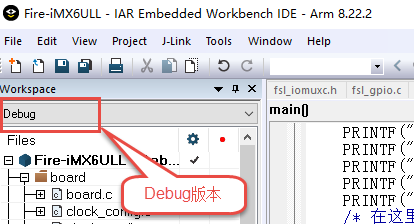

.. vim: syntax=rst

点亮LED灯
------

本章节内容处于开发笔记状态，还待整理至最终版的教程。

本章节内容处于开发笔记状态，还待整理至最终版的教程。

通过上一节我们知道i.MX6ULL 拥有官方写好的windows以及linux下的SDK包，并且在SDK的“SDK_2.2_MCIM6ULL_EBF6ULL\boards\evkmcimx6ull\driver_examples”目录下存在大量的基于IAR集成开发环境的官方例程。看到这里是不是很兴奋
？很遗憾的告诉你，除本章以外的其他裸机章节将不会使用IAR集成开发环境，而是采用linux下的arm gcc 工具开发。为什么不使用IAR开发裸机？将会在下一章详细介绍。这里首先介绍为什么带领大家用IAR点灯。

-  官方SDK中提供了大量的开发好的裸机驱动，虽然我们不能在Linux下直接使用，但是作为裸机以及驱动开发的重要参考资料我们必须对它有一定的了解，需要能够快速找到我们需要的内容。

-  IAR集成开发环境借助调试工具（jlink）能够实现强大的调试功能，在开发阶段它能够帮助我们快速“调通”硬件，程序在IAR上调通后再移植到Linux 的arm gcc不会太难。

本章目标：

-  掌握iGPIO基本设置方法以及GPIO相关概念。

-  能够熟练查找外设对应的GPIO引脚。

GPIO简介
~~~~~~

i.MX 6U芯片的GPIO被分成很5组,并且每组GPIO的数量不尽相同，例如GPIO1拥有32个引脚GPIO2拥有22个引脚，其他GPIO分组的数量以及每个GPIO的功能请参考《i.MX 6UltraLite Applications Processor Reference
Manual》第26章General Purpose Input/Output (GPIO)（P1133），和STM32以及RT1052类似。

GPIO框图剖析
~~~~~~~~

|iarled002|

图 49‑1 GPIO结构框图

通过GPIO硬件结构框图，就可以从整体上深入了解GPIO外设及它的各种应用模式。该图从最右端看起，①中的就表示i.MX 6U芯片引出的GPIO引脚，其余部件都位于芯片内部。

基本结构分析
^^^^^^

下面我们按图 49‑1中的编号对GPIO端口的结构部件进行说明。

PAD
'''

PAD代表了一个i.MX 6U的GPIO引脚。在它的左侧是一系列信号通道及控制线，如input_on控制输入开关，Dir控制引脚的输入输出方向，Data_out控制引脚输出高低电平，Data_in作为信号输入，这些信号都经过一个IOMUX的器件连接到左侧的寄存器。

另外，对于每个引脚都有很多关于属性的配置，这些配置是由图 49‑2中的框架结构实现的。

|iarled003|

图 49‑2 PAD接口框架

①PAD引脚

框图中的最右侧的PAD同样是代表一个i.MX 6U的引脚。

②输出缓冲区

当输出缓冲区使能时，引脚被配置为输出模式。在输出缓冲区中，又包含了如下的属性配置：

-  DSE驱动能力

DSE可以调整芯片内部与引脚串联电阻R0的大小，从而改变引脚的驱动能力。例如，R0的初始值为260欧姆，在3.3V电压下其电流驱动能力为12.69mA，通过DSE可以把R0的值配置为原值的1/2、1/3…1/7等。

-  SRE压摆率配置

压摆率是指电压转换速率，可理解为电压由波谷升到波峰的时间。增大压摆率可减少输出电压的上升时间。i.MX 6U的引脚通过SRE支持低速和高速压摆率这两种配置。压摆率是大信号特性，下面的带宽是小信号特性。

-  SPEED带宽配置

通过SPEED可以设置IO的带宽，分别可设置为50MHz、100MHz以及200MHz。带宽的意思是能通过这个IO口最高的信号频率，通俗点讲就是方波不失真，如果超过这个频率方波就变正弦波。但是这个带宽要区别于IO的翻转速率，IO的翻转速率的信号来自于GPIO这个外设，而IO的带宽只是限制了IO口引脚
的物理特性，IO口的信号可以来自于内部定时器输出的PWM信号，也可以来自于GPIO翻转输出的信号，两者相比之下，PWM信号的频率是远远高于GPIO翻转输出的信号频率。

-  ODE开漏输出配置

通过ODE可以设置引脚是否工作在开漏输出模式。在该模式时引脚可以输出高阻态和低电平，输出高阻态时可由外部上拉电阻拉至高电平。开漏输出模式常用在一些通讯总线中，如I2C。

③输入缓冲区

当输入缓冲区使能时，引脚被配置为输入模式。在输入缓冲区中，又包含了如下的属性配置

-  HYS滞后使能

i.MX 6U的输入检测可以使用普通的CMOS检测或施密特触发器模式（滞后模式）。施密特触发器具有滞后效应，对正向和负向变化的输入信号有不同的阈值电压，常被用于电子开关、波形变换等场合，其转换特性和对比见图 49‑3及图 49‑4，如检测按键时，使用施密特模式即可起到消抖的功能。

   |iarled004|

图 49‑3施密特触发器的转换特性

|iarled005|

图 49‑4 在CMOS模式和滞后模式下的接收器输出

④Pull/Keeper上下拉、保持器

引脚的控制逻辑中还包含了上下拉、保持器的功能。芯片内部的上拉和下拉电阻可以将不确定的信号钳位在高、低电平，或小幅提高的电流输出能力，上拉提供输出电流，下拉提供输入电流。注意这些上下拉配置只是弱拉，对于类似I2C之类的总线，还是必须使用外部上拉电阻。i.MX
6U芯片的电源模块中包含转换器，当转换器停止工作时，保持器会保持输入输出电压。

上下拉、保持器可以通过如下属性配置：

-  PUS上下拉配置

PUS可配置项可选为100K欧下拉以及22K欧、47K欧及100K欧上拉。

-  PUE上下拉、保持器选择

上下拉功能和保持器功能是二选一的，可以通过PUE来选择。

-  PKE上下拉、保持器配置

上下拉功能和保持器还通过PKE来控制是否使能。

注意，当引脚被配置为输出模式时，不管上下拉、保持器是什么配置，它们都会被关闭。

IOMUX复用选择器
''''''''''

继续分析图 49‑1，图中标注的第2部分IOMUX译为IO复用选择器。i.MX 6U的芯片每个GPIO都通过IOMUX支持多种功能，例如一个IO可用于网络外设ENET的数据接收引脚，也可以被配置成PWM外设的输出引脚，这样的设计大大增加了芯片的适用性，这样可选的功能就是由IOMUX实现的。IOMUX
相当于增加了多根内部信号线与IO引脚相连，最多有8根，也就是说一个IO最多可支持8种可选的功能。

IOMUX由其左侧的IOMUXC控制（C表示Controler），IOMUXC提供寄存器给用户进行配置，它又分成MUX Mode（IO模式控制）以及Pad Settings（Pad配置）两个部分：

-  MUX Mode配置

MUX Mode就是用来配置引脚的复用功能，按上面的例子，即是具体是用于网络外设ENET的数据接收，还是用于PWM外设的输出引脚，当然，也可以配置成普通的IO口，仅用于控制输出高低电平。

-  Pad Settings配置

Pad Settings用于配置引脚的属性，例如驱动能力，是否使用上下拉电阻，是否使用保持器，是否使用开漏模式以及使用施密特模式还是CMOS模式等。关于属性的介绍会在后面给出，在学习各种外设时，也将会接触到这些属性在不同场合下的应用。

在IOMUXC外设中关于MUX Mode和Pad Settings寄存器命名格式见表格 49‑1。

表格 49‑1 IOMUXC寄存器命名的方式

============== ==========================
IOMUXC控制类型 寄存器名称
============== ==========================
MUX Mode       IOMUXC_SW_MUX_CTL_PAD_XXXX
Pad Settings   IOMUXC_SW_PAD_CTL_PAD_XXXX
============== ==========================

每个引脚都包含这两个寄存器，表中的XXXX表示引脚的名字，例如本芯片中有一个名为GPIO1_IO03的引脚，编号为GPIO1.3，你可以在参考手册的IOMUXC章节中找到它的这两个寄存器：IOMUXC_SW_MUX_CTL_PAD_GPIO1_IO04以及IOMUXC_SW_PAD_CTL_PAD_
GPIO1_IO04，以下简称MUX寄存器及PAD寄存器。根据寄存器说明即可对该引脚进行相应的配置。

IOMUXC_SW_MUX_CTL_PAD_XXXX引脚模式寄存器

下面以GPIO1_IO04引脚为例对 MUX寄存器进行说明，该引脚相应的MUX寄存器在参考手册中的描述见图 49‑5。

|iarled006|

图 49‑5 参考手册中对GPIO1.4引脚MUX配置寄存器的说明

可以看到，该寄存器主要有两个配置域，分别是SION和MUX_MODE，其中SION用于设置引脚在输出模式下同时开启输入通道。重点是MUX_MODE的配置，它使用4个寄存器位表示可选的ALT0~ALT7这8个模式，如ALT2模式就是用于usb外设的USB_OTG1_PWR信号；若配置为ALT5则引脚会
用作普通的GPIO功能，用于输出高、低电平。 这也是本章所需要的。

IOMUXC_SW\_ PAD_CTL_PAD_XXXX引脚属性寄存器

类似地，以GPIO1_IO04引脚中PAD寄存器在参考手册中的描述见图 49‑6。

|iarled007|

图 49‑6 参考手册中对GPIO1.4引脚PAD配置寄存器的说明（部分）

相对来说PAD寄存器的配置项就更丰富了，而且图中仅是该寄存器的部分说明，仔细看这些配置项，它们就是前面图 49‑2介绍的各项属性，如HYS设置使用施密特模式的滞后功能，PUS配置上下拉电阻的阻值，其它的还包含PUE、PKE、ODE、SPEED、DSE及SRE的配置。

Block外设功能控制块
''''''''''''

Block是外设功能控制块，例如具有ENET的数据接收功能的引脚，它就需要网络外设ENET的支持，具有PWM输出功能的引脚，它需要PWM外设的支持，这些外设在芯片内部会有独立的功能逻辑控制块，这些控制块通过IOMUX的复用信号与IO引脚相连。使用时通过IOMUX选择具体哪个外设连接到IO。

GPIO外设
''''''

GPIO模块是每个IO都具有的外设，它具有IO控制最基本的功能，如输出高低电平、检测电平输入等。它也占用IOMUX分配的复用信号，也就是说使用GPIO模块功能时同样需要使用IOMUX选中GPIO外设。图中的GPIO.DR、GPIO.GDIR、GPIO.PSR等是指GPIO外设相关的控制寄存器，它们分
别是数据寄存器、方向寄存器以及引脚状态寄存器，功能介绍如下：

GPIO.GDIR方向寄存器

控制一个GPIO引脚时，要先用GDIR方向寄存器配置该引脚用于输出电平信号还是用作输入检测。典型的例子是使用输出模式可以控制LED灯的亮灭，输入模式时可以用来检测按键是否按下。

GDIR寄存器的每一个数据位代表一个引脚的方向，对应的位被设置为0时该引脚为输入模式，被设置为1时该引脚为输出模式，具体见图 49‑7。

|iarled008|

图 49‑7 参考手册中对GDIR的寄存器说明

例如，对GPIO1的GDIR寄存器的bit3位被写入为1，那么GPIO1.3引脚的模式即为输出。

GPIO.DR数据寄存器

DR数据寄存器直接代表了引脚的电平状态，它也使用1个数据位表示1个引脚的电平，每位用1表示高电平，用0表示低电平。DR寄存器在参考手册中的说明见图 49‑8。

|iarled009|

图 49‑8 参考手册中对DR数据寄存器的说明

当GDIR方向寄存器设置引脚为输出模式时，写入DR数据寄存器对应的位即可控制该引脚输出的电平状态，如这时GPIO1的DR寄存器的bit4被写入为1，则引脚为输出高电平。

当GDIR方向寄存器设置引脚为输入模式时，读取DR数据寄存器对应的位即可获取该引脚当前的输入电平状态，例如这里读取GPIO1的DR寄存器的bit4，得到该位的值为0，表示当前引脚的输入状态为低电平。

GPIO.PSR引脚状态寄存器

PSR引脚状态寄存器相当于DR寄存器的简化版，它仅在GDIR方向寄存器设置为输入模式时有效，它的每个位表示一个引脚当前的输入电平状态。PSR寄存器的权限是只读的，对它进行写操作是无效的。

特别地，当引脚被配置成输出模式时，若IOMUXC中的MUX寄存器使能了SION功能（输出通道回环至输入），可以通过PSR寄存器读取回引脚的状态值。

与其它引脚的连接
''''''''

GPIO功能框中的第5项表示另一个引脚PAD2，它与PAD1有一根信号线连接，表示部分引脚的输出可以作为另一个引脚的输入。

使用IAR点亮LED灯实验
~~~~~~~~~~~~~

本教程假设你有一定的单片机基础，所以不再介绍IAR工程的建立。IAR工程名为“新建工程-固件库版本”，工程结构如所示图 49‑9所示。

|iarled010|

图 49‑9工程结构

查看底板原理图
^^^^^^^

了解RGB灯的实物后，可打开相应的原理图文档来查看硬件连接，即《野火_EBF6ULL S1 Pro 底板_V1.0_原理图》，具体见图 49‑10。

|iarled011|

图 49‑10 RGB灯电路连接图，摘自《野火_EBF6ULL S1 Pro 底板_V1.0_原理图》

这些LED灯的阴极都是连接到i.MX 6U的GPIO引脚，只要我们控制GPIO引脚的电平输出状态，即可控制LED灯的亮灭。若你使用的实验板LED灯的连接方式或引脚不一样，只需根据我们的工程修改引脚即可，程序的控制原理相同。

从原理图可看到RGB灯的三个阴极R、G、B连接分别连接至标号GPIO_4、CSI_HSYNC、CSI_VSYNC，这些标号实际上与配套核心板上i.MX
6U芯片的引脚相连。由于引脚功能众多，绘制原理图时不可避免地无法完全表示引脚信息的所有信息。而无论是具体的引脚名还是复用功能，我们都无法直接得知这些具体是i.MX 6U芯片的哪个引脚。我们需要知道这些引脚是对应的具体GPIO，这样我们才能编写程序进行控制。

由于还不清楚标号GPIO_4、CSI_HSYNC、CSI_VSYNC的具体引脚名，我们首先要在核心板原理图中查看它与i.MX 6U芯片的关系。

查看核心板原理图
^^^^^^^^

打开《野火_EBF6ULL S1 邮票孔核心板_V1.0_原理图》，在PDF阅读器的搜索框输入前面的GPIO_4、CSI_HSYNC、CSI_VSYNC标号，找到它们在i.MX 6U芯片中的标号说明，具体见图 49‑11。

|iarled012|

图 49‑11 核心板上i.MX 6U的信号连接，摘自《野火_EBF6ULL S1 邮票孔核心板_V1.0_原理图》

通过这样32 21 29 29 11的方式，我们查找到了GPIO_4信号的具体引脚名为GPIO1_IO04。但是当我们使用同样的方法查找时发现只能找到CSI_HSYNC、CSI_VSYNC，并没有我们熟悉的GPIOx_IOx标注的引脚名，如图 49‑12所示。

|iarled013|

图 49‑12RGB灯引脚

原因很简单，这两个引脚默认情况下不用作GPIO，而是用作摄像头的某一功能引脚，但是它可以复用为GPIO，我们怎么找到对应的GPIO呢？

第一种，在《i.MX 6UltraLite Applications Processor Reference Manual》的第4章External Signals and Pin Multiplexing搜索引脚名，以CSI_HSYNC为例，如图 49‑13所示。

|iarled014|

图 49‑13在参考手册根据引脚号查找其复用功能

从中可以看出CSI_HSYNC对应的GPIO引脚为GPIO4_IO20。

第二种，在官方写好的文件中查找，我们打开“fsl_iomuxc.h”文件（可以打开IAR工程找到该文件也可以在工程目录下直接搜索）。直接在“fsl_iomuxc.h”文件中搜索图 49‑12所搜得到的LED灯对应的引脚CSI_HSYNC（或CSI_VSYNC）得到如图
49‑14所示的结果（以CSI_HSYNC为例）。

|iarled015|

图 49‑14fsl_iomuxc.h文件

从图中不难看出这就是我们要找的引脚，每个宏定义分“三段”，以宏IOMUXC_CSI_HSYNC_I2C2_SCL为例，IOMUXC代表这是一个引脚复用宏定义，CSI_HSYNC代表原理图上实际的芯片引脚名，I2C2_SCL代表引脚的复用功能。一个引脚有多个复用功能，本章要把CSI_HSYNC用作GP
IO控制LED灯，所以本实验要选择IOMUXC_CSI_HSYNC_GPIO4_IO20宏定义引脚CSI_HSYNC复用为GPIO4_IO20，具体怎么使用程序中再详细介绍。

经查阅，我们把以上连接LED灯的各个i.MX 6U芯片引脚总结出如表 49‑1所示，它展示了各个LED灯的连接信息及相应引脚的GPIO端口和引脚号。

表 49‑1与LED灯连接的各个引脚信息及GPIO复用编号

===== ============ ========== ==================
LED灯 原理图的标号 具体引脚名 GPIO端口及引脚编号
===== ============ ========== ==================
R灯   GPIO_4       GPIO1_IO04 GPIO1_IO04
G灯   CSI_HSYNC    CSI_HSYNC  GPIO4_IO20
B灯   CSI_VSYNC    CSI_VSYNC  GPIO4_IO19
===== ============ ========== ==================

软件设计
~~~~

这里只讲解核心部分的代码，有些变量的设置，头文件的包含等可能不会涉及到，完整的代码请参考本章配套的工程。

LED相关代码存储在bap_led.c/h，引脚复用功能定义在fsl_iomuxc.h文件，引脚属性（输入输出模式等其他属性）定义在pad_config.h

编程要点
^^^^

1. 根据引脚号定义GPIO控制相关的宏；

2. 使用IOMUXC外设配置MUX及PAD；

3. 使用GPIO外设配置引脚方向及中断模式；

4. 编写简单测试程序，控制GPIO引脚输出高、低电平。

代码分析
^^^^

LED灯引脚宏定义
'''''''''

在编写应用程序的过程中，要考虑更改硬件环境的情况，例如LED灯的控制引脚与当前的不一样，我们希望程序只需要做最小的修改即可在新的环境正常运行。这个时候一般把硬件相关的部分使用宏来封装，若更改了硬件环境，只修改这些硬件相关的宏即可，这些定义一般存储在头文件，即本例子中的“bsp_led.h”文件中，具
体见代码清单 49‑1。

代码清单 49‑1 LED控制引脚相关的宏（bsp_led.h文件）

1 #define RGB_RED_LED_GPIO GPIO1

2 #define RGB_RED_LED_GPIO_PIN (4U)

3 #define RGB_RED_LED_IOMUXC IOMUXC_GPIO1_IO04_GPIO1_IO04

4

5 #define RGB_GREEN_LED_GPIO GPIO4

6 #define RGB_GREEN_LED_GPIO_PIN (20U)

7 #define RGB_GREEN_LED_IOMUXC IOMUXC_CSI_HSYNC_GPIO4_IO20

8

9 #define RGB_BLUE_LED_GPIO GPIO4

10 #define RGB_BLUE_LED_GPIO_PIN (19U)

11 #define RGB_BLUE_LED_IOMUXC IOMUXC_CSI_VSYNC_GPIO4_IO19

以上代码分别把控制三盏LED灯的GPIO端口、GPIO引脚号以及IOMUXC的复用功能根据硬件连接使用宏定义封装起来了。在实际控制的时候我们就直接用这些宏，以达到应用代码跟硬件无关的效果。

LED GPIO初始化驱动
'''''''''''''

利用上面的宏，我们在bsp_led.c文件中编写LED灯的初始化驱动，具体见代码清单 49‑2。

代码清单 49‑2 LED GPIO初始化驱动(bsp_led.c文件)

1 /第2部分/

2 /\* 所有引脚均使用同样的PAD配置 \*/

3 #define LED_PAD_CONFIG_DATA (SRE_0_SLOW_SLEW_RATE\| \\

4 DSE_6_R0_6\| \\

5 SPEED_2_MEDIUM_100MHz\| \\

6 ODE_0_OPEN_DRAIN_DISABLED\| \\

7 PKE_0_PULL_KEEPER_DISABLED\| \\

8 PUE_0_KEEPER_SELECTED\| \\

9 PUS_0_100K_OHM_PULL_DOWN\| \\

10 HYS_0_HYSTERESIS_DISABLED)

11 /\* 配置说明 : \*/

12 /\* 转换速率: 转换速率慢

13 驱动强度: R0/6

14 带宽配置 : medium(100MHz)

15 开漏配置: 关闭

16 拉/保持器配置: 关闭

17 拉/保持器选择: 保持器（上面已关闭，配置无效）

18 上拉/下拉选择: 100K欧姆下拉（上面已关闭，配置无效）

19 滞回器配置: 关闭 \*/

20

21 /\*

22 \* 声明

23 \/

24 static void LED_IOMUXC_MUX_Config(void);

25 static void LED_IOMUXC_PAD_Config(void);

26 static void LED_GPIO_Mode_Config(void);

27

28 /第3部分/

29 /*\*

30 \* @brief 初始化LED相关IOMUXC的MUX复用配置

31 \*/

32 static void LED_IOMUXC_MUX_Config(void)

33 {

34 /\* RGB LED灯，使用同样的IOMUXC MUX配置 \*/

35 IOMUXC_SetPinMux(RGB_RED_LED_IOMUXC, 0U);

36 IOMUXC_SetPinMux(RGB_BLUE_LED_IOMUXC, 0U);

37 IOMUXC_SetPinMux(RGB_GREEN_LED_IOMUXC, 0U);

38 }

39

40 /第4部分/

41 /*\*

42 \* @brief 初始化LED相关IOMUXC的MUX复用配置

43 \*/

44 static void LED_IOMUXC_PAD_Config(void)

45 {

46 /\* RGB LED灯，使用同样的IOMUXC PAD配置 \*/

47 IOMUXC_SetPinConfig(RGB_RED_LED_IOMUXC, LED_PAD_CONFIG_DATA);

48 IOMUXC_SetPinConfig(RGB_GREEN_LED_IOMUXC, LED_PAD_CONFIG_DATA);

49 IOMUXC_SetPinConfig(RGB_BLUE_LED_IOMUXC, LED_PAD_CONFIG_DATA);

50 }

51

52 /第5部分/

53 /*\*

54 \* @brief 初始化LED相关的GPIO模式

55 \*/

56 static void LED_GPIO_Mode_Config(void)

57 {

58 /\* 定义gpio初始化配置结构体 \*/

59 gpio_pin_config_t led_config;

60

61 /*\* 核心板的LED灯，GPIO配置 \**/

62 led_config.direction = kGPIO_DigitalOutput; //输出模式

63 led_config.outputLogic = 1; //默认高电平

64 led_config.interruptMode = kGPIO_NoIntmode; //不使用中断

65

66 /\* 使用同样的LED config配置RGB LED灯 \*/

67 GPIO_PinInit(RGB_RED_LED_GPIO,RGB_RED_LED_GPIO_PIN,&led_config);

68GPIO_PinInit(RGB_GREEN_LED_GPIO,RGB_GREEN_LED_GPIO_PIN,&led_config);

69 GPIO_PinInit(RGB_BLUE_LED_GPIO,RGB_BLUE_LED_GPIO_PIN,&led_config);

70 }

71

72 /第6部分/

73 /*\*

74 \* @brief 初始化控制LED的IO

75 \*/

76 void LED_GPIO_Config(void)

77 {

78 /\* 初始化GPIO复用、属性、模式 \*/

79 LED_IOMUXC_MUX_Config();

80 LED_IOMUXC_PAD_Config();

81 LED_GPIO_Mode_Config();

82 }

整个驱动文件主要是把初始化LED的内容分成了MUX配置函数、PAD属性函数以及GPIO模式配置函数几部分，最后再把它们封装进了一个函数方便调用，另外还增加了对底板RGB LED灯的初始化，该代码的各个部分说明如下：

头文件

第1 部分。它包含了头文件fsl_iomuxc.h、fsl_gpio.h、pad_config.h及bsp_led.h。

其中的fsl_iomuxc.h和fsl_gpio.h是NXP固件库文件，它们分别包含了控制IOMUXC和GPIO外设的类型定义和函数声明，我们在第3、4部分的代码将会使用这些库文件提供的函数。

而pad_config.h和bsp_led.h文件都是我们自己创建的，其中bsp_led.h文件中定义了各个LED控制引脚及操作宏，而pad_config.h文件主要包含使用IOMUXC外设配置PAD寄存器的引脚属性时使用的宏，具体见代码清单 49‑3。

代码清单 49‑3 PAD寄存器的属性配置宏（pad_config.h文件）

1 #include "fsl_common.h"

2

3 /\* SRE 压摆率选择 \*/

4 #define SRE_0_SLOW_SLEW_RATE IOMUXC_SW_PAD_CTL_PAD_SRE(0)

5 #define SRE_1_FAST_SLEW_RATE IOMUXC_SW_PAD_CTL_PAD_SRE(1)

6

7 /\* 驱动能力配置，配置阻值的大小 \*/

8 #define DSE_0_OUTPUT_DRIVER_DISABLED IOMUXC_SW_PAD_CTL_PAD_DSE(0)

9 /\* R0 260 Ohm @ 3.3V, 150Ohm@1.8V, 240 Ohm for DDR \*/

10 #define DSE_1_R0_1 IOMUXC_SW_PAD_CTL_PAD_DSE(1)

11 /\* R0/2 \*/

12 #define DSE_2_R0_2 IOMUXC_SW_PAD_CTL_PAD_DSE(2)

13 /\* R0/3 \*/

14 #define DSE_3_R0_3 IOMUXC_SW_PAD_CTL_PAD_DSE(3)

15 /\* R0/4 \*/

16 #define DSE_4_R0_4 IOMUXC_SW_PAD_CTL_PAD_DSE(4)

17 /\* R0/5 \*/

18 #define DSE_5_R0_5 IOMUXC_SW_PAD_CTL_PAD_DSE(5)

19 /\* R0/6 \*/

20 #define DSE_6_R0_6 IOMUXC_SW_PAD_CTL_PAD_DSE(6)

21 /\* R0/7 \*/

22 #define DSE_7_R0_7 IOMUXC_SW_PAD_CTL_PAD_DSE(7)

23

24 /\* SPEED 带宽配置 \*/

25 #define SPEED_0_LOW_50MHz IOMUXC_SW_PAD_CTL_PAD_SPEED(0)

26 #define SPEED_1_MEDIUM_100MHz IOMUXC_SW_PAD_CTL_PAD_SPEED(1)

27 #define SPEED_2_MEDIUM_100MHz IOMUXC_SW_PAD_CTL_PAD_SPEED(2)

28 #define SPEED_3_MAX_200MHz IOMUXC_SW_PAD_CTL_PAD_SPEED(3)

29

30 /\* ODE 是否使用开漏模式 \*/

31 #define ODE_0_OPEN_DRAIN_DISABLED IOMUXC_SW_PAD_CTL_PAD_ODE(0)

32 #define ODE_1_OPEN_DRAIN_ENABLED IOMUXC_SW_PAD_CTL_PAD_ODE(1)

33

34 /\* PKE 是否使能保持器或上下拉功能 \*/

35 #define PKE_0_PULL_KEEPER_DISABLED IOMUXC_SW_PAD_CTL_PAD_PKE(0)

36 #define PKE_1_PULL_KEEPER_ENABLED IOMUXC_SW_PAD_CTL_PAD_PKE(1)

37

38 /\* PUE 选择使用保持器还是上下拉 \*/

39 #define PUE_0_KEEPER_SELECTED IOMUXC_SW_PAD_CTL_PAD_PUE(0)

40 #define PUE_1_PULL_SELECTED IOMUXC_SW_PAD_CTL_PAD_PUE(1)

41

42 /\* PUS 上下拉配置 \*/

43 #define PUS_0_100K_OHM_PULL_DOWN IOMUXC_SW_PAD_CTL_PAD_PUS(0)

44 #define PUS_1_47K_OHM_PULL_UP IOMUXC_SW_PAD_CTL_PAD_PUS(1)

45 #define PUS_2_100K_OHM_PULL_UP IOMUXC_SW_PAD_CTL_PAD_PUS(2)

46 #define PUS_3_22K_OHM_PULL_UP IOMUXC_SW_PAD_CTL_PAD_PUS(3)

NXP固件库本身并没有提供这些内容，因此我们为了方便使用而把它独立编写在这个自建的pad_config.h文件了，在以后对GPIO引脚属性配置时，可以用同样的方式使用这个文件。

定义引脚的PAD属性配置

第2 部分。它利用pad_config.h文件，定义了一个宏LED_PAD_CONFIG_DATA，这将会在第4部分的代码中使用，功能是设定LED引脚的PAD属性配置。由于这4个LED灯的PAD属性配置是完全一样的，所以在此处定义成宏简化代码。另外，代码中展示的并不是控制LED灯的唯一配置，如转换速
率、驱动强度等也可以使用其它模式，都能正常地控制LED灯，感兴趣可以自己修改代码并测试。

使用IOMUXC外设配置MUX复用模式

第3部分。此处定义了函数LED_IOMUXC_MUX_Config专门用于配置LED灯引脚的MUX复用模式。在其内部，每行代码都是直接调用库函数IOMUXC_SetPinMux进行MUX配置。由于我们在bsp_led.h文件中用宏定义好了IOMUXC要配置的复用功能，都是作为GPIO功能使用，所以在
调用这个库函数时，直接用宏IOMUXC_GPIO1_IO04_GPIO1_IO04、IOMUXC_CSI_HSYNC_GPIO4_IO20、以及IOMUXC_CSI_VSYNC_GPIO4_IO19作为第一个参数即可。驱动LED灯时，不需要读取回引脚的电平值，所以不需要开启SION功能，所以第二个参
数被设置为0，当然，开启SION功能也是可以驱动LED灯的。

使用IOMUXC外设设定PAD属性配置

第4部分。此处定义了函数LED_IOMUXC_PAD_Config专门用于设定LED灯引脚的PAD属性配置。在其内部，每行代码都是直接调用库函数IOMUXC_SetPinConfig进行PAD属性配置。类似地，在调用库函数时第一个参数用bsp_led.h文件中定义的宏来指定要设置的引脚号；第二个参数
则直接都使用第2部分中定义的宏LED_PAD_CONFIG_DATA，每个控制LED灯的引脚都采用同样的PAD属性配置，可自行修改该宏的值来尝试不同的配置来进行试验。

定义GPIO初始化结构体

第5部分，定义了函数LED_GPIO_Mode_Config专门用于设定LED灯引脚的GPIO模式。在函数的内部，先是使用库文件中的gpio_pin_config_t类型定义了一个变量led_config，它包含了初始化GPIO外设时要指定的方向、默认电平以及中断模式。

接着，对变量led_config进行赋值，本配置参数为输出模式、默认高电平以及不使用中断。赋值完成后使用同一个led_config变量调用库函数GPIO_PinInit对不同的GPIO端口及引脚进行初始化，即所有控制LED灯的引脚都采用同样的GPIO配置。

特别地，在代码LED初始化函数中并没有设置GPIO的时钟，原因是因为在GPIO_PinInit函数加入GPIO时钟的开启控制操作具体见代码清单 49‑4。

代码清单 49‑4 NXP固件库中fls_gpio.c文件中的GPIO_PinInit函数

1 void GPIO_PinInit(GPIO_Type \*base, uint32_t pin,

2 const gpio_pin_config_t \*Config)

3 {

4 /第1部分/

5 #if !(defined(FSL_SDK_DISABLE_DRIVER_CLOCK_CONTROL) &&

6 FSL_SDK_DISABLE_DRIVER_CLOCK_CONTROL)

7 /\* 使能GPIO时钟 \*/

8 CLOCK_EnableClock(s_gpioClock[GPIO_GetInstance(base)]);

9 #endif /\* FSL_SDK_DISABLE_DRIVER_CLOCK_CONTROL \*/

10 /第2部分/

11 /\* 对相应引脚IMR寄存器的控制位清零，先关闭中断 \*/

12 base->IMR &= ~(1U << pin);

13 /\* 配置GPIO引脚的方向 \*/

14 if (Config->direction == kGPIO_DigitalInput) {

15 /\* 输入模式 \*/

16 base->GDIR &= ~(1U << pin);

17 } else {

18 /\* 输出模式 \*/

19 /\* 先对DR寄存器赋值默认电平 \*/

20 GPIO_PinWrite(base, pin, Config->outputLogic);

21 /\* 配置为输出模式 \*/

22 base->GDIR \|= (1U << pin);

23 }

24 /\* 配置GPIO引脚的中断模式 \*/

25 GPIO_SetPinInterruptConfig(base, pin, Config->interruptMode);

26 }

这段代码中的第1部分增加了对库函数CLOCK_EnableClock的调用，调用时根据函数输入参数base进行配置，而使用时，我们常常把base参数赋值为GPIO1、GPIO2等值，即CLOCK_EnableClock函数会根据实际的需要初始化GPIO1、GPIO2等端口的时时钟。代码的第2部分根据
Config参数初始化GPIO的工作模式。

封装LED灯初始化函数

第6部分。这部分代码定义了LED_GPIO_Config函数，它实际上是对第3、4、5部分函数的封装，目的是在应用程序中调用本函数就完成LED所有内容的初始化。

LDE GPIO初始化驱动总结

下面总结一下我们编写的LED灯驱动：在bsp_led.h文件中定义好具体的硬件引脚及控制亮灭的宏；在bsp_led.c文件中定义好LED_IOMUXC_MUX_Config、LED_IOMUXC_PAD_Config及LED_GPIO_Mode_Config函数，这些函数完成IOMUXC外设的MUX
复用功能和引脚PAD属性的配置，完成了GPIO外设及相应时钟的初始化。最后还把这几部分的初始化封装到LED_GPIO_Config函数中。

在后面的LED灯应用中，我们只需要调用LED_GPIO_Config函数即可完成所有LED灯引脚的初始化，然后直接使用宏控制LED灯即可。

main文件
''''''

编写完LED灯的控制函数后，就可以在main函数中测试了，具体见代码清单 49‑5。

代码清单 49‑5 控制LED灯（main文件）

1 /第1部分/

2 #include "fsl_debug_console.h"

3

4 #include "board.h"

5 #include "pin_mux.h"

6 #include "clock_config.h"

7 #include "./led/bsp_led.h"

8

9 /第2部分/

10 /*简单延时函数*/

11 void delay(uint32_t count)

12 {

13 volatile uint32_t i = 0;

14 for (i = 0; i < count; ++i)

15 {

16 \__asm("NOP"); /\* 调用nop空指令 \*/

17 }

18 }

19

20 /*\*

21 \* @brief 主函数

22 \* @param 无

23 \* @retval 无

24 \*/

25 int main(void)

26 {

27 /第3部分/

28 /\* 初始化开发板引脚 \*/

29 BOARD_InitPins();

30 /\* 初始化开发板时钟 \*/

31 BOARD_BootClockRUN();

32 /\* 初始化调试串口 \*/

33 BOARD_InitDebugConsole();

34

35 /第4部分/

36 /\* 打印系统时钟 \*/

37 PRINTF("\r\n");

38 PRINTF("欢迎使用野火EBF6UL/6ULL开发板\r\n");

39 PRINTF("CPU: %d Hz\r\n", CLOCK_GetFreq(kCLOCK_CpuClk));

40 PRINTF("AHB: %d Hz\r\n", CLOCK_GetFreq(kCLOCK_AhbClk));

41 PRINTF("MMDC: %d Hz\r\n", CLOCK_GetFreq(kCLOCK_MmdcClk));

42 PRINTF("SYSPLL: %d Hz\r\n", CLOCK_GetFreq(kCLOCK_SysPllClk));

43 PRINTF("SYSPLLPFD0:%d Hz\r\n", CLOCK_GetFreq(kCLOCK_SysPllPfd0Clk));

44 PRINTF("SYSPLLPFD1: %d Hz\r\n", CLOCK_GetFreq(kCLOCK_SysPllPfd1Clk));

45 PRINTF("SYSPLLPFD2: %d Hz\r\n", CLOCK_GetFreq(kCLOCK_SysPllPfd2Clk));

46 PRINTF("SYSPLLPFD3: %d Hz\r\n", CLOCK_GetFreq(kCLOCK_SysPllPfd3Clk));

47 /\* 在这里添加你的代码^_^.
\*/

48

49 /第5部分/

50 /\* 初始化LED引脚 \*/

51 LED_GPIO_Config();

52 /第6部分/

53 while(1)

54 {

55 RGB_RED_LED_ON

56 delay(0xFFFFF);

57 RGB_RED_LED_OFF

58

59 RGB_GREEN_LED_ON

60 delay(0xFFFFF);

61 RGB_GREEN_LED_OFF

62

63 RGB_BLUE_LED_ON

64 delay(0xFFFFF);

65 RGB_BLUE_LED_OFF

66 }

67

68 }

.. _头文件-1:

头文件

代码的第1部分中包含了几个头文件，各个文件的作用如下：

-  fsl_debug_console.h文件，这是固件库utilities部分提供的调试工具，在本代码第4部分中使用的PRINTF函数就是由它提供的，这是我们调试时最常用的工具，把一些信息通过串口打印到电脑上位机查看，其用法与C语言标准的printf函数一样。

-  board.h、pin_mux.h及clock_config.h文件，它包含固件库demo中提供的一些板级基础配置函数，我们的例程也是直接沿用demo的这些配置，如第3部分中的BOARD_ConfigMPU、BOARD_InitPins、BOARD_BootClockRUN及BOARD_InitD
  ebugConsole函数。

..

   在board.h文件中还包含了NXP固件库最基础的fsl_common.h文件，所以有了这个文件我们就不用在main文件中再增加一个“#include “fsl_common.h””语句了。

-  bsp_led.h文件，包含了我们控制LED灯相关的函数及宏。

简单的延时函数

代码的第2部分定义了一个delay函数用于简单的延时，它的实现非常简单，就是在一个for循环内调用CPU的空操作指令，调用形式是“__asm(“NOP”)”。对于这样的函数我们很难直接根据它的输入参数算出具体的延时时间，此处我们只是简单地凭感觉使用，也不要求它有精确的延时，在后面需要精确延时的地方，
会使用其它形式的延时操作代替。

另外，由于这个函数会被编译器不同程度地优化，所以在我们不同版本的工程中其延时时间也是不一样的。例如按照我们的工程模板配置flexspi_nor_release版本的程序优化等级为3级，其余的均为1级，所以在使用同样的输入参数时，flexspi_nor_release版本的这个delay函数延时时间明
显要更短，导致后面使用了本函数延时的流水灯切换时间更短。

板级基础组件

代码的第3部分主要是从官方demo移植过来的基础初始化组件，感兴趣可以在工程中直接查看其源码，，各个函数的功能简单说明如下：

-  BOARD_ConfigMPU函数，该函数在board.c文件中定义。它包含了内存保护单元的初始化，内存保护单元是内核的功能，使用该功能可以防止内存的非法访问导致系统崩溃。不过在本工程中并没有使用这个功能。

-  BOARD_InitPins函数，该函数在pin_mux.c文件中定义。在官方demo中，整个板子的所有引脚与IOMUXC相关的内容都放置在这个函数内，如LED、按键、串口等引脚的IOMUXC配置。按我们程序的编写风格，每个外设的初始化配置都放置在独立的文件中，如LED的放在bsp_led.c文件
  ，或以后的按键配置放在bsp_key.c文件。

..

   此处仍调用BOARD_InitPins函数主要是保留了官方对调试串口引脚IOMUXC部分的初始化，要使用第4部分的PRINTF函数，必须调用此函数。

-  BOARD_BootClockRUN函数，该函数对整个芯片系统的时钟进行了初始化配置，具体的配置结果可以从后面的PRINTF函数打印到电脑串口调试助手的信息查看到。

-  BOARD_InitDebugConsole函数，这部分初始化了调试用的串口外设，它如同我们初始化LED灯时的GPIO外设部分。因此，要使用第4部分的PRINTF函数，也必须调用此函数。

打印系统时钟

第4部分的代码通过串口打印了芯片目前运行时各个时钟的状态。这部分并不是本工程必须的，只是我们延续前面工程模板的内容，此处保留也是方便我们调试查看各个时钟的状态。

初始化LED引脚

代码的第5部分直接调用了我们前面编写的LED_GPIO_Config函数，这个函数包含了相关引脚的IOMUXC及GPIO外设的初始化，调用后我们就可以控制LED灯了。

控制单个LED灯

代码的第6部分使用CORE_BOARD_LED_ON/OFF、RGB_RED_LED_ON/OFF等宏直接控制LED灯的亮灭，在这部分代码中对于RGB灯是单个LED灯控制的宏。

以上，就是一个使用i.MX 6U标准软件库开发应用的流程。

下载验证
~~~~

IAR版本工程提供了两个版本(Debug和Release)，Release版本下载需要借助SD以及烧录工具WinHex.exe。本章目的是带领大家熟悉SDK库，所以不使用Release版本，直接使用Debug版本使用JLink调试。

硬件需求：Jlink ,JTAG转接板（或用杜邦线链接）

开发板Jtag接口如图 49‑15所示。

|iarled016|

图 49‑15板载JTAG接口

程序版本选择Debug版本如图 49‑16所示。

|iarled017|

图 49‑16版本选择

正确链接开发板、jlink、电脑之后，点击Debug and download 选项即可。正常情况下可以看到RGB灯交替闪烁。

.. |iarled002| image:: media/iarled002.png
   :width: 4.97854in
   :height: 5.20768in

.. |iarled005| image:: media/iarled005.png
   :width: 3.97833in
   :height: 2.67361in
.. |iarled006| image:: media/iarled006.png
   :width: 5.76806in
   :height: 5.37639in

.. |iarled009| image:: media/iarled009.png
   :width: 5.76806in
   :height: 2.20208in

.. |iarled014| image:: media/iarled014.png
   :width: 5.76806in
   :height: 5.81875in
.. |iarled015| image:: media/iarled015.png
   :width: 5.76806in
   :height: 2.22361in

