.. vim: syntax=rst

中断
===========================

相比STM32的NVIC，i.MX 6ULL的中断控制系统更复杂，它的中断管理器使用的是GIC V2，GIC V2的实现方式与我们熟知的NVIC差别较大。
本章重点讲解i.MX 6U的GIC基本结构以及实现方法，更详细的介绍可以参考《ARM® Generic Interrupt Controller》

本章主要内容：

-  掌握GIC V2的实现原理
-  编写i.MX 6U的中断向量表
-  按键中断实验

GIC简介
~~~~~~~~~~~~~~~~~~~~~~~~~~~

GIC是Generic Interrupt Controller的缩写，直译为通用中断控制器，它由ARM公司设计，目前共有4个版本V1~V4，i.MX 6U使用的是GIC V2。

GIC V2的功能框图如下所示。

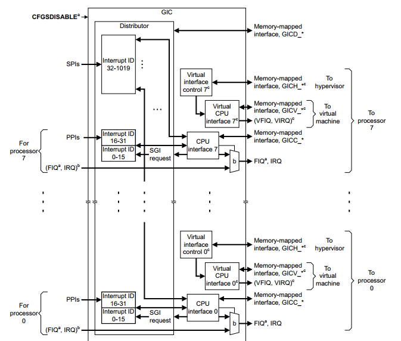

上图从上往下看可知GIC最多支持8个处理器（processor0~ processor7）。不同处理器的GIC功能是相同的，我们只看其中一个即可。
GIC主要分为分发器（Distributor）和CPU接口（CPU interface/Virtual CPU interface）。下面重点讲解着两部分。

分发器
^^^^^^^^^^^^^^^^^^^^^^^^^^^

分发器简介
>>>>>>>>>>>>>>>>>>>>>>>>>>>

分发器用于管理CPU所有中断源，确定每个中断的优先级，管理中断的屏蔽和中断抢占。最终将优先级最高的中断转发到一个或者多个CPU接口。CPU的中断源分为三类，讲解如下：

-  SPI(标号①)，SPI是共享中断，也就是我们在常用的串口中断、DMA中断等等。在图 54‑1中SPI中断编号为（32~1019），这是最大支持的中断数量，实际芯片支持的数量有芯片设计者决定，i.MX 6U支持128个SPI中断请求（中断编号为32~159），如下所示图片摘自《i.MX6UltraLite Applications Processor Reference Manual》Chapter 3Interrupts and DMA Events。

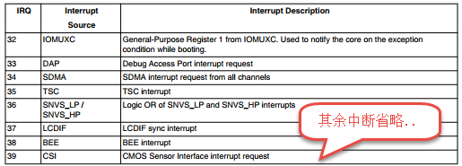

-  SGI，SGI是软件中断，PPI是CPU私有中断。SGI中断,共有16个中断，中断编号为0~15，SGI一般用于CPU之间通信，i.MX 6U是单核处理器，我们暂时不用过多关心SGI中断。。
-  PPI，PPI有16个中断，中断编号为16~31，SGI与PPI中断都属于CPU私有中断，每个CPU都有各自的SGI和PPI，这些中断被存储在GIC分发器中。CPU之间通过中断号和CPU编号唯一确定一个SGI或PPI中断。

分发器提供了一些编程接口或者说是寄存器，我们可以通过分发器的编程接口实现如下操作，稍后将介绍这些操作对应的寄存器。

- 全局的开启或关闭CPU的中断。
- 控制任意一个中断请求的开启和关闭。
- 设置每个中断请求的中断优先级。
- 指定中断发生时将中断请求发送到那些CPU（i.MX 6U是单核）。
- 设置每个"外部中断"的触发方式（边缘触发或者电平触发）。

分发器相关寄存器介绍
>>>>>>>>>>>>>>>>>>>>>>>>>>>

上一小节提到GIC分发器提供了一些编程接口，"编程接口"可以认为是寄存器，这里将简单介绍这些寄存器，因为我们程序中很少会去修改它。
更详细的内容请参考《ARM® Generic Interrupt Controller》4.3 Distributor register descriptions。

GIC分发器映射表如下所示。

表 分发器编程接口

=========== ================ ==== ========== ========================
偏移地址    寄存器名         类型 默认值     描述
=========== ================ ==== ========== ========================
0x000       GICD_CTLR        RW   0x00000000 分发器控制寄存器
0x004       GICD_TYPER       RO   待定       中断类型控制寄存器
0x008       GICD_IIDR        RO   待定       分发器版本信息寄存器
0x080       GICD_IGROUPRn    RW   待定       中断分组寄存器
0x100-0x17C GICD_ISENABLERn  RW   待定       中断使能寄存器
0x180-0x1FC GICD_ICENABLERn  RW   待定       中断屏蔽寄存器
0x200-0x27C GICD_ISPENDRn    RW   0x00000000 设置中断挂起寄存器
0x280-0x2FC GICD_ICPENDRn    RW   0x00000000 清除中断挂起寄存器
0x300-0x37C GICD_ISACTIVERn  RW   0x00000000 设置中断活动状态寄存器
0x380-0x3FC GICD_ICACTIVERn  RW   0x00000000 清除中断活动状态寄存器
0x400-0x7F8 GICD_IPRIORITYRn RW   0x00000000 中断优先级设置寄存器
0x800-0x81C GICD_ITARGETSRn  RO   待定       中断处理目标CPU寄存器
0xC00-0xCFC GICD_ICFGRn      RW   待定       中断类型（配置）寄存器
0xE00-0xEFC GICD_NSACRn      RW   0x00000000 非安全访问配置寄存器
0xF00       GICD_SGIR        WO              软件中断产生寄存器
0xF10-0xF1C GICD_CPENDSGIRn  RW   0x00000000 软件中断挂起寄存器
0xF20-0xF2C GICD_SPENDSGIRn  RW   0x00000000 软件中断取消挂起寄存器。
=========== ================ ==== ========== ========================

首先我们简单介绍上表，在表中只给出了寄存器相对于GIC分发器基地址的偏移地址，GIC基地址保存在另外的寄存器中，
使用到是我们将详细介绍。"默认值"选项中有"待定"手册原文是"IMPLEMENTATION DEFINED",
原因是这张表格摘自《ARM® Generic Interrupt Controller》，它不针对具体的芯片，这些寄存器的默认值由芯片厂商决定。

表格项"地址偏移"部分值是一个范围比如"中断使能寄存器"地址偏移为"0x100-0x17C"，
原因是"中断使能寄存器"有很多，地址偏移范围是"0x100-0x17C"。

部分寄存器简单介绍如下：

**中断使能寄存器GICD_ISENABLERn**

中断使能寄存器与中断屏蔽寄存器（GICD_ICENABLERn）是一一对应的，GIC分发器将中断的使能与屏蔽分开设置。

中断使能寄存器如下所示。

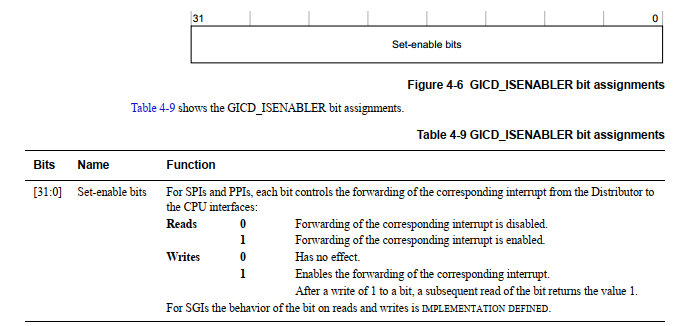

仅从《ARM® Generic Interrupt Controller》可知共有1020个（0~1019）中断号即1020个中断，很显然要分别控制每一个中断，
中断使能寄存器（GICD_ISENABLER）肯定不止一个。从表54‑1可知中断使能寄存器偏移地址为0x100-0x17C，
中断使能寄存器从GICD_ISENABLER0到GICD_ISENABLERn依次排布在这段地址空间。

在程序中我们是通过中断号区分不同的中断，假如我们已知中断号为m，那么我们怎么开启或关闭中断m呢？计算过程如下：

(1) 计算要设置那个中断使能寄存器（假设为n）,n = m / 32。例如中断号m = 34则中断使能寄存器为GICD_ISENABLER1。寄存偏移地址为(0x100 + (4*n)) = 0x120。
(2) 计算要设置哪一位，接步骤①，假设设置位为q，则q = m %32，m = 34,则开启中断号为34的中断就需要设置GICD_ISENABLER1[2]。

中断使能寄存器支持按位读、写，读出的数据是终端店额当前状态，为0则中断禁用，为1则中断启用。对中断使能寄存器写1则开启中断，写0无效。

**中断优先级设置寄存器GICD_IPRIORITYRn**

与中断使能寄存器一样GICD_IPRIORITYRn是一组寄存器，根据表 54‑1可知组寄存器位于0x400-0x7F8偏移地址处。中断优先级设置寄存器如下所示。

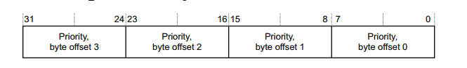

从上图可以看出每个中断标号占用8位，数值越小中断优先级越高。下面介绍如何根据中断编号找到对应的中断优先级设置寄存器。
假设中断编号为m，中断优先级寄存器为n，中断优先级设置位偏移为offset，则n = m /4。寄存器偏移地址为(0x400 + (4*n))。
在寄存器中的偏移为 offset= m%4。以 m = 65为例，n = 65/4 =16，所以中断优先级设置寄存器为GICD_IPRIORITYR16，offset(n) = 65%4 = 1，
中断号65对应的寄存器为GICD_IPRIORITYR16[8~15].

**中断处理目标CPU寄存器GICD_ITARGETSRn**

根据之前讲解GIC支持多大8个CPU，在多核处理器中，中断可以通过该寄存器设置处理该中断的从CPU。
例如中断A发生了，通过该寄存器可以将中断A发送到CPU0或发送到CPU1。中断处理目标寄存器如下图所示。

每个中断对应8位，位0~7分别代表CPU0~CPU7如下所示，一个中断也可以同时发送到多个CPU，
例如中断A对应的寄存器设置为0x03，则中断A发生后将会发送到CPU0和CPU1。

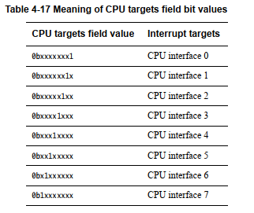

同样，中断处理目标CPU寄存器GICD_ITARGETSRn是一组寄存器，知道中断号经过简单计算之后就可以找到对应的寄存器，这里设中断编号为m，
中断处理目标CPU寄存器为n，中断处理目标CPU寄存器位偏移为offset，则n = m /4。在寄存器中的偏移为 offse t= m%4。
以 m = 65为例，n = 65/4 =16，所以中断处理目标CPU寄存器为GICD_ITARGETSR16，offset = 65%4 = 1，中断处理目标CPU寄存器为GICD_ITARGETSR16[8~15]。

CPU接口
~~~~~~~~~~~~~~~~~~~~~~~~~~~

CPU接口简介
^^^^^^^^^^^^^^^^^^^^^^^^^^^

CPU接口为链接到GIC的处理器提供接口，与分发器类似它也提供了一些编程接口，我们可以通过CPU接口实现以下功能：

-  开启或关闭向处理器发送中断请求.。
-  确认中断（acknowledging an interrupt）。
-  指示中断处理的完成。
-  为处理器设置中断优先级掩码。
-  定义处理器的抢占策略
-  确定挂起的中断请求中优先级最高的中断请求。

简单来说，CPU接口可以开启或关闭发往CPU的中断请求，CPU中断开启后只有优先级高于 "中断优先级掩码"的中断请求才能被发送到CPU。
在任何时候CPU都可以从其GICC_Hppir(CPU接口寄存器)读取当前活动的最高优先级。

CPU接口寄存器介绍
^^^^^^^^^^^^^^^^^^^^^^^^^^^

同GIC分发器，GIC的CPU接口模块同样提供了一些编程接口，"编程接口"在这里就是一些寄存器，GPU接口寄存器有很多，
我们只介绍几个常用的寄存器，其他寄存使用到时再详细介绍，CPU接口寄存器列表如下表所示。

表  CPU接口寄存器

============= ============ ==== ========== ========================
地址偏移      寄存器名字   类型 复位值     寄存器描述
============= ============ ==== ========== ========================
0x0000        GICC_CTLR    RW   0x00000000 CPU接口控制寄存器
0x0004        GICC_PMR     RW   0x00000000 中断优先掩码寄存器
0x0008        GICC_BPR     RW   0x0000000  中断优先级分组寄存器
0x000C        GICC_IAR     RO   0x000003FF 中断确认寄存器
0x0010        GICC_EOIR    WO   -          中断结束寄存器
0x0014        GICC_RPR     RO   0x000000FF 运行优先级寄存器
0x0018        GICC_HPPIR   RO   0x000003FF 最高优先级挂起中断寄存器
0x001C        GICC_ABPR    RW   0x0000000  GICC_BPR别名寄存器
0x0020        GICC_AIAR    RO   0x000003FF GICC_IAR别名寄存器
0x0024        GICC_AEOIR   WO   -          GICC_EOIR别名寄存器
0x0028        GICC_AHPPIR  RO   0x000003FF GICC_HPPIR别名寄存器
0x00D0-0x00DC GICC_APRn    RW   0x00000000 活动的优先级寄存器
0x00E0-0x00EC GICC_NSAPRnc RW   0x00000000 不安全的活动优先级寄存器
0x00FC        GICC_IIDR    RO   待定       CPU接口识别寄存器
0x1000        GICC_DIR     WO   -          禁用中断寄存器
============= ============ ==== ========== ========================

结合上表常用的CPU接口寄存器介绍如下：

**CPU接口控制寄存器GICC_CTLR**

**中断优先掩码寄存器GICC_PMR**

在上一小节我们讲解了GIC分发器的中断优先级设置寄存器GICD_IPRIORITYRn，每个中断占8位。这里的中断优先级掩码寄存器GICC_PMR用8位代表一个中断阈值。高于这个优先级的中断才能被送到CPU。GICC_PMR寄存器如下所示。

从上图可以看出GICC_PMR寄存器后8位（0~7）用于设置一个优先级，它的格式与GICD_IPRIORITYR寄存器相同。设置生效后高于此优先级的中断才能发送到CPU。需要注意的是8位寄存器只有高4位有效。与STM32一样，这四位还将分为"抢占优先级"和"子优先级"。讲解优先级分组时再详细介绍。

**中断优先级分组寄存器GICC_BPR**

中断优先级分组寄存器用于将8位的优先级分成两部分，一部分表示抢占优先级另外一部分表示自优先级，这和STM32的中断优先级分组相同。GICC_BPR寄存器如下所示。

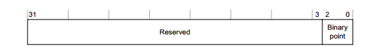

中断优先级分组寄存器的后三位用于设置中断优先级分组，如下表所示。

表  中断优先级分组

============== ====================== ======== ========== ======== ========
GICC_BPR [2:0] 中断优先级值PRI_N[7:4] 级数
============== ====================== ======== ========== ======== ========
\              二进制点               抢占级位 子优先级位 主优先级 子优先级
0b 001         0b xxxx                [7:4]    无         16       0
0b 010         0b xxxx                [7:4]    无         16       0
0b 011         0b xxxx                [7:4]    无         16       0
0b 100         0b xxx.y               [7:5]    [4]        8        2
0b 101         0b xx.yy               [7:6]    [5:4]      4        4
0b 110         0b x.yyy               [7]      [6:4]      2        8
0b 111         0b .yyyy               None     [7:4]      None     16
============== ====================== ======== ========== ======== ========

每个中断拥有8为中断优先级设置位，但是只有高4位有效，所以表 54‑3中GICC_BPR [2:0] 设置为1到3是相同的，即只有16级抢占优先级没有子优先级。

**中断确认寄存器GICC_IAR**

中断确认寄存器GICC_IAR保存当前挂起的最高优先级中断，寄存器描述如下图所示。

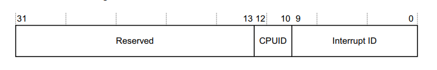

GICC_IAR寄存器共有两个字段，CPUID[10:12]保存请求中断的CPU ID。对于单核的

i.MX 6U来说可以忽略该位。interrupt ID[0:9]用于记录当前挂起的最高优先级中断，读取该寄存器，
如果结果是1023则表示当前没有可用的中断，常见的几种情况如下所示：

(1) 在GIC分发器中禁止了向CPU发送中断请求。
(2) 在GIC的CPU接口中禁止了向CPU发送中断请求。
(3) CPU接口上没有挂起的中断或者挂起的中断优先级小于等于GICC_PMR寄存器设定的优先级值。

CP15协处理器
~~~~~~~~~~~~~~~~~~~~~~~~~~~

在上一小节的GIC接口寄存器讲解部分我们只给出了"偏移地址"，GIC的基地址保存在CP15协处理器中。
我们修改系统控制寄存器以及设置中断向量表地址都会用到CP15协处理器。

CP15协处理器简介
^^^^^^^^^^^^^^^^^^^^^^^^^^^

CP15寄存器是一组寄存器编号为C0~c15。每一个寄存器根据寄存器操作码（opc1和opc2）和CRm又可分为多个寄存器，

以C0为例，如下图所示。

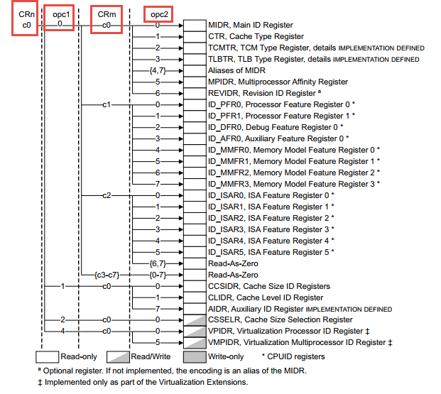

从上图可以看出根据opc1、CRm、opc2不同CRn（c0）寄存器分为了多个寄存器，我们修改c0寄存器时将会用到opc1、CRm、opc2，
它们的含义如下表所示。（表格摘自Cortex-A7 TechnicalReferenceManua，Table 4-1，更准确的解释请参考官方原文）。

表 协处理器寄存器说明

==== ================== =============================================================
选项 描述               原文
==== ================== =============================================================
CRn  协处理器寄存器编号 Primary register number within the system control coprocessor
Op1  寄存器操作码1      Opcode_1 value for the register
CRm  寄存器从编号       Operational register number within CRn
Op2  寄存器操作码2      Opcode_2 value for the register
==== ================== =============================================================

CP15协处理器寄存器的访问
^^^^^^^^^^^^^^^^^^^^^^^^^^^

在NXP的官方启动文件中有两处用到了CP15协处理寄存器，第一处是系统复位中断服务函数开始处，这里通过CP15修改系统控制寄存器，第二处是获取GIC控制器的基地址。稍后我们将介绍着两处代码，首先我们先学习如何读、写CP15协处理器寄存器。

CP15寄存器只能使用MRC/MCR寄存器进行读、写。

(1) 将CP15寄存器（c0~c15）的值读取到通用寄存器(r0~r12)。

   mrc {cond} p15, <Opcode_1>, <Rd>, <CRn>, <CRm>, <Opcode_2>

(2) 将通用寄存器(r0~r12)的值写回到CP15寄存器（c0~c15）

   mcr {cond} p15, <Opcode_1>, <Rd>, <CRn>, <CRm>, <Opcode_2>

CP15寄存器读、写指令说明如下：

-  cond：指令执行的条件码，忽略则表示无条件执行命令。
-  Opcode_1：寄存器操作码1 ，对应Op1选项。
-  Rd：通用寄存器，当为mrc时，用于保存从CP15寄存器读取得到的数据。当为mcr时，用于保存将要写入CP15寄存器的数据。
-  CRn：要读、写的CP15寄存器（c0~c15），对应的CRn选项。
-  CRm：寄存器从编号，对应CRm选项。
-  Opcode_2：寄存器操作码2，对应的Op2选项。

CP15读、写实例说明
^^^^^^^^^^^^^^^^^^^^^^^^^^^

在NXP官方的裸机启动代码里有两处使用到了CP15寄存器，包括本小节要使用的GIC基地址。说明如下：

复位中断服务函数中修改系统控制寄存器
>>>>>>>>>>>>>>>>>>>>>>>>>>>

通常情况下系统刚刚启动时为防止cache、中断、mmu对初始化造成不必要的影响，需要在复位中断服务函数中暂时关闭这些功能，
如下所示。

.. code-block:: asm
   :caption: 官方裸机复位中断处理代码
   :linenos:  

   Reset_Handler:
       cpsid   i               /* Mask interrupts */

   /* Reset SCTlr Settings */
   mrc  p15, 0, r0, c1, c0, 0     /* Read CP15 System Control register   */
   bic  r0,  r0, #(0x1 << 12)     /* Clear I bit 12 to disable I Cache   */
   bic  r0,  r0, #(0x1 <<  2)     /* Clear C bit  2 to disable D Cache    */
   bic  r0,  r0, #0x2    /* Clear A bit  1 to disable strict alignment  */
   bic  r0, r0, #(0x1 << 11) /*Clear Z bit 11 to disable branchprediction */
   bic  r0,  r0, #0x1     /* Clear M bit  0 to disable MMU  */
   mcr  p15, 0, r0,c1,c0,0 /* Write value back to CP15 System Controlregister */
   ...

结合以上代码，我们只看"mrc p15, 0, r0, c1, c0, 0"，不难看出，这里读取的CP15标号为c1的寄存器，
该寄存器介绍如下图所示。

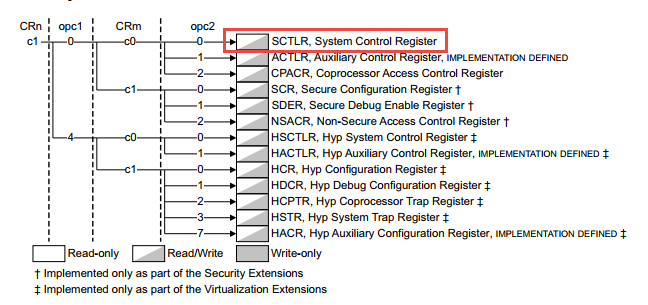

结合"mrc {cond} p15, <Opcode_1>, <Rd>, <CRn>, <CRm>, <Opcode_2> "指令不难看出这里就是读取的SCTLR(系统控制寄存器)。

- 第11行： "mcr p15, 0, r0,c1,c0,0"将修改过的r0寄存器值写入到系统控制寄存器。

在IRQ中断服务函数中获取GIC控制器基地址。
>>>>>>>>>>>>>>>>>>>>>>>>>>>

GIC基地址获取相关代码如下所示

.. code-block:: asm
   :caption: 获取GIC基地址
   :linenos:  

   /*******************第三部分******************************/
    MRC     P15, 4, r1, C15, C0, 0   /* Get GIC base address  */
    ADD     r1, r1, #0x2000          /* r1: GICC base address  */
    LDR     r0, [r1, #0xC]           /* r0: IAR */

对比"mrc {cond} p15, <Opcode_1>, <Rd>, <CRn>, <CRm>, <Opcode_2> "指令格式可知，CRn、CRm、Opcode_1、Opcode_2分别为c15、c0、4、0。
C15寄存器介绍如下图所示。

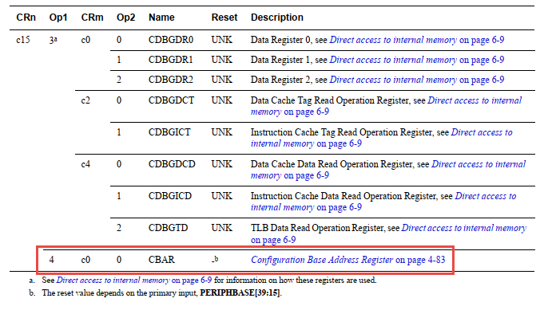

结合上图 可知"MRC P15, 4, r1, C15, C0, 0"读取的是CBAR寄存器。GIC基地址保存在CBAR寄存器中。

i.MX 6U中断分类
~~~~~~~~~~~~~~~~~~~~~~~~~~~

查找一个芯片有哪些类型的中断最简单的方法是查看官方启动文件，我们打开第五部分配套程序的IAR工程模板的
"\section5\IAR_project\libraries\iar"目录，文件"startup_MCIMX6Y2.s"是i.MX 6U启动文件。
启动代码的中断向量表部分代码如下所示，其他部分省略。

.. code-block:: asm
   :caption: 官方启动代码
   :linenos:  

   __vector_table
           ARM
           LDR     PC, Reset_Word           ; Reset
           LDR     PC, Undefined_Word       ; Undefined instructions
           LDR     PC, SVC_Word             ; Supervisor Call
           LDR     PC, PrefAbort_Word       ; Prefetch abort
           LDR     PC, DataAbort_Word       ; Data abort
           DCD     0                        ; RESERVED
           LDR     PC, IRQ_Word             ; IRQ interrupt
           LDR     PC, FIQ_Word             ; FIQ interrupt

           DATA

   Reset_Word      DCD   __iar_program_start
   Undefined_Word  DCD   Undefined_Handler
   SVC_Word        DCD   SVC_Handler
   PrefAbort_Word  DCD   PrefAbort_Handler
   DataAbort_Word  DCD   DataAbort_Handler
   IRQ_Word        DCD   IRQ_Handler
   FIQ_Word        DCD   FIQ_Handler

   ...

   __iar_program_start
           CPSID   I                         ; Mask interrupts

   ; Reset SCTLR Settings
   MRC     P15, 0, R0, C1, C0, 0     ; Read CP15 System Control register
   BIC     R0,  R0, #(0x1 << 12)     ; Clear I bit 12 to disable I Cache
   BIC     R0,  R0, #(0x1 <<  2)     ; Clear C bit  2 to disable D Cache
   BIC  R0,  R0, #0x2          ; Clear A bit  1 to disable strict alignment
   BIC   R0, R0, #(0x1 << 11) ; Clear Z bit 11 to disable branch prediction
   BIC     R0,  R0, #0x1             ; Clear M bit  0 to disable MMU
    ; Write value back to CP15 System Control register
    MCR     P15, 0, R0, C1, C0, 0     

           ; Set up stack for IRQ, System/User and Supervisor Modes
           ; Enter IRQ mode
           CPS     #0x12
           LDR     SP, =SFE(ISTACK)     ; Set up IRQ handler stack

           ; Enter System mode
           CPS     #0x1F
           LDR     SP, =SFE(CSTACK)     ; Set up System/User Mode stack

           ; Enter Supervisor mode
           CPS     #0x13
           LDR     SP, =SFE(CSTACK)     ; Set up Supervisor Mode stack

           LDR     R0, =SystemInit
           BLX     R0
           CPSIE   I                    ; Unmask interrupts

           ; Application runs in Supervisor mode
           LDR     R0, =__cmain
           BX      R0

           PUBWEAK Undefined_Handler
           PUBWEAK SVC_Handler
           PUBWEAK PrefAbort_Handler
           PUBWEAK DataAbort_Handler
           PUBWEAK IRQ_Handler
           PUBWEAK FIQ_Handler
           SECTION .text:CODE:REORDER:NOROOT(2)

           EXTERN  SystemIrqHandler

           ARM
     
   Undefined_Handler
           B .     ; Undefined instruction at address LR-Off \
                           (Off=4 in ARM mode and Off=2 in THUMB mode)

   SVC_Handler
           B .     ; Supervisor call from Address LR

   PrefAbort_Handler
           B .     ; Prefetch instruction abort at address LR-4

   DataAbort_Handler
           B .     ; Load data abort at instruction address LR-8

   IRQ_Handler
           PUSH    {LR}             ; Save return address+4
           PUSH    {R0-R3, R12}     ; Push caller save registers

           MRS     R0, SPSR         ; Save SPRS to allow interrupt reentry
           PUSH    {R0}

           MRC     P15, 4, R1, C15, C0, 0  ; Get GIC base address
           ADD     R1, R1, #0x2000         ; R1: GICC base address
           LDR     R0, [R1, #0xC]          ; R0: IAR

            PUSH    {R0, R1}
   
      CPS     #0x13   ; Change to Supervisor mode to allow interrupt reentry
   
            PUSH    {LR}              ; Save Supervisor LR
            LDR     R2, =SystemIrqHandler
            BLX     R2                ; Call SystemIrqHandler with param IAR
            POP     {LR}
   
            CPS     #0x12             ; Back to IRQ mode
   
            POP     {R0, R1}
   
        STR     R0, [R1, #0x10]   ; Now IRQ handler finished: write to EOIR
   
            POP     {R0}
            MSR     SPSR_CXSF, R0
   
            POP     {R0-R3, R12}
            POP     {LR}
            SUBS    PC, LR, #4

    FIQ_Handler
            B .     ; Unexpected FIQ
   
            END

我们不具体讲解汇编启动文件实现，仅仅从中提取我们需要的信息。

- 第1-10行： 这是我们要找的中断向量表，从这部分可知这个"表"共有8项，除去一个保留项（RESIVED）剩余7个有效项。各项介绍如下：

   - Res(reset)复位中断，即系统上电或者硬件复位，根据之前讲解系统复位后默认运行在SVC（特权模式）模式，我们裸机默认工作在该模式。
   - Undefined_Word（未定义指令异常中断），如果CPU检测到无法识别的指令时会进入未定义指令异常中断。这种情况下系统已经无法继续运行，只能通过硬件复位或者看门狗复位系统。
   - Supervisor Call（系统调用中断），这种中断用于带linux操作系统的情况，Linux内核（即驱动程序）运行在SVC（特权模式），而Linux应用程序运行在usr模式。应用程序中如果需要调用驱动程序，就需要首先通过系统调用中断切换到SVC(特权模式)，即我们常说的从"用户（应用）空间"切换到"内核空间"。
   - Prefetch abort（指令预取失败中断），这种中断的解释就是它的名字。在CPU执行当前指令时会"预取"下一个要执行的指令。如果"取指"失败就会进入该中断。CPU无法获取指令，所以这种情况下可以认为系统"挂了"。
   - Data abort（数据访问终止中断），同样这种中断的解释就是它的名字。CPU读取数据终止，就是说系统读数据错误、读不到数据，所以这种中断后系统也是不正常的。
   - IRQ（中断）与FIQ(快速中断)，IRQ与FIQ稍微复杂，简单理解理解为我们常用的外设中断（串口中断、DMA中断、外部中断等等）都将经过IRQ或FIQ传送到CPU。稍后将会详细介绍IRQ与FIQ。

- 第14-20行： 设置中断向量表，以第15行为例，使用"DCD"伪指令将"Reset_Word"（复位中断）跳转地址设置为"__iar_program_start"即复位中断发生后将会跳转到"__iar_program_start"位置执行即第三部分。
- 第24-68行： 程序入口，复位中断发生后程序将会跳转到这里执行，这里是程序的入口。具体代码我们暂时不关心。
- 第70-81行： 从上到下依次为Undefined_Word（未定义指令异常中断）、Supervisor Call（系统调用中断）、Prefetch abort（指令预取失败中断）、Data abort（数据访问终止中断）的中断跳转地址，可以看到他们都会跳转到"B ."即死循环，程序将会卡死在这里。
- 第83-114行： IRQ（中断），IRQ中断发生后程序将会跳转到这里执行，这里是后面小节讲解的重点，本小节主要讲解i.MX 6U中断类型，所以这里暂时跳过。
- 第116-119行： FIQ（快速中断），裸机程序只使用了IRQ，所以这里将FIQ中断执行代码设置为（B .）即死循环。

i.MX 6U 共享中断实现
~~~~~~~~~~~~~~~~~~~~~~~~~~~

在上一小节通过官方SDK启动文件介绍了i.MX 6U中断类型，我们可以发现虽然中断向量表中定义了7个中断，但是其中5个中断发生后直接进入死循环，
仅剩下复位中断和IRQ中断。我们常用的外设中断如串口中断、DMA中断等等怎么实现呢？很容易猜到是通过IRQ，
所有外设中断（共享中断）发生时都会进入IRQ中断，在IRQ中断处理函数中进一步区分具体的外设中断。

从官方裸机启动程序看是这样子的，我们可以从GIC功能框图中的到印证。如下图所示。

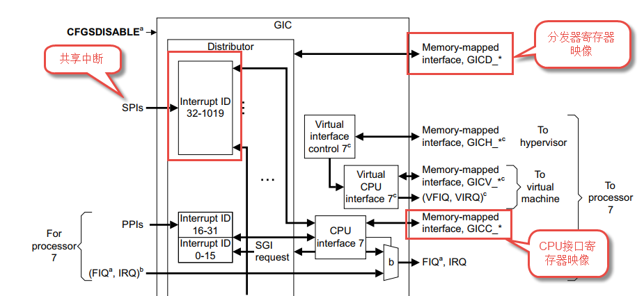

结合上图介绍如下，无论是SPI中断、PPI中断、还是SGI中断，它们都链接到了CPU接口，而CPU接口接口输出到CPU的只有两个FIQ和IRQ(VFIQ和VIRQ这里没有用到，暂时忽略)。
中断标号为0~1019的任意一个中断发生后CPU都会跳转到FIQ或IRQ中断服务函数去执行。在官方裸机代码中默认关闭了FIQ，只使用了IRQ。

根据之前讲解，GIC控制器为我们提供了两个编程接口，分别为分发器寄存器和CPU接口寄存器。
下面将结合NXP官方SDK中的裸机工程讲解i.MX 6U共享中断的实现。NXP官方裸机共享中断实现代码如所示，
我们将参照官方代码讲解并最终将官方启动文件移植到我们自己的工程中。

.. code-block:: asm
   :caption: IRQ共享中断实现
   :linenos:  

   IRQ_Handler:

       push    {lr}         /* Save return address+4     */
       push    {r0-r3, r12} /* Push caller save registers           */

       MRS     r0, spsr    /* Save SPRS to allow interrupt reentry  */
       push    {r0}

       MRC     P15, 4, r1, C15, C0, 0   /* Get GIC base address  */
       ADD     r1, r1, #0x2000          /* r1: GICC base address  */
       LDR     r0, [r1, #0xC]           /* r0: IAR */

       push    {r0, r1}

      CPS  #0x13 /* Change to Supervisor mode to allow interrupt reentry */

       push    {lr}            /* Save Supervisor lr  */
       LDR     r2, =SystemIrqHandler
       BLX     r2              /* Call SystemIrqHandler with param GCC */
       POP     {lr}

       CPS     #0x12           /* Back to IRQ mode */

       POP     {r0, r1}

       STR     r0, [r1, #0x10] /* Now IRQ handler finished: write to EOIR */

       POP     {r0}
       MSR     spsr_cxsf, r0

       POP     {r0-r3, r12}
       POP     {lr}
       SUBS    pc, lr, #4
       .size IRQ_Handler, . - IRQ_Handler

       .align 2
       .arm
       .weak FIQ_Handler
       .type FIQ_Handler, %function

结合代码讲解如下：

同函数调用类似，进入中断函数之前要将程序当前的运行状态保存保存到"栈"中。中断执行完成后能够恢复进入中断之前的状态。

- 第3、4行： 保存当前状态，同函数调用类似，进入中断函数之前要将程序当前的运行状态保存保存到"栈"中。
   中断执行完成后能够恢复进入中断之前的状态。

   - 指令"push {lr}"将lr寄存器"入栈"，
      根据之前讲解当进行函数调用或发生中断时sp(程序计数寄存器，保存当前程序执行位置（Thumb）加4)的值会自动保存到lr寄存器中。
      lr的值将做为函数会中断返回的地址。
   - 指令"push {r0-r3, r12}"将r0~r3寄存器以及r12寄存器"入栈"。
      r0~r3和r12是通用寄存器，在函数中它们可以用于任何用途，但是在函数调用或函数返回时它们用于传入函数参数以及传出返回值等等。
      中断可能发生在程序的任意时刻，所以进入中断之前也要保存这些信息。

- 第6、7行：于保存spsr(备份程序状态寄存器)。
   SPRS是特殊功能寄存器不能直接访问，指令"MRS r0, spsr"用于将spsr寄存器的值保存到r0寄存器，
   然后使用"push {r0}"指令将spsr寄存器的值保存到"栈"中。

- 第9-11行：获取GIC基地址以及GICC_IAR寄存器的值。
   这部分代码使用到了CP15协处理器，在54.2 CP15协处理器章节已经介绍，这里不再赘述，简单说明各指令的作用。
   指令"MRC P15, 4, r1, C15, C0, 0"将GIC基地址保存到r1寄存器中。指令"ADD r1, r1,#0x2000"在GIC基地址基础上增加0x2000，
   得到GICC(GIC的cpu接口寄存器基地址)基地址。指令"LDR r0, [r1, #0xC]"读取GICC_IAR寄存器的值到r0寄存器。

- 第13行：将GICC基地址和GICC_IAR寄存器值入栈。第三部分代码将GICC基地址保
   存在了r1寄存器，将GICC_IAR寄存器的值保存在了r0寄存器，中断执行完成后我们还要用到这些内容，所以这里将他们"入栈"保存。

- 第15行：切换到Supervisor模式。

- 第17-20行：跳转到"SystemIrqHandler"函数执行共享中断对应的中断服务函数。
   指令"push {lr}"保存当前的链接寄存器，即保存程序的返回地址。指令"LDR r2, =SystemIrqHandler"用于将函数"SystemIrqHandler"地址保存到r2寄存器中。
   指令"BLX r2"是有返回的跳转，程序将会跳转到"SystemIrqHandler"函数执行。函数"SystemIrqHandler"保存在"~\base_code\section5\IAR_project\libraries\\ system_MCIMX6Y2.c"文件内。
   我们可以用VS code或者直接打开"~\base_code\section5\"目录下的IAR工程。去掉不必要的条件编译后如下所示。

.. code-block:: c
   :caption: systemIrqHandler共享中断处理函数
   :linenos:  

   __attribute__((weak)) void SystemIrqHandler(uint32_t giccIar)
   {
     uint32_t intNum = giccIar & 0x3FFUL;

     // rgb_led_init();
     // blue_led_on;
     /* Spurious interrupt ID or Wrong interrupt number */
     if ((intNum == 1023) || (intNum >= NUMBER_OF_INT_VECTORS))
     {
       return;
     }

     irqNesting++;

     // __enable_irq();      /* Support nesting interrupt */

     /* Now call the real irq handler for intNum */
     irqTable[intNum].irqHandler(giccIar, irqTable[intNum].userParam);

     // __disable_irq();
     irqNesting--;
   }

结合代码，各部分讲解如下:

- 第1行：SystemIrqHandler函数有一个入口参数"giccIar"，它是GICC_IAR寄存
器的值。在代码清单 54‑4的第四部分代码中，我们将GICC_IAR寄存器的值保存到了R0寄存
器，跳转到SystemIrqHandler函数之后R0寄存器的值作为函数参数。

- 第3行：获取中断的中断编号。中断编号保存在GICC_IAR寄存器的后10位（0~9）如下所示。

- 第8-13行：判断中断标号是否有效。根据之前讲解如果中
断无效，则读取得到的中断号为1023。"NUMBER_OF_INT_VECTORS"是i.MX 6U支持
的最大中断号加一，大于等于这个值的中断编号也被认为无效。

- 第18行：如果中断编号有效，这部分根据中断编号在"irqTable"中找到对应的
中断服务函数。我们简单了解一下这个表。表定义在system_MCIMX6Y2.h文件，如下所示。

.. code-block:: c
   :caption: 本地中断向量表定义
   :linenos:  

   /*中断数量*/
   #define NUMBER_OF_INT_VECTORS 160       
   /*本地中断向量表*/
   static sys_irq_handle_t irqTable[NUMBER_OF_INT_VECTORS];

这里把"irqTable"叫做"本地中断向量表"，我们所熟知的那个中断向量表在启动文件中实现，并且位于程序的开始处（0x80002000）。
"本地中断向量表"的作用是当IRQ中断发生后找到对应的处理函数。从上方代码不难看出，本地中断向量表是一个"sys_irq_handle_t"结构体类型的数组。
"sys_irq_handle_t"结构体如下所示。

.. code-block:: c
   :caption: sys_irq_handle_t结构体
   :linenos:  

   typedef void (*system_irq_handler_t) (uint32_t giccIar, void *param);
   /**
    * @brief IRQ handle for specific IRQ
    */
   typedef struct _sys_irq_handle
   {
      system_irq_handler_t irqHandler; /**< IRQ handler for specific IRQ */
      void *userParam;    /**< User param for handler callback */
   } sys_irq_handle_t;

结合以上代码可知，sys_irq_handle_t结构体中有一个函数指针和函数参数指针，函数指针用于指定中断的中断处理函数，
函数参数指针用于指定中断处理程序的用户参数。初始化中断时我们会根据中断编号初始化对应的数组项（irqTable[]）。
同样，中断发生后再SystemIrqHandler函数中根据中断标号找到对应的中断处理函数。

-  第7行： 函数SystemIrqHandler执行完成后IRQ中断并没有结束，这部分代码用于标记中断处理完成并恢复中断前的状态。

按键中断实验
~~~~~~~~~~~~~~~~~~~~~~~~~~~
在上一小节我们结合官方SDK里的代码讲解了共享中断实现。本小节讲解移植官方中断相关代码并实现一个简单的按键控制RGB灯的实验。

**本章的示例代码目录为：base_code/bare_metal/interrupt_init**

**野火裸机下载工具download_tool路径为：base_code/bare_metal/download-tool/download-tool.tar.bz2**

实验说明
^^^^^^^^^^^^^^^^^^^^^^^^^^^

硬件介绍
>>>>>>>>>>>>>>>>>>>>>>>>>>>

本实验会使用到Pro板的button2按键和RGB灯。

原理图分析
>>>>>>>>>>>>>>>>>>>>>>>>>>>

- RGB灯原理图请参考 *第四章节汇编点亮LED灯* 章节。
- 按键原理图请参考 *GPIO输入—按键查询检测* 章节。

实验代码讲解
^^^^^^^^^^^^^^^^^^^^^^^^^^^

编程思路
>>>>>>>>>>>>>>>>>>>>>>>>>>>

由于中断涉及的内容较多，添加的文件也较多，这里只介绍重点，完整的代码请参考本章配套程序。
本章程序在按键对应源码基础上修改得到，主要修改内容包括添加NXP官方SDK中断相关文件、修改启动文件，添加按键中断代码。

代码分析
>>>>>>>>>>>>>>>>>>>>>>>>>>>

添加SDK官方中断相关代码
---------------------------

如下图所示，在"/interrupt_init/include"目录下共添加了5个中断相关的头文件。

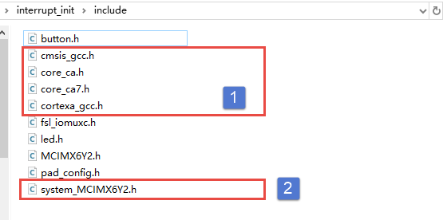

标号①处是内核相关头文件以及符合CMSIS标准的头文件，没有对应的.c文件，这些头文件提供了系统控制函数以及特殊寄存器操作函数，我们直接添加到我们工程即可，几乎不用修改。

标号②处是系统初始化头文件与它对应的.c文件位于本章源码的"/interrupt_init/device"目录下，这里包含我们需要的中断初始化代码以及MMU、时钟等等初始化代码。
这里我们只关心中断相关内容，稍后将会结合修改后的代码详细介绍。

修改启动文件
---------------------------

启动文件参照官方GCC版本启动文件修改，官方文件位于"i.MX6ULL系列\1-野火开源图书合集\书籍配套代码\\ base_code_2019_11_09\section5\IAR_project\libraries\gcc"目录下，
修改后的源码如下所示。

.. code-block:: asm
   :caption: 启动代码
   :linenos:  

   /*DDR的前8K字节保留， [0x80000000-0x80001FFF] 保留为ROM区域 */

   /*定义内存起始地址和大小*/
   #define m_DDR_start             0x80000000
   #define m_DDR_size              0x20000000

   /*定义主代码区域，m_text_start将会作为中断向量表的起始地址，链接脚本中
   *将该地址用作起始链接地址。
   */
   #define  m_text_start           0x80002000

   /*定义Supervisor工作模式的栈起始地址和大小
   *野火开发板标配512M字节的DDR, Supervisor工作模式的栈和IRQ工作模式的栈
   *位于DDR的后2M地址，大小均为1M。
   */
   #define   SUP_model_stack_start     0x9FE00000
   #define   SUP_model_stack_size      0x00100000

   /*定义IRQ工作模式的栈起始地址和大小，大小为1M*/
   #define   IRQ_model_stack_start     0x9FF00000
   #define   IRQ_model_stack_size      0x00100000

   .text
   .align 2         //设置字节对齐
   .global _start
   _start:

       ldr     pc, =Reset_Handler           /* Reset                  */
       ldr     pc, =Undefined_Handler       /* Undefined instructions */
       ldr     pc, =SVC_Handler             /* Supervisor Call        */
       ldr     pc, =PrefAbort_Handler       /* Prefetch abort         */
       ldr     pc, =DataAbort_Handler       /* Data abort             */
       .word   0                            /* RESERVED               */
       ldr     pc, =IRQ_Handler             /* IRQ interrupt          */
       ldr     pc, =FIQ_Handler             /* FIQ interrupt          */

   Reset_Handler:
       cpsid   i                         /* 全局关闭中断 */

       mrc     p15, 0, r0, c1, c0, 0     /*读取CP15系统控制寄存器   */
       bic     r0,  r0, #(0x1 << 12)     /*  清除第12位（I位）禁用 I Cache  */
       bic     r0,  r0, #(0x1 <<  2)     /*  清除第 2位（C位）禁用 D Cache  */
       bic     r0,  r0, #0x2             /*  清除第 1位（A位）禁止严格对齐   */
       bic     r0,  r0, #(0x1 << 11)     /*  清除第11位（Z位）分支预测   */
       bic     r0,  r0, #0x1             /*  清除第 0位（M位）禁用 MMU   */
       mcr     p15, 0, r0, c1, c0, 0     /*  将修改后的值写回CP15寄存器   */

       /* 定义IRQ工作模式的栈起始地址 */
       cps     #0x12                
       ldr     sp, =IRQ_model_stack_start    

       /*定义User工作模式的栈起始地址，与Supervisor相同*/
       cps     #0x1F               
       ldr     sp, =SUP_model_stack_start    

       /*定义Supervisor工作模式的栈起始地址，与User相同 */
       cps     #0x13                
       ldr     sp, =SUP_model_stack_start   

       /*跳转到系统初始化函数，初始化GIC、CACHE-L1、mmu等等*/
       ldr     r2, =SystemInit      
       blx     r2  
       /*开启全局中断*/
       cpsie   i                   

       /*跳转到到 main 函数执行，*/
       b main                
       b .        /*死循环*/
       /*其他中断处理函数与官方相同这里省略，可直接打开源码查看*/

代码中一些内容在讲解官方启动文件时已经介绍，这里重点介绍修改的部分。结合代码各部分说明如下：

- 第1-22行： 内存相关的宏定义，通过宏记录内存的大小、起始地址、链接起始地址以及栈起始地址和大小，便于后面代码中调用。
- 第24-36行： 定义中断向量表。在讲解中断类型时介绍了这些中断，这些代码与官方启动文件完全相同。
- 第38-47行： 复位中断服务函数。复位中断服务函数中要完成系统初始化并为进入C环境设置栈空间。代码第三部分到第六部分都是复位中断服务函数的内容。这部分做了两件事，第一，使用"cpsidi"指令关闭全局中断，防止中断干扰初始化过程。第二，剩余代码修改修改系统控制寄存器关闭我们暂时用不到的功能，例如cache、mmu等等。
- 第49-59行： 设置栈地址。本程序将栈地址设置在DDR的末尾处。IRQ工作模式的栈位于0x9FF00000地址处（DDR最后1M地址空间）。User模式和Supervisor模式使用相同的栈空间，位于0x9FE00000起始地址处，大小为1M。
- 第61-69行： 调用"SystemInit"执行系统初始化。上一步设置了"栈"所以这里就可以直接调用C函数了。SystemInit函数如下所示。

.. code-block:: c
   :caption: SystemInit函数
   :linenos:  

   void SystemInit(void)
   {
     uint32_t sctlr;
     uint32_t actlr;
   /*FPU 相关代码省略*/

     L1C_InvalidateInstructionCacheAll();
     L1C_InvalidateDataCacheAll();

     actlr = __get_ACTLR();
     actlr = (actlr | ACTLR_SMP_Msk); /* Change to SMP mode before enable DCache */
     __set_ACTLR(actlr);

     sctlr = __get_SCTLR();
     sctlr = (sctlr & ~(SCTLR_V_Msk | /* Use low vector */
                        SCTLR_A_Msk | /* Disable alignment fault checking */
                        SCTLR_M_Msk)) /* Disable MMU */
             | (SCTLR_I_Msk |         /* Enable ICache */
                SCTLR_Z_Msk |         /* Enable Prediction */
                SCTLR_CP15BEN_Msk |   /* Enable CP15 barrier operations */
                SCTLR_C_Msk);         /* Enable DCache */
     __set_SCTLR(sctlr);

     /* Set vector base address */
     GIC_Init();

     __set_VBAR((uint32_t)__VECTOR_TABLE);

   /*FPU 相关代码省略*/
   }

SystemInit函数去除FPU相关代码（FPU暂时不使用），大致分为五部分，结合代码介绍如下。

- 第7、8行： 无效化Icache和Dcache。虽然我们前面已经关闭了cache这里再次无效化cache可能出于安全考虑，我们不深究，参考官方的写即可。
- 第10-11行： 修改辅助控制寄存器ACTLR，使能SMP模式。
- 第14-22行： 修改系统控制寄存器，开启我们需要的的功能，例如默认开启了Cahe，关闭了MMU。
- 第25行： 初始化GIC。在GIC_Init初始化函数可直接使用NXP官方函数，无需修改。
- 第27行： 这部分非常重要，它用于设置中断向量表起始地址。在程序中，中断向量表可以放到任意的位置，但是必须将中断向量表的起始地址写入VBAR寄存器。这样中断发生后CPU才能找到中断向量表。

SystemInit函数执行完成后，系统已经可以接受中断了，我们回到上一部分的代码，开启全局中断并跳转到main函数开始执行。

在启动文件中另外一个重要内容就是IRQ中断服务函数，根据之前讲解i.MX 6U共有160个中断（这里忽略了NotAvail中断），
这么多中断共享IRQ中断，即在IRQ中断服务函数中根据中断号再次区分这160个中断。这部分内容与NXP官方启动文件相同，
详细介绍请参考i.MX 6U共享中断实现章节。这里不再赘述。

添加按键中断初始化代码
---------------------------

与STM32中断初始化不同，我们将详细介绍这部分内容。此外，为了简化程序，我们并没有使用GIC接口寄存器配置每个中断的中断优先级、中断分组等等。中断优先级和中断优先级分组保持函数"SystemInit"设定的默认值。

GPIO引脚中断初始化函数如代码如下所示。

.. code-block:: c
   :caption: 按键中断初始化
   :linenos:  

   /*按键2 GPIO端口、引脚号及IOMUXC复用宏定义*/
   #define button2_GPIO               GPIO5
   #define button2_GPIO_PIN           (1U)
   /*按键初始化函数*/
   void interrupt_button2_init(void)
   {
       volatile uint32_t *icr;  //用于保存 GPIO-ICR寄存器的地址,与 icrShift 变量配合使用
       uint32_t icrShift;       //引脚号大于16时会用到,
   
       icrShift = button2_GPIO_PIN;  //保存button2引脚对应的 GPIO 号

       /*添加中断服务函数到  "中断向量表"*/
       SystemInstallIrqHandler(GPIO5_Combined_0_15_IRQn, \
         (system_irq_handler_t)EXAMPLE_GPIO_IRQHandler, NULL);

       GIC_EnableIRQ(GPIO5_Combined_0_15_IRQn);                 //开启中断
   
       CCM_CCGR1_CG15(0x3);  //开启GPIO5的时钟
   
       /*设置 按键引脚的PAD属性*/
       IOMUXC_SetPinMux(IOMUXC_SNVS_SNVS_TAMPER1_GPIO5_IO01,0);     
       IOMUXC_SetPinConfig(IOMUXC_SNVS_SNVS_TAMPER1_GPIO5_IO01, button_PAD_CONFIG_DATA);

       /*设置GPIO方向（输入或输出）*/
       GPIO5->IMR &= ~(1 << button2_GPIO_PIN);  //寄存器重置为默认值
       GPIO5->GDIR &= ~(1<<1);                  //设置GPIO5_01为输入模式

       /*设置GPIO引脚中断类型*/
       GPIO5->EDGE_SEL &= ~(1U << button2_GPIO_PIN);//寄存器重置为默认值
   
       if(button2_GPIO_PIN < 16)
       {
           icr = &(GPIO5->ICR1);
       }
       else
       {
           icr = &(GPIO5->ICR2);
           icrShift -= 16;
       }
   
       /*按键引脚默认低电平，设置为上升沿触发中断*/
        *icr = (*icr & (~(3U << (2 * icrShift)))) | (2U << (2 * icrShift));

        button2_GPIO->IMR |= (1 << button2_GPIO_PIN); //使能GPIO引脚中断
   }

.. code-block:: c
   :caption: SystemInstallIrqHandler函数
   :linenos:  

   void SystemInstallIrqHandler(IRQn_Type irq, \
                 system_irq_handler_t handler,\
                              void *userParam) 
   {
     irqTable[irq].irqHandler = handler;
    irqTable[irq].userParam = userParam;
   }

结合代码，各部分说明如下：

- 第2、3行： 这部分内容定义在button.h文件夹下，定义本次使用的GPIO引脚。
- 第13、14行： 添加中断服务函数到"本地中断向量表"，在STM32程序中，中断服务函数在启动文件中已经定义好了，我们只需要实现即可。但这里需要手动添加中断服务函数到"本地向量表中" SystemInstallIrqHandler函数原型如上所示。从以上代码不难看出，该函数就是根据中断号填充全局结构体数组"irqTable"。SystemInstallIrqHandler函数共有三个参数，irq指定中断对应的中断号，handler指定中断服务函数，userParam指定中断服务函数的用户参数，如果不同设置为"NULL"即可。
- 第16行： 开启中断。GIC相关操作函数定义在core_ca.h文件。感兴趣可以使用这些函数实现更完善的中断。
- 第18行： 在16行已经开启了中断，后面是GPIO相关初始化。这部分开启GPIO5的时钟并设置对应GPIO引脚属性，这和LED灯引脚初始化相同。
- 第25、26行： 设置引脚为输出模式。
- 第29-39行： 设置引脚触发方式。和ST32类似，分为高电平触发、低电平触发、上升沿触发、下降沿触发。在寄存器中每个GPIO占用两位，所以每组GPIO前16个使用GPIOx_ICR1，后16个（根据GPIO组不同，可能不够16个）使用GPIOx_ICR2。
- 第44行： 使能GPIO引脚中断。

main函数实现和中断服务函数实现
---------------------------

GPIO引脚中断初始化完成后，验证代码就比较简单了。我们定义一个全局变量，在按键中断服务函数中循环切换0和1。
在main函数循环检测全局变量的值，大于0则亮红灯，否则亮绿灯。如下所示。

.. code-block:: c
   :caption: main函数和中断服务函数
   :linenos:  

   /*按键中断处理函数*/
   void EXAMPLE_GPIO_IRQHandler(void)
   {
       /*按键引脚中断服务函数*/
       button2_GPIO->ISR = 1U << button2_GPIO_PIN;  //清除GIIP中断标志位
       if(button > 0)
       {
           button = 0;
       }
       else
       {
           button = 1;
       }
   }

   int main()
   {
       int i = 0;
       rgb_led_init();             //初始化 RGB 灯，初始化后 默认所有灯都不亮。
       interrupt_button2_init();   //初始化引脚，和引脚的中断方式以及开启引脚中断。

       while (1)
       {
           if(button > 0)
           {
               /*绿灯亮*/
               red_led_off;
               green_led_on;
           }
           else
           {
               /*红灯亮*/
               green_led_off;
               red_led_on;
           }
       }
       return 0;
   }

实验准备
^^^^^^^^^^^^^^^^^^^^^^^^^^^

编译程序
>>>>>>>>>>>>>>>>>>>>>>>>>>>
程序编写完成后，在“interrupt_init” 文件夹下执行make命令，makefile工具便会自动完成程序的编译、链接、格式转换等工作。
正常情况下我们可以在当前目录看到生成的一些中间文件以及我们期待的.bin文件。

烧录程序
>>>>>>>>>>>>>>>>>>>>>>>>>>>
在编译下载官方SDK程序到开发板章节我们详细讲解了如何将二进制文件烧写到SD卡（烧写工具自动实现为二进制文件添加头）。这里再次说明下载步骤。

-  将一张空SD卡（烧写一定会破坏SD卡中原有数据！！！烧写前请保存好SD卡中的数据），接入电脑后在虚拟机的右下角状态栏找到对应的SD卡。将其链接到虚拟机。

-  进入烧写工具目录，执行"./mkimage.sh <烧写文件路径>"命令,例如要
   烧写的led.bin位于home目录下，则烧写命令为"./mkimage.sh /home/led.bin"。

-  执行上一步后会列出linux下可烧写的磁盘，选择你插入的SD卡即可。这一步
   非常危险！！！一定要确定选择的是你插入的SD卡！！，如果选错很可能破坏你电脑
   磁盘内容，造成数据损坏！！！。确定磁盘后SD卡以"sd"开头，选择"sd"后面的字
   符即可。例如要烧写的sd卡是"sdb"则输入"b"即可。

程序运行结果
^^^^^^^^^^^^^^^^^^^^^^^^^^^

烧写完成，首先将开发板启动方式设置为SD卡启动，将SD卡插入开发板卡槽。
接通电源后循环按下sw2(KEY)按键，正常情况下可以看到RGB灯交替亮红、绿色。

