.. vim: syntax=rst

熟悉sdk
----------------------------------------

本章节内容处于开发笔记状态，还待整理至最终版的教程。

本章节内容处于开发笔记状态，还待整理至最终版的教程。

SDK（Software Development Kit）是NXP针对其官方评估
版的软件开发包，可以在NXP的官网下载得到。SDK中包含了各种程序范例，我们心心念念的固件库也包含在它里边。

SDK的下载提供很多选择，下载步骤比较复杂，在本章的配套例程文件夹中包含了SDK的原件，可直接使用。若想亲自到官网下载，请按如下步骤操作，不感兴趣可直接跳过该步骤：

(1) 访问NXP官网下载链接：https://mcuxpresso.nxp.com/en/dashboardhttps://www.nxp.com/products/processors-and-microcontrollers/arm-processors/i.mx-applications-
processors/i.mx-6-processors/i.mx-6ull-single-core-processor-with-arm-cortex-a7-core:i.MX6ULL?tab=Design_Tools_Tab

(2) 未登录的用户需要先登录NXP官网，没有帐号的需要先注册，具体如下所示。

..

(3) 打开链接之后选择“TOOLS&SOFTWATE”如下所示。

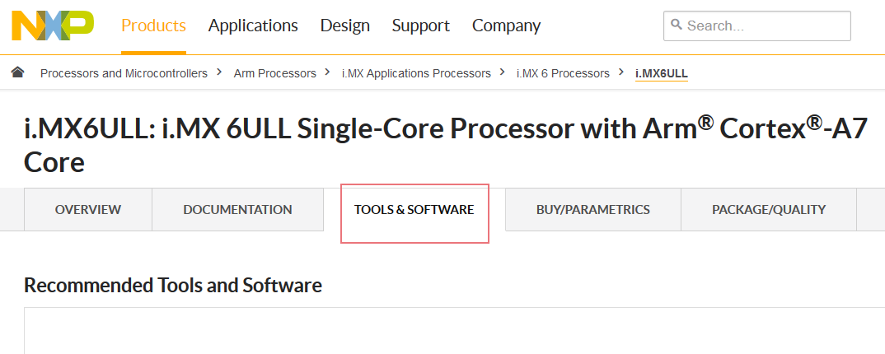

(4) 网页上可以看到多个下载选项我们选择“SDK2.2_iXMX6ULL_WIN”下载项目点击下载即可，如下所示。

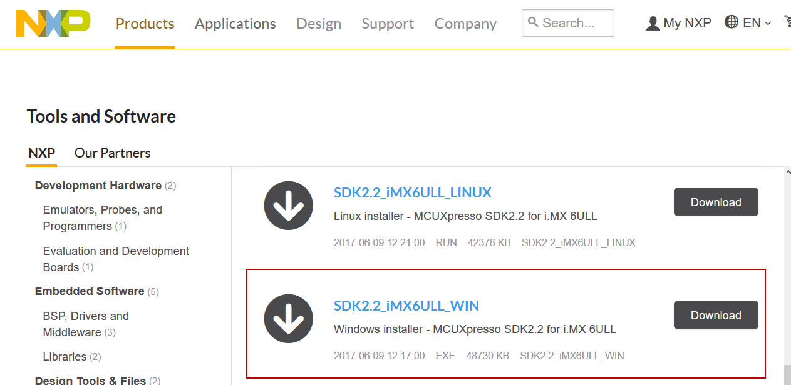

SDK目录、文件简介
~~~~~~~~~~~~~~~~~~~~~~~~~~~~~~~~~~~~~~~~~~~~~~~~~~

本书讲解的例程全部采用2.2版本SDK的库文件，以下内容请大家打开“SDK_2.2_MCIM6ULL_EBF6ULL”的SDK包配合阅读，如下所示。

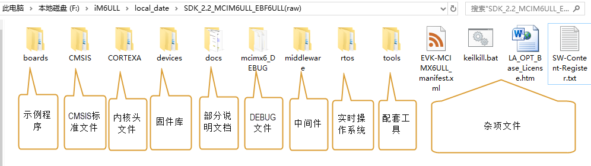

boards：示例程序
^^^^^^^^^^^^^^^^^^^^^^^^^^^^^^^^^^^^^^^^^^^^^^^^^^^^^^^^^^^^^^^^^^^^^^^^^^^^^

SDK的boards目录包含了NXP官方评估版MCIMX6ULL-EVK的各种示例程序，非常有参考价值。

例如，下图是“boards\evkmcimx6ull”目录。

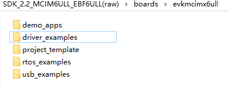

这些文件夹的说明如下：

-  demo_apps包含了一些应用范例，如串口打印“hello world”、使用lwip协议栈进行网络通讯等内容，具体如下图所示。

..

.. image:: media/sdk007.png
   :align: center
   :alt: 未找到图片

-  driver_example包含了i.mx6主要片上外设的使用范例，非常详细。例】
   如在“boards\evkmcimx6ull\driver_examples”目录下包含各个外设的程序如下图所示。

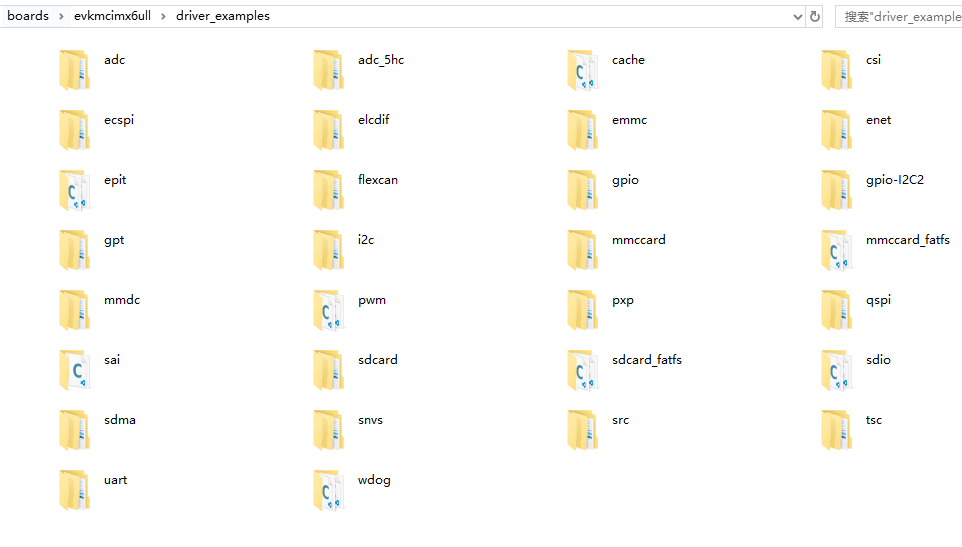

-  project_template包含了官方示例使用的一些必备文件，这些文件主要是针对官方评估板做了一些引脚定义、时钟配置等功能，具体如下所示。

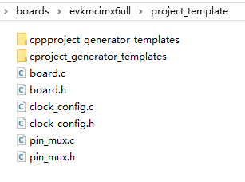

-  rtos_examples包含了使用FreeRTOS实时操作系统的应用范例，具体如下所示，使用了操作系统可以进行多任务编程。

..

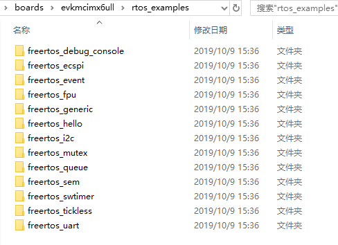

-  usb_examples包含了各种USB程序示例，具体如下所示。USB设备种类繁多且驱动复杂，参考官方的这些示例能快速建立自己需要的USB应用。

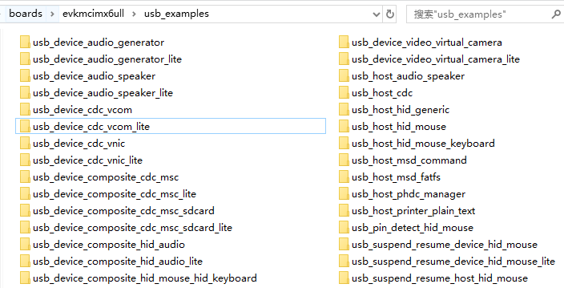

CMSIS：包含CMSIS标准相关的文件
^^^^^^^^^^^^^^^^^^^^^^^^^^^^^^^^^^^^^^^^^^^^^^^^^^^^^^^^^^^^^^^^^^^^^^^^^^^^^^^^^^^^^^^^^^^^^^^^^^^^

在2.2版本的SDK中，CMSIS只有一个GCC 相关头文件，使用到时我们将会详细介绍。

devices：i.mx固件库
^^^^^^^^^^^^^^^^^^^^^^^^^^^^^^^^^^^^^^^^^^^^^^^^^^^^^^^^^^^^^^^^^^^^^^^^^^^

SDK中的devices目录包含的内容就是外设驱动固件库，该目录下的MCIMX6Y2文件夹即是针对开发板板载芯片对应的固件库，具体如下所示。

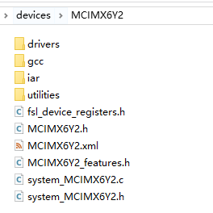

对此目录下的内容说明如下：

MCIMX6Y2目录下的全局文件
''''''''''''''''''''''''''''''''''''''''''''''''''''''''''''''''''''''''''''''''

在MCIMX6Y2根目录下，可发现它直接包含一些文件，这些文件非常重要，是使用固件库编程最基础的部分，具体如下所示。

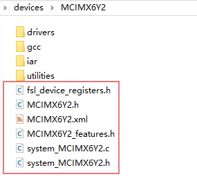

-  fsl_device_registers.h文件

..

   fsl_device_registers.h文件的具体内容如下。

.. code-block:: c
   :caption: fsl_device_registers.h文件的具体内容
   :linenos:  

   /*
    *根据CPU型号包含相应的头文件
    *在开发环境的全局宏定义中应根据CPU 指定芯片型号
    */
   #if (defined(CPU_MCIMX6Y2CVM05) || defined(CPU_MCIMX6Y2CVM08) \
   || defined(CPU_MCIMX6Y2DVM05) || defined(CPU_MCIMX6Y2DVM09))
   #define MCIMX6Y2_SERIES
   /* CMSIS-style register definitions */
   #include "MCIMX6Y2.h"
   /* CPU specific feature definitions */
   #include "MCIMX6Y2_features.h"
   #else
       #error "No valid CPU defined!"
   #endif

   固件库通常可以兼容很多型号的芯片，不同的芯片部分寄存器定义、芯片特性等内容可能会有差异。通过这样的条件编译代码，就可以根据宏来包含不同的头文件，达到兼容不同芯片的目的了。当前仅支持一种芯片。

-  MCIMX6Y2.h文件

..

   它主要是包含i.MX6芯片的各种寄存器定义和中断编号定义，是非常重要，非常基础的一个头文件。所以在前面fsl_device_registers.h文件中就根据CPU型号把添加这个文件。该文件的部分内容如下。

.. code-block:: c
   :caption: MCIMX6Y2.h文件关于中断编号中的内容（部分）
   :linenos:  

   typedef enum IRQn {
     /* Auxiliary constants */
     NotAvail_IRQn   = -128,/**< Not available device specific interrupt */

     /* Core interrupts */
     Software0_IRQn   = 0, /**< Cortex-A7 Software Generated Interrupt 0 */
     Software1_IRQn  = 1,  /**< Cortex-A7 Software Generated Interrupt 1 */
     Software2_IRQn  = 2,  /**< Cortex-A7 Software Generated Interrupt 2 */
     Software3_IRQn  = 3,  /**< Cortex-A7 Software Generated Interrupt 3 */
     Software4_IRQn  = 4,  /**< Cortex-A7 Software Generated Interrupt 4 */
     Software5_IRQn  = 5,  /**< Cortex-A7 Software Generated Interrupt 5 */
     Software6_IRQn  = 6,  /**< Cortex-A7 Software Generated Interrupt 6 */
     Software7_IRQn  = 7,  /**< Cortex-A7 Software Generated Interrupt 7 */
   	/*以下省略*/
   } IRQn_Type;
   /*以下省略*/

此文件主要定义了一些关于i.MX6芯片特性的内容，例如你想知道本芯片有多少个IIS外设或UART外设，可以在本文件中找到，具体如下所示。在前面的fsl_device_registers.h的内容中也包含了本文件。

.. code-block:: c
   :caption: MCIMX6Y2_features.h文件中关于IIS、UART外设数量的定义
   :linenos:  

   /* @brief I2S availability on the SoC. */
    #define FSL_FEATURE_SOC_I2S_COUNT (3)
    /* @brief IUART availability on the SoC. */
    #define FSL_FEATURE_SOC_IUART_COUNT (8)
    /* @brief SRC availability on the SoC. */
   #define FSL_FEATURE_SOC_SRC_COUNT (1)

-  system_MCIMX6Y2.c\h文件

..

   system_MCIMX6Y2包含一个源文件和头文件。其中头文件system_MCIMX6Y2.h中主要包含时钟定义以及源文件相应函数的声明，具体如下所示。

.. code-block:: c
   :caption: system_MCIMX6Y2.h文件中关于时钟频率的定义
   :linenos:  

   /* 定义系统时钟值 */
   2 #define DEFAULT_SYSTEM_CLOCK        528000000u    

而源文件system_MCIMX6Y2.c中则主要包含系统初始化和配置系统时钟的函数。

-  MCIMX6Y2.xml文件

..

   MCIMX6Y2.xml文件是NXP的开发环境需要的一些记录信息，此处不作介绍。

gcc、iar目录
'''''''''''''''''''''''''''''''''''''''''''''

在不同的编译平台下，使用汇编语言编写的启动文件、各种版本的分散加载文件的语法稍有区别，所以固件库把这些内容放在独立的文件夹。gcc和iar文件夹分别对应ARM-GCC和IAR开发环境，这些文件夹内的文件功能是一样的。以iar（IAR开发环境）为例，该目录下的文件具体如下图所示。

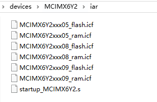

在iar文件夹下startup_MCIMX6Y2.s文件，主要用于配置存储器分配和提供芯片启动时运行的代码指令，其他几个.icf文件根据芯片型号以及芯片所接的存储器类型选择，
“MCIMX6Y2xxxxx”指定芯片型号，_ram适配nandFlash和eMMC，本教程配套开发板应当选择这种.icf文件。_flash适配norFlash。.icf是程序的分散加载文件，使用到时再详细介绍。

MCIMX6Y2\drivers目录
''''''''''''''''''''''''''''''''''''''''''''''''''''''''''''''''''''''''''''''''''''''''''

drivers目录是固件库的主体，有时我们把这些文件称为外设驱动库，具体如下所示。

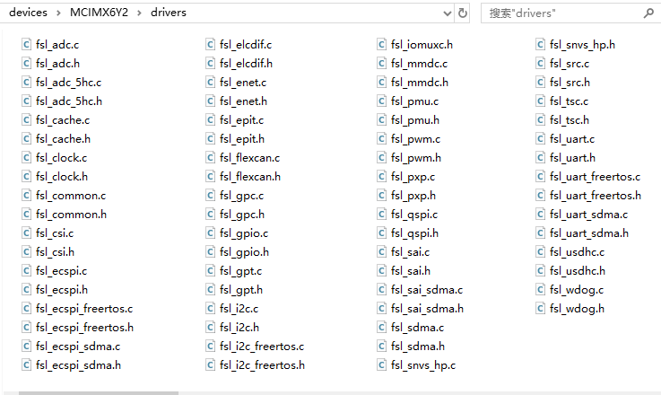

-  这些文件都使用fsl_xxx.c/h的命名格式，其中xxx是对应的片上
   外设名字，如ADC、GPIO、UART、I2C等外设，大部分外设包含一个C源文件和头文件。

-  当使用到某个外设时，我们会把此处对应的外设驱动源文
   件添加到工程中，加入编译，对于没有源文件的IOMUXC外设，则直接使用“#include”包含其头文件fsl_iomuxc.h。

-  特别地，其中的fsl_common.c和fsl_common.h中的common不是i.MX6芯片
   的某个外设名字，它表示绝大多数工程都会需要这些“共同”的内容，所以一般工程都
   会添加这个fsl_common.c文件，并且可以通过fsl_common.h文件包含前面介绍的fsl_device_regi
   sters.h头文件，达到最终包含具有大量寄存器定义的MCIMX6Y2.h核心头文件的目的。

MCIMX6Y2\utilities目录
''''''''''''''''''''''''''''''''''''''''''''''''''''''''''''

utilities是实用工具集的意思，此目录下包含了开发常用的一些调试工具，如串口输出、运行日志，通常我们都会把这些文件加到工程以方便开发。

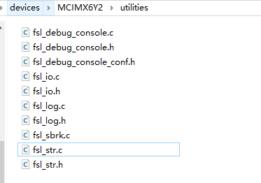

docs：部分说明文档
^^^^^^^^^^^^^^^^^^^^^^^^^^^^^^^^^^^^^^^^^^^^

回到SDK的根目录，打开它的docs文件夹，可见到文件夹中包含如下图中的内容。

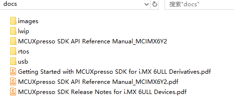

这目录下主要
是《Getting Started with MCUXpresso SDK for i.MX 6ULL Derivatives》文件
比较有用，它介绍了使用官方评估板时的基础使用步骤。文件夹 lwip、rtos、usb、分别保存对应的说明文档。文件夹MCUXpresso SDK API
Reference Manual_MCIMX6Y2保存有.html格式的SDK API接口函数说明文档。

middleware：中间件
^^^^^^^^^^^^^^^^^^^^^^^^^^^^^^^^^^^^^^^^^^^^^^^^^^^^^^^^^^^^^^^^^^^^^^

SDK中的middleware文件夹主要包含一些中间层软件，即这些软件常为应用层提供一些协议、架构上的支撑，它的主要部分又与芯片底层的硬件外设驱动(前面drivers目录中的文件)联系不甚紧密，是不同芯片之间通用的一些构件，具体见下图。

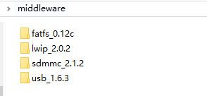

各个文件中间件的简要说明如下：

-  fatfs：这是一个嵌入式常用的文件系统，有了文件系统后能更好地管理存储器以及使用通用的文件形式来访问存储器。

-  lwip：这是嵌入式常用网络TCP/IP协议栈，使用协议栈可以方便地接入网络。

-  sdmmc：它是遵照SDIO协议编写的集成识别、读写SD存储卡功能的驱动。

-  usb：包含了遵照USB协议编写的基本驱动，在它之上可方便地编写USB应用程序。

rtos：实时操作系统
^^^^^^^^^^^^^^^^^^^^^^^^^^^^^^^^^^^^^^^^^^^^^^^^^^^^^^^^^^^^^^^^^^

SDK目录下的rtos文件夹包含了FreeRTOS实时操作系统的源代码，位于“boards\evkmcimx6ull\rtos_examples”目录的FreeRTOS例程会使用到这里的源码，我们只需要知道源码再这里就可以了。见下图。

CORTEX：Cortex相关头文件
^^^^^^^^^^^^^^^^^^^^^^^^^^^^^^^^^^^^^^^^^^^^^^^^^^^^^^^^^^^^^^^^^^^^^^^^^^^^^^^^^^^^^^^^^^

SDK目录下的CORTEXA文件夹包含了cortexa核适配iar、gcc的头文件，见下图。我们暂时不需要研究它们的作用。

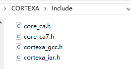

tools：开发工具
^^^^^^^^^^^^^^^^^^^^^^^^^^^^^^^^^^^^^^^^^^^^^^^^^^

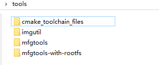

各个文件中间件的简要说明如下：

-  cmake_toolchain_files：提供cmake工具，用于生成arm gcc编译器需要的makefilew文件。

-  imgutil：提供图片压缩工具。

-  mfgtools与mfgtools-with-rootfs：提供MFG批量下载工具，

mcimx6_DEBUG：调试工具
^^^^^^^^^^^^^^^^^^^^^^^^^^^^^^^^^^^^^^^^^^^^^^^^^^^^^^^^^^^^^^^^^^^^^^^^^^^^^^^^^^^^^

调试工具我们用不到，不必关心。

其它
^^

在SDK的根目录下还包含了几个.xml、.txt、.htm以及.bat文件，具
体见图 45‑21。.xml和txt文件它们主要是包含SDK第三方构件的一些版
权、出处说明以及EVK-MCIMX6UL生成的一些说明信息，keilkill.bat批处
理文件用于清理编译程序生成的中间文件。

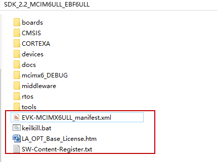

.. |sdk007| image:: media/sdk007.png
   :width: 3.14544in
   :height: 1.70812in

