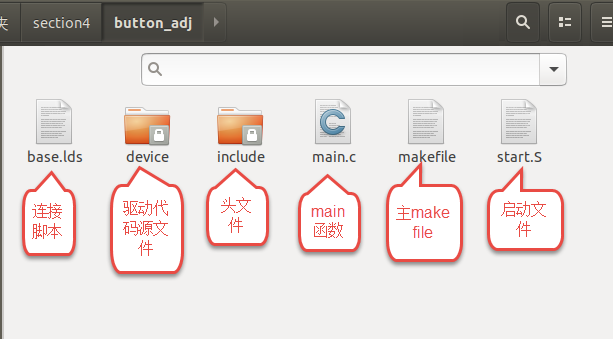

.. vim: syntax=rst

整理工程文件
===========================

为降低难度，在之前章节我们把程序所有内容放在一个文件夹下。
这样做存在两个主要问题，第一，代码存放混乱不易阅读。第二，程序可移植性差。

本章将对代码进行简单的整理，让程序存放更有条理。

本章主要内容：

-  创建文件夹分类存储代码
-  修改makefile

分类存储代码
~~~~~~~~~~~~~~~~~~~~~~~~~~~

**本章的示例代码目录为：base_code/bare_metal/button_adj**、

本章程序基于按键检测程序*base_code/bare_metal/button*。修改后的程序结构如下图所示。

结合上图说明如下：

-  base.lds，将button.lds更改为base.lds。连接脚本与具体的外设无关，并且后面的程序我们几乎不会去修改链接脚本，这里把它修改为base.lds，你也可以根据自己喜好命令，只要和makefile中一致即可。
-  device文件夹，保存外设驱动的源文件（.c文件）。
-  include文件夹，保存程序中使用的头文件。
-  makefile，主makefile 。在主makefile中会调用“device”文件夹下的子makefile.

修改makefile
~~~~~~~~~~~~~~~~~~~~~~~~~~~
修改makefile主要包括两部分，
第一部分，在“device”文件夹下添加并编写子makefile，
第二部分，修改主makefile。

编写子makefile
>>>>>>>>>>>>>>>>>>>>>>>>>>>

子makefile用于将“device”文件夹下的驱动源文件编译为一个“.o”文件，完整内容如下所示。

.. code-block:: Makefile
  :caption: device文件夹下的子makefile
  :linenos:  

  all : button.o  led.o （1）
    arm-none-eabi-ld -r $^  -o device.o

  %.o : %.c
    arm-none-eabi-gcc ${CFLAGS} -c $^

  %.o : %.S
    arm-none-eabi-gcc ${CFLAGS} -c $^

  .PHONY: clean
  clean:
    -rm -f *.o *.bak  

  #定义变量,用于保存编译选项和头文件保存路径
  header_file := -fno-builtin -I$(shell pwd)/include
  export header_file

结合代码，各部分简单说明如下：

- 第1-2行： 链接生成最终目标“device.o”。如果程序中新增了某个外设驱动程序，只需要将对应的“.o”文件填入“依赖”处即可。
- 第4-5行： 编译“device”文件夹下的所有“.c”文件并生成对应的“.o”文件。
- 第7-8行： 编译“device”文件夹下的所有“.S”文件并生成对应的“.o”文件。
- 第15-16行： 它是定义在主makefile中的变量，用“export”声明后可以在其他makefile中调用。

修改主makefile
>>>>>>>>>>>>>>>>>>>>>>>>>>>

主makefile的改动主要有亮点，第一，在编译命令中指明头文件位置，第二，使用命令调用子makefile，生成依赖文件。完整的代码如下所示。

.. code-block:: Makefile
  :caption: 主makefile文件
  :linenos:  

  #定义变量，用于保存编译选项和头文件保存路径
  header_file := -fno-builtin -I$(shell pwd)/include
  export header_file

  all : start.o main.o device/device.o 
    arm-none-eabi-ld -Tbase.lds $^ -o base.elf 
    arm-none-eabi-objcopy -O binary -S -g base.elf base.bin

  %.o : %.S
    arm-none-eabi-gcc -g -c $^ 
  %.o : %.c
    arm-none-eabi-gcc $( header_file) -c $^   

  #调用其他文件的makefile
  device/device.o :
    make -C device all

  #定义清理伪目标
  .PHONY: clean
  clean:
    make -C device clean
    -rm -f *.o *.elf *.bin  

结合代码，各部分简单说明如下：

- 第2-3行： 定义变量 “CFLAGS”。在makefile中“变量”更像C原因中的宏定义。“-fno-builtin”是一个编译选项，用于解决库函数与自己编写函数同名问题。“-I$(shell pwd)/include”用于指定头文件路径。
- 第5-7行： makefile最终目标，与原文件相比，这里只是修改了文件的名字。
- 第9-12行： 定义生成“.o”文件的相关内容
- 第15-16行： 定义生成“device/device.o”的命令，“device.o”文件由子makefile生成，所以这里只需要调用子makefile即可。
- 第19-22行： 定义清理伪目标。在清理命令中不但要清理主makefile所在文件夹的内容还要调用子makefile的清理命令以清理子makefile所在文件夹的内容。

编译和烧录
~~~~~~~~~~~~~~~~~~~~~~~~~~~
在base_code/bare_metal/button_adj/目录下执行make，当前目录生成base.bin。
可参考 *第八章节GPIO输入—按键查询检测* ，重新烧录base.bin，且两者效果相同。