.. vim: syntax=rst

UART—串口通讯
------------------------------------------------------

本章参考资料：《IMX6ULRM》（参考手册）。

学习本章时，配
合《IMX6ULRM》Chapter 53 Universal Asynchronous Receiver/Transmitter (UART)一
起阅读，效果会更佳，特别是涉及到寄存器说明的部分。

特别说明，本书内容是以i.MX 6U系列控制器资源讲解。

配套源码以及下载工具:
-  路径：~/embed_linux_tutorial/base_code/bare_metal/uart

串口通讯协议简介
~~~~~~~~~~~~~~~~~~~~~~~~~~~~~~~~~~~~~~~~~~~~~~~~~~~~~~~~

串口通讯(Serial Communication)是一种设备间非常常
用的串行通讯方式，因为它简单便捷，大部分电子设备都支持该
通讯方式，电子工程师在调试设备时也经常使用该通讯方式输出调试信息。

在计算机科学里，大部分复杂的问题都可以通过分层来简化。如芯片被分为内核层和片上外设；官方SDK库则是在寄存器与用户代码之间的软件层。对于通讯协议，我们也以分层的方式来理解，最基本的是把它分为物理层和协议层。物理层规定通讯系统中具有机械、电子功能部分的特性，确保原始数据在物理媒体的传输。协议层主要规定
通讯逻辑，统一收发双方的数据打包、解包标准。简单来说物理层规定我们用嘴巴还是用肢体来交流，协议层则规定我们用中文还是英文来交流。

下面我们分别对串口通讯协议的物理层及协议层进行讲解。

物理层
^^^

串口通讯的物理层有很多标准及变种，我们主要讲解RS-232标准 ，RS-232标准主要规定了信号的用途、通讯接口以及信号的电平标准。

使用RS-232标准的串口设备间常见的通讯结构如下图所示。

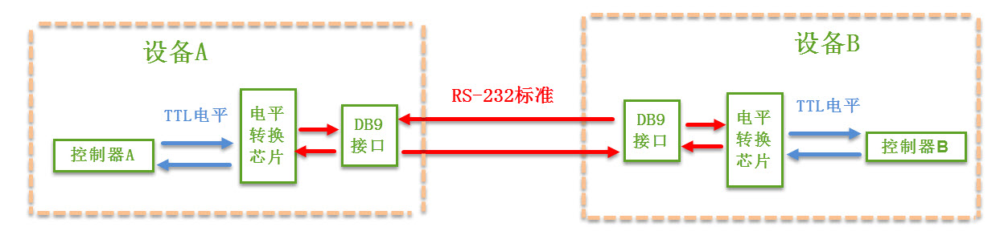

在上面的通讯方式中，两个通讯设备的“DB9接口”之间通过串口信号线建立起连接，串口信号线中使用“RS-232标准”传输数据信号。由于RS-232电平标准的信号不能直接被控制器直接识别，所以这些信号会经过一个“电平转换芯片”转换成控制器能识别的“TTL校准”的电平信号，才能实现通讯。

电平标准
''''''''''''''''''''''''''''

根据通讯使用的电平标准不同，串口通讯可分为TTL标准及RS-232标准，如下表所示。

表 TTL电平标准与RS232电平标准

======== ================
通讯标准 电平标准(发送端)
======== ================
5V TTL   逻辑1：2.4V-5V
         逻辑0：0~0.5V
RS-232   逻辑1：-15V~-3V
         逻辑0：+3V~+15V
======== ================

我们知道常见的电子电路中常使用TTL的电平标准，理想状态下，使用5V表示二进制逻辑1，使用0V表示逻辑0；而为了增加串口通讯的远距离传输及抗干扰能力，它使用-15V表示逻辑1，+15V表示逻辑0。使用RS232与TTL电平校准表示同一个信号时的对比如下图所示。

.. image:: media/uart003.jpg
   :align: center
   :alt: 未找到图片

因为控制器一般使用TTL电平标准，所以常常会使用MA3232芯片对TTL及RS-232电平的信号进行互相转换。

RS-232信号线
''''''''''''''''''''''''''''''''''''''''''''''''''''''

在最初的应用中，RS-232串口标准常用于计算机、路由
与调制调解器(MODEN，俗称“猫”)之间的通讯 ，在这种通讯系统中，设备被
分为数据终端设备DTE(计算机、路由)和数据通讯设备DCE(调制调解器)。我们以这
种通讯模型讲解它们的信号线连接方式及各个信号线的作用。

在旧式的台式计算机中一般会有RS-232标准的COM口(也称DB9接口)，如下图所示。

.. image:: media/uart004.jpg
   :align: center
   :alt: 未找到图片

其中接线口以针式引出信号线的称为公头，以孔式引出信号线的称为母头。在计算机中一般引出公头接口，而在调制调解器设备中引出的一般为母头，使用上图中的串口线即可把它与计算机连接起来。通讯时，串口线中传输的信号就是使用前面讲解的RS-232标准调制的。

在这种应用场合下，DB9接口中的公头及母头的各个引脚的标准信号线接如下图所示。

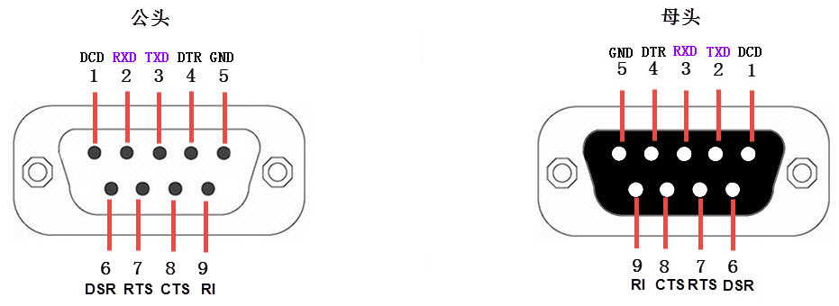

表  DB9信号线说明(公头，为方便理解，可把DTE理解为计算机，DCE理解为调制调解器)

==== =================== ==== ======== ======================================================================================================================
序号 名称                符号 数据方向 说明
==== =================== ==== ======== ======================================================================================================================
1    载波检测            DCD  DTEDCE   Data Carrier Detect，数据载波检测，用于DTE告知对方，本机是否收到对方的载波信号
2    接收数据            RXD  DTEDCE   Receive Data，数据接收信号，即输入 。
3    发送数据            TXD  DTEDCE   Transmit Data，数据发送信号，即输出。两个设备之间的TXD与RXD应交叉相连
4    数据终端 (DTE) 就绪 DTR  DTEDCE   Data Terminal Ready，数据终端就绪，用于DTE向对方告知本机是否已准备好
5    信号地              GND  -        地线，两个通讯设备之间的地电位可能不一样，这会影响收发双方的电平信号，所以两个串口设备之间必须要使用地线连接，即共地。
6    数据设备(DCE)就绪   DSR  DTEDCE   Data Set Ready，数据发送就绪，用于DCE告知对方本机是否处于待命状态
7    请求发送            RTS  DTEDCE   Request To Send，请求发送， DTE 请求 DCE 本设备向DCE端发送数据
8    允许发送            CTS  DTEDCE   Clear To Send，允许发送，DCE回应对方的RTS发送请求，告知对方是否可以发送数据
9    响铃指示            RI   DTEDCE   Ring Indicator，响铃指示，表示DCE端与线路已接通
==== =================== ==== ======== ======================================================================================================================

上表中的是计算机端的DB9公头标准接法，由于两个通讯设备之间的收发信号(RXD与TXD)应交叉相连，所以调制调解器端的DB9母头的收发信号接法一般与公头的相反，两个设备之间连接时，只要使用“直通型”的串口线连接起来即可，见下图。

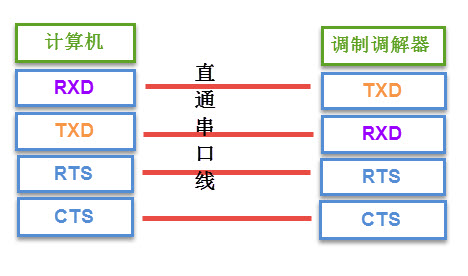

串口线中的RTS、CTS、DSR、DTR及DCD信号，使用逻辑 1表示
信号有效，逻辑0表示信号无效。例如，当计算机端控制DTR信号线表示
为逻辑1时，它是为了告知远端的调制调解器，本机已准备好接收数据，0则表示还没准备就绪。

在目前的其它工业控制使用的串口通讯中，一般只使用RXD、TXD以及GND三条信号线，直接传输数据信号。而RTS、CTS、DSR、DTR及DCD信号都被裁剪掉了，如果您在前面被这些信号弄得晕头转向，那就直接忽略它们吧。

协议层
^^^^^^^^^^^^^

串口通讯的数据包由发送设备通过自身的TXD接口传输到接收设备的RXD接口。在串口通讯的协议层中，规定了数据包的内容，它由启始位、主体数据、校验位以及停止位组成，通讯双方的数据包格式要约定一致才能正常收发数据，其组成如下图所示。

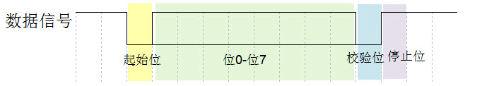

波特率
'''

本章中主要讲解的是串口异步通讯，异步通讯中由于没有时钟信号(如前面讲解的DB9接口中是没有时钟信号的)，所以两个通讯设备之间需要约定好波特率，即每个码元的长度，以便对信号进行解码，上图中用虚线分开的每一格就是代表一个码元。常见的波特率为4800、9600、115200等。

通讯的起始和停止信号
''''''''''''''''''''''''''''''''''''''''''''''''''

串口通讯的一个数据包从起始信号开始，直到停止信号结束。数据包的起始信号由一个逻辑0的数据位表示，而数据包的停止信号可由0.5、1、1.5或2个逻辑1的数据位表示，只要双方约定一致即可。

有效数据
''''''''''''''''''''''''''''''''''''

在数据包的起始位之后紧接着的就是要传输的主体数据内容，也称为有效数据，有效数据的长度常被约定为5、6、7或8位长。

数据校验
''''''''''''''''''''''''''''''''''''

在有效数据之后，有一个可选的数据校验位。由于数据通信相对更容易受到外部干扰导致传输数据出现偏差，可以在传输过程加上校验位来解决这个问题。校验方法有奇校验(odd)、偶校验(even)、0校验(space)、1校验(mark)以及无校验(noparity)，它们介绍如下：

-  奇校验要求有效数据和校验位中“1”的个数为奇数，比如一个8位长的
   有效数据为：01101001，此时总共有4个“1”，为达到奇校验效果，校
   验位为“1”，最后传输的数据将是8位的有效数据加上1位的校验位总共9位。

-  偶校验与奇校验要求刚好相反，要求帧数据和校验位中“1”的个数为偶数，比如数据帧：11001010，此时数据帧“1”的个数为4个，所以偶校验位为“0”。

-  0校验是不管有效数据中的内容是什么，校验位总为“0”，1校验是校验位总为“1”。

-  在无校验的情况下，数据包中不包含校验位。

i.MX 6U的UART简介
~~~~~~~~~~~~~~~~~~~~~~~~~~~~~~~~~~~~~~~~~~~~~~~~~~~~~~~~

i.MX 6U芯片具有多达8个UART外设用于串口通讯，UART是在USART基础上裁
剪掉了同步通信功能，只支持异步通信。简单区分同步和异步就是看
通信时需不需要对外提供时钟输出，我们平时用的串口通信基本都是UART。

UART满足外部设备对工业标准NRZ异步串行数据格式的要求，并且使
用了小数波特率发生器，可以提供多种波特率，使得它的应
用更加广泛。UART支持异步单向通信和半双工单线通信；还支持局域
互连网络LIN、智能卡(SmartCard)协议与lrDA(红外线数据协会) SIR ENDEC规范。

i.MX 6U的UART 主要特性如下。

-  兼容高速TIA/EIA-232-F，最高5.0 Mbit/s

-  兼容IrDA 串行低速红外接口，最高115.2 Kbit/s

-  支持9位或多点（Multidrop mode）模式(RS-485)(自动从地址检测)

-  支持7位或8位RS-232格式或9位的RS-485格式

-  支持1或2位停止位。

-  可编程奇校验或偶校验。

-  支持硬件流控（CTS/RTS）

-  RTS支持边缘中断检测。

-  自动波特率检测（最高为115.2kbit/s）

-  rx_data输入和tx_data输出可分别在rs-232/rs-485模式下进行交换（软件可交换TX、RX引脚）。

-  两个DMA请求（TxFIFODMA请求和RxFIFODMA请求）。

-  支持软件复位 (Srst_B)

-  两个独立的32输入FIFO，用于发送和接收。

UART功能框图
~~~~~~~~~~~~~~~~~~~~~~~~~~~~~~~~~~~~~~~~~~~~~~~~

i.MX 6U的UART功能框图包含了UART最核心内容，掌握了功能框图，对UART就有一个整体的把握，在编程时就思路就非常清晰，如下图所示。

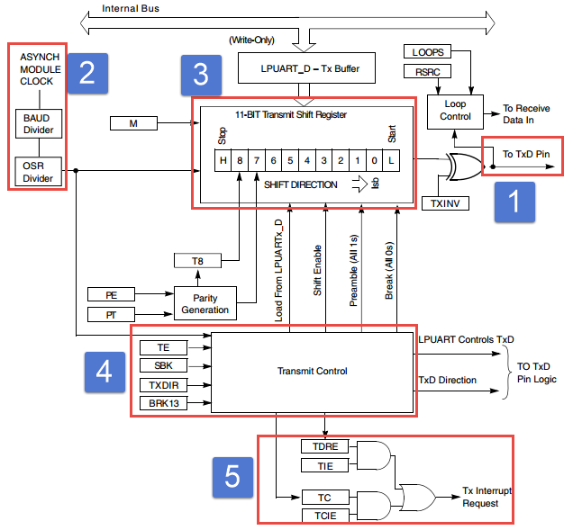

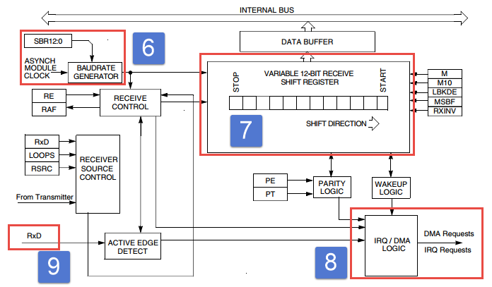

①，通信引脚
''''''''''''''''''''''''''''''''''''''''''''''''''''''

UART模块通过RxD与TxD与外界通信，如果使用硬件流控还会用
到CTS和RTS，以UART1为例，可用的外部输出引脚如表格  所示，其他UART对应的外部
引脚请参考《IMX6ULRM》（参考手册）External Signals and Pin Multiplexing章节。

表  UART1引脚

============= =============
LPUART1_TX    GPIO1_IO02
============= =============
\             UART1_TX_DATA
LPUART1_RX    GPIO1_IO03
\             UART1_RX_DATA
LPUART1_CTS_B GPIO1_IO06
\             UART1_CTS_B
LPUART1_RTS_B GPIO1_IO07
\             UART1_RTS_B
============= =============

相比STM32, i.MX 6U的串口增加了引脚交换功能。通过配置UFCR[DCEDTE]寄存器可以交换TX、RX引脚以及CTS、RTS引脚，如下图所示。

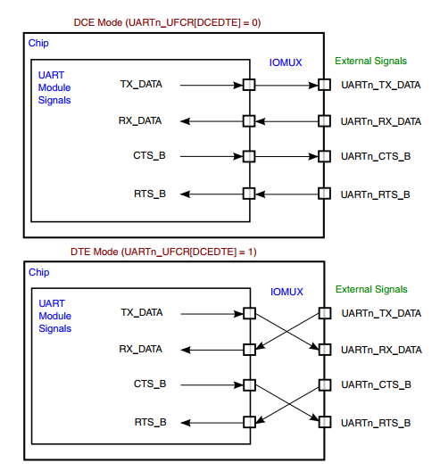

②串口时钟与波特率
'''''''''''''''''''''''''''''''''''''''''''''''''''''''''''''''

如标号②处所示，串口模块共有两个时钟输入Peripheral Clock和Model Clock 。这两个时钟介绍如下：

Peripheral Clock直译为外部时钟，这个时钟主要用于读、写接收和
发送的数据，例如读接收FIFO、写发送FIFO。这个时钟与波特率
设置无关，如果没有特殊需求我们将这个时钟保持默认即可，在初始
代码中并没有特意设置这个时钟。

Mode clock直译为模块时钟，它既可用于接收、发送数据也用
于设置波特率，这个时钟决定了串口最高支持的波特率。下面重点
讲解Mode clock时钟设置以及波特率的设置。

   Mode clock时钟产生过程在55.4 设置系统时钟实验有
   过介绍，这里再次简单说明。Mode clock时钟来自根时钟UART_CLK_ROOT，根时钟的设
   置要参考时钟树（CCM章节有过详细介绍），从时钟树中截取UART_CLK_ROOT部分，如下图所示。

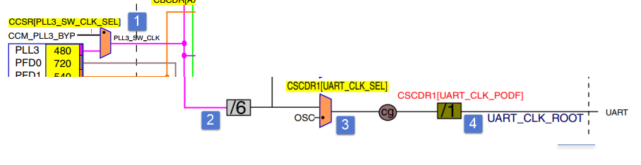

   在程序中，480MHz的PLL3时钟经过图 56‑10中标号①②③④之后变为UART_CLK_ROOT时钟，在55.4 设置系统时钟实验我们将UART_CLK_ROOT设置为40MHz。这里将以Mode clock = UART_CLK_ROOT = 40MHz为例讲解波特率设置方法。

UART的发送器和接收器使用相同的波特率。计算公式如下：

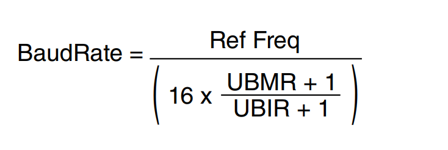

公式说明如下：

-  BaudRate，要设置的波特率。

-  Ref Freq，参考时钟，这个时钟是Mode clock经过RFDIV寄存器分频后得到的频率。

-  UBMR，UBMR寄存器值。

-  UBIR，UBIR 寄存器值。

设置波特率需要设置三个寄存器，分别为RFDIV时钟分频寄存器、UBMR、UBIR。我们假设目标波特率为115200，介绍如下：

(1) 设置时钟分频寄存器RFDIV，得到参考时钟Ref Freq。

Ref Freq时钟应该被设置为多少，没有一个准确的
数字，本章配套程序遵守以下几条，第一 ，Ref Freq时钟要大于
波特率的16倍（依据是module_clock必须大于等于16倍波特率（参考《IMX6ULRM》（参考手册）53.4.2.1 Clock
requirements，而module_clock经过Clock Gating & Divider之后
变为ref_clk，从功能框图看ref_clk最终作为uart模块参考时钟）。第
二，UBMR和UBIR的值必须小于 0xFFFF。

注：本人在官方手册中并没有找到Ref Freq必须大于等于16倍波特率的说明，本教程将Ref Freq时钟大于16倍波特率，并且UBMR大于UBIR。

module_clock时钟经过UARTx_UFCR[RFDIV]寄存器分频后得到Ref Freq时钟，如下图所示。

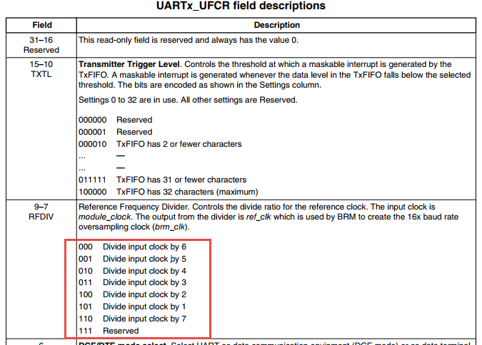

在程序中Mode clock被设置为40MHz而波特率只有115200，所以这里将
分频值设置为最大值7，即UARTx_UFCR[RFDIV] = 110B。得到参
考时钟Ref Freq = 40 / 7 = 5.71MHz。

(2) 计算UBMR和UBIR的值。我们已知波特率 115200，参考
时钟Ref Freq = 5.71MHz，可以计算得
到（UBMR+1）/ (UBIR+1) 约为 3.10。我们设置（UBIR+1） = 10，（UBMR+1） = 31 。

③和⑦接收、发送FIFO
''''''''''''''''''''''''''''''''''''''''''''''''''''''''''''

Tx Block与Rx Block 包括三部分，控
制单元Control 、电源管理单元 Power Saving以
及TxFIFO (和RxFIFO)。其中控制单元可以认为控制整个串
口的工作，我们编写软件不必过多关心，重点介绍TxFIFO和RxFIFO

TxFIFO与RxFIFO大小均为32字节，以发送为例，数据通过UTXD寄存器自动写入TxFIFO,如果TxFIFO没有满，则可以不断将数据写入UTXD寄存器。UTS[4]寄存器是TxFIFO满的标志位。如果关闭了发送，仍然可以向TxFIFO写入数据，但这样做将会产生传输错误信息。当TxFIFO中的
数据发送完成后将会自动设置发送缓冲区空中断标志位，向TxFIFO写入数据将自动清除发送缓冲区空标志位。

④DMA和中断请求
''''''''''''''''''''''''''''''''''''''''''''''''''''''

每个串口有两个DMA请求，txfifo dma请求和rxfifo dma请求，有多
个中断请求。我们这里只介绍几个常用的中断，完整内容请
参考《IMX6ULRM》（参考手册）53.4.1 Interrupts and DMA Requests。

表  常用中断举例

================== ================== ================
中断事件           使能位             标志位
================== ================== ================
空闲中断           UARTx_UCR1[TRDYEN] UARTx_USR2[TXFE]
接收溢出中断       UARTx_UCR4[OREN]   UARTx_USR2[ORE]
接收缓冲区非空中断 UARTx_UCR4[DREN]   UARTx_USR2[RDR]
================== ================== ================

⑤外围总线
'''''''''''''''''''''''''''''''''''

我们程序中对UART相关寄存器的读、写都是通过外围总线实现的。我们程序中几乎不会修改这部分内容。

UART1收发实验
~~~~~~~~~~~~~~~~~~~~~~~~~~~~~~~~~~~~~~~~~~~~~~~~~~~~~~~~~~~~~~~

UART只需两根信号线即可完成双向通信，对硬件要求低，使得很多模块都预留UART接口来实现与其他模块或者控制器进行数据传输，比如GSM模块，WIFI模块、蓝牙模块等等。在硬件设计时，注意还需要一根"共地线"。

我们经常使用UART来实现控制器与电脑之间的数据传输。这使得我们调试程序非常方便，比如我们可以把一些变量的值、函数的返回值、寄存器标志位等等通过UART发送到串口调试助手，这样我们可以非常清楚程序的运行状态，当我们正式发布程序时再把这些调试信息去除即可。

硬件设计
^^^^^^^^^^^^^^^^^^^^^^^^^^^^^^^^^^^^

为利用UART实现开发板与电脑通信，需要用到一个USB转UART的IC，我们选择CH340G芯片来实现这个功能，CH340G是一个USB总线的转接芯片，实现USB转UART、USB转IrDA红外或者USB转打印机接口，我们使用其USB转UART功能。具体电路设计如下图所示。

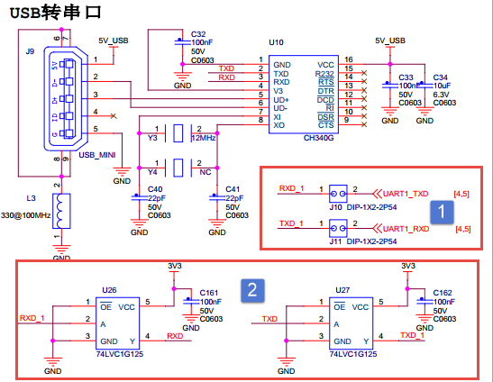

为了提高系统更加稳定和安全，还增加了隔离保护电路，上图标号②所示。隔离保护电路有74LVC1G125逻辑芯片实现，74LVC1G125的真值表与逻辑图如下图所示。

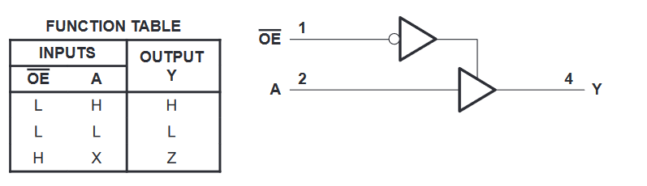

结合上图不难看出，A端输入电平与Y端输出相同。串口Tx和Rx信号经过74LVC1G125芯片之后输出到CH340G芯片并由CH340G进行转换最终输出到外部电路。

软件设计
^^^^^^^^^^^^^^^^^^^^^^^^^^^^^^^^^^^^^^^^^^^^^^^^^^^^

本章配套程序由时钟章节的程序修改得到，主要增加了uart相关代码。这里只讲解核心的部分代码，有些变量的设置，头文件的包含等并没有涉及到，完整的代码请参考本章配套的工程。

添加源文件并修改makefile
''''''''''''''''''''''''''''''''''''''''''''''''''''''''''''''''''''''''''''''''''''''''''''''''''''''''''''''''

首先复制"~\section5\clock_init"代码并更名为"~\section5\uart"。在"~\section5\uart\device"文件夹下添加uart.c文件，在"~\section5\uart\include"文件夹下添加uart.h文件。串口相关代码将会放到uart.c和u
art.h文件内。

添加了源文件，所以要修改makefile ，将源文件编译
进程序。打开"~\section5\uart\device"目录
下的makefile文件，在最终目标依赖项中添加"uart.o"如下所示。

.. code-block:: c
   :caption: devide目录下的makefile
   :linenos:  

   all : button.o  led.o system_MCIMX6Y2.o clock.o uart.o
     arm-none-eabi-ld -r $^  -o device.o
   
   %.o : %.c
     arm-none-eabi-gcc ${header_file} -c $^
   
   %.o : %.S
     arm-none-eabi-gcc ${header_file} -c $^

   clean:
     -rm -f *.o *.bak

在后面的程序中如果使用官方设置波特率函数或者如果用到了除法、取余等算数运算就需要在链接时指定链接库。打开"~\section5\uart"目录下的makefile，在链接指令中指定链接库，如下所示。

.. code-block:: c
   :caption: uart目录下的makefile添加链接库
   :linenos:  

   #定义变量，用于保存编译选项和头文件保存路径
   header_file := -fno-builtin -I$(shell pwd)/include

   /*arm-none-eabi 安装位置*/
   libgcc_address := /usr/lib/gcc/arm-none-eabi/6.3.1

   export header_file

   all : start.o main.o device/device.o 
     arm-none-eabi-ld -Tbase.lds $^ -o base.elf -static -L $(libgcc_address) -lgcc
     arm-none-eabi-objcopy -O binary -S -g base.elf base.bin
   /*****************以下代码省略******************/

在makefile中增加了两部分内容。第一部分，代码第5行定义"libgcc_address"变量用于保存"arm-none-eabi"编译工具的安装位置，我们需要的libgcc.a位于该目录下。如果使用教程中介绍的"sudo apt-get install gcc-arm-none-
eabi"安装则默认位于程序中所指目录，如果使用其他方式安装，找到对应的路径填入该变量即可。第二部分，代码第11行，在链接指令中静态链接libgcc.a库文件。

定义串口引脚以及引脚PAD属性
'''''''''''''''''''''''''''''''''''''''''''''''''''''''''''''''''''''''''''

串口引脚依然按照RGB灯引脚定义方式，如下所示。

.. code-block:: c
   :caption: 串口引脚设置
   :linenos:  

   /**********************第一部分， 定义串口使用的引脚*******************/
    /*定义 UART1 RX 引脚*/
    #define UART1_RX_GPIO        GPIO1
    #define UART1_RX_GPIO_PIN    (17U)
    #define UART1_RX_IOMUXC      IOMUXC_UART1_RX_DATA_UART1_RX
   
    /*定义 UART1 TX 引脚*/
    #define UART1_TX_GPIO      GPIO1
    #define UART1_TX_GPIO_PIN   (16U)
    #define UART1_TX_IOMUXC    IOMUXC_UART1_TX_DATA_UART1_TX
   
    /**********************第二部分， 定义串口使用的引脚*******************/
    /*******************************************************************************
     * uart引脚配置
     ******************************************************************************/
    #define UART_RX_PAD_CONFIG_DATA (SRE_0_SLOW_SLEW_RATE| \
                     DSE_6_R0_6| \
                     SPEED_1_MEDIUM_100MHz| \
                     ODE_0_OPEN_DRAIN_DISABLED| \
                     PKE_1_PULL_KEEPER_ENABLED| \
                     PUE_1_PULL_SELECTED| \
                     PUS_3_22K_OHM_PULL_UP| \
                     HYS_0_HYSTERESIS_DISABLED) 
        /* 配置说明 : */
        /* 转换速率: 转换速率慢
            驱动强度: R0/6 
            带宽配置 : medium(100MHz)
            开漏配置: 关闭 
            拉/保持器配置: 使能
            拉/保持器选择: 上下拉
            上拉/下拉选择: 22K欧姆上拉(选择了保持器此配置无效)
            滞回器配置: 禁止 */ 
   
    #define UART_TX_PAD_CONFIG_DATA  (SRE_0_SLOW_SLEW_RATE| \
                      DSE_6_R0_6| \
                     SPEED_1_MEDIUM_100MHz| \
                     ODE_0_OPEN_DRAIN_DISABLED| \
                     PKE_1_PULL_KEEPER_ENABLED| \
                     PUE_0_KEEPER_SELECTED| \
                     PUS_3_22K_OHM_PULL_UP| \
                     HYS_0_HYSTERESIS_DISABLED)
        /* 配置说明 : */
        /* 转换速率: 转换速率慢
            驱动强度: R0/6 
            带宽配置 : medium(100MHz)
            开漏配置: 关闭 
            拉/保持器配置: 使能
            拉/保持器选择: 保持器
            上拉/下拉选择: 22K欧姆上拉(选择了保持器此配置无效)
            滞回器配置: 禁止 */  

代码分为两部分，第一部分定义了引脚所在组、引脚编号、引脚的复用功能。第二部分定义了TX 和RX引脚的pad属性，其他串口也适用这些配置。

串口初始化函数
''''''''''''''''''''''''''''''''''''''''''''''''''''''''

串口初始化配置了多个寄存器，结合代码
和《IMX6ULRM》（参考手册）53.15 UART Memory Map/Register Definition章节可
以查看寄存器的详细介绍。读者也不必花太多时间在这些寄存器，在需要时能够找到即可。初始化函数如下所示。

.. code-block:: c
   :caption: 串口初始化函数
   :linenos:  

   void uart_init(void)
   {

       /**********************第一部分********************/
       /*时钟初始化，设置 UART 根时钟，并设置为40MHz*/
       CCM->CSCDR1 &= ~(0x01 << 6); //设置UART选择 PLL3 / 6 = 80MHz
       CCM->CSCDR1 &= ~(0x3F);      //清零
       //设置串口根时钟分频值为1，UART根时钟频率为：80M / (dev + 1) = 40MHz
       CCM->CSCDR1 |= (0x01 << 0);  

        /**********************第二部分********************/
       /*开启 UART1 的时钟*/
       CCM_CCGR5_CG12(0x3); //开启UART1的时钟

       UART1->UCR1 &= ~UART_UCR1_UARTEN_MASK; //禁用 UART1

       /*软件复位*/
       UART1->UCR2 &= ~UART_UCR2_SRST_MASK;
       while ((UART1->UCR2 & UART_UCR2_SRST_MASK) == 0)
       {
       }
        /**********************第三部分********************/
       UART1->UCR1 = 0x0;
       UART1->UCR2 = UART_UCR2_SRST_MASK;
       UART1->UCR3 = UART_UCR3_DSR_MASK | UART_UCR3_DCD_MASK | UART_UCR3_RI_MASK;
       UART1->UCR4 = UART_UCR4_CTSTL(32);
       UART1->UFCR = UART_UFCR_TXTL(2) | UART_UFCR_RXTL(1);
       UART1->UESC = UART_UESC_ESC_CHAR(0x2B);
       UART1->UTIM = 0x0;
       UART1->ONEMS = 0x0;
       UART1->UTS = UART_UTS_TXEMPTY_MASK | UART_UTS_RXEMPTY_MASK;
       UART1->UMCR = 0x0;

       /**********************第四部分********************/
       /*引脚初始化*/
       IOMUXC_SetPinMux(UART1_RX_IOMUXC, 0);
       IOMUXC_SetPinConfig(UART1_RX_IOMUXC, UART_RX_PAD_CONFIG_DATA);

       IOMUXC_SetPinMux(UART1_TX_IOMUXC, 0);
       IOMUXC_SetPinConfig(UART1_TX_IOMUXC, UART_TX_PAD_CONFIG_DATA);

        /**********************第五部分********************/
       /*******uart初始化******/
       /*设置控制寄存器到默认值*/
       UART1->UCR2 |= (1 << 5);  //8位数宽度
       UART1->UCR2 &= ~(1 << 6); //一位停止位
       UART1->UCR2 &= ~(1 << 8); //禁用奇偶校验位

       UART1->UCR2 |= (1 << 2);  //使能发送
       UART1->UCR2 |= (1 << 1);  //使能接收
       UART1->UCR2 |= (1 << 14); //忽略流控

       /**********************第六部分********************/
       /* For imx family device, UARTs are used in  mode, 
       so that this bit should always be set.*/
       UART1->UCR3 |= UART_UCR3_RXDMUXSEL_MASK;

       UART1->UFCR = \
       (UART1->UFCR & ~UART_UFCR_TXTL_MASK) | UART_UFCR_TXTL(1); //设置发送FIFO 阀值
       UART1->UFCR = \
       (UART1->UFCR & ~UART_UFCR_TXTL_MASK) | UART_UFCR_TXTL(1); //设置接收FIFO 阀值

       UART1->UCR1 &= ~UART_UCR1_ADBR_MASK; //禁用可变波特率
       // UART1->UCR1 |= UART_UCR1_ADBR_MASK;

        /**********************第七部分********************/
       /*波特率设置方式 1 。 使用官方SDK设置波特率函数*/
       // UART_SetBaudRate(UART1, 115200, 40000000);

       /*波特率设置方式 2 。 手动计算，填入寄存器*/
       /*设置串口波特率
       * Ref Freq时钟 40MHz
       * UFCR RFDIV   110  0x06 7分频    5.714MHz
       * BaudRate     115200bps
       * UBMR         31-1 = 0x09
       * UBIR         10-1 = 0x1E
       */
       UART1->UFCR &= ~(0x07 << 7); //清零分频值
       UART1->UFCR |= (0x06 << 7);  //设置分频值，40MHz /7 =  5.714MHz

       UART1->UBIR = 0x09;
       UART1->UBMR = 0x1E;

        /**********************第八部分********************/
       /*开启串口*/
       UART1->UCR1 |= UART_UCR1_UARTEN_MASK;
   }

初始代码较长，但是内容很容易理解，结合代码各部分讲解如下：

-  第一部分，设置UART根时钟。这部分内容在时钟初
   始化章节以及56.3 UART功能框图章节的56.3 2②串口时钟与波特率小节有过详细介绍，这里不再介绍。

-  第二部分，开启UART1的时钟并复位串口。"CCM_CCGR5_CG12"是一个帮
   助宏，设置CCM(时钟控制模块)的CCGR5寄存器的CG12位 ，开启UART1的时钟。这点与stm32很相似。

-  第三部分，将UART配置寄存器设置为默认值。这部分内容是参考官方SDK相关代码编写的，笔者认为这部分代码可有可无，暂时把它放在这里。

-  第四部分，初始化uart引脚，引脚初始化与其他外设（按键、RGB灯）的引脚初始化相同，这里不再赘述。

-  第五部分，配置uart 可stm32类似，将配置参数填入相应的配
   置寄存器即可。这里默认设置串口数据宽度为8，一位停止位，禁用奇偶校验，使能发送和接收并关闭硬件流控。

-  第六部分，这部分设置了三个寄存器，第56行，使能RXD复用输入功能，使用
   串口必须设置该位。第57到62行，设置接收FIFO和发FIFO阈值，只有FIFO的数据超过阈值才会产生相应的中断，本章配套例程没有使用中断，所以这里将阈值设置为1即可。第63行，禁用可变波特率。

-  第七部分，设置串口波特率，修改串口波特率需要同时设
   置三个寄存器，分别为UFCR、UBIR、UBMR。需要注意的是程序中要先修改UBIR寄存器，然后再
   修改UBMR，这是官方参考手册中规定的，照做即可。寄存器值的计算已经在时钟初始化章节以及56.3 UART功能框图章节的56.32②串口时钟与波
   特率小节有过详细介绍，这里不再介绍。另外官方SDK中也给出了设置波特率的函数，我们也可以直接使用如代码第68行所示。具体实现参考本章配套例程。

-  第八部分，设置UCR1寄存器，开启串口。

串口接收函数
''''''''''''''''''''''''''''''''''''''''''

串口接收函数仅实现简单的接收字符串功能，没有使用中断，具体代码如下所示。

.. code-block:: c
   :caption: 串口接收函数实现
   :linenos:  

   /********************第一部分***********************/
   static inline uint8_t UART_ReadByte(UART_Type *base)
   {
       return (uint8_t)((base->URXD & UART_URXD_RX_DATA_MASK)\
                                 >> UART_URXD_RX_DATA_SHIFT);
   }

   /********************第二部分***********************/
   /*函数功能：串口接收函数
    *参数： base,指定串口。data,保存接收到的数据。 length，要接收的数据长度
    *
   */
   void UART_ReadBlocking(UART_Type *base, uint8_t *data, uint8_t length)
   {
       while (length--)
       {
           /* 等待接收完成 */
           while (!(base->USR2 & UART_USR2_RDR_MASK))
           {
           }
           /*读取接收到的数据 */
           *(data++) = UART_ReadByte(base);
       }
   }

结合代码简单说明如下：

-  第一部分，定义接收字符函数，函数仅仅返回URXD寄存器的内容。

-  第二部分，定义接收字符串函数，参数"base"指定用于接收的串
   口，参数"data"指定用于保存数据的地址。参数"length"指定读取的字符串
   长度。函数实现也很简单，循环调用第一部分的"UART_ReadByte"函数，并在读取之前等待接收完成标志。

串口发送函数
''''''''''''''''''''''''''''''''''''''''''

与接收函数类似，这里仅实现基本的发送功能，发送函数可以自己实现也可以直接复制官方SDK里的发送函数具体代码如下所示。

.. code-block:: c
   :caption: 串口初始化函数
   :linenos:  

   /********************第一部分***********************/
   static inline void UART_WriteByte(UART_Type *base, uint8_t data)
   {
       base->UTXD = data & UART_UTXD_TX_DATA_MASK;
   }

   /********************第二部分***********************/
   /*
    *功能：官方SDK 串口字符串发送函数
    *参数说明：
   */
   void UART_WriteBlocking(UART_Type *base,const uint8_t *data, uint8_t length)
   {

       while (length--)
       {
           /* 判断发送 FIFO 是否可写入（是否已满）*/
           while (!(base->USR2 & UART_USR2_TXDC_MASK))
           {
           }
           UART_WriteByte(base, *(data++));
       }
   }

这两个函数是从官方SDK直接复制得到的，功能也很简单，结合代码各部分说明如下：

-  第一部分，定义字节发送函数。函数实现将字节数据写入到UTXD寄存器。

-  第二部分，定义字符串发送函数。函数有三个参数"base"指定用于发送的
   串口，参数"data"指定用于要发送数据的地址。参数"length"指定发送
   长度。在函数中循环调用第一部分的"UART_WriteByte"字节发送函数。第19行
   等待发送FIFO可写入，只要FIFO可写入（不关心FIFO中的数据是否发送完成）就立即执行"UART_WriteByte"字节发送函数，通过字节发送函数发送的数据实际是写入FIFO,FIFO中的数据会自动依次执行发送。

main函数中添加验证代码
'''''''''''''''''''''''''''''''''''''''''''''''''''''''''''''''''

main函数中实现"发送接收到的数据"功能，代码实现很简单如下所示。

.. code-block:: c
   :caption: main函数
   :linenos:  

   /****************第一部分*****************/
   /*提示字符串*/
   uint8_t txbuff[] = "Uart polling example\r\nBoard will send back received characters\r\n";
   int main()
   {
       uint8_t ch; //用于暂存串口收到的字符
   /****************第二部分*****************/
       system_clock_init();
       uart_init();
   /****************第三部分*****************/
       UART_WriteBlocking(UART1, txbuff, sizeof(txbuff) - 1);

   /****************第四部分*****************/
       while (1)
       {
           UART_ReadBlocking(UART1, &ch, 1);
           UART_WriteBlocking(UART1, &ch, 1);
       }
       return 0;
   }

测试代码分为四部分。第一部分，定义提示字符串，程序运行后将会通过串口输出该提示字符串。第二部分，初始化系统时钟和串口。第三部分，调用我们定义的UART_WriteBlocking函数发送提示字符串。第四部分，在while（1）中循环调用UART_ReadBlocking和UART_WriteBloc
king循环接收并立即发送接收到的数据。

下载验证
''''''''''''''''''''''''''''''''''''''''''''

程序编写完成后，在“uart” 文件夹下执行make命令，makefile工具
便会自动完成程序的编译、链接、格式转换等工作。正常情况下我们可以在当前目
录看到生成的一些中间文件以及我们期待的.bin文件。

在编译下载官方SDK程序到开发板章节我们详细讲解了如何将二进制文件烧写到SD卡（烧写工具自动实现为二进制文件添加头）。这里再次说明下载步骤。

-  将一张空SD卡（烧写一定会破坏SD卡中原有数据！！！烧写前请保存好SD卡中的数据），接入电
   脑后在虚拟机的右下角状态栏找到对应的SD卡。将其链接到    虚拟机。

-  进入烧写工具目录，执行"./mkimage.sh <烧写文件路径>"命令,例如
   要烧写的led.bin位于home目录下，则烧写命令为"./mkimage.sh /home/led.bin"。

-  执行上一步后会列出linux下可烧写的磁盘，选择你插入的SD卡即可。这一步非
   常危险！！！一定要确定选择的是你插入的SD卡！！，如果选错很可能破坏你电脑磁盘内容，造成数据损坏！！！。确定磁盘后SD卡以"sd"开头，选择"sd"后面的字符即可。例如要烧写的sd卡是"sdb"则输入"b"即可。

烧写完成，首先将开发板启动方式设置为SD卡启动，将SD卡插入开发板卡槽。使用USB数据线连接电脑和开发板的USB转串口接口，接通电源，打开串口调试助手，正常情况下可以串口调试助手可以收到来自开发板的提示信息，通过串口调试助手发送字符会立即收到发送的字符，串口调试助手的配置信息如下所示。

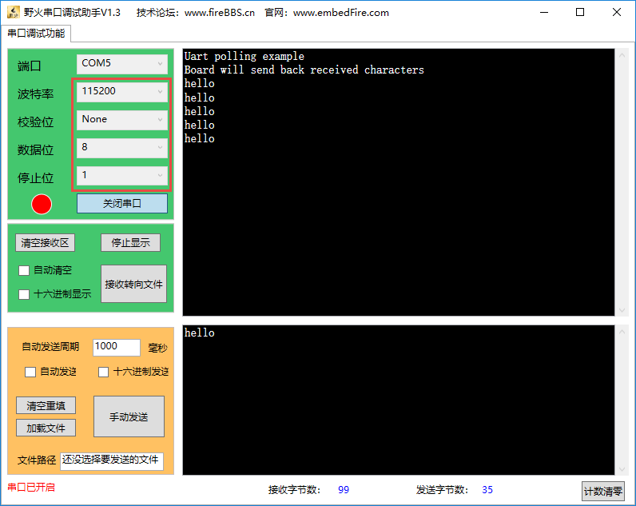

.. |uart003| image:: media/uart003.jpg
   :width: 3.58602in
   :height: 2.13365in
.. |uart004| image:: media/uart004.jpg
   :width: 4.07996in
   :height: 4.4288in

