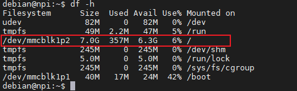
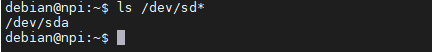
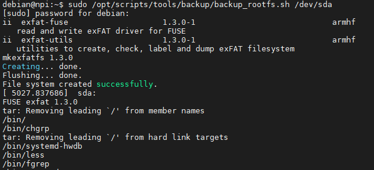
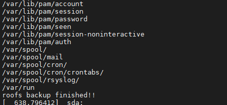

.. vim: syntax=rst

根文件系统备份与重新烧录
----------

本章主要介绍如何对根文件系统进行备份以及重新烧录。当用户在样机上完成了功能开发，一个迫切的需求就是对根文件系统进行备份。
该备份的文件系统将用于系统恢复与实际产品烧录等环节。为方便大家实际使用，野火提供u盘备份系统与sd卡备份系统两种方式，
用户可以根据自己的实际需求进行选择。

根文件系统备份
===============

1.首先用户需要准备一个u盘或者是sd卡，注意u盘/sd卡的容量一定要比当前系统占用的磁盘空间要大，否则备份过程将会失败。
用户可通过在控制塔终端输入以下命令，查看当前系统大小：

.. code:: bash

    df -h

如下图：表示当前系统占用357M硬盘空间，用户需要确保u盘容量大于357M

2.插入u盘，确保当前系统识别到相应设备文件，设备文件为:/dev/sdx(x为具体英文字母)，如果系统只有一个u盘设备，
那么该设备文件通常为:/dev/sda,用户可通过输入以下命令确认:

.. code:: bash

    ls /dev/sd*

如下图：表示u盘被设别为/dev/sda

建议大家在插入u盘前后，都输入该命令查看系统识别的存储设备，确保新增的设备文件为u盘设备。

注意：如果是使用sd卡备份，相应的设备文件则为:/dev/mmcblk0。

3.在当前系统中，执行野火提供的系统备份脚本，该备份脚本已经在野火最新发布的系统镜像中提供，
具体路径为:/opt/scripts/tools/backup/backup_rootfs.sh

用户执行该脚本时，需要输入u盘的设备文件作为参数，如以下命令所示:

.. code:: bash

   sudo /opt/scripts/tools/backup/backup_rootfs.sh /dev/sda

执行该文件后，系统将自动开始备份，如下图：

用户耐心等待备份过程结束即可，如下图：

4. 下面给用户讲解该备份脚本的根文件系统备份原理，该脚本的内容如下所示:

.. code:: bash

    1:      #!/bin/bash -e
    2:  
    3:      
    4:      _exit_trap() {
    5:          umount ${tmp_rootfs_dir}
    6:          rmdir ${tmp_rootfs_dir}
    7:      }
    8:  
    9:      _err_trap() {
    10:          umount ${tmp_rootfs_dir}
    11:          rmdir ${tmp_rootfs_dir}
    12:      }
    13:  
    14:      dpkg -l | grep exfat-fuse || deb_pkgs="${deb_pkgs}exfat-fuse "
    15:      dpkg -l | grep exfat-utils || deb_pkgs="${deb_pkgs}exfat-utils "
    16:  
    17:      if [ "${deb_pkgs}" ] ; then
    18:          echo "Installing: ${deb_pkgs}"
    19:          sudo apt-get update
    20:          sudo apt-get -y install ${deb_pkgs}
    21:      fi
    22:  
    23:      tmp_rootfs_dir=/mnt/rootfs_backup
    24:  
    25:      if [ $# -gt 0 ]; then
    26:          DEV="$1"
    27:      else
    28:          echo "please input a storage device!"
    29:          exit 0
    30:      fi
    31:  
    32:      mkfs.exfat -n rootfs $DEV
    33:  
    34:      trap _exit_trap EXIT
    35:      trap _err_trap ERR
    36:  
    37:      if [ ! -d ${tmp_rootfs_dir} ] ; then
    38:          mkdir ${tmp_rootfs_dir}
    39:      fi
    40:  
    41:      mount -t exfat $DEV $tmp_rootfs_dir
    42:  
    43:      tar -cvf ${tmp_rootfs_dir}/rootfs.tar --exclude={/dev/*,/proc/*,/sys/*,/tmp/*,/run/*,/mnt/*,/media/*,/lost+found,/boot} /*
    44:  
    45:      echo "roofs backup finished!!"

第1行：表示使用bash解释器解析该脚本，-e参数代表命令一旦执行出错，脚本马上停止执行。

第4~12行：设置脚本执行错误和退出时应当执行的函数，这里主要是卸载和删除临时挂载目录。

第14~21行：判断系统是否安装了exfat-fuse和exfat-utils两个工具包，因为u盘备份时，
为方便在windows系统上识别使用，u盘应当格式化为exfat文件系统，在linux系统中挂载和
格式化exfat文件系统，需要使用上面的两个工具。如果系统未安装这两个工具包，则使用apt
工具进行安装。

第23行：设置u盘挂载的临时文件夹。

第25~30行：判断执行脚本的传参，这里需要传如u盘设备文件。

第32行：以exfat格式化u盘设备。

第34~35行：捕捉脚本执行错误和退出的信号，如果捕捉成功，则执行相应处理函数。

第37~41行：创建临时文件夹，并挂载u盘设备。

第43行：用tar工具打包当前根文件系统。注意，当前系统目录有一系列虚拟文件系统和临时文件，用户无需备份，
用--exclude参数排除这部分目录和文件即可。打包得到的文件系统命令为rootfs.tar目录下下作为rootfs的模板。

第45行：提示用户文件系统备份完毕!

5、系统备份成功后，拔下u盘，查入到windows电脑上，可查看到rootfs.tar文件。

mfg工具烧录rootfs.tar
=====================

上面获取到rootfs.tar文件后，我们可以使用mfg工具，重新把该文件系统烧录到芯片中。

首先，打开野火最新提供的mfg烧录工具，把rootfs.tar文件拷贝到mfgtools-release/Profiles/Linux/OS Firmware/release目录下，
替换旧的系统文件，按照"烧录NXP官方固件"章节进行重新烧写系统即可。

注意:此处根文件系统的命名(如rootfs.tar)，需要与mfgtools-release/cfg.ini文件中my_rootfs的变量值相同！
