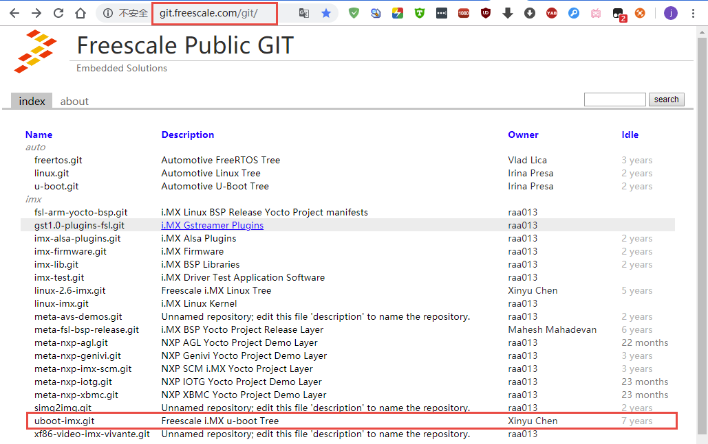
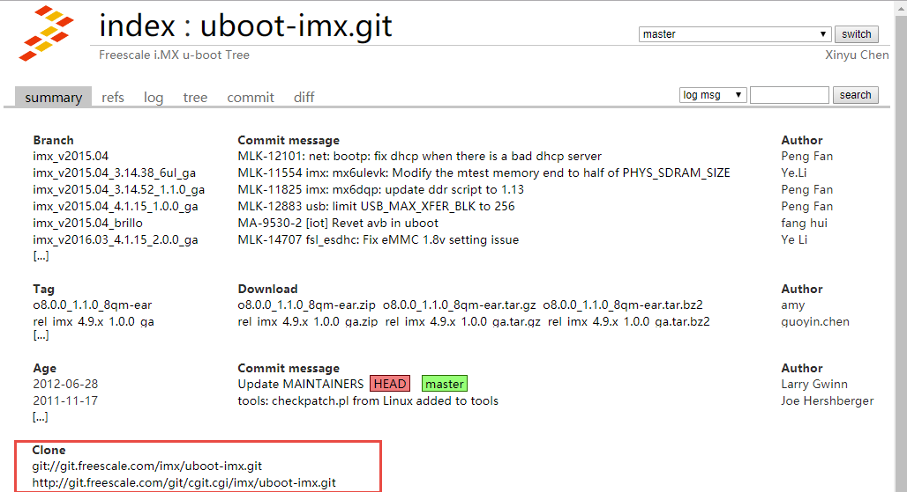

.. vim: syntax=rst

制作NXP官方固件
----------

在构建linux系统中，一般的产品倾向选择原厂的固件。因为原厂的固件一般都比较稳定可靠、资料充足，一般的产品要求都能满足，尤其是对稳定性要求苛刻的工业产品。
这一章就是介绍如何制作NXP官方固件。

uboot
=====

在前面《了解Linux系统组件》章节中，我们简单介绍过uboot相关的概念，此处再回顾一下，总的来说uboot的目的是为了正确引导内核的启动，它分为两个阶段，即boot
+
loader，boot阶段启动系统，初始化硬件设备，建立内存空间映射图，将系统的软硬件带到一个合适的状态，loader阶段将操作系统内核文件加载至内存，之后跳转到内核所在地址运行。

那么我们今天来编译uboot，并教大家简单修改uboot的内容，因为在真正的生产环境中，uboot是使用芯片原厂做好的，只是根据需要修改一下uboot，而不会去大改uboot的源码，这样子没有必要也没有意义，因为uboot就是为了引导内核启动的，启动后uboot就没有什么作用了，与其将uboot改得乱七八糟还不如花时间去维护内核的稳定性。

下载uboot源码
~~~~~~~~~~~~~~~

想要编译uboot，首先我们要下载到uboot的源码，野火官方已经在NXP提供的uboot之上做了修改，并且提交到github与gitee上，大家可以从github与gitee上下载uboot的源码:

**github：**

.. code:: bash

    git clone https://github.com/Embedfire/ebf_6ull_uboot.git

**gitee：**

.. code:: bash

    git clone https://gitee.com/wildfireteam/ebf_6ull_uboot.git

当然啦，如果你想下载NXP原厂的uboot怎么办呢？很简单，直接去NXP官方网站下载就好了，打开
http://git.freescale.com/git/
网页，可以看到很多nxp官方提供的镜像，有内核镜像也有uboot镜像，我们下载官方提供的uboot镜像，名字为\ ``uboot-imx``\ ，我们点击\ ``uboot-imx.git``\ 链接，跳转到下载页面，可以发现该下载页面中有很多uboot相关的信息，如它的分支，标签等，当然我们要注意的是uboot下载界面中的下载信息，我们可以通过\ ``git clone``\ 命令去拉取\ ``uboot-imx``\ 源码，他们的地址就是在下载页面信息的最下方：

.. code:: bash

    Clone 
    git://git.freescale.com/imx/uboot-imx.git
    http://git.freescale.com/git/cgit.cgi/imx/uboot-imx.git

   building_uboot

   building_uboot

**很重要的提醒，我们建议大家使用野火提供的仓库进行编译，而不需要去修改官方的uboot源码。**

在下载完源码后，可以查看一下野官方在NXP的源码之上做了什么样的修改，其实改动的次数只有4次，非常简单，因此我们在日常使用的时候，对uboot的修改是非常微小的，完全不必去分析uboot源码的内容，当然如果你有兴趣，那当我没说。

野火修改uboot的次数如下，它主要是是支持一些硬件，比如LCD触摸屏、HDMI，然后删除NXP官方的logo，修改uboot的延时、bootargs参数等，所以说绝大部分的内容是不需要用户去修改的。

.. code:: bash

    ➜  ebf_6ull_uboot git:(master) git log

    commit d48487689c49f2c29013374689decbbb5bf1459d (HEAD -> master, origin/master)
    Author: jiejie <1161959934@qq.com>
    Date:   Wed Feb 26 08:39:48 2020 +0000

        fix bootargs include rw

    commit a3f25a41fda5ee76b0279dba79b396ae6968993c
    Author: pengjie <jiejie.128@163.com>
    Date:   Tue Oct 8 02:55:05 2019 +0800

        1.delete logo 2.bootdelay==0
        
        Signed-off-by: pengjie <jiejie.128@163.com>

    commit 444f285430aa186cff2ff490c6e4ac2e06cf1c13
    Author: pengjie <jiejie.128@163.com>
    Date:   Tue Sep 17 22:43:26 2019 +0800

        1.修改设备树,适配个别的HDMI显示器,使其能够正常的显示
        
        Signed-off-by: pengjie <jiejie.128@163.com>

    commit 1e738ade76db905670555a5e32dd63a1c6362382
    Author: pengjie <jiejie.128@163.com>
    Date:   Mon Aug 5 21:31:59 2019 +0800

        add for 4.3 & 5.0 & 7.0 LCD
        
        Signed-off-by: pengjie <jiejie.128@163.com>

编译前的准备
~~~~~~~~~~~~~~~~~~~~

开发环境选择\ **ubuntu18.04**

**安装独立编译工具链**

arm-none-eabi-gcc：v6.3.1

可以通过以下命令进行安装：

.. code:: bash

     sudo apt-get install gcc-arm-none-eabi

**测试arm-none-eabi-gcc安装是否成功**

.. code:: bash

    arm-none-eabi-gcc -v

    # 输出
    gcc version 6.3.1 20170620 (15:6.3.1+svn253039-1build1) 

安装一些必要的库，以确保编译能正常通过：

.. code:: bash

    sudo apt-get install lib32ncurses5 lib32tinfo5 libc6-i386

开始编译
~~~~~~~~~

**清除编译信息**

.. code:: bash

    make ARCH=arm clean

在编译uboot的时候需要我们自定义配置，而nxp官方会提供一些默认配置，这些配置在uboot
/configs/目录下，如：

-  mx6ull_14x14_evk_defconfig
-  mx6ull_14x14_evk_emmc_defconfig
-  mx6ull_14x14_evk_nand_defconfig

就是nxp官方为imx6ull提供的配置文件，可以编译生成从SD卡启动的uboot、从emmc启动的uboot以及从nand启动的uboot，我们可以根据需求选择不同的配置文件从而编译不同的uboot。

进入uboot源码目录下，如果想要编译从SD卡启动的uboot，则可以运行以下命令选择SD卡版本的uboot配置（3个版本的uboot任选其一即可）：

.. code:: bash

    命令（编译sd卡版本uboot）
    make ARCH=arm mx6ull_14x14_evk_defconfig

而如果想编译从emmc启动的uboot，则运行：

.. code:: bash

    命令（编译emmc卡版本uboot）
    make ARCH=arm mx6ull_14x14_evk_ emmc _defconfig

想编译从emmc启动的uboot，则运行：

.. code:: bash

    命令（编译nand卡版本uboot）
    make ARCH=arm mx6ull_14x14_evk_ nand _defconfig

在运行以上命令后，Makefile会根据对应的配置文件的内容将配置更新到当前目录下的
``.config``\ 文件中，如果读者感兴趣可以查看一下该文件的内容，接下来的编译则是根据\ ``.config``\ 文件的配置进行编译的。

开始编译，运行以下命令：

.. code:: bash

    make -j4 ARCH=arm CROSS_COMPILE=arm-none-eabi-

    ···
      LD      u-boot
      OBJCOPY u-boot-nodtb.bin
      OBJCOPY u-boot.srec
      SYM     u-boot.sym
      COPY    u-boot.bin
      CFGS    board/freescale/mx6ullevk/imximage.cfg.cfgtmp
      MKIMAGE u-boot.imx

命令中带有jN
参数，表示最大使用N个线程编译，如j4则表示最大使用4个线程编译，根据自己电脑配置决定即可，当然线程数量越多，编译越快。在输出信息的最下方，可以看到已经生成对应的uboot（名字是u-boot.imx），可以直接烧录到开发板中。

当编译完成后会在当前目录下生成\ ``u-boot.imx``\ 文件

.. code:: bash

    ebf_6ull_uboot/u-boot.imx

把它与内核、设备树、文件系统烧录到开发板即可。

尝试在uboot中添加自己的修改
~~~~~~~~~~~~~~~~~~~~~~~~~~~~~~

有时候官方的uboot总是不能满足我们的需求，我们得学会修改对应的uboot配置，比如开机的logo，比如显示屏配置，HDMI配置等，我们就简单修改一下我们的配置，让他能在我们的屏幕上运行，也把开机logo替换为我们的logo。

首先我们要知道这些配置写在什么地方，然后才能去修改它，比如我们先改开机logo，找到uboot
/tools/目录下的Makefile文件，大约在200行，就有关于开机logo的配置，具体如下：

.. code:: makefile

    # Generic logo
    ifeq ($(LOGO_BMP),)
    LOGO_BMP= $(srctree)/$(src)/logos/denx.bmp

    # Use board logo and fallback to vendor
    ifneq ($(wildcard $(srctree)/$(src)/logos/$(BOARD).bmp),)
    LOGO_BMP= $(srctree)/$(src)/logos/$(BOARD).bmp
    else
    ifneq ($(wildcard $(srctree)/$(src)/logos/$(VENDOR).bmp),)
    LOGO_BMP= $(srctree)/$(src)/logos/$(VENDOR).bmp
    endif
    endif

    endif # !LOGO_BMP

解释一下Makefile文件的描述：

-  使用ifeq
   判断是否指定了LOGO_BMP变量（该变量表示开机logo图片），如果不指定则使用默认logo图片denx.bmp，该图片在logos目录下。

-  然后判断一下是否存在使用开发板名字命名的图片（如\ :math:`(BOARD)，它是一个变量的引用，表示开发板的名字），如果是则使用`\ (BOARD).bmp。

-  最后判断一下是否存在以供应商名字命名的图片（如$(VENDOR).bmp），那么很显然，nxp官方提供的uboot必然是以它们的名字命名logo，那么uboot就会使用它们的logo图片，我们可以到uboot
   /tools/logos目录下查看一番，就会发现存在freescale.bmp文件，如图所示。

    注意：开机logo必须是bmp类型的图片，否则可能出现错误。

   building_uboot
既然要修改logo，我们把自己的开机logo图片放进去替换原本的logo即可，我们的开机logo如图所示（注意：logo图片格式必须为bmp格式）。

   building_uboot
这些logo在uboot启动时就会被显示在屏幕上，具体的显示logo的函数在uboot
/board/esd/common/目录下的lcd.c文件中，大约在81行左右，感兴趣的读者可以去看看源码，在这里就不深入分析。

接着我们可以修改显示屏，让我们的开发板支持显示屏的其他尺寸，那么此时就要去配置源码中修改了，nxp官方支持的imx6ull开发板相关的配置源码文件在/uboot/board/freescale/mx6ullevk/目录下的mx6ullevk.c文件中，我们简单修改一下displays这个数组，它是记录了与显示屏相关信息的数组，具体修改如下：

.. code:: c

    struct display_info_t const displays[] = {{
            .bus = MX6UL_LCDIF1_BASE_ADDR,
            .addr = 0,
            .pixfmt = 24,
            .detect = NULL,
            .enable = do_enable_parallel_lcd,
            .mode   = {
                    .name           = "TFT43AB",
                    .xres           = 480,
                    .yres           = 272,
                    .pixclock       = 108695,
                    .left_margin    = 8,
                    .right_margin   = 4,
                    .upper_margin   = 2,
                    .lower_margin   = 4,
                    .hsync_len      = 41,
                    .vsync_len      = 10,
                    .sync           = 0,
                    .vmode          = FB_VMODE_NONINTERLACED
                       }
            },

            {
            .bus = MX6UL_LCDIF1_BASE_ADDR,
            .addr = 0,
            .pixfmt = 24,
            .detect = NULL,
            .enable = do_enable_parallel_lcd,
            .mode   = {
                    .name           = "TFT50AB",
                    .xres           = 800,
                    .yres           = 480,
                    .pixclock       = 108695,
                    .left_margin    = 46,
                    .right_margin   = 22,
                    .upper_margin   = 23,
                    .lower_margin   = 22,
                    .hsync_len      = 1,
                    .vsync_len      = 1,
                    .sync           = 0,
                    .vmode          = FB_VMODE_NONINTERLACED
                       }
            },

            {
            .bus = MX6UL_LCDIF1_BASE_ADDR,
            .addr = 0,
            .pixfmt = 24,
            .detect = NULL,
            .enable = do_enable_parallel_lcd,
            .mode   = {
                    .name           = "TFT70AB",
                    .xres           = 800,
                    .yres           = 480,
                    .pixclock       = 108695,
                    .left_margin    = 46,
                    .right_margin   = 22,
                    .upper_margin   = 23,
                    .lower_margin   = 22,
                    .hsync_len      = 1,
                    .vsync_len      = 1,
                    .sync           = 0,
                    .vmode          = FB_VMODE_NONINTERLACED
                       }
            }

    };

这里的配置是支持3个野火显示屏尺寸的，4.3寸、5寸、7寸、HDMI的适配等，不同的屏幕尺寸稍微不一样，具体阅读以上配置即可，此处不深入研究，都是比较简单的语法，主要是配置硬件相关的信息。

又比如我们在开机时不想让uboot有延时，我们都可以去修改：

在\ ``ebf_6ull_uboot/include/configs/mx6_common.h``\ 文件中将宏定义改为0：

.. code:: c

    #ifndef CONFIG_BOOTDELAY
    #define CONFIG_BOOTDELAY    0
    #endif

在\ ``ebf_6ull_uboot/include/configs/mx6ullevk.h``\ 文件中设置uboot传给内核的参数，比如设置console、bootargs、bootcmd等：

**nand 版本的参数：**

.. code:: c

    #define CONFIG_EXTRA_ENV_SETTINGS \
        CONFIG_MFG_ENV_SETTINGS \
        "panel=TFT50AB\0" \
        "splashimage=0x82000000\0" \
        "fdt_addr=0x83000000\0" \
        "fdt_high=0xffffffff\0"   \
        "console=ttymxc0\0" \
        "bootargs=console=ttymxc0,115200 ubi.mtd=3 "  \
            "root=ubi0:rootfs rw rootfstype=ubifs "          \
            CONFIG_BOOTARGS_CMA_SIZE \
            "mtdparts=gpmi-nand:64m(boot),16m(kernel),16m(dtb),-(rootfs)\0"\
        "bootcmd=nand read ${loadaddr} 0x4000000 0x800000;"\
            "nand read ${fdt_addr} 0x5000000 0x100000;"\
            "bootz ${loadaddr} - ${fdt_addr}\0"

**emmc版本的参数太长了，就不贴代码了，感兴趣的可以自己看源码。**

编译内核
=========================

下载野火官方提供的内核镜像
~~~~~~~~~~~~~~~~~~~~~~~~~~~~~

在编译内核前我们首先要下载到官方提供的内核镜像，目前野火官方镜像已经托管在github上，可以随时去下载，打开\ https://github.com/Embedfire/ebf_6ull_linux\ 网页，可以看到野火官方提供的内核镜像，并且携带了很详细的操作说明文档，这个仓库是来源于NXP官方提供的内核镜像\ http://git.freescale.com/git/cgit.cgi/imx/linux-imx.git/\ ，由\ ``imx_4.1.15_2.0.0_ga``\ 分支开发而来，主要是满足野火开发板的需求。

我们只需要野火官方提供的内核镜像即可，首先我们克隆一下这个内核镜像仓库，在克隆内核镜像的时候最好是在虚拟机中（或linux环境），而不是在Windows环境下，我们将使用\ ``git clone``\ 命令去克隆官方提供的内核镜像，这样子就能保留镜像中的所有git信息与标签，在开发过程中能方便切换到合适的分支进行开发，因为不同的分支内核镜像的源代码修改的地方是不一样的，可能会发生未知的问题，我们目前就使用\ ``master``\ 分支进行开发。

使用\ ``git clone``\ 命令克隆内核镜像，然后等待克隆完成即可：

.. code:: bash

    git clone https://github.com/Embedfire/ebf_6ull_linux.git

由于github网站是国外的，可能会非常慢，甚至出现下载失败现象，建议使用gitee中的仓库，我们已经将源码提交到gitee平台，直接使用\ ``git clone``\ 命令克隆内核镜像即可：

.. code:: bash

    git clone https://gitee.com/wildfireteam/ebf_6ull_linux.git

    Cloning into 'ebf_6ull_linux'...
    remote: Enumerating objects: 54412, done.
    remote: Counting objects: 100% (54412/54412), done.
    remote: Compressing objects: 100% (47905/47905), done.
    remote: Total 54412 (delta 5331), reused 54348 (delta 5281)
    Receiving objects: 100% (54412/54412), 148.94 MiB | 3.49 MiB/s, done.
    Resolving deltas: 100% (5331/5331), done.
    Checking out files: 100% (51413/51413), done.

内核源码目录
~~~~~~~~~~~~~~~~~~~~~~~~~~~~~

在运行\ ``git clone``\ 命令命令后，大约等待一分钟，我们可以看到输出的信息，已然提示克隆完成，我们会发现克隆的目录下多出了一个文件夹\ ``ebf_6ull_linux``\ ，我们可以进入到\ ``ebf_6ull_linux``\ 目录下，可以使用git
log查看仓库的日志信息，看看更改了什么地方。在\ ``ebf_6ull_linux``\ 目录下看到当前目录下多了很多文件夹，它就是我们克隆的内核镜像，里面是官方提供的内核源码，我们可以进入imx-linux目录下中查看主要有哪些文件夹组成，具体见：

.. code:: bash

    ➜  ebf_6ull_linux git:(master) ls

    arch      CREDITS        fs       Kconfig      mm               REPORTING-BUGS  tools
    block     crypto         include  kernel       Module.symvers   samples         usr
    build.sh  Documentation  init     lib          net              scripts         virt
    COPYING   drivers        ipc      MAINTAINERS  OFFICIAL-README  security
    copy.sh   firmware       Kbuild   Makefile     README.md        sound

.. figure:: media/building_kernel001.png
   :alt: building_kernel001

   building_kernel001

从图中我们可以看到Linux内核源码目录下是有非常多的文件夹，且文件夹下也有非常多的文件，下面我们简单分析一下这些文件夹的主要作用。

-  arch：主要包含和硬件体系结构相关的代码，如arm、x86、MIPS，PPC，每种CPU平台占一个相应的目录，例如我们使用的imx系列CPU就在\ ``arch/arm/mach-imx``\ 目录下，Linux内核目前已经支持30种左右的CPU体系结构。arch中的目录下存放的是各个平台以及各个平台的芯片对Linux内核进程调度、
   内存管理、 中断等的支持，以及每个具体的SoC和电路板的板级支持代码。

-  block：在Linux中block表示块设备（以块（多个字节组成的整体，类似于扇区）为单位来整体访问），譬如说SD卡、Nand、硬盘等都是块设备，block目录下放的是一些Linux存储体系中关于块设备管理的代码。

-  crypto：这个文件夹下存放的是常用加密和散列算法（如md5、AES、 SHA等）
   ，还有一些压缩和CRC校验算法。

-  Documentation：内核各部分的文档描述。

-  drivers：设备驱动程序，里面列出了linux内核支持的所有硬件设备的驱动源代码，每个不同的驱动占用一个子目录，如char、
   block、 net、 mtd、 i2c等。

-  fs：fs就是file system，里面包含Linux所支持的各种文件系统，如EXT、
   FAT、 NTFS、 JFFS2等。

-  include：目录包括编译核心所需要的大部分头文件，例如与平台无关的头文件在\ ``include/linux``\ 子目录下，与cpu架构相关的头文件在include目录下对应的子目录中。

-  init：内核初始化代码，这个目录下的代码就是linux内核启动时初始化内核的代码。

-  ipc：ipc就是\ ``inter process commuication``\ ，进程间通信，该文件夹下都是linux进程间通信的代码。

-  kernel：kernel就是Linux内核，是Linux中最核心的部分，包括进程调度、定时器等，而和平台相关的一部分代码放在arch/*/kernel目录下。

-  lib：lib是库的意思，lib目录下存放的都是一些公用的有用的库函数，注意这里的库函数和C语言的库函数不一样的，因为在内核编程中是不能用C语言标准库函数的，所以需要使用lib中的库函数，除此之外与处理器结构相关的库函数代码被放在\ ``arch/*/lib/``\ 目录下。

-  mm： 目录包含了所有独立于 cpu
   体系结构的内存管理代码，如页式存储管理内存的分配和释放等，而与具体硬件体系结构相关的内存管理代码位于\ ``arch/*/mm``\ 目录下，例如\ ``arch/arm/mm/fault.c``\ 。

-  net： 网络协议栈相关代码，net目录下实现各种常见的网络协议。

-  scripts：这个目录下全部是脚本文件，这些脚本文件不是linux内核工作时使用的，而是用了配置编译linux内核的。

-  security：内核安全模型相关的代码，例如最有名的SELINUX。

-  sound： ALSA、 OSS音频设备的驱动核心代码和常用设备驱动。

-  usr： 实现用于打包和压缩的cpio等。

提示：对于其他的未列出来的目录，暂时不用去理会。

进行编译
~~~~~~~~~~~~~~~~~~~~~~~~~~~~~

简单了解内核源码的目录结构后，我们可以开始尝试编译内核，本小节主要是以编译我们配套的开发板源代码为主。

我们提供的源码包是经过修改的，首先进入\ ``ebf_6ull_linux/arch/arm/configs``\ 目录下，可以看到很多默认的deconfig文件，这些是linux源码中的配置文件，其中我们主要关注\ ``imx_v6_v7_defconfig、imx_v7_defconfig 、imx6_v7_ebf_defconfig``\ 这3个文件即可，\ ``imx_v6_v7_defconfig、imx_v7_defconfig``\ 这两个文件是nxp官方提供的默认配置文件，而\ ``imx6_v7_ebf_defconfig``\ 文件则是我们野火提供的配置文件，这些文件是与编译内核息息相关的，而不同的开发板这些配置是不一样的，前面两个是用于编译官方的imx6ull开发板，而后面两个则是根据我们的imx6ull开发板硬件而定制的配置。
由于整个内核镜像都已经打上我们的补丁，那么也无需再做过多的修改即可直接编译，我们可以通过git
log命令查看补丁信息：

.. code:: bash

    ➜  ebf_6ull_linux git:(master) ✗ git log

    commit fe1b9b8fe423aa41ff53757b94adddea8973662d (HEAD -> master, origin/master)
    Author: jiejie <1161959934@qq.com>
    Date:   Tue Jan 14 08:06:54 2020 +0000

        update config

    commit 3594c804dafc37dae86a89520273b87c35488ce9
    Author: jiejie <1161959934@qq.com>
    Date:   Tue Jan 14 07:33:57 2020 +0000

        update config

    commit 342f29e8f7813917c945c3fde1bf2767b61110f6
    Author: jiejie <1161959934@qq.com>
    Date:   Tue Jan 7 02:44:46 2020 +0000

        update README.md

    commit 7c24a3c05257373d30dd698398b9bb798e814cec
    Author: jiejie <1161959934@qq.com>
    Date:   Wed Nov 27 02:45:14 2019 +0000

        compatible with 5-inch and 4.3-inch LCD

    commit 1b9f4f2252477d8eb41eb3f53f0e2232de7af576
    Author: jiejie <1161959934@qq.com>
    Date:   Tue Nov 19 06:44:02 2019 +0000

        add 7' HDMI support

搭建编译环境
~~~~~~~~~~~~

开发环境：\ **ubuntu18.04**

**安装必要的库**

.. code:: bash

    sudo apt-get install lzop libncurses5-dev

**安装独立编译工具链**

1. 命令安装方式（推荐新手使用这种方法）：

arm-linux-gnueabihf-gcc：\ ``v7.4.0``

.. code:: bash

    sudo apt-get install gcc-arm-linux-gnueabihf

2. 安装包安装方式(推荐老手使用这种方法)

从百度云盘下载\ ``arm-linux-gnueabihf-gcc``\ 编译器的压缩包，版本是
``v4.9.3``

链接：\ https://github.com/Embedfire/products/wiki

在 **Linux系列产品**中找到的网盘链接，在\ ``i.MX6ULL系列\5-编译工具链\arm-gcc`` 目录下找到``arm-gcc.tar.gz``压缩包并且下载，然后解压到\ ``/opt/arm-gcc/``\ 目录下，如果没有创建即可，解压后就可以在\ ``/opt/arm-gcc/bin/``\ 目录下找到我们的编译器\ ``arm-linux-gnueabihf-gcc``\ ，它的版本是\ ``gcc version 4.9.3 20141031 (prerelease) (Linaro GCC 2014.11)``\ ，然后可以将编译器所在的路径添加到环境变量中，只修改当前用户的配置文件，通常是\ ``"~/.bashrc"``\ 或者\ ``"~/.bash_profile"``\ ，直接
vi 打开即可，在文件末尾增加编译器所在的路径：

.. code:: bash

    export PATH=$PATH:/opt/arm-gcc/bin/

立即使新的环境变量生效，不用重启电脑：

.. code:: bash

    ➜  ebf_6ull_linux git:(master) ✗ source ~/.bashrc

然后检查是否将路径加入到PATH：

.. code:: bash

    ➜  ebf_6ull_linux git:(master) ✗ echo $PATH

显示的内容中有\ ``/opt/arm-gcc/bin``\ ，说明已经将交叉编译器的路径加入PATH。至此，交叉编译环境安装完成。

测试是否安装成功

.. code:: bash

    ➜  ebf_6ull_linux git:(master) ✗ arm-linux-gnueabihf-gcc -v
    Using built-in specs.
    COLLECT_GCC=arm-linux-gnueabihf-gcc
    COLLECT_LTO_WRAPPER=/opt/arm-gcc/bin/../libexec/gcc/arm-linux-gnueabihf/4.9.3/lto-wrapper
    ···
    gcc version 4.9.3 20141031 (prerelease) (Linaro GCC 2014.11) 

上面的命令会显示arm-linux-gcc信息和版本，说明成功。

更多安装方法参考：\ https://blog.csdn.net/u013485792/article/details/50958253

    作者备注：为什么推荐更低版本的编译器呢？因为作者亲测新版本的编译器并不能完全兼容，在测试比如新版本编译的内核镜像无法识别到4G模块。但是在绝大部分情况下\ ``v7.4.0``\ 版本的编译器都是没有任何问题的！！！请放心使用！！！

编译前准备
~~~~~~~~~~

在开始编译内核前，可以把环境变量设置一下，以防编译时找不到环境变量：

.. code:: bash

    export PATH=/opt/arm-gcc/bin:$PATH 
    export ARCH=arm 
    export CROSS_COMPILE=arm-linux-gnueabihf- 

**清除编译信息**

.. code:: bash

    make ARCH=arm clean

设置配置选项，使用野火开发板配置
~~~~~~~~~~~~~~~~~~~~~~~~~~~~~~~~

首先进入imx-linux目录下，然后开始编译内核，运行\ ``make ARCH=arm imx6_v7_ebf_defconfig``\ 命令将imx6_v7_ebf_defconfig配置文件的信息写入当前路径下的
``.config``\ 文件中，在linux中以\ ``"."``\ 开头的文件都是隐藏文件，我们可以使用ls
–la命令查看这些文件。

.. code:: bash

    make ARCH=arm imx6_v7_ebf_defconfig

    输出
      HOSTCC  scripts/basic/fixdep   
      HOSTCC  scripts/kconfig/conf.o   
      SHIPPED scripts/kconfig/zconf.tab.c   
      SHIPPED scripts/kconfig/zconf.lex.c   
      SHIPPED scripts/kconfig/zconf.hash.c   
      HOSTCC  scripts/kconfig/zconf.tab.o   
      HOSTLD  scripts/kconfig/conf 
      # 
      # configuration written to .config 
      #

Linux内核的配置系统由三个部分组成，分别是： 
-  Makefile：分布在 Linux内核源代码根目录及各层目录中，定义 Linux 内核的编译规则； 

-  配置文件：给用户提供配置选择的功能，如Kconfig文件定义了配置项，.config文件对配置项进行赋值；

-  配置工具：包括配置命令解释器（对配置脚本中使用的配置命令进行解释）和配置用户界面（linux提供基于字符界面、
基于Ncurses 图形界面以及基于 Xwindows 图形界面的用户配置界面，各自对应于make config、make menuconfig 和 make xconfig）。
读者如果想看我们提供的配置文件imx6_v7_ebf_defconfig中修改了什么地方，可以通过makemenuconfig命令来查看我们的配置，
makemenuconfig是一个基于文本选择的配置界面，推荐在字符终端下使用，make menuconfig运行的时候会从当前目录下
导入 .config文件的配置（如果没有找到.config文件则会生成默认配置的 .config文件），
而这个配置则是我们运行make ARCH=arm imx6_v7_ebf_defconfig命令生成的，这就直接可以看到我们在imx6_v7_ebf_defconfig的配置选择，
可以通过键盘的"上"、"下"、"左"、"右"、"回车"、"空格"、"?"、"ESC"等按键进行选择配置，具体见：

.. figure:: media/building_kernel002.png
   :alt: building_kernel002

   building_kernel002
比如我们选择配置我们开发板的触摸屏驱动：\ ``Goodix I2C touchscreen``\ ，如果读者炸不到这个配置选项在哪里，可以利用\ ``make menuconfig``\ 中的搜索功能，在英文输入法状态下按下"/"则可以进行搜索，输入"Goodix"找到改配置选项的位置，具体见：

.. figure:: media/building_kernel003.png
   :alt: building_kernel003

   building_kernel003
从图中可以很明显看出\ ``Goodix I2C touchscreen``\ 配置选项位于\ ``-> Device Drivers``\ 选项下的\ ``-> Input device support``\ 下的\ ``-> Generic input layer (needed for keyboard, mouse, ...) (INPUT [=y])``\ 选项下的\ ``-> Touchscreens``\ 选项中，其实也可以按下\ ``"1"``\ 直接可以定位到对应的选项，然后选中以下内容即可，具体见图：

.. code:: bash

    [*]Goodix touchpanel GT9xx series 
    <*> Goodix GT9xx touch controller auto update support 
    <*> Goodix GT9xx Tools for debuging 
    <*>Goodix I2C touchscreen

.. figure:: media/building_kernel004.png
   :alt: building_kernel004

   building_kernel004
再举个例子，如果想要在我们的开发板上使用\ ``DHT11``\ 测量温湿度（单总线协议），那么需要在内核中配置支持单总线协议：\ ``Dallas's 1-wire support``\ ，我们也照葫芦画瓢，先搜索到这个配置在哪个位置（时候搜索不到就直接找即可），它位于\ ``->Device Drivers``
选项下的\ ``<*> Dallas's 1-wire suppor``\ 选项中，然后进入它的选项下进行选择即可，当配置完成后保存退出，就可以进行编译了，具体见:

.. figure:: media/building_kernel005.png
   :alt: building_kernel005

   building_kernel005
开始编译
~~~~~~~~

如果不需要修改配置，则可以直接编译，运行\ ``make ARCH=arm -j10 CROSS_COMPILE=arm-linux-gnueabihf-``\ 命令直接编译，\ ``-j10``\ 是代表使用10个线程进行编译，如果不选则默认使用一个线程编译，而线程的多少决定了编译的时间，根据自身情况决定即可，在运行这个命令后，可以看到中断输出一系列编译信息，而在编译的最后会告诉我们编译成功，镜像存在\ ``arch/arm/boot/``\ 目录下，具体见：（已删减绝大部分编译输出的信息）。

.. code:: bash

    make ARCH=arm -j10 CROSS_COMPILE=arm-linux-gnueabihf- 

    # 输出内容（已删减绝大部分编译输出的信息）
    ···
    OBJCOPY arch/arm/boot/zImage   
    Kernel: arch/arm/boot/zImage is ready
    ···

编译生成的镜像输出路径
~~~~~~~~~~~~~~~~~~~~~~

**内核镜像路径**

.. code:: bash

    ebf_6ull_linux/arch/arm/boot

**设备树输出路径**

.. code:: bash

    ebf_6ull_linux/arch/arm/boot/dts

因为这个\ ``make ARCH=arm -j10 CROSS_COMPILE=arm-linux-gnueabihf-``\ 命令编译的不仅仅是内核，还会编译设备树，设备树编译后产生的.dtb文件存在\ ``arch/arm/boot/dts/``\ 目录下，我们可以通过\ ``ls arch/arm/boot/dts/ | grep .dtb``\ 命令查看该目录下的所有设备树：

.. code:: bash

    ➜  ebf_6ull_linux git:(master) ✗ ls arch/arm/boot/dts/ | grep .dtb

    imx6ull-14x14-evk-btwifi.dtb
    imx6ull-14x14-evk.dtb
    imx6ull-14x14-evk-emmc-43.dtb
    imx6ull-14x14-evk-emmc-cam-dht11.dtb
    imx6ull-14x14-evk-emmc.dtb
    imx6ull-14x14-evk-emmc-hdmi.dtb
    imx6ull-14x14-evk-emmc-wifi.dtb
    imx6ull-14x14-evk-gpmi-weim-43.dtb
    imx6ull-14x14-evk-gpmi-weim-cam-dht11.dtb
    imx6ull-14x14-evk-gpmi-weim-hdmi.dtb
    imx6ull-14x14-evk-gpmi-weim-wifi.dtb

**拷贝zImage与dtb**

然后我们可以直接运行脚本\ ``copy.sh``\ 将内核镜像与设备树拷贝到\ ``image``\ 目录下

.. code:: bash

    ➜  ebf_6ull_linux git:(master) ✗ ./copy.sh

    all kernel and DTB are copied to /home/jiejie/ebf_6ull_linux/image/

只编译设备树
~~~~~~~~~~~~

当然，如果你不想编译内核的话，只想编译设备树，那么可以在\ ``make ARCH=arm -j10 CROSS_COMPILE=arm-linux-gnueabihf-``\ 命令后面添加
``dtbs`` 即可

.. code:: bash

    make ARCH=arm -j10 CROSS_COMPILE=arm-linux-gnueabihf- dtbs

编译的设备树：

-  imx6ull-14x14-evk.dts
-  imx6ull-14x14-evk-btwifi.dts
-  imx6ull-14x14-evk-emmc.dts
-  imx6ull-14x14-evk-gpmi-weim-43.dts
-  imx6ull-14x14-evk-emmc-43.dts
-  imx6ull-14x14-evk-gpmi-weim-hdmi.dts
-  imx6ull-14x14-evk-emmc-hdmi.dts
-  imx6ull-14x14-evk-gpmi-weim-wifi.dts
-  imx6ull-14x14-evk-emmc-wifi.dts
-  imx6ull-14x14-evk-gpmi-weim-cam-dht11.dts
-  imx6ull-14x14-evk-emmc-cam-dht11.dts

一键编译
~~~~~~~~

如果你什么都不想理会，那么这个一键编译内核与设备树就更适合你了，直接运行以下命令

::

    ./build.sh

或者...

::

    ./build.sh 5.0

生成的内核镜像与设备树均被拷贝到 ``image`` 目录下。
内核模块相关均被安装到 ``my_lib/lib/``
目录下的\ ``modules``\ 文件夹下，可以直接替换掉\ ``rootfs(根文件系统)``\ 中的\ ``/lib/modules/``\ 。

``build.sh``\ 脚本默认编译5.0寸屏幕的内核镜像，如果需要4.3寸屏幕的内核镜像，则可以使用以下命令去编译:

::

    ./build.sh 4.3

修改LOGO
~~~~~~~~~~~~~~~~~

其实在野火开发板的固件中，uboot是没有logo的，因为将uboot的logo删掉了，因为在内核有logo，而uboot到内核的时间非常短（已经将uboot等待
3S
时间去掉了），所以直接使用内核的logo会更好，那么如果想要使用内核的logo，就得自己去修改内核的logo，下面就教大家如何去做。

准备一张图片
^^^^^^^^^^^^^^

我们可以随便准备一张图片，比如我们就选择ubuntu的logo吧，将它制作成适合显示屏大小的图片，比如5寸屏幕的分辨率是800*480：

.. figure:: media/building_kernel006.png
   :alt: building_kernel006

   building_kernel006
然后将其保存为\ **256色（即8位色）的bpm格式的图片**\ ，可以在Windows下或者Linux虚拟机下编辑：

.. figure:: media/building_kernel007.png
   :alt: building_kernel007

   building_kernel007
转换为ppm格式的图片
^^^^^^^^^^^^^^

然后在Linux下使用以下脚本将其转换为ppm格式的文件，为什么是ppm格式呢？因为这是编译Linux内核必要的文件格式，想要修改logo，就要这种格式的文件，它必须是\ **256色（即8位色）的bpm格式的图片**\ 转换而成的。

.. code:: bash

    #!/bin/bash
    if [ " $1" == " " ];
    then
        echo "usage:$0 bmp_file"
        exit 0
    fi

    if [ -f "$1" ]
    then
        echo $1
    else
        echo "no find file [$1]"
        exit 0
    fi

    name=${1%%.*}
    bmptopnm $1 > $name.pnm
    pnmquant 224 $name.pnm > $name.clut224.pnm
    pnmtoplainpnm $name.clut224.pnm > $name.ppm
    rm $name.pnm $name.clut224.pnm 

这是bmp文件转换ppm格式文件的脚本，可以将其写入一个叫\ ``bmp2ppm.sh``\ 脚本文件中，并且赋予其可执行的权限（使用
``chmod +x bmp2ppm.sh``
命令即可），它主要是使用linux系统中的工具转换，如果系统中没有相关工具，则根据提示使用\ ``apt install``\ 命令进行安装即可。

然后将准备好的bmp文件拷贝到制作ppm的工作目录下，使用\ ``bmp2ppm.sh``\ 脚本将其转化为ppm文件，具体操作如下：

.. code:: bash

    ➜  bmp2ppm git:(master) ✗ ls
    bmp2ppm.sh  README.md  ubuntu.bmp

    ➜  bmp2ppm git:(master) ✗ ./bmp2ppm.sh ubuntu.bmp 
    ubuntu.bmp
    bmptopnm: Windows BMP, 800x480x8
    bmptopnm: WRITING PPM IMAGE
    pnmcolormap: making histogram...
    pnmcolormap: 29 colors found
    pnmcolormap: Image already has few enough colors (<=224).  Keeping same colors.
    pnmremap: 29 colors found in colormap

    ➜  bmp2ppm git:(master) ✗ ls
    bmp2ppm.sh  README.md  ubuntu.bmp  ubuntu.ppm

替换原本的logo文件
^^^^^^^^^^^^^^

在转换完成后，当前目录将出现对应的ppm文件，我们将其拷贝到linux内核源码的\ ``ebf_6ull_linux/drivers/video/logo``\ 目录下，因为我们的logo是存放在此处的，野火提供的logo：

-  默认编译的logo：logo_dec_clut224.ppm
-  5寸触摸屏logo：logo_dec_clut224_5.0.ppm
-  4.3寸触摸屏logo：logo_dec_clut224_4.3.ppm

然后将其重命名为你想替换的logo即可，\ **注意**\ ，5寸触摸屏logo与4.3寸触摸屏logo是一键编译使用的，它在一键编译过程中会替换掉默认的logo，如果你只替换了默认编译的logo，但是使用了一键编译脚本，那么你替换的logo将被一键编译脚本修改，编译产生的内核将不会存在你的logo。

修改启动脚本
^^^^^^^^^^^^^^

替换完成后，重新编译内核，并且烧录到开发板上，不过此时会出现一个现象，logo以上而过，这是因为内核启动后，会执行文件系统的启动脚本，而此时文件系统的启动脚本中\ ``/etc/init.d/psplash.sh``\ 会去执行相应的应用程序\ ``/usr/bin/psplash``\ ，这就是绘制开机的进度条与背景，那么你的开机logo将被刷掉，而只要不让这个启动脚本运行这个\ ``/usr/bin/psplash``\ 应用程序就可以解决问题了，那么我们在开发板中修改启动脚本\ ``/etc/init.d/psplash.sh``\ ：

.. code:: bash

    #!/bin/sh 
    ### BEGIN INIT INFO
    # Provides:             psplash
    # Required-Start:
    # Required-Stop:
    # Default-Start:        S
    # Default-Stop:
    ### END INIT INFO

    read CMDLINE < /proc/cmdline
    for x in $CMDLINE; do
            case $x in
            psplash=false)
                    echo "Boot splashscreen disabled" 
                    exit 0;
                    ;;
            esac
    done

    export TMPDIR=/mnt/.psplash
    mount tmpfs -t tmpfs $TMPDIR -o,size=40k

    rotation=0
    if [ -e /etc/rotation ]; then
            read rotation < /etc/rotation
    fi

    /usr/bin/psplash --angle $rotation &

将其最后一行屏蔽掉：

.. code:: bash

    # /usr/bin/psplash --angle $rotation &

或者直接禁止启动该脚本，在终端执行以下命令：

.. code:: bash

    /usr/bin/psplash stop

然后重启开发板，就可以看见你的logo了。

烧录自己编译的内核到开发板
~~~~~~~~~~~~~~~~~~~~~~~~~~~~~

那么经过编译得到的\ ``zImage``\ 与设备树都可以烧录到我们的开发板中，比如我们选择\ ``zImage``\ 与\ ``imx6ull-14x14-evk-emmc-cam-dht11.dts``\ 文件替换掉前面小节中的烧录镜像与设备树，完成烧录后即可看到内核启动完成。

当内核启动后，我们登陆root用户，就可以通过\ ``cat /proc/version``\ 命令查看内核版本：

.. code:: bash

    imx6ull14x14evk login: root 
    root@imx6ull14x14evk:~# cat /proc/version 
    Linux version 4.1.15-2.1.0-00162-gd815328d0504-dirty (embedfire @embedfire_dev) (gcc version 7.4.0 (Ubuntu/Linaro 7.4.0-1ubuntu1~18.04.1) ) #2 SMP PREEMPT Tue Aug 27 07:46:06 UTC 2019

内核配置选项（部分）
~~~~~~~~~~~~~~~~~~~~~~~~~~~~~

运行 ``make ARCH=arm menuconfig``
命令打开配置界面，根据自身需求配置即可！

**触摸屏驱动：**

.. code:: bash

     Prompt: Goodix I2C touchscreen   
      Location:            
       -> Device Drivers         
          -> Input device support  
           -> Generic input layer (needed for keyboard, mouse, ...) (INPUT [=y]) 
     (1)       -> Touchscreens (INPUT_TOUCHSCREEN [=y])  
     #这个也要使能
        [*]   Goodix touchpanel GT9xx series 
        <*>     Goodix GT9xx touch controller auto update support  
        <*>     Goodix GT9xx Tools for debuging     

**单总线驱动：**

.. code:: bash

     Prompt: Dallas's 1-wire support     
     Location:                         
      (1) -> Device Drivers          
      [*]   Userspace communication over connector (NEW)    

**添加MPU6050的支持：**

.. code:: bash

    Prompt: Invensense MPU6050 devices      
    Location:  
      -> Device Drivers               
        -> Industrial I/O support (IIO [=y])               
    (1)     -> Inertial measurement units   
              <*> Invensense MPU6050 devices   

**WIFI蓝牙**

.. code:: bash

    Location:  
      -> Device Drivers               
        -> Network device support                                         
           -> Wireless LAN
              ->

     <*>   Broadcom FullMAC wireless cards support                        
            (/lib/firmware/bcm/AP6236/Wi-Fi/fw_bcm43436b0.bin) Firmware path     
             (/lib/firmware/bcm/AP6236/Wi-Fi/nvram_ap6236.txt) NVRAM path    

    #HCI串口配置也要选择
        -> Device Drivers               
        -> Network device support                                         
           -> Wireless LAN
              ->Bluetooth subsystem support   
                  ->Bluetooth device drivers   
                      <*> HCI USB driver     
                      [*]   Broadcom protocol support  

      -> Networking support (NET [=y])     
        -> Bluetooth subsystem support (BT [=y]) 
          -> Bluetooth device drivers    
            <*> HCI USB driver    
            [*]   Broadcom protocol support  

**PPP点对点拨号：**

所有PPP相关的都选中

.. code:: bash

     Prompt: PPP (point-to-point protocol) support              
      Location:          
      -> Device Drivers 
        (1)   -> Network device support (NETDEVICES [=y])       

**蓝牙和HCI子系统**

.. code:: bash

        -> Networking support (NET [=y])              
         -> Bluetooth subsystem support (BT [=y])   
          (1)     -> Bluetooth device drivers   
      --- RF switch subsystem support                                         
              [*]   RF switch input support  
              <*>   Generic rfkill regulator driver
              <*>   GPIO RFKILL driver 

Buildroot简介
==============

Buildroot是一个简单，高效且易于使用的工具，可通过交叉编译生成嵌入式Linux系统。你可以很容易为你的目标系统构建交叉编译工具链、根文件系统、uboot以及Linux内核镜像，Buildroot可以独立的实现其中的一个或几个功能。Buildroot对于嵌入式开发人员来说是一个非常好用的工具，因为嵌入式不像x86平台（PC）一样硬件基本是统一的，嵌入式平台的硬件是根据需求进行裁剪，而不同的硬件对应的程序必然是不同，所以使用Buildroot来配置是一个非常好的选择。

整个Buildroot是由\ ``Makefile脚本和Kconfig配置文件``\ 构成的，用户可以和编译Linux内核一样，通过config文件进行配置要编译的参数，也可以通过\ ``make menuconfig``\ 等界面进行修改，然后通过make命令编译出一个完整的，可以直接烧写到开发板上运行的Linux系统软件（如\ ``uboot、zimage、dtb``\ 已及文件系统）。

更重要的是Buildroot可以很方便添加第三方的编译源码并且编译，很多工具链、源码都可以从Buildroot社区下载，用户也可以让Buildroot从本地导入源码并，这就为我们的开发带来极大的便利，当需要从网上下载时，Buildroot自动可以帮我们下载，当在本地修改后，又可以直接使用Buildroot编译，它实现了工具链下载、解压、依赖包下载编译等一系列机械化的流程，对开发者非常友好。

Buildroot的官方网站是：\ https://buildroot.org/\ ，我们可以打开官网然后下载我们需要的Buildroot工具，我们可以选择\ ``buildroot-2019.02.4.tar.gz``\ 这个版本的Buildroot作为我们的编译工具即可，虽然Buildroot一直在更新，但是无论是哪个版本基本都是差不多的，大家可以随意下载使用，具体见

.. figure:: media/usingb002.png
   :alt: buildroot

   buildroot
.. figure:: media/usingb003.png
   :alt: buildroot

   buildroot
除此之外Buildroot还有非常详细的文档说明，大家可以在Documentation页面下浏览与下载，当然野火提供的资料中也会存在Buildroot的文档说明buildroot-manual.pdf文件，具体见：

.. figure:: media/usingb004.png
   :alt: buildroot

   buildroot
在官网下载的Buildroot是官方的，里面并没有适配野火开发板的配置文件，因此，我还是建议大家在github或者gitee平台下载我们野火适配好的Buildroot源码，然后使用它来编译文件系统即可，如果你是高手，那么请随意玩耍~

github仓库地址：\ https://github.com/Embedfire/ebf_6ull_buildroot

下载

.. code:: bash

    git clone https://github.com/Embedfire/ebf_6ull_buildroot.git

gitee仓库地址：\ https://gitee.com/wildfireteam/ebf_6ull_buildroot

下载

.. code:: bash

    git clone https://gitee.com/wildfireteam/ebf_6ull_buildroot.git

Buildroot目录简介
~~~~~~~~~~~~~~~~~~~~~~

将下载好的Buildroot在虚拟机中解压后，就可以看到Buildroot的目录下存在很多文件夹如图所示，下面就简单介绍一下这些文件夹的作用。

.. figure:: media/usingb005.png
   :alt: buildroot

   buildroot

-  arch：存放CPU架构相关的配置脚本，如arm、mips、x86等，这些与CPU相关的脚本在Buildroot制作编译工具链、编译uboot时起关键作用。

-  board：针对不同硬件平台的特有配置文件、脚本与补丁。

-  boot：存放的是引导系统相关的配置文件。

-  configs：这里存放的是一些针对不同硬件平台的特有配置文件合集（xxxx_deconfig），我们在开发过程中为自己开发板配置的文件也可以放入该目录下，比如野火提供的imx6ull开发板的配置文件ebf6ull_s1_pro_defconfig就可以放入该目录下。

-  docs：存放相关的参考文档。

-  fs：存放各种文件系统的配置相关的文件，比如ext2、yassf2等。

-  linux：存放着Linux 内核的自动构建脚本。

-  package：该目录下存放着应用软件包的配置文件，每个应用软件包的配置文件有Config.in和xxxx.mk以及一些补丁文件，其中xxxx.mk文件可以去下载对应名字的应用软件包，这个文件其实就是Makefile脚本的自动构建脚本，根据文件中的描述去下载。

-  support：一些Buildroot支持相关的配置文件，比如docker、kconfig、下载辅助工具、补丁等。

-  system：这里就是根目录的主要骨架，以及启动的初始化配置文件，当制作根目录时就是将此处的文件拷贝到output目录下，然后再下载安装工具链的动态库和用户勾选的package。

-  toolchain：该目录主要存放编译交叉工具的配置文件。

-  utils：存放Buildroot一些通用工具。

-  dl：虽然一开始并没有dl（download）目录，但是在开始使用Buildroot后，会自动生成一个dl目录，它主要用于存放Buildroot工具下载的内容，因为Buildroot是一系列工具的管理集合，它本身并不存在这些编译工具，所以在使用时它自动会下载需要的工具，比如交叉编译器、依赖的库、以及一些软件源码包等（以压缩包的形式存放，Buildroot在使用时会自动解压），都会放在dl目录下。

-  output：虽然一开始Buildroot也并没有output目录，但是在开始使用Buildroot后，就会自动生成output目录，它是编译出来的输出文件夹，里面存放着解压后的各种软件包编译完后的现场。同时output目录下还有各种文件夹，如host文件夹是由各类源码编译后在主机上运行工具的安装目录，如arm-linux-gcc就是安装在这里；build文件夹是所有源码包解压出来的文件存放地和编译的发生地；images文件夹则是在我们编译完成后存放uboot、内核镜像、设备树以及文件系统等结果的。

    提示：对于其他的未列出来的目录，暂时不用去理会。

编译前的准备
~~~~~~~~~~~~~~~~~~~~~~

Buildroot的使用是需要依赖源码包的，它会去寻找要编译的源码包，我们可以选择网络上的的源码包也可以选择本地的源码包，那么在这一章中我们就只选择本地的kernel与uboot源码包，从前面的章节我们也编译了kernel与uboot，此处对这些源码包就不再重复赘述，但是有一点读者必须要注意，更新了本地的源码包要用git记录，否则Buildroot不知道你已经更新过的。

根据Buildroot官方文档说明，Buildroot会强制性使用一些工具包，如所示，这是为了Buildroot能正常编译，因此我们在使用前尽量查看一下当前系统的环境下是否存在这些软件包，或者可以直接通过sudo
apt-get install命令去下载它们：

.. code:: bash

    sudo apt-get install -y sed make binutils build-essential gcc g++ bash patch gzip bzip2 perl tar cpio python unzip rsync file bc wget g++-multilib

.. figure:: media/usingb006.png
   :alt: buildroot

   buildroot
    提示：此处使用ubuntu18.04作为测试。

选择配置文件
~~~~~~~~~~~~~~~~~~~~~~

Buildroot为了方便用户使用，在configs目录下提前配置好了很多平台的配置，我们可以在这里找一个与我们开发板最符合的配置文件，然后根据文件中的配置来修改出我们开发板的配置文件即可。当然野火是有提供默认的配置文件：

**1.带Qt Demo的配置：**

.. code:: bash

    imx6ull_ebf_pro_defconfig

**2.最小的完整镜像配置（文件系统6M左右）：**

.. code:: bash

    imx6ull_ebf_minimal_defconfig

**3.pico文件系统配置（不编译uboot与内核，文件系统5M左右）：**

.. code:: bash

    imx6ull_ebf_pico_defconfig

    ps: 以上配置选择其中之一即可

这些配置文件就是根据configs目录下的\ ``imx6ulevk_defconfig``\ 修改，适配我们野火的imx6ull开发板。

比如我们直接选择\ ``imx6ull_ebf_pro_defconfig``\ 作为我们编译的配置文件，那么可以运行以下命令将其写入到\ ``.config``\ 文件：

.. code:: bash

    make imx6ull_ebf_pro_defconfig

    # 输出
    #
    # configuration written to /home/jiejie/ebf_6ull_buildroot/.config
    #

很显然这操作过程与我们编译内核的过程是一样的，都是将配置文件的信息写入当前目录下的
.config文件中，然后通过make menuconfig命令进行配置：

.. figure:: media/usingb007.png
   :alt: buildroot

   buildroot
通过配置界面就可以很容易找的自己要配置的选项，我们可以来看看这些配置的主要功能：
-
``Target options  --->``\ ：目标单板架构配置，在这里主要是选择要编译的平台架构，如cortex-A7；选择CPU的大小端模式，选择支持浮点等等，具体配置如下：

.. figure:: media/usingb008.png
   :alt: buildroot

   buildroot

-  ``Build options  --->``\ ：编译相关的配置，主要是一些编译时用到的选项，比如设置当前配置的保存位置（Location
   to save buildroot
   config），根据自己的路径设置即可，设置dl的路径（下载代码包使用的路径：$(TOPDIR)/dl），多个线程编译的线程数量（如果设置为0则自动选择多个线程编译），是否使能编译器缓冲区；设置下载镜像Mirrors
   and Download
   locations：一般来说Buildroot会默认从国外的网站下载镜像，而在国内下载则很慢，我们可以修改镜像源：

.. code:: bash

    #设置下载镜像Mirrors and Download locations：
    内核镜像源：https://mirror.bjtu.edu.cn/kernel 
    GNU镜像源：https://mirrors.tuna.tsinghua.edu.cn/gnu/ 
    清华镜像站汇总：https://mirrors.tuna.tsinghua.edu.cn/

    # 提示：用清华镜像站会找不到内核。 
    北京交通大学镜像站：https://mirror.bjtu.edu.cn/ 
    中国科学技术大学镜像站：http://mirrors.ustc.edu.cn/

Build options具体配置如下:

.. figure:: media/usingb009.png
   :alt: buildroot

   buildroot
.. figure:: media/usingb010.png
   :alt: buildroot

   buildroot
    如后期有改变则以配置文件为主，建议尽量不改动已发布的配置文件。

-  ``Toolchain  --->``\ ：工具链选项主要是让用户选择合适自己的交叉编译工具链，可以选择Buildroot提供的工具链（内部工具链\ ``Buildroot toolchain``\ ），也可以指定其他非Buildroot提供的工具链（外部工具链\ ``External toolchain``\ ），我们默认选择外部提供的工具链：\ ``gcc-linaro-5.3.1-2016.05-x86_64_arm-linux-gnueabihf``\ ，C库可以选择uClibc-ng,、glibc
   和musl，我们选择glibc，还有选择内核头文件版本（要求比目标内核版本新）、是否使能宽字符（WCHAR）支持（如果需要支持Python则需要使能）、选择gcc编译器版本、是否使能c++等，具体配置如下：

.. figure:: media/usingb011.png
   :alt: buildroot

   buildroot

-  ``System configuration  --->``\ ：系统相关的配置，比如配置系统主机名，它的主要作用是：在一个局域网中，每台机器都有一个主机名，用于主机与主机之间的便于区分，就可以为每台机器设置主机名，以便于以容易记忆的方法来相互访问；设置登陆界面的欢迎信息。选择密码的加密方式，我们可以选择SHA256加密算法（sha-25），设置root登陆的密码、设置默认的命令行终端（我们默认选择bash）、设置默认的登陆串口（开发板连接到电脑的输入/输出）、设置系统默认的环境变量（PATH）、以及选择构建系统镜像版本，根文件系统覆盖（野火的配置中就将一些脚本与相关内容放到\ ``board/embedfire/ebf-imx6ull-pro/rootfs-overlay``\ 目录下，在制作成文件系统时将这些文件添加到文件系统中）、以及一些运行的脚本（buildroot官方为imx6ull制作的打包脚本：\ ``board/freescale/common/imx/post-image.sh``\ ）等，具体配置如下：

.. figure:: media/usingb012.png
   :alt: buildroot

   buildroot

-  ``Kernel  --->``\ ：linux内核相关的配置，用户可以选择要编译的内核版本及源码，可以从网上下载（比如野火的配置文件就是从gitee仓库下载最新的内核源码），除此之外也可以从本地导入（其实对Buildroot来说也算是下载，因为这些文件都会被下载到dl目录下），还可以指定编译内核的默认配置文件（\ ``imx6_v7_ebf，即imx6_v7_ebf_defconfig``\ ，但此处的配置文件不需要后缀名defconfig）、内核二进制文件格式、选择是否编译设备树与指定编译的设备树（DTB）、以及其他的一些扩展。具体配置如下：

指定内核源码编译的设备树如下：

-  imx6ull-14x14-evk-btwifi.dtb
-  imx6ull-14x14-evk.dtb
-  imx6ull-14x14-evk-emmc-43.dtb
-  imx6ull-14x14-evk-emmc-cam-dht11.dtb
-  imx6ull-14x14-evk-emmc.dtb
-  imx6ull-14x14-evk-emmc-hdmi.dtb
-  imx6ull-14x14-evk-emmc-wifi.dtb
-  imx6ull-14x14-evk-gpmi-weim-43.dtb
-  imx6ull-14x14-evk-gpmi-weim-cam-dht11.dtb
-  imx6ull-14x14-evk-gpmi-weim-hdmi.dtb
-  imx6ull-14x14-evk-gpmi-weim-wifi.dtb

.. figure:: media/usingb013.png
   :alt: buildroot

   buildroot

-  ``Target packages  --->``\ ：这个是Buildroot的包管理相关的配置选项，读者可以从这里选择自己需要的软件包，Buildroot
   提供了海量软件包可选，只需在配置界面选中所需要的软件包，交叉编译后即可使用。比如添加音视频应用相关的软件包、添加压缩和解压缩相关的软件包、添加字体、游戏、图形库（QT）、语言和脚本（Python、PHP等）、网络（蓝牙、wifi、http工具包）等软件包，在我们开发板就添加了支持QT与Python的软件包，因此可以在开发板中使用QT与Python，由于配置较多，就不再截图，根据配置文件查看即可。注意：Busybox是必选的。

    假设我们系统中缺失一些库，那么可以在这里选择有没有对应的软件包，如果没有则需要自己手动制作了。

-  ``Filesystem images  --->``\ ：文件系统镜像配置。可以选择生成的文件系统镜像类型
   ，如\ ``tar、cpio、ext2/3/4、 jffs2、 yaffs2 和 ubifs``
   等。文件系统镜像可能会非常大，具体取决于你选择的文件系统类型、软件包的数量以及是否配置的可用空间等，具体配置如下：

.. figure:: media/usingb014.png
   :alt: buildroot

   buildroot

-  ``Bootloaders  --->``\ ：Bootloaders相关的配置，在这个配置选项中，读者可以选择要编译的Bootloaders
   引导程序（如\ ``grub2、ts4800-mbrboot、uboot``\ 等，我们默认选择uboot），指定uboot的名字、下载的位置（可以是从网上下载，写入正确的URL即可；也可以从本地导入，写入本地路径即可），指定uboot的版本，我们默认使用野火的uboot仓库，使用最新发布的uboot版本，具体配置如下：

.. figure:: media/usingb015.png
   :alt: buildroot

   buildroot

-  ``Host utilities  --->``\ ：主机通用配置，使用默认配置即可。

-  ``Legacy config options  --->``\ ：使用默认配置即可。

当配置完成，退出后会发现所有的配置都被写入当前目录下的 .config文件：

.. code:: bash

    configuration written to /home/jiejie/ebf_6ull_buildroot/.config

    *** End of the configuration.
    *** Execute 'make' to start the build or try 'make help'.

如果你想将这次配置的文件保存起来，那么可以通过以下命令保存：

::

     make savedefconfig 

然后我们可以执行\ ``make``\ 命令进行编译操作，\ ``make``\ 命令通常会执行以下步骤：

1. 根据配置需要下载源文件

2. 配置、构建和安装交叉编译工具链，或者只是导入外部工具链

3. 配置、构建和安装选定的目标软件包

4. 则构建内核镜像

5. 构建引导加载程序镜像

6. 以所选格式创建根文件系统

执行\ ``make``\ 命令后就等待它编译完成即可，在编译完成后可以在\ ``output/images``\ 目录下找到编译产生的镜像，具体见

.. figure:: media/usingb016.png
   :alt: buildroot

   buildroot
编译生成的设备树、内核、文件系统等都可以烧录到野火imx6ull开发板上，具体的烧录过程在烧录测试小节中已经讲解，此处就不再重复赘述。

Buildroot其他分析
~~~~~~~~~~~~~~~~~~~~~~

正如前面所说的Buildroot是一个非常强大的工具，它可以随意依赖第三方的库以及工具，能快速构建我们需要的内容，如果你想了解一下Buildroot编译生成的内容的一些时间、依赖、大小等情况，通过代码肯定是不方便，Buildroot还提供可视化分析的工具，我们只需一句命令即可使用它们。

当然，按照官方文档的说明，需要在主机上安装必须的软件包python-matplotlib
和python-numpy，我们可以通过以下命令进行安装：

.. code:: bash

    sudo apt-get install -y python-matplotlib python-numpy

Buildroot的工作之一是了解包之间的依赖关系，并确保它们以正确的顺序构建。
这些依赖关系有时可能非常复杂，对于给定的系统，通常不容易理解为什么这样或那样的包被Buildroot引入并且成功构建。为了帮助理用户解依赖关系，从而更好地理解嵌入式Linux系统中不同组件的作用，Buildroot能够生成依赖关系图，通过make
graph-depends命令即可生成对应的依赖文件（默认是PDF格式），具体情况如下：

.. code:: bash

    命令
    make graph-depends

    最后输出提示：
    -o /home/ embedfire /buildroot/buildroot-2019.02.4/output/graphs/graph-depends.pdf \ /home/embedfire/buildroot/buildroot-2019.02.4/output/graphs/graph-depends.dot

当然，Buildroot还能生成关于编译时间与编译占用资源大小的分析图，只需要通过make
graph-build与make graph-size命令生成即可，具体见（已删减输出信息）：

.. code:: bash

    命令
    make graph-build

    make graph-size

然后可以看到在output/graphs目录下多了一些pdf文件，这些就是Buildroot生成的可视化分析文件，可以直接打开他们，具体见：

.. figure:: media/usingb017.png
   :alt: buildroot

   buildroot
.. figure:: media/usingb018.png
   :alt: buildroot

   buildroot
.. figure:: media/usingb019.png
   :alt: buildroot

   buildroot
其他的一些问题
~~~~~~~~~~~~~~~~~~~~~~

由于buildroot会在国外的网站下载很多东西，所以在下载时会很慢很慢，有可能出现下载失败的情况，那么可以根据日志信息手动去下载对应的软件包。

如果在生成镜像时失败，可以尝试清除一下install状态，然后重新编译。

.. code:: bash

    ./clear.sh 

还有需要注意的是：由于本项目是\ ``Buildroot``\ 使用
``arm-linux-gnueabihf-5.3.1``
编译工具链编译的，与单独编译的内核镜像使用的编译器版本不一致，可能会导致某些内核模块无法加载，因此如果有必要的话，将\ ``output/images/``\ 目录下的内核镜像
``zImage`` 替换掉原本的内核镜像！同理，设备树亦是如此！

制作根文件系统
====================

在介绍制作文件系统之前，我们先来看一下Linux是如何存储数据的。一般情况下，字符设备以串行方式存储和获取数据，串口是最典型的字符设备；而块设备会一次存取或者获取大小相同的一块区域内的数据。例如，一个硬
盘控制器可以向物理存储介质上指定可寻址地址，一次传送或接收512字节的数据，文件系统正是建立在块设备之上的。

文件系统是存在于一个物理设备的逻辑分区之上的。分区就是对一个物理介质（磁盘、闪存）的逻辑划分，该物理介质上的数据在给定分区类型上按照特定的规则进行组织，物理设备可以只有一个独立分区包含所有可用空间，也可以被划分为多个分区以满足特定需要，就好比我们电脑的磁盘，划分为多个分区以用于不同的需求。

简单了解了文件系统的概念，那么我们就动手制作一个文件系统。

buildroot构建根文件系统
~~~~~~~~~~~~~~~~~~~~~

文件系统通常要包含很多第三方软件，比如busybox，tslib，qt，vim，交叉编译工具等，为了避免繁杂的移植工作，buildroot应运而生。用户可以直接通过make
menuconfig配置自己需要的功能，把不需要的功能去掉，再执行make指令编译，buildroot就会自动从指定的服务器上下载源码包，自动编译，自动搭建成我们所需要的嵌入式根文件系统。

buildroot的文件系统（rootfs）构建流程有一个框架，有些部分是buildroot本身就集成的，但还是有些细节需要自己来实现，我们需要按照格式写脚本，提供必要的构建细节，并且配置整个系统，总之，rootfs是Buildroot中最为复杂的部分。

一般来说，buildroot构建文件系统的运作过程如下：

1. buildroot将system/skeleton/目录下的内容拷贝到output/target目录下下作为rootfs的模板。

2. 将output/staging/目录下的工具链中动态库拷贝到output/target/对应的目录下。

3. 分别编译每一个应用的package，并将生成的动态库和bin文件install到output/target/对应的目录下。

4. 将package/initscripts/目录下的系统启动脚本install到output/target/对应的目录下。

5. 构建fakeroot环境，在fakeroot环境下修改output/target/中对应的目录文件权限，制作dev节点，并根据用户的配置制作出rootfs 镜像。

fakeroot是一个主机上使用的软件包，它会被buildroot下载编译，用于为构建rootfs提供一个虚拟的root权限环境，只有在root权限下，才能把output/target/中的目录和文件变成root用户，并创建dev节点。有了fakeroot环境，系统构建者无需获取主机的root权限，
也能在fakeroot下把文件改为root用户，并制作root方式。

uClibc与glibc的差异
~~~~~~~~~~~~~~~~~

glibc和libc都是Linux下的C函数库，libc是Linux下的ANSI C的函数库；glibc是Linux下的GUN C的函数库；GNU C是一种ANSI C的扩展实现。ANSI
C是基本的C语言函数库，包含了C语言最基本的库函数。在写程序时，需要用到很多c语言的库函数，这些所有的库函数整合起来，就是对应的C语言（标准）函数库。

目前在普通GNU/Linux系统中所用的C语言标准库，叫做glibc。它的功能很全，函数很多，但是就是因为代码太多，编译出来的函数库的大小也很大，占用的资源也很多，可以简单地认为glibc就是为了实现完整功能设计的。

由于在嵌入式系统中，也需要C语言写代码实现特定功能，因此需要用到C语言函数库，但是由于嵌入式系统中，一般资源比较有限，所以不适合直接使用太占用资源的glibc。uClibc
是一个面向嵌入式Linux系统的小型的C标准库，最初uClibc是为了支持uClinux而开发，这是一个不需要内存管理单元（MMU）的Linux版本。uClibc比一般用于Linux发行版的C库GNU C Library (glibc)要小得多，
因此uClibc专注于嵌入式Linux，除此之外uClibc比glibc更可配置，这意味着开发人员可以根据功能与空间需求进行裁剪。

简单总结以下几点：

1. uClibc比glibc占用的资源小，虽然uClibc和glibc在已有的接口上是兼容的，而且采用uClibc编译应用程序比采用glibc编译应用程序要更方便，但是uClibc并没有包括glibc中的所有接口实现，因此有些应用可能在uClibc中不能编译。

2. uClibc在可配置性上比glibc要好。

提示：关于uClibc与glibc更多的差异比较信息请看\ http://www.etalabs.net/compare_libcs.html\ 。

使用buildroot制作自己需要的文件系统
~~~~~~~~~~~~~~~~~~~~~~

关于buildroot的简单实用也在第32章 讲解过了，此处就讲解一下关于文件系统的内容即可。（注意：必须先按照第32章 的内容配置好内核及uboot的编译内容，否则无法从SD卡启动系统）。

首先运行以下命令进入配置选项：

命令

make menuconfig

找到System configuration(系统配置)选项，进入该选项中，如图 33‑1所示。

|buildi002|

图 33‑1 System configuration(系统配置)

我们可以简单介绍一下这个选项的中的部分参数及其意义（ []内容为设置的值）：

-  Root FS skeleton (default target skeleton) ： 根文件系统框架 [默认目标框架]

-  (buildroot) System hostname ：系统主机名字(自取任意) [buildroot]

-  (Welcome to ixm6ull Buildroot!) System banner：系统开机提示 [Welcome to ixm6ull Buildroot!]

-  Passwords encoding (sha-256)：密码编码 [sha-256格式编码]

-  Init system (busybox) --->：初始化系统方案 [busybox]

-  /dev management (Dynamic using devtmpfs only) ：dev管理方案 [Dynamic using devtmpfs only]

-  (system/device_table.txt) Path to the permission tables ：权限表路径

-  [ ] support extended attributes in device tables：支持设备表中的扩展属性

-  [ ] Use symlinks to /usr for /bin, /sbin and /lib：是否将/bin,/sbin,/lib链接到/usr

-  [*] Enable root login with password：使能root登陆密码

-  () Root password：设置root密码

-  /bin/sh (bash) ：选择shell类型 [bash]

-  [*] Run a getty (login prompt) after boot：启动后运行getty(登录提示)

-  [*] remount root filesystem read-write during boot ：在引导期间安装根文件系统支持读和写

-  (eth0) Network interface to configure through DHCP：设置DHCP配置的网络接口 [eth0]

-  (/bin:/sbin:/usr/bin:/usr/sbin) Set the system's default PATH：设置系统的默认路径

-  [*] Purge unwanted locales：清除不需要的区域设置

-  (C en_US) Locales to keep：要保留的语言环境

-  () Generate locale data：生成区域设置数据

-  [ ] Enable Native Language Support (NLS) ：启用本地语言支持（NLS）

-  -*- Install timezone info ：安装时区信息

-  (default) timezone list：时区清单 [典型]

-  (Etc/UTC) default local time ：用户表的路径

-  () Path to the users tables

-  () Root filesystem overlay directories：根文件系统覆盖目录

-  () Custom scripts to run before creating filesystem images：在创建文件系统映像之前运行的自定义脚本

-  () Custom scripts to run inside the fakeroot environment：自定义脚本在fakeroot(模拟root权限)环境中运行

-  (board/……) Custom scripts to run after creating filesystem images ：创建文件系统映像后运行的自定义脚本

-  () Extra arguments passed to custom scripts：传递给自定义脚本的额外参数

在这里就重点提一下几点配置：

1. Root FS skeleton：我们建议选择默认的根文件系统框架，因为默认的框架是非常小的，可以适应绝大部分的场合，当然，占用资源小也代表功能仅有一点点，读者可以自己往文件系统添加需要的功能，这是可以的。除此之外读者也可以选择自己的根文件系统框架（custom target skeleton）。

2. Init system：初始化系统方案，目前buildroot中提供2种方案，一种是BusyBox：系统的init程序将在启动时读取/etc/inittab文件，以了解该做什么，默认inittab存储在./package/busybox/inittab中；inittab除了安装几个重要的文件系统之外
   ，还要启动/etc/init.d/rcS中的shell脚本，并启动一个getty程序(提供一个登录提示)。另一种是systemV，使用传统sysvinit程序，之前大多数台式机Linux发行版都使用该方案，现在有些变为了Upstart或Systemd，在构建文件系统的时候会在/ect目录下会生成in
   it.d、rc0.d、rc1.d、rc2.d、rc3.d、rc4.d、rc5.d、rc6.d、rc.loacl等目录和脚本文件，init.d目录下包含的是真正的脚本。

3. /dev management ：/dev设备文件的管理方式，可选选项有四个：

Static using device table: 使用静态的设备表，/dev将根据system/device_table _dev.txt的内容创建设备，进入系统添加或删除设备时，无法自动更新；

Dynamic using devtmpfs only:在系统启动过程中，会动态生成/dev文件，进入系统添加或删除设备时，无法自动更新；

Dynamic using devtmpfs + mdev:在前面devtmpfs的基础上加入mdev用户空间实用程序，进入系统添加或删除设备时，可以自动更新，自动创建规则在/etc/mdev.conf;

Dynamic using devtmpfs + eudev:在前面devtmpfs的基础上加入eudev用户空间守护程序，eudev是udev的独立版本，是Systemd的一部分，提供更多的功能也更占用资源；

4. /bin/sh (bash)：选择shell类型，一般选择bash即可，用户的体验会很好。除了bash外，还有很多shell工具，比如这里可选busybox自带的shell、小巧但功能很少的dash、高效紧凑的mksh、功能强大体积也稍大的zsh。

5. Root filesystem overlay directories：根文件覆盖目录，如果你想将某些文件添加到文件系统中，那么可以按照根文件的目录框架进行添加到对应的路径中，在文件系统构建的时候，会将对应的文件添加到文件系统中，如果出现相同的文件则覆盖。

我们还需要配置一下Filesystem images(文件系统)选项，具体见图 33‑2 。

|buildi003|

图 33‑2 Filesystem images(文件系统)

这些配置的含义如下：

-  [ ] axfs root filesystem：XFS格式根文件系统

-  [ ] btrfs root filesystem ：btrfs格式根文件系统

-  [ ] cloop root filesystem for the target device：clop方式压缩根文件系统

-  [ ] cpio the root filesystem (for use as an initial RAM filesystem) ：cpio方式压缩根文件系统(用作初始RAM文件系统)

-  [ ] cramfs root filesystem：cramf格式根文件系统

-  [*] ext2/3/4 root filesystem ：ext2/3/4格式根文件系统

-  ext2/3/4 variant (ext4) ：ext4格式根文件系统

-  () filesystem label ：文件系统标签

-  (200M) exact size ：根文件系统空间大小[200M]

-  (0) exact number of inodes (leave at 0 for auto calculation) ：确切的inode数(从0开始自动计算)

-  (5) reserved blocks percentage：保留块百分比 (保留的供root使用,默认5%)

-  (-O ^64bit) additional mke2fs options ：额外的mke2fs选项 [禁用64位文件系统]

-  Compression method (no compression) ：压缩方式 [无压缩]

-  [ ] f2fs root filesystem ：f2fs格式根文件系统

-  [ ] initial RAM filesystem linked into linux kernel：初始RAM文件系统链接到Linux内核

-  [ ] jffs2 root filesystem：jffs2格式根文件系统

-  [ ] romfs root filesystem：romfs格式根文件系统

-  [ ] squashfs root filesystem ：squashfs格式根文件系统

-  [*] tar the root filesystem：tar压缩格式根文件系统

-  Compression method (no compression) ：压缩方式 [无压缩]

-  () other random options to pass to tar：传递给tar的其他选项

-  [ ] ubi image containing an ubifs root filesystem：ubifs格式根文件系统包含ubi镜像

-  [ ] ubifs root filesystem ：ubifs格式根文件系统

-  [ ] yaffs2 root filesystem：yaffs2格式根文件系统

我们就简单设置一下文件系统的大小（256M），以及根文件系统的格式（tar压缩格式）即可。

当配置完毕后，我们可以选择对应的软件包添加到我们的系统中，比如Python3等，这里就不再重复赘述。然后使用make命令进行编译，就会生成对应的文件系统了，生成的镜像文件在output/images/目录下。

.. |buildi002| image:: media/building_rootfs002.png
   :width: 5.76806in
   :height: 4.2879in
.. |buildi003| image:: media/building_rootfs003.png
   :width: 4.76155in
   :height: 5.05224in
.. |buildi004| image:: media/building_rootfs004.png
   :width: 5.76806in
   :height: 4.62276in
.. |buildi005| image:: media/building_rootfs005.png
   :width: 5.76806in
   :height: 3.46306in
