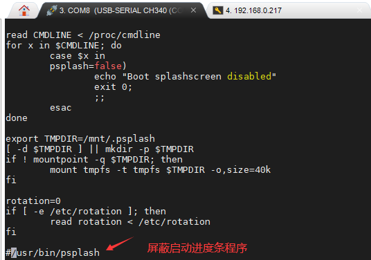

.. vim: syntax=rst

构建野火Debian系统固件
------------------------

为什么要构建Debian系统固件
============================

前面介绍了NXP官方的固件有稳定可靠的优点，适合大部分的产品使用，但这是从产品角度来看的。
对于Linux学习者来说，原厂固件因为使用的是较老版本的linux内核、Uboot版本，
它与目前的代码的架构和系统特性已经发生了一些变化。再去学习研究时，就显得比较脱节。
毕竟学习时间有限，不可能把所有新旧版本的内核、uboot重新学习一遍。

目前野火移植了较新版本的uboot(2019_04) ,kernel(4.19.71)，为的就是减少重复学习成本，
也更加锻炼学习者的能力。而且出于对初学者好学易用的目的，
根文件系统将会使用Debian，它的第三方软件包繁多，安装简单，
大家熟悉的Ubuntu就是基于Debian发展而来。

编译2019.04版本uboot
============================

野火移植2019.04版本uboot，在其中完善了对内核设备树插件的支持，提高了系统的扩展性和可维护性。

1、下载野火2019版本uboot，代码已经托管在github以及gitee上，直接执行以下命令进行下载即可:

.. code-block:: sh
   :emphasize-lines: 1
   :linenos:

   git clone https://github.com/Embedfire/ebf-buster-uboot.git
   或者
   git clone https://gitee.com/Embedfire/ebf-buster-uboot.git

2、先在系统执行以下命令，安装必要的环境工具，再进行uboot的编译。

.. code-block:: sh
   :emphasize-lines: 1
   :linenos:

   sudo apt install make gcc-arm-linux-gnueabihf gcc bison flex libssl-dev dpkg-dev lzop

3、在项目文件夹目录下使用root权限执行编译脚本compile_uboot.sh

.. code-block:: sh
   :emphasize-lines: 1
   :linenos:

   sudo ./compile_uboot.sh

编译结束后，会在当前文件夹路径下生成u-boot-dtb.imx文件，这就是我们需要的uboot镜像,
该uboot镜像需要存放到下面介绍的ebf-image-builder项目的uboot目录中，来进行系统固件的生成。

编译4.19.71版本内核
=========================

1、下载野火4.19.71版本内核，代码已经托管在github以及gitee上，直接执行以下命令进行下载即可:

.. code-block:: sh
   :emphasize-lines: 1
   :linenos:

   git clone https://github.com/Embedfire/ebf-buster-linux.git
   或者
   git clone https://gitee.com/Embedfire/ebf-buster-linux.git

2、先在系统执行以下命令，安装必要的环境工具，再进行内核的编译。

.. code-block:: sh
   :emphasize-lines: 1
   :linenos:

   sudo apt install make gcc-arm-linux-gnueabihf gcc bison flex libssl-dev dpkg-dev lzop

3、在项目文件夹目录下运行编译脚本make_deb.sh

.. code-block:: sh
   :emphasize-lines: 1
   :linenos:

   ./make_deb.sh

编译结束后，会在源码目录下的 ``build_image`` 路径下生成linux-image-4.19.71-imx-r1_1stable_armhf.deb，
这就是4.19.71版本linux内核的安装包。该内核安装包需要存放到下面介绍的ebf-image-builder项目的Kernel目录中，
来进行系统固件的生成。

make_deb.sh脚本包含了编译输出路径、编译器以及使用的配置文件的内容，它默认使用npi_v7_defconfig配置编译内核，
如果需要调整内核的编译配置，可使用如下命令调用menucofig进行修改：

.. code-block:: sh
   :linenos:

   make menuconfig   KCONFIG_CONFIG=arch/arm/configs/npi_v7_defconfig   ARCH=arm   CROSS_COMPILE=arm-linux-gnueabihf-
   #配置完成后选择save保存，再运行./make_deb.sh脚本即可以新的配置编译内核。

制作Debian系统镜像
=============================

ebf-image-builder简介
~~~~~~~~~~~~~~~~~~~~~~~

该项目移植自BeagleBone公司的image-builder项目，主要用于构建debian系统镜像。它的源码开放，
主要由shell脚本和配置文件构成，用户可以灵活高效地修改debian文件系统的配置，
还能根据实际项目需要在文件系统中预装某些应用软件。

源码地址: https://github.com/Embedfire/ebf-image-builder

关于Debian系统
~~~~~~~~~~~~~~

Linux有非常多的发行版本，Debian就是最早的Linux发行版本之一。大家比较熟悉的Ubuntu就是基于Debian发展而来，
相比其他Linux发型版本，Debian主要有以下几个方面的优点:

1.  稳定

Debian的发布版本通常测试完善，发行周期较长，它通常维护着三个版本:“稳定版(stable)”、“测试版(testing)”、
“不稳定版(unstable)”，对每个稳定发行版本，用户可以得到三年的完整支持以及额外两年的长期支持。
debian目前在很多企业用户中使用，它的稳定性和可靠性是经过市场长期验证的。

2.  软件包管理程序简单易用

熟悉Ubuntu的人应该知道，Ubuntu是用dpkg工具来进行软件包的管理，关于软件的安装、卸载、升级都可以用dpkg指令完成，
dpkg指令功能非常强大，但是也比较复杂。因而后来基于dpkg衍生出来了apt工具，可以通过apt install、apt remove、
等指令就能轻松安装、卸载软件。在这方面，Debian与Ubuntu的机制是完全一样的。

3.  软件包丰富

Debian经过这么多年的发展，开源社区已经积累了数以万计的应用程序，从文档编辑、到电子商务、到游戏娱乐、到软件开发，
全面提供即安装即使用的体验。免去自己编译源代码的诸多麻烦，而且用apt upgrade就能轻松升级到最新版本的软件。

4.  良好的系统安全

Debian自由软件社区非常注重在软件发布中快速地修复安全问题。通常没几天就会有修复过的软件被上传。因为开放源代码
所以 Debian 的安全性是可以被用户和开发者客观评估的。这有利于防止潜在的安全问题被引入到Debian系统中。

关于image-builder项目
~~~~~~~~~~~~~~~~~~~~~

项目起源
""""""""

BeagleBoard.org是一家非盈利公司，致力于在嵌入式计算 领域提供开源硬件和软件，并且重点关注教育行业,
BeagleBoneBlack是该公司最受欢迎的主板。image-builder项目就是为BeagleBoneBlack之类的开发板构建debian系统镜像的开源项目。

源码地址: https://github.com/beagleboard/image-builder。

项目原理
"""""""""

image-builder项目基于qemu和debootstrap等工具来生成和定制arm架构的debian文件系统。其中，qemu是一个开源的模拟器项目，
在GNU/Linux平台上使用广泛，可用于模拟各种不同架构的处理器。而debootstrap是Debian官方提供的，
适用于生成不同架构、不同版本的debian文件系统。

.. image:: media/image-builder_analyze.png
   :align: center
   :alt: image-builder项目分析

如上图所示:
在使用debootstrap工具生成debian文件系统后，然后qemu使用新构建的debian文件系统作为文件系统，
在qemu模拟arm架构的处理器并启动后，就可以用apt install命令预装各种应用软件，
linux内核和设备树都是在这个阶段中安装更新的。安装完毕后，使用dd命令把得到的文件系统和u-boot一起打包到img文件中，
即可生成用于sd卡烧录的debian系统镜像。

ebf-image-builder目录分析
~~~~~~~~~~~~~~~~~~~~~

1.  使用git克隆项目镜像

.. code-block:: sh
   :emphasize-lines: 1
   :linenos:

    git clone https://github.com/Embedfire/ebf-image-builder.git
    或者
    git clone https://gitee.com/Embedfire/ebf-image-builder.git

出现下图提示表示克隆完成

.. image:: media/git_clone_finish.png
   :align: center
   :alt: git克隆完成

2.  进入下载好的文件目录，使用tree命令查看文件夹目录

.. code-block:: sh
   :emphasize-lines: 2
   :linenos:

   cd ebf-image-builder
   tree -L 1

可以看到ebf-image-builde项目的目录结构，如下图所示:

.. image:: media/ebf-image-builder_list.png
   :align: center
   :alt: ebf-image-builde目录

其中:

- configs目录:主要是Debian文件系统的一些配置项，主要有:预安装软件列表、镜像源地址等。
- docs目录:主要是代理使用说明和debootstrap使用说明。
- publish目录:这个目录下存放着编译debian固件的起始脚本，是整个项目的编译入口。
- scripts目录:存放了一些执行特殊功能的脚本，在编译过程中会被调用。
- target目录:这里面放置的内容比较杂散，有启动参数的说明文档、systemd的启动服务和deb镜像源的密钥等等。
- tools目录:主要是打包脚本，完成把文件系统和uboot打包成img镜像的功能。
- Kernel目录:存放的是前面编译出来的内核安装包(linux-image-4.19.71-imx-r1_1stable_armhf.deb)。
- uboot目录:存放前面编译出来的uboot固件(u-boot-dtb.imx)。

ebf-image-builde编译Debian固件
~~~~~~~~~~~~~~~~~~~~~~~~~~~~~~

进入ebf-image-builde项目源码目录下，直接执行编译脚本

.. code-block:: sh
   :emphasize-lines: 2
   :linenos:

   cd ebf-image-builder
   sudo ./publish/seeed-imx-stable.sh

注意：如果执行过程提示:

.. code-block:: sh
   :emphasize-lines: 2
   :linenos:

    m4: 未找到命令

那么先用apt工具安装m4工具，再重新执行编译命令

.. code-block:: sh
   :emphasize-lines: 2
   :linenos:

   sudo apt install m4 -y
   sudo ./publish/seeed-imx-stable.sh

正常编译时，打印信息如下图所示:

.. image:: media/building_debian_start.png
   :align: center
   :alt: 开始编译debian

编译时间较长(大概三十分钟到一个小时不等，主要跟网速有关)，请耐心等待。如果后面客户需要频繁进行编译工作，
我们会提供使用代理下载的方法，可大幅减小编译时间。

编译完成后，下图中红框部分即为新编译的Debian系统镜像

.. image:: media/building_debian_end.png
   :align: center
   :alt: 编译debian结束

Debian系统镜像存放下面目录中

.. code-block:: sh
   :emphasize-lines: 2
   :linenos:

    ebf-image-builder/deploy/debian-buster-console-armhf##日期 
    
可以参考《SD卡烧录Debian镜像》章节把该镜像烧录到sd卡中，以SD卡方式启动开发板。

烧录完成后，开发板第一次用sd卡方式启动时，系统会自动进行扩容重启，
以保证充分利用sd卡存储空间。扩容完毕后，系统重启生效。

修改启动logo步骤
~~~~~~~~~~~~~~~~~~~~~

其实在野火开发板的固件中，uboot是没有logo的，因为将uboot的logo删掉了，因为在内核有logo，而uboot到内核的时间非常短（已经将uboot等待
3S时间去掉了），所以直接使用内核的logo会更好，那么如果想要使用内核的logo，就得自己去修改内核的logo，下面就教大家如何去做。

准备一张图片
""""""""

我们可以随便准备一张图片，比如我们就选择ubuntu的logo吧，将它制作成适合显示屏大小的图片，比如5寸屏幕的分辨率是800*480：

.. figure:: media/building_kernel006.png
   :alt: building_kernel006

   building_kernel006

然后将其保存为 **256色（即8位色）的bpm格式的图片** ，可以在Windows下或者Linux虚拟机下编辑：

.. figure:: media/building_kernel007.png
   :alt: building_kernel007

   building_kernel007

转换为ppm格式的图片
""""""""

1、安装格式转换工具

   sudo apt install netpbm -y

2、在Linux下使用以下脚本将其转换为ppm格式的文件，为什么是ppm格式呢？
因为这是编译Linux内核必要的文件格式，想要修改logo，就要这种格式的文件，
它必须是 **256色（即8位色）的bpm格式的图片** 转换而成的。

.. code:: bash

    #!/bin/bash
    if [ " $1" == " " ];
    then
        echo "usage:$0 bmp_file"
        exit 0
    fi

    if [ -f "$1" ]
    then
        echo $1
    else
        echo "no find file [$1]"
        exit 0
    fi

    name=${1%%.*}
    bmptopnm $1 > $name.pnm
    pnmquant 224 $name.pnm > $name.clut224.pnm
    pnmtoplainpnm $name.clut224.pnm > $name.ppm
    rm $name.pnm $name.clut224.pnm 

这是bmp文件转换ppm格式文件的脚本，可以将其写入一个叫 ``bmp2ppm.sh`` 脚本文件中，并且赋予其可执行的权限（使用
``chmod +x bmp2ppm.sh``
命令即可），它主要是使用linux系统中的工具转换，如果系统中没有相关工具，则根据提示使用 ``apt install`` 命令进行安装即可。

然后将准备好的bmp文件拷贝到制作ppm文件的目录下，使用 ``bmp2ppm.sh`` 脚本将其转化为ppm文件，具体操作如下：

.. code:: bash

    ➜  bmp2ppm git:(master) ✗ ls
    bmp2ppm.sh  README.md  ubuntu.bmp

    ➜  bmp2ppm git:(master) ✗ ./bmp2ppm.sh ubuntu.bmp 
    ubuntu.bmp
    bmptopnm: Windows BMP, 800x480x8
    bmptopnm: WRITING PPM IMAGE
    pnmcolormap: making histogram...
    pnmcolormap: 29 colors found
    pnmcolormap: Image already has few enough colors (<=224).  Keeping same colors.
    pnmremap: 29 colors found in colormap

    ➜  bmp2ppm git:(master) ✗ ls
    bmp2ppm.sh  README.md  ubuntu.bmp  ubuntu.ppm

替换原本的logo文件
""""""""

1、在转换完成后，当前目录将出现对应的ppm文件，我们将其拷贝到linux内核源码的 ``ebf-buster-linux/drivers/video/logo`` 目录下，因为我们的logo是存放在此处的，野火提供的logo：

-  默认编译的logo：logo_linux_clut224.ppm

2、将你编译的ppm文件重命名为logo_linux_clut224.ppm，替换掉内核中旧的logo_linux_clut224.ppm文件。

3、按照上面的编译步骤，重新编译内核，把编译得到的内核安装包(linux-image-4.19.71-imx-r1_1stable_armhf.deb)，
复制粘贴到ebf-image-builder项目中的Kernel文件夹下，重新在ebf-image-builder项目中编译得到新的.img格式系统镜像。

修改启动脚本
""""""""

把新的.img格式系统镜像烧录到sd卡中，启动开发板。此时会出现一个现象，logo一闪而过，这是因为内核启动后，
会执行文件系统的启动脚本，而此时文件系统的启动脚本中 ``/opt/scripts/boot/psplash.sh``\
会去执行相应的应用程序 ``/usr/bin/psplash`` ，这就是绘制开机的进度条与背景。那么你的开机logo将被刷掉，
而只要不让这个启动脚本运行这个 ``/usr/bin/psplash`` 应用程序就可以解决问题了，
那么我们在开发板中使用vi编辑器修改脚本 ``/opt/scripts/boot/psplash.sh`` 。

如下图:

将其最后一行屏蔽掉，然后重启开发板，就可以看见你的logo了并且没有了进度条程序。