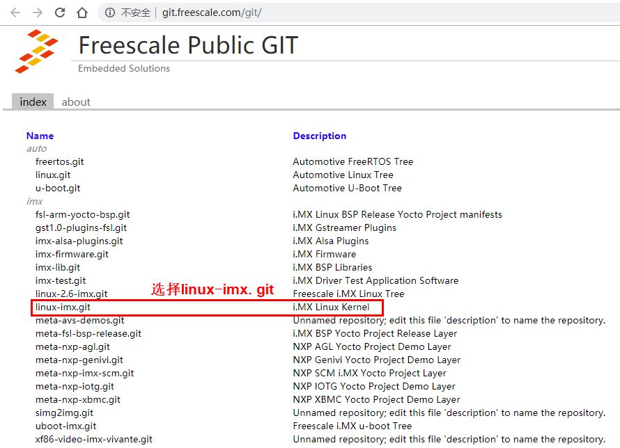
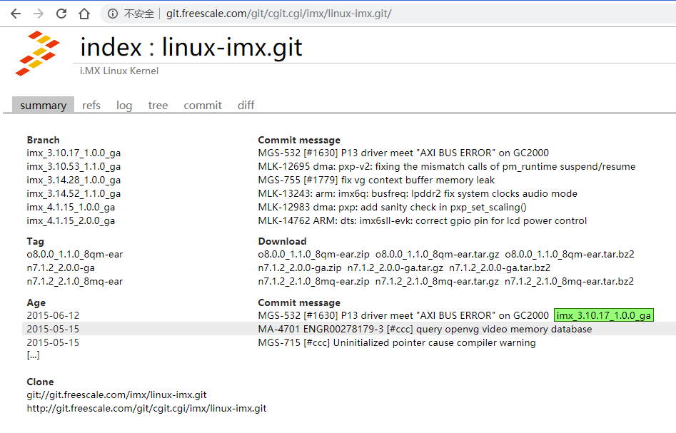
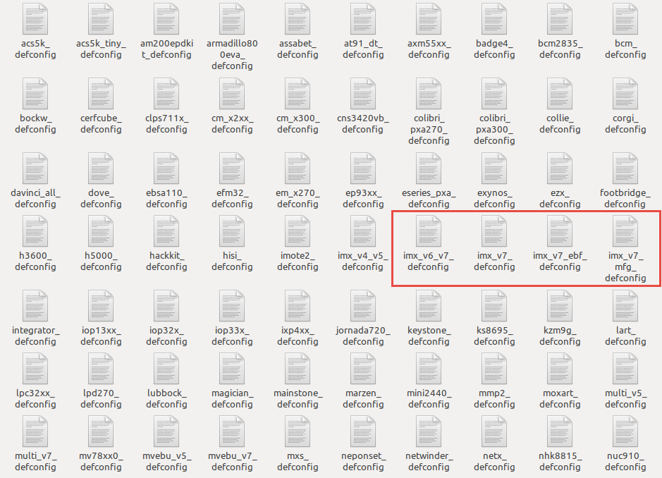
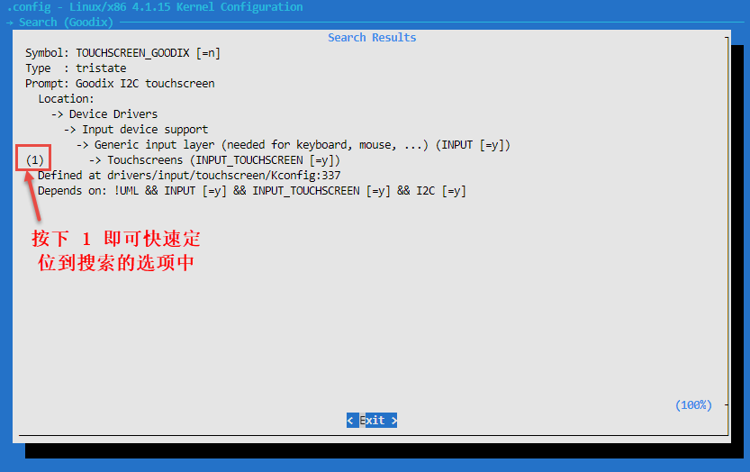
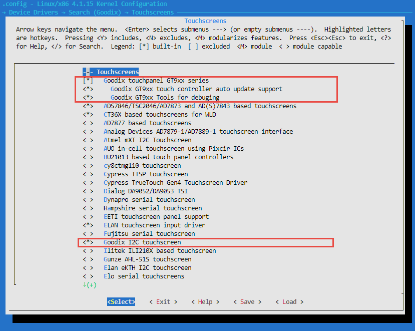
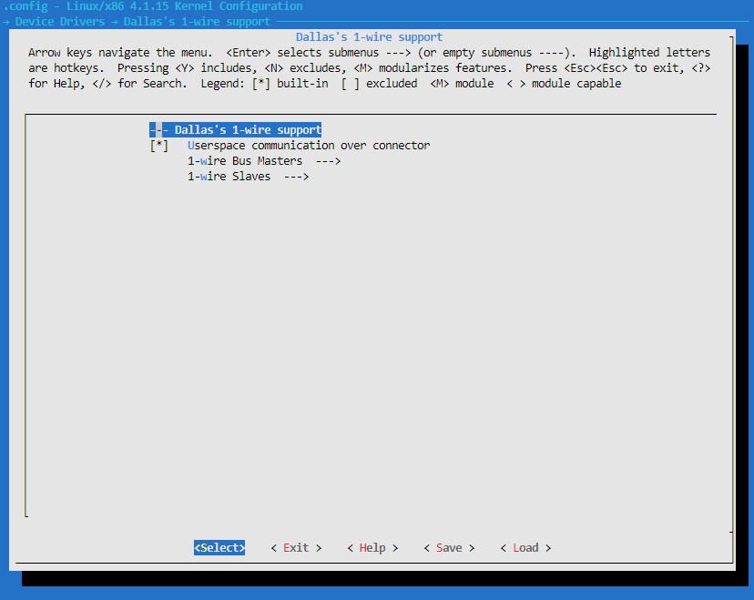
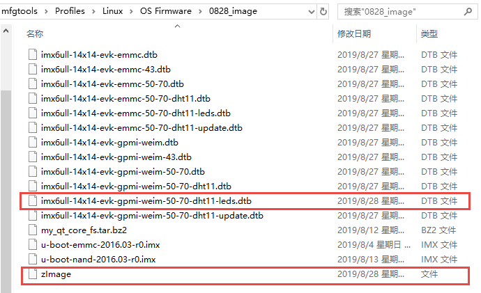

.. vim: syntax=rst

编译内核
----

本章节内容处于开发笔记状态，还待整理至最终版的教程。

本章节内容处于开发笔记状态，还待整理至最终版的教程。

下载nxp官方提供的内核镜像
~~~~~~~~~~~~~~

在编译内核前我们首先要下载到官方提供的内核镜像，打开\ http://git.freescale.com/git/\
网页，可以看到很多nxp官方提供的内核镜像，这个网站是飞思卡尔（freescale）公司的，在2015年的是nxp巨资收购了飞思卡尔，所以可以直接从飞思卡尔的网站下载nxp官方提供的内核镜像。

打开网页后可以看到nxp官方有非常多的镜像在这里，我们需要选择要下载的内核镜像linux-imx，然后页面会跳转到linux-imx内核镜像的详细说明页面，该页面有很多分支、标签等信息，具体见图 30‑1、图 30‑2。

|buildi010|

图 30‑1 选择linux-imx镜像

|buildi003|

图 30‑2 linux-imx信息说明

我们注意图 30‑2最下面的两句话，它就是告诉我们克隆（即下载）镜像的路径：

Clonegit://git.freescale.com/imx/linux-imx.git http://git.freescale.com/git/cgit.cgi/imx/linux-imx.git

在克隆内核镜像的时候最好是在虚拟机中（或linux环境），而不是在Windows环境下载，然后下载的环境必须支持git，因为我们将使用git
clone命令去克隆nxp官方提供的内核镜像，这样子就能保留镜像中的所有git信息与标签，在开发过程中能方便切换到合适的分支进行开发，因为不同的分支内核镜像的源代码是不一样的，可能会发生未知的问题，我们目前就使用\ `imx_4.1.15_2.0.0_ga
<http://git.freescale.com/git/cgit.cgi/imx/linux-imx.git/log/?h=imx_4.1.15_2.0.0_ga>`__\ 分支进行开发。

使用git clone命令克隆内核镜像，然后等待克隆完成即可：

git clone git://git.freescale.com/imx/linux-imx.git

由于网站是国外的，可能会非常慢，甚至出现下载失败现象，建议使用野火资料包中的源码进行开发，我们已经将源码提交到腾讯云开发者平台，直接使用git clone命令克隆内核镜像即可：

注意：我们修改的镜像名字是imx-linux，与官方命名刚好相反以便于区分。

命令

git clone https://git.dev.tencent.com/flyleaf91/imx-linux.git

运行结果

embedfire@embedfire_dev:~$ git clone https://git.dev.tencent.com/flyleaf91/imx-linux.gitCloning into 'imx-linux'...remote: Enumerating objects:
8225151, done.remote: Counting objects: 100% (8225151/8225151), done.remote: Compressing objects: 100% (1240846/1240846), done.remote: Total 8225151
(delta 6957086), reused 8201579 (delta 6933694) Receiving objects: 100% (8225151/8225151), 1.37 GiB \| 4.79 MiB/s, done.Resolving deltas: 100%
(6957086/6957086), done.warning: remote HEAD refers to nonexistent ref, unable to checkout.

我们可以看到输出的信息，虽然是提示克隆完成，但是没法切换到（checkout）合适的分支，此时就需要进行手动切换分支。首先进入imx-linux目录下，可以看到imx-linux目录下是没有文件的，这是因为没有切换到正确的分支，我们可以使用git branch
–a命令查看当前下载的源码包的分支情况，可以看到存在两个分支，分别是remotes/origin/imx_4.1.15_2.0.0_ga与remotes/origin/show，我们可以使用git
checkout命令手动切换到imx_4.1.15_2.0.0_ga分支，然后就可以看到当前目录下多了很多文件夹，具体见：

进入imx-linux目录

embedfire @embedfire_dev:~$ cd imx-linux/embedfire @embedfire_dev:~/imx-linux$ ls

命令

embedfire @embedfire_dev:~/imx-linux$ git branch –a

输出

remotes/origin/imx_4.1.15_2.0.0_ga remotes/origin/show

手动切换分支

embedfire @embedfire_dev:~/imx-linux$ git checkout imx_4.1.15_2.0.0_ga

输出

Checking out files: 100% (50159/50159), done.Branch 'imx_4.1.15_2.0.0_ga' set up to track remote branch 'imx_4.1.15_2.0.0_ga' from 'origin'.Switched
to a new branch 'imx_4.1.15_2.0.0_ga'

命令

embedfire @embedfire_dev:~/imx-linux$ ls

输出

arch COPYING CREDITS Documentation firmware include ipc Kconfig lib Makefile net REPORTING-BUGS scripts sound usrblock copy.sh crypto drivers fs init
Kbuild kernel MAINTAINERS mm README samples security tools virt

内核源码目录
~~~~~~

在克隆完内核镜像之后，我们会发现克隆的目录下多出了一个文件夹imx-linux，它就是我们克隆的内核镜像，里面是官方提供的内核源码，我们可以进入imx-linux目录下中查看主要有哪些文件夹组成，具体见图 30‑3。

|buildi004|

图 30‑3内核源码目录

从图中我们可以看到Linux内核源码目录下是有非常多的文件夹，且文件夹下也有非常多的文件，下面我们简单分析一下这些文件夹的主要作用。

-  arch：主要包含和硬件体系结构相关的代码，如arm、x86、MIPS，PPC，每种CPU平台占一个相应的目录，例如我们使用的imx系列CPU就在arch/arm/mach-
  imx目录下，Linux内核目前已经支持30种左右的CPU体系结构。arch中的目录下存放的是各个平台以及各个平台的芯片对Linux内核进程调度、 内存管理、 中断等的支持，以及每个具体的SoC和电路板的板级支持代码。

-  block：在Linux中block表示块设备（以块（多个字节组成的整体，类似于扇区）为单位来整体访问），譬如说SD卡、Nand、硬盘等都是块设备，block目录下放的是一些Linux存储体系中关于块设备管理的代码。

-  crypto：这个文件夹下存放的是常用加密和散列算法（如md5、AES、 SHA等） ，还有一些压缩和CRC校验算法。

-  Documentation：内核各部分的文档描述。

-  drivers： 设备驱动程序，里面列出了linux内核支持的所有硬件设备的驱动源代码，每个不同的驱动占用一个子目录，如char、 block、 net、 mtd、 i2c等。

-  fs：fs就是file system，里面包含Linux所支持的各种文件系统，如EXT、 FAT、 NTFS、 JFFS2等。

-  include：目录包括编译核心所需要的大部分头文件，例如与平台无关的头文件在include/linux子目录下，与cpu架构相关的头文件在include目录下对应的子目录中。

-  init： 内核初始化代码，这个目录下的代码就是linux内核启动时初始化内核的代码。

-  ipc： ipc就是inter process commuication，进程间通信，该文件夹下都是linux进程间通信的代码。

-  kernel： kernel就是Linux内核，是Linux中最核心的部分，包括进程调度、定时器等，而和平台相关的一部分代码放在arch/*/kernel目录下。

-  lib：lib是库的意思，lib目录下存放的都是一些公用的有用的库函数，注意这里的库函数和C语言的库函数不一样的，因为在内核编程中是不能用C语言标准库函数的，所以需要使用lib中的库函数，除此之外与处理器结构相关的库函数代码被放在arch/*/lib/目录下。

-  mm： 目录包含了所有独立于 cpu 体系结构的内存管理代码，如页式存储管理内存的分配和释放等，而与具体硬件体系结构相关的内存管理代码位于arch/*/mm目录下，例如arch/arm/mm/fault.c。

-  net： 网络协议栈相关代码，net目录下实现各种常见的网络协议。

-  scripts：这个目录下全部是脚本文件，这些脚本文件不是linux内核工作时使用的，而是用了配置编译linux内核的。

-  security：内核安全模型相关的代码，例如最有名的SELINUX。

-  sound： ALSA、 OSS音频设备的驱动核心代码和常用设备驱动。

-  usr： 实现用于打包和压缩的cpio等。

提示：对于其他的未列出来的目录，暂时不用去理会。

.. _编译内核-1:

编译内核
~~~~

简单了解内核源码的目录结构后，我们可以开始尝试编译内核，本小节主要是以编译我们配套的开发板源代码为主，在后续也会提到编译官方开发板源代码的方法（官方的比较简单）。

我们提供的源码包是经过修改的，首先进入imx-linux/arch/arm/configs目录下，可以看到很多默认的deconfig文件，这些是linux源码中的配置文件，其中我们主要关注imx_v6_v7_defconfig、imx_v7_defconfig
、imx_v7_ebf_defconfig 、imx_v7_mfg_defconfig这4个文件即可，如图 30‑4所示。

|buildi005|

图 30‑4 默认配置文件

imx_v6_v7_defconfig、imx_v7_defconfig这两个文件是nxp官方提供的默认配置文件，而imx_v7_ebf_defconfig
、imx_v7_mfg_defconfig这两个文件则是我们野火提供的配置文件，这些文件是与边缘内核息息相关的，而不同的开发板这些配置是不一样的，前面两个是用于编译官方的imx6ull开发板，而后面两个则是根据我们的imx6ull开发板硬件而定制的配置。

由于整个内核镜像都已经打上我们的补丁，那么也无需再做过多的修改即可直接编译，我们可以通过git log命令查看补丁信息：

命令

embedfire @embedfire_dev:~/imx-linux$ git log

输出

commit 00ce0881a15f0a140f6a684cafea06e114e0c6c7 (HEAD -> imx_4.1.15_2.0.0_ga, origin/imx_4.1.15_2.0.0_ga)Author: flyleaf91 <flyleaf91@163.com>Date:
Tue Aug 27 02:31:51 2019 +0000 添加ebf config文件commit 2d1ca998ace53ee6f9f053b99296166e80321b6aAuthor: pengjie <jiejie.128@163.com>Date: Mon Aug 26
21:29:18 2019 +0800 Modified 1.pwm_core 2.led_pwm 3.mmc led Signed-off-by: pengjie <jiejie.128@163.com>commit
deefdc004090ada48b79e9db54142c4a2df497ffAuthor: pengjie <jiejie.128@163.com>Date: Fri Aug 23 21:34:41 2019 +0800 Modified dht.c.
Signed-off-by: pengjie <jiejie.128@163.com>commit cd898b5d5afb7fa6f2fc1cfee6bfbdc71ddf4ec1Author: pengjie <jiejie.128@163.com>Date: Mon Aug 12
23:24:28 2019 +0800 添加ADC&18B20&DHT11 Signed-off-by: pengjie <jiejie.128@163.com>commit 6bb47fefdc503793fd0b0876a6a81c81c339efec (origin/show)Author:
pengjie <jiejie.128@163.com>Date: Mon Aug 5 21:25:11 2019 +0800 适配4.3寸，5寸，7寸LCD以及触摸屏 Signed-off-by: pengjie <jiejie.128@163.com>commit
30278abfe0977b1d2f065271ce1ea23c0e2d1b6e (tag: rel_imx_4.1.15_2.1.0_ga)Author: Robby Cai <robby.cai@nxp.com>Date: Thu May 4 14:52:24 2017 +0800
MLK-14762 ARM: dts: imx6sll-evk: correct gpio pin for lcd power control

在编译内核前需要安装编译内核的工具链：arm-linux-gnueabihf-gcc，我们使用的是v7.4.0版本，大家可以通过命令安装：

sudo apt-get install gcc-arm-linux-gnueabihf

然后可以通过arm-linux-gnueabihf-gcc –v命令查看交叉编译器的版本号（我的虚拟机上是7.4.0版本，即使是不一样的版本有也是没有问题的，都是可以编译通过的）：

命令

embedfire @embedfire_dev:~/imx-linux$ arm-linux-gnueabihf-gcc -v

输出

Using built-in specs.COLLECT_GCC=arm-linux-gnueabihf-gccCOLLECT_LTO_WRAPPER=/usr/lib/gcc-cross/arm-linux-gnueabihf/7/lto-wrapperTarget: arm-linux-
gnueabihfConfigured with: ../src/configure -v --with-pkgversion='Ubuntu/Linaro 7.4.0-1ubuntu1~18.04.1' --with-
bugurl=file:///usr/share/doc/gcc-7/README.Bugs --enable-languages=c,ada,c++,go,d,fortran,objc,obj-c++ --prefix=/usr --with-gcc-major-version-only
--program-suffix=-7 --enable-shared --enable-linker-build-id --libexecdir=/usr/lib --without-included-gettext --enable-threads=posix --libdir=/usr/lib
--enable-nls --with-sysroot=/ --enable-clocale=gnu --enable-libstdcxx-debug --enable-libstdcxx-time=yes --with-default-libstdcxx-abi=new --enable-gnu-
unique-object --disable-libitm --disable-libquadmath --disable-libquadmath-support --enable-plugin --enable-default-pie --with-system-zlib --with-
target-system-zlib --enable-multiarch --enable-multilib --disable-sjlj-exceptions --with-arch=armv7-a --with-fpu=vfpv3-d16 --with-float=hard --with-
mode=thumb --disable-werror --enable-multilib --enable-checking=release --build=x86_64-linux-gnu --host=x86_64-linux-gnu --target=arm-linux-gnueabihf
--program-prefix=arm-linux-gnueabihf- --includedir=/usr/arm-linux-gnueabihf/includeThread model: posixgcc version 7.4.0 (Ubuntu/Linaro
7.4.0-1ubuntu1~18.04.1)

export PATH=/opt/arm-gcc/bin:$PATHexport ARCH=arm export CROSS_COMPILE=arm-linux-gnueabihf-

首先进入imx-linux目录下，然后开始编译内核，运行make ARCH=arm imx_v7_ebf_defconfig命令将imx_v7_ebf_defconfig配置文件的信息写入当前路径下的 .config文件中，在linux中与“.”开头的文件都是隐藏文件，我们可以使用ls
–la命令查看这些文件。

命令

embedfire @embedfire_dev:~/imx-linux$ make ARCH=arm imx_v7_ebf_defconfig

输出

HOSTCC scripts/basic/fixdep HOSTCC scripts/kconfig/conf.o SHIPPED scripts/kconfig/zconf.tab.c SHIPPED scripts/kconfig/zconf.lex.c SHIPPED
scripts/kconfig/zconf.hash.c HOSTCC scripts/kconfig/zconf.tab.o HOSTLD scripts/kconfig/conf## configuration written to .config#

Linux内核的配置系统由三个部分组成，分别是：

1. Makefile：分布在 Linux 内核源代码根目录及各层目录中，定义 Linux 内核的编译规则；

2. 配置文件：给用户提供配置选择的功能，如Kconfig文件定义了配置项，.config文件对配置项进行赋值；

3. 配置工具：包括配置命令解释器（对配置脚本中使用的配置命令进行解释）和配置用户界面（linux提供基于字符界面、基于 Ncurses 图形界面以及基于 Xwindows 图形界面的用户配置界面，各自对应于 make config、make menuconfig 和 make xconfig）。

读者如果想看我们提供的配置文件imx_v7_ebf_defconfig中修改了什么地方，可以通过make menuconfig命令来查看我们的配置，make menuconfig是一个基于文本选择的配置界面，推荐在字符终端下使用，make menuconfig运行的时候会从当前目录下导入
.config文件的配置（如果没有找到 .config文件则会生成默认配置的 .config文件），而这个配置则是我们运行make ARCH=arm
imx_v7_ebf_defconfig命令生成的，这就直接可以看到我们在imx_v7_ebf_defconfig的配置选择，可以通过键盘的“上”、“下”、“左”、“右”、“回车”、“空格”、“?”、“ESC”等按键进行选择配置，具体见图 30‑5。

|buildi006|

图 30‑5 make menuconfig界面

比如我们选择配置我们开发板的触摸屏驱动：Goodix I2C touchscreen，如果读者炸不到这个配置选项在哪里，可以利用make menuconfig中的搜索功能，在英文输入法状态下按下“/”则可以进行搜索，输入“Goodix”找到改配置选项的位置，具体见图
30‑6。从图中可以很明显看出Goodix I2C touchscreen配置选项位于-> Device Drivers选项下的-> Input device support下的-> Generic input layer (needed for keyboard, mouse, ...)
(INPUT [=y])选项下的-> Touchscreens 选项中，其实也可以按下“1”直接可以定位到对应的选项，然后选中[*]Goodix touchpanel GT9xx series 、<*> Goodix GT9xx touch controller auto update
support 、<*> Goodix GT9xx Tools for debuging 、<*>Goodix I2C touchscreen即可，具体见图 30‑7。

|buildi007|

图 30‑6 搜索功能

|buildi008|

图 30‑7 使能触摸屏配置

再举个例子，如果想要在我们的开发板上使用DHT11测量温湿度（单总线协议），那么需要在内核中配置支持单总线协议：Dallas's 1-wire support，我们也照葫芦画瓢，先搜索到这个配置在哪个位置（时候搜索不到就直接找即可），它位于->Device Drivers 选项下的<*>
Dallas's 1-wire suppor选项中，然后进入它的选项下进行选择即可，当配置完成后保存退出，就可以进行编译了，具体见图 30‑8。

|buildi009|

图 30‑8 选择单总线驱动

如果不需要修改配置，则可以直接编译，运行make ARCH=arm -j4 CROSS_COMPILE=arm-linux-gnueabihf- 命令直接编译，-j4是代表使用4个CPU进行编译，如果不选则默认使用一个CPU编译，而CPU的多少决定了编译的时间，根据自身情况决定即可，在运行这个命令后
，可以看到中断输出一系列编译信息，而在编译的最后会告诉我们编译成功，镜像存在arch/arm/boot/目录下，具体见：（已删减绝大部分编译输出的信息）。

命令

embedfire @embedfire_dev:~/imx-linux$ make ARCH=arm -j4 CROSS_COMPILE=arm-linux-gnueabihf-

输出

···

OBJCOPY arch/arm/boot/zImage Kernel: arch/arm/boot/zImage is ready

···

这个命令编译的不仅仅是内核，还会编译设备树，设备树编译后产生的.dtb文件存在arch/arm/boot/dts/目录下，我们可以通过ls arch/arm/boot/dts/ \| grep .dtb命令查看该目录下的所有设备树：（已删减，仅显示imx6ull相关的设备树）。

命令

embedfire @embedfire_dev:~/imx-linux$ ls arch/arm/boot/dts/ \| grep .dtb

输出

imx6ull-14x14-ddr3-arm2-adc.dtbimx6ull-14x14-ddr3-arm2-cs42888.dtbimx6ull-14x14-ddr3-arm2.dtbimx6ull-14x14-ddr3-arm2-ecspi.dtbimx6ull-14x14-ddr3-arm2-
emmc.dtbimx6ull-14x14-ddr3-arm2-epdc.dtbimx6ull-14x14-ddr3-arm2-flexcan2.dtbimx6ull-14x14-ddr3-arm2-gpmi-
weim.dtbimx6ull-14x14-ddr3-arm2-lcdif.dtbimx6ull-14x14-ddr3-arm2-ldo.dtbimx6ull-14x14-ddr3-arm2-qspi-all.dtbimx6ull-14x14-ddr3-arm2-qspi.dtbimx6ull-14
x14-ddr3-arm2-tsc.dtbimx6ull-14x14-ddr3-arm2-uart2.dtbimx6ull-14x14-ddr3-arm2-usb.dtbimx6ull-14x14-ddr3-arm2-wm8958.dtbimx6ull-14x14-evk-
btwifi.dtbimx6ull-14x14-evk.dtbimx6ull-14x14-evk-emmc-43.dtbimx6ull-14x14-evk-emmc-50-70-dht11.dtbimx6ull-14x14-evk-
emmc-50-70-dht11-leds.dtbimx6ull-14x14-evk-emmc-50-70-dht11-update.dtbimx6ull-14x14-evk-emmc-50-70.dtbimx6ull-14x14-evk-emmc.dtbimx6ull-14x14-evk-
gpmi-weim-43.dtbimx6ull-14x14-evk-gpmi-weim-50-70-dht11.dtbimx6ull-14x14-evk-gpmi-weim-50-70-dht11-leds.dtbimx6ull-14x14-evk-gpmi-
weim-50-70-dht11-update.dtbimx6ull-14x14-evk-gpmi-weim-50-70.dtbimx6ull-14x14-evk-gpmi-weim.dtbimx6ull-14x14-evk-usb-certi.dtb

烧录自己编译的内核到开发板
~~~~~~~~~~~~~

那么经过编译得到的zImage与设备树都可以烧录到我们的开发板中，比如我们选择zImage与imx6ull-14x14-evk-gpmi-weim-50-70-dht11-leds.dtb文件替换掉28.3 小节中的烧录镜像与设备树，完成烧录后即可看到内核启动完成，具体见图 30‑9。

|buildi010|

图 30‑9 替换镜像与设备树

当内核启动后，我们登陆root用户，就可以通过cat /proc/version命令查看内核版本：

imx6ull14x14evk login: rootroot@imx6ull14x14evk:~# cat /proc/versionLinux version 4.1.15-2.1.0-00162-gd815328d0504-dirty (embedfire @embedfire_dev)
(gcc version 7.4.0 (Ubuntu/Linaro 7.4.0-1ubuntu1~18.04.1) ) #2 SMP PREEMPT Tue Aug 27 07:46:06 UTC 2019

可能会增加个编译官方内核的

.. |buildi004| image:: media/building_kernel004.png
   :width: 5.76806in
   :height: 3.71095in

