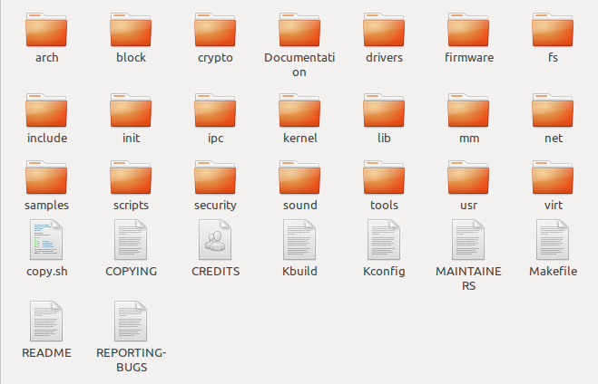

编译内核
========

下载野火官方提供的内核镜像
--------------------------

在编译内核前我们首先要下载到官方提供的内核镜像，目前野火官方镜像已经托管在github上，可以随时去下载，打开\ https://github.com/Embedfire/ebf_6ull_linux\ 网页，可以看到野火官方提供的内核镜像，并且携带了很详细的操作说明文档，这个仓库是来源于NXP官方提供的内核镜像\ http://git.freescale.com/git/cgit.cgi/imx/linux-imx.git/\ ，由\ ``imx_4.1.15_2.0.0_ga``\ 分支开发而来，主要是满足野火开发板的需求。

我们只需要野火官方提供的内核镜像即可，首先我们克隆一下这个内核镜像仓库，在克隆内核镜像的时候最好是在虚拟机中（或linux环境），而不是在Windows环境下，我们将使用\ ``git clone``\ 命令去克隆官方提供的内核镜像，这样子就能保留镜像中的所有git信息与标签，在开发过程中能方便切换到合适的分支进行开发，因为不同的分支内核镜像的源代码修改的地方是不一样的，可能会发生未知的问题，我们目前就使用\ ``master``\ 分支进行开发。

使用\ ``git clone``\ 命令克隆内核镜像，然后等待克隆完成即可：

.. code:: bash

    git clone https://github.com/Embedfire/ebf_6ull_linux.git

由于github网站是国外的，可能会非常慢，甚至出现下载失败现象，建议使用gitee中的仓库，我们已经将源码提交到gitee平台，直接使用\ ``git clone``\ 命令克隆内核镜像即可：

.. code:: bash

    git clone https://gitee.com/wildfireteam/ebf_6ull_linux.git

    Cloning into 'ebf_6ull_linux'...
    remote: Enumerating objects: 54412, done.
    remote: Counting objects: 100% (54412/54412), done.
    remote: Compressing objects: 100% (47905/47905), done.
    remote: Total 54412 (delta 5331), reused 54348 (delta 5281)
    Receiving objects: 100% (54412/54412), 148.94 MiB | 3.49 MiB/s, done.
    Resolving deltas: 100% (5331/5331), done.
    Checking out files: 100% (51413/51413), done.

内核源码目录
------------

在运行\ ``git clone``\ 命令命令后，大约等待一分钟，我们可以看到输出的信息，已然提示克隆完成，我们会发现克隆的目录下多出了一个文件夹\ ``ebf_6ull_linux``\ ，我们可以进入到\ ``ebf_6ull_linux``\ 目录下，可以使用git
log查看仓库的日志信息，看看更改了什么地方。在\ ``ebf_6ull_linux``\ 目录下看到当前目录下多了很多文件夹，它就是我们克隆的内核镜像，里面是官方提供的内核源码，我们可以进入imx-linux目录下中查看主要有哪些文件夹组成，具体见：

.. code:: bash

    ➜  ebf_6ull_linux git:(master) ls

    arch      CREDITS        fs       Kconfig      mm               REPORTING-BUGS  tools
    block     crypto         include  kernel       Module.symvers   samples         usr
    build.sh  Documentation  init     lib          net              scripts         virt
    COPYING   drivers        ipc      MAINTAINERS  OFFICIAL-README  security
    copy.sh   firmware       Kbuild   Makefile     README.md        sound

   building\_kernel001

从图中我们可以看到Linux内核源码目录下是有非常多的文件夹，且文件夹下也有非常多的文件，下面我们简单分析一下这些文件夹的主要作用。

-  arch：主要包含和硬件体系结构相关的代码，如arm、x86、MIPS，PPC，每种CPU平台占一个相应的目录，例如我们使用的imx系列CPU就在\ ``arch/arm/mach-imx``\ 目录下，Linux内核目前已经支持30种左右的CPU体系结构。arch中的目录下存放的是各个平台以及各个平台的芯片对Linux内核进程调度、
   内存管理、 中断等的支持，以及每个具体的SoC和电路板的板级支持代码。

-  block：在Linux中block表示块设备（以块（多个字节组成的整体，类似于扇区）为单位来整体访问），譬如说SD卡、Nand、硬盘等都是块设备，block目录下放的是一些Linux存储体系中关于块设备管理的代码。

-  crypto：这个文件夹下存放的是常用加密和散列算法（如md5、AES、 SHA等）
   ，还有一些压缩和CRC校验算法。

-  Documentation：内核各部分的文档描述。

-  drivers：设备驱动程序，里面列出了linux内核支持的所有硬件设备的驱动源代码，每个不同的驱动占用一个子目录，如char、
   block、 net、 mtd、 i2c等。

-  fs：fs就是file system，里面包含Linux所支持的各种文件系统，如EXT、
   FAT、 NTFS、 JFFS2等。

-  include：目录包括编译核心所需要的大部分头文件，例如与平台无关的头文件在\ ``include/linux``\ 子目录下，与cpu架构相关的头文件在include目录下对应的子目录中。

-  init：内核初始化代码，这个目录下的代码就是linux内核启动时初始化内核的代码。

-  ipc：ipc就是\ ``inter process commuication``\ ，进程间通信，该文件夹下都是linux进程间通信的代码。

-  kernel：kernel就是Linux内核，是Linux中最核心的部分，包括进程调度、定时器等，而和平台相关的一部分代码放在arch/\*/kernel目录下。

-  lib：lib是库的意思，lib目录下存放的都是一些公用的有用的库函数，注意这里的库函数和C语言的库函数不一样的，因为在内核编程中是不能用C语言标准库函数的，所以需要使用lib中的库函数，除此之外与处理器结构相关的库函数代码被放在\ ``arch/*/lib/``\ 目录下。

-  mm： 目录包含了所有独立于 cpu
   体系结构的内存管理代码，如页式存储管理内存的分配和释放等，而与具体硬件体系结构相关的内存管理代码位于\ ``arch/*/mm``\ 目录下，例如\ ``arch/arm/mm/fault.c``\ 。

-  net： 网络协议栈相关代码，net目录下实现各种常见的网络协议。

-  scripts：这个目录下全部是脚本文件，这些脚本文件不是linux内核工作时使用的，而是用了配置编译linux内核的。

-  security：内核安全模型相关的代码，例如最有名的SELINUX。

-  sound： ALSA、 OSS音频设备的驱动核心代码和常用设备驱动。

-  usr： 实现用于打包和压缩的cpio等。

提示：对于其他的未列出来的目录，暂时不用去理会。

编译内核
--------

简单了解内核源码的目录结构后，我们可以开始尝试编译内核，本小节主要是以编译我们配套的开发板源代码为主。

我们提供的源码包是经过修改的，首先进入\ ``ebf_6ull_linux/arch/arm/configs``\ 目录下，可以看到很多默认的deconfig文件，这些是linux源码中的配置文件，其中我们主要关注\ ``imx_v6_v7_defconfig、imx_v7_defconfig 、imx6_v7_ebf_defconfig``\ 这3个文件即可，\ ``imx_v6_v7_defconfig、imx_v7_defconfig``\ 这两个文件是nxp官方提供的默认配置文件，而\ ``imx6_v7_ebf_defconfig``\ 文件则是我们野火提供的配置文件，这些文件是与编译内核息息相关的，而不同的开发板这些配置是不一样的，前面两个是用于编译官方的imx6ull开发板，而后面两个则是根据我们的imx6ull开发板硬件而定制的配置。
由于整个内核镜像都已经打上我们的补丁，那么也无需再做过多的修改即可直接编译，我们可以通过git
log命令查看补丁信息：

.. code:: bash

    ➜  ebf_6ull_linux git:(master) ✗ git log

    commit fe1b9b8fe423aa41ff53757b94adddea8973662d (HEAD -> master, origin/master)
    Author: jiejie <1161959934@qq.com>
    Date:   Tue Jan 14 08:06:54 2020 +0000

        update config

    commit 3594c804dafc37dae86a89520273b87c35488ce9
    Author: jiejie <1161959934@qq.com>
    Date:   Tue Jan 14 07:33:57 2020 +0000

        update config

    commit 342f29e8f7813917c945c3fde1bf2767b61110f6
    Author: jiejie <1161959934@qq.com>
    Date:   Tue Jan 7 02:44:46 2020 +0000

        update README.md

    commit 7c24a3c05257373d30dd698398b9bb798e814cec
    Author: jiejie <1161959934@qq.com>
    Date:   Wed Nov 27 02:45:14 2019 +0000

        compatible with 5-inch and 4.3-inch LCD

    commit 1b9f4f2252477d8eb41eb3f53f0e2232de7af576
    Author: jiejie <1161959934@qq.com>
    Date:   Tue Nov 19 06:44:02 2019 +0000

        add 7' HDMI support

搭建编译环境
~~~~~~~~~~~~

开发环境：\ **ubuntu18.04**

**安装必要的库**

.. code:: bash

    sudo apt-get install lzop libncurses5-dev

**安装独立编译工具链**

1. 命令安装方式（推荐新手使用这种方法）：

arm-linux-gnueabihf-gcc：\ ``v7.4.0``

.. code:: bash

    sudo apt-get install gcc-arm-linux-gnueabihf

2. 安装包安装方式(推荐老手使用这种方法)

从百度云盘下载\ ``arm-linux-gnueabihf-gcc``\ 编译器的压缩包，版本是
``v4.9.3``

链接：\ https://github.com/Embedfire/products/wiki

在 **Linux系列产品**中找到的网盘链接，在\ ``i.MX6ULL系列\5-编译工具链\arm-gcc`` 目录下找到``arm-gcc.tar.gz``压缩包并且下载，然后解压到\ ``/opt/arm-gcc/``\ 目录下，如果没有创建即可，解压后就可以在\ ``/opt/arm-gcc/bin/``\ 目录下找到我们的编译器\ ``arm-linux-gnueabihf-gcc``\ ，它的版本是\ ``gcc version 4.9.3 20141031 (prerelease) (Linaro GCC 2014.11)``\ ，然后可以将编译器所在的路径添加到环境变量中，只修改当前用户的配置文件，通常是\ ``"~/.bashrc"``\ 或者\ ``"~/.bash_profile"``\ ，直接
vi 打开即可，在文件末尾增加编译器所在的路径：

.. code:: bash

    export PATH=$PATH:/opt/arm-gcc/bin/

立即使新的环境变量生效，不用重启电脑：

.. code:: bash

    ➜  ebf_6ull_linux git:(master) ✗ source ~/.bashrc

然后检查是否将路径加入到PATH：

.. code:: bash

    ➜  ebf_6ull_linux git:(master) ✗ echo $PATH

显示的内容中有\ ``/opt/arm-gcc/bin``\ ，说明已经将交叉编译器的路径加入PATH。至此，交叉编译环境安装完成。

测试是否安装成功

.. code:: bash

    ➜  ebf_6ull_linux git:(master) ✗ arm-linux-gnueabihf-gcc -v
    Using built-in specs.
    COLLECT_GCC=arm-linux-gnueabihf-gcc
    COLLECT_LTO_WRAPPER=/opt/arm-gcc/bin/../libexec/gcc/arm-linux-gnueabihf/4.9.3/lto-wrapper
    ···
    gcc version 4.9.3 20141031 (prerelease) (Linaro GCC 2014.11) 

上面的命令会显示arm-linux-gcc信息和版本，说明成功。

更多安装方法参考：\ https://blog.csdn.net/u013485792/article/details/50958253

    作者备注：为什么推荐更低版本的编译器呢？因为作者亲测新版本的编译器并不能完全兼容，在测试比如新版本编译的内核镜像无法识别到4G模块。但是在绝大部分情况下\ ``v7.4.0``\ 版本的编译器都是没有任何问题的！！！请放心使用！！！

编译前准备
~~~~~~~~~~

在开始编译内核前，可以把环境变量设置一下，以防编译时找不到环境变量：

.. code:: bash

    export PATH=/opt/arm-gcc/bin:$PATH 
    export ARCH=arm 
    export CROSS_COMPILE=arm-linux-gnueabihf- 

**清除编译信息**

.. code:: bash

    make ARCH=arm clean

设置配置选项，使用野火开发板配置
~~~~~~~~~~~~~~~~~~~~~~~~~~~~~~~~

首先进入imx-linux目录下，然后开始编译内核，运行\ ``make ARCH=arm imx6_v7_ebf_defconfig``\ 命令将imx6\_v7\_ebf\_defconfig配置文件的信息写入当前路径下的
``.config``\ 文件中，在linux中以\ ``"."``\ 开头的文件都是隐藏文件，我们可以使用ls
–la命令查看这些文件。

.. code:: bash

    make ARCH=arm imx6_v7_ebf_defconfig

    输出
      HOSTCC  scripts/basic/fixdep   
      HOSTCC  scripts/kconfig/conf.o   
      SHIPPED scripts/kconfig/zconf.tab.c   
      SHIPPED scripts/kconfig/zconf.lex.c   
      SHIPPED scripts/kconfig/zconf.hash.c   
      HOSTCC  scripts/kconfig/zconf.tab.o   
      HOSTLD  scripts/kconfig/conf 
      # 
      # configuration written to .config 
      #

Linux内核的配置系统由三个部分组成，分别是： 
-  Makefile：分布在 Linux内核源代码根目录及各层目录中，定义 Linux 内核的编译规则； 

-  配置文件：给用户提供配置选择的功能，如Kconfig文件定义了配置项，.config文件对配置项进行赋值；

-  配置工具：包括配置命令解释器（对配置脚本中使用的配置命令进行解释）和配置用户界面（linux提供基于字符界面、
基于Ncurses 图形界面以及基于 Xwindows 图形界面的用户配置界面，各自对应于make config、make menuconfig 和 make xconfig）。
读者如果想看我们提供的配置文件imx6\_v7\_ebf\_defconfig中修改了什么地方，可以通过makemenuconfig命令来查看我们的配置，
makemenuconfig是一个基于文本选择的配置界面，推荐在字符终端下使用，make menuconfig运行的时候会从当前目录下
导入 .config文件的配置（如果没有找到.config文件则会生成默认配置的 .config文件），
而这个配置则是我们运行make ARCH=arm imx6\_v7\_ebf\_defconfig命令生成的，这就直接可以看到我们在imx6\_v7\_ebf\_defconfig的配置选择，
可以通过键盘的"上"、"下"、"左"、"右"、"回车"、"空格"、"?"、"ESC"等按键进行选择配置，具体见：

.. figure:: media/building_kernel002.png
   :alt: building\_kernel002

   building\_kernel002
比如我们选择配置我们开发板的触摸屏驱动：\ ``Goodix I2C touchscreen``\ ，如果读者炸不到这个配置选项在哪里，可以利用\ ``make menuconfig``\ 中的搜索功能，在英文输入法状态下按下"/"则可以进行搜索，输入"Goodix"找到改配置选项的位置，具体见：

.. figure:: media/building_kernel003.png
   :alt: building\_kernel003

   building\_kernel003
从图中可以很明显看出\ ``Goodix I2C touchscreen``\ 配置选项位于\ ``-> Device Drivers``\ 选项下的\ ``-> Input device support``\ 下的\ ``-> Generic input layer (needed for keyboard, mouse, ...) (INPUT [=y])``\ 选项下的\ ``-> Touchscreens``\ 选项中，其实也可以按下\ ``"1"``\ 直接可以定位到对应的选项，然后选中以下内容即可，具体见图：

.. code:: bash

    [*]Goodix touchpanel GT9xx series 
    <*> Goodix GT9xx touch controller auto update support 
    <*> Goodix GT9xx Tools for debuging 
    <*>Goodix I2C touchscreen

.. figure:: media/building_kernel004.png
   :alt: building\_kernel004

   building\_kernel004
再举个例子，如果想要在我们的开发板上使用\ ``DHT11``\ 测量温湿度（单总线协议），那么需要在内核中配置支持单总线协议：\ ``Dallas's 1-wire support``\ ，我们也照葫芦画瓢，先搜索到这个配置在哪个位置（时候搜索不到就直接找即可），它位于\ ``->Device Drivers``
选项下的\ ``<*> Dallas's 1-wire suppor``\ 选项中，然后进入它的选项下进行选择即可，当配置完成后保存退出，就可以进行编译了，具体见:

.. figure:: media/building_kernel005.png
   :alt: building\_kernel005

   building\_kernel005
开始编译
~~~~~~~~

如果不需要修改配置，则可以直接编译，运行\ ``make ARCH=arm -j10 CROSS_COMPILE=arm-linux-gnueabihf-``\ 命令直接编译，\ ``-j10``\ 是代表使用10个线程进行编译，如果不选则默认使用一个线程编译，而线程的多少决定了编译的时间，根据自身情况决定即可，在运行这个命令后，可以看到中断输出一系列编译信息，而在编译的最后会告诉我们编译成功，镜像存在\ ``arch/arm/boot/``\ 目录下，具体见：（已删减绝大部分编译输出的信息）。

.. code:: bash

    make ARCH=arm -j10 CROSS_COMPILE=arm-linux-gnueabihf- 

    # 输出内容（已删减绝大部分编译输出的信息）
    ···
    OBJCOPY arch/arm/boot/zImage   
    Kernel: arch/arm/boot/zImage is ready
    ···

编译生成的镜像输出路径
~~~~~~~~~~~~~~~~~~~~~~

**内核镜像路径**

.. code:: bash

    ebf_6ull_linux/arch/arm/boot

**设备树输出路径**

.. code:: bash

    ebf_6ull_linux/arch/arm/boot/dts

因为这个\ ``make ARCH=arm -j10 CROSS_COMPILE=arm-linux-gnueabihf-``\ 命令编译的不仅仅是内核，还会编译设备树，设备树编译后产生的.dtb文件存在\ ``arch/arm/boot/dts/``\ 目录下，我们可以通过\ ``ls arch/arm/boot/dts/ | grep .dtb``\ 命令查看该目录下的所有设备树：

.. code:: bash

    ➜  ebf_6ull_linux git:(master) ✗ ls arch/arm/boot/dts/ | grep .dtb

    imx6ull-14x14-evk-btwifi.dtb
    imx6ull-14x14-evk.dtb
    imx6ull-14x14-evk-emmc-43.dtb
    imx6ull-14x14-evk-emmc-cam-dht11.dtb
    imx6ull-14x14-evk-emmc.dtb
    imx6ull-14x14-evk-emmc-hdmi.dtb
    imx6ull-14x14-evk-emmc-wifi.dtb
    imx6ull-14x14-evk-gpmi-weim-43.dtb
    imx6ull-14x14-evk-gpmi-weim-cam-dht11.dtb
    imx6ull-14x14-evk-gpmi-weim-hdmi.dtb
    imx6ull-14x14-evk-gpmi-weim-wifi.dtb

**拷贝zImage与dtb**

然后我们可以直接运行脚本\ ``copy.sh``\ 将内核镜像与设备树拷贝到\ ``image``\ 目录下

.. code:: bash

    ➜  ebf_6ull_linux git:(master) ✗ ./copy.sh

    all kernel and DTB are copied to /home/jiejie/ebf_6ull_linux/image/

只编译设备树
~~~~~~~~~~~~

当然，如果你不想编译内核的话，只想编译设备树，那么可以在\ ``make ARCH=arm -j10 CROSS_COMPILE=arm-linux-gnueabihf-``\ 命令后面添加
``dtbs`` 即可

.. code:: bash

    make ARCH=arm -j10 CROSS_COMPILE=arm-linux-gnueabihf- dtbs

编译的设备树：

-  imx6ull-14x14-evk.dts
-  imx6ull-14x14-evk-btwifi.dts
-  imx6ull-14x14-evk-emmc.dts
-  imx6ull-14x14-evk-gpmi-weim-43.dts
-  imx6ull-14x14-evk-emmc-43.dts
-  imx6ull-14x14-evk-gpmi-weim-hdmi.dts
-  imx6ull-14x14-evk-emmc-hdmi.dts
-  imx6ull-14x14-evk-gpmi-weim-wifi.dts
-  imx6ull-14x14-evk-emmc-wifi.dts
-  imx6ull-14x14-evk-gpmi-weim-cam-dht11.dts
-  imx6ull-14x14-evk-emmc-cam-dht11.dts

一键编译
~~~~~~~~

如果你什么都不想理会，那么这个一键编译内核与设备树就更适合你了，直接运行以下命令

::

    ./build.sh

或者...

::

    ./build.sh 5.0

生成的内核镜像与设备树均被拷贝到 ``image`` 目录下。
内核模块相关均被安装到 ``my_lib/lib/``
目录下的\ ``modules``\ 文件夹下，可以直接替换掉\ ``rootfs(根文件系统)``\ 中的\ ``/lib/modules/``\ 。

``build.sh``\ 脚本默认编译5.0寸屏幕的内核镜像，如果需要4.3寸屏幕的内核镜像，则可以使用以下命令去编译:

::

    ./build.sh 4.3

修改LOGO
--------

其实在野火开发板的固件中，uboot是没有logo的，因为将uboot的logo删掉了，因为在内核有logo，而uboot到内核的时间非常短（已经将uboot等待
3S
时间去掉了），所以直接使用内核的logo会更好，那么如果想要使用内核的logo，就得自己去修改内核的logo，下面就教大家如何去做。

准备一张图片
~~~~~~~~~~~~

我们可以随便准备一张图片，比如我们就选择ubuntu的logo吧，将它制作成适合显示屏大小的图片，比如5寸屏幕的分辨率是800\*480：

.. figure:: media/building_kernel006.png
   :alt: building\_kernel006

   building\_kernel006
然后将其保存为\ **256色（即8位色）的bpm格式的图片**\ ，可以在Windows下或者Linux虚拟机下编辑：

.. figure:: media/building_kernel007.png
   :alt: building\_kernel007

   building\_kernel007
转换为ppm格式的图片
~~~~~~~~~~~~~~~~~~~

然后在Linux下使用以下脚本将其转换为ppm格式的文件，为什么是ppm格式呢？因为这是编译Linux内核必要的文件格式，想要修改logo，就要这种格式的文件，它必须是\ **256色（即8位色）的bpm格式的图片**\ 转换而成的。

.. code:: bash

    #!/bin/bash
    if [ " $1" == " " ];
    then
        echo "usage:$0 bmp_file"
        exit 0
    fi

    if [ -f "$1" ]
    then
        echo $1
    else
        echo "no find file [$1]"
        exit 0
    fi

    name=${1%%.*}
    bmptopnm $1 > $name.pnm
    pnmquant 224 $name.pnm > $name.clut224.pnm
    pnmtoplainpnm $name.clut224.pnm > $name.ppm
    rm $name.pnm $name.clut224.pnm 

这是bmp文件转换ppm格式文件的脚本，可以将其写入一个叫\ ``bmp2ppm.sh``\ 脚本文件中，并且赋予其可执行的权限（使用
``chmod +x bmp2ppm.sh``
命令即可），它主要是使用linux系统中的工具转换，如果系统中没有相关工具，则根据提示使用\ ``apt install``\ 命令进行安装即可。

然后将准备好的bmp文件拷贝到制作ppm的工作目录下，使用\ ``bmp2ppm.sh``\ 脚本将其转化为ppm文件，具体操作如下：

.. code:: bash

    ➜  bmp2ppm git:(master) ✗ ls
    bmp2ppm.sh  README.md  ubuntu.bmp

    ➜  bmp2ppm git:(master) ✗ ./bmp2ppm.sh ubuntu.bmp 
    ubuntu.bmp
    bmptopnm: Windows BMP, 800x480x8
    bmptopnm: WRITING PPM IMAGE
    pnmcolormap: making histogram...
    pnmcolormap: 29 colors found
    pnmcolormap: Image already has few enough colors (<=224).  Keeping same colors.
    pnmremap: 29 colors found in colormap

    ➜  bmp2ppm git:(master) ✗ ls
    bmp2ppm.sh  README.md  ubuntu.bmp  ubuntu.ppm

替换原本的logo文件
~~~~~~~~~~~~~~~~~~

在转换完成后，当前目录将出现对应的ppm文件，我们将其拷贝到linux内核源码的\ ``ebf_6ull_linux/drivers/video/logo``\ 目录下，因为我们的logo是存放在此处的，野火提供的logo：

-  默认编译的logo：logo\_dec\_clut224.ppm
-  5寸触摸屏logo：logo\_dec\_clut224\_5.0.ppm
-  4.3寸触摸屏logo：logo\_dec\_clut224\_4.3.ppm

然后将其重命名为你想替换的logo即可，\ **注意**\ ，5寸触摸屏logo与4.3寸触摸屏logo是一键编译使用的，它在一键编译过程中会替换掉默认的logo，如果你只替换了默认编译的logo，但是使用了一键编译脚本，那么你替换的logo将被一键编译脚本修改，编译产生的内核将不会存在你的logo。

修改启动脚本
~~~~~~~~~~~~

替换完成后，重新编译内核，并且烧录到开发板上，不过此时会出现一个现象，logo以上而过，这是因为内核启动后，会执行文件系统的启动脚本，而此时文件系统的启动脚本中\ ``/etc/init.d/psplash.sh``\ 会去执行相应的应用程序\ ``/usr/bin/psplash``\ ，这就是绘制开机的进度条与背景，那么你的开机logo将被刷掉，而只要不让这个启动脚本运行这个\ ``/usr/bin/psplash``\ 应用程序就可以解决问题了，那么我们在开发板中修改启动脚本\ ``/etc/init.d/psplash.sh``\ ：

.. code:: bash

    #!/bin/sh 
    ### BEGIN INIT INFO
    # Provides:             psplash
    # Required-Start:
    # Required-Stop:
    # Default-Start:        S
    # Default-Stop:
    ### END INIT INFO

    read CMDLINE < /proc/cmdline
    for x in $CMDLINE; do
            case $x in
            psplash=false)
                    echo "Boot splashscreen disabled" 
                    exit 0;
                    ;;
            esac
    done

    export TMPDIR=/mnt/.psplash
    mount tmpfs -t tmpfs $TMPDIR -o,size=40k

    rotation=0
    if [ -e /etc/rotation ]; then
            read rotation < /etc/rotation
    fi

    /usr/bin/psplash --angle $rotation &

修改的内容是最后一行\ ``/usr/bin/psplash --angle $rotation &``\ ，将其修改为：

.. code:: bash

    /usr/bin/psplash stop

或者将其屏蔽掉：

.. code:: bash

    # /usr/bin/psplash --angle $rotation &

然后重启开发板，就可以看见你的logo了。

烧录自己编译的内核到开发板
--------------------------

那么经过编译得到的\ ``zImage``\ 与设备树都可以烧录到我们的开发板中，比如我们选择\ ``zImage``\ 与\ ``imx6ull-14x14-evk-emmc-cam-dht11.dts``\ 文件替换掉前面小节中的烧录镜像与设备树，完成烧录后即可看到内核启动完成。

当内核启动后，我们登陆root用户，就可以通过\ ``cat /proc/version``\ 命令查看内核版本：

.. code:: bash

    imx6ull14x14evk login: root 
    root@imx6ull14x14evk:~# cat /proc/version 
    Linux version 4.1.15-2.1.0-00162-gd815328d0504-dirty (embedfire @embedfire_dev) (gcc version 7.4.0 (Ubuntu/Linaro 7.4.0-1ubuntu1~18.04.1) ) #2 SMP PREEMPT Tue Aug 27 07:46:06 UTC 2019

内核配置选项（部分）
--------------------

运行 ``make ARCH=arm menuconfig``
命令打开配置界面，根据自身需求配置即可！

**触摸屏驱动：**

.. code:: bash

     Prompt: Goodix I2C touchscreen   
      Location:            
       -> Device Drivers         
          -> Input device support  
           -> Generic input layer (needed for keyboard, mouse, ...) (INPUT [=y]) 
     (1)       -> Touchscreens (INPUT_TOUCHSCREEN [=y])  
     #这个也要使能
        [*]   Goodix touchpanel GT9xx series 
        <*>     Goodix GT9xx touch controller auto update support  
        <*>     Goodix GT9xx Tools for debuging     

**单总线驱动：**

.. code:: bash

     Prompt: Dallas's 1-wire support     
     Location:                         
      (1) -> Device Drivers          
      [*]   Userspace communication over connector (NEW)    

**添加MPU6050的支持：**

.. code:: bash

    Prompt: Invensense MPU6050 devices      
    Location:  
      -> Device Drivers               
        -> Industrial I/O support (IIO [=y])               
    (1)     -> Inertial measurement units   
              <*> Invensense MPU6050 devices   

**WIFI蓝牙**

.. code:: bash

    Location:  
      -> Device Drivers               
        -> Network device support                                         
           -> Wireless LAN
              ->

     <*>   Broadcom FullMAC wireless cards support                        
            (/lib/firmware/bcm/AP6236/Wi-Fi/fw_bcm43436b0.bin) Firmware path     
             (/lib/firmware/bcm/AP6236/Wi-Fi/nvram_ap6236.txt) NVRAM path    

    #HCI串口配置也要选择
        -> Device Drivers               
        -> Network device support                                         
           -> Wireless LAN
              ->Bluetooth subsystem support   
                  ->Bluetooth device drivers   
                      <*> HCI USB driver     
                      [*]   Broadcom protocol support  

      -> Networking support (NET [=y])     
        -> Bluetooth subsystem support (BT [=y]) 
          -> Bluetooth device drivers    
            <*> HCI USB driver    
            [*]   Broadcom protocol support  

**PPP点对点拨号：**

所有PPP相关的都选中

.. code:: bash

     Prompt: PPP (point-to-point protocol) support              
      Location:          
      -> Device Drivers 
        (1)   -> Network device support (NETDEVICES [=y])       

**蓝牙和HCI子系统**

.. code:: bash

        -> Networking support (NET [=y])              
         -> Bluetooth subsystem support (BT [=y])   
          (1)     -> Bluetooth device drivers   
      --- RF switch subsystem support                                         
              [*]   RF switch input support  
              <*>   Generic rfkill regulator driver
              <*>   GPIO RFKILL driver            

