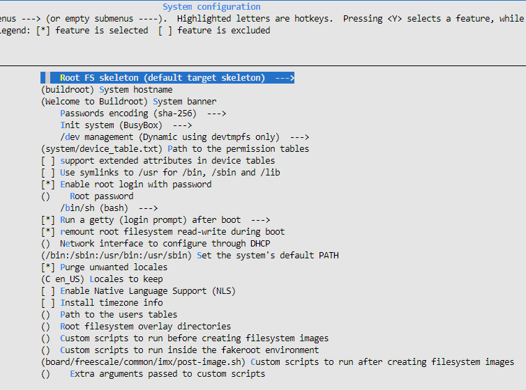
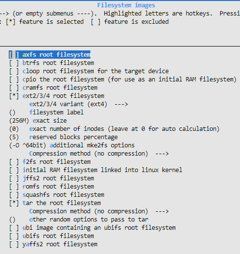
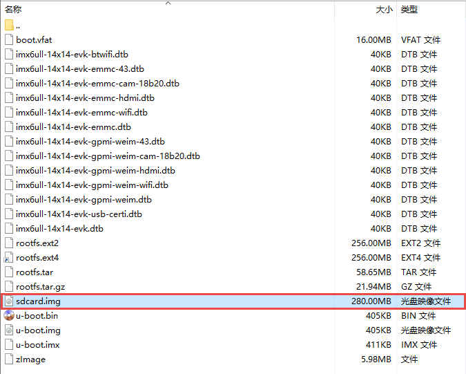
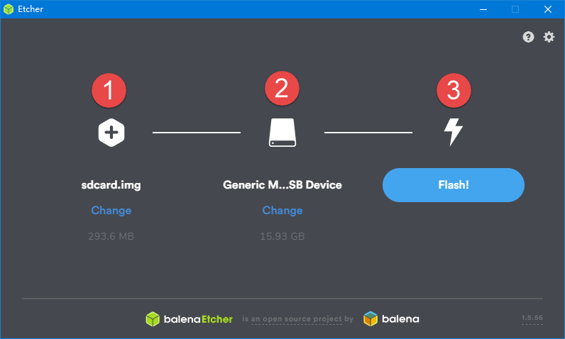

.. vim: syntax=rst

制作根文件系统
-------

本章节内容处于开发笔记状态，还待整理至最终版的教程。

本章节内容处于开发笔记状态，还待整理至最终版的教程。

文件系统知识回顾
~~~~~~~~

在介绍制作文件系统之前，我们先来看一下Linux是如何存储数据的。其实在第18章 也介绍了文件系统相关的知识，如果还未理解的读者可以回过头来去看一下文件系统的知识。一般情况下，字符设备以串行方式存储和获取数据，串口是最典型的字符设备；而块设备会一次存取或者获取大小相同的一块区域内的数据。例如，一个硬
盘控制器可以向物理存储介质上指定可寻址地址，一次传送或接收512字节的数据，文件系统正是建立在块设备之上的。

文件系统是存在于一个物理设备的逻辑分区之上的。分区就是对一个物理介质（磁盘、闪存）的逻辑划分，该物理介质上的数据在给定分区类型上按照特定的规则进行组织，物理设备可以只有一个独立分区包含所有可用空间，也可以被划分为多个分区以满足特定需要，就好比我们电脑的磁盘，划分为多个分区以用于不同的需求。

简单了解了文件系统的概念，那么我们就动手制作一个文件系统。

讲解buildroot构建根文件系统的原理
~~~~~~~~~~~~~~~~~~~~~

文件系统通常要包含很多第三方软件，比如busybox，tslib，qt，vim，交叉编译工具等，为了避免繁杂的移植工作，buildroot应运而生。用户可以直接通过make
menuconfig配置自己需要的功能，把不需要的功能去掉，再执行make指令编译，buildroot就会自动从指定的服务器上下载源码包，自动编译，自动搭建成我们所需要的嵌入式根文件系统。

buildroot的文件系统（rootfs）构建流程有一个框架，有些部分是buildroot本身就集成的，但还是有些细节需要自己来实现，我们需要按照格式写脚本，提供必要的构建细节，并且配置整个系统，总之，rootfs是Buildroot中最为复杂的部分。

一般来说，buildroot构建文件系统的运作过程如下：

1. buildroot将system/skeleton/目录下的内容拷贝到output/target目录下下作为rootfs的模板。

2. 将output/staging/目录下的工具链中动态库拷贝到output/target/对应的目录下。

3. 分别编译每一个应用的package，并将生成的动态库和bin文件install到output/target/对应的目录下。

4. 将package/initscripts/目录下的系统启动脚本install到output/target/对应的目录下。

5. 构建fakeroot环境，在fakeroot环境下修改output/target/中对应的目录文件权限，制作dev节点，并根据用户的配置制作出rootfs 镜像。

fakeroot是一个主机上使用的软件包，它会被buildroot下载编译，用于为构建rootfs提供一个虚拟的root权限环境，只有在root权限下，才能把output/target/中的目录和文件变成root用户，并创建dev节点。有了fakeroot环境，系统构建者无需获取主机的root权限，
也能在fakeroot下把文件改为root用户，并制作root方式。

讲解uClibc与glibc的差异
~~~~~~~~~~~~~~~~~

glibc和libc都是Linux下的C函数库，libc是Linux下的ANSI C的函数库；glibc是Linux下的GUN C的函数库；GNU C是一种ANSI C的扩展实现。ANSI
C是基本的C语言函数库，包含了C语言最基本的库函数。在写程序时，需要用到很多c语言的库函数，这些所有的库函数整合起来，就是对应的C语言（标准）函数库。

目前在普通GNU/Linux系统中所用的C语言标准库，叫做glibc。它的功能很全，函数很多，但是就是因为代码太多，编译出来的函数库的大小也很大，占用的资源也很多，可以简单地认为glibc就是为了实现完整功能设计的。

由于在嵌入式系统中，也需要C语言写代码实现特定功能，因此需要用到C语言函数库，但是由于嵌入式系统中，一般资源比较有限，所以不适合直接使用太占用资源的glibc。uClibc
是一个面向嵌入式Linux系统的小型的C标准库，最初uClibc是为了支持uClinux而开发，这是一个不需要内存管理单元（MMU）的Linux版本。uClibc比一般用于Linux发行版的C库GNU C Library (glibc)要小得多，
因此uClibc专注于嵌入式Linux，除此之外uClibc比glibc更可配置，这意味着开发人员可以根据功能与空间需求进行裁剪。

简单总结以下几点：

1. uClibc比glibc占用的资源小，虽然uClibc和glibc在已有的接口上是兼容的，而且采用uClibc编译应用程序比采用glibc编译应用程序要更方便，但是uClibc并没有包括glibc中的所有接口实现，因此有些应用可能在uClibc中不能编译。

2. uClibc在可配置性上比glibc要好。

提示：关于uClibc与glibc更多的差异比较信息请看\ http://www.etalabs.net/compare_libcs.html\ 。

使用buildroot制作自己需要的文件系统
~~~~~~~~~~~~~~~~~~~~~~

关于buildroot的简单实用也在第32章 讲解过了，此处就讲解一下关于文件系统的内容即可。（注意：必须先按照第32章 的内容配置好内核及uboot的编译内容，否则无法从SD卡启动系统）。

首先运行以下命令进入配置选项：

命令

make menuconfig

找到System configuration(系统配置)选项，进入该选项中，如图 33‑1所示。

|buildi002|

图 33‑1 System configuration(系统配置)

我们可以简单介绍一下这个选项的中的部分参数及其意义（ []内容为设置的值）：

-  Root FS skeleton (default target skeleton) ： 根文件系统框架 [默认目标框架]

-  (buildroot) System hostname ：系统主机名字(自取任意) [buildroot]

-  (Welcome to ixm6ull Buildroot!) System banner：系统开机提示 [Welcome to ixm6ull Buildroot!]

-  Passwords encoding (sha-256)：密码编码 [sha-256格式编码]

-  Init system (busybox) --->：初始化系统方案 [busybox]

-  /dev management (Dynamic using devtmpfs only) ：dev管理方案 [Dynamic using devtmpfs only]

-  (system/device_table.txt) Path to the permission tables ：权限表路径

-  [ ] support extended attributes in device tables：支持设备表中的扩展属性

-  [ ] Use symlinks to /usr for /bin, /sbin and /lib：是否将/bin,/sbin,/lib链接到/usr

-  [*] Enable root login with password：使能root登陆密码

-  () Root password：设置root密码

-  /bin/sh (bash) ：选择shell类型 [bash]

-  [*] Run a getty (login prompt) after boot：启动后运行getty(登录提示)

-  [*] remount root filesystem read-write during boot ：在引导期间安装根文件系统支持读和写

-  (eth0) Network interface to configure through DHCP：设置DHCP配置的网络接口 [eth0]

-  (/bin:/sbin:/usr/bin:/usr/sbin) Set the system's default PATH：设置系统的默认路径

-  [*] Purge unwanted locales：清除不需要的区域设置

-  (C en_US) Locales to keep：要保留的语言环境

-  () Generate locale data：生成区域设置数据

-  [ ] Enable Native Language Support (NLS) ：启用本地语言支持（NLS）

-  -*- Install timezone info ：安装时区信息

-  (default) timezone list：时区清单 [典型]

-  (Etc/UTC) default local time ：用户表的路径

-  () Path to the users tables

-  () Root filesystem overlay directories：根文件系统覆盖目录

-  () Custom scripts to run before creating filesystem images：在创建文件系统映像之前运行的自定义脚本

-  () Custom scripts to run inside the fakeroot environment：自定义脚本在fakeroot(模拟root权限)环境中运行

-  (board/……) Custom scripts to run after creating filesystem images ：创建文件系统映像后运行的自定义脚本

-  () Extra arguments passed to custom scripts：传递给自定义脚本的额外参数

在这里就重点提一下几点配置：

1. Root FS skeleton：我们建议选择默认的根文件系统框架，因为默认的框架是非常小的，可以适应绝大部分的场合，当然，占用资源小也代表功能仅有一点点，读者可以自己往文件系统添加需要的功能，这是可以的。除此之外读者也可以选择自己的根文件系统框架（custom target skeleton）。

2. Init system：初始化系统方案，目前buildroot中提供2种方案，一种是BusyBox：系统的init程序将在启动时读取/etc/inittab文件，以了解该做什么，默认inittab存储在./package/busybox/inittab中；inittab除了安装几个重要的文件系统之外
   ，还要启动/etc/init.d/rcS中的shell脚本，并启动一个getty程序(提供一个登录提示)。另一种是systemV，使用传统sysvinit程序，之前大多数台式机Linux发行版都使用该方案，现在有些变为了Upstart或Systemd，在构建文件系统的时候会在/ect目录下会生成in
   it.d、rc0.d、rc1.d、rc2.d、rc3.d、rc4.d、rc5.d、rc6.d、rc.loacl等目录和脚本文件，init.d目录下包含的是真正的脚本。

3. /dev management ：/dev设备文件的管理方式，可选选项有四个：

Static using device table: 使用静态的设备表，/dev将根据system/device_table \_dev.txt的内容创建设备，进入系统添加或删除设备时，无法自动更新；

Dynamic using devtmpfs only:在系统启动过程中，会动态生成/dev文件，进入系统添加或删除设备时，无法自动更新；

Dynamic using devtmpfs + mdev:在前面devtmpfs的基础上加入mdev用户空间实用程序，进入系统添加或删除设备时，可以自动更新，自动创建规则在/etc/mdev.conf;

Dynamic using devtmpfs + eudev:在前面devtmpfs的基础上加入eudev用户空间守护程序，eudev是udev的独立版本，是Systemd的一部分，提供更多的功能也更占用资源；

4. /bin/sh (bash)：选择shell类型，一般选择bash即可，用户的体验会很好。除了bash外，还有很多shell工具，比如这里可选busybox自带的shell、小巧但功能很少的dash、高效紧凑的mksh、功能强大体积也稍大的zsh。

5. Root filesystem overlay directories：根文件覆盖目录，如果你想将某些文件添加到文件系统中，那么可以按照根文件的目录框架进行添加到对应的路径中，在文件系统构建的时候，会将对应的文件添加到文件系统中，如果出现相同的文件则覆盖。

我们还需要配置一下Filesystem images(文件系统)选项，具体见图 33‑2 。

|buildi003|

图 33‑2 Filesystem images(文件系统)

这些配置的含义如下：

-  [ ] axfs root filesystem：XFS格式根文件系统

-  [ ] btrfs root filesystem ：btrfs格式根文件系统

-  [ ] cloop root filesystem for the target device：clop方式压缩根文件系统

-  [ ] cpio the root filesystem (for use as an initial RAM filesystem) ：cpio方式压缩根文件系统(用作初始RAM文件系统)

-  [ ] cramfs root filesystem：cramf格式根文件系统

-  [*] ext2/3/4 root filesystem ：ext2/3/4格式根文件系统

-  ext2/3/4 variant (ext4) ：ext4格式根文件系统

-  () filesystem label ：文件系统标签

-  (200M) exact size ：根文件系统空间大小[200M]

-  (0) exact number of inodes (leave at 0 for auto calculation) ：确切的inode数(从0开始自动计算)

-  (5) reserved blocks percentage：保留块百分比 (保留的供root使用,默认5%)

-  (-O ^64bit) additional mke2fs options ：额外的mke2fs选项 [禁用64位文件系统]

-  Compression method (no compression) ：压缩方式 [无压缩]

-  [ ] f2fs root filesystem ：f2fs格式根文件系统

-  [ ] initial RAM filesystem linked into linux kernel：初始RAM文件系统链接到Linux内核

-  [ ] jffs2 root filesystem：jffs2格式根文件系统

-  [ ] romfs root filesystem：romfs格式根文件系统

-  [ ] squashfs root filesystem ：squashfs格式根文件系统

-  [*] tar the root filesystem：tar压缩格式根文件系统

-  Compression method (no compression) ：压缩方式 [无压缩]

-  () other random options to pass to tar：传递给tar的其他选项

-  [ ] ubi image containing an ubifs root filesystem：ubifs格式根文件系统包含ubi镜像

-  [ ] ubifs root filesystem ：ubifs格式根文件系统

-  [ ] yaffs2 root filesystem：yaffs2格式根文件系统

我们就简单设置一下文件系统的大小（256M），以及根文件系统的格式（tar压缩格式）即可。

当配置完毕后，我们可以选择对应的软件包添加到我们的系统中，比如Python3等，这里就不再重复赘述。然后使用make命令进行编译，就会生成对应的文件系统了，生成的镜像文件在output/images/目录下。

命令

make

烧录自己制作的根文件系统
~~~~~~~~~~~~

将生成的文件系统烧录到我们的开发板上，我们可以直接通过制作SD卡镜像的方式将文件系统烧录到SD卡，然后让开发板从SD卡启动。

首先得到SD卡的文件系统镜像，如图 33‑3所示。

|buildi004|

图 33‑3 SD卡镜像

然后通过SD卡镜像制作软件Etcher将该镜像烧写到SD卡中，如图 33‑4所示，Etcher软件可以从Etcher官网下载：\ https://www.balena.io/etcher/\ 。该软件的使用方式非常简单，此处就不做讲解。

|buildi005|

图 33‑4 SD卡镜像制作软件Etcher

当制作成功后，将SD卡插入开发板中，并且将拨码开关的2/5/8打到ON档，然后给开发板上电就可以看到开发板正常启动。

给开发板移植debian发行版
---------------

制作ubuntu core版本镜像
-----------------

