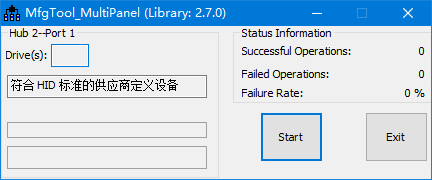
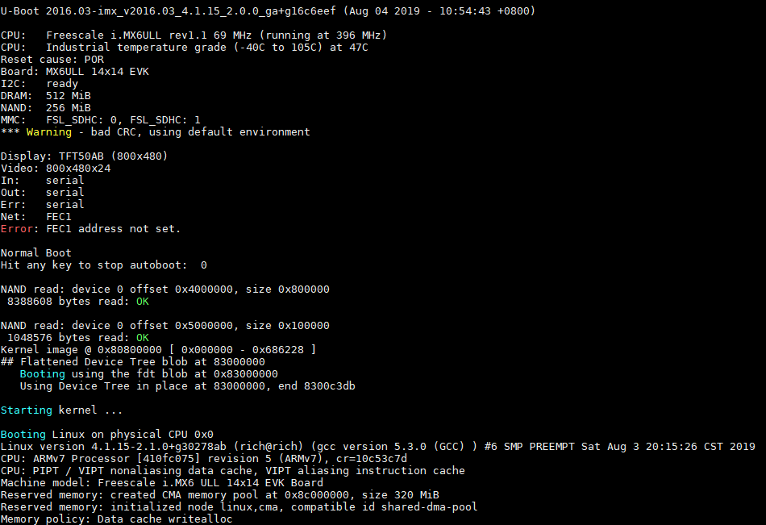
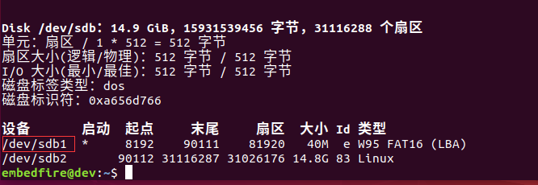

.. vim: syntax=rst

烧录NXP官方固件
-----------------

上一个章节介绍了如何编译NXP官方的uboot、内核、设备树以及使用buildroot编译根文件系统。
接下来介绍烧录这些系统组件到开发板的一些常用工具和方法步骤。

MFGtool工具
===================

MFGTool工具是NXP官方推荐的一个使用USB OTG来升级镜像的软
件工具，它是NXP针对i.MX系列处理器专门使用的烧
录工具，可以用来升级linux，单独烧录某一系统分区，独立
地烧录spi flash、 nor flash、sd card、nand
flash，emmc等，只需简单的配置，就可以使用该工具将编译好
的文件系统和镜像文件烧录到开发板上，使用起来非常方便。而
且MFGtool工具作为一个可量产性的工具，它支持多通道的烧录，在实
际量产中，可以直接使用MFGtool工具同时将文件系统与镜像文件烧录
到多个开发板上。

MFGtool工具目录主要有以下内容，具体见下图。

.. image:: media/mfgtoo002.png
   :align: center
   :alt: 未找到图片2|

该目录其实是已省略很多内容的，其中主要的文件夹是Profile，里面存放着的
是镜像文件，这里面镜像文件分为两种：第一种是作为媒介用途的
镜像，包括uboot、dtb与uImage；第二种是真正烧录到emmc、sdcard或者nand
flash的镜像文件。之所以存在这两种镜像，是因为MFGTools的烧录
原理是先烧录媒介镜像到ram里面，然后启动，再通过这个启动了的媒介镜像
把目标镜像烧录到emmc、sdcard或者nand flash里面。

除此之外还有配置文件也是非常重要的，如cfg.ini、UICfg.ini以
及ucl2.xml（该文
件位于Profiles\Linux\OS Firmware目录下，此处就不再截图说明）。

MfgTool2.exe则是MFGtool工具的可执行程序文件，在Windows系统下可
以双击运行，在运行后就可以进行烧录操作（前提是将配置文件配置完成）。

Document文件夹中存放了与该工具相关的文档。

Driver目录为Windows 32位和64位操作系统的驱动，驱动一般
都不会出现问题，也就无需理会。

More_scripts目录主要存放一些脚本文件，如果只是单纯使用MFGtool工具
也无需修这些脚本文件，此处暂时无需理会。

对于MFGtool工具目录下的其他文件以及文件夹，就暂时无需理会。

MFGtool工具的工作原理
~~~~~~~~~~~~~~

简单来说MFGtool工具的烧录步骤分为两个阶段：BurnStarp和Updater。第一阶段是
烧录前的准备工作，配置设备USB的vid和pid，来选择烧录的设备。第二阶段是MFGtools开
始烧录到结束烧录的过程，这个阶段的烧录过程是严格根据ucl2.xml文件来处理的，实际上是将bootload
er加载到ram，然后在运行时将编译好的文件系统和镜像文件烧录到开发板上，烧录的
位置由用户指定，可以是sd card、nand flash，emmc等。

使用mfg工具直接烧录所有内容
~~~~~~~~~~~~~~~

UICfg.ini文件
^^^^^^^^^^^

UICfg.ini文件是用来配置同时烧录多少个开发板，即配置其多通道的烧录。我们此处并不量产，默认配置为1，具体见

.. code-block:: c
   :caption: UICfg.ini文件内容
   :linenos:

   [UICfg]
   PortMgrDlg=1

cfg.ini文件
^^^^^^^^^

cfg.ini文件主要是用来配置目标芯片类型和板子信息及存储器的方式等内容的，其主要文件内容
包括四部分内容，分别是profiles、platform、list、variable。

profiles
''''''''

.. code-block:: sh
   :linenos:

   [profiles]
   chip = Linux

表示要使用Profiles目录下哪个文件夹的内容进行烧录。

如以上配置使用"/profiles/Linux/OS Firmware/ucl2.xml"目录
下的ucl2.xml配置烧录。

platform
''''''''

.. code-block:: sh
   :linenos:

   [platform]
   board = embedfire_board

开发板名字，目前没有作用，可以忽略

list
''''

.. code-block:: sh
   :linenos:

   [list]
   name = NAND Flash

表示使用"/profiles/CHIP_PROFILE/OS Firmware/ucl2.xml"文件中
的哪个list配置进行烧录，如将name 设置为 NAND Flash，则使用 ucl2.xml文
件中NAND
Flash一栏的配置进行烧录（ucl2.xml文件内容在后续讲解，此处只
简单列出部分配置）。

.. code-block:: sh
   :linenos:

   <LIST name="SDCard"
   ….
   <LIST name="eMMC"
   ….
   <LIST name="NAND Flash"
   ….

variable
''''''''

variable中是一些环境变量，在list列表配置中会引用的环境
变量，如initramfs=fsl-image-mfgtool-initramfs-imx_mfgtools.cpio.gz.u-boot，在"/profiles/CHIP_PROFILE/OS
Firmware/ucl2.xml"文件中会被<CMD state="BootStrap" type="load" file="firmware/%initramfs%"
address="0x83800000"…引用，其引用的方式为"%...%"，在两
个百分号（%）之间，通过变量initramfs进行传递。

.. code-block:: sh
   :linenos:

   [variable]
   board = sabresd
   mmc = 1
   sxuboot=sabresd
   sxdtb=sdb
   7duboot=sabresd
   7ddtb=sdb
   6uluboot=14x14evk
   6uldtb=14x14-evk
   ldo=
   plus=
   lite=l
   initramfs=fsl-image-mfgtool-initramfs-imx_mfgtools.cpio.gz.u-boot
   nand=nand
   nanddtb=gpmi-weim
   part_uboot=0
   part_kernel=1
   part_dtb=2
   part_rootfs=3

ucl2.xml文件
^^^^^^^^^^

首先我们看一下ucl2.xml文件中的文件内容（已删减）：

.. code-block:: sh
   :linenos:

   <UCL>
   
   <CFG>
   
   <STATE name="BootStrap" dev="MX6ULL" vid="15A2" pid="0080"/>
   
   <STATE name="Updater" dev="MSC" vid="066F" pid="37FF"/>
   
   </CFG>
   
   <LIST name="NAND Flash" desc="Choose NAND as media">
   
   <CMD state="BootStrap" type="load" file="firmware/%initramfs%" address="0x83800000"loadSection="OTH" setSection="OTH" asFlashHeader="FALSE"
   ifdev="MX6SL MX6SX MX7D MX6UL MX6ULL">Loading Initramfs.</CMD>
   
   <CMD state="BootStrap" type="jump" > Jumping to OS image.
   </CMD>
   
   <CMD state="Updater" type="push" body="send" file="files1/zImage"> Sending kernel zImage</CMD>
   
   <CMD state="Updater" type="push" body="$ ubiformat /dev/mtd%part_rootfs%"/>
   
   <CMD state="Updater" type="push" body="$ ubimkvol /dev/ubi0 -Nrootfs -m"/>
   
   <CMD state="Updater" type="push" body="$ mkdir -p /mnt/mtd%part_rootfs%"/>
   
   <CMD state="Updater" type="push" body="frf">Finishing rootfs write</CMD>
   
   <CMD state="Updater" type="push" body="$ echo Update Complete!">Done</CMD>
   
   </LIST>
   
   </UCL>

整个文件由三部分组成，首先看最外层标签<UCL> <UCL/>，它表示更新
命令列表（Update Command List，UCL），会被MFGtool工具中的脚本解析，所有的配置都包含在该标签之下。

在文件的开始会有 <CFG> </CFG>标签，它是MFGtool工具的一些全局
配置，如在第一阶段（BootStrap）设备枚举，dev的值可以
为MX6SL、MX6D、MX6Q、MX6SX、MX6UL、MX6ULL、MX7D其中的一个或
多个（因为MFGtool工具可以同时烧录多个开发板），如果USB
的vid为15A2，pid为0080，那么MFGtool工具会将dev识别为MX6ULL，这USB中
的vid与pid是由芯片本身决定的，当dev为MX6ULL时，在后续的烧录任务中会通过ifdev
MX6ULL进行选择执行哪些语句，然后将name设置为BootStrap，标识当前处于第
一阶段，不同的阶段执行的处理是不一样的。这个阶段简单来说就是将开发板的USB OTG接口
连接电脑，并且被MFGtool工具识别，才能有接下来的烧录操作。

如果USB中的vid为066F，pid为37FF，则表示进入第二阶段，将dev标识为MSG，而name则被设置为Updater。

简单来说，烧录分为两个阶段，BurnStarp和Updater，通过全局配置设备的vid和pid，来选择操作的设备（开发板）。

接下来，可以看到该文件内有多个< LIST > </LIST>标签，这就是前面说的
列表配置，list后面有name、desc等参数，name则表示选择cfg.ini文件中
的list内容中的配置，可以为SDCard、eMMC、NAND
Flash等。而desc参数用来说明目的，选择烧录
的位置，如Choose SD Cardas media、Choose eMMC as media、Choose NAND as media等。

在< LIST > </LIST>标签下有多个<CMD> </CMD>标签，这是命令标签，在不同的
阶段命令是不一样的，MFGtool工具的命令分为主机特定命令（Host Specific Commands）与固
件特定命令（Firmware Specific
Commands），其中主机特定命令是由MFGtool工具解析和执行，而固件特定命令由
目标设备上的固件运行解析和执行。

命令标签下有多个熟悉，如state用于表示该命令在哪个阶段被执行，type表示执行
命令的类型，body表示命令的参数，flie则是其他参数，如需要烧录哪个文件，最后
的Loading Kernel、Loading U-boot则是命令描述。

主机特定命令（Host Specific Commands）的命令类型有多种，其他参数也有多种，具体见

下表（空余处表示无参数）。

表   主机特定命令说明

======== ======== ============== =================================================================================================
命令类型 命令参数 其他参数       说明
======== ======== ============== =================================================================================================
load              file           烧录的镜像文件的路径和文件名
\                 Address        镜像存放的RAM地址
\                 loadSection    ROM代码使用的参数，应设置为"OTH"
\                 setSection     设置为OTH，如果还有其他镜像，设置为APP
\                 HasFlashHeader 镜像如果包含flash header，设为TRUE，否则设置为FALSE
\                 CodeOffset     第一次执行的指令的地址偏移量。注意：该命令仅适用于除i.MX50 HID模式设备之外的Bulk-IO模式i.MX设备。
jump                             通知ROM代码跳转到RAM映像运行
boot     保留     flie           加载映像到RAM
\                 if             执行判断
======== ======== ============== =================================================================================================

固件特定命令（Firmware Specific Commands）的命令类型有多种，其他参数也有多种，具体见

（固件特定命令已删减，且空余处表示无参数）。如果命令被命名为"push"即type="push"，这意味着
命令由目标设备而不是主机解析和执行，主机唯一要做的就是将命令发送到目标设备，通过body进行发
送命令。（固件特定命令已删减，且空余处表示无参数）。如果命令被命名为"push"即type="push"，这意
味着命令由目标设备而不是主机解析和执行，主机唯一要做的就是将命令发送到目标设备，通过body进行发送命令。

表  固件特定命令说明

======== ======= ===========================================================================
命令     参数    说明
======== ======= ===========================================================================
?                请求以XML格式发送设备标识信息
!        integer 根据参数进行重启操作
$        string  执行shell命令，这是最常用的命令类型
flush            等待所有数据传输完成并处理
ffs              对SD卡进行分区并将引导流闪存到它
read     string  读取参数指定的文件并将其发送给主机。如果没有这样的文件，将返回相应的状态
send             从主机接收文件
selftest         进行自我诊断， 返回通过或适当状态。在当前版本中未实现
save     string  将命令"send"接收的文件保存到指定为参数的文件中。
pipe     string  执行shell命令并从管道的输入端读取数据。 MFGtool工具会将文件发送到管道输出端
wff              准备将固件写入flash
wfs              准备将固件写入SD Card
ffs              将固件写入SD Card
======== ======= ===========================================================================

MFGtool工具的烧录文件
^^^^^^^^^^^^^^

MFGtool烧录分为两个阶段，第一部分就是将firmware文件夹
下的Uboot、Kernel、device tree、Initramfs加载到内存中，然后在第二阶段，将你要烧录的文件夹下的Uboot、Kernel、device tree、rootfs写入NAND Flash、SD
Card或者emmc，然后完成烧录。

野火开发板第1阶段烧录的文件（以烧录到nand为例）：

.. code-block:: sh
   :linenos:

   Uboot：u-boot-imx6ull14x14evk_nand.imx
   Kernel：zImage
   device tree：zImage-imx6ull-14x14-evk-gpmi-weim.dtb
   Initramfs：fsl-image-mfgtool-initramfs-imx_mfgtools.cpio.gz.u-boot

野火开发板第2阶段烧录的文件以烧录到nand为例）：

.. code-block:: sh
   :linenos:

   Uboot：u-boot-emmc-2016.03-r0.imx
   Kernel：zImage
   device tree：zImage-imx6ull-14x14-evk-emmc-50-70-dht11-leds.dtb
   rootfs：my_qt_core_fs.tar.bz2

烧录测试
^^^^

本次使用野火imx6ull开发板进行烧录测试，固件使用我们配套的固件即可，首先
将表 11‑1中开发板启动方式的MODE0配置为1，MODE1配置为0，将开发板的USB OTG与
电脑相接；然后双击打开MfgTool2.exe烧录工具，如果出现"符合 HID
标准的供应商定义设备"则表示识别成功，而如果出现"No Device Connected"则表
示未识别成功，识别成功时其界面如下图所示。

最后点击"Start"按钮开始烧录到开发板上，而烧录的位置由cfg.Init文件
指定，本次我们烧录到nand flash 中，在烧录完成后，将开发板启动
方式的MODE0配置为0，MODE1配置为1，打开xShell终端软件，然后复位开发板即
可看到系统启动过程，具体见下图。

.. |mfgtoo002| image:: media/mfgtoo002.png
   :width: 1.87222in
   :height: 4.89583in

SD卡刷机
==================

和MFG工具的原理类似，我们可以先将一个媒介镜像烧写到SD卡上，系统在SD卡启动后，再将保
存在SD卡的系统组件烧写到NAND Flash或emmc中。烧写成功后再将系统配置为从NAND/emmc启动，从
而更新系统。

SD卡创建分区
~~~~~~~

首先需要准备一张SD卡与一个读卡器，开发环境为VM Virtual安装虚拟机ubunt18.04，使用读
卡器将SD卡连接到电脑USB中，然后在虚拟机中将SD卡格式化，再将系统文件拷贝
到SD卡中，具体操作如下。

首先通过sudo fdisk /dev/sdb命令对SD卡进行分区，然后通过对应的命令对SD卡
进行操作，如p：打印分区表，d：删除分区，n：添加新分区等等，具体命令如下：

提示：fdisk命令产生的更改将停留在内存中，直到您决定将更改写入磁盘。

::

    embedfire@ embedfire:~$ sudo fdisk /dev/sdb

    欢迎使用 fdisk (util-linux 2.31.1)。

    更改将停留在内存中，直到您决定将更改写入磁盘。

    使用写入命令前请三思。

    DOS (MBR)

    a 开关 可启动 标志

    b 编辑嵌套的 BSD 磁盘标签

    c 开关 dos 兼容性标志

    常规

    d 删除分区

    F 列出未分区的空闲区

    l 列出已知分区类型

    n 添加新分区

    p 打印分区表

    t 更改分区类型

    v 检查分区表

    i 打印某个分区的相关信息

    杂项

    m 打印此菜单

    u 更改 显示/记录 单位

    x 更多功能(仅限专业人员)

    脚本

    I 从 sfdisk 脚本文件加载磁盘布局

    O 将磁盘布局转储为 sfdisk 脚本文件

    保存并退出

    w 将分区表写入磁盘并退出

    q 退出而不保存更改

    新建空磁盘标签

    g 新建一份 GPT 分区表

    G 新建一份空 GPT (IRIX) 分区表

    o 新建一份的空 DOS 分区表

    s 新建一份空 Sun 分区表

在执行sudo fdisk /dev/sdb命令后，我们需要输入p命令操作SD卡，列出SD卡中已存在的分区（不同的SD卡分区表是不一样的，根据实际情况来处理即可）：

p 打印分区表

输出：

::

    Disk /dev/sdb：7.5 GiB，8053063680 字节，15728640 个扇区单元：扇区 / 1 \* 512 = 512 字节扇区大小(逻辑/物理)：512 字节 / 512 字节I/O 大小(最小/最佳)：512 字节 / 512
    字节磁盘标签类型：dos磁盘标识符：0x4357e4a3 设备       启动    起点 末尾     扇区  大小 Id 类型/dev/sdb1         20480  1024000  1003521 490M 83 Linux/dev/sdb2       1228800
    15728639 14499840  6.9G 83 Linux

如果此时SD卡本身已存在分区（大多数情况都是为一个分区，少数情况会存在多个分区），那么就需要将SD卡本身的分区进行删除操作（如果有多少个分区就要删除多少次）。如我的SD卡就已存在两个分区，那么我需要删除两次，即输入两次d命令，再输入p命令列出分区表，此时SD卡已经没有分区表了，过程如下：

d 删除分区

输出：

::

    命令(输入 m 获取帮助)： d分区号 (1,2, 默认 2): 分区 2 已删除。命令(输入 m 获取帮助)： d已选择分区 1分区 1 已删除。

    命令(输入 m 获取帮助)： pDisk /dev/sdb：7.5 GiB，8053063680 字节，15728640 个扇区单元：扇区 / 1 \* 512 = 512 字节扇区大小(逻辑/物理)：512 字节 / 512 字节I/O 大小(最小/最佳)：512 字节 / 512
    字节磁盘标签类型：dos磁盘标识符：0x4357e4a3

SD卡制作新分区，且需要制作两个分区，一个是SD卡烧录本身使用的分区，剩下的SD卡容量作为第二个分区（暂时未使用到），可以输入n命令操作，输入n命令后还需要根据提示输入创建的分区类型、分区号（使用默认值即可）以及分区的大小，我们在输入n命令之后再输入p命令（创建主分区），然后输入分区的大小（分区起始
位置~分区的结束位置，单位为扇区），同理创建第二个分区也是如此，过程如下：

n 添加新分区

输出：

::

    命令(输入 m 获取帮助)： n分区类型 p 主分区 (0个主分区，0个扩展分区，4空闲) e 扩展分区 (逻辑分区容器)选择 (默认 p)： p分区号 (1-4, 默认 1): 1第一个扇区 (2048-15728639, 默认 2048): 20480上个扇区，+sectors 或
    +size{K,M,G,T,P} (20480-15728639, 默认 15728639): 1024000创建了一个新分区 1，类型为"Linux"，大小为 490 MiB。

# 创建第二个分区

::

    命令(输入 m 获取帮助)： n分区类型 p 主分区 (1个主分区，0个扩展分区，3空闲) e 扩展分区 (逻辑分区容器)选择 (默认 p)： p分区号 (2-4, 默认 2): 2第一个扇区 (2048-15728639, 默认 2048): 1228800上个扇区，+sectors 或
    +size{K,M,G,T,P} (1228800-15728639, 默认 15728639): （默认）创建了一个新分区 2，类型为"Linux"，大小为 6.9 GiB。

在结束后，我们输入p命令查看一下SD卡当前分区情况，确认无误后，就输入w进行同步保存到SD卡中，因为目前的这些更改是暂时存储在内存上的，只有通过w命令保存后才能保存到SD卡中。

p 打印分区表

输出：

::

    命令(输入 m 获取帮助)： pDisk /dev/sdb：7.5 GiB，8053063680 字节，15728640 个扇区单元：扇区 / 1 \* 512 = 512 字节扇区大小(逻辑/物理)：512 字节 / 512 字节I/O 大小(最小/最佳)：512 字节 / 512
    字节磁盘标签类型：dos磁盘标识符：0x4357e4a3设备 启动 起点 末尾 扇区 大小 Id 类型/dev/sdb1 20480 1024000 1003521 490M 83 Linux/dev/sdb2 1228800 15728639 14499840 6.9G 83 Linux

w 将分区表写入磁盘并退出

输出：

::

    命令(输入 m 获取帮助)： w分区表已调整。正在同步磁盘。

我们可以在终端中使用以下命令确认SD卡分区更改完成，当输出有sdb1与sdb2则表示完成，可以进行后续操作。

uuu uboot.imx

命令：

.. code-block:: sh
   :linenos:

   ls /dev/ \| grep sdb

输出：

sdbsdb1sdb2

烧写SD卡启动的Uboot
~~~~~~~~~~~~~

首先将野火提供的SD卡启动的资料包放入虚拟机，放入的目录可以随意选择，如我是直接放到家目录下，u-boot/sd_update/root存在以下内容：

.. code-block:: sh
   :linenos:

   embedfire@ embedfire:~/u-boot/sd_update/root$ lsmfg-images-emmc update_nand_boot.scrmfg-images-nand zImagerelease.txt zImage-imx6ull-14x14-evk-emmc-
   update.dtbrootfs.cpio.gz zImage-imx6ull-14x14-evk-gpmi-weim-update.dtbu-boot-sd-2016.03-r0.imx update_emmc_boot.scr

u-boot-sd-2016.03-r0.imx是我们需要烧写到SD卡的Uboot，我们可以使用以下命令将进行烧录：

输入命令：

.. code-block:: sh
   :linenos:

   sudo dd if=~/u-boot/sd_update/root/u-boot-sd-2016.03-r0.imx of=/dev/sdb bs=512 seek=2 conv=fsync

输出：

[sudo] embedfire 的密码： 记录了830+0 的读入记录了830+0 的写出424960 bytes (425 kB, 415 KiB) copied, 0.176929 s, 2.4 MB/s

提示：if=<Uboot镜像的位置>，位置根据你自己存放的资料路径修改即可。

放入要烧写的文件到SD卡
~~~~~~~~~~~~

因为是从SD卡烧录到NAND Flash或者emmc，因此SD卡要保存烧录到NAND Flash或者emmc的文件，首先要将SD卡的分区进行格式化，用于保存这些文件，具体操作过程如下：

输入命令：

.. code-block:: sh
   :linenos:

   sudo mkfs.vfat /dev/sdb1

输出：

.. code-block:: sh
   :linenos:

   ~$ mkfs.fat 4.1 (2017-01-24)mkfs.vfat: /dev/sdb1 contains a mounted filesystem.

输入命令：

.. code-block:: sh
   :linenos:

   sudo mkfs.ext4 /dev/sdb2

输出：

.. code-block:: sh
   :linenos:

   mke2fs 1.44.1 (24-Mar-2018)

首先挂载SD卡，本次试验创建一个挂载目录mountpoint，将SD卡挂
载到该目录下，然后将野火提供的SD卡启动的资料包中root目录下所
有文件拷贝到fat格式分区（即sdb1）目录下，具体操作如下：

挂载SD卡：

.. code-block:: sh
   :linenos:

   mkdir mountpointsudo mount /dev/sdb1 mountpoint/

拷贝root目录下所有文件到SD卡：

.. code-block:: sh
   :linenos:

   sudo cp -r ~/u-boot/sd_update/root/\* ~/mountpoint/

查看拷贝后的内容：ls

mfg-images-emmc update_nand_boot.scrmfg-images-nand zImagerelease.txt zImage-imx6ull-14x14-evk-emmc-update.dtbrootfs.cpio.gz zImage-imx6ull-14x14-evk-
gpmi-weim-update.dtbu-boot-sd-2016.03-r0.imx

update_emmc_boot.scr

配置SD卡烧录信息
~~~~~~~~~

如果需要从SD卡烧录到NAND Flash，则将mfg-images-nand改名为mfg-images；如果
需要从SD卡烧录到emmc，则将mfg-images-emmc改名为mfg-images；并且将update_nand_boot.scr改名为boot.scr，mfg-
images文件夹中的文件相应的替换，并在Manifest中填写欲烧写文件的文
件名即可。然后将sd卡插入开发板，将开发板的WiFi的跳帽取下，同时
将boot的拨码开关 2/5/8 拨到 ON档，表示从SD卡启动，在SD卡烧写的时
候红灯闪烁，烧写完毕，红灯常亮，烧写失败，红灯熄灭。

修改文件名字可以使用mv命令，具体如下：

进入mountpoint目录：

.. code-block:: sh
   :linenos:

   cd mountpoint/

修改mfg-images-nand文件名字为mfg-images：

.. code-block:: sh
   :linenos:

   sudo mv mfg-images-nand/ mfg-images/

修改update_nand_boot.scr文件为boot.scr：

.. code-block:: sh
   :linenos:

   sudo mv update_nand_boot.scr boot.scr

在烧录工程可以打开串口终端，查看开发板输出的信息，具体见下图。

.. image:: media/sdcard002.png
   :align: center
   :alt: 未找到图片

在烧录完成后，将boot的拨码开关 2/3/6 拨到 ON档，就可以从NAND Flash启动了。

.. |sdcard002| image:: media/sdcard002.png
   :width: 5.12508in
   :height: 5.008in

制作SD卡启动介质
====================

SD卡作为一种灵活高效的存储介质，不仅可以利用它烧录系统组件到emmc/nand，还可以把它当成制作成启动介质，
让开发板直接通过sd卡启动系统。

野火已经提过 boot2sdcard.sh 脚本工具，路径为 https://github.com/Embedfire/embed_linux_tutorial/blob/master/shell_tools/boot2sdcard.sh 。

1、使用读卡器把SD卡连接到Ubuntu上，执行fdisk -l查看所有系统设备，可以看到SD卡已经被为/dev/sd*设备，
后面的*具体表示SD卡的驱动编号。

如下图:

2、把系统组件和烧录脚本放在同一个文件夹下，在Ubuntu中运行SD卡镜像制作脚本：

.. code-block:: sh
   :linenos:

    #./boot2sdcard.sh uboot kernel devicetree rootfs
    #这里的uboot、kernel、devicetree、rootfs分别泛指具体组件的文件名，示例:
    ./boot2sdcard.sh u-boot-nand-2016.03-r0.imx \
				zImage\
				imx6ull-14x14-evk.dtb \
				core-image-sato-imx6ull14x14evk-20190906004421.rootfs.tar.bz2

3、脚本执行后，系统提示输入SD卡编号。比如上面示例识别sd卡设备为/dev/sdb1、/dev/sdb2，直接输入编号"b"即可。
注意:sd卡编号一定不要输错，要通过系统盘的容量大小和反复拔插来确定sd卡的编号。
如果不小心输入了电脑硬盘的编号，会导致系统本身被删除，造成死机奔溃！

::

    Disk /dev/sdb：14.9 GiB，15931539456 字节，31116288 个扇区
    单元：扇区 / 1 * 512 = 512 字节
    扇区大小(逻辑/物理)：512 字节 / 512 字节
    I/O 大小(最小/最佳)：512 字节 / 512 字节
    磁盘标签类型：dos
    磁盘标识符：0x0070085a

    请确保输入的sd卡编号正确！！！

    Please Input the card ID [a~z] (Input 'exit' for quit): 

4、等待系统烧录完毕后，调整开发板启动方式为SD卡启动，插入SD卡，上电即可启动开发板。
