.. vim: syntax=rst

debian系统启动过程（加载uboot、设备树、内核等）
-----------------------------------------------------

上一章我们讲解了什么是uboot、linux内核的组成结构、设备树dts以及文件系统等基本概念及其作用，
本章我们讲带领大家进行一次系统启动之旅，依次从u-boot的启动、Linux内核启动以及设备树的加载来详细分析
系统的启动流程，建议大家在阅读时对照相关源码及参考相关资料逐步分析，加深自己对u-boot启动流程的理解，为后面u-boot移植
打下坚实的基础。u-boot包含的知识面非常广，必备的知包含但不限于ARM汇编、ARMv7体系结构相关、脚本等，当然你也可以
先大概知道u-boot的工作流程，如它是如何加载环境变量的、如何加载设备树、如何加载内核并且如何将参数传递给内核等等。

uboot启动流程分析
~~~~~~~~~~~~~~~~~~~~~~~~

PC机、Linux、Andorid启动过程对比分析
^^^^^^^^^^^^^^^^^^^^^^^^^^^^^^^^^^^^^^^^^

（1）PC机启动过程：
BIOS和位于硬盘MBR中的LILO和GRUB等共同构成了PC的引导加载程序，通常BIOS完成检测系统硬件（如初始化DDR内存、
硬盘）以及分配资源等工作，随后把位于硬盘MBP里的BootLoader加载到RAM中，从此BIOS便会将控制权交由这段
BootLoader（LILO和GRUB等）接管，BootLoader主要负责将内核的OS镜像从硬盘加载到RAM当中运行，之后便跳转到
内核的入口地址去运行，OS在启动之后BIOS就没有什么作用了。

（2）嵌入式Linux启动过程：
在嵌入式Linux当中，uboot以及OS都部署在flash或eMMC当中，一般在嵌入式系统中很少有和PC机类似的BIOS程序，所以系统
的启动加载任务完全由BootLoader来负责，该BootLoader所做的工作和PC机的类似，都要初始化硬件（如DDR与flash或eMMC）、
建立内存空间映射图等，接着将OS从flash或eMMC中读取到DDR中，最后启动OS，OS在启动之后u-boot也有什么作用了。

（2）Andorid系统启动过程：
由于安卓系统是基于linux系统发展而来的，所以他们的启动过程基本一致，只是在内核启动以后加载根文件系统之后有差别。
Andorid系统启动可以概括为两个阶段，第一阶段是uboot到OS，第二阶段是OS启动之后到根文件系统加载再到命令的
执行，andorid系统的启动与嵌入式Linux的主要差别为第二阶段的不同。

归纳：
嵌入式Linux系统和PC机的启动过程几乎一样，只不过是uboot替代了BIOS，flash或eMMC替代了硬盘而已，嵌入式Linux系统与andorid
更加类似，只是andorid在加载根文件系统之后有差异，三者都是类似的。

u-boot启动流程简要分析
^^^^^^^^^^^^^^^^^^^^^^^^^^^^^^^^^^^^^^^^^

imx6ull的启动方式与大多数ARM芯片启动类似，还未启动linux启动前，可以将imx6ull理解为与STM32类似的单片机，因为没有开启mmu，它访问的所有
地址都是实际的物理地址，imx6ull启动是，首先会去0x0000_0000地址处开始取值并执行。那么问题来了，0x0000_0000地址到底在哪里？他在芯片内部iROM中。

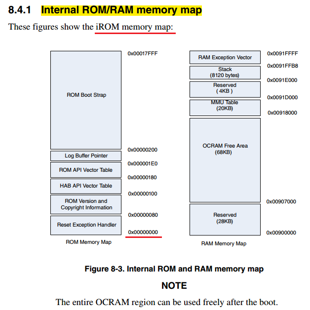

iROM是芯片内部自带的ROM，里面存放的也是一段程序。也就是说，imx6ull芯片上电后第一个执行的就是其内部iROM的一段程序，这段程序是芯片厂商写好并固化在imx6ull芯片iROM中的。
与生俱来，那iROM里面的程序有什么用，为什么要执行这段程序而不是直接执行我们下载到外部flash或者emmc中的程序呢？这段程序是NXP官方写的，它的源代码是不对外开放的。
这段iROM代码是为了方便用户做的，大家都知道我们的开发板或者其他大多数卡发板都有一个拨码开关，我们可以拨动拨码开关来设置芯片的启动方式（nand启动、emmc启动或者sd卡启动等），
为什么可以设置其启动方式？我们写的程序它都还没加载，是谁赋予了它这个能力？这就是iROM的作用，他会根据系统复位后当前的boot启动模式配置引脚的电平状态来决定从哪里加载u-boot，如下图所示，
红色框框的引脚便是我们开发板的boot配置引脚。

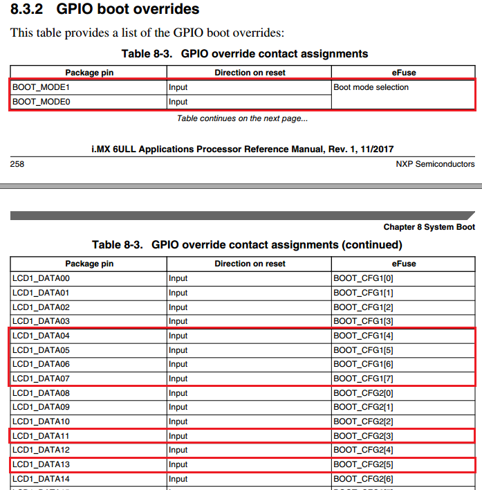

iROM启动流程如下图所示，大致是分成两种启动模式，第一种是下载模式，第二种是内部引导模式，复位后检查boot引脚电平状态，判断是使用那种引导模式，若是内部引导模式，则加载并验证引导镜像，然后执行引导程序；否则进入串口（USB或UART）下载模式，下载完之后便执行引导程序。

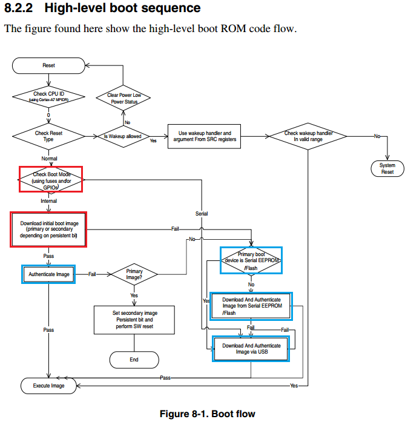

再来看下其启动流程图。

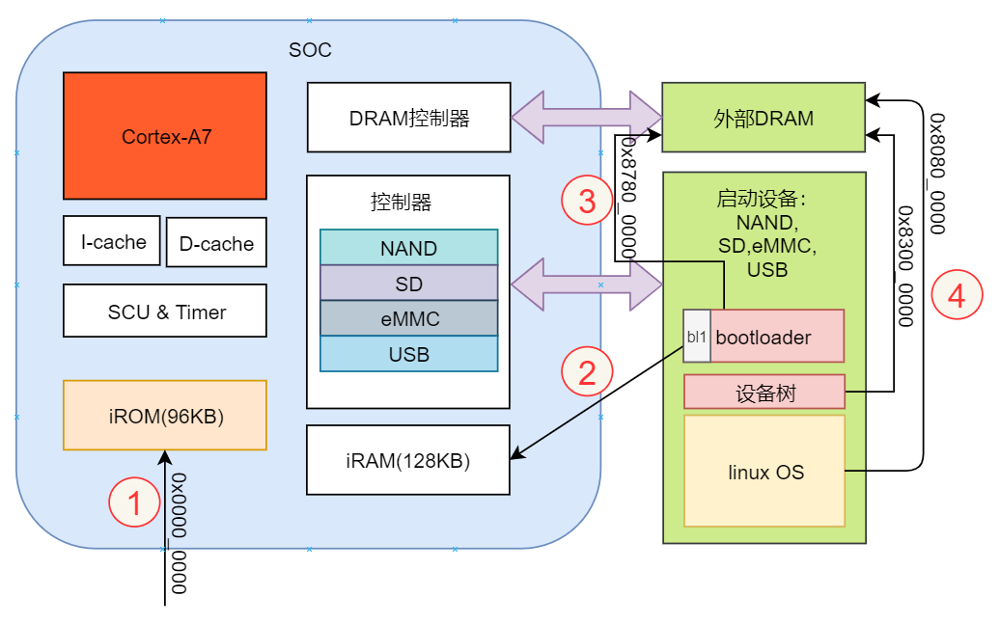

我们可以分为四个步骤来分析：

 - 芯片上电默认到0x0000_0000地址(iROM)处取指，iROM内部固化的程序负责完成系统基本功能的初始化，如时钟和堆栈，然后iROM从一个特定的启动设备中引导镜像（bootloader）到内部128KB的RAM中，iROM通过判断拨码开关状态来决定启动设备（Flash、eMMC、SD等），并根据安全引导键值执行完整性检查引导镜像。

 - 将存储设备中的前4KB数据拷贝到iRAM中运行，这段数据包含了Program image（飞思卡尔定义的一个镜像数据结构），它包含了启动数据的地址以及长度，告诉boot ROM将启动数据拷贝到哪里以及拷贝多大，然后初始化外部DRAM控制器。

 - 在初始化完DRAM控制器之后，bootloader主体部分被拷贝至外部DRAM中，bootloader随后便将linux操作系统镜像从引导设备加载到DRAM中，并对OS完整性检查。

 - 引导完成之后，bootloader跳到操作系统中去运行，启动Linux内核。

Linux内核又做了哪些事情？

 linux启动以后，接着就是挂载文件系统。那么有个问题，linux和文件系统是什么关系？linux启动以后不挂载文件系统可以么？
 Linux和STM32上谈到的传统的ucos、FreeRTOS不一样，Linux运行以后必须挂载文件系统，注意！是在linux运行后才挂载的。那安卓系统又是什么系统？
 安卓系统也是基于Linux系统的，他和Qt、ubuntu系统一样都基于linux系统，区分他们的就是文件系统不一样，这好几套系统底层全是Linux。
 Linux内核启动以后就开始挂载文件系统，然后找到找到文件系统中的初始化脚本，开始启动一个又一个服务（或应用程序）。挂载文件系统的方式有两种，一种是
 通过nfs的方式挂载网络文件系统，另一种方式是从块设备挂载文件系统，以那种方式挂载，取决于对bootargs中root参数的设置，设置 rootfstype参数以表示挂载的文件系统的
 类型。如“bootargs=console=ttymxc0,115200 root=/dev/mmcblk0p2 rw init=/linuxrc rootfstype=ext2”表示使用串口0作为控制终端，挂载mmc中第0块的第二个扇区作为文件系统，文件系统类型为ext2。
 init参数是什么？这是我们接下来要讲的。

传统的启动方式
""""""""""""""""""""""""

在以前，当Linux启动后，首先需要禁止中断并进入SVC模式，然后配置好各种环境，之后创建第一个进程，
也就是init进程，该进程完成了根文件系统的挂载，init是Linux系统操作中不可缺少的程序之一，
所谓的init进程，它是一个由内核启动的用户级进程。内核会在过去曾使用过init的几个地方查找它，
它的正确位置（对Linux系统来说）是/sbin/init。如果内核找不到init，它就会试着运行/bin/sh，
如果没有找到或者运行失败，那么系统的启动也会失败。内核自行启动（已经被载入内存，开始运行，
并已初始化所有的设备驱动程序和数据结构等）之后，就通过启动一个用户级程序init的方式，完成引导进程。
所以init始终是第一个进程（其进程编号始终为1）。

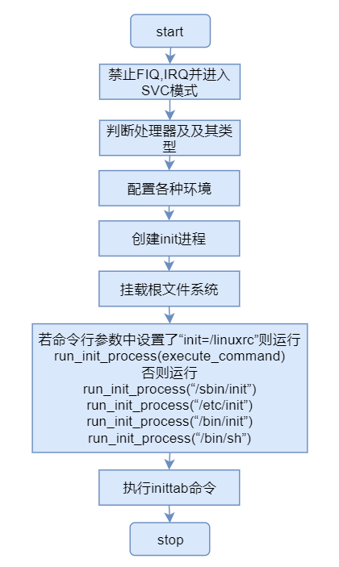

/etc/init的主要的功能就是准备软件运行的环境，包括系统的主机名称、网络配置、语系处理、文件系统格式及其他服务的启动等。
而启动init进程的配置文件是/etc/inittab，/etc/inittab文件是init在启动时读取的配置文件，也就是指挥官的决策书，
这个决策书规定了当前战争的局势，比如和平局势、冷战局势、战争局势。以及该局势下的核心策略。
init就是这样，通过inittab这个文件控制了计算机的启动级别，及该级别下启动的进程。
我们一般默认的启动级别是5，其启动级别可配置为0~6，当设为0时，代表系统停机，你可以尝试输入“init 0”指令查看系统是否停机，当设置为6时，系统会重启。
init启动脚本位置位于/etc/init.d目录符号链接到不同的 RunLevel 目录 （比如/etc/rc3.d、/etc/rc5.d等）。

传统的init启动也带来了一些问题：

 - 启动时间太长。init进程是串行启动的，也就是说只有当前一个进程启动之后才能接着启动下一个进程。

 - 启动脚本复杂。init进程只是执行启动脚本，并不搭理其他事情，脚本需要自己处理各种情况，如此会使得脚本变得很长。

Systemd启动方式
""""""""""""""""""""""""
s
现在，我们采用的是systemd方式启动，systemd就是为了解决传统init启动问题而诞生的。其设计目标是，为系统的启动和管理提供一套完整的解决方案。
systemd即为system daemon,是linux下的一种init软件,由Lennart Poettering带头开发,
并在LGPL 2.1及其后续版本许可证下开源发布,开发目标是提供更优秀的框架以表示系统服务间的依赖关系，
并依此实现系统初始化时服务的并行启动，同时达到降低Shell的系统开销的效果，最终代替常用的System V与BSD风格init程序。
当内核自解压完成，则加载systemd进程，并转移控制权到systemd。

输入“ps -A”查看所有进程，可以看到Systemd的进程PID为1，说明它是系统启动后运行的第一个进程，其他程序的启动由它负责，
功能还包括日志进程、控制基础系统配置，维护登陆用户列表以及系统账户、运行时目录和设置，可以运行容器和虚拟机，
可以简单的管理网络配置、网络时间同步、日志转发和名称解析等。

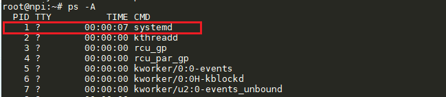

在传统的init进程的配置文件是/etc/inittab，各种服务的配置文件存放在/etc/sysconfig目录。现在的配置文件主要存放在/lib/systemd目录，
在/etc/systemd目录里面的修改可以覆盖原始设置。且传统的init启动模式中，会有runlevel（运行等级）的概念，在Systemd启动方式中，它被称为一种Target，
与之不同的是，runlevel是互斥的，也就是说不能同时有多个runlevel启动，而target允许多个启动。

.. table:: init与systemd初始化系统映射表

========= =================== ==========
runlevel         Target          注释 
========= =================== ==========
0           poweroff.target   关闭系统
1           rescue.target     维护模式（单用户模式）         
2,3,4       multi-user.target 多用户，无图形界面。用户可以通过终端或网络登录。        
5           graphical.target  多用户，图形界面。继承级别3的服务，并启动图形界面服务。         
6           reboot.target     重启系统            
========= =================== ========== 

我们输入“systemd-analyze plot > boot.svg”命令（或systemctl status -l）可以查看系统启动时都做了哪些工作，输入此命令后，
系统把整个引导过程写入一个SVG格式文件里。整个引导过程非常长不方便阅读，
所以通过这个命令我们可以把输出写入一个文件，之后再查看和分析。

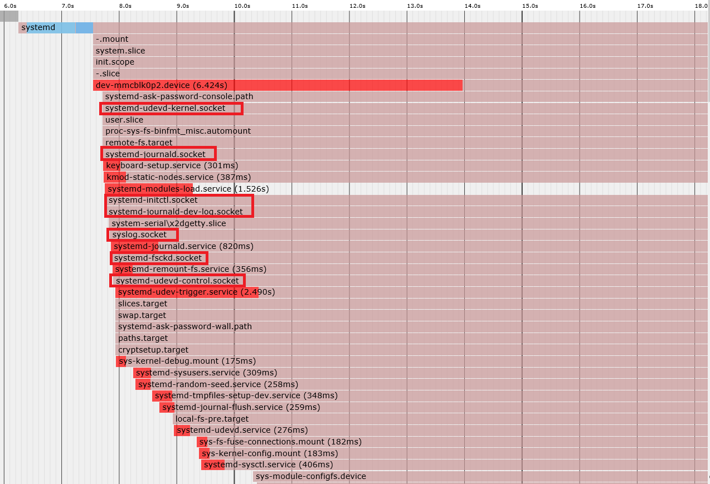

可以看到系统以systemd为首，创建了很多服务。比如创建打印logo服务、dbus服务、avahi服务、系统登陆服务等。
与init相比，Systemd采用的时并行启动，它为每个需要启动的守护进程建立一个套接字（如上图所示.socket），这样使得
不同进程之间实现信息交互。且Systemd会创建新的进程并且为其分配一个控制组，而且处于不同控制组的进程之间可以实现互相通信。
Systemd 初始化系统引导，完成相关的初始化工作，它执行default.target以获得设定的启动target（输入“systemctl get-default”命令可知默认的target为graphical.target），接着Systemd执行相应的启动单元文件，
依据单元文件中定义的依赖关系，传递控制权，依次执行其他的target单元文件。

我们输入“cat /lib/systemd/system/graphical.target”命令，查看默认的target->graphical.target单元文件的依赖关系。

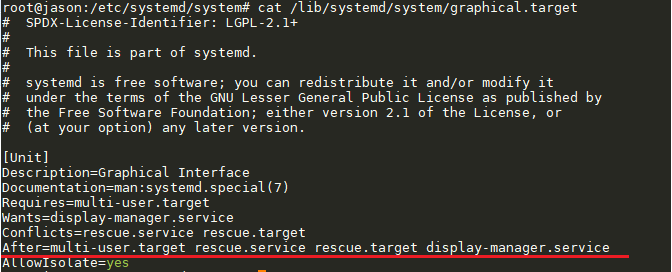

由上可知，他将启动multi-user.target、rescue.service、rescue.target、display-manager.service，而multi-user.target
又有相关的依赖，继续查看multi-user.target单元文件的依赖关系。

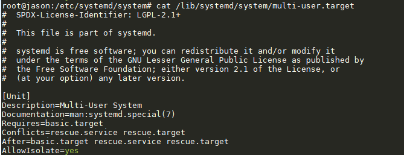

根据依赖关系总结得出它会依次执行multi-user.target-->basic.target-->sysinit.target-->local-fs.target-->local-fs-pre.target-->...
同时启动的每个 target 包含位于/etc/systemd/system/目录下的Unit。

systemd到此先告一段落，后面我们将详细简介systemd。

启动过程总结：

u-boot启动流程源代码情景分析
^^^^^^^^^^^^^^^^^^^^^^^^^^^^^^^

u-boot启动第一阶段源代码分析
''''''''''''''''''''''''''''''

u-boot加载启动内核过程可以大致分为两个阶段上，详情请看上一章节，接下来我们将详细分析u-boot源代码（版本号为2019.04）。

对于imx6ull而言，其第一阶段对应的文件时arch/arm/cpu/armv7/start.S和arch/arm/cpu/armv7/lowlevel_init.S

u-boot启动第一阶段流程图如下所示：

为了方便分析u-boot的启动流程，需要下载好u-boot源码并将其编译一遍，编译通过后我们可以看到源码根目录下
会出现一个u-boot.lds文件，如下图所示：

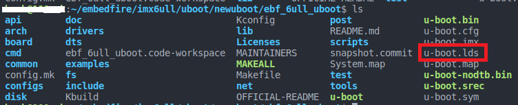

.. attention:: 必须要将u-boot编译一遍，且译成功后才会出现完整的.lds文件.

链接脚本有什么用？它描述了输出文件的内存布局，如何分析u-boot.lds链接脚本？每一个链接过程都会由连接脚本（一般以lds作为文件的后缀名）控制，经过编译后的u-boot源码
会输出各个层次的链接脚本，其中总的链接脚本在u-boot源码根目录下，通过分析总的链接脚本我们可以把握u-boot的来龙去脉，
带“@”后面为注释，总的链接脚本如下所示。

.. code-block:: s
   :emphasize-lines: 3,11,12
   :linenos:

   OUTPUT_FORMAT("elf32-littlearm", "elf32-littlearm", "elf32-littlearm")  @指定输出可执行文件是elf格式，32位ARM指令，小端
   OUTPUT_ARCH(arm)       @设置输出可执行文件的体系架构为arm
   ENTRY(_start)          @将_start设为入口地址
   SECTIONS
   {
   . = 0x00000000;        @指定可执行文件的全局入口点，通常这个地址都放在ROM(flash)0x0位置。必须使编译器知道这个地址，通常都是修改此处来完成
   . = ALIGN(4);          @代码以4字节对齐
   .text :                @指定代码段
   {
   *(.__image_copy_start)     @u-boot把自己拷贝到RAM中，这里指定拷贝的起始处
   *(.vectors)                @arch/arm/lib/vectors.S，存放异常向量表
   arch/arm/cpu/armv7/start.o (.text*)    @代码的第一个部分，arch/arm/cpu/armv7/start.S
   *(.text*)                              @其它代码段存放于此处
   }
   . = ALIGN(4);         @上面的代码结束后，可能会导致没有4字节对齐，这里再一次做好4字节对齐，方便后面的只读数据段
   .rodata : { *(SORT_BY_ALIGNMENT(SORT_BY_NAME(.rodata*))) }  @指定存放只读数据段
   . = ALIGN(4);         @和上面一样，需要4字节对齐，方便后面的数据段
   .data : {             @指定读/写数据段
   *(.data*)
   }
   . = ALIGN(4);         @都一样，以后就不再赘述了
   . = .;
   . = ALIGN(4);
   .u_boot_list : {
   KEEP(*(SORT(.u_boot_list*))); @在读/写数据段后，存放一些u-boot自有的函数，如u-boot command等
   }
   . = ALIGN(4);
   .image_copy_end :
   {
   *(.__image_copy_end)          @这里指定拷贝的末尾处，拷贝的包括代码段、只读数据、读写数据段和u_boot_list等
   }
   .rel_dyn_start :                       
   {
   *(.__rel_dyn_start)           @动态链接符段开始处
   }
   .rel.dyn : {
   *(.rel*)                      @存放动态链接符的地方
   }
   .rel_dyn_end :
   {
   *(.__rel_dyn_end)             @动态链接符段末尾处
   }
   .end :
   {
   *(.__end)
   }
   _image_binary_end = .;        @二进制文件结束
   . = ALIGN(4096);
   .mmutable : {
   *(.mmutable)                  @内存管理单元表
   }
   .bss_start __rel_dyn_start (OVERLAY) : {@BSS段起始
   KEEP(*(.__bss_start));
   __bss_base = .;
   }
   .bss __bss_base (OVERLAY) : {
   *(.bss*)
      . = ALIGN(4);
      __bss_limit = .;           @把__bss_limit赋值为当前位置
   }
   .bss_end __bss_limit (OVERLAY) : {     
   KEEP(*(.__bss_end));
   }                             @BSS段末尾
   .dynsym _image_binary_end : { *(.dynsym) }
   .dynbss : { *(.dynbss) }
   .dynstr : { *(.dynstr*) }
   .dynamic : { *(.dynamic*) }
   .plt : { *(.plt*) }
   .interp : { *(.interp*) }
   .gnu.hash : { *(.gnu.hash) }
   .gnu : { *(.gnu*) }
   .ARM.exidx : { *(.ARM.exidx*) }
   .gnu.linkonce.armexidx : { *(.gnu.linkonce.armexidx.*) }
   }

到这里，我们已经带领大家详细分析了总的链接脚本u-boot.lds，大家注意.S文件中的：ENTRY(_start)，
全局搜索_start即可找到它定义在arch/arm/lib/vectors.S文件中，这里便是代码入口处，见名知意，这里便指明了异常向量，
接下来我们顺藤摸瓜来分析一下arch/arm/lib/vectors.S的执行过程。

.. code-block:: s
   :linenos:
   :emphasize-lines: 16

   *************************************************************************
   *
   * Exception vectors as described in ARM reference manuals
   *
   * Uses indirect branch to allow reaching handlers anywhere in memory.
   *
   *************************************************************************
   */

   _start:

   #ifdef CONFIG_SYS_DV_NOR_BOOT_CFG
      .word	CONFIG_SYS_DV_NOR_BOOT_CFG
   #endif

      b	resets                  /* 跳转到resets处，b为的无条件跳转，bl还把PC（r15）赋值给链接寄存器（r14） */
      ldr	pc, _undefined_instruction    /* 未定义指令异常向量 */ 
      ldr	pc, _software_interrupt       /* 预取指令异常向量 */ 
      ldr	pc, _prefetch_abort           /* 数据操作异常向量 */ 
      ldr	pc, _data_abort               /* 预取指令异常向量 */ 
      ldr	pc, _not_used                 /* 没有使用 */
      ldr	pc, _irq                      /* irq中断向量 */
      ldr	pc, _fiq                      /* fiq中断向量 */

   ......                                 /* 省略部分代码 */
   /* 中断向量表入口地址 */
   _undefined_instruction:	.word undefined_instruction  /* 当前地址（_undefined_instruction）存放undefined_instruction
   _software_interrupt:	.word software_interrupt
   _prefetch_abort:	.word prefetch_abort
   _data_abort:		.word data_abort
   _not_used:		.word not_used
   _irq:			.word irq
   _fiq:			.word fiq

      .balignl 16,0xdeadbeef

代码中断都定义了各种异常向量，它和8051单片机中的中断向量很类似，没有什么神秘的，.word表示四字节对齐，也就是说他们的指令都是固定的。当cpu产生异常时，便会将对应的异常入口地址加载到pc中，进而处理相应的异常处理程序。
各个异常向量具体描述如下表格所示：

.. csv-table:: Frozen Delights!
    :header: "地址", "异常", "进入模式", "描述"
    :widths: 15, 10, 10, 30

    "0x00000000", 复位, "管理模式", "位电平有效时，产生复位异常，程序跳转到复位处理程序处执行"
    "0x00000004", 未定义指令, "未定义模式", "遇到不能处理的指令时，产生未定义指令异"
    "0x00000008", 软件中断, "管理模式", "执行SWI指令产生，用于用户模式下的程序调用特权操作指令"
    "0x0000000c", 预存指令, "中止模式", "处理器预取指令的地址不存在，或该地址不允许当前指令访问，产生指令预取中止异常"
    "0x00000010", 数据操作, "中止义模式", "处理器数据访问指令的地址不存在，或该地址不允许当前指令访问时，产生数据中止异常"
    "0x00000014", 未使用, "未使用", "未使用"
    "0x00000018", IRQ, "IRQ", "外部中断请求有效，且CPSR中的I位为0时，产生IRQ异常"
    "0x0000001c", FIQ, "FIQ", "快速中断请求引脚有效，且CPSR中的F位为0时，产生FIQ异常"

其中复位异常向量指令“b	resets”决定了u-boot启动或者复位后将自动跳转到resets标志处执行，下面我们接着分析一下resets到底
做了哪些工作，全局搜索我们发现resets其实就定义在arch/arm/cpu/armv7/start.S文件中，如下所示：

.. code-block:: s
   :linenos:
   :emphasize-lines: 16

   /*************************************************************************
   *
   * Startup Code (reset vector)
   *
   * Do important init only if we don't start from memory!
   * Setup memory and board specific bits prior to relocation.
   * Relocate armboot to ram. Setup stack.
   *
   *************************************************************************/

      .globl	reset
      .globl	save_boot_params_ret

   reset:
      /* Allow the board to save important registers */
      b	save_boot_params
   save_boot_params_ret:

阅读上面代码，.globl意思很简单，相当于c语言当中的extern，声明reset，且告诉连接器reset为全局标量，
外部是可以访问的（在arch/arm/lib/vectors.S代码中“b	reset”有用到此变量）。分析上面代码可知，
reset中只有一条跳转指令“b save_boot_params”，搜索标号“save_boot_params”发现，它也只有一个跳转指令如下：

.. code-block:: s
   :linenos:
   :emphasize-lines: 11

   /*************************************************************************
   *
   * void save_boot_params(u32 r0, u32 r1, u32 r2, u32 r3)
   *	__attribute__((weak));
   *
   * Stack pointer is not yet initialized at this moment
   * Don't save anything to stack even if compiled with -O0
   *
   *************************************************************************/
   ENTRY(save_boot_params)
      b	save_boot_params_ret		@ 跳转到save_boot_params_ret标号处
   ENDPROC(save_boot_params)   

save_boot_params_ret标号代码如下：

.. code-block:: s
   :linenos:

   save_boot_params_ret:
	/*
	 * disable interrupts (FIQ and IRQ), also set the cpu to SVC32 mode,
	 * except if in HYP mode already
	 */
	mrs	r0, cpsr          
	and	r1, r0, #0x1f		@ mask mode bits
	teq	r1, #0x1a		   @ test for HYP mode
	bicne	r0, r0, #0x1f		@ clear all mode bits
	orrne	r0, r0, #0x13		@ set SVC mode
	orr	r0, r0, #0xc0		@ disable FIQ and IRQ
	msr	cpsr,r0

以上代码主要工作是将cpu的工作模式设置为SVC32模式（即管理模式），同时将中断禁止位与快速中断禁止位都设置为1，
以此屏蔽IRQ和FIQ的中断，说白了就是设置cpsr(Current Program Status Register)，cpsr(Saved Program Status Register)是当前程序状态寄存器，spsr是保存的程序状态寄存器。
打开《arm_architecture_reference_manual ARMv7-A and ARMv7-R edition》ARMv7架构参考手册，具体看下cpsr的位域结构，如下图所示：

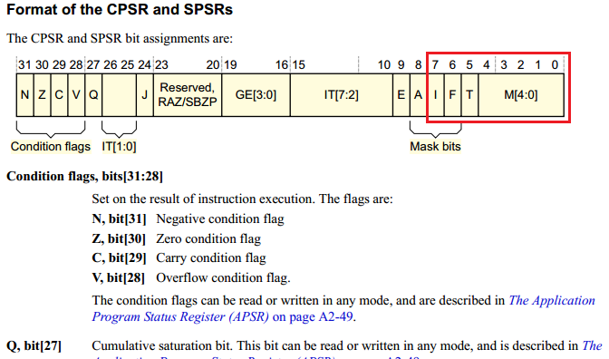

上图中红色方框标注的是“save_boot_params_ret”函数要设置的位域，其中模式位域M[4:0]决定了当前cpu的工作模式，
而位域F[6]为FIQ中断屏蔽位，位域I[7]为IRQ中断屏蔽位，位域T[5]为Thumb执行状态位（此位没有设置，可忽略），
模式位域M[4:0]详情如下表格所示：

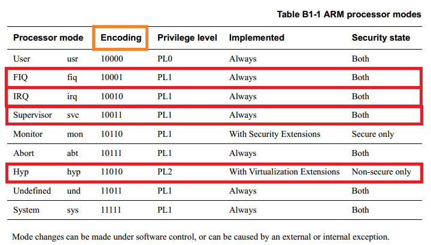

图中红色方框为“save_boot_params_ret”函数做过手脚的地方，我们根据Encoding来设置模式位域M[4:0]就可以设置
cpu的工作模式。
详细了解了这段位域的意思后，我们再一行一行详细的分析“save_boot_params_ret”函数，看看它到底做了什么。

1. mrs	r0, cpsr：加载cpsr寄存器的值到r0寄存器中；
2. and	r1, r0, #0x1f：屏蔽寄存器的非模式位域，留下模式位域的值；
3. teq	r1, #0x1a：测试看看当前cpu是否处于hyp模式，对照上面表格Hyp的Encoding值为11010，转成十六进制正好是0x1a；
4. bicne	r0, r0, #0x1f：清除所有的模式位M[4:0]；
5. orrne	r0, r0, #0x13：设置为Supervisor（SVC）模式，对照上面表格Supervisor的Encoding值为10011，转成十六进制正好是0x13；
6. orr	r0, r0, #0xc0： 屏蔽FIQ和IRQ中断；
7. msr	cpsr,r0： 将修改后r0寄存器的值重新装载到cpsr中。

接着继续分析后面的代码，从此我们为了方便分析源码，将源码的注释写到对应的指令行中。

.. code-block:: s
   :linenos:

   /*
   * Setup vector:
   * (OMAP4 spl TEXT_BASE is not 32 byte aligned.
   * Continue to use ROM code vector only in OMAP4 spl)
   */
   #if !(defined(CONFIG_OMAP44XX) && defined(CONFIG_SPL_BUILD))   @条件编译，如果没有定义CONFIG_OMAP44XX和CONFIG_SPL_BUILD则编译下面的代码段
      /* Set V=0 in CP15 SCTLR register - for VBAR to point to vector */
      mrc	p15, 0, r0, c1, c0, 0	@ Read CP15 SCTLR Register
      bic	r0, #CR_V		@ V = 0
      mcr	p15, 0, r0, c1, c0, 0	@ Write CP15 SCTLR Register

      /* Set vector address in CP15 VBAR register */
      ldr	r0, =_start
      mcr	p15, 0, r0, c12, c0, 0	@Set VBAR
   #endif

根据源码英文注释，我们大概知道这段代码是要设置SCTLR（系统控制寄存器），参考ARMv7架构参考手册，找到SCTLR寄存器，
具体内容如下图所示：

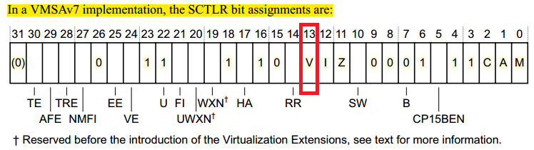

SCTLR寄存器用于控制标准内存和系统设备，并且为在硬件内核中实现的功能提供状态信息，其中位域V[13]的作用是选择
异常向量表的基地址，根据ARMv7架构参考手册描述可知，当往V[13]填如0时，异常向量表的基地址=0x00000000，并且
该地址可以被re-mapped（重映射）；当往V[13]填如1时，异常向量表的基地址=0xffff0000，此时该地址不能被重映射。
源码中大量用到了mrc和mcr指令，mrc为 协处理器寄存器到ARM 处理器寄存器的数据传送指令，mcr为ARM 处理器寄存器到协处理器寄存器的数据传送指令。

1. 第8行，读取SCTLR寄存器中的值到r0中。

2. 第9行，清除SCTLR寄存器中的第CR_V位（CR_V在arch/arm/include/asm/system.h中定义为(1 << 13)），即设置异常向量表的及地址为0x00000000，且支持重映射。

3. 第10行，将修改后的r0值再写到SCTLR寄存器中。

4. 第13行，将_start的值加载到r0寄存器当中。

在u-boot源码目录下全局搜索_start（注意：要编译u-boot），在System.map文件中，可以看到_start的值为0x87800000，该地址为我们前面分析u-boot.lds中向量表vectors的起始地址，
如下图所示：

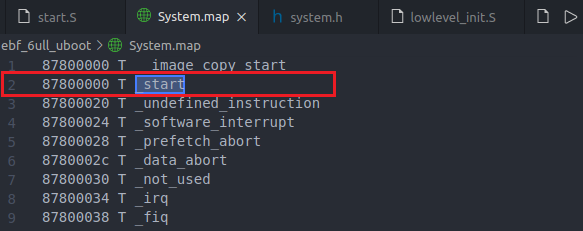

与此同时我们还可以看到其他异常向量的链接地址，如未定义指令异常向量被链接在0x87800020中，System.map用于存放内核符号表信息。
符号表是所有符号和其对应地址的一个列表，随着每次内核的编译，就会产生一个新的对应的System.map文件，当内核运行出错时，
通过System.map中的符号表解析，就可以查到一个地址值对应的变量名。

5. 第14行，设置c12的值为0x87800000（_start），即设置非安全模式异常基址寄存器为0x87800000，结合前面清除SCTLR中的V[13]，即实现的向量表的重定位。ARM默认的异常向量表入口在0x0地址，uboot的运行介质（norflash nandflash sram等）映射地址可能不在0x0起始的地址，所以需要修改异常向量表入口。

总结：清除SCTLR中位域V[13]，然后设置VBAR指向向量表以实现向量表定位到0x87800000地址处。在分析后面代码之前，
我们先总结一下这段_start中汇编做的工作：关闭中断、初始化异常向量表、设置SVC32模式、配置cp15.

接着分析源码，如下所示：

.. code-block:: s
   :linenos:

   	/* the mask ROM code should have PLL and others stable */
   #ifndef CONFIG_SKIP_LOWLEVEL_INIT
   #ifdef CONFIG_CPU_V7A
      bl	cpu_init_cp15
   #endif
   #ifndef CONFIG_SKIP_LOWLEVEL_INIT_ONLY
      bl	cpu_init_crit
   #endif
   #endif

1. 第2行，如果未定义CONFIG_SKIP_LOWLEVEL_INIT则编译后面的代码块，经查找CONFIG_SKIP_LOWLEVEL_INIT未被定义，后面的代码块有效。

2. 第3行，CONFIG_CPU_V7A已被定义。

3. 第4行，跳转至cpu_init_cp15标号处，执行完cpu_init_cp15函数后返回。

4. 第6行，CONFIG_SKIP_LOWLEVEL_INIT_ONLY未被定义。

5. 第7行，跳转至cpu_init_crit标号处，执行完cpu_init_crit函数后返回。

搜索cpu_init_cp15，其函数实现如下所示：

.. code-block:: s
   :linenos:

      ENTRY(cpu_init_cp15)
      /*
      * Invalidate L1 I/D
      */
      mov	r0, #0			@ set up for MCR
      mcr	p15, 0, r0, c8, c7, 0	@ invalidate TLBs
      mcr	p15, 0, r0, c7, c5, 0	@ invalidate icache
      mcr	p15, 0, r0, c7, c5, 6	@ invalidate BP array
      mcr     p15, 0, r0, c7, c10, 4	@ DSB
      mcr     p15, 0, r0, c7, c5, 4	@ ISB

上面代码看起来有点复杂，但是别灰心，沉着冷静，最好是看完本章然后自己去动闹分析一边，
自然就会对u-boot有更加深入的了解，这些过程对于移植u-boot来说时非常重要的。废话不多说，咱们接着分析
上面的代码片段。

1. 第5行，这行比较简单，就是将r0寄存器的内容清零。

2. 第6行，首先，mcr做的事情其实很简单，就是“ARM处理器的寄存器中的数据传送到协处理器寄存器”，此处是，将将ARM的寄存器r0中的数据，此时r0=0,所以就是把0这个数据，传送到协处理器CP15中。而对应就是写入到C8，即将0写入到寄存器8（Register 8）中去，它是一个只写的寄存器，配合指令“mcr	p15, 0, r0, c8, c7, 0”最后两个参数，其作用是使整个数据和指令TLB无效，禁止虚拟地址到物理地址的转换，为何要关闭呢？因为刚开始我们并没有建立页表，且都是直接操作物理寄存器的，所以不能打开，否则会发生意想不到的错误。

3. 第7行，使无效整个指令缓冲。

4. 第8行，清空整个跳转目标缓冲，关闭分支预测功能。

5. 第9行，清空写缓冲区，以便数据同步。

6. 第10行，清空预取缓冲区，以便指令同步，清空流水线中已经取到的指令，进行重新取指令。

代码中基本都是清空各种缓冲，如果使用陈旧条目启用缓存，则代码可能会崩溃，导致系统无法启动。

接着往下看，下面代码都是顺序执行的，所以我们一路分析下去：

.. code-block:: s
   :linenos:

      /*
      * disable MMU stuff and caches
      */
      mrc	p15, 0, r0, c1, c0, 0
      bic	r0, r0, #0x00002000	@ clear bits 13 (--V-)
      bic	r0, r0, #0x00000007	@ clear bits 2:0 (-CAM)
      orr	r0, r0, #0x00000002	@ set bit 1 (--A-) Align
      orr	r0, r0, #0x00000800	@ set bit 11 (Z---) BTB
   #ifdef CONFIG_SYS_ICACHE_OFF
      bic	r0, r0, #0x00001000	@ clear bit 12 (I) I-cache
   #else
      orr	r0, r0, #0x00001000	@ set bit 12 (I) I-cache
   #endif
      mcr	p15, 0, r0, c1, c0, 0

   #ifdef CONFIG_ARM_ERRATA_716044
      mrc	p15, 0, r0, c1, c0, 0	@ read system control register
      orr	r0, r0, #1 << 11	@ set bit #11
      mcr	p15, 0, r0, c1, c0, 0	@ write system control register
   #endif

1. 第4行，将cp15的寄存器c1的值读到r0中，c1是一个控制寄存器，它包括使能或禁止mmu以及与其他存储系统相关的功能，配置存储系统以及ARM处理器中的相关部分的工作。

2. 第5行，清除位域V[13]，即选择低端异常中断向量表，向量表基地址为0x00000000，且支持向量表重映射。

3. 第6行，清除位域M[0]、A[1]、C[2],即分别禁止内存管理单元mmu、地址对齐检查、数据缓冲。

4. 第7行，使能地址对齐检查。

5. 第8行，打开ARM系统的跳转预测（分支预测）功能，不打断流水线，提高指令执行效率。

6. 第9~13行，如果定义了CONFIG_SYS_ICACHE_OFF则关闭I-cache，否则打开I-cache，此处没有定义CONFIG_SYS_ICACHE_OFF，故打开I-cache。

7. 第14行，将修改后的r0重新写入SCTLR寄存器中。

8. 第16~20行，由于我们没有定义CONFIG_ARM_ERRATA_716044，故忽略这段代码。

到这里我们再总结一下上面这段代码的功能含义，首先，我们为何要关闭mmu？mmu负责从虚拟地址到物理地址之间的转换，但是我们现在的汇编都是直接操作物理寄存器，
此时如果打开了mmu，而我们并没有有效的TLB，这样cpu可以说是胡乱运行的，所以我们需要关闭mmu，不需要它转换地址，直接操作寄存器方便快捷。
然后，再发出灵魂拷问，为何要关闭cache？因为catch和MMU是通过cp15管理的，刚上电的时候，CPU并不能管理他们。所以上电的时候mmu必须关闭，指令cache可关闭，可不关闭，但数据cache一定要关闭，
否则可能导致刚开始的代码里面，去取数据的时候，从catch里面取，而这时候RAM中数据还没有cache过来，导致数据预取异常。

下面这些代码段大都是和cpu的cp15协处理器相关，并根据条件编译进行相关的设置，我们就不一一分析了，感兴趣的同学可以参考着《ARM ArchitectureReference Manual ARMv7-A and ARMv7-R edition》、《Cortex-A7 Technical ReferenceManua》及
《ARM Generic Interrupt Controller(ARM GIC控制器)V3.0与V4.0》等相关手册进行详细分析，我们主要的是抓住重点分析。

.. code-block:: s
   :linenos:
   :emphasize-lines: 30,32,33,35,68

   #if (defined(CONFIG_ARM_ERRATA_742230) || defined(CONFIG_ARM_ERRATA_794072))
      mrc	p15, 0, r0, c15, c0, 1	@ read diagnostic register
      orr	r0, r0, #1 << 4		@ set bit #4
      mcr	p15, 0, r0, c15, c0, 1	@ write diagnostic register
   #endif

   #ifdef CONFIG_ARM_ERRATA_743622
      mrc	p15, 0, r0, c15, c0, 1	@ read diagnostic register
      orr	r0, r0, #1 << 6		@ set bit #6
      mcr	p15, 0, r0, c15, c0, 1	@ write diagnostic register
   #endif

   #ifdef CONFIG_ARM_ERRATA_751472
      mrc	p15, 0, r0, c15, c0, 1	@ read diagnostic register
      orr	r0, r0, #1 << 11	@ set bit #11
      mcr	p15, 0, r0, c15, c0, 1	@ write diagnostic register
   #endif
   #ifdef CONFIG_ARM_ERRATA_761320
      mrc	p15, 0, r0, c15, c0, 1	@ read diagnostic register
      orr	r0, r0, #1 << 21	@ set bit #21
      mcr	p15, 0, r0, c15, c0, 1	@ write diagnostic register
   #endif
   #ifdef CONFIG_ARM_ERRATA_845369
      mrc	p15, 0, r0, c15, c0, 1	@ read diagnostic register
      orr	r0, r0, #1 << 22	@ set bit #22
      mcr	p15, 0, r0, c15, c0, 1	@ write diagnostic register
   #endif

      mov	r5, lr			@ 用于保存返回地址
      mrc	p15, 0, r1, c0, c0, 0	@ r1 has Read Main ID Register (MIDR)
      mov	r3, r1, lsr #20		@ get variant field
      and	r3, r3, #0xf		@ r3 has CPU variant
      and	r4, r1, #0xf		@ r4 has CPU revision
      mov	r2, r3, lsl #4		@ shift variant field for combined value
      orr	r2, r4, r2		@ r2 has combined CPU variant + revision

   #ifdef CONFIG_ARM_ERRATA_798870  @未定义，忽略此段
      cmp	r2, #0x30		@ Applies to lower than R3p0
      bge	skip_errata_798870      @ skip if not affected rev
      cmp	r2, #0x20		@ Applies to including and above R2p0
      blt	skip_errata_798870      @ skip if not affected rev

      mrc	p15, 1, r0, c15, c0, 0  @ read l2 aux ctrl reg
      orr	r0, r0, #1 << 7         @ Enable hazard-detect timeout
      push	{r1-r5}			@ Save the cpu info registers
      bl	v7_arch_cp15_set_l2aux_ctrl
      isb				@ Recommended ISB after l2actlr update
      pop	{r1-r5}			@ Restore the cpu info - fall through
   skip_errata_798870:
   #endif

   #ifdef CONFIG_ARM_ERRATA_801819  @未定义，忽略此段
      cmp	r2, #0x24		@ Applies to lt including R2p4
      bgt	skip_errata_801819      @ skip if not affected rev
      cmp	r2, #0x20		@ Applies to including and above R2p0
      blt	skip_errata_801819      @ skip if not affected rev
      mrc	p15, 0, r0, c0, c0, 6	@ pick up REVIDR reg
      and	r0, r0, #1 << 3		@ check REVIDR[3]
      cmp	r0, #1 << 3
      beq	skip_errata_801819	@ skip erratum if REVIDR[3] is set

      mrc	p15, 0, r0, c1, c0, 1	@ 读取辅助控制寄存器
      orr	r0, r0, #3 << 27	@ Disables streaming. All write-allocate
                  @ lines allocate in the L1 or L2 cache.
      orr	r0, r0, #3 << 25	@ Disables streaming. All write-allocate
                  @ lines allocate in the L1 cache.
      push	{r1-r5}			@ 保存参数信息，用于传递参数给v7_arch_cp15_set_acr函数
      bl	v7_arch_cp15_set_acr      @跳转到v7_arch_cp15_set_acr函数中，其函数声明为：void __weak v7_arch_cp15_set_acr(u32 acr, u32 cpu_midr, u32 cpu_rev_comb, u32 cpu_variant, u32 cpu_rev)
      pop	{r1-r5}			@ Restore the cpu info - fall through
   skip_errata_801819:
   #endif

   #ifdef CONFIG_ARM_ERRATA_454179  CONFIG_ARM_ERRATA_798870 @未定义，忽略此段
      cmp	r2, #0x21		@ Only on < r2p1
      bge	skip_errata_454179

      mrc	p15, 0, r0, c1, c0, 1	@ Read ACR
      orr	r0, r0, #(0x3 << 6)	@ Set DBSM(BIT7) and IBE(BIT6) bits
      push	{r1-r5}			@ Save the cpu info registers
      bl	v7_arch_cp15_set_acr
      pop	{r1-r5}			@ Restore the cpu info - fall through

   skip_errata_454179:
   #endif

   #ifdef CONFIG_ARM_ERRATA_430973  @未定义，忽略此段
      cmp	r2, #0x21		@ Only on < r2p1
      bge	skip_errata_430973

      mrc	p15, 0, r0, c1, c0, 1	@ Read ACR
      orr	r0, r0, #(0x1 << 6)	@ Set IBE bit
      push	{r1-r5}			@ Save the cpu info registers
      bl	v7_arch_cp15_set_acr
      pop	{r1-r5}			@ Restore the cpu info - fall through

   skip_errata_430973:
   #endif

   #ifdef CONFIG_ARM_ERRATA_621766  @没有定义，忽略此段
      cmp	r2, #0x21		@ Only on < r2p1
      bge	skip_errata_621766

      mrc	p15, 0, r0, c1, c0, 1	@ Read ACR
      orr	r0, r0, #(0x1 << 5)	@ Set L1NEON bit
      push	{r1-r5}			@ Save the cpu info registers
      bl	v7_arch_cp15_set_acr
      pop	{r1-r5}			@ Restore the cpu info - fall through

   skip_errata_621766:
   #endif

      mov	pc, r5			@ 返回
   ENDPROC(cpu_init_cp15)

上面的代码有个很有意思的地方，来和大家分享一下，有没有发现代码中重复出现以下代码段：

.. code-block:: s
   :linenos:
   :emphasize-lines: 1,3

   push	{r1-r5}			@ Save the cpu info registers
   bl	v7_arch_cp15_set_acr
   pop	{r1-r5}			@ Restore the cpu info - fall through

笔者分析，这是典型的函数调用过程，全局搜索v7_arch_cp15_set_acr，在arch/arm/cpu/armv7/cp15.c有该函数的实现，如下所示：

.. code-block:: c
   :linenos:
   :emphasize-lines: 4

   void __weak v7_arch_cp15_set_acr(u32 acr, u32 cpu_midr, u32 cpu_rev_comb,
				 u32 cpu_variant, u32 cpu_rev)
   {
      asm volatile ("mcr p15, 0, %0, c1, c0, 1\n\t" : : "r"(acr));
   }

这是一段内嵌汇编函数，该函数主要作用是设置ACTLR（辅助控制寄存器），关于ACTLR的具体描述，大家可以参考e
《Cortex-A7 Technical ReferenceManua》，我们分析一下它是如何进行函数调用以及参数传递的。首先函数v7_arch_cp15_set_acr调用之前都进行了push入栈操作，它是将{r1-r5}这五个寄存器都压入堆栈中，
不同于x86的参数传递规则，ARM程序调用规则ATPCS（ARM-Thumb Procedure Call Standard）建议函数的形参不超过4个，如果形参个数少于或等于4，则形参由R0,R1,R2,R3四个寄存器进行传递，其中r0传递给第一个参数、r1传递给第2个......；若形参个数大于4，则大于4的部分必须通过堆栈进行传递。
显然函数v7_arch_cp15_set_acr共有5个参数acr、cpu_midr、cpu_rev_comb、cpu_variant、cpu_rev，所以大于4的部分必须通过堆栈进行传递，而这里是将{r1-r5}全都入栈了，其中{r0-r4}5个寄存器的值分别作为v7_arch_cp15_set_acr函数的5个参数
来传递，为什么不采用x86的方式都用栈传递？因为麻烦呀，而且经常入栈出栈耗时间。第4行，v7_arch_cp15_set_acr函数中有一段内嵌汇编代码，其中“%0”就是变量acr的值也就是r0寄存器中的值，也就是ACTLR寄存器，因为前面已经将ACTLR读入到r0中，并且改变了r0的值。r1存储的是MIDR（Main ID Register），
MIDR提供处理器的标识信息，包括设备的实现代码和设备ID号，MIDR和其他寄存器（{r2-r4}）的值都没有用到，所以我们就不追究了，大概知道其调用规则即可。函数调用完后需要将调用前入栈的数据给pop（出栈）掉。

到此cpu_init_cp15函数基本上分析完了，接下来继续分析cpu_init_crit函数，代码如下：

.. code-block:: c
   :linenos:
   :emphasize-lines: 1,17

   #ifndef CONFIG_SKIP_LOWLEVEL_INIT
   /*************************************************************************
   *
   * CPU_init_critical registers
   *
   * setup important registers
   * setup memory timing
   *
   *************************************************************************/
   ENTRY(cpu_init_crit)
      /*
      * Jump to board specific initialization...
      * The Mask ROM will have already initialized
      * basic memory. Go here to bump up clock rate and handle
      * wake up conditions.
      */
      b	lowlevel_init		@ go setup pll,mux,memory
   ENDPROC(cpu_init_crit)
   #endif

1. 第1行，如果没有定义CONFIG_SKIP_LOWLEVEL_INIT，则编译cpu_init_crit相关代码段，源码中搜索CONFIG_SKIP_LOWLEVEL_INIT，发现其确实未被定义。

2. 第17行，跳转至lowlevel_init函数执行。

由于lowlevel_init完成了内存的初始化工作，而内存的初始化依赖于开发板，所以lowlevel_init于当前imx6u相关，
lowlevel_init函数是与特定开发板相关的初始化函数，在这个函数里会做一些pll初始化，
如果不是从内存启动，则会做内存初始化，方便后续拷贝到内存中运行。
全局搜索lowlevel_init发现其在arch/arm/cpu/armv7/lowlevel_init.S文件中有定义：

.. code-block:: s
   :linenos:
   :caption: arch/arm/cpu/armv7/lowlevel_init.S
   :emphasize-lines: 8

   WEAK(lowlevel_init)
      /*
      * Setup a temporary stack. Global data is not available yet.
      */
   #if defined(CONFIG_SPL_BUILD) && defined(CONFIG_SPL_STACK)
      ldr	sp, =CONFIG_SPL_STACK
   #else
      ldr	sp, =CONFIG_SYS_INIT_SP_ADDR
   #endif
      bic	sp, sp, #7 /* 8-byte alignment for ABI compliance */
   #ifdef CONFIG_SPL_DM
      mov	r9, #0
   #else
      /*
      * Set up global data for boards that still need it. This will be
      * removed soon.
      */
   #ifdef CONFIG_SPL_BUILD
      ldr	r9, =gdata
   #else
      sub	sp, sp, #GD_SIZE
      bic	sp, sp, #7
      mov	r9, sp
   #endif
   #endif
      /*
      * Save the old lr(passed in ip) and the current lr to stack
      */
      push	{ip, lr}

      /*
      * Call the very early init function. This should do only the
      * absolute bare minimum to get started. It should not:
      *
      * - set up DRAM
      * - use global_data
      * - clear BSS
      * - try to start a console
      *
      * For boards with SPL this should be empty since SPL can do all of
      * this init in the SPL board_init_f() function which is called
      * immediately after this.
      */
      bl	s_init
      pop	{ip, pc}
   ENDPROC(lowlevel_init)

忽略不符合条件编译的代码。

1. 第8行，设置栈指针指向CONFIG_SYS_INIT_SP_ADDR，而CONFIG_SYS_INIT_SP_ADDR具体是什么？它在include/configs/mx6ullevk.h文件中有如下定义：

.. code-block:: s
   :linenos:
   :caption: include/configs/mx6ullevk.h
   :emphasize-lines: 8

   /* Physical Memory Map */
   #define PHYS_SDRAM			MMDC0_ARB_BASE_ADDR

   #define CONFIG_SYS_SDRAM_BASE		PHYS_SDRAM
   #define CONFIG_SYS_INIT_RAM_ADDR	IRAM_BASE_ADDR
   #define CONFIG_SYS_INIT_RAM_SIZE	IRAM_SIZE

   #define CONFIG_SYS_INIT_SP_OFFSET \
      (CONFIG_SYS_INIT_RAM_SIZE - GENERATED_GBL_DATA_SIZE)
   #define CONFIG_SYS_INIT_SP_ADDR \
      (CONFIG_SYS_INIT_RAM_ADDR + CONFIG_SYS_INIT_SP_OFFSET)

上述代码段可以总结出：CONFIG_SYS_INIT_SP_ADDR = IRAM_BASE_ADDR + （IRAM_SIZE - GENERATED_GBL_DATA_SIZE），
IRAM_BASE_ADDR在arch/arm/include/asm/arch-mx6/imx-regs.h定义为0x00900000，
IRAM_SIZE在arch/arm/include/asm/arch-mx6/imx-regs.h中定义为0x00020000，如下所示：

.. code-block:: s
   :linenos:
   :caption: arch/arm/include/asm/arch-mx6/imx-regs.h
   :emphasize-lines: 2,6

   #if !(defined(CONFIG_MX6SX) || \
      defined(CONFIG_MX6UL) || defined(CONFIG_MX6ULL) || \
      defined(CONFIG_MX6SLL) || defined(CONFIG_MX6SL))
   #define IRAM_SIZE                    0x00040000
   #else
   #define IRAM_SIZE                    0x00020000
   #endif

在.config文件中我们配置了CONFIG_MX6ULL=y，所以条件不成立，即定义IRAM_SIZE = 0x00020000，.config部分配置文件如下所示：

.. code-block:: .config
   :linenos:
   :caption: .config
   :emphasize-lines: 5

   CONFIG_SYS_TEXT_BASE=0x87800000
   CONFIG_SYS_MALLOC_F_LEN=0x400
   # CONFIG_SECURE_BOOT is not set
   CONFIG_MX6=y
   CONFIG_MX6ULL=y
   CONFIG_LDO_BYPASS_CHECK=y
   # CONFIG_MODULE_FUSE is not set
   # CONFIG_TARGET_ADVANTECH_DMS_BA16 is not set

由此可见.config配置文件与我们的代码息息相关，大家可修改.config中的配置项来定制我们自己的u-boot，比如
修改CONFIG_BOOTDELAY=3，可以设置uboot启动延时；修改CONFIG_BAUDRATE=115200设置串口波特率。当然我们可以使用更人性化
的make menuconfig来配置u-boot，配置好后，就会在u-boot根目录下生成最新的.config文件，u-boot根据这些配置文件来决定该如何编译
u-boot源码，不多说了，继续往下分析。

GENERATED_GBL_DATA_SIZE在include/generated/generic-asm-offsets.h中定义为256，转换成十六进制为0x00000100。
故CONFIG_SYS_INIT_SP_ADDR = （0x00900000 + （0x00020000 - 0x00000100）） = 0x0091ff00。

2. 第10行，根据英文注释可知，它是要遵从ABI的8字节对齐。

3. 第21行，将堆栈指针减去GD_SIZE，GD_SIZE在include/generated/generic-asm-offsets.h中被定义为256，即sp = sp - 0x00000100.

4. 第22行，和上面一样遵从ABI的8字节对齐。

5. 第23行，将sp的值存储在r9寄存器当中。

6. 第29行，将ip和pc压入栈中。

7. 第44行，调用s_init函数。

8. 第45行，将ip和pc出栈，入栈出栈是函数调用的常规操作，大家习惯就好。

全局搜索s_init，发现s_init函数为一个空的函数，里面什么也没做，如下所示：

.. code-block:: c
   :linenos:
   :caption: arch/arm/cpu/armv7/ls102xa/soc.c

   void s_init(void)
   {
   }

所以到此lowlevel_init函数就大致分析完了，lowlevel_init函数返回后，我们又回到了最初arch/arm/cpu/armv7/start.S文件中
cpu_init_crit的返回处，即接下来将进入_main函数。

.. code-block:: s
   :linenos:
   :caption: arch/arm/cpu/armv7/start.S

   #ifndef CONFIG_SKIP_LOWLEVEL_INIT_ONLY
	bl	cpu_init_crit
   #endif
   #endif

      bl	_main

全局搜索_main，发现它在arch/arm/lib/crt0.S中有定义：

.. code-block:: s
   :linenos:
   :caption: arch/arm/lib/crt0.S
   :emphasize-lines: 21

   ENTRY(_main)

   /*
   * Set up initial C runtime environment and call board_init_f(0).
   */

   #if defined(CONFIG_SPL_BUILD) && defined(CONFIG_SPL_STACK)
      ldr	r0, =(CONFIG_SPL_STACK)
   #else
      ldr	r0, =(CONFIG_SYS_INIT_SP_ADDR)
   #endif
      bic	r0, r0, #7	/* 8-byte alignment for ABI compliance */
      mov	sp, r0
      bl	board_init_f_alloc_reserve
      mov	sp, r0
      /* set up gd here, outside any C code */
      mov	r9, r0
      bl	board_init_f_init_reserve

      mov	r0, #0
      bl	board_init_f

看到_main是否有一种莫名的熟悉感？其实我们在stm32中的startup_stm32f10x_hd.s文件中也能看到_main的身影，
其实它们都有点类似。上面代码中主要是初始化c语言的运行环境，众所周知，c的运行依赖函数的调用及传参等，所以不可或缺的要用到
堆栈。

1. 第7行，不满足条件编译，忽略。

2. 第10行，加载CONFIG_SYS_INIT_SP_ADDR到r0寄存器，CONFIG_SYS_INIT_SP_ADDR的值我们在前面已经计算过了，这里就不重复了，CONFIG_SYS_INIT_SP_ADDR = 0x0091ff00，详情参考include/configs/mx6ullevk.h文件。

3. 第12行，遵从ABI的8字节对齐，为什么要保证堆栈8字节对齐？AAPCS规则要求堆栈保持8字节对齐。如果不对齐，调用一般的函数也是没问题的。但是当调用需要严格遵守AAPCS规则的函数时可能会出错。例如调用sprintf输出一个浮点数时，栈必须是8字节对齐的，否则结果可能会出错。

4. 第13行，将堆栈指针指向r0寄存器的值，由于r0本就是对齐的，所以sp=0x0091ff00。

5. 第14行，调用board_init_f_alloc_reserve函数，该函数有一个参数top，根据ARM函数调用规则，top=r0=0x0091ff00，该函数主要作用是保留早期malloc区域，且为GD（全局数据区）留出空间，函数返回值也是r0，r0保存着预留早期malloc区域和GD后的地址，r0 = 0x0091ff00 - (0x400（early malloc arena） + 0x100（GD_SIZE）) = 0x0091fa00，详情查阅common/init/board_init.c。

6. 第17行，根据英文注释，即设置GD为r0的值，即GD地址为0x0091fa00，gd是一个保存在ARM的r9寄存器中的gd_t结构体的指针，当使用gd_t前要用DECLARE_GLOBAL_DATA_PTR来声明，以指定占用r9寄存器，这个声明可避免编译器把r9分配给其它的变量，如下所示：

.. code-block:: s
   :caption: arch/arm/include/asm/global_data.h

   #define DECLARE_GLOBAL_DATA_PTR		register volatile gd_t *gd asm ("r9")

上面是定义一个寄存器全局变量指针，并指定其使用的寄存器是r9，类型为gd_t。
因为并没有定义整个全局结构体变量，编译器没有给该结构体存放区域，所以需要自己手动分配gd_t结构体
的存储地址区域，可以说gd_t结构体几乎包含了u-boot中用到的所有全局变量，
gd_t和bd_t都u-boot中两个重要的数据结构，在初始化操作很多都要靠这两个数据结构来保存或传递。
gd_t结构体如下所示：

.. code-block:: c
   :caption: include/asm-generic/global_data.h

      typedef struct global_data {
      bd_t *bd;                  /* board_info结构体指针，用来保存板子信息，如波特率、ip地址、启动参数等 */
      unsigned long flags;       /* 用于指示的标志，如板子是否已初始化、串口是否打开 */
      unsigned int baudrate;     /* 串口波特率 */
      unsigned long cpu_clk;		/* cpu时钟频率 */
      unsigned long bus_clk;     /* 总线时钟频率 */
      /* We cannot bracket this with CONFIG_PCI due to mpc5xxx */
      unsigned long pci_clk;     /* pci时钟频率 */
      unsigned long mem_clk;     /* 内存时钟频率 */
   #if defined(CONFIG_LCD) || defined(CONFIG_VIDEO)
      unsigned long fb_base;		/* 如果定义了CONFIG_LCD或CONFIG_VIDEO，则此变量保存frameBuffer内存的基地址 */
   #endif
   #if defined(CONFIG_POST)
      unsigned long post_log_word;	/* Record POST activities */
      unsigned long post_log_res;	/* success of POST test */
      unsigned long post_init_f_time;	/* When post_init_f started */
   #endif
   #ifdef CONFIG_BOARD_TYPES
      unsigned long board_type;  /* 板子类型 */
   #endif
      unsigned long have_console;	/* 用于记录串口是否已初始化 */
   #if CONFIG_IS_ENABLED(PRE_CONSOLE_BUFFER)
      unsigned long precon_buf_idx;	/* 串口未初始化前用于保存要打印数据的缓冲区索引 */
   #endif
      unsigned long env_addr;		/* 环境参数地址 */
      unsigned long env_valid;	/* 环境参数CRC校验是否有效标志 */
      unsigned long env_has_init;	/* Bitmask of boolean of struct env_location offsets */
      int env_load_prio;		/* 加载环境的优先级 */

      unsigned long ram_base;		/* U-Boot所占用RAM的基地址 */
      unsigned long ram_top;		/* Top address of RAM used by U-Boot */
      unsigned long relocaddr;	/* u-boot占用RAM的起始地址 */
      phys_size_t ram_size;		/* RAM的大小 */
      unsigned long mon_len;		/* monitor len */
      unsigned long irq_sp;		/* irq栈指针 */
      unsigned long start_addr_sp;	/* 栈指针起始地址 */
      unsigned long reloc_off;   /* 重定位偏移，就是实际定向的位置与编译连接时指定的位置之差，一般为0 */
      struct global_data *new_gd;	/* 新分配的全局数据区指针 */

   #ifdef CONFIG_DM
      struct udevice	*dm_root;	/* Root instance for Driver Model */
      struct udevice	*dm_root_f;	/* Pre-relocation root instance */
      struct list_head uclass_root;	/* Head of core tree */
   #endif
   #ifdef CONFIG_TIMER
      struct udevice	*timer;		/* Timer instance for Driver Model */
   #endif

      const void *fdt_blob;		/* 设备树 */
      void *new_fdt;			/* Relocated FDT */
      unsigned long fdt_size;		/* Space reserved for relocated FDT */
   #ifdef CONFIG_OF_LIVE
      struct device_node *of_root;
   #endif

   #if CONFIG_IS_ENABLED(MULTI_DTB_FIT)
      const void *multi_dtb_fit;	/* uncompressed multi-dtb FIT image */
   #endif
      struct jt_funcs *jt;		/* jump table */
      char env_buf[32];		/* buffer for env_get() before reloc. */
   #ifdef CONFIG_TRACE
      void		*trace_buff;	/* The trace buffer */
   #endif
   #if defined(CONFIG_SYS_I2C)
      int		cur_i2c_bus;	/* 当前使用的i2c总线 */
   #endif
   #ifdef CONFIG_SYS_I2C_MXC
      void *srdata[10];
   #endif
      unsigned int timebase_h;
      unsigned int timebase_l;
   #if CONFIG_VAL(SYS_MALLOC_F_LEN)
      unsigned long malloc_base;	/* 早期malloc()的基地址 */
      unsigned long malloc_limit;	/* limit address */
      unsigned long malloc_ptr;	/* current address */
   #endif
   #ifdef CONFIG_PCI
      struct pci_controller *hose;	/* PCI hose for early use */
      phys_addr_t pci_ram_top;	/* top of region accessible to PCI */
   #endif
   #ifdef CONFIG_PCI_BOOTDELAY
      int pcidelay_done;
   #endif
      struct udevice *cur_serial_dev;	/* current serial device */
      struct arch_global_data arch;	/* architecture-specific data */
   #ifdef CONFIG_CONSOLE_RECORD
      struct membuff console_out;	/* console output */
      struct membuff console_in;	/* console input */
   #endif
   #ifdef CONFIG_DM_VIDEO
      ulong video_top;		/* Top of video frame buffer area */
      ulong video_bottom;		/* Bottom of video frame buffer area */
   #endif
   #ifdef CONFIG_BOOTSTAGE
      struct bootstage_data *bootstage;	/* Bootstage information */
      struct bootstage_data *new_bootstage;	/* Relocated bootstage info */
   #endif
   #ifdef CONFIG_LOG
      int log_drop_count;		/* Number of dropped log messages */
      int default_log_level;		/* For devices with no filters */
      struct list_head log_head;	/* List of struct log_device */
      int log_fmt;			/* Mask containing log format info */
   #endif
   #if CONFIG_IS_ENABLED(BLOBLIST)
      struct bloblist_hdr *bloblist;	/* Bloblist information */
      struct bloblist_hdr *new_bloblist;	/* Relocated blolist info */
   # ifdef CONFIG_SPL
      struct spl_handoff *spl_handoff;
   # endif
   #endif
   } gd_t;

bd_t结构体如下所示：

.. code-block:: c
   :caption: include/asm-generic/u-boot.h

      typedef struct bd_info {
      unsigned long	bi_memstart;	/* DRAM起始地址 */
      phys_size_t	bi_memsize;	      /* DRAM大小（单位：字节） */
      unsigned long	bi_flashstart;	/* flash起始地址 */
      unsigned long	bi_flashsize;	/* flash大小 */
      unsigned long	bi_flashoffset; /* reserved area for startup monitor */
      unsigned long	bi_sramstart;	/* SRAM起始地址 */
      unsigned long	bi_sramsize;	/* SRAM大小 */
   #ifdef CONFIG_ARM
      unsigned long	bi_arm_freq; /* arm频率 */
      unsigned long	bi_dsp_freq; /* dsp核频率 */
      unsigned long	bi_ddr_freq; /* ddr频率 */
   #endif
   #if defined(CONFIG_MPC8xx) || defined(CONFIG_E500) || defined(CONFIG_MPC86xx)
      unsigned long	bi_immr_base;	/* base of IMMR register */
   #endif
   #if defined(CONFIG_M68K)
      unsigned long	bi_mbar_base;	/* base of internal registers */
   #endif
   #if defined(CONFIG_MPC83xx)
      unsigned long	bi_immrbar;
   #endif
      unsigned long	bi_bootflags;	/* boot / reboot flag (Unused) */
      unsigned long	bi_ip_addr;	/* IP Address */
      unsigned char	bi_enetaddr[6];	/* OLD: see README.enetaddr */
      unsigned short	bi_ethspeed;	/* Ethernet speed in Mbps */
      unsigned long	bi_intfreq;	/* Internal Freq, in MHz */
      unsigned long	bi_busfreq;	/* Bus Freq, in MHz */
   #if defined(CONFIG_CPM2)
      unsigned long	bi_cpmfreq;	/* CPM_CLK Freq, in MHz */
      unsigned long	bi_brgfreq;	/* BRG_CLK Freq, in MHz */
      unsigned long	bi_sccfreq;	/* SCC_CLK Freq, in MHz */
      unsigned long	bi_vco;		/* VCO Out from PLL, in MHz */
   #endif
   #if defined(CONFIG_M68K)
      unsigned long	bi_ipbfreq;	/* IPB Bus Freq, in MHz */
      unsigned long	bi_pcifreq;	/* PCI Bus Freq, in MHz */
   #endif
   #if defined(CONFIG_EXTRA_CLOCK)
      unsigned long bi_inpfreq;	/* input Freq in MHz */
      unsigned long bi_vcofreq;	/* vco Freq in MHz */
      unsigned long bi_flbfreq;	/* Flexbus Freq in MHz */
   #endif

   #ifdef CONFIG_HAS_ETH1
      unsigned char   bi_enet1addr[6];	/* OLD: see README.enetaddr */
   #endif
   #ifdef CONFIG_HAS_ETH2
      unsigned char	bi_enet2addr[6];	/* OLD: see README.enetaddr */
   #endif
   #ifdef CONFIG_HAS_ETH3
      unsigned char   bi_enet3addr[6];	/* OLD: see README.enetaddr */
   #endif
   #ifdef CONFIG_HAS_ETH4
      unsigned char   bi_enet4addr[6];	/* OLD: see README.enetaddr */
   #endif
   #ifdef CONFIG_HAS_ETH5
      unsigned char   bi_enet5addr[6];	/* OLD: see README.enetaddr */
   #endif

      ulong	        bi_arch_number;	/* unique id for this board */
      ulong	        bi_boot_params;	/* where this board expects params */
   #ifdef CONFIG_NR_DRAM_BANKS
      struct {			/* RAM BANKS 配置，起始地址和长度 */
         phys_addr_t start;
         phys_size_t size;
      } bi_dram[CONFIG_NR_DRAM_BANKS];
   #endif /* CONFIG_NR_DRAM_BANKS */
   } bd_t;

7. 第18行，调用board_init_f_init_reserve函数，该函数主要作用是将GD区域清零，返回最初malloc区域的地址，即 0x0091fb00 =  0x0091fa00 + 0x100（GD_SIZE）。

8. 第20~22行，清空r0，然后把参数r0传给board_init_f函数，并调用board_init_f。

总结：初始化c语言环境，以便调用board_init_f函数。这个环境只提供了一个堆栈和一个存储GD（全局数据）结构的地方，两者都位于一些可用的RAM中。在调用board_init_f()之前，GD应该被归零。

继续分析board_init_f：

.. code-block:: c
   :linenos:
   :caption: common/board_f.c
   :emphasize-lines: 3,4,6

   void board_init_f(ulong boot_flags)
   {
      gd->flags = boot_flags;
      gd->have_console = 0;

      if (initcall_run_list(init_sequence_f))
         hang();

   #if !defined(CONFIG_ARM) && !defined(CONFIG_SANDBOX) && \
         !defined(CONFIG_EFI_APP) && !CONFIG_IS_ENABLED(X86_64) && \
         !defined(CONFIG_ARC)
      /* NOTREACHED - jump_to_copy() does not return */
      hang();
   #endif
   }

1. 第3行，设置dg的标志为0，boot_flags是board_init_f函数调用前r0的值（0x0）。

2. 第4行，标记dg的have_console为0，表示我们还没有初始化串口。

3. 第6行，调用initcall_run_list（）初始化uboot的前半段。

接着我们分析一下initcall_run_list。

.. code-block:: c
   :linenos:
   :caption: include/initcall.h
   :emphasize-lines: 1,7,21

   DECLARE_GLOBAL_DATA_PTR;

   static inline int initcall_run_list(const init_fnc_t init_sequence[])
   {
      const init_fnc_t *init_fnc_ptr;  /* 定义函数指针 */

      for (init_fnc_ptr = init_sequence; *init_fnc_ptr; ++init_fnc_ptr) {
         unsigned long reloc_ofs = 0;
         int ret;

         if (gd->flags & GD_FLG_RELOC)
            reloc_ofs = gd->reloc_off;
   #ifdef CONFIG_EFI_APP      /* 没有定义，忽略 */
         reloc_ofs = (unsigned long)image_base;
   #endif
         debug("initcall: %p", (char *)*init_fnc_ptr - reloc_ofs);
         if (gd->flags & GD_FLG_RELOC)
            debug(" (relocated to %p)\n", (char *)*init_fnc_ptr);
         else
            debug("\n");
         ret = (*init_fnc_ptr)();   
         if (ret) {
            printf("initcall sequence %p failed at call %p (err=%d)\n",
                  init_sequence,
                  (char *)*init_fnc_ptr - reloc_ofs, ret);
            return -1;
         }
      }
      return 0;
   }

1. 第1行，和前面我们讲的DECLARE_GLOBAL_DATA_PTR定义gd一样，要想用gd先定义。

2. 第7行，遍历执行函数指针数组init_sequence[]里面放的所有函数。

3. 第21行，取出函数指针数组init_sequence[]里面函数，一个一个地执行，并测试其返回值。

然后你是否会对函数指针数组init_sequence[]比较感兴趣，反正我是迫不及待地想看看其庐山真面目，那么我们就一起
点进去逛逛吧！init_sequence_f[]比较长，为了方便阅读，我们把不符合条件编译的代码段忽略了。

.. code-block:: c
   :linenos:
   :caption: common/board_f.c

   static const init_fnc_t init_sequence_f[] = {
      setup_mon_len,          /* 设置gd->mon_len为编译出来的u-boot.bin+bss段的大小 */
      fdtdec_setup,           /* 和设备树有关 */
      initf_malloc,           /* 初始化并设置内存池 */
      log_init,               /* log初始化 */
      initf_bootstage,	      /* 用于记录board_init_f()的引导阶段 */
      setup_spl_handoff,
      initf_console_record,   /* 平台信息记录初始化 */
      arch_cpu_init,		      /* 空函数 */
      mach_cpu_init,		      /* 空函数 */
      initf_dm,               /* 驱动模型初始化 */
      arch_cpu_init_dm,       /* 空函数 */
      board_early_init_f,     /* 设置时钟和GPIO */ 
      timer_init,		         /* 定时器初始化 */
      env_init,		         /* 找到最适合存放环境变量的地址，并初始化 */
      init_baud_rate,		   /* 波特率初始化 */
      serial_init,		      /* 串口初始化 */
      console_init_f,		   /* 使能在重定位之前用的串口功能 gd->have_console = 1 */
      display_options,	      /* 显示banner，如u-boot版本、编译时间等信息 */
      display_text_info,	   /* 显示调试信息 */
      print_cpuinfo,		      /* 显示cpu信息，如cpu速度 */
      show_board_info,        /* 显示板子信息 */
      announce_dram_init,     /* 准备显示DRAM大小，在u-boot启动时可以看到DRAM大小的信息 */
      dram_init,		         /* DRAM初始化，对于本imx6ull设置dg->ram_size = 512 MiB */
      setup_dest_addr,        /* 设置重定位地址，gd->relocaddr = gd->ram_top */
      reserve_round_4k,       /* 4字节对齐，将内存指针调到下一个4 kB */
      reserve_mmu,            /* 为mmu区域腾出空间 */
      reserve_video,          /* 预留video显示内存 */
      reserve_trace,
      reserve_uboot,          /* 预留U-Boot代码、data和bss区  */
      reserve_malloc,         /* 预留malloc区 */
      reserve_board,          /* 预留存放板子信息区 */
      setup_machine,          /* 板子ID，这里没有用到 */
      reserve_global_data,    /* 预留GD区域，栈gd->start_addr_sp指向gd段基地址*/
      reserve_fdt,            /* 预留设备树区域 */
      reserve_bootstage,
      reserve_bloblist,
      reserve_arch,           /* 架构相关预留区 */
      reserve_stacks,         /* 预留栈区，gd->start_addr_sp指向栈底基地址 */
      dram_init_banksize,     /* DRAM的大小初始化 */
      show_dram_config,       /* 显示DRAM的配置 */
      display_new_sp,         /* 显示新的栈地址 */
      reloc_fdt,              /* 和设备树有关 */
      reloc_bootstage,        /* 和u-boot阶段有关 */
      reloc_bloblist,         /* 和blob列表有关 */
      setup_reloc,            /* 重定位 */
      NULL,
   };

上面函数指针数组init_sequence[]里面的函数都和大家梳理了一遍，花了我好大一会功夫。
但是光知道函数名字还不透彻，下面我们就init_sequence[]，大致介绍一下某些重要函数在内存中究竟做了什么？

起初我们的gd成员如下图所示：

.. image:: media/uboot_gd000.png
   :align: center
   :alt: 未找到图片01|

setup_mon_len函数比较简单，它是根据.lds文件中__bss_end与__bss_end计算出u-boot本身的大，赋给gd->mon_len变量。

fdtdec_setup函数，检查gd->fdt_blob处是否存在dtb，我们来看下调试信息中gd->fdt_blob地址是否有存放设备树。

.. image:: media/uboot_pro030.png
   :align: center
   :alt: 未找到图片01|

通过上图发现gd->fdt_blob确实指向了设备树相关信息处。

env_init函数：

.. code-block:: c
   :linenos:
   :caption: env/env.c
   :emphasize-lines: 9,19,20

   int env_init(void)
   {
      struct env_driver *drv;
      int ret = -ENOENT;
      int prio;

      for (prio = 0; (drv = env_driver_lookup(ENVOP_INIT, prio)); prio++) {
         if (!drv->init || !(ret = drv->init()))
            env_set_inited(drv->location);

         debug("%s: Environment %s init done (ret=%d)\n", __func__,
               drv->name, ret);
      }

      if (!prio)
         return -ENODEV;

      if (ret == -ENOENT) {
         gd->env_addr = (ulong)&default_environment[0];  /* default_environment[0]用于存放默认环境变量的数组 */
         gd->env_valid = ENV_VALID;    /* ENV_VALID = 1 标志环境有效 */  

         return 0;
      }

      return ret;
   }

1. 第9行，标记已经初始化环境变量。

2. 第19行，default_environment[]数组存放着默认的环境变量，此段代码的意思是将默认环境变量default_environment的地址赋值给全局变量gd->env_addr，该数组在include/env_default.h文件中有如下定义：

.. code-block:: c
   :linenos:
   :caption: common/board_f.c
   :emphasize-lines: 11,14,23

   const uchar default_environment[] = {
   #endif
   #ifndef CONFIG_USE_DEFAULT_ENV_FILE
   #ifdef	CONFIG_ENV_CALLBACK_LIST_DEFAULT
      ENV_CALLBACK_VAR "=" CONFIG_ENV_CALLBACK_LIST_DEFAULT "\0"
   #endif
   #ifdef	CONFIG_ENV_FLAGS_LIST_DEFAULT
      ENV_FLAGS_VAR "=" CONFIG_ENV_FLAGS_LIST_DEFAULT "\0"
   #endif
   #ifdef	CONFIG_USE_BOOTARGS
      "bootargs="	CONFIG_BOOTARGS			"\0"
   #endif
   #ifdef	CONFIG_BOOTCOMMAND
      "bootcmd="	CONFIG_BOOTCOMMAND		"\0"
   #endif
   #ifdef	CONFIG_RAMBOOTCOMMAND
      "ramboot="	CONFIG_RAMBOOTCOMMAND		"\0"
   #endif
   #ifdef	CONFIG_NFSBOOTCOMMAND
      "nfsboot="	CONFIG_NFSBOOTCOMMAND		"\0"
   #endif
   #if defined(CONFIG_BOOTDELAY)
      "bootdelay="	__stringify(CONFIG_BOOTDELAY)	"\0"
   #endif
   #if defined(CONFIG_BAUDRATE) && (CONFIG_BAUDRATE >= 0)
      "baudrate="	__stringify(CONFIG_BAUDRATE)	"\0"
   #endif
   #ifdef	CONFIG_LOADS_ECHO
      "loads_echo="	__stringify(CONFIG_LOADS_ECHO)	"\0"
   #endif
   #ifdef	CONFIG_ETHPRIME
      "ethprime="	CONFIG_ETHPRIME			"\0"
   #endif
   #ifdef	CONFIG_IPADDR
      "ipaddr="	__stringify(CONFIG_IPADDR)	"\0"
   #endif
   #ifdef	CONFIG_SERVERIP
      "serverip="	__stringify(CONFIG_SERVERIP)	"\0"
   #endif
   #ifdef	CONFIG_SYS_AUTOLOAD
      "autoload="	CONFIG_SYS_AUTOLOAD		"\0"
   #endif
   #ifdef	CONFIG_PREBOOT
      "preboot="	CONFIG_PREBOOT			"\0"
   #endif
   #ifdef	CONFIG_ROOTPATH
      "rootpath="	CONFIG_ROOTPATH			"\0"
   #endif
   #ifdef	CONFIG_GATEWAYIP
      "gatewayip="	__stringify(CONFIG_GATEWAYIP)	"\0"
   #endif
   #ifdef	CONFIG_NETMASK
      "netmask="	__stringify(CONFIG_NETMASK)	"\0"
   #endif
   #ifdef	CONFIG_HOSTNAME
      "hostname="	CONFIG_HOSTNAME	"\0"
   #endif
   #ifdef	CONFIG_BOOTFILE
      "bootfile="	CONFIG_BOOTFILE			"\0"
   #endif
   #ifdef	CONFIG_LOADADDR
      "loadaddr="	__stringify(CONFIG_LOADADDR)	"\0"
   #endif
   #ifdef	CONFIG_CLOCKS_IN_MHZ
      "clocks_in_mhz=1\0"
   #endif
   #if defined(CONFIG_PCI_BOOTDELAY) && (CONFIG_PCI_BOOTDELAY > 0)
      "pcidelay="	__stringify(CONFIG_PCI_BOOTDELAY)"\0"
   #endif
   #ifdef	CONFIG_ENV_VARS_UBOOT_CONFIG
      "arch="		CONFIG_SYS_ARCH			"\0"
   #ifdef CONFIG_SYS_CPU
      "cpu="		CONFIG_SYS_CPU			"\0"
   #endif
   #ifdef CONFIG_SYS_BOARD
      "board="	CONFIG_SYS_BOARD		"\0"
      "board_name="	CONFIG_SYS_BOARD		"\0"
   #endif
   #ifdef CONFIG_SYS_VENDOR
      "vendor="	CONFIG_SYS_VENDOR		"\0"
   #endif
   #ifdef CONFIG_SYS_SOC
      "soc="		CONFIG_SYS_SOC			"\0"
   #endif
   #endif
   #if defined(CONFIG_BOOTCOUNT_BOOTLIMIT) && (CONFIG_BOOTCOUNT_BOOTLIMIT > 0)
      "bootlimit="	__stringify(CONFIG_BOOTCOUNT_BOOTLIMIT)"\0"
   #endif
   #ifdef	CONFIG_EXTRA_ENV_SETTINGS
      CONFIG_EXTRA_ENV_SETTINGS
   #endif
      "\0"
   #else /* CONFIG_USE_DEFAULT_ENV_FILE */
   #include "generated/defaultenv_autogenerated.h"
   #endif
   #ifdef DEFAULT_ENV_INSTANCE_EMBEDDED
   }

比如默认环境变量可以根据宏定义去配置默认的环境变量，如bootargs、bootcmd、bootdelay等，
bootdelay对应的宏CONFIG_BOOTDELAY在include/generated/autoconf.h文件中可以设置，修改该宏
便可以设置默认的u-boot延时时间。在imx6ull EVK pro中并没用使用默认的环境变量，而是使用的
configs/mx6ull_npi_defconfig配置文件中的环境变量，修改该配置文件中的CONFIG_BOOTDELAY=5，编译
运行，则可以看到u-boot的启动检测输入延时为5秒，如下图所示：

.. image:: media/uboot_pro0014.png
   :align: center
   :alt: 未找到图片01|

其中宏CONFIG_EXTRA_ENV_SETTINGS包含了我们include/configs/npi_common.h文件中的大多数环境变量，也包含fire-config中的/boot/uEnv.txt配置文件。

2. 第20行，标记环境变量有效，gd->env_valid = ENV_VALID = 1。

init_baud_rate函数：

.. code-block:: c
   :linenos:
   :caption: common/board_f.c
   :emphasize-lines: 3

   static int init_baud_rate(void)
   {
      gd->baudrate = env_get_ulong("baudrate", 10, CONFIG_BAUDRATE); /* CONFIG_BAUDRATE = 115200 设置波特率*/
      return 0;
   }

1. 第3行，调用env_get_ulong函数获取环境变量中波特率的参数，env_get_ulong函数通过第一个参数"baudrate"来匹配
默认环境变量中的"baudrate"，其实就是匹配数组default_environment[]中的波特率，第二个参数表示按照十进制基数获取，如果没有匹配到，就会采用第三个参数的值作为默认波特率。

serial_init函数：

.. code-block:: c
   :linenos:
   :caption: drivers/serial/serial.c
   :emphasize-lines: 3,4

   int serial_init(void)
   {
      gd->flags |= GD_FLG_SERIAL_READY;  /* GD_FLG_SERIAL_READY = 0x00100 标志串口就绪 */
      return get_current()->start();
   }

1. 第3行，设置gd->flags，表示串口已经准备好了。

2. 第4行，get_current()->start()返回一个指向当前被选择的串口的指针，我们来分析一下get_current函数：

.. code-block:: c
   :linenos:
   :caption: drivers/serial/serial.c
   :emphasize-lines: 5,22

   static struct serial_device *get_current(void)
   {
      struct serial_device *dev;

      if (!(gd->flags & GD_FLG_RELOC))
         dev = default_serial_console();
      else if (!serial_current)
         dev = default_serial_console();
      else
         dev = serial_current;

      /* We must have a console device */
      if (!dev) {
   #ifdef CONFIG_SPL_BUILD
         puts("Cannot find console\n");
         hang();
   #else
         panic("Cannot find console\n");
   #endif
      }

      return dev;
   }

该函数第4~5行，首先判断gd->flags有没有GD_FLG_RELOC标志，如果没有就获取默认的串口结构体地址，最后返回。
其结构体如下所示。

.. code-block:: c
   :linenos:
   :caption: include/serial.h

   struct serial_device {
      /* enough bytes to match alignment of following func pointer */
      char	name[16];

      int	(*start)(void);
      int	(*stop)(void);
      void	(*setbrg)(void);
      int	(*getc)(void);
      int	(*tstc)(void);
      void	(*putc)(const char c);
      void	(*puts)(const char *s);
   #if CONFIG_POST & CONFIG_SYS_POST_UART
      void	(*loop)(int);
   #endif
      struct serial_device	*next;
   };

初始化的每个串口都被分配这么一个结构体。

console_init_f函数：

.. code-block:: c
   :linenos:
   :caption: common/console.c
   :emphasize-lines: 4

   /* Called before relocation - use serial functions */
   int console_init_f(void)
   {
      gd->have_console = 1;

      console_update_silent();

      print_pre_console_buffer(PRE_CONSOLE_FLUSHPOINT1_SERIAL);

      return 0;
   }

以上函数都被执行后，gd是这样子的：

.. image:: media/uboot_gd001.png
   :align: center
   :alt: 未找到图片01|

display_options函数：

.. code-block:: c
   :linenos:
   :caption: lib/display_options.c
   :emphasize-lines: 5

   int display_options(void)
   {
      char buf[DISPLAY_OPTIONS_BANNER_LENGTH];

      display_options_get_banner(true, buf, sizeof(buf));
      printf("%s", buf);
      printf("%s", buf);
      printf("%s", "hello u-boot ! i am here (^-^)");
      return 0;
   }

1. 第5行，在u-boot启动时显示横幅，其中第6~8行是我为了调试自己添加的，调试信息如下所示:

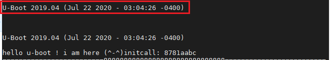

display_text_info函数：

.. code-block:: c
   :linenos:
   :caption: common/board_info.c
   :emphasize-lines: 6,7,9,10,15,16

   static int display_text_info(void)
   {
   #if !defined(CONFIG_SANDBOX) && !defined(CONFIG_EFI_APP)
      ulong bss_start, bss_end, text_base;

      bss_start = (ulong)&__bss_start;
      bss_end = (ulong)&__bss_end;

   #ifdef CONFIG_SYS_TEXT_BASE
      text_base = CONFIG_SYS_TEXT_BASE;
   #else
      text_base = CONFIG_SYS_MONITOR_BASE;
   #endif
      debug("=========================888888888888888888888888888888==========================\r\n");
      debug("U-Boot code: %08lX -> %08lX  BSS: -> %08lX\n",
            text_base, bss_start, bss_end);
   #endif

      return 0;
   }

1. 第6~7行，获取lds文件中__bss_start与__bss_end的地址，也就是BSS段的起始地址与末尾地址。

2. 第9~10行，通过宏CONFIG_SYS_TEXT_BASE得到代码段的基地址，该宏在include/generated/autoconf.h文件中被定义为0x87800000。

3. 第15~16行，打印出代码段基地址、BSS段起始地址以及BSS段末尾地址，打印信息如下图所示:

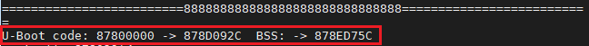

继续分析show_board_info函数：

.. code-block:: c
   :linenos:
   :caption: common/board_info.c
   :emphasize-lines: 11,714

   /*
    * If the root node of the DTB has a "model" property, show it.
    * Then call checkboard().
    */
   int __weak show_board_info(void)
   {
   #ifdef CONFIG_OF_CONTROL
      DECLARE_GLOBAL_DATA_PTR;
      const char *model;

      model = fdt_getprop(gd->fdt_blob, 0, "model", NULL);
      printf("++++++++++++++++++++++++++++++++++++++++++\r\n");
      if (model)
         printf("Model: %s\n", model);
   #endif

      return checkboard();
   }

1. 第11行，调用fdt_getprop函数，通过设备树地址gd->fdt_blob找到名字为“model”对应的板子信息。以imx6ull EVK pro开发板为例，其对应的设备树文件为arch/arm/dts/imx6ull-14x14-evk.dts，文件中有关于板子model信息的描述，用户可以根据需要修改此信息。

2. 第14行，打印板子信息，为了在uboot启动时方便找到这条打印信息，我自己添加了第13行，打印信息如下图所示：

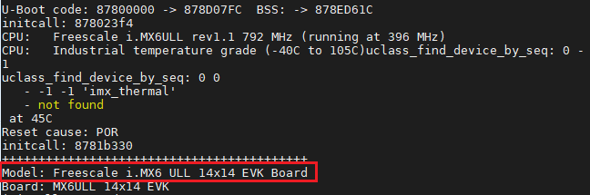

announce_dram_init函数：

.. code-block:: c
   :linenos:
   :caption: common/board_info.c
   :emphasize-lines: 3

   static int announce_dram_init(void)
   {
      puts("DRAM:  ");
      return 0;
   }

announce_dram_init函数预先打印“DRAM”，dram_init便紧接着初始化DRAM，打印信息如下：

.. image:: media/uboot_pro007.png
   :align: center
   :alt: 未找到图片01|

dram_init函数用于获取DRAM大小

.. code-block:: c
   :linenos:
   :caption: board/freescale/mx6ullevk/mx6ullevk.c
   :emphasize-lines: 3

   int dram_init(void)
   {
      gd->ram_size = imx_ddr_size();
      debug("DRAM大小为：\r\n", gd->ram_size);
      return 0;
   }

1. 第3行，获取DRAM大小。

2. 第4行，这行是我自己添加的，方便调试，调试信息如下所示：

.. image:: media/uboot_pro008.png
   :align: center
   :alt: 未找到图片01|

可见DRAM大小为0x20000000，也就是512M，说明我们现在用的是512M的DDR。

setup_dest_addr函数：

.. code-block:: c
   :linenos:
   :caption: common/board_f.c
   :emphasize-lines: 27

   static int setup_dest_addr(void)
   {
      debug("Monitor len: %08lX\n", gd->mon_len);
      /*
      * Ram is setup, size stored in gd !!
      */
      debug("Ram size: %08lX\n", (ulong)gd->ram_size);
   #if defined(CONFIG_SYS_MEM_TOP_HIDE)
      /*
      * Subtract specified amount of memory to hide so that it won't
      * get "touched" at all by U-Boot. By fixing up gd->ram_size
      * the Linux kernel should now get passed the now "corrected"
      * memory size and won't touch it either. This should work
      * for arch/ppc and arch/powerpc. Only Linux board ports in
      * arch/powerpc with bootwrapper support, that recalculate the
      * memory size from the SDRAM controller setup will have to
      * get fixed.
      */
      gd->ram_size -= CONFIG_SYS_MEM_TOP_HIDE;
   #endif
   #ifdef CONFIG_SYS_SDRAM_BASE
      gd->ram_base = CONFIG_SYS_SDRAM_BASE;
   #endif
      gd->ram_top = gd->ram_base + get_effective_memsize();
      gd->ram_top = board_get_usable_ram_top(gd->mon_len);
      gd->relocaddr = gd->ram_top;
      debug("Ram top: %08lX\n", (ulong)gd->ram_top);
   #if defined(CONFIG_MP) && (defined(CONFIG_MPC86xx) || defined(CONFIG_E500))
      /*
      * We need to make sure the location we intend to put secondary core
      * boot code is reserved and not used by any part of u-boot
      */
      if (gd->relocaddr > determine_mp_bootpg(NULL)) {
         gd->relocaddr = determine_mp_bootpg(NULL);
         debug("Reserving MP boot page to %08lx\n", gd->relocaddr);
      }
   #endif
      return 0;
   }

1. 第26~27行，打印RAM顶端地址gd->ram_top = gd->relocaddr = 0xa0000000。

DRAM初始化后，便完成DRAM的映射，重定位代码到DRAM，并且在DRAM中继续运行。

以上函数执行完毕后，我们再回过头看下gd结构体的成员，如下图所示：

.. image:: media/uboot_gd002.png
   :align: center
   :alt: 未找到图片01|

图中可以看到，DRAM的基地址为0x80000000，大小为0x20000000（512M），RAM顶端地址为0xa0000000 = 0x80000000 + 0x20000000（512M）。
重定位后地址为0x9ff02000。

reserve_round_4k函数：

.. code-block:: c
   :linenos:
   :caption: common/board_f.c
   :emphasize-lines: 4

   /* Round memory pointer down to next 4 kB limit */
   static int reserve_round_4k(void)
   {
      gd->relocaddr &= ~(4096 - 1);
      return 0;
   }

1. 第4行，将内存指针指向下一个4kB处，也就是4kB对齐，gd->relocaddr = 0xa0000000 & 0xfffff000 = 0xa0000000，所以对齐后gd->relocaddr不变。

reserve_mmu函数：

.. code-block:: c
   :linenos:
   :caption: common/board_f.c
   :emphasize-lines: 6,7,10,12,13,14

   #ifdef CONFIG_ARM
   __weak int reserve_mmu(void)
   {
   #if !(defined(CONFIG_SYS_ICACHE_OFF) && defined(CONFIG_SYS_DCACHE_OFF))
      /* reserve TLB table */
      gd->arch.tlb_size = PGTABLE_SIZE;
      gd->relocaddr -= gd->arch.tlb_size;    /* 从oxa0000000向下少了4K */
      debug("gd->relocaddr= %08lx to %08lx\n", gd->relocaddr,gd->arch.tlb_size);
      /* round down to next 64 kB limit */
      gd->relocaddr &= ~(0x10000 - 1);

      gd->arch.tlb_addr = gd->relocaddr;
      debug("TLB table from %08lx to %08lx\n", gd->arch.tlb_addr,
            gd->arch.tlb_addr + gd->arch.tlb_size);

   #ifdef CONFIG_SYS_MEM_RESERVE_SECURE
      /*
      * Record allocated tlb_addr in case gd->tlb_addr to be overwritten
      * with location within secure ram.
      */
      gd->arch.tlb_allocated = gd->arch.tlb_addr;
   #endif
   #endif

      return 0;
   }
   #endif

1. 第1行，CONFIG_ARM在include/generated/autoconf.h文件中被定义为1，故reserve_mmu函数被执行。

2. 第4行，我们没有定义CONFIG_SYS_ICACHE_OFF和CONFIG_SYS_DCACHE_OFF，故其相关代码块被执行。

3. 第6行，为TLB页表腾出空间，PGTABLE_SIZE为0x00004000 = 4096 * 4，它在arch/arm/include/asm/system.h文件中有如下定义：

.. code-block:: c
   :linenos:
   :caption: arch/arm/include/asm/system.h

   #define PGTABLE_SIZE		(4096 * 4)  /* PGTABLE_SIZE = 0x00004000 = 4096 * 4 */

4. 第7~8行，重定位地址gd->relocaddr = 0xfffc000 = 0xA0000000 - 4kB，第8行是我自己添加的，我们来看下它的打印信息：

.. image:: media/uboot_pro009.png
   :align: center
   :alt: 未找到图片01|

5. 第10行，四舍五入到下一个64kB，也就是做64kB对齐，页表必须64k对齐存放，即gd->relocaddr = 0xa0000000 - 0x00004000 = 9fffc000。

6. 第16行，CONFIG_SYS_MEM_RESERVE_SECURE没有定义，忽略相关代码块。

reserve_mmu函数主要是预留出4kB空间来存放mmu的TLB页表。

reserve_video和reserve_trace都没有做什么工作，我们不用分析，接着我们来分析reserve_uboot函数：

.. code-block:: c
   :linenos:
   :caption: common/board_f.c
   :emphasize-lines: 8,9,10,14,15,16,19,20

   static int reserve_uboot(void)
   {
      if (!(gd->flags & GD_FLG_SKIP_RELOC)) {
         /*
         * reserve memory for U-Boot code, data & bss
         * round down to next 4 kB limit
         */
         gd->relocaddr -= gd->mon_len;
         gd->relocaddr &= ~(4096 - 1);
      #if defined(CONFIG_E500) || defined(CONFIG_MIPS)
         /* round down to next 64 kB limit so that IVPR stays aligned */
         gd->relocaddr &= ~(65536 - 1);
      #endif
         debug("&&&&&&&&&&&&&&&&&&&&&&&&&&&&&&&&&&&&&&&&&&&&&&&&&&&&&&&&&&&&&&&&&&&&&&&&&&\r\n");
         debug("Reserving %ldk for U-Boot at: %08lx\n",
               gd->mon_len >> 10, gd->relocaddr);
      }

      gd->start_addr_sp = gd->relocaddr;     /* 将start_addr_sp也置为相同的位置 */
      debug("gd->start_addr_sp= %08lx\n",gd->start_addr_sp);
      
      return 0;
   }

1. 第8~9行，预留出949kB给u-Boot，同时做4kB对齐。

2. 第14行，我自己添加的，方便调试。

3. 第15行，打印信息如下图所示：

.. image:: media/uboot_pro0010.png
   :align: center
   :alt: 未找到图片01|

reserve_malloc函数：

.. code-block:: c
   :linenos:
   :caption: common/board_f.c
   :emphasize-lines: 4,5,6,7

   /* reserve memory for malloc() area */
   static int reserve_malloc(void)
   {
      gd->start_addr_sp = gd->start_addr_sp - TOTAL_MALLOC_LEN;
      debug("TOTAL_MALLOC_LEN: %08lx\n", TOTAL_MALLOC_LEN);
      debug("Reserving %dk for malloc() at: %08lx\n",
            TOTAL_MALLOC_LEN >> 10, gd->start_addr_sp);
      return 0;
   }

1. 第4行，为malloc腾出一段空间，TOTAL_MALLOC_LEN大小在include/common.h文件中有如下定义：

.. code-block:: c
   :linenos:
   :caption: include/common.h
   :emphasize-lines: 6

   #if defined(CONFIG_ENV_IS_EMBEDDED)          /* 未定义 */
   #define TOTAL_MALLOC_LEN	CONFIG_SYS_MALLOC_LEN
   #elif ( ((CONFIG_ENV_ADDR+CONFIG_ENV_SIZE) < CONFIG_SYS_MONITOR_BASE) || \
      (CONFIG_ENV_ADDR >= (CONFIG_SYS_MONITOR_BASE + CONFIG_SYS_MONITOR_LEN)) ) || \
         defined(CONFIG_ENV_IS_IN_NVRAM)  /* 有定义 */
   #define	TOTAL_MALLOC_LEN	(CONFIG_SYS_MALLOC_LEN + CONFIG_ENV_SIZE)  /* 只有该行通过条件编译 */  
   #else
   #define	TOTAL_MALLOC_LEN	CONFIG_SYS_MALLOC_LEN
   #endif

可以看出，TOTAL_MALLOC_LEN = CONFIG_SYS_MALLOC_LEN + CONFIG_ENV_SIZE。而CONFIG_SYS_MALLOC_LEN和CONFIG_ENV_SIZE在
include/configs/mx6ullevk.h文件中有如下定义：

.. code-block:: c
   :linenos:
   :caption: include/configs/mx6ullevk.h
   :emphasize-lines: 6

   /* Size of malloc() pool */
   #define CONFIG_SYS_MALLOC_LEN		(16 * SZ_1M)   /* SZ_1M在include/linux/sizes.h中被定义为0x00100000 */
   ...   /* 省略部分代码块 */
   #define CONFIG_ENV_SIZE			SZ_64K        /* SZ_64K在include/linux/sizes.h中被定义为0x00010000 */

由上可知，TOTAL_MALLOC_LEN = (16 * 0x00100000) + 0x00010000 = 0x01010000，我们接着分析reserve_malloc函数。

2. 第5~7行，为了验证TOTAL_MALLOC_LEN的大小，我自己添加第5行，用来调试，第6~7行是源码本有的，他们的调试信息如下：

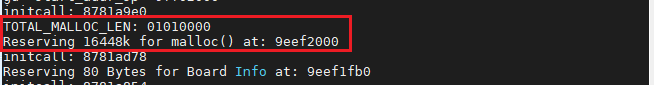

此时gd->start_addr_sp = 0x9eef2000，预留了16448kB给malloc，都是从高地址往下不断预留空间。

reserve_board函数：

.. code-block:: c
   :linenos:
   :caption: common/board_f.c
   :emphasize-lines: 5

   /* (permanently) allocate a Board Info struct */
   static int reserve_board(void)
   {
      if (!gd->bd) {
         gd->start_addr_sp -= sizeof(bd_t);
         gd->bd = (bd_t *)map_sysmem(gd->start_addr_sp, sizeof(bd_t));
         memset(gd->bd, '\0', sizeof(bd_t));
         debug("Reserving %zu Bytes for Board Info at: %08lx\n",
               sizeof(bd_t), gd->start_addr_sp);
      }
      return 0;
   }

1. 第5行，给bd预留空间，存放板子信息，如DRAM起始地址、DRAM大小、SRAM起始地址、SRAM大小、boot参数等，共预留了80字节，预留后gd->start_addr_sp = 0x9eef1fb0，如下图所示：

.. image:: media/uboot_pro0012.png
   :align: center
   :alt: 未找到图片01|

setup_machine是个空函数，跳过它继续分析reserve_global_data函数：

.. code-block:: c
   :linenos:
   :caption: common/board_f.c
   :emphasize-lines: 3

   static int reserve_global_data(void)
   {
      gd->start_addr_sp -= sizeof(gd_t);
      gd->new_gd = (gd_t *)map_sysmem(gd->start_addr_sp, sizeof(gd_t));
      debug("Reserving %zu Bytes for Global Data at: %08lx\n",
            sizeof(gd_t), gd->start_addr_sp);
      return 0;
   }

1. 第3~4行，预留256字节给new_gd（新的全局数据），预留后gd->start_addr_sp = 0x9eef1eb0，调试信息如下：

.. image:: media/uboot_pro0013.png
   :align: center
   :alt: 未找到图片01|

reserve_fdt函数：

.. code-block:: c
   :linenos:
   :caption: common/board_f.c
   :emphasize-lines: 12

   static int reserve_fdt(void)
   {
   #ifndef CONFIG_OF_EMBED
      /*
      * If the device tree is sitting immediately above our image then we
      * must relocate it. If it is embedded in the data section, then it
      * will be relocated with other data.
      */
      if (gd->fdt_blob) {
         gd->fdt_size = ALIGN(fdt_totalsize(gd->fdt_blob) + 0x1000, 32);

         gd->start_addr_sp -= gd->fdt_size;
         gd->new_fdt = map_sysmem(gd->start_addr_sp, gd->fdt_size);
         debug("Reserving %lu Bytes for FDT at: %08lx\n",
               gd->fdt_size, gd->start_addr_sp);
      }
   #endif

      return 0;
   }

1. 第12行，预留40032字节存放设备树信息。

reserve_bootstage、reserve_bloblist、reserve_arch、dram_init_banksize都是空函数，所以到此内存就已经分配完了。

而reloc_fdt函数负责将设备树数据搬运到新分配的new_fdt地址中去,如下所示:

.. code-block:: c
   :linenos:
   :caption: common/board_f.c
   :emphasize-lines: 7,8

   static int reloc_fdt(void)
   {
   #ifndef CONFIG_OF_EMBED    /* 有定义 */
      if (gd->flags & GD_FLG_SKIP_RELOC)
         return 0;
      if (gd->new_fdt) {
         memcpy(gd->new_fdt, gd->fdt_blob, gd->fdt_size);
         gd->fdt_blob = gd->new_fdt;
      }
   #endif

      return 0;
   }

1. 第7行，将老的设备树段拷贝到新的设备树段。

2. 第8行，将老的设备树地址更新为新的设备树地址。

setup_reloc 函数：

.. code-block:: c
   :linenos:
   :caption: common/board_f.c
   :emphasize-lines: 18,21

   static int setup_reloc(void)
   {
      if (gd->flags & GD_FLG_SKIP_RELOC) {
         debug("Skipping relocation due to flag\n");
         return 0;
      }

   #ifdef CONFIG_SYS_TEXT_BASE
   #ifdef ARM
      gd->reloc_off = gd->relocaddr - (unsigned long)__image_copy_start;
   #elif defined(CONFIG_M68K)
      /*
      * On all ColdFire arch cpu, monitor code starts always
      * just after the default vector table location, so at 0x400
      */
      gd->reloc_off = gd->relocaddr - (CONFIG_SYS_TEXT_BASE + 0x400);
   #else
      gd->reloc_off = gd->relocaddr - CONFIG_SYS_TEXT_BASE;
   #endif
   #endif
      memcpy(gd->new_gd, (char *)gd, sizeof(gd_t));   /* 将gd重定位到new_gd中 */

      debug("Relocation Offset is: %08lx\n", gd->reloc_off);
      debug("Relocating to %08lx, new gd at %08lx, sp at %08lx\n",
            gd->relocaddr, (ulong)map_to_sysmem(gd->new_gd),
            gd->start_addr_sp);

      return 0;
   }

1. 第18行，计算新旧uboot的偏移，便宜值为0x18702000。

1. 第21行，将gd重定位到new_gd中。

我们再回过头来看看此时的全局数据表格：

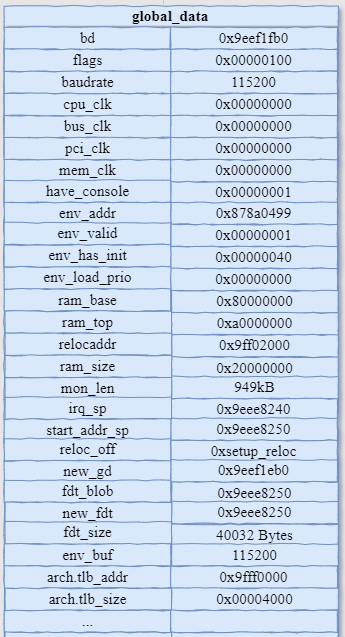

board_init_f中的内容就已经分析完了，接下来就剩下uboot自身的重定位和bss段的初始化。
接下来我们看看u-boot中重要的函数relocate_code，它是如何实现u-boot自身重定位的。

relocate_code函数分析：

.. code-block:: c
   :linenos:
   :caption: arch/arm/lib/relocate.S
   :emphasize-lines: 2,5,7,8,9,10,11

      ENTRY(relocate_code)
      ldr	r1, =__image_copy_start	/* r1 <- SRC &__image_copy_start */
      subs	r4, r0, r1		/* r4 <- relocation offset */
      beq	relocate_done		/* skip relocation */
      ldr	r2, =__image_copy_end	/* r2 <- SRC &__image_copy_end */

   copy_loop:
      ldmia	r1!, {r10-r11}		/* copy from source address [r1]    */
      stmia	r0!, {r10-r11}		/* copy to   target address [r0]    */
      cmp	r1, r2			/* until source end address [r2]    */
      blo	copy_loop

      /*
      * fix .rel.dyn relocations
      */
      ldr	r2, =__rel_dyn_start	/* r2 <- SRC &__rel_dyn_start */
      ldr	r3, =__rel_dyn_end	/* r3 <- SRC &__rel_dyn_end */
   fixloop:
      ldmia	r2!, {r0-r1}		/* (r0,r1) <- (SRC location,fixup) */
      and	r1, r1, #0xff
      cmp	r1, #R_ARM_RELATIVE
      bne	fixnext

      /* relative fix: increase location by offset */
      add	r0, r0, r4
      ldr	r1, [r0]
      add	r1, r1, r4
      str	r1, [r0]
   fixnext:
      cmp	r2, r3
      blo	fixloop

   relocate_done:

   #ifdef __XSCALE__
      /*
      * On xscale, icache must be invalidated and write buffers drained,
      * even with cache disabled - 4.2.7 of xscale core developer's manual
      */
      mcr	p15, 0, r0, c7, c7, 0	/* invalidate icache */
      mcr	p15, 0, r0, c7, c10, 4	/* drain write buffer */
   #endif

      /* ARMv4- don't know bx lr but the assembler fails to see that */

   #ifdef __ARM_ARCH_4__
      mov	pc, lr
   #else
      bx	lr
   #endif

   ENDPROC(relocate_code)

1. 第2行，将__image_copy_start地址加载到r1寄存器当中。

2. 第3行，带借位的减法指令subs，其中最后一个s表示将进位结果写入CPSR寄存器中。该指令的意思是r4 = r0 - r1，其中在调用relocate_code函数之前r0保存着gd->relocaddr的值，是一个偏移地址。

3. 第4行，如果r0与r1后地址相等，则表示不用拷贝，直接跳过拷贝工作，否则需要重定位。

4. 第5行，将__image_copy_end地址加载到r2寄存器，还记得我们前面讲的u-boot.lds链接脚本文件么？大家可以回过头对照一下。从__image_copy_start地址到__image_copy_end地址中间包含了代码段、数据段以及只读数据段，但是不包括动态链接rel_dyn部分。

5. 第7~11行，比较源代码起始地址是否等于结束地址，如果相等则结束，不相等继续循环拷贝代码段、数据段以及只读数据段；每次从源代码地址中复制出8字节数据传入r10和r11寄存器，改变r1的地址，然后放到目标地址r0起始段中，改变r0的地址，之后比较源代码首地址与结束地址，当相等时，结束循环，完成代码段的拷贝。

6. 第16~17行，分别将__rel_dyn_start与__rel_dyn_end地址加载到r2和r3寄存器中。

7. 第18~25行，将__rel_dyn_start地址上连续8字节地址的值存在r0和r1中，接着判断r1中的值低8位数据，如果为23，则将r0中的值加重定位偏移值（relocation offset）。

8. 第26~28行，加载r0地址中的数据到r1中，然后与偏移值（relocation offset）相加后放到r1中，最后再将相加后的数据放到以r0地址所在的空间中。如此周而复始，直到修改完整个__rel_dyn段后结束，完成重定位。

再重定位u-boot后又返回到arch/arm/lib/crt0.S文件中调用relocate_vectors函数，该函数我就不再一句一句
分析了，感兴趣的同学可以自己认真分析一遍，详细带着大家分析完这么多汇编代码后，对ARM启动流程也有一定的了解了。
套路都是一样一样的，重定位、重定位、重定位！重要的事情说三遍。relocate_vectors函数主要完成的工作就是实现
异常向量表的重定位，拷贝到正确的地址中去。

执行完relocate_vectors之后，继续回到_main函数中到用处，执行c_runtime_cpu_setup函数。
官方称c_runtime_cpu_setup为老一套，哈哈！还真是如此，又是关闭指令缓存I-cache。
c_runtime_cpu_setup函数如下所示：

.. code-block:: c
   :linenos:
   :caption: arch/arm/lib/relocate.S

   ENTRY(c_runtime_cpu_setup)
   /*
   * If I-cache is enabled invalidate it
   */
   #ifndef CONFIG_SYS_ICACHE_OFF
      mcr	p15, 0, r0, c7, c5, 0	@ invalidate icache
      mcr     p15, 0, r0, c7, c10, 4	@ DSB
      mcr     p15, 0, r0, c7, c5, 4	@ ISB
   #endif

      bx	lr

ENDPROC(c_runtime_cpu_setup)

大家对照前面讲的cpu_init_cp15函数自行分析，都是老套路了，一模一样，重定位后到了新的介质中运行也是要
设置一下运行环境。

接着回到spl_relocate_stack_gd函数，该函数主要作用是重新定位堆栈，以便执行后面的board_init_r函数，
为了提供更大的堆栈空间，但是我们并没有重定位堆栈。所以不用分析它。

紧接着分析一下u-boot是如何清除BSS段的，又是一个比较有趣的地方，不废话了，直接附上源代码：

.. code-block:: c
   :linenos:
   :caption: arch/arm/lib/crt0.S
   :emphasize-lines: 1,4,7,8

   	ldr	r0, =__bss_start	/* this is auto-relocated! */

   #ifdef CONFIG_USE_ARCH_MEMSET /* jason mark--->configs/mx6ull_npi_defconfig have define */
      ldr	r3, =__bss_end		/* this is auto-relocated! */
      mov	r1, #0x00000000		/* prepare zero to clear BSS */

      subs	r2, r3, r0		/* r2 = memset len */
      bl	memset
   #else

1. 第1行，加载BSS段的起始地址__bss_start到r0中。

2. 第4行，加载BSS段的末尾地址__bss_end到r3中。

3. 第7行，将BSS段的末尾地址减去BSS段的起始地址得到要清除的BSS段的大小。

4. 第8行，调用memset函数清除BSS段，memset函数的使用大家都很熟悉了吧？，其中r0作为第一个参数、r1作为第二个参数、r2作为第三个参数。

u-boot启动第二阶段源代码分析
'''''''

第二阶段主要完成板级初始化、emmc初始化、控制台初始化、中断初始化及网络初始化等，流程图如下所示：

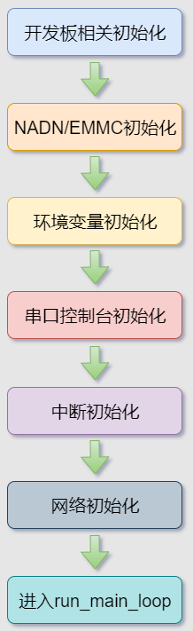

首先分析board_init_r函数：

.. code-block:: c
   :linenos:
   :caption: common/board_r.c
   :emphasize-lines: 14,21

   void board_init_r(gd_t *new_gd, ulong dest_addr)
   {
   #if CONFIG_IS_ENABLED(X86_64)
      arch_setup_gd(new_gd);
   #endif

   #ifdef CONFIG_NEEDS_MANUAL_RELOC
      int i;
   #endif

   #if !defined(CONFIG_X86) && !defined(CONFIG_ARM) && !defined(CONFIG_ARM64)
      gd = new_gd;
   #endif
      gd->flags &= ~GD_FLG_LOG_READY;

   #ifdef CONFIG_NEEDS_MANUAL_RELOC
      for (i = 0; i < ARRAY_SIZE(init_sequence_r); i++)
         init_sequence_r[i] += gd->reloc_off;
   #endif

      if (initcall_run_list(init_sequence_r))
         hang();

      /* NOTREACHED - run_main_loop() does not return */
      hang();
   }

1. 第14行，标记gd->flags，取消log就绪标志。

2. 第21行，遍历且初始化函数指针数组init_sequence_r[]所指向的每一个函数。

然后我们大致分析一下函数指针数组init_sequence_r[]里的成员函数指针，首先全局预览一下该数组，
为了方便分析，我将不符合条件编译部分去除了。

.. code-block:: c
   :linenos:
   :caption: common/board_r.c

   /*
   * We hope to remove most of the driver-related init and do it if/when
   * the driver is later used.
   *
   * TODO: perhaps reset the watchdog in the initcall function after each call?
   */
   static init_fnc_t init_sequence_r[] = {
      initr_trace,               /* 初始化与跟踪调试相关部分 */
      initr_reloc,               /* 标记重定位完成 */
      initr_caches,              /* 使能cache */
      initr_reloc_global_data,   /* 初始化重定位后的gd成员 */
      initr_barrier,             /* imx6ull未用到 */
      initr_malloc,              /* 初始化malloc */
      log_init,                  /* log初始化 */
      initr_bootstage,	/* Needs malloc() but has its own timer */
      initr_console_record,      /* 初始化控台 */
      bootstage_relocate,        
      initr_dm,                  /* 设备模型初始化 */
      board_init,                /* 板级初始化 */
      efi_memory_init,           /* efi_memory初始化 */
      stdio_init_tables,         /* 标准输入输出及标准错误等初始化 */
      initr_serial,              /* 串口初始化 */
      initr_announce,            /* 跟调试相关 */
      power_init_board,          /* 电源芯片初始化 */
      initr_nand,                /* nandflash初始化 */
      initr_mmc,                 /* mmc初始化 */
      initr_env,                 /* 环境变量初始化 */
      initr_secondary_cpu,       /* 其他cpu初始化，由于imx6ull为单核cpu故忽略 */
      stdio_add_devices,         /* 输入输出设备初始化 */
      initr_jumptable,           /* 初始化跳转表 */
      console_init_r,		      /* 控制台初始化 */
      interrupt_init,            /* 中断初始化 */
      initr_enable_interrupts,   /* 中断使能 */
      /* PPC has a udelay(20) here dating from 2002. Why? */
      initr_ethaddr,             /* 网络初始化 */
      board_late_init,           /* 板子后续初始化 */
      initr_fastboot_setup,      
      initr_net,                 /* 网络初始化 */
      initr_check_fastboot,     
      run_main_loop,             /* 运行主循环 */
   };

预览完上面的函数指针数组后，应该的对本阶段做做的工作有了大致的了解，下面我们将详细分析函数指针数组中的成员。

initr_trace函数，由于我们并没有定义与调试相关的宏，所以这部分代码可以省略。

initr_reloc函数:

.. code-block:: c
   :linenos:
   :caption: common/board_r.c
   :emphasize-lines: 4

   static int initr_reloc(void)
   {
      /* tell others: relocation done */
      gd->flags |= GD_FLG_RELOC | GD_FLG_FULL_MALLOC_INIT; /* 标记已经重定位成功，malloc初始化 */

      return 0;
   }

1. 第4行，标记gd->flags，表示已经完成了重定位与malloc的初始化。

initr_reloc函数:

.. code-block:: c
   :linenos:
   :caption: common/board_r.c
   :emphasize-lines: 8

   /*
    * Some of these functions are needed purely because the functions they
    * call return void. If we change them to return 0, these stubs can go away.
    */
   static int initr_caches(void)
   {
      /* Enable caches */
      enable_caches();
      return 0;
   }

1. 第8行，enable_caches函数，首先检查I-cache的使能状态，如果未使能I-cache则将其使能，接着使能D-cache。

initr_reloc_global_data函数（省略不符合条件编译部分）：

.. code-block:: c
   :linenos:
   :caption: common/board_r.c

   static int initr_reloc_global_data(void)
   {
      monitor_flash_len = (ulong)&__init_end - gd->relocaddr;
      gd->env_addr += gd->reloc_off;
   #ifdef CONFIG_EFI_LOADER
      efi_runtime_relocate(gd->relocaddr, NULL);
   #endif

      return 0;
   }

1. 第3~4行，设置monitor_flash_len及gd成员env_addr=0x878a0499，重新定位早期的env_addr指针，我们打印一下定位后该地址存放的数据，看看是不是环境变量，如下图所示。

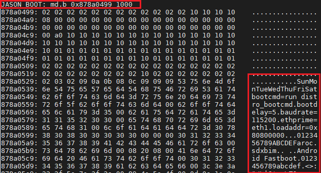

其实我们在fire-config中修改的也就是环境变量中/boot/uEnv.txt文件，通过配饰该文件可以选择是否加载对应的设备树，我们分别对照一下include/configs/npi_common.h中的UBI_BOOT环境变量
与存在env_addr所指向的内存地址处的环境变量，是一模一样的。

.. image:: media/uboot_pro031.png
   :align: center
   :alt: 未找到图片05|

.. image:: media/uboot_pro032.png
   :align: center
   :alt: 未找到图片05|

2. 第6行，实现重定位，将EFI runtime重新定位到gd->relocaddr，重定位调试信息如下所示。

.. image:: media/uboot_pro028.png
   :align: center
   :alt: 未找到图片05|

initr_barrier函数，由于我们没有配置CONFIG_PPC宏，故忽略。

.. code-block:: c
   :linenos:
   :caption: common/board_r.c
   :emphasize-lines: 10,11,12

   static int initr_malloc(void)
   {
      ulong malloc_start;

   #if CONFIG_VAL(SYS_MALLOC_F_LEN)
      debug("Pre-reloc malloc() used %#lx bytes (%ld KB)\n", gd->malloc_ptr,
            gd->malloc_ptr / 1024);
   #endif
      /* The malloc area is immediately below the monitor copy in DRAM */
      malloc_start = gd->relocaddr - TOTAL_MALLOC_LEN;
      mem_malloc_init((ulong)map_sysmem(malloc_start, TOTAL_MALLOC_LEN),
            TOTAL_MALLOC_LEN);
      return 0;
   }

1. 第10~12行，分配malloc内存空间并将其初始化，malloc区域位域u-boot区的下方，我们来看下调试信息，看看这段代码的具体地址。

.. image:: media/uboot_pro0018.png
   :align: center
   :alt: 未找到图片05|

从上可以看出malloc区域位域0x9eef2000地址~0x9ff02000地址之间

log_init函数主要是分配log驱动空间，设置gd->flags中的log就绪标志，前面讲到过清除该标志，这里便置位log标志，并且设置log等级，
比如以哪个等级为界限，该等级之上的都可以被log，最后设置log的格式。

initr_bootstage函数标记引导阶段。

initr_console_record函数为空函数，忽略。

bootstage_relocate函数，这是完整的bootstage实现，重定位当前的bootstage记录。

initr_of_live函数为空函数，忽略。

initr_dm函数，此函数就比较重要了，也相对复杂，因为涉及到设备驱动模型，下面我们将细细道来。
驱动模型关键：

- 驱动模型绑定->ofdata_to_platdata(可选)->probe

initr_dm函数如下：

.. code-block:: c
   :linenos:
   :caption: common/board_r.c
   :emphasize-lines: 7,13

   #ifdef CONFIG_DM
   static int initr_dm(void)
   {
      int ret;

      /* Save the pre-reloc driver model and start a new one */
      gd->dm_root_f = gd->dm_root;
      gd->dm_root = NULL;
   #ifdef CONFIG_TIMER
      gd->timer = NULL;
   #endif
      bootstage_start(BOOTSTATE_ID_ACCUM_DM_R, "dm_r");
      ret = dm_init_and_scan(false);
      bootstage_accum(BOOTSTATE_ID_ACCUM_DM_R);
      if (ret)
         return ret;
   #ifdef CONFIG_TIMER_EARLY
      ret = dm_timer_init();
      if (ret)
         return ret;
   #endif

      return 0;
   }
   #endif

1. 第7行，首先保存以前分配的驱动模型（DM），并且开始设置一个新的驱动模型。

2. 第13行，初始化并扫描驱动模型。

我们总体看下它的函数调用顺序。

.. code-block:: c
   :linenos:
   :caption: drivers/core/root.c

   initr_dm() //初始化一个树形的驱动模型结构
      dm_init_and_scan()  //初始化根节点的设备，同时绑定根节点下的全部子节点
         dm_init  //绑定根节点到gd->dm_root中，并初始化根节点下的设备
            device_bind_by_name //根据名字绑定，查找和设备信息匹配的driver，然后创建对应的udevice和uclass并进行绑定，最后放在DM_ROOT_NON_CONST中
               device_probe //对根设备执行probe操作，
         dm_scan_platdata //绑定子节点
            lists_bind_drivers //绑定驱动链表
         dm_extended_scan_fdt //在其他地方（设备树）搜索设备并进行驱动匹配，然后绑定
            dm_scan_fdt //扫描设备树并绑定节点的驱动
               dm_scan_fdt_node //绑定设备的入口，在该函数中会确定设备是否具有相关属性，如果没有则不会绑定
                  lists_bind_fdt //搜索可以匹配到该设备的驱动
                     device_bind_with_driver_data //匹配到了驱动器就会信息绑定
                        device_bind_common //将设备节点和父节点建立树形结构
                           uclass_bind_device //将该设备挂在相应的dev->uclass_node链表上
                           drv->bind(dev) 将设备绑定到对应的驱动
                           parent->driver->child_post_bind(dev) //父节点驱动的child_post_bind接口函数
                           uc->uc_drv->post_bind(dev) //在新设备绑定到此uclass后调用，设备节点在此接口下在soc下进行展开
            dm_scan_fdt_ofnode_path //扫描"/clocks"节点
               dm_scan_fdt_node     //在该函数中会确定设备是否具有clocks相关属性，如果没有则不会绑定
            dm_scan_fdt_ofnode_path //扫描"/firmware"节点
               dm_scan_fdt_node     //在该函数中会确定设备是否具有firmware相关属性，如果没有则不会绑定
         dm_scan_other  //扫描其他设备

完成以上函数的执行后，在内存中也就形成了一个至少深度为2的树形结构（假设有子节点），其中gd->dm_root
保存着根节点的信息。

以上函数完成了绑定，接下来就是probe了，接着我们看下imx6ull EVK pro开发板对应的设备树信息，由于设备树比较庞大，
我这里提取出部分信息，如下图所示

.. code-block:: dtsi
   :linenos:
   :caption: arch/arm/dts/imx6ull.dtsi

   / {
      soc {

         aips1: aips-bus@02000000 {
               spba-bus@02000000 {
                  compatible = "fsl,spba-bus", "simple-bus";
                  #address-cells = <1>;
                  #size-cells = <1>;
                  reg = <0x02000000 0x40000>;
                  ranges;

                  uart1: serial@02020000 {
                  compatible = "fsl,imx6ul-uart",
                        "fsl,imx6q-uart", "fsl,imx21-uart";
                  reg = <0x02020000 0x4000>;
                  interrupts = <GIC_SPI 26 IRQ_TYPE_LEVEL_HIGH>;
                  clocks = <&clks IMX6UL_CLK_UART1_IPG>,
                     <&clks IMX6UL_CLK_UART1_SERIAL>;
                  clock-names = "ipg", "per";
                  status = "disabled";
                  };

                  uart7: serial@02018000 {
                  compatible = "fsl,imx6ul-uart",
                        "fsl,imx6q-uart", "fsl,imx21-uart";
                  reg = <0x02018000 0x4000>;
                  interrupts = <GIC_SPI 39 IRQ_TYPE_LEVEL_HIGH>;
                  clocks = <&clks IMX6UL_CLK_UART7_IPG>,
                     <&clks IMX6UL_CLK_UART7_SERIAL>;
                  clock-names = "ipg", "per";
                  dmas = <&sdma 43 4 0>, <&sdma 44 4 0>;
                  dma-names = "rx", "tx";
                  status = "disabled";
                  };

               }
               tsc: tsc@02040000 {
               compatible = "fsl,imx6ul-tsc";
               reg = <0x02040000 0x4000>, <0x0219c000 0x4000>;
               interrupts = <GIC_SPI 3 IRQ_TYPE_LEVEL_HIGH>,
                     <GIC_SPI 101 IRQ_TYPE_LEVEL_HIGH>;
               clocks = <&clks IMX6UL_CLK_IPG>,
                  <&clks IMX6UL_CLK_ADC2>;
               clock-names = "tsc", "adc";
               status = "disabled";
               };
         }
      }

   }

可以归纳出其一级子节点树形结构如下图所示：

.. image:: media/dev_tree002.png
   :align: center
   :alt: 未找到图片05|

接着我们简单描述一下pribe的流程，函数的调用顺寻如下：

.. code-block:: c
   :linenos:
   :caption: drivers/core/device.c

   dm_init
      device_probe(dev)
         device_probe(dev)     //递归probe parent节点
         uclass_resolve_seq(dev) //分配一个seq给此设备
            uclass_find_device_by_seq //根据ID和顺序查找uclass设备
               uclass_get  //根据ID获取uclass，如果需要的话创建它
         dev->flags |= DM_FLAG_ACTIVATED;  //设置dev->flags，表示该设备已经被激活
         pinctrl_select_state(dev, "default"); //初始化相关引脚
         uclass_pre_probe_device //处理probe后的设备
         dev->parent->driver->child_pre_probe(dev) //执行父节点驱动的child_pre_probe接口函数
         drv->ofdata_to_platdata(dev)  //执行设备驱动的ofdata_to_platdata接口函数
         clk_set_defaults(dev) //设置默认时钟
         drv->probe(dev) //配置驱动中的probe接口
         uclass_post_probe_device(dev) //调用所属class驱动的post_probe接口函数

我们可以发现device_probe时都会先调用一下drv->ofdata_to_platdata(dev)，
之后才会去执行probe接口函数，我们可以看下drivers/core/uclass.c文件中
uclass_find_device_by_seq函数的调试信息，其实u-boot是建立了一个哈希表来存放设备树的，
下面是搜索遍历根节点设备的信息，当你打开debug后便会发现，串口控制台打印的很大一部分信息都是搜索设备树的信息。

.. image:: media/uboot_pro020.png
   :align: center
   :alt: 未找到图片05|

紧接着看下我们的设备树文件imx6ull.dtsi看看是不是一模一样的，^-^。

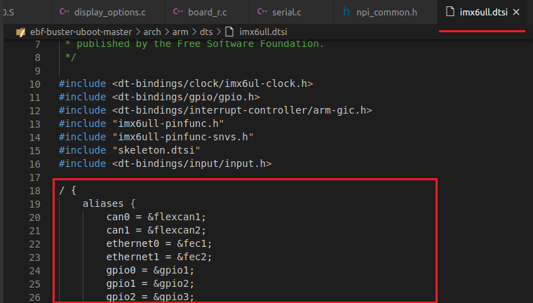

由于要深入理解设备模型比较复杂，我们只要熟悉一下它的工作流程即可。

board_init函数：

.. code-block:: c
   :linenos:
   :caption: drivers/core/device.c
   :emphasize-lines: 4

   int board_init(void)
   {
      /* Address of boot parameters */
      gd->bd->bi_boot_params = PHYS_SDRAM + 0x100;

   #ifdef	CONFIG_FEC_MXC
      setup_fec(CONFIG_FEC_ENET_DEV);
   #endif

   #ifdef CONFIG_FSL_QSPI
      board_qspi_init();
   #endif

   #ifdef CONFIG_NAND_MXS
      setup_gpmi_nand();
   #endif

      return 0;
   }

1. 第4行，此函数只有该行被执行，意思是设置启动参数的地址，其中PHYS_SDRAM被定义为0x10000000，因此gd->bd->bi_boot_params = 0x10000000 + 0x100 = 0x10000100。

stdio_init_tables函数，因为该函数没有被配置相关的宏，所以没有做什么工作，忽略。

initr_serial函数：该函数完成串口相关初始化，该函数还是有很多东西值得挖掘的，代码如下。

.. code-block:: c
   :linenos:
   :caption: common/board_r.c
   :emphasize-lines: 4

   static int initr_serial(void)
   {
      serial_initialize();
      return 0;
   }

这里我们并没有看到什么复杂操作，我们到进入serial_initialize函数里面看看。

.. code-block:: c
   :linenos:
   :caption: drivers/serial/serial.c
   :emphasize-lines: 21

   /**
    * serial_initialize() - Register all compiled-in serial port drivers
    *
    * This function registers all serial port drivers that are compiled
    * into the U-Boot binary with the serial core, thus making them
    * available to U-Boot to use. Lastly, this function assigns a default
    * serial port to the serial core. That serial port is then used as a
    * default output.
    */
   void serial_initialize(void)
   {
      atmel_serial_initialize();
      mcf_serial_initialize();
      mpc85xx_serial_initialize();
      mxc_serial_initialize();
      ns16550_serial_initialize();
      pl01x_serial_initialize();
      pxa_serial_initialize();
      sh_serial_initialize();

      serial_assign(default_serial_console()->name);
   }

1. 第12~19行，这些函数并没有初始化实际的硬件，他们单纯的向u-boot注册一下struct serial_device类型的串口设备。

2. 第21行，serial_assign函数查找当前所使用的串口设备，同时把对应的结构体地址传给指向当前使用的串口设备指针serial_current。其遍历serial_devices，并根据设备名字匹配串口。

initr_announce函数，该函数只有一行debug打印调试信息的代码，表示RAM正在运行，且u-boot已经完成了重定位，调试信息如下图所示：

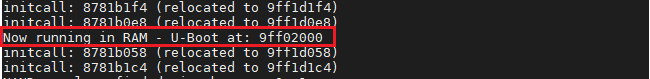

power_init_board函数，此函数为空函数，忽略。

initr_nand函数：

.. code-block:: c
   :linenos:
   :caption: common/board_r.c
   :emphasize-lines: 6

   #ifdef CONFIG_CMD_NAND
   /* go init the NAND */
   static int initr_nand(void)
   {
      puts("NAND:  ");
      nand_init();
      printf("%lu MiB\n", nand_size() / 1024);
      return 0;
   }
   #endif

1. 第5行，打印"NAND:  "信息到串口控制台，表示要初始化nand了，这是对于nand版本6u而言的，由于我目前使用的是emmc，故此函数什么也没做。

initr_mmc函数：

.. code-block:: c
   :linenos:
   :caption: drivers/mmc/mmc.c
   :emphasize-lines: 4

   static int initr_mmc(void)
   {
      puts("MMC:   ");
      mmc_initialize(gd->bd);
      return 0;
   }

我们将第4行mmc_initialize函数展开分析一下。

.. code-block:: c
   :linenos:
   :caption: drivers/mmc/mmc.c
   :emphasize-lines: 5,6,7,14

   int mmc_initialize(bd_t *bis)
   {
      static int initialized = 0;
      int ret;
      if (initialized)	/* Avoid initializing mmc multiple times */
         return 0;
      initialized = 1;

   #if !CONFIG_IS_ENABLED(BLK)
   #if !CONFIG_IS_ENABLED(MMC_TINY)
      mmc_list_init();
   #endif
   #endif
      ret = mmc_probe(bis);
      if (ret)
         return ret;

   #ifndef CONFIG_SPL_BUILD
      print_mmc_devices(',');
   #endif

      mmc_do_preinit();
      return 0;
   }

1. 第5~7行，为了避免重复初始化emmc，所以设置了一个initialized标志位，只初始化一次emmc。

2. 第14行，初始化emmc。

initr_env函数：

.. code-block:: c
   :linenos:
   :caption: common/board_r.c
   :emphasize-lines: 6,14,28

   static int initr_env(void)
   {
      char *p;

      /* initialize environment */
      if (should_load_env())
         env_relocate();
      else
         set_default_env(NULL, 0);
   #ifdef CONFIG_OF_CONTROL
      env_set_hex("fdtcontroladdr",
            (unsigned long)map_to_sysmem(gd->fdt_blob));
   #endif
      if(1 == check_mmc_num())
      {
         env_set("storage_media","init=/opt/scripts/tools/Nand/init-Nand-flasher-v1.sh");
         p = env_get("storage_media");
         printf("WARNING:%s\n",p);
      }
      else
      {
         env_set("storage_media","init=/opt/scripts/tools/eMMC/init-eMMC-flasher-v3.sh");
         p = env_get("storage_media");
         printf("WARNING:%s\n",p);
      }
      
      /* Initialize from environment */
      load_addr = env_get_ulong("loadaddr", 16, load_addr);
      printf("$$$$$$$$$$$$$$$$$$$$$$$$$$$$$$$$WARNING:%X\n",load_addr); //为方便调试添加，查看加载地址
      return 0;
   }

1. 第6~9行，检查早期在u-boot中的环境变量是否OK，和FDT核对一下，默认它是OK的，如果早期的环境变量OK就则找到且加载环境变量，否则使用默认的环境变量。

我没进入env_relocate函数看看，到底发送了什么。

.. code-block:: c
   :linenos:
   :caption: env/common.c
   :emphasize-lines: 8,17

   void env_relocate(void)
   {
   #if defined(CONFIG_NEEDS_MANUAL_RELOC)
      env_reloc();
      env_fix_drivers();
      env_htab.change_ok += gd->reloc_off;
   #endif
      if (gd->env_valid == ENV_INVALID) {
   #if defined(CONFIG_ENV_IS_NOWHERE) || defined(CONFIG_SPL_BUILD)
         /* Environment not changable */
         set_default_env(NULL, 0);
   #else
         bootstage_error(BOOTSTAGE_ID_NET_CHECKSUM);
         set_default_env("bad CRC", 0);
   #endif
      } else {
         env_load();
      }
   }

我们看第8行，大家可以回归头去看看我们前面化的global_data表格，其中gd->env_valid是等于1，即等于ENV_VALID的，如果等于0就会使用默认的环境变量，所以我们直接
分析env_load()函数了。

.. code-block:: c
   :linenos:
   :caption: env/common.c
   :emphasize-lines: 7,17,24

   int env_load(void)
   {
      struct env_driver *drv;
      int best_prio = -1;
      int prio;

      for (prio = 0; (drv = env_driver_lookup(ENVOP_LOAD, prio)); prio++) {
         int ret;

         if (!drv->load)
            continue;

         if (!env_has_inited(drv->location))
            continue;

         printf("#################################################################################\r\n");
         printf("Loading Environment from %s... ", drv->name);
         printf("#################################################################################\r\n");
         /*
         * In error case, the error message must be printed during
         * drv->load() in some underlying API, and it must be exactly
         * one message.
         */
         ret = drv->load();
         if (!ret) {
            printf("OK\n");
            return 0;
         } else if (ret == -ENOMSG) {
            /* Handle "bad CRC" case */
            if (best_prio == -1){
               best_prio = prio;
               printf("%%%%%%%%%%%%%%%%%%%%%%%%%%%%% %d\n", best_prio);
            }
         } else {
            debug("Failed (%d)\n", ret);
         }
      }

      /*
      * In case of invalid environment, we set the 'default' env location
      * to the best choice, i.e.:
      *   1. Environment location with bad CRC, if such location was found
      *   2. Otherwise use the location with highest priority
      *
      * This way, next calls to env_save() will restore the environment
      * at the right place.
      */
      if (best_prio >= 0)
         debug("Selecting environment with bad CRC\n");
      else
         best_prio = 0;
      env_get_location(ENVOP_LOAD, best_prio);

      return -ENODEV;
   }

首先看到第7行中的env_driver_lookup函数，它负责找到最适合的环境位置，成功后返回一个指向env_driver的指针，
env_driver包含了存储设备的名字、从存储器加载环境的方法、保存环境到存储设备的方法以及设置初始的预搬迁环境的方法；
第13行查看环境是否已经初始化过了；第16~18行，其中16与18行是我为了方便调试添加的；第24行，加载环境变量，如果加载成功则打印“OK”，
环境变量中没有消息则打印32行数据，此行是我添加的，实际上会打印出第32行字符串。CRC校验失败，最后会使用自己设置的环境变量，我们再返回到initr_env函数
，对照第14行，由于我们使用的是emmc所以check_mmc_num()返回值是2，及打印第22行对应的"init=/opt/scripts/tools/eMMC/init-eMMC-flasher-v3.sh"环境变量信息。
如下图所示：

.. image:: media/uboot_pro022.png
   :align: center
   :alt: 未找到图片05|

然后我们进入u-boot的命令行模式，打印一下“storage_media”这个环境变量看看是不是和我们预想的一样！

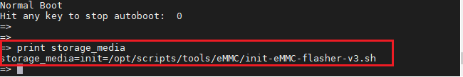

在这里我们要说一下，当其运行ret = drv->load()，它调用blk_find_device函数遍历加载环境变量时，为了方便管理环境变量，首先会创建一个哈希表，哈希表是基于哈希函数建立的一种查找表，然后将
环境变量都依次填到哈希表中，调试信息如下所示。

.. image:: media/uboot_pro033.png
   :align: center
   :alt: 未找到图片05|

知识集锦【数据结构之什么是哈希表？】：

- 哈希表就是一种以键值对存储数据的结构。
- 哈希表是一个在空间和时间上做出权衡的经典例子。如果没有内存限制，那么可以直接将键作为数组的索引。那么所查找的时间复杂度为Ｏ(1);如果没有时间限制，那么我们可以使用无序数组并进行顺序查找，这样只需要很少的内存。哈希表使用了适度的时间和空间来在这两个极端之间找到了平衡。只需要调整哈希函数算法即可在时间和空间上做出取舍。

2. initr_env函数中第28行，由于写的太长了，需要回到initr_env函数继续分析。该行中调用env_get_ulong函数得到环境变量中"loadaddr"的值，也就是加载地址0x80800000，地址打印如下所示。

initr_secondary_cpu函数：对于imx6ull而言，它是单核cpu，所以此函数是个空函数，什么也没做，忽略。

stdio_add_devices函数：添加标准输入输出设备。

initr_jumptable函数：该函数调用了jumptable_init函数以初始化跳转表，为跳转表分配内存空间，它是基于动态分配的内存空间。

console_init_r函数：

.. code-block:: c
   :linenos:
   :caption: common/console.c
   :emphasize-lines: 14,30,58,72

   /* Called after the relocation - use desired console functions */
   int console_init_r(void)
   {
      char *stdinname, *stdoutname, *stderrname;
      struct stdio_dev *inputdev = NULL, *outputdev = NULL, *errdev = NULL;
   #ifdef CONFIG_SYS_CONSOLE_ENV_OVERWRITE
      int i;
   #endif /* CONFIG_SYS_CONSOLE_ENV_OVERWRITE */
   #if CONFIG_IS_ENABLED(CONSOLE_MUX)
      int iomux_err = 0;
   #endif

      /* set default handlers at first */
      gd->jt->getc  = serial_getc;
      gd->jt->tstc  = serial_tstc;
      gd->jt->putc  = serial_putc;
      gd->jt->puts  = serial_puts;
      gd->jt->printf = serial_printf;

      /* stdin stdout and stderr are in environment */
      /* scan for it */
      stdinname  = env_get("stdin");
      stdoutname = env_get("stdout");
      stderrname = env_get("stderr");

      if (OVERWRITE_CONSOLE == 0) {	/* if not overwritten by config switch */
         inputdev  = search_device(DEV_FLAGS_INPUT,  stdinname);
         outputdev = search_device(DEV_FLAGS_OUTPUT, stdoutname);
         errdev    = search_device(DEV_FLAGS_OUTPUT, stderrname);
   #if CONFIG_IS_ENABLED(CONSOLE_MUX)
         iomux_err = iomux_doenv(stdin, stdinname);
         iomux_err += iomux_doenv(stdout, stdoutname);
         iomux_err += iomux_doenv(stderr, stderrname);
         if (!iomux_err)
            /* Successful, so skip all the code below. */
            goto done;
   #endif
      }
      /* if the devices are overwritten or not found, use default device */
      if (inputdev == NULL) {
         inputdev  = search_device(DEV_FLAGS_INPUT,  "serial");
      }
      if (outputdev == NULL) {
         outputdev = search_device(DEV_FLAGS_OUTPUT, "serial");
      }
      if (errdev == NULL) {
         errdev    = search_device(DEV_FLAGS_OUTPUT, "serial");
      }
      /* Initializes output console first */
      if (outputdev != NULL) {
         /* need to set a console if not done above. */
         console_doenv(stdout, outputdev);
      }
      if (errdev != NULL) {
         /* need to set a console if not done above. */
         console_doenv(stderr, errdev);
      }
      if (inputdev != NULL) {
         /* need to set a console if not done above. */
         console_doenv(stdin, inputdev);
      }

   #if CONFIG_IS_ENABLED(CONSOLE_MUX)
   done:
   #endif

   #ifndef CONFIG_SYS_CONSOLE_INFO_QUIET
      stdio_print_current_devices();//58
   #endif /* CONFIG_SYS_CONSOLE_INFO_QUIET */
   #ifdef CONFIG_VIDCONSOLE_AS_LCD
      if (strstr(stdoutname, "lcd"))
         printf("Warning: Please change 'lcd' to 'vidconsole' in stdout/stderr environment vars\n");
   #endif

   #ifdef CONFIG_SYS_CONSOLE_ENV_OVERWRITE
      /* set the environment variables (will overwrite previous env settings) */
      for (i = 0; i < MAX_FILES; i++) {
         env_set(stdio_names[i], stdio_devices[i]->name);
      }
   #endif /* CONFIG_SYS_CONSOLE_ENV_OVERWRITE */

      gd->flags |= GD_FLG_DEVINIT;	/* device initialization completed */

   #if 0
      /* If nothing usable installed, use only the initial console */
      if ((stdio_devices[stdin] == NULL) && (stdio_devices[stdout] == NULL))
         return 0;
   #endif
      print_pre_console_buffer(PRE_CONSOLE_FLUSHPOINT2_EVERYTHING_BUT_SERIAL);
      return 0;
   }

1. 第14~18行，设置默认的控制台处理函数，都为串口。

2. 第22~24行，从环境变量中扫描分别得到"stdin"、"stdout"及"stderr"（标准输入、标准输出及标准错误）对应的设备名字。

3. 第27~29行，由于我们定义OVERWRITE_CONSOLE=0，因为没有配置控制台的设备，故执行这段代码，通过标准输入、输出、错误名字搜索其对应的设备。

4. 第30~38行，如果没有搜索到设备，则搜索使用默认的串口设备"serial"，后面设置串口的引脚复用功能。

5. 第58行，打印当前的标准输入、输出、错误对应的设备名字。

我们将stdio_print_current_devices函数展开如下：

.. code-block:: c
   :linenos:
   :caption: common/console.c
   :emphasize-lines: 4,11,18

   void stdio_print_current_devices(void)
   {
      /* Print information */
      puts("In:    ");
      if (stdio_devices[stdin] == NULL) {
         puts("No input devices available!\n");
      } else {
         printf ("%s\n", stdio_devices[stdin]->name);
      }

      puts("Out:   ");
      if (stdio_devices[stdout] == NULL) {
         puts("No output devices available!\n");
      } else {
         printf ("%s\n", stdio_devices[stdout]->name);
      }

      puts("Err:   ");
      if (stdio_devices[stderr] == NULL) {
         puts("No error devices available!\n");
      } else {
         printf ("%s\n", stdio_devices[stderr]->name);
      }
   }

这个函数分别打印出标准输入、标准输出、标准错误对应的设备，大家看下面的图片就一目了然了。

.. image:: media/uboot_pro025.png
   :align: center
   :alt: 未找到图片05|

6. 第68行，设置环境变量"stdout=xxx"、"stderr=xxx"、"stdin=xxx"。

7. 第72行，设置gd->flags中的GD_FLG_DEVINIT标志位，表示控制台设备已经初始化完成了。

interrupt_init函数:中断初始化，为中断设置栈。

initr_enable_interrupts函数：使能中断异常。

initr_ethaddr函数：从环境变量中获得并初始化网络地址，即从环境变量中找到ethaddr的值，并将其存到gd->bd->bi_enetaddr。

board_late_init函数：主要是复位看门狗。

initr_net函数：初始化网卡。

.. code-block:: c
   :linenos:
   :caption: common/console.c
   :emphasize-lines: 3,4

   static int initr_net(void)
   {
      puts("Net:   ");
      eth_initialize();
   #if defined(CONFIG_RESET_PHY_R)
      debug("Reset Ethernet PHY\n");
      reset_phy();
   #endif
      return 0;
   }

1. 第3行，打印网络初始化就绪信息。

2. 第4行，调用eth_initialize函数初始化网络相关，如MAC地址，将其展开如下。

.. code-block:: c
   :linenos:
   :caption: net/eth-uclass.c
   :emphasize-lines: 32,41

   int eth_initialize(void)
   {
      int num_devices = 0;
      struct udevice *dev;

      eth_common_init();

      /*
      * Devices need to write the hwaddr even if not started so that Linux
      * will have access to the hwaddr that u-boot stored for the device.
      * This is accomplished by attempting to probe each device and calling
      * their write_hwaddr() operation.
      */
      uclass_first_device_check(UCLASS_ETH, &dev);
      if (!dev) {
         printf("No ethernet found.\n");
         bootstage_error(BOOTSTAGE_ID_NET_ETH_START);
      } else {
         char *ethprime = env_get("ethprime");
         struct udevice *prime_dev = NULL;

         if (ethprime)
            prime_dev = eth_get_dev_by_name(ethprime);
         if (prime_dev) {
            eth_set_dev(prime_dev);
            eth_current_changed();
         } else {
            eth_set_dev(NULL);
         }

         bootstage_mark(BOOTSTAGE_ID_NET_ETH_INIT);
         do {
            if (num_devices)
               printf(", ");

            printf("eth%d: %s", dev->seq, dev->name);

            if (ethprime && dev == prime_dev)
               printf(" [PRIME]");

            eth_write_hwaddr(dev);

            uclass_next_device_check(&dev);
            num_devices++;
         } while (dev);

         putc('\n');
      }

      return num_devices;
   }

1. 第32~45行，遍历所有网络设备。

2. 第41行，设置相关环境变量及mac地址。

run_main_loop函数，终于到run_main_loop函数了：

.. code-block:: c
   :linenos:
   :caption: common/board_r.c
   :emphasize-lines: 32,41

   static int run_main_loop(void)
   {
   #ifdef CONFIG_SANDBOX
      sandbox_main_loop_init();
   #endif
      /* main_loop() can return to retry autoboot, if so just run it again */
      for (;;)
         main_loop();
      return 0;
   }

一看就有个死循环，如果启动不成功，可能会因此死循环而不断重新启动，进入main_loop函数看下。

.. code-block:: c
   :linenos:
   :caption: common/board_r.c
   :emphasize-lines: 18,22

   /* We come here after U-Boot is initialised and ready to process commands */
   void main_loop(void)
   {
      const char *s;

      bootstage_mark_name(BOOTSTAGE_ID_MAIN_LOOP, "main_loop");

      if (IS_ENABLED(CONFIG_VERSION_VARIABLE))
         env_set("ver", version_string);  /* set version variable */

      cli_init();

      run_preboot_environment_command();

      if (IS_ENABLED(CONFIG_UPDATE_TFTP))
         update_tftp(0UL, NULL, NULL);

      s = bootdelay_process();
      if (cli_process_fdt(&s))
         cli_secure_boot_cmd(s);

      autoboot_command(s);

      cli_loop();
      panic("No CLI available");
   }

1. 第18行，处理延时参数，此函数为空函数，忽略。

2. 第22行，若启动延时结束前，用户输入任意按键打断启动过程，则返回，否则启动。

3. 第24行，读取用户输入的命令并执行之，

4. 第25行，cli_loop返回，执行此处表明用户再bootdelay这段时间都没有任何输入，因此打印提示信息，表示没有获得命令。

我们下面分别分析一下bootdelay_process函数与autoboot_command函数。

首先分析bootdelay_process函数：

.. code-block:: c
   :linenos:
   :caption: common/autoboot.c
   :emphasize-lines: 8,22,46

   const char *bootdelay_process(void)
   {
      char *s;
      int bootdelay;

      bootcount_inc();

      s = env_get("bootdelay");
      bootdelay = s ? (int)simple_strtol(s, NULL, 10) : CONFIG_BOOTDELAY;

   #if defined(is_boot_from_usb)
      if (is_boot_from_usb() && env_get("bootcmd_mfg")) {
         disconnect_from_pc();
         printf("Boot from USB for mfgtools\n");
         bootdelay = 0;
         set_default_env("Use default environment for \
               mfgtools\n", 0);
      } else if (is_boot_from_usb()) {
         printf("Boot from USB for uuu\n");
         env_set("bootcmd", "fastboot 0");
      } else {
         printf("Normal Boot\n");
      }
   #endif

   #ifdef CONFIG_OF_CONTROL
      bootdelay = fdtdec_get_config_int(gd->fdt_blob, "bootdelay",
            bootdelay);
   #endif

      debug("### main_loop entered: bootdelay=%d\n\n", bootdelay);

   #if defined(CONFIG_MENU_SHOW)
      bootdelay = menu_show(bootdelay);
   #endif
      bootretry_init_cmd_timeout();

   #ifdef CONFIG_POST
      if (gd->flags & GD_FLG_POSTFAIL) {
         s = env_get("failbootcmd");
      } else
   #endif /* CONFIG_POST */
      if (bootcount_error())
         s = env_get("altbootcmd");
      else
         s = env_get("bootcmd");

   #if defined(is_boot_from_usb)
      if (is_boot_from_usb() && env_get("bootcmd_mfg")) {
         s = env_get("bootcmd_mfg");
         printf("Run bootcmd_mfg: %s\n", s);
      }
   #endif

      process_fdt_options(gd->fdt_blob);
      stored_bootdelay = bootdelay;

      return s;
   }

1. 第6行，该函数为空函数，忽略。

2. 第8行，再环境变量中搜索bootdelay这个环境变量（字符串形式），如果有配置该环境变量则会将字符串转换成长整型数值，否则选择CONFIG_BOOTDELAY作为配置值。

3， 第46行，从环境变量中获取bootcmd。

接着分析autoboot_command函数：

.. code-block:: c
   :linenos:
   :caption: common/autoboot.c
   :emphasize-lines: 3,5,10

   void autoboot_command(const char *s)
   {
      debug("### main_loop: bootcmd=\"%s\"\n", s ? s : "<UNDEFINED>");

      if (stored_bootdelay != -1 && s && !abortboot(stored_bootdelay)) {
   #if defined(CONFIG_AUTOBOOT_KEYED) && !defined(CONFIG_AUTOBOOT_KEYED_CTRLC)   //不执行
         int prev = disable_ctrlc(1);	/* disable Control C checking */
   #endif

         run_command_list(s, -1, 0);

   #if defined(CONFIG_AUTOBOOT_KEYED) && !defined(CONFIG_AUTOBOOT_KEYED_CTRLC)   //不执行
         disable_ctrlc(prev);	/* restore Control C checking */
   #endif
      }

   #ifdef CONFIG_MENUKEY   //未定义不执行
      if (menukey == CONFIG_MENUKEY) {
         s = env_get("menucmd");
         if (s)
            run_command_list(s, -1, 0);
      }
   #endif /* CONFIG_MENUKEY */
   }

1. 第3行，打印bootcmd环境变量信息。

2. 第5行，若stored_bootdelay != -1，且bootcmd有值，同时在启动过程中没有检测到任何打断启动过程的输入，则运行启动命令列表run_command_list中的一系列命令,即默认的bootcmd命令，其中stored_bootdelay会在abortboot函数主每过一秒钟减1。

然后我们来看下debug的调试信息，其显示了bootdelay和bootcmd的值。

.. image:: media/uboot_pro027.png
   :align: center
   :alt: 未找到图片05|

其中"run distro_bootcmd"这条命令是U-Boot中设计的一种启动机制，用来自适应各种不同的启动媒介，并从中找到可用的启动镜像然后启动。

cli_loop函数：

.. code-block:: c
   :linenos:
   :caption: common/cli.c
   :emphasize-lines: 4

   void cli_loop(void)
   {
   #ifdef CONFIG_HUSH_PARSER
      parse_file_outer();
      /* This point is never reached */
      for (;;);
   #elif defined(CONFIG_CMDLINE)
      cli_simple_loop();
   #else
      printf("## U-Boot command line is disabled. Please enable CONFIG_CMDLINE\n");
   #endif /*CONFIG_HUSH_PARSER*/
   }

1. 第4行，一般情况下该函数只有第4行执行，如果我们在启动倒计时bootdelay减为0之前按下了按键打断其自启动过程，就会进入cli_loop函数，此函数负责不断循环检测并处理用户输入的命令。

接着我们将parse_file_outer函数展开，如下所示:

.. code-block:: c
   :linenos:
   :caption: common/cli_hush.c
   :emphasize-lines: 9,11

   int parse_file_outer(void)
   #endif
   {
      int rcode;
      struct in_str input;
   #ifndef __U_BOOT__ //未定义
      setup_file_in_str(&input, f);
   #else
      setup_file_in_str(&input);
   #endif
      rcode = parse_stream_outer(&input, FLAG_PARSE_SEMICOLON);
      return rcode;
   }

1. 第9行，执行setup_file_in_str函数完成结构体input的初始化。

2. 第11行，函数parse_stream_outer循环的主体，即do-while循环体，它完成用户输入命令的解析及执行。

我们详细看下parse_stream_outer函数的执行流程：

.. code-block:: c
   :linenos:
   :caption: common/cli_hush.c
   :emphasize-lines: 10,16,27,33

   static int parse_stream_outer(struct in_str *inp, int flag)
   {

      struct p_context ctx;
      o_string temp=NULL_O_STRING;
      int rcode;
   #ifdef __U_BOOT__
      int code = 1;
   #endif
      do {
         ctx.type = flag;
         initialize_context(&ctx);
         update_ifs_map();
         if (!(flag & FLAG_PARSE_SEMICOLON) || (flag & FLAG_REPARSING)) mapset((uchar *)";$&|", 0);
         inp->promptmode=1;
         rcode = parse_stream(&temp, &ctx, inp,
                  flag & FLAG_CONT_ON_NEWLINE ? -1 : '\n');
   #ifdef __U_BOOT__
         if (rcode == 1) flag_repeat = 0;
   #endif
         if (rcode != 1 && ctx.old_flag != 0) {
            syntax();
   #ifdef __U_BOOT__
            flag_repeat = 0;
   #endif
         }
         if (rcode != 1 && ctx.old_flag == 0) {
            done_word(&temp, &ctx);
            done_pipe(&ctx,PIPE_SEQ);
   #ifndef __U_BOOT__
            run_list(ctx.list_head);
   #else
            code = run_list(ctx.list_head);
            if (code == -2) {	/* exit */
               b_free(&temp);
               code = 0;
               /* XXX hackish way to not allow exit from main loop */
               if (inp->peek == file_peek) {
                  printf("exit not allowed from main input shell.\n");
                  continue;
               }
               break;
            }
            if (code == -1)
               flag_repeat = 0;
   #endif
         } else {
            if (ctx.old_flag != 0) {
               free(ctx.stack);
               b_reset(&temp);
            }
   #ifdef __U_BOOT__
            if (inp->__promptme == 0) printf("<INTERRUPT>\n");
            inp->__promptme = 1;
   #endif
            temp.nonnull = 0;
            temp.quote = 0;
            inp->p = NULL;
            free_pipe_list(ctx.list_head,0);
         }
         b_free(&temp);
      /* loop on syntax errors, return on EOF */
      } while (rcode != -1 && !(flag & FLAG_EXIT_FROM_LOOP) &&
         (inp->peek != static_peek || b_peek(inp)));
   #ifndef __U_BOOT__
      return 0;
   #else
      return (code != 0) ? 1 : 0;
   #endif /* __U_BOOT__ */
   }

1. 第10行，典型的do-While循环开始。

2. 第16行，读取用户输入的命令，并解析，

3. 第33行，执行用户输入的命令，我们进去看下。

.. code-block:: c
   :linenos:
   :caption: common/cli_hush.c
   :emphasize-lines: 8

   /* Select which version we will use */
   static int run_list(struct pipe *pi)
   {
      int rcode=0;
   #ifndef __U_BOOT__
      if (fake_mode==0) {
   #endif
         rcode = run_list_real(pi);
   #ifndef __U_BOOT__
      }
   #endif
      /* free_pipe_list has the side effect of clearing memory
      * In the long run that function can be merged with run_list_real,
      * but doing that now would hobble the debugging effort. */
      free_pipe_list(pi,0);
      return rcode;
   }

调用run_list_real函数，将收到的指令通过一系列处理加入一个执行列表，然后执行这个列表，带有很多控制与处理方式，最后
调用cmd_process函数。

分析cmd_process函数：

.. code-block:: c
   :linenos:
   :caption: common/command.c
   :emphasize-lines: 1,20,21,28,49

   enum command_ret_t cmd_process(int flag, int argc, char * const argv[],
                  int *repeatable, ulong *ticks)
   {
      enum command_ret_t rc = CMD_RET_SUCCESS;
      cmd_tbl_t *cmdtp;

   #if defined(HUSH_CMDLINE_DBG)
      {
      int i;

      printf("  +-+");
      for (i = 0; i < argc; i++) {
         printf("%s ", argv[i]);
      }
      printf("-+-\n");
      }
   #endif

      /* Look up command in command table */
      cmdtp = find_cmd(argv[0]);
      if (cmdtp == NULL) {
         printf("Unknown command '%s' - try 'help'\n", argv[0]);
         printf("你敲的命令 '%s' 俺不认得喔！ - try 'help'\n", argv[0]);
         return 1;
      }

      /* found - check max args */
      if (argc > cmdtp->maxargs)
         rc = CMD_RET_USAGE;

   #if defined(CONFIG_CMD_BOOTD)
      /* avoid "bootd" recursion */
      else if (cmdtp->cmd == do_bootd) {
         if (flag & CMD_FLAG_BOOTD) {
            puts("'bootd' recursion detected\n");
            rc = CMD_RET_FAILURE;
         } else {
            flag |= CMD_FLAG_BOOTD;
         }
      }
   #endif

      /* If OK so far, then do the command */
      if (!rc) {
         int newrep;

         if (ticks)
            *ticks = get_timer(0);
         rc = cmd_call(cmdtp, flag, argc, argv, &newrep);
         if (ticks)
            *ticks = get_timer(*ticks);
         *repeatable &= newrep;
      }
      if (rc == CMD_RET_USAGE)
         rc = cmd_usage(cmdtp);
      return rc;
   }run_list_real

1. 第1行，其中，argc,argv就是超级终端、minicom等软件通过串口输入的一行经过处理的命令，比如我们输入“mmc write 85000000 20000 30000”,就是把内存中0x85000000的内容写到emmc，从emmc地址0x20000开始，长度为0x30000，一下我们都以此例子来说明。经过前面的命令解析之后，argc = 5，argv[0] = emmc, argv[1] = write, argv[2] = 85000000, argv[3] = 20000, argv[4] = 30000。

2. 第20行，通过mmc命令搜索要执行的代码。

3. 第21~25行，如果u-boot没有支持用户输入的这个命令就会退出，当我们输错命令，或者胡乱输入就会看到Unknown command xxx字样。

4. 第28行，用户输入的命令参数个数不能大于cmdtp->maxargs这个最大的参数个数。

5. 第49行，运行用户输入的命令，将命令传递于命令处理函数。

其中find_cmd函数负责查找用户输入的命令：

.. code-block:: c
   :linenos:
   :caption: common/command.c
   :emphasize-lines: 5

   cmd_tbl_t *find_cmd(const char *cmd)
   {
      cmd_tbl_t *start = ll_entry_start(cmd_tbl_t, cmd);
      const int len = ll_entry_count(cmd_tbl_t, cmd);
      return find_cmd_tbl(cmd, start, len);
   }

1. 第5行，以start为起始位置，开始从命令表中搜索命令。

上面提到了命令表，那它到底是什么样子呢？

cmd_tbl_s如下所示：

.. code-block:: c
   :linenos:
   :caption: include/command.h

   struct cmd_tbl_s {
      char		*name;		/* 命令的名字 */
      int		maxargs;	/* 最大的参数数量	*/
                  /*
                  * Same as ->cmd() except the command
                  * tells us if it can be repeated.
                  * Replaces the old ->repeatable field
                  * which was not able to make
                  * repeatable property different for
                  * the main command and sub-commands.
                  */
      int		(*cmd_rep)(struct cmd_tbl_s *cmd, int flags, int argc,
                  char * const argv[], int *repeatable);
                  /* Implementation function	*/
      int		(*cmd)(struct cmd_tbl_s *, int, int, char * const []);
      char		*usage;		/* Usage message	(short)	*/
   #ifdef	CONFIG_SYS_LONGHELP
      char		*help;		/* Help  message	(long)	*/
   #endif
   #ifdef CONFIG_AUTO_COMPLETE
      /* do auto completion on the arguments */
      int		(*complete)(int argc, char * const argv[], char last_char, int maxv, char *cmdv[]);
   #endif
   };

还有两个重要的宏：

.. code-block:: c
   :linenos:
   :caption: include/command.h

   #define U_BOOT_CMD_COMPLETE(_name, _maxargs, _rep, _cmd, _usage, _help,	\
			    _comp)				\
	_CMD_REMOVE(sub_ ## _name, _cmd)

   #define U_BOOT_CMD(_name, _maxargs, _rep, _cmd, _usage, _help)		\
	U_BOOT_CMD_COMPLETE(_name, _maxargs, _rep, _cmd, _usage, _help, NULL)

我们以上面的emmc为例，展开后变成下面这样。

.. code-block:: c
   :linenos:
   :caption: include/command.h

   U_BOOT_CMD(
         mmc, CONFIG_SYS_MAXARGS, 1, do_mmc,
         "EMMC sub-system",
         "info - show available EMMC devices\n"
         "mmc device [dev] - show or set current device\n"
         "mmc read - addr off|partition size\n"
         "mmc write - addr off|partition size\n"
         "    read/write 'size' bytes starting at offset 'off'\n"
         "    to/from memory address 'addr', skipping bad blocks.\n"
         "mmc read.raw - addr off|partition [count]\n"
         "mmc write.raw - addr off|partition [count]\n"
         "    Use read.raw/write.raw to avoid ECC and access the flash as-is.\n"
   );

- name：命令的名，非字符串，但在U_BOOT_CMD中用“#”符号转化为字符串
- maxargs：命令的最大参数个数
- repeatable：是否自动重复（按Enter键是否会重复执行）
- command：该命令对应的响应函数指针
- usage：简短的使用说明
- help：详细的使用说明

这些参数都会被存储在u-boot.lds文件所描述的.u_boot_list段中，

.. code-block:: c
   :linenos:
   :caption: u-boot.lds

   . = ALIGN(4);
   .u_boot_list : {
   KEEP(*(SORT(.u_boot_list*)));
   }
   . = ALIGN(4);

u-boot加载内核阶段源代码分析
'''''''

u-boot初始化好硬件，分配完内存。最后，u-boot要将控制权交给linux，u-boot在第一阶段进行重定位
的时候会将其第二阶段的整个u-boot重定位到内存中，内核也一样，因为内核是要运行在DDR中的，因此就要将内核重定位到DDR中。
前面我们讲了很多环境变量、设备树等，这些都要传递给linux内核，Linux会读取这些参数，并且根据这些参数进行配置，它们是如何进行数据传递的呢？
对于u-boot而言，它是可以自我自动的，不需要别人的干预，而对于linux内核而言，这就不一样了，他需要u-boot
帮他搭建好内核运行所必须的环境，配置各种寄存器，和硬件紧密联系的是u-boot，而Linux地重定位也是由u-boot完成地，当所有环境都搭建好并传递给内核参数之后，才能让linux内核正常
地运行，我们来看下调试信息中u-boot与Linux内核进行控制权交接的部分，其中地址0x80800000便是Linux的入口地址。

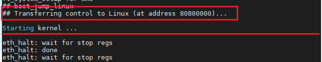

那么问题来了，既然要运行在DDR中，去哪里找内核镜像加载到DDR？这就就是我们经常说的从哪里启动的问题，
对于imx6ull EVK pro开发板而言，支持3种启动方式，也就是u-boot可以从3个地方获取linux内核，如NAND启动/EMMC启动、
SD卡启动、USB启动等。我们开发板上板载了启动方式选择地拨码开关，根据下面表格设置拨码开关就可以实现从不同介质中加载Linux内核到
DDR中运行，imx6ull在启动内核前会判断启动引脚地电平状态，根据启动引脚地电平状态选择不同的启动方式。

.. table:: 拨码开关启动配置表

==== ====== ========== ==== == ===
编号 名称   NAND FLASH eMMC SD USB
==== ====== ========== ==== == ===
1    MODE0  0          0    0  1
2    MODE1  1          1    1  0
3    CFG1-4 1          0    0  X
4    CFG1-5 0          1    0  X
5    CFG1-6 0          1    1  X
6    CFG1-7 1          0    0  X
7    CFG2-3 0          1    0  X
8    CFG2-5 0          0    1  X
==== ====== ========== ==== == ===

当然，除了以上几种启动方式以外，u-boot还支持从网络下载远程服务器中的镜像的方式启动Linux内核，u-boot直接从远程服务器将镜像下载
到本地DDR中运行，并且可以挂载根文件系统到远程服务器。

不管是那种启动方式，最终都要将内核镜像加载到DDR中运行，当使用网络（tftp与nfs）启动时，还应该在u-boot的命令终端
上配置相应的环境变量，如本机ip、服务器ip、网关、子网掩码等，特别提示：需要设置板子ip与服务器ip在同一个网段上才可以实现网络数据访问。

接下来我们分析一下linux内核启动源码。

当u-boot执行bootcmd的命令后，最终会调用do_bootz函数启动Linux内核：

在do_bootz之前会运行一段启动脚本，该启动脚本在include/configs/npi_common.h文件中有相关描述。
我们挑一段启动脚本简要梳理一下。

.. code-block:: c
   :linenos:
   :caption: include/configs/npi_common.h

   #define UBI_BOOT   \
      "ubiboot=" \
         "echo debug:[${devtype} ${ubidev}];" \
         "if ${devtype} part rootfs; then " \
            "setenv bootpart ${ubidev}:rootfs; " \
            "ubifsmount ubi0;"\
            "if test -e ${devtype} ${bootpart} /etc/fstab; then " \
               "setenv ubipart 1;" \
            "fi; " \
            "echo Checking for: uEnv.txt ...;" \ //检查配置文件uEnv.txt
            "if test -e ${devtype} ${bootpart} uEnv.txt; then " \
               "if run nandbootnev; then " \
                  "echo Loaded environment from uEnv.txt;" \
                  "run importbootenv;" \
               "fi;" \
               "echo Checking if client_ip is set ...;" \
               "if test -n ${client_ip}; then " \
                  "if test -n ${dtb}; then " \
                     "setenv fdtfile ${dtb};" \
                     "echo using ${fdtfile} ...;" \
                  "fi;" \
                  "if test -n ${uname_r}; then " \
                     "echo Running nfsboot_uname_r ...;" \
                     "run nfsboot_uname_r;" \
                  "fi;" \
                  "echo Running nfsboot ...;" \
                  "run nfsboot;" \
               "fi;" \
            "fi; " \
            "echo Checking for: /${script} ...;" \
            "if test -e ${devtype} ${bootpart} /${script}; then " \
               "setenv scriptfile ${script};" \
               "run loadbootscript;" \
               "echo Loaded script from ${scriptfile};" \
               "run bootscript;" \
            "fi; " \
            "echo Checking for: /boot/${script} ...;" \
            "if test -e ${devtype} ${bootpart} /boot/${script}; then " \ //检查脚本文件是否存在
               "setenv scriptfile /boot/${script};" \ //设置脚本文件
               "run loadbootscript;" \ //加载启动脚本
               "echo Loaded script from ${scriptfile};" \ //打印从scriptfile中加载脚本
               "run bootscript;" \ //执行启动脚本
            "fi; " \
            "echo Checking for: /boot/uEnv.txt ...;" \ //检查/boot/uEnv.txt，该脚本为fire-config主要的配置脚本
            "for i in 1 2 3 4 5 6 7 ; do " \
               "setenv ubipart ${i};" \
               "setenv curpart ${ubidev}:${ubipart};" \
               "if test -e ${devtype} ${curpart} /boot/uEnv.txt; then " \ //判断/boot/uEnv.txt文件是否存在
                  "setenv bootpart ${mmcdev}:${mmcpart};" \
                  "ubifsload ${loadaddr} /boot/uEnv.txt;" \ //加载/boot/uEnv.txt配置文件
                  "env import -t ${loadaddr} ${filesize};" \
                  "echo Loaded environment from /boot/uEnv.txt;" \ //从/boot/uEnv.txt中加载环境变量
               "fi;" \
               "if test -e ${devtype} ${curpart} /bin/sh; then " \ //判断/bin/sh文件是否存在
                  "setenv rootpart ${ubidev}:${ubipart};" \
                  "if test -n ${dtb}; then " \ //如果${dtb}字符串（即imx6ull-seeed-npi.dtb）长度不为零则运行下面语句
                     "echo debug: [dtb=${dtb}] ... ;" \ //打印所使用的设备树文件（imx6ull-seeed-npi.dtb）
                     "setenv fdtfile ${dtb};" \ //设置环境变量中设备树文件为imx6ull-seeed-npi.dtb
                     "echo Using: dtb=${fdtfile} ...;" \ //使用设备树文件，在/boot/uEnv中设备树文件被配置为imx6ull-seeed-npi.dtb
                  "fi;" \
                  "echo Checking if uname_r is set in /boot/uEnv.txt...;" \ //检查/boot/uEnv.txt文件中是否设置了uname_r（内核版本）信息
                  "if test -n ${uname_r}; then " \ //如果/boot/uEnv.txt文件中设置了uname_r
                     "setenv oldroot /dev/ubi${ubidev}p${ubipart};" \
                     "echo Running uname_boot ...;" \
                     "run uname_nandboot;" \ //运行uname_nandboot，uname_nandboot又是一段脚本
                  "fi;" \
               "fi;" \
            "done;" \
         "fi;\0" \

   #define NPI_UNAME_NANDBOOT \
      "uname_nandboot="\
      ......
      "bootz ${loadaddr} ${rdaddr}:${rdsize} ${fdtaddr}; " \ //最终会运行bootz命令来启动Linux内核，告知linux镜像存放在那个地址，设备树放在哪里

执行完上面的脚本后，在串口终端会输出相应的信息，如下所示。

.. image:: media/uboot_pro037.png
   :align: center
   :alt: 未找到图片05|

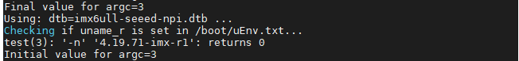

.. image:: media/uboot_pro039.png
   :align: center
   :alt: 未找到图片05|

由上脚本可知，最终会执行bootz命令，那么我们看下bootz命令是什么。

.. code-block:: c
   :linenos:
   :caption: cmd/bootz.c
   :emphasize-lines: 2

   U_BOOT_CMD(
	bootz,	CONFIG_SYS_MAXARGS,	1,	do_bootz,
	"boot Linux zImage image from memory", bootz_help_text
   );

我们可以看到第2行，执行bootz命令会调用do_bootz函数。

do_bootz函数：

.. code-block:: c
   :linenos:
   :caption: common/command.c
   :emphasize-lines: 7,14,16,17

   int do_bootz(cmd_tbl_t *cmdtp, int flag, int argc, char * const argv[])
   {
      int ret;

      /* Consume 'bootz' */
      argc--; argv++;
      if (bootz_start(cmdtp, flag, argc, argv, &images))
         return 1;

      /*
      * We are doing the BOOTM_STATE_LOADOS state ourselves, so must
      * disable interrupts ourselves
      */
      bootm_disable_interrupts();   //关闭中断

      images.os.os = IH_OS_LINUX;   //表示使用的是linux
      ret = do_bootm_states(cmdtp, flag, argc, argv,
   #ifdef CONFIG_SYS_BOOT_RAMDISK_HIGH
                  BOOTM_STATE_RAMDISK |
   #endif
                  BOOTM_STATE_OS_PREP | BOOTM_STATE_OS_FAKE_GO |
                  BOOTM_STATE_OS_GO,
                  &images, 1);

      return ret;
   }

1. 第7行，设置并找到linux镜像的入口点。

2. 第14行，由于需要加载linux镜像，所以必须关闭中断。

下面我们将详细分析do_bootz函数的细节，首先我们看到第7行中使用了images这个全局变量作为镜像的信息和交换的数据要用到的信息，
images是一个很重要的全局变量。它的类型是bootm_headers_t，其定义如下（删除了不符合条件编译部分，展开部分重要结构）：

.. code-block:: c
   :linenos:
   :caption: include/image.h

   typedef struct bootm_headers {neg
      image_header {
         __be32		ih_magic;	/* 镜像头部幻数，为include/image.h中的 IH_MAGIC = 0x27051956  	*/
         __be32		ih_hcrc;	/* 镜像头部crc校验码	*/
         __be32		ih_time;	/* 镜像创建时间戳	*/
         __be32		ih_size;	/* 镜像数据大小（除去头部）	*/
         __be32		ih_load;	/* 数据将要载入的内存地址	*/
         __be32		ih_ep;		/* 镜像入口地址		*/
         __be32		ih_dcrc;	/* 镜像数据校验码	*/
         uint8_t		ih_os;		/* 操作系统类型：IH_OS_LINUX		*/
         uint8_t		ih_arch;	/* CPU架构类型：IH_ARCH_ARM		*/
         uint8_t		ih_type;	/* 镜像类型：IH_TYPE_KERNEL */
         uint8_t		ih_comp;	/* 压缩的类型：IH_COMP_NONE 		*/
         uint8_t		ih_name[IH_NMLEN];	/* 镜像名字	IH_NMLEN = 32	*/
      } *legacy_hdr_os,		/* 镜像头部指针ne'g */
      legacy_hdr_os_copy;   /* header copy */

      ulong		legacy_hdr_valid;  

      image_info {
         ulong		start, end;		/* 镜像的起始地址和结束地址 */
         ulong		image_start, image_len; /* 镜像的起始地址和长度 */
         ulong		load;			/* 镜像的加载地址 */
         uint8_t		comp, type, os;		/* 压缩, 镜像的类型, 操作系统的类型 */
         uint8_t		arch;			/* cpu的架构 */
      } os;

      ulong		ep;		/* 操作系统的入口点 */

      ulong		rd_start, rd_end; /* ramdisk的起始地址和结束地址 */

      char		*ft_addr;	/* 设备树地址 */
      ulong		ft_len;		/* 设备树所占用的长度 */

      ulong		initrd_start;
      ulong		initrd_end;
      ulong		cmdline_start;    //命令行起始地址
      ulong		cmdline_end;      //命令行结束地址
      bd_t		*kbd;
      int		verify;		/* env_get("verify")[0] != 'n' */

   #define	BOOTM_STATE_START	(0x00000001)   //要执行的状态
   #define	BOOTM_STATE_FINDOS	(0x00000002)
   #define	BOOTM_STATE_FINDOTHER	(0x00000004)
   #define	BOOTM_STATE_LOADOS	(0x00000008)
   #define	BOOTM_STATE_RAMDISK	(0x00000010)
   #define	BOOTM_STATE_FDT		(0x00000020)
   #define	BOOTM_STATE_OS_CMDLINE	(0x00000040)
   #define	BOOTM_STATE_OS_BD_T	(0x00000080)
   #define	BOOTM_STATE_OS_PREP	(0x00000100)
   #define	BOOTM_STATE_OS_FAKE_GO	(0x00000200)	/* 'Almost' run the OS */
   #define	BOOTM_STATE_OS_GO	(0x00000400)
      int		state;   //状态
   } bootm_headers_t;

   extern bootm_headers_t images;   //声明给外部调用

看完image结构之后，我们继续回到do_bootz函数中的bootz_start函数去继续分析。

bootz_start函数：

.. code-block:: c
   :linenos:
   :caption: cmd/bootz.c
   :emphasize-lines: 7

   static int bootz_start(cmd_tbl_t *cmdtp, int flag, int argc,
            char * const argv[], bootm_headers_t *images)
   {
      int ret;
      ulong zi_start, zi_end;

      ret = do_bootm_states(cmdtp, flag, argc, argv, BOOTM_STATE_START,
                  images, 1);

      /* Setup Linux kernel zImage entry point */
      if (!argc) {
         images->ep = load_addr;
         debug("*  kernel: default image load address = 0x%08lx\n",
               load_addr);
      } else {
         images->ep = simple_strtoul(argv[0], NULL, 16); //将内核入口点字符串转成无符号长整型的十六进制数值：0x80800000
         debug("*  kernel: cmdline image address = 0x%08lx\n",
            images->ep);
      }

      ret = bootz_setup(images->ep, &zi_start, &zi_end);
      if (ret != 0)
         return 1;

      lmb_reserve(&images->lmb, images->ep, zi_end - zi_start);

      /*
      * Handle the BOOTM_STATE_FINDOTHER state ourselves as we do not
      * have a header that provide this informaiton.
      */
      if (bootm_find_images(flag, argc, argv))  //找到镜像的位置
         return 1;

   #ifdef CONFIG_SECURE_BOOT
      extern int authenticate_image(
            uint32_t ddr_start, uint32_t raw_image_size);
      if (authenticate_image(images->ep, zi_end - zi_start) != 0) {
         printf("Authenticate zImage Fail, Please check\n");
         return 1;
      }
   #endif
      return 0;
   }

   1. 第7行，do_bootm_states函数：

.. code-block:: c
   :linenos:
   :caption: cmd/bootz.c
   :emphasize-lines: 7

   int do_bootm_states(cmd_tbl_t *cmdtp, int flag, int argc, char * const argv[],
            int states, bootm_headers_t *images, int boot_progress)
   {
      boot_os_fn *boot_fn;
      ulong iflag = 0;
      int ret = 0, need_boot_fn;

      images->state |= states;   //经过打印得知，镜像执行的状态有：BOOTM_STATE_START、BOOTM_STATE_RAMDISK、BOOTM_STATE_OS_PREP、BOOTM_STATE_OS_FAKE_GO、BOOTM_STATE_OS_GO，为缩减代码，删去未执行状态相关的代码。

      if (states & BOOTM_STATE_START)
         ret = bootm_start(cmdtp, flag, argc, argv);

      /* From now on, we need the OS boot function */
      if (ret)
         return ret;
      boot_fn = bootm_os_get_boot_func(images->os.os);
      need_boot_fn = states & (BOOTM_STATE_OS_CMDLINE |
            BOOTM_STATE_OS_BD_T | BOOTM_STATE_OS_PREP |
            BOOTM_STATE_OS_FAKE_GO | BOOTM_STATE_OS_GO);
      if (boot_fn == NULL && need_boot_fn) {
         if (iflag)
            enable_interrupts();
         printf("ERROR: booting os '%s' (%d) is not supported\n",
               genimg_get_os_name(images->os.os), images->os.os);
         bootstage_error(BOOTSTAGE_ID_CHECK_BOOT_OS);
         return 1;
      }

      /* Call various other states that are not generally used */
      if (!ret && (states & BOOTM_STATE_OS_CMDLINE))
         ret = boot_fn(BOOTM_STATE_OS_CMDLINE, argc, argv, images);
      if (!ret && (states & BOOTM_STATE_OS_BD_T))
         ret = boot_fn(BOOTM_STATE_OS_BD_T, argc, argv, images);
      if (!ret && (states & BOOTM_STATE_OS_PREP)) {
         ret = boot_fn(BOOTM_STATE_OS_PREP, argc, argv, images);
      }

      /* Check for unsupported subcommand. */
      if (ret) {
         puts("subcommand not supported\n");
         return ret;
      }

      /* Now run the OS! We hope this doesn't return */
      if (!ret && (states & BOOTM_STATE_OS_GO))
         ret = boot_selected_os(argc, argv, BOOTM_STATE_OS_GO,
               images, boot_fn);

      /* Deal with any fallout */
   err:
      if (iflag)
         enable_interrupts();

      if (ret == BOOTM_ERR_UNIMPLEMENTED)
         bootstage_error(BOOTSTAGE_ID_DECOMP_UNIMPL);
      else if (ret == BOOTM_ERR_RESET)
         do_reset(cmdtp, flag, argc, argv);

      return ret;
   }

do_bootm_states函数首先调用bootm_start，如下，因为函数调用比较多，所以将函数说明写在注释中：

.. code-block:: c
   :linenos:
   :caption: common/bootm.c

   static int bootm_start(cmd_tbl_t *cmdtp, int flag, int argc,
		       char * const argv[])
   {
      memset((void *)&images, 0, sizeof(images));  //清空前面讲到的image结构
      images.verify = env_get_yesno("verify");  // verify = -1
      boot_start_lmb(&images);   //空函数

      bootstage_mark_name(BOOTSTAGE_ID_BOOTM_START, "bootm_start"); //标记引导阶段
      images.state = BOOTM_STATE_START; //标记为开始状态

      return 0;
   }

最后进入到do_bootm_linux函数：

.. code-block:: c
   :linenos:
   :caption: common/bootm.c

   int do_bootm_linux(int flag, int argc, char * const argv[],
            bootm_headers_t *images)
   {
      /* No need for those on ARM */
      if (flag & BOOTM_STATE_OS_BD_T || flag & BOOTM_STATE_OS_CMDLINE)
         return -1;

      if (flag & BOOTM_STATE_OS_PREP) {
         boot_prep_linux(images);
         return 0;
      }

      if (flag & (BOOTM_STATE_OS_GO | BOOTM_STATE_OS_FAKE_GO)) {
         boot_jump_linux(images, flag);
         return 0;
      }

      boot_prep_linux(images);
      boot_jump_linux(images, flag);
      return 0;
   }

我们简单看下do_bootm_linux函数的调用顺序。

.. code-block:: c
   :linenos:
   :caption: arch/arm/lib/bootm.c
   :emphasize-lines: 21,24,27

   do_bootm_linux(int flag, int argc, char * const argv[], bootm_headers_t *images)
      boot_prep_linux(images) //Linux与启动相关设置，将环境变量bootargs保存以便后面传递给内核
         image_setup_linux(images)
            boot_fdt_add_mem_rsv_regions //为fdt保留一块内存
            boot_relocate_fdt //重定向设备树，
            image_setup_libfdt
               fdt_root //在引导Linux之前，将数据添加到FDT的根节点中
               fdt_chosen  寻找 chosen node ，如果没有这个节点则创建
                  env_get("bootargs"); //得到启动参数
                  fdt_setprop(fdt, nodeoffset, "bootargs", str, strlen(str) + 1);   //把"bootargs"设置成设备树的属性
               arch_fixup_fdt
                  or (bank = 0; bank < CONFIG_NR_DRAM_BANKS; bank++) {
                     start[bank] = bd->bi_dram[bank].start;
                     size[bank] = bd->bi_dram[bank].size;
                  }  //获取内存的起始地址与长度
                  fdt_fixup_memory_banks(blob, start, size, CONFIG_NR_DRAM_BANKS);//修复或创建内存节点
                  fdt_update_ethernet_dt(blob); //更新网络相关的fdt
               fdt_fixup_ethernet(blob);  //更新网络节点
      boot_jump_linux(images, flag);
         machid = gd->bd->bi_arch_number  //得到机器ID，主要用于Linux检查，若Linux的ID表中有这个机器ID才会启动。
         void (*kernel_entry)(int zero, int arch, uint params) //定义一个函数指针kernel_entry
         kernel_entry = (void (*)(int, int, uint))images->ep  //将images ->ep内核入口点强制类型转换为kernel_entry函数指针
         announce_and_cleanup(fake) //清除
            printf("\nStarting kernel ...%s\n\n", fake ?"(fake run for tracing)" : "");//打印字符串，表示Linux内核启动中
            cleanup_before_linux(void) //关闭且清空cache
         r2 = (unsigned long)images->ft_addr   //以设fdt方式传递参数
         kernel_entry(0, machid, r2)   //启动Linux内核

1. 第21行，images->ep中的ep是entrypoint的缩写，这便是程序的入口点，该行代码将ep赋值给kernel_entry，而这个函数指针指向的是在内存中加载linux镜像的入口地址，也就是linux第一个将要执行的代码。

2. 第24行，当内核正常启动时会打印“Starting kernel ...”，说明已经成功的加载了linux镜像，校验成功，并找到了入口地址，若未打印该字符型串，则应该检查一下传参是否正确。

3. 第27行，启动Linux内核，kernel_entry函数为汇编函数，其传参形式和前面我们分析汇编调用c函数的传参方式（ARM程序调用规则ATPCS）是类似的，也就是r0存放第一个参数0、r1存放第二个参数machid（机器ID告诉Linux内核我们用的是哪个cpu，从而调用相应的初始化函数）、r2存放第三个参数（设备树首地址），注意我们使用的是设备树的方式传参，而非传统的ATAG方式传参，传统的传参是将struct tag地址赋值给r2寄存器。

u-boot mainline 从v1.1.3开始便支持设备树，其对ARM的支持则是和ARM内核支持Device Tree同期完成。
由于我们在configs/mx6ull_npi_defconfig配置文件中定义了CONFIG_OF_LIBFDT=y，从而使能了设备树传参形式，
u-boot将从启动介质中将设备树读取到内存。当然，设备树的存放位置并不是随意存放的，它必须保证不能破坏u-boot、不能破坏操作系统及其用到的内存空间，
不能占用他们的内存。

总结： 

- 首先根据启动方式，从存放镜像的介质中加载到ddr。

- 检查、校验是哪类镜像。

- 传递参数给内核。

- 运行内核。
