.. vim: syntax=rst

系统镜像备份、还原与刷机指南
----------

本章主要讲解如何备份系统镜像，通常我们都是在一个开发板上搭建好环境（假设系统以emmc方式启动运行），比如装了蓝牙协议栈相关的软件包、
声音服务相关软件包pulseaudio、alsa工具、ffmpeg等，我们花费了很多时间去配置板子。但是如果我们要量产这款产品，
需要每个产品都搭建好相同的环境，这样就带来一个问题，假设我们每个产品都要重新以类似”sudo apt-get install xxx“的方式搭建环境，
如果产品少便无所谓，多花点时间也可以完成，但是，当批量生产的时候，以这样的方式去生产显然是不现实的，这种方式效率很低，会大大增加
产品的量产周期。又假设我们一开始就是将系统镜像保存在SD卡中，以SD卡启动，基于SD卡搭建环境，所搭建的环境都被存在了SD里面。此时我们担心SD可能会被损坏，
需要将SD卡中的镜像备份出来，然后以拷贝出的镜像去量产其他产品（板子），以提高量产效率，或者备份数据防止丢失，好了，本章就是为了解决一些现实
有用、量产与防镜像丢失问题的，下面我们根据不同的情况，详细介绍如何处理这些问题。

基于SD卡搭建了自己的环境（类似树莓派，须支持SD卡启动）
~~~~~

准备工作：

- 一台装好Linux（ubuntu）的PC机

- 终端软件（如minicom、MobaXterm、Hyper terminal等）

- 一张已经搭建好系统环境、装好各种依赖或已做好开发步骤的SD卡（建议SD大小大于系统镜像两倍左右）

- 一张空的SD卡（建议SD大小大于系统镜像两倍左右）

- imx6ull mini开发板

- 读卡器

- Etcher SD卡镜像烧录软件

- FileZila软件或者其他能将ubuntu文件拷贝到windows的软件/方法

如下图所示：

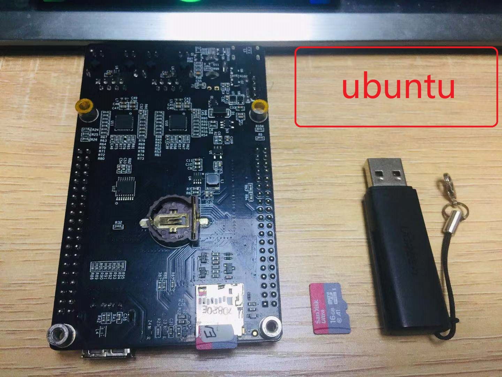

下面介绍两种备份SD卡镜像的方法，一种是使用dd命令来备份SD卡镜像，该方法的优点是备份的镜像大小比较小，缺点是容易制作失败；另一种是使用Win32磁盘映像工具备份镜像，
该方法的有点是比较简单直接，在windows下操作，不容易出错，缺点是备份的镜像太大，备份时间长，它备份整个SD卡作为镜像。

使用dd命令制作Debian系统镜像(将带镜像SD卡的内容打包成镜像文件.img)
'''''''

将已经搭建好环境的SD卡从imx6ull mini开发板取出并插到读卡器上，然后将读卡器接入PC机（ubuntu中），
首先输入df -h查看下SD卡中镜像的大小。

.. code:: bash

    df -h

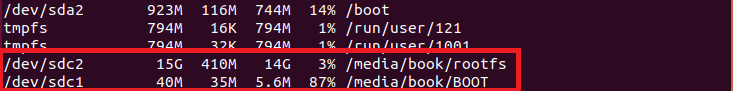

可见，在我的Ubuntu中，该SD卡设备挂载在/dev/sdc中，由于该SD卡有两个分区，所以/dev/sdc分为/dev/sdc1和/dev/sd2。
大家根据自己Ubuntu中SD卡设备的实际情况来处理，如果不知道自己的SD卡设备是哪个，可以先不插入读卡器，ls /dev看下有哪些设备，
然后再插入读卡器再ls /dev查看当前设备，对比两次的ls /dev，一般多出来的设备便是该SD卡。

从上图可以看到我的SD卡镜像大小为/dev/sdc1 + /dev/sdc2 = 410M + 35M = 445M。

.. attention:: 建议大家在取出SD卡的时候先手动将SD卡设备弹出，不要直接从USB口中拔出SD卡，保证数据同步到了SD卡中，这其实是系统对块设备的一种延迟存储方式，虽然软件提示已经将数据拷贝到了SD卡，但是实际上系统使用等待队列，需要排队等待，并未实际存储了数据，或者它还正在拷贝中，等你按下弹出设备时，此时数据会立即同步到SD卡中。

接着我们使用mkdir命令创建一个新的目录，用于存放从带镜像的SD卡中拷贝的镜像。

.. code:: bash

    mkdir image_backup

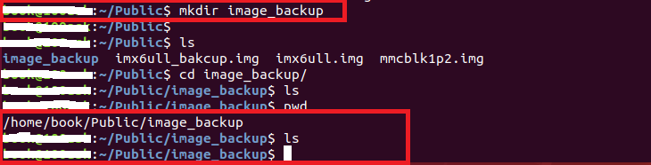

然后使用dd命令将带镜像的SD中的镜像拷贝到新创建的目录中。

.. code:: bash

    sudo dd if=/dev/sdc of=./imx6ull_backup.img count=1100 bs=1024k conv=sync

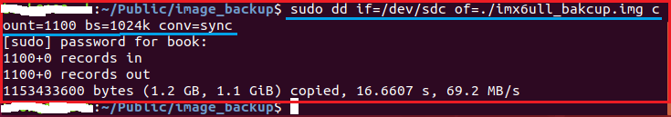

使用dd命令拷贝的时候要注意拷贝的大小尽量大于SD卡中镜像的大小，我这里拷贝了1.1G，镜像大小为445M，保证整个镜像都被完整的拷贝出来而没有遗漏，到此镜像制作完毕，你可以将备份的镜像烧录到其他SD卡中。(若备份的镜像仍无法正常运行，请将bs=1024k改为bs=1M并去掉conv参数)

上图dd命令参数的含义：

- if=文件名：输入文件名，缺省为标准输入。即指定源文件。< if=/dev/sdc >

- of=文件名：输出文件名，缺省为标准输出。即指定目的文件。< of=./imx6ull_bakcup.img,这里的.img是镜像的格式，转成.img格式的文件后方便我们后续使用etcher烧录镜像 >

- bs = bytes：同时设置读入/输出的块大小为bytes个字节，我填的是1024，表示1M大小。

-  count = blocks：仅拷贝blocks个块，块大小等于ibs指定的字节数，我设置的是1100，表示1100个bs，也就是1.1G。

- conv= sync：将每个输入块填充到ibs个字节，不足部分用空（NUL）字符补齐。

下面介绍两种将刚刚备份的.img镜像烧到空的SD卡的方法(仅想获得.img文件的用户请忽略)：

得到img文件后，就可以使用这个img文件烧录到其它卡上了，具体烧录步骤请参考前面的说明 `烧录Debian镜像至SD卡`_。

.. _烧录Debian镜像至SD卡: https://embed-linux-tutorial.readthedocs.io/zh_CN/latest/install_image/install_debian_to_sd.html

产品量产，且需将制作好的SD卡镜像备份到emmc
'''''''

这部分请大家移步至我们的`fire-config工具简介`_章节，按照相应的步骤刷机即可，再次也建议大家如果要量产或者大量需要配置自己的Debian环境时，尽量在SD卡上开发，
便于刷机量产。

.. _fire-config工具简介: https://embed-linux-tutorial.readthedocs.io/zh_CN/latest/linux_basis/fire-config_brief.html

使用Win32磁盘映像工具制作Debian系统镜像(将带镜像SD卡的内容打包成镜像文件.img)
'''''''

首先在桌面右键，新建一个空的.img文件，例如我创建的是backup.img 

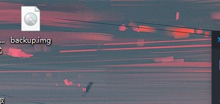

接着插入你的带镜像的SD卡到windows并打开Win32磁盘映像工具，找到你的SD卡盘符，我的是H盘（请仔细确认自己的SD卡盘符），然后点击文件夹图标，找到刚刚在桌面创建的backup.img文件并确认，
之后取消“仅读取已分配区”的勾选，最后点击读取按钮，如果弹出是否覆盖backup.img的对话框，点击是即可，等待镜像备份完毕，备份好的镜像就是backup.img。

.. image:: media/image_backup036.png
   :align: center
   :alt: 未找到图片36|

接着取下带镜像的SD卡，插入另外一张被格式化成FAT32格式的空的SD卡，打开Win32磁盘映像工具，选择backup.img镜像，选择你的SD卡盘符，最后点击写入按钮即可，注意被烧录的SD卡大小必须大于等于镜像的大小。

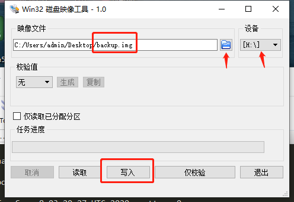
   

备份emmc中的环境(须支持SD卡启动)
~~~~~

产品量产，且需将制作好的SD卡镜像备份到emmc中
'''''''

准备工作：

- 终端软件（如minicom、MobaXterm、Hyper terminal等）

- 一张已经烧录镜像的SD卡（建议SD大小大于系统镜像两倍左右）

- 一张空的SD卡（建议SD大小大于系统镜像两倍左右）

- 读卡器

- 开发板

注意事项：特别提醒，如果您用的是emmc类型的板子，就要注意了，由于我们要将整个emmc设备的内容全部备份到一张空的SD卡中，如果你的
SD卡格式为FAT32格式的话，是不支持4G以上内容拷贝的，起初我是做了很多实验，“屡试不爽”。先介绍一下我们的中心思想：首先根据你自己的情况搭建好环境（记住是基于emmc搭建的），
然后准备一张已经烧录好Debian镜像的SD卡，将该SD卡插入板子的SD卡插槽，接着拨动拨码开关使板子以SD卡方式启动（记住要以SD卡启动，因为不能在已有系统的emmc中备份它本身的系统，这有点绕），
然后通过dd命令将emmc整个设备全部备份至空的SD卡，然后我们再将已备份好的SD卡通过读卡器接入另一块板子，并同样要使用带镜像的SD卡启动方式启动板子，再使用dd命令将已备份过Debian镜像的SD卡内容全部备份到这块新的板子的emmc中，
注意，从emmc备份的镜像只能烧录到其他emmc板子上，本章注意细节很多，需要仔细阅读并理解，否则很可能制作失败。

.. attention:: 如果备份的设备（如emmc）大于4G，需要将SD卡格式化为NTFS格式，同时还要使emmc支持NTFS格式。

说了很多，也许你还听不太明白，下面我们就8G的emmc板子做实验。

第一步:

使系统支持NTFS格式，要是Debian系统支持NTFS格式有两种方法，第一种是在制作linux内核的时候，在make menuconfig菜单选项里面勾选NTFS格式支持选项，第二种是安装NTFS格式支持，在这里我们采用第二种方法，安装NTFS格式支持。

首先板子以烧入好镜像的SD卡启动，然后我们安装NTFS格式支持，以便挂载NTFS格式的SD卡。

输入命令：sudo apt-get updade,接着输入sudo apt-get upgrade。

然后输入sudo apt-get install -y wget，安装wget是为了从网站上下载NTFS格式支持。

接着输入wget https://tuxera.com/opensource/ntfs-3g_ntfsprogs-2017.3.23.tgz下载NTFS格式支持。

.. code:: bash

    sudo apt-get updade
    sudo apt-get upgrade
    sudo apt-get install -y wget
    wget https://tuxera.com/opensource/ntfs-3g_ntfsprogs-2017.3.23.tgz

.. image:: media/image_backup014.png
   :align: center
   :alt: 未找到图片00|

为了编译NTFS-3g，我们要安装gcc，sudo apt-get install gcc

.. code:: bash

    sudo apt-get install gcc

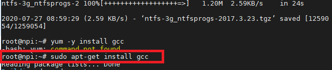

接着将刚刚下载下来的ntfs-3g_ntfsprogs-2017.3.23.tg压缩包解压，输入 tar -zxvf ntfs-3g_ntfsprogs-2017.3.23.tgz即可解压到当前目录。

.. code:: bash

    tar -zxvf ntfs-3g_ntfsprogs-2017.3.23.tgz

.. image:: media/image_backup016.png
   :align: center
   :alt: 未找到图片00|

进入ntfs-3g_ntfsprogs-2017.3.23目录，输入./configure配置NTFS-3g。

.. code:: bash

    ./configure

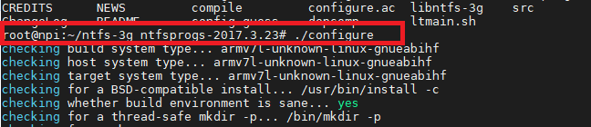

输入sudo apt-get install make，安装make。

.. code:: bash

    sudo apt-get install make

.. image:: media/image_backup018.png
   :align: center
   :alt: 未找到图片00|

输入make开始编译。

.. image:: media/image_backup019.png
   :align: center
   :alt: 未找到图片00|

正常编译会输出如下信息，如果你的编译有问题，很可能是没有安装好gcc编译工具、没有安装make、没有输入./configure配置。

.. image:: media/image_backup020.png
   :align: center
   :alt: 未找到图片00|

编译时间比较长，编译完成以后我们输入make install安装NTFS-3g支持。

.. code:: bash

    make install

.. image:: media/image_backup021.png
   :align: center
   :alt: 未找到图片00|

制作NTFS格式的SD卡就比较简单了，直接将SD卡插入读卡器并接入PC机，找到该SD卡存储器，右击，然后选择NTFS格式化即可，注意我这里用到的4G SD卡只是为了做演示，实际上我用的是16G的SD卡，必须大于emmc设备的容量大小，类似于将小桶里的水倒入大桶里。

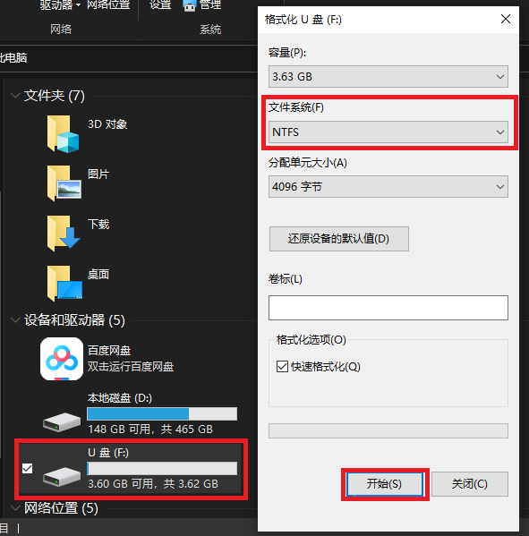

接着将一张空的NTFS格式的SD卡插入读卡器，然后将读卡器接入板子的USB接口，正常的话，我们输入df -l命令可以看到多出了一个/dev/sdx（x是多少根据你自己的情况而显示，我这里是sdb1）设备。

然后我们将SD卡设备挂载到/mnt这个挂载点下，输入mount -t ntfs-3g /dev/sdb1 /mnt/。

.. code:: bash

    mount -t ntfs-3g /dev/sdb1 /mnt/

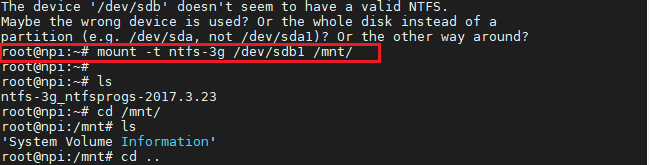

最后接着使用dd命令将整个emmc设备的内容全部备份到/mnt/中，注意在我们imx6ull系列板子上，emmc有两个分区，分别为mmcblk1p1和mmcblk1p2，为了备份emmc设备的全部内容，
我们只需要备份mmcblk1就可以了，注意！注意！注意！不要加p1或p2，备份到SD卡挂载点/mnt目录下，并以.img形式命名，比如我命名为image_emmc_backup.img，然后
输入命令：sudo dd if=/dev/mmcblk1 of=/mnt/image_emmc_backup.img，开始拷贝。

.. code:: bash

    sudo dd if=/dev/mmcblk1 of=/mnt/image_emmc_backup.img

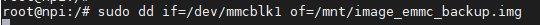

输入这条命令之后，你需要耐心的等待它备份完，因为我们的emmc标配是8G的，所以非常耗时间，一般需要好几个小时，甚至一上午，你可以去忙其他事情了！

好了，漫长的等待终于拷贝完成，当我们看到如下信息，表明拷贝完成。

.. image:: media/image_backup025.png
   :align: center
   :alt: 未找到图片00|

我们进入/mnt挂载点确认一下是否真正拷贝了，确认后记得输入umount /mnt 卸载前面所做的挂载。

.. code:: bash

    umount /mnt

.. image:: media/image_backup026.png
   :align: center
   :alt: 未找到图片00|

接着我们切换到另一块imx6ull的emmc类型板子，同样的插入带镜像的SD卡（注意不是刚刚备份好的），将刚刚备份好的SD卡插入读卡器并接入板子，
拨动拨码开关以SD卡方式启动，进入系统后输入sudo mount -t ntfs-3g /dev/sdb1 /mnt/,将SD卡设备挂载到/mnt这个挂载点上，注意此挂载点最好是空的，若非空，可以使用mkdir命令创建一个空的目录以挂载。

.. code:: bash

    sudo mount -t ntfs-3g /dev/sdb1 /mnt/

.. image:: media/image_backup027.png
   :align: center
   :alt: 未找到图片00|

挂载好以后，接下来就是将挂载点/mnt目录下的image_emmc_backup.img文件烧录到emmc上，由于我们前是拷贝emmc设备的内容，所以必须也要烧录到新的emmc设备上，
我的开发板的emmc设备默认被挂载到了/dev/mmcblk1上。

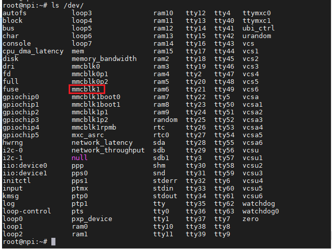

接着输入sudo dd if=/mnt/image_emmc_backup.img of=/dev/mmcblk1，接着又是好几个小时的漫长等待......，我做个实验基本要花费一快天的时间了！输入dd命令之前一定要想清楚哪个文件是输入文件，哪个文件是输出文件，在此，我们是想将SD卡的内容备份到emmc设备，而emmc设备被挂载到了/dev/mmcblk1下，SD卡设备被挂载到了/mnt/下。
所以，/mnt/image_emmc_backup.img是输入文件“if=指定”，/dev/mmcblk1是输出文件“of=指定”。如果写反了，半天的努力就前功尽弃了。

.. code:: bash

    sudo dd if=/mnt/image_emmc_backup.img of=/dev/mmcblk1

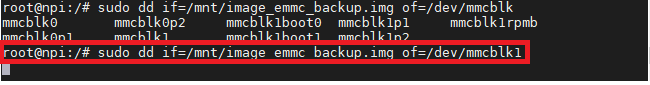

至此，镜像备份结束。