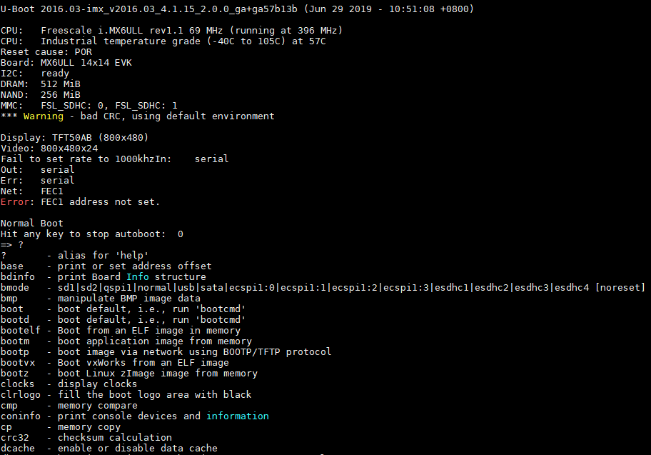
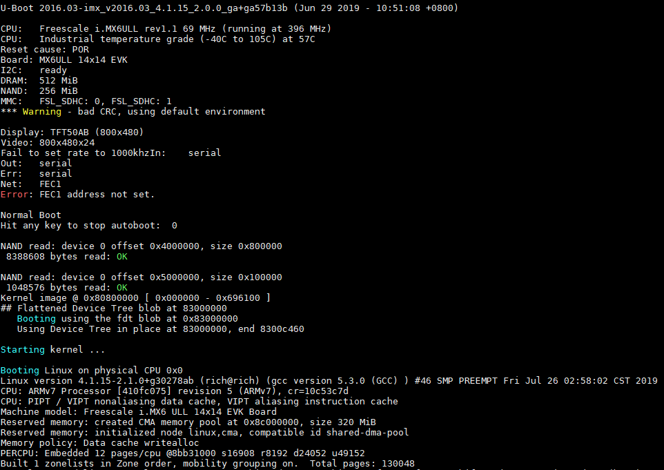
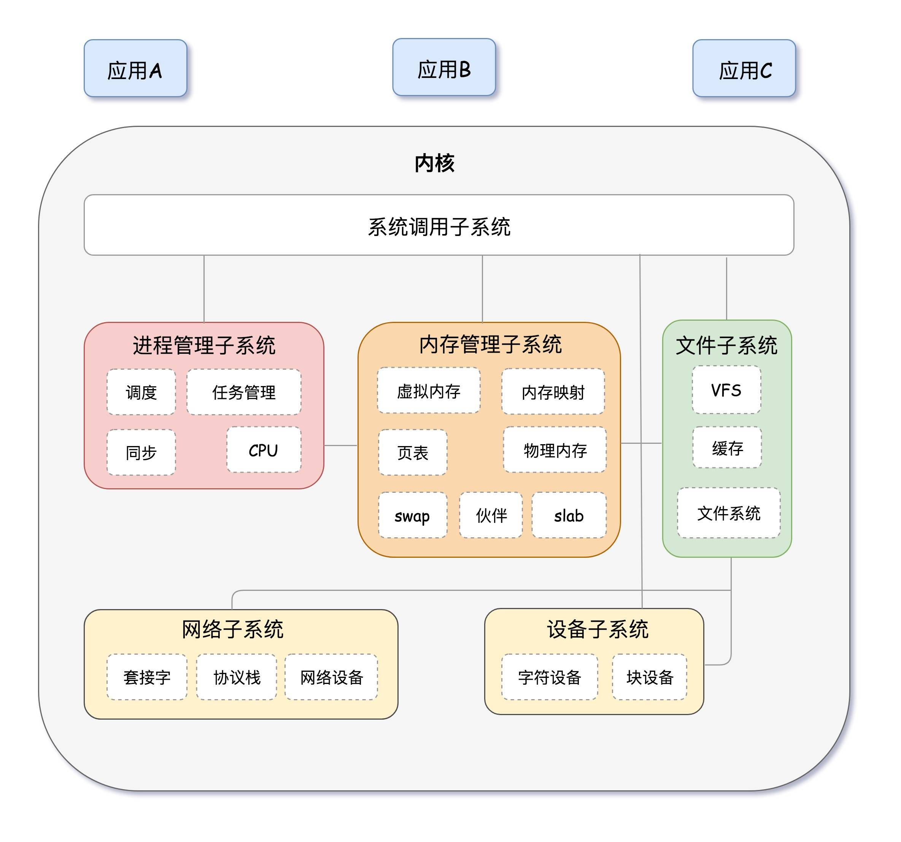
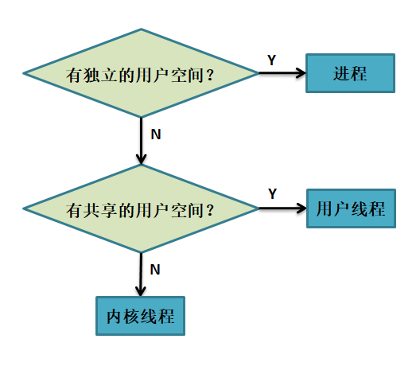
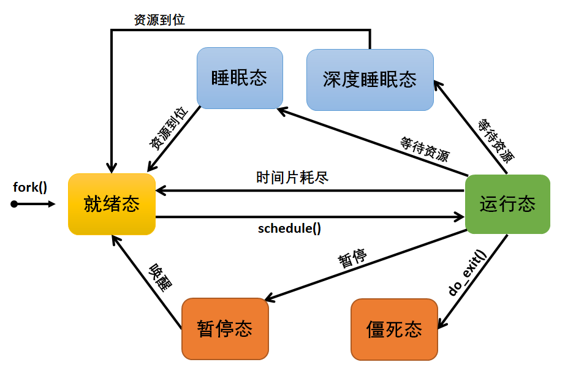
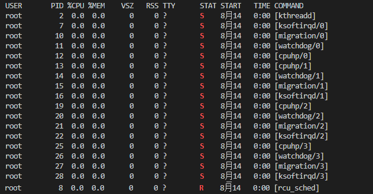
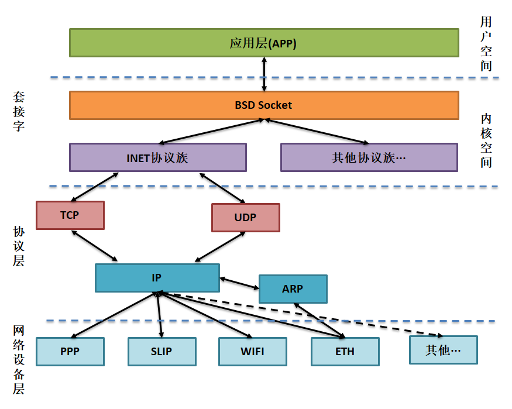
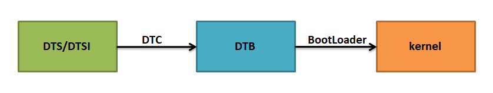

.. vim: syntax=rst

了解Linux系统组件
----------

一个完整的linux系统，通常包含了Uboot、kernel、**.dtb以及根文件系统，
它们是系统运行需要的4个基础组件。

Uboot
~~~~~

U-Boot，全称 Universal Boot Loader，是遵循GPL条款的开源项目，U-Boot是
从FADSROM、8xxROM、PPCBOOT逐步发展演化而来的。U-Boot发展至今，已经可以
实现非常多的功能，在操作系统方面，它不仅支持嵌入式Linux系统的引导，还支持NetBSD,
VxWorks, QNX, RTEMS, ARTOS, LynxOS, Android等嵌入式操作系统的引导。在CPU架构方面
，U-Boot支持PowerPC、MIPS、x86、ARM、NIOS、XScale等诸多常用系列的处
理器。U-Boot的主要作用是用来启动操作系统内核，它分为两个阶段，即boot +
loader，boot阶段启动系统，初始化硬件设备，建立内存空间映射图，将系统的
软硬件带到一个合适的状态，loader阶段将操作系统内核文件加载至内存，之后跳转到内核所在地址运行。

当一个开发板上电的时候，即使是执行非常简单的程序，都需要进行很多初始化的
操作，如初始化时钟、初始化存储控制器、将代码拷贝到运行内存中等操作，大多数
处理器在上电的时候都会有默认的指令执行位置，如ARM架构的处理器会从0x00000000地址开始读取第一条指令。

一般来说BootLoader必须提供系统上电时的初始化代码，在系统上电时初始化相关
环境后，BootLoader需要引导完整的操作系统，然后将控制器交给操作系统。
简单来说BootLoader是一段小程序，它在系统上电时执行，通过这段小程序可以将硬件
设备进行初始化，如CPU、SDRAM、Flash、串口、网络等，初始化完毕后调用操作系统内核。
另外，某些BootLoader可能含有一些高级特性，如校验操作系统镜像，从多个操作系统镜像中选择引导合适的操作系统，
甚至可以添加网络功能，让系统自主从网上寻找合适的镜像并且进行引导等等。

在开发的时候，我们可能需要利用一些命令去操作BootLoader，让BootLoader完成一
些事情，我们可以称这种模式为下载模式，比如从内存中的ELF镜像启动，从内存启动
应用程序镜像，使用BOOTP/TFTP协议通过网络启动镜像，打印控制台设备和信息，打印
有关文件系统的信息，列出目录中的文件等等。
当然，下载模式是对于开发人员才有意义，而对于用户则不需要这些操作，直接可以启动
操作系统运行，这种直接启动操作系统的模式可以称之为启动模式。正如我们所说， U-Boot的
功能十分强大，它可以同时支持下载模式与启动模式，并且可以切换模式，它可以在系统上电
时默认等待N秒（N可以随意设置），在这N秒内没有命
令（如按下任意按键、串口发送任意数据等）去操作BootLoader时，U-Boot将启动默认
的操作系统内核（如Linux）。当有命令操作BootLoader时，系统将进入下载模式，在这
个模式下，BootLoader将不会继续启动操作系统内核，而是由开发者去指定BootLoader的工作，如通过串口下
载操作系统镜像，通过网络启动镜像等操作，如下图所示。

而当N秒内没有命令去操作BootLoader时，BootLoader将启动默认的操作系统，并将
控制块交给操作系统，显然，在产品发布时BootLoader是工作在启动模式下的，这种模
式是不需要用户通过BootLoader的命令去控制BootLoader，而是直接启动操作系统即可，具体见下图。

U-Boot启动内核的过程可以分为两个阶段，两个阶段的功能如下：

第一阶段：

-  硬件设备初始化。

-  加载U-Boot第二阶段代码到RAM空间。

-  设置好栈。

-  跳转到第二阶段代码入口。

..

   第二阶段：

-  初始化本阶段使用的硬件设备。

-  检测系统内存映射。

-  将内核从存储区域（Flash、SD Card、eMMC）读取到RAM中。

-  为内核设置启动参数。

-  调用内核。

Kernel
~~~~~~

Linux内核
^^^^^^^

Kernel即是Linux内核，Linux内核采用宏内核架构，即Linux大部分功能都
会在内核中实现，如进程管理、内存管理、设备管理、文件管理以及网络管
理等功能，它们是运行在内核空间中（也可以称之为特权模式下运行）；除
此之外还有一种与宏内核相反的内核架构——微内核，它仅仅是将内核的基本功
能放入内核中
，如进程管理、进程调度等，而其他的设备管理、文件管理等功能都放在内核
空间之外（即运行在非特权模式下），这种微内核的架构有很优越的扩展性，它
将系统分为各个小的功能模块，把设计难度大大降低。而宏内核的设计架构则没有
非常好的扩展性，但Linux在发展的过程中，很早就引入了内核模块（Loadable
Kernel Module，LKM）这一机制，弥补了这一不足之处，内核模块全称为动态可
加载内核模块，就是在内核运行时可以动态加载一组目标代码来实现某些特定的
功能，在这过程中不需要重新编译内核就可以实现动态扩展。模块是具有独立功能
的程序，它可以被单独编译，但不能独立运行。它在运行时被链接到内核作为内核
的一部分在内核空间运行，这与运行在用户空间的进程是不同的。模块通常由一组
函数和数据结构组成，用来实现一种文件系统、一个驱动程序或其他内核上层的功
能，关于内核模块我们后续会讲解。

Linux **系统组成**
^^^^^^^^^^^^^^^^^^^^^^

Linux内核主要由5部分组成，分别为：进程管理子系统，内存管理子系统，文件
子系统，网络子系统，设备子系统，如下图所示（图片来源网络）。

从上图可以看出，整个内核是由5部分组
成，并且由系统调用层（系统调用子系统）进
行统一管理，应用层通过系统调用层的函数接口与内核进
行交互，用户应用程序执行的地方是用户空间，用户空间之下则是
内核空间，Linux 内核正是位于内核空间中，下面分别了解一下内核的5个组成部分。

进程管理子系统
'''''''

进程管理的核心就是进程的调度。在Linux内核中，进程调
度的单元是进程，进程调度控制系统中的多个进程对CPU的访问，从宏观上看，系统
中的进程在CPU中是并发执行的。此外内核通过系统调用提供了应用程序
编程接口，例如：创建新进程（fork，exec），结束进程（kill，
exit），并且提供了控制进程，同步进程和进程间通信的接口。

进程与程序的区别：

-  程序：存放在磁盘上的一系列代码和数据的可执行映像，是一个静止的实体。

-  进程： 是一个执行中的程序，它是动态的实体。

进程的四要素：

1. 有一段程序供其执行，这段程序不一定是某个进程所专有，可以与其他进程共用。

2. 有进程专有的系统堆栈空间（也可以称之为内核堆栈空间）。

3. 在内核中有一个task_struct数据结构，即进程控制块。有了这个数
据结构，进程才能被内核调度器识别并参与内核调度，除此之外它还记录着
进程所占有的各项资源。

4. 除上述的专有的系统堆栈空间外，进程还需要有独立的用户堆栈空间，这
就是mm_struct数据结构，该数据结构位于task_struct结构中，字段名称为mm。

每个进程都有自己的堆栈，内核在创建一个新的进程时，在创建进程控
制块task_struct的同时，也为进程创建自己堆栈。一个进程有2个堆栈，即用
户堆栈和系统堆栈；用户堆栈的空间指向用户地址空间，内核堆栈的空间指
向内核地址空间。当进程在用户态运行时，CPU堆栈指针寄存器指向用户堆栈地址，使用用户堆栈，当
进程运行在内核态时，CPU堆栈指针寄存器指向的是内核栈空间地址，使用的是内核栈。

在Linux中进程与线程的区分也不是十分严格，一般在讲到进程时常常也包括
了线程，以上的进程四个要素是必要条件，缺了其中任何一条都不能称其为"进
程"，如果完全没有用户空间，即mm_struct为NULL，那么可以称它为内核
线程，如果有共享的用户空间，那么可以称之为用户线程，具体如下图所示。

进程调度：

进程调度是进程管理子系统中最重要的一个功能，它决定了哪个进程
可以运行，什么时候运行，什么时候停止，它实际上就是一个管理进程
之间使用CPU资源的管理程序，因此Linux内核必须提供一种方法方法，让各个
进程之间尽可能公平地共享CPU资源，并且还需要考虑各个进程的优先级。因此进程
调度器的设计就要解决如何有
效地为各个进程分配其使用 的CPU资源 时间，同时又要达到良好的用户体验效果，此外
调度器还需要解决一些互相冲突的情况，例如既要实现实时任务的最小化响应时间, 又
要最大限度地提高 CPU 的总体利用率等。

其实在Linux2.6版本之后，进程调度器使用新的进程调
度算法——Completely Fair Scheduler，简称CFS，即完全公平调度算法，该算
法会按所需分配的计算能力，向系统中每个进程提供最大的公正性，或者从另
外一个角度上说，它试图确保没有进程被亏待。经过多年来的测试，完全公平调度算法在
高负载情况下依然有极其出色的性能，它负责将CPU资源，分配给正在执行的进
程，目标在于最大化程式互动效能，最小化整体CPU的运用，这个算法使用红黑树
来实现，算法效率为O(log(n))。

进程状态：

每个进程都有状态属性，在整个Linux中运行着多个进程，某些进程可能
处于运行态，某些进程可能处于就绪态，某些进程可能处于睡眠态或者是深度
睡眠态，还有一些进程可能处于暂停态或者僵死态等，这些进程的状态都是
动态变化的并且是由进程调度器决定的，具体见下图。

-  就绪态R (TASK_RUNNING)：就绪态也被称作可执行状态，只有
在该状态的进程才能被允许参与调度器调度并且使用CPU资源，而同一时
刻可能有多个进程处于就绪态，这些进程的task_struct结构（进程控制块）被放入
对应CPU的可执行队列中（一个进程最多只能出现在一个CPU的可执行队列中）。进
  程调度器的任务就是从各个CPU的可执行队列中分别选择一个进程在该CPU上运行。

-  运行态R (TASK_RUNNING)：此时进程正在使用CPU资源。

提示：很多操作系统的书将正在CPU上执行的进程定义为RUNNING状态、而将
可执行但是尚未被调度执行的进程定义为READY状态，这两种状态在linux下统一为TASK_RUNNING状态

-  暂停态T (TASK_STOPPED or TASK_TRACED)：向进程发送一个SIGSTOP信号，它就
  会因响应该信号而进入TASK_STOPPED状态，向进程发送一个SIGCONT信号，可以让
  其从TASK_STOPPED状态恢复到TASK_RUNNING状态，当进程正在被跟踪时，它处于TAS
  K_TRACED这个特殊的状态。"正在被跟踪"指的是进程暂停下来，等待跟踪它的进
  程对它进行操作。比如在gdb中对被跟踪的进程下一个断点，进程在断点处停下来的时
  候就处于TASK_TRACED状态。

-  可中断睡眠态S (TASK_INTERRUPTIBLE)：（对应上图的睡眠态）处于这个状
   态的进程因为等待某些事件的发生而进入睡眠状态（比如等待socket连接、等待信号量等）。当
   这些事件发生的时候进程将被唤醒，如产生一个硬件中断、释放进程正在等待的系统资源或是传
   递一个信号都可以是唤醒进程的
   条件。一般情况下系统的大多数进程都是处于这个状态的，在终端可以通过ps命令查看系统进程状态。

-  不可中断睡眠状态D (TASK_UNINTERRUPTIBLE)：不可中断睡眠状态又被称作深度睡眠态，它与
   可中断睡眠状态类似，但是它有一个例外，那就是把信号传递到这种睡眠状态的进程不能改变它
   的状态，也就是说它不响应信号的唤醒，这种状态一般由IO引起，同步IO在做读或写操作
   时（比如进程对某些硬件设备
   进行操作，等待磁盘IO，等待网络IO），此时CPU不能做其它事情，只能处于这种状态
   进行等待，这样一来就能保证进程执行期间不被外部信号打断，但这种状态时间非常
   短，很难在终端中将它捕获到。

-  僵死态Z (TASK_DEAD - EXIT_ZOMBIE)：僵死态又被称之为僵尸态或者退出态，进程在退出的过程中，除了task_struct数据结构（以及少数资源）以外，进程所占有的资源将被系统回收，此时进程没法继续运行了，但它还有task_struct数据结构，所以被称为僵死态。之所以保留ta
  sk_struct数据结构，是因为task_struct中保存了进程的退出码、以及一些其他的信息，而其父进程很可能会关心这些信息，因此会暂时被保留下来。

可以使用ps –aux命令查看当前系统中进程的状态，因为当前系统觉得大部分进程是处于可中断睡眠态的，如运行态、不可中断睡眠态、僵死态等进程状态是很难被终端捕获到的，因此下面的图我是经过处理的，能更直观显示一些任务状态，具体见图 27‑6。

内存管理子系统
'''''''

内存管理的主要作用是保证系统安全访问内存区域，且绝大部
分CPU都是支持内存管理单元的（Memory Management Unit，MMU），那么在
Linux中，内存管理子系统就负责管理每个进程完成从虚拟
内存到物理内存的转换，以及系统可用内存空间，此外还顺便
提一点，Linux的2.6版本后引入了对无MMU CPU的支持。

内存管理的硬件按照分页方式管理内存，分页就是把系统的物
理内存按照相同大小等分，每个内存分片称作内存页，通常内存页大小
是4KB。内存管理子系统要管理的不仅是4KB缓冲区，它提供了对4KB缓冲区
的抽象，例如slab分配器。这种内存管理模式使用4KB缓冲区为基数，然
后从中分配管理结构，并跟踪内存页使用情况
，系统中哪些内存页是满的，哪些内存页面为空，哪些内存页没有完全
使用。这样一来，系统就支持动态调整内存使用情况。除此之外，Linux还
支持内存交换，因为Linux中使用的是虚拟内存，当物理内存不足时，内存管理子系
统会将内存暂时移到磁盘中，在物理内存充裕时又将内存页从磁盘移到物理内存中，这就是内存交换。

一般而言，在32位的系统上，每个进程都最大享有4GB的内存空间，因为由于32位的
系统寻址空间只有4G，当然这是虚拟内存，0~3GB是属于用户内存空间，3~4GB是属于
系统内存空间，实际上用户的程序几乎使用不完那么大的用户空间，一旦超出将无法正
常运行，当然系统内存空间与用户内存空间是可以调整的。

文件管理子系统
'''''''

在Linux系统中有一个重要的概念：一切皆文件，它把一切资源都看
作是文件，包括硬件设备，通常称为设备文件。Linux的文件管理子系
统主要实现了虚拟文件系统（Virtual File
System，VFS），虚拟文件系统屏蔽了各种硬件上的差异以及具体实现的细
节，为所有的硬件设备提供统一的接口，这样子也就实现了设备无关性，同时文
件管理系统还为应用层提供统一的API接口。

总的来说，Linux 的文件系统体系结构是对一个对复杂系统进行了抽象化，通
过使用一组通用的 API 函数，Linux 可以在许多种存储设备上支持多种文件系
统，如NTFS、EXT2、EXT3、EXT4 、FAT等等；而用户空间包含一些应用程序和 GNU C
库（glibc），它们使用的API接口是由系统调用层提供（如打开、读、写和关闭等），其框
架如下图所示。

.. image:: media/imagec008.png
   :align: center
   :alt: 未找到图片08|

网络子系统
'''''

在Linux 内核中，与网络相关的代码被Linux独立开，形成一个相对独
立的子系统，称为网络子系统，网络子系统是一个层次化的结构，可分为以下几个层次：

1. Socket 层（也可以称之为协议无关层）：Linux 在发展过程中，采
   用 BSD Socket API 作为自己的网络相关的 API 接口。同时， Linux 的目标又要能
   支持各种不同的协议族，而且这些协议族都可以使用 BSD Socket API
   作为应用层的编程接口，这样一来将Socket层抽象出来就能屏蔽不同协议族之间的
   差异，不会对应用层的使用产生影响。

2. 协议层：Linux 网络子系统功能上相当完备，它不仅支持 INET 协议
   族（也就是通常所说的 TCP/IP 协议族），而且还支持其它很多种协
   议族，如 INET6、DECnet，ROSE，NETBEUI 等，对于 INET 、 INET6
   协议族来说，又会进一步将协议族划分为传输层和网络层以及
   链路层等，此处就不深入分析。

3. 网络设备层：网络设备其实是设备驱动层的内容了，它抽象了网卡
   数据结构，在一个系统中可能存在多种网卡，屏蔽了不同硬件上的差
   异，这一层提供了一组通用函数供底层网络设备驱动程序使用。

..

   网络子系统框架如下图所示。

设备子系统
'''''

设备子系统又被称之为设备驱动，在日常生活中，嵌入式中使用的设
备多种多样，如LCD、摄像头、USB、音频等都是属于设备，且设备的厂
商不同其驱动程序也是不同的，但是对于Linux来说，不可能去将每个设备
都包含到内核，它只能抽象去描述某种设备。

从前面的章节中可以了解到，系统调用层是Linux内核与应用程序
之间的接口，而设备驱动则是Linux内核与硬件之间的接口，设备驱动程
序为应用程序屏蔽了硬件的细节，这样在应用程序看来，硬件设备只是一个
设备文件，应用程序可以象操作普通文件一样对硬件设备进行操作（打开、读、写和关闭）。设备驱动程
序是内核的一
部分，它主要完成以下的功能：

1. 对设备初始化和释放

2. 把数据从内核传送到硬件和从硬件读取数据

3. 读取应用程序传送给设备文件的数据和回送应用程序请求的数据

4. 检测和处理设备出现的错误

其实Linux在发展的时候就根据设备的共性将设备分层3大类，分别为：

-  字符设备

-  块设备

-  网络设备

先说说网络设备，它其实就是我们上一章网络子系统中描述的网络
设备层，它其实也是一个抽象，统一描述了不同的网卡设备，如WIFI、以
太网等。因为网络设备存在协议栈（协议族），它涉及了网络层协议，所
以Linux将网络设备单独分层一类设备，网络设备的传输速率通常是很高的。

字符设备是以字节为单位传输的IO设备，可以提供连续的数据流，应用程
序可以顺序读取，通常不支持随机存取。这种字符传输的效率通常是比较低
的，如鼠标、键盘、串口等都是字符设备，也是一种比较常见的设备。

块设备是以块为单位进行传输的设备，应用程序可以随机访问块设备中的
数据，程序可以指定读取数据的位置。我们的磁盘就是一种常见的块设备，应用
程序可以寻址磁盘上的任何位置，并在这个位置读取数据。不过需要注意的是，块设
备读取的数据只能以块为单位的倍数进行（通常是512Byte的整数倍），而不能与字符设备一样以
字节为单位读取，因此通常来说块设备的传输速度是比较高的。

设备驱动框架如下图所示。

.. image:: media/imagec010.png
   :align: center
   :alt: 未找到图片10|

dtb
~~~

设备树简介
^^^^^

在2011年之前，ARM Linux中存在大量描述芯片平台以及板级差
异的垃圾代码，它们位于kernel/arch/arm/plat-xxx目录
和kernel/arch/arm/mach-
xxx目录下，用代码描述硬件，如注册platform设备，声明设
备的resource等，但这些代码对于Linux内核来说都是垃圾，因此Linux创始人Linus
Torvalds在2011年3月份向Linux社区发送一封邮件，他提出
ARM架构平台应该参考其他平台如PowerPC的设备树机（Device Tree）制
描述硬件，这样子在Linux内核中就不再需要进行大量的冗余编码，许多
硬件及芯片平台的细节可以通过设备树传递给Linux内核。

其实设备树是一种描述硬件的数据结构，它把这些硬件设备的信
息，用一个非C语言的脚本语言来描述，而这个脚本文件，就是传
说中的Device Tree（设备树），设备树包括设备树源码（Device Tree Source，DTS）文件、设
备树编译工具（Device Tree
Compiler，DTC）与二进制格式设备树（Device Tree Blob，DTB）。DTS包含的头
文件格式为DTSI，DTS文件是一种人类可以看懂的编码格式，由节点（Node）和属
性（Property）组成，节点中又可能会包含子节点，而属性则是可以简单理解为
成对出现的名称与值，如下面的示例。

node1 {

a-string-property = "A string";

a-string-list-property = "first string", "second string";

a-byte-data-property = [0x01 0x23 0x34 0x56];

child-node1 {

first-child-property;

second-child-property = <1>;

a-string-property = "Hello, world";

};

因为Uboot和Linux不能直接识别DTS文件，它们只能识别二进制
文件，所以需要把DTS文件编译成DTB文件，而DTC就是将设备树源
码文件（.dts /
.dtsi）编译成二进制格式设备树文件（.dtb）的编译工具，它位于Linux内
核源码的scripts/dtc目录下，在Linux配置中使能了设备树情况下，内核会
自动编译对应的设备树，当然用户也可以单独编译设备树。

DTB可以被内核与BootLoader识别解析，通常在制作NAND Flash、SD Card启动
镜像时，通常会为DTB文件留下一部分存储区域以存储DTB，在BootLoader启
动内核时，会先读取DTB到内存。

Linux的设备树中，可描述的硬件信息包括以下几类：

1. CPU的数量和类别

2. 存基地址和大小

3. 总线和桥

4. 外设连接

5. 中断控制器和中断使用情况

6. GPIO控制器和GPIO使用情况

7. Clock控制器和Clock使用情况

DTS的加载过程
^^^^^^^^

使用DTS描述了硬件的信息，那么怎么让内核识别这些信息呢？这就涉及
到DTS的加载过程：当我们要使用Device Tree时，我们
首先要了解自己的硬件配置和系统运行参数，并把这些信息
组织成Device Tree Source 文件，然后通过DTC将这些适合人类阅读的DTS/DTSI
文件编译变成适合机器处理的DTB文件。

在编译生成DTB文件后，还需要将它加载到Linux内核中，让内核来识
别这些信息。在系统启动时，BootLoader会将保存在flash中的DTB
拷贝到内存，并把DTB在内存中的起始地址传递给内核，其过程如下图所示。

根文件系统
~~~~~

此处讲解的文件系统是根文件系统（rootfs），它是linux在初始化时
加载的第一个文件系统，而非我们在27.2.2 3文件管理子系统小节所说
的文件系统，这两个是不同的概念。根文件系统包括根目录和真实文件系统，根文
件系统之所以在前面加一个"根"，说明它是加载其它文件系统的"根"，如果没有这个"根"的
话，其它的文件系统也就没有办法进行加载的。因为它包含系统引导和使
其他文件系统得以挂载（mount）所必要的文件。根文件系统包函Linux启动时
所必须的目录和关键性的文件，例如Linux启动时必要的初始化文件，它在init目录下，此
外根文件系统中还包括了许多的应用程序bin目录等，任何包括这些Linu
x 系统启动所必须的文件都可以成为根文件系统。

在Linux内核启动的初始阶段，首先内核会初始化一个基于内存的文件系
统，如initramfs，initrd等，然后以只读的方式去加载根文件系统（load rootfs），读取并
且运行/sbin/init初始化文件，根据/etc/inittab配置文件完成系统的初始化工作（提示：/sbin/init是
一个二进制可执行文件，为系统的初始化程序，而/etc/inittab是它的配置文件），在初
始化的过程中，还会以读写的方式重新挂载根文件系统，在系统启动后，根文件系统就可用于
存储数据了，存在根文件系统是Linux启动时的必要条件。

在Windows的目录结构中，可能会包括C:或者D:盘，它们一般就被称之为特定逻辑磁
盘的根目录。从文件系统的层面来说，每一个分区都包含了一个根目录，即Windows系统中可
以存在多个根目录。

但是，在Linux系统中的文件系统目录结构与Windows上有较大的不同。系统中只有
一个根目录，路径是"/"，而其它的分区只是挂载在根目录中的一个文件夹，如"/home"和"/sys"等，这
里的"/"就是Linux中的根目录，因此Linux中只存在一个根目录，在Linux启动后，根目录就位于真实的文
件系统中。

Linux中的文件系统多种多样，同时在Linux中一切皆是文件，普通文件、目录、字符
设备、块设备、套接字等都以文件方式被抽象化；且它们需要向上层提供统一的操作接口。虚拟文
件系统VFS就是Linux内核中的一个软件层，向上给用户空间程序提供文件系统操作接口；向下
允许不同的文件系统共存，所以，所有实际文件系统都必须实现VFS的结构封装。
因为无论是访问设备还是需要通过文件系统来访问它的挂载点。

.. |imagec008| image:: media/imagec008.png
   :width: 5.71463in
   :height: 3.6in

.. |imagec010| image:: media/imagec010.png
   :width: 5.76748in
   :height: 5.74538in

