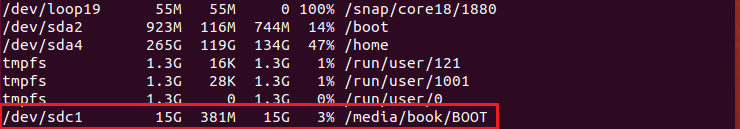
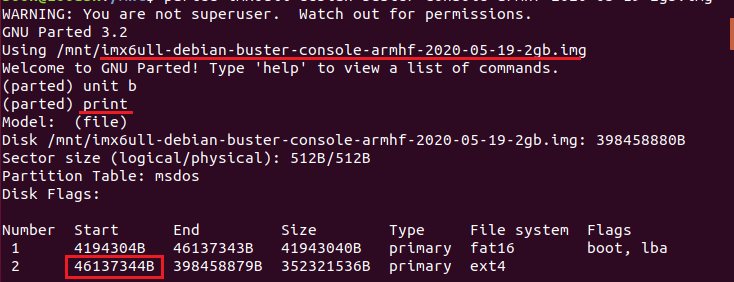
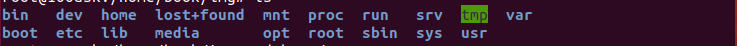
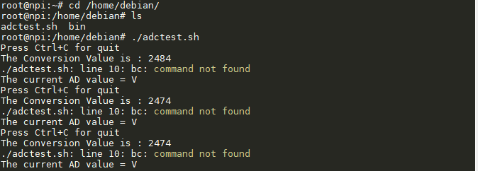

.. vim: syntax=rst

修改.img（镜像）内部的文件
--------------------------- 

1、 准备一张TF卡（比.img文件大的）、开发板、读卡器、.img镜像文件、linux系统（如ubuntu系统）。

2、 将.img镜像备份到TF卡中，我的镜像文件名为imx6ull-debian-buster-console-armhf-2020-05-19-2gb.img。

3、 将已备份好镜像的TF卡插到读卡器中，并将读卡器接入电脑的USB接口中，然后将读卡器挂接到ubuntu系统。

4、 打开ubuntu系统的终端。

5、 输入“df -h”命令查看TF卡被ubuntu系统识别成了哪一个设备，我的是/dev/sdc1设备。

.. code:: bash

    df -h

6、 输入“sudo mount -t vfat /dev/sdc1 /mnt/”命令将TF卡设备挂载到系统的/mnt目录下，注意我的TF卡被系统识别为/dev/sdc1设备，你需根据自己的情况而定。

.. code:: bash

    sudo mount -t vfat /dev/sdc1 /mnt/

7、 输入“parted imx6ull-debian-buster-console-armhf-2020-05-19-2gb.img”命令进入GNU Parted以查看imx6ull-debian-buster-console-armhf-2020-05-19-2gb.img镜像的分区情况，然后输入“print”打印出镜像分区信息。

.. code:: bash

    parted imx6ull-debian-buster-console-armhf-2020-05-19-2gb.img
    print

从上图可以看到imx6ull-debian-buster-console-armhf-2020-05-19-2gb.img镜像的分区情况，值得注意的是红色框框为
文件系统的分区起始地址，因为我们要需改文件系统里面的内容（比如添加、删除、修改一些文件或者添加自己的app），所以我们后面的操作需要
用到此地址信息。

8、 利用mkdir命令创建一个目录，我创建的是img目录，用于镜像挂载。

9、 输入“sudo mount -o loop,offset=46137344 /mnt/imx6ull-debian-buster-console-armhf-2020-05-19-2gb.img ./img”命令，将imx6ull-debian-buster-console-armhf-2020-05-19-2gb.img镜像中的文件系统分区部分挂载到刚刚创建的img目录下。其中offset=46137344参数表示要挂载的偏移地址，也就是我们镜像中文件系统分区的起始地址，挂载成功后在img目录下输入“ls”命令可以看到文件系统的内容了。

.. code:: bash

    sudo mount -o loop,offset=46137344 /mnt/imx6ull-debian-buster-console-armhf-2020-05-19-2gb.img ./img

10、 接着就是修该你要修改的文件了，比如添加自己的app，我这里简单的添加了一个adctest.sh脚本，该脚本的功能是实现adc检测，然后输出adc信息到终端，它被保存到了刚刚挂载的文件系统/home/debian目录下。

11、 修改完成之后记得取消挂载，输入“umount ./img”命令以取消镜像的文件系统挂载，输入“umount /mnt”以取消TF卡设备的挂载。

.. code:: bash

    umount ./img

12、 取出读卡器，将刚刚修改过内容的TF卡插入开发板的TF卡槽并拨动拨码开关以SD卡方式启动，进入系统后可以看到/home/debian目录下有我们增加的adctest.sh脚本，修改脚本的可执行权限后，执行该脚本，可以看到终端打印ADC检测的信息，说明.img镜像修改成功。

