使用buildroot编译文件系统
=========================

Buildroot简介
-------------

Buildroot是一个简单，高效且易于使用的工具，可通过交叉编译生成嵌入式Linux系统。你可以很容易为你的目标系统构建交叉编译工具链、根文件系统、uboot以及Linux内核镜像，Buildroot可以独立的实现其中的一个或几个功能。Buildroot对于嵌入式开发人员来说是一个非常好用的工具，因为嵌入式不像x86平台（PC）一样硬件基本是统一的，嵌入式平台的硬件是根据需求进行裁剪，而不同的硬件对应的程序必然是不同，所以使用Buildroot来配置是一个非常好的选择。

整个Buildroot是由 ``Makefile脚本和Kconfig配置文件`` 构成的，用户可以和编译Linux内核一样，通过config文件进行配置要编译的参数，也可以通过 ``make menuconfig`` 等界面进行修改，然后通过make命令编译出一个完整的，可以直接烧写到开发板上运行的Linux系统软件（如 ``uboot、zimage、dtb`` 已及文件系统）。

更重要的是Buildroot可以很方便添加第三方的编译源码并且编译，很多工具链、源码都可以从Buildroot社区下载，用户也可以让Buildroot从本地导入源码并，这就为我们的开发带来极大的便利，当需要从网上下载时，Buildroot自动可以帮我们下载，当在本地修改后，又可以直接使用Buildroot编译，它实现了工具链下载、解压、依赖包下载编译等一系列机械化的流程，对开发者非常友好。

Buildroot的官方网站是： https://buildroot.org/ ，我们可以打开官网然后下载我们需要的Buildroot工具，我们可以选择 ``buildroot-2019.02.4.tar.gz`` 这个版本的Buildroot作为我们的编译工具即可，虽然Buildroot一直在更新，但是无论是哪个版本基本都是差不多的，大家可以随意下载使用，具体见

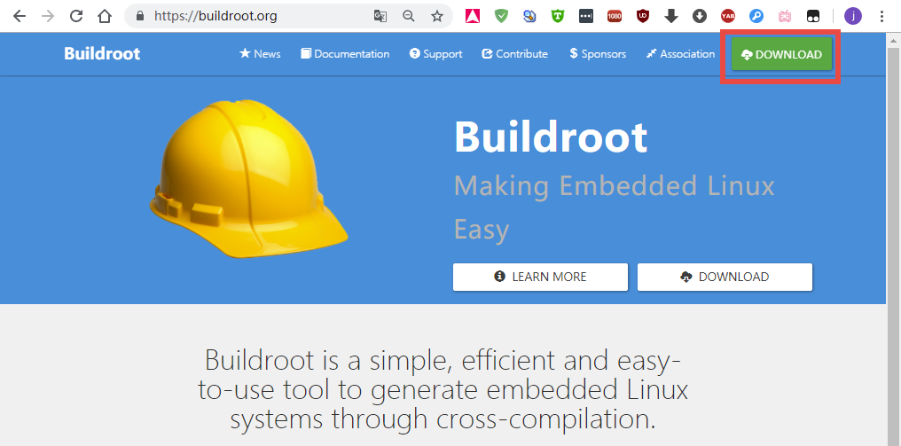

   buildroot
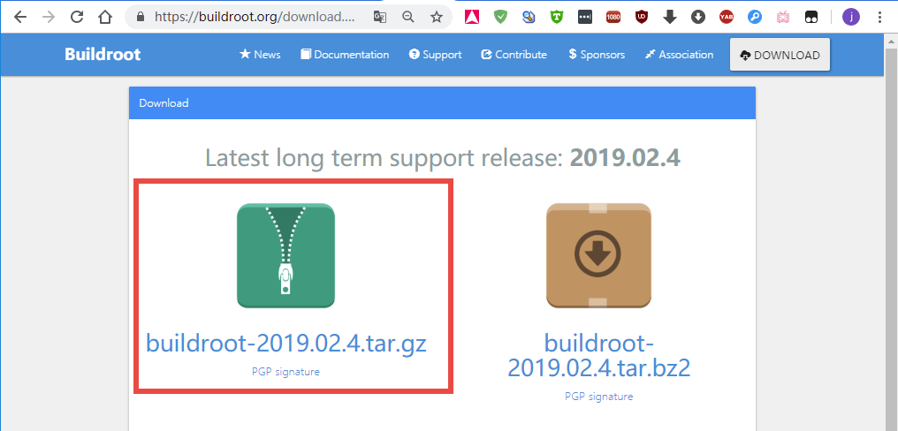

   buildroot
除此之外Buildroot还有非常详细的文档说明，大家可以在Documentation页面下浏览与下载，当然野火提供的资料中也会存在Buildroot的文档说明buildroot-manual.pdf文件，具体见：

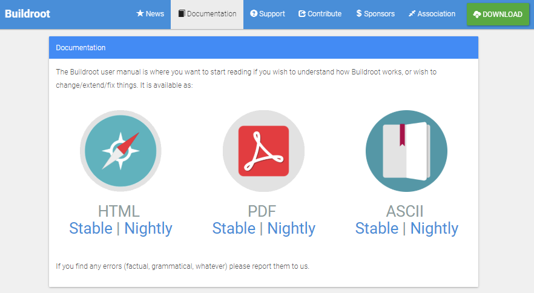

   buildroot
在官网下载的Buildroot是官方的，里面并没有适配野火开发板的配置文件，因此，我还是建议大家在github或者gitee平台下载我们野火适配好的Buildroot源码，然后使用它来编译文件系统即可，如果你是高手，那么请随意玩耍~

github仓库地址： https://github.com/Embedfire/ebf_6ull_buildroot

下载

.. code:: bash

    git clone https://github.com/Embedfire/ebf_6ull_buildroot.git

gitee仓库地址： https://gitee.com/wildfireteam/ebf_6ull_buildroot

下载

.. code:: bash

    git clone https://gitee.com/wildfireteam/ebf_6ull_buildroot.git

Buildroot目录简介
-----------------

将下载好的Buildroot在虚拟机中解压后，就可以看到Buildroot的目录下存在很多文件夹如图所示，下面就简单介绍一下这些文件夹的作用。

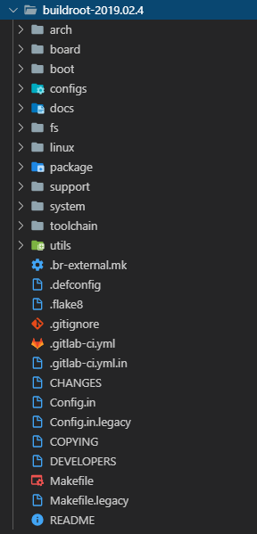

   buildroot

-  arch：存放CPU架构相关的配置脚本，如arm、mips、x86等，这些与CPU相关的脚本在Buildroot制作编译工具链、编译uboot时起关键作用。

-  board：针对不同硬件平台的特有配置文件、脚本与补丁。

-  boot：存放的是引导系统相关的配置文件。

-  configs：这里存放的是一些针对不同硬件平台的特有配置文件合集（xxxx_deconfig），我们在开发过程中为自己开发板配置的文件也可以放入该目录下，比如野火提供的imx6ull开发板的配置文件ebf6ull_s1_pro_defconfig就可以放入该目录下。

-  docs：存放相关的参考文档。

-  fs：存放各种文件系统的配置相关的文件，比如ext2、yassf2等。

-  linux：存放着Linux 内核的自动构建脚本。

-  package：该目录下存放着应用软件包的配置文件，每个应用软件包的配置文件有Config.in和xxxx.mk以及一些补丁文件，其中xxxx.mk文件可以去下载对应名字的应用软件包，这个文件其实就是Makefile脚本的自动构建脚本，根据文件中的描述去下载。

-  support：一些Buildroot支持相关的配置文件，比如docker、kconfig、下载辅助工具、补丁等。

-  system：这里就是根目录的主要骨架，以及启动的初始化配置文件，当制作根目录时就是将此处的文件拷贝到output目录下，然后再下载安装工具链的动态库和用户勾选的package。

-  toolchain：该目录主要存放编译交叉工具的配置文件。

-  utils：存放Buildroot一些通用工具。

-  dl：虽然一开始并没有dl（download）目录，但是在开始使用Buildroot后，会自动生成一个dl目录，它主要用于存放Buildroot工具下载的内容，因为Buildroot是一系列工具的管理集合，它本身并不存在这些编译工具，所以在使用时它自动会下载需要的工具，比如交叉编译器、依赖的库、以及一些软件源码包等（以压缩包的形式存放，Buildroot在使用时会自动解压），都会放在dl目录下。

-  output：虽然一开始Buildroot也并没有output目录，但是在开始使用Buildroot后，就会自动生成output目录，它是编译出来的输出文件夹，里面存放着解压后的各种软件包编译完后的现场。同时output目录下还有各种文件夹，如host文件夹是由各类源码编译后在主机上运行工具的安装目录，如arm-linux-gcc就是安装在这里；build文件夹是所有源码包解压出来的文件存放地和编译的发生地；images文件夹则是在我们编译完成后存放uboot、内核镜像、设备树以及文件系统等结果的。

    提示：对于其他的未列出来的目录，暂时不用去理会。

编译前的准备
------------

Buildroot的使用是需要依赖源码包的，它会去寻找要编译的源码包，我们可以选择网络上的的源码包也可以选择本地的源码包，那么在这一章中我们就只选择本地的kernel与uboot源码包，从前面的章节我们也编译了kernel与uboot，此处对这些源码包就不再重复赘述，但是有一点读者必须要注意，更新了本地的源码包要用git记录，否则Buildroot不知道你已经更新过的。

根据Buildroot官方文档说明，Buildroot会强制性使用一些工具包，如所示，这是为了Buildroot能正常编译，因此我们在使用前尽量查看一下当前系统的环境下是否存在这些软件包，或者可以直接通过sudo
apt-get install命令去下载它们：

.. code:: bash

    sudo apt-get install -y sed make binutils build-essential gcc g++ bash patch gzip bzip2 perl tar cpio python unzip rsync file bc wget g++-multilib

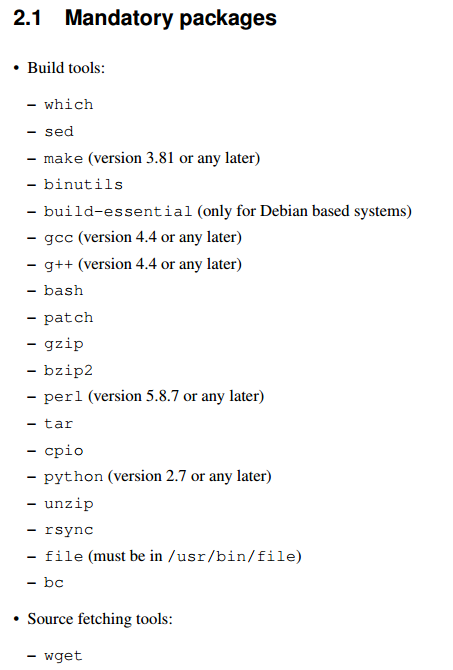

   buildroot
    提示：此处使用ubuntu18.04作为测试。

选择配置文件
------------

Buildroot为了方便用户使用，在configs目录下提前配置好了很多平台的配置，我们可以在这里找一个与我们开发板最符合的配置文件，然后根据文件中的配置来修改出我们开发板的配置文件即可。当然野火是有提供默认的配置文件：

**1.带Qt Demo的配置：**

.. code:: bash

    imx6ull_ebf_pro_defconfig

**2.最小的完整镜像配置（文件系统6M左右）：**

.. code:: bash

    imx6ull_ebf_minimal_defconfig

**3.pico文件系统配置（不编译uboot与内核，文件系统5M左右）：**

.. code:: bash

    imx6ull_ebf_pico_defconfig

    ps: 以上配置选择其中之一即可

这些配置文件就是根据configs目录下的 ``imx6ulevk_defconfig`` 修改，适配我们野火的imx6ull开发板。

比如我们直接选择 ``imx6ull_ebf_pro_defconfig`` 作为我们编译的配置文件，那么可以运行以下命令将其写入到 ``.config`` 文件：

.. code:: bash

    make imx6ull_ebf_pro_defconfig

    # 输出
    #
    # configuration written to /home/jiejie/ebf_6ull_buildroot/.config
    #

很显然这操作过程与我们编译内核的过程是一样的，都是将配置文件的信息写入当前目录下的
.config文件中，然后通过make menuconfig命令进行配置：

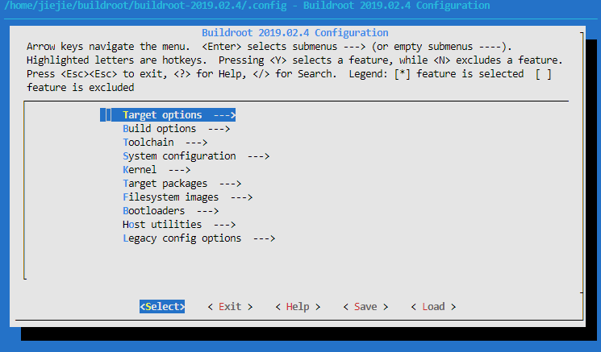

   buildroot
通过配置界面就可以很容易找的自己要配置的选项，我们可以来看看这些配置的主要功能：
-
``Target options  --->`` ：目标单板架构配置，在这里主要是选择要编译的平台架构，如cortex-A7；选择CPU的大小端模式，选择支持浮点等等，具体配置如下：

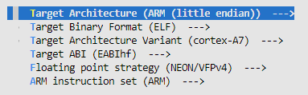

   buildroot

-  ``Build options  --->`` ：编译相关的配置，主要是一些编译时用到的选项，比如设置当前配置的保存位置（Location
   to save buildroot
   config），根据自己的路径设置即可，设置dl的路径（下载代码包使用的路径：$(TOPDIR)/dl），多个线程编译的线程数量（如果设置为0则自动选择多个线程编译），是否使能编译器缓冲区；设置下载镜像Mirrors
   and Download
   locations：一般来说Buildroot会默认从国外的网站下载镜像，而在国内下载则很慢，我们可以修改镜像源：

.. code:: bash

    #设置下载镜像Mirrors and Download locations：
    内核镜像源：https://mirror.bjtu.edu.cn/kernel 
    GNU镜像源：https://mirrors.tuna.tsinghua.edu.cn/gnu/ 
    清华镜像站汇总：https://mirrors.tuna.tsinghua.edu.cn/

    # 提示：用清华镜像站会找不到内核。 
    北京交通大学镜像站：https://mirror.bjtu.edu.cn/ 
    中国科学技术大学镜像站：http://mirrors.ustc.edu.cn/

Build options具体配置如下:

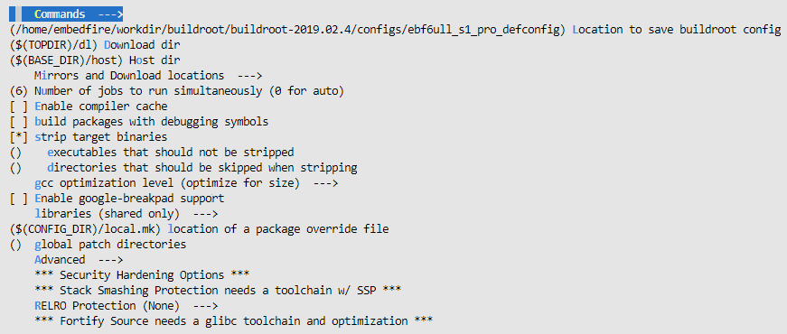

   buildroot
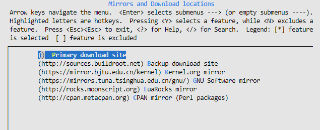

   buildroot
    如后期有改变则以配置文件为主，建议尽量不改动已发布的配置文件。

-  ``Toolchain  --->`` ：工具链选项主要是让用户选择合适自己的交叉编译工具链，可以选择Buildroot提供的工具链（内部工具链 ``Buildroot toolchain`` ），也可以指定其他非Buildroot提供的工具链（外部工具链 ``External toolchain`` ），我们默认选择外部提供的工具链： ``gcc-linaro-5.3.1-2016.05-x86_64_arm-linux-gnueabihf`` ，C库可以选择uClibc-ng,、glibc
   和musl，我们选择glibc，还有选择内核头文件版本（要求比目标内核版本新）、是否使能宽字符（WCHAR）支持（如果需要支持Python则需要使能）、选择gcc编译器版本、是否使能c++等，具体配置如下：

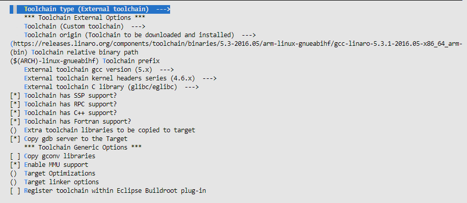

   buildroot

-  ``System configuration  --->`` ：系统相关的配置，比如配置系统主机名，它的主要作用是：在一个局域网中，每台机器都有一个主机名，用于主机与主机之间的便于区分，就可以为每台机器设置主机名，以便于以容易记忆的方法来相互访问；设置登陆界面的欢迎信息。选择密码的加密方式，我们可以选择SHA256加密算法（sha-25），设置root登陆的密码、设置默认的命令行终端（我们默认选择bash）、设置默认的登陆串口（开发板连接到电脑的输入/输出）、设置系统默认的环境变量（PATH）、以及选择构建系统镜像版本，根文件系统覆盖（野火的配置中就将一些脚本与相关内容放到 ``board/embedfire/ebf-imx6ull-pro/rootfs-overlay`` 目录下，在制作成文件系统时将这些文件添加到文件系统中）、以及一些运行的脚本（buildroot官方为imx6ull制作的打包脚本： ``board/freescale/common/imx/post-image.sh`` ）等，具体配置如下：

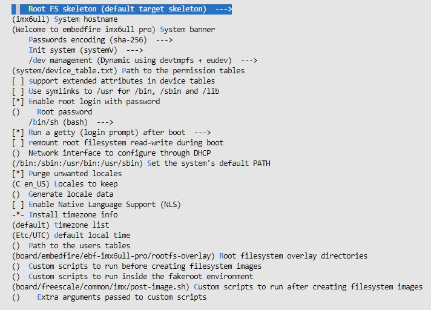

   buildroot

-  ``Kernel  --->`` ：linux内核相关的配置，用户可以选择要编译的内核版本及源码，可以从网上下载（比如野火的配置文件就是从gitee仓库下载最新的内核源码），除此之外也可以从本地导入（其实对Buildroot来说也算是下载，因为这些文件都会被下载到dl目录下），还可以指定编译内核的默认配置文件（ ``imx6_v7_ebf，即imx6_v7_ebf_defconfig`` ，但此处的配置文件不需要后缀名defconfig）、内核二进制文件格式、选择是否编译设备树与指定编译的设备树（DTB）、以及其他的一些扩展。具体配置如下：

指定内核源码编译的设备树如下：

-  imx6ull-14x14-evk-btwifi.dtb
-  imx6ull-14x14-evk.dtb
-  imx6ull-14x14-evk-emmc-43.dtb
-  imx6ull-14x14-evk-emmc-cam-dht11.dtb
-  imx6ull-14x14-evk-emmc.dtb
-  imx6ull-14x14-evk-emmc-hdmi.dtb
-  imx6ull-14x14-evk-emmc-wifi.dtb
-  imx6ull-14x14-evk-gpmi-weim-43.dtb
-  imx6ull-14x14-evk-gpmi-weim-cam-dht11.dtb
-  imx6ull-14x14-evk-gpmi-weim-hdmi.dtb
-  imx6ull-14x14-evk-gpmi-weim-wifi.dtb

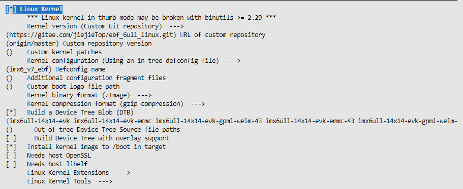

   buildroot

-  ``Target packages  --->`` ：这个是Buildroot的包管理相关的配置选项，读者可以从这里选择自己需要的软件包，Buildroot
   提供了海量软件包可选，只需在配置界面选中所需要的软件包，交叉编译后即可使用。比如添加音视频应用相关的软件包、添加压缩和解压缩相关的软件包、添加字体、游戏、图形库（QT）、语言和脚本（Python、PHP等）、网络（蓝牙、wifi、http工具包）等软件包，在我们开发板就添加了支持QT与Python的软件包，因此可以在开发板中使用QT与Python，由于配置较多，就不再截图，根据配置文件查看即可。注意：Busybox是必选的。

    假设我们系统中缺失一些库，那么可以在这里选择有没有对应的软件包，如果没有则需要自己手动制作了。

-  ``Filesystem images  --->`` ：文件系统镜像配置。可以选择生成的文件系统镜像类型
   ，如 ``tar、cpio、ext2/3/4、 jffs2、 yaffs2 和 ubifs``
   等。文件系统镜像可能会非常大，具体取决于你选择的文件系统类型、软件包的数量以及是否配置的可用空间等，具体配置如下：

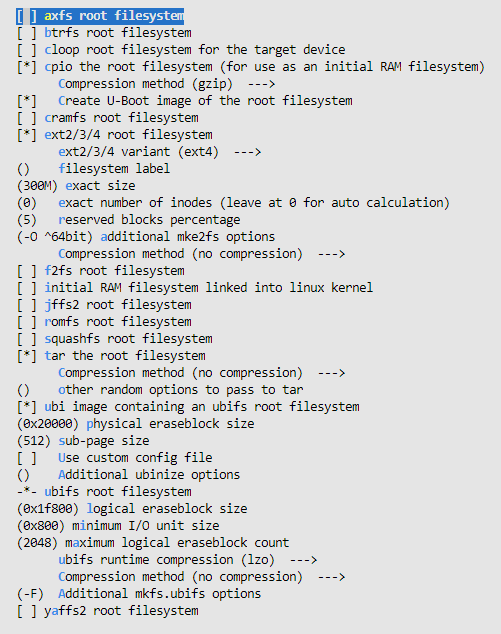

   buildroot

-  ``Bootloaders  --->`` ：Bootloaders相关的配置，在这个配置选项中，读者可以选择要编译的Bootloaders
   引导程序（如 ``grub2、ts4800-mbrboot、uboot`` 等，我们默认选择uboot），指定uboot的名字、下载的位置（可以是从网上下载，写入正确的URL即可；也可以从本地导入，写入本地路径即可），指定uboot的版本，我们默认使用野火的uboot仓库，使用最新发布的uboot版本，具体配置如下：

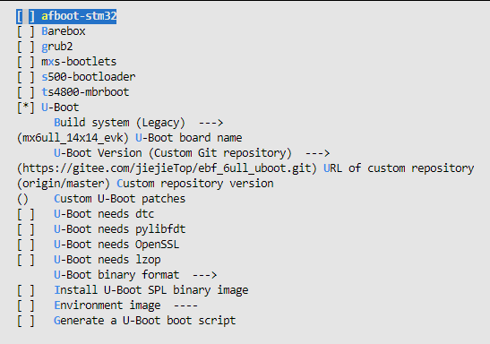

   buildroot

-  ``Host utilities  --->`` ：主机通用配置，使用默认配置即可。

-  ``Legacy config options  --->`` ：使用默认配置即可。

当配置完成，退出后会发现所有的配置都被写入当前目录下的 .config文件：

.. code:: bash

    configuration written to /home/jiejie/ebf_6ull_buildroot/.config

    *** End of the configuration.
    *** Execute 'make' to start the build or try 'make help'.

如果你想将这次配置的文件保存起来，那么可以通过以下命令保存：

::

     make savedefconfig 

然后我们可以执行 ``make`` 命令进行编译操作， ``make`` 命令通常会执行以下步骤：

1. 根据配置需要下载源文件

2. 配置、构建和安装交叉编译工具链，或者只是导入外部工具链

3. 配置、构建和安装选定的目标软件包

4. 则构建内核镜像

5. 构建引导加载程序镜像

6. 以所选格式创建根文件系统

执行 ``make`` 命令后就等待它编译完成即可，在编译完成后可以在 ``output/images`` 目录下找到编译产生的镜像，具体见

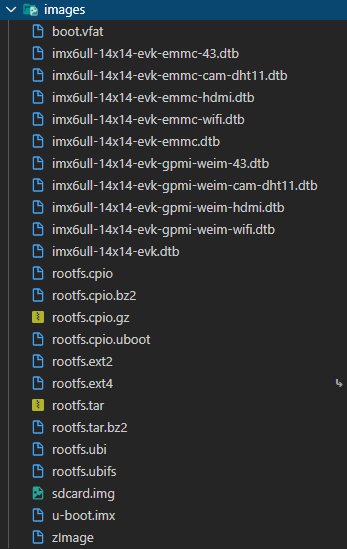

   buildroot
编译生成的设备树、内核、文件系统等都可以烧录到野火imx6ull开发板上，具体的烧录过程在烧录测试小节中已经讲解，此处就不再重复赘述。

Buildroot其他分析
-----------------

正如前面所说的Buildroot是一个非常强大的工具，它可以随意依赖第三方的库以及工具，能快速构建我们需要的内容，如果你想了解一下Buildroot编译生成的内容的一些时间、依赖、大小等情况，通过代码肯定是不方便，Buildroot还提供可视化分析的工具，我们只需一句命令即可使用它们。

当然，按照官方文档的说明，需要在主机上安装必须的软件包python-matplotlib
和python-numpy，我们可以通过以下命令进行安装：

.. code:: bash

    sudo apt-get install -y python-matplotlib python-numpy

Buildroot的工作之一是了解包之间的依赖关系，并确保它们以正确的顺序构建。
这些依赖关系有时可能非常复杂，对于给定的系统，通常不容易理解为什么这样或那样的包被Buildroot引入并且成功构建。为了帮助理用户解依赖关系，从而更好地理解嵌入式Linux系统中不同组件的作用，Buildroot能够生成依赖关系图，通过make
graph-depends命令即可生成对应的依赖文件（默认是PDF格式），具体情况如下：

.. code:: bash

    命令
    make graph-depends

    最后输出提示：
    -o /home/ embedfire /buildroot/buildroot-2019.02.4/output/graphs/graph-depends.pdf  /home/embedfire/buildroot/buildroot-2019.02.4/output/graphs/graph-depends.dot

当然，Buildroot还能生成关于编译时间与编译占用资源大小的分析图，只需要通过make
graph-build与make graph-size命令生成即可，具体见（已删减输出信息）：

.. code:: bash

    命令
    make graph-build

    make graph-size

然后可以看到在output/graphs目录下多了一些pdf文件，这些就是Buildroot生成的可视化分析文件，可以直接打开他们，具体见：

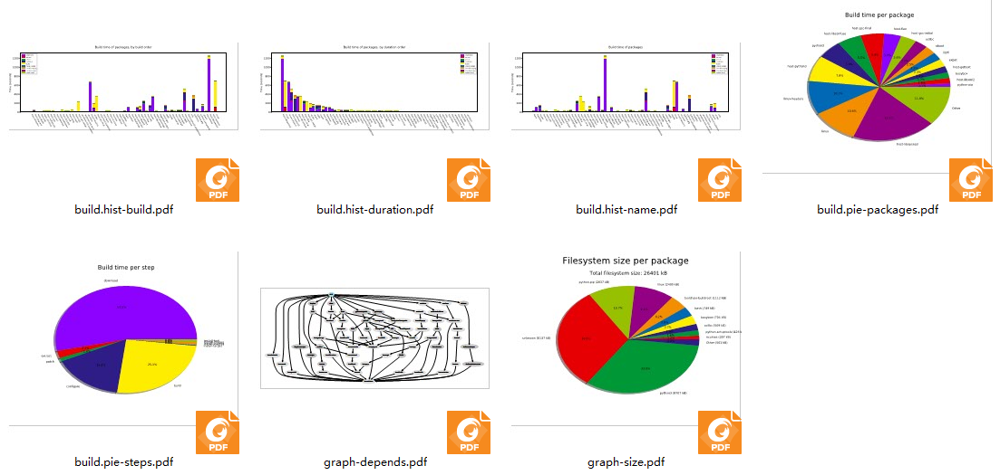

   buildroot
.. figure:: media/usingb018.png
   :alt: buildroot

   buildroot
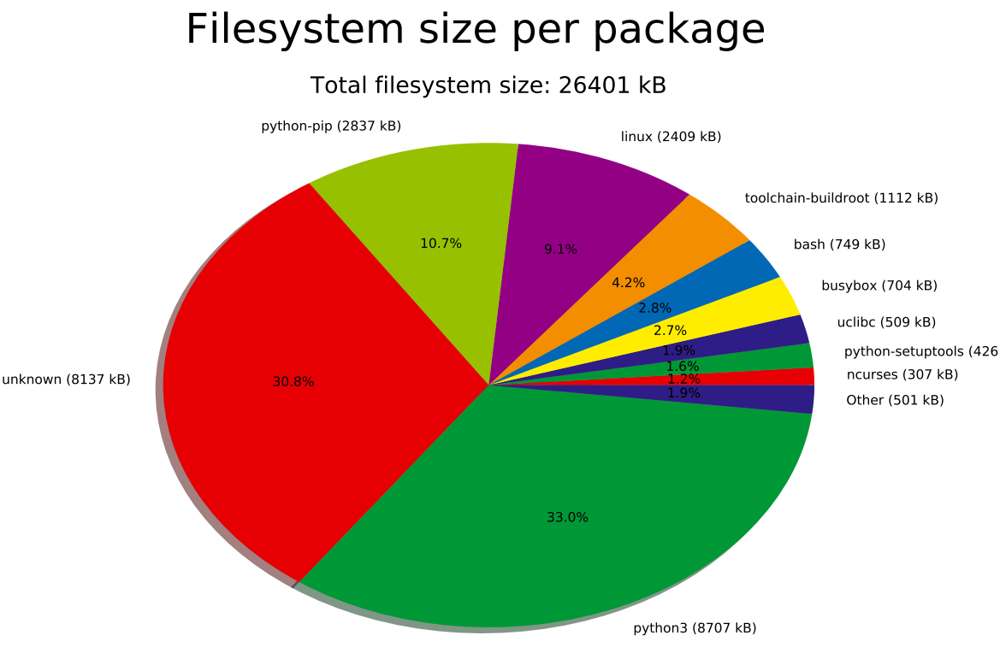

   buildroot
其他的一些问题
--------------

由于buildroot会在国外的网站下载很多东西，所以在下载时会很慢很慢，有可能出现下载失败的情况，那么可以根据日志信息手动去下载对应的软件包。

如果在生成镜像时失败，可以尝试清除一下install状态，然后重新编译。

.. code:: bash

    ./clear.sh 

还有需要注意的是：由于本项目是 ``Buildroot`` 使用
``arm-linux-gnueabihf-5.3.1``
编译工具链编译的，与单独编译的内核镜像使用的编译器版本不一致，可能会导致某些内核模块无法加载，因此如果有必要的话，将 ``output/images/`` 目录下的内核镜像
``zImage`` 替换掉原本的内核镜像！同理，设备树亦是如此！
