.. vim: syntax=rst

探索Systemd
-----------------------------------------------------

前面我们简单的介绍了Systemd的启动方式，本章我们带领大家详细分析systemd的高级用法。

系统管理
~~~~~~~~~~~~~~~~~~~~~~~~

systemd不是一个命令，而是一组命令的集合，提供了一个系统和服务管理器，运行为 PID 1 并负责启动其它程序。
下图为systemd的架构图。

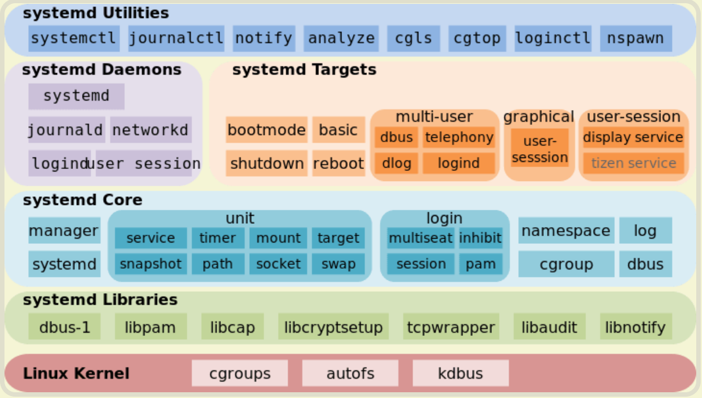

systemd功能包括：支持并行化任务；同时采用 socket 式与 D-Bus 总线式激活服务；按需启动守护进程（daemon）；
利用 Linux 的 cgroups 监视进程；支持快照和系统恢复；维护挂载点和自动挂载点；各服务间基于依赖关系进行精密控制。
systemd 支持 SysV 和 LSB 初始脚本，可以替代 sysvinit。除此之外，功能还包括日志进程、控制基础系统配置，
维护登陆用户列表以及系统账户、运行时目录和设置，可以运行容器和虚拟机，可以简单的管理网络配置、网络时间同步、
日志转发和名称解析等。

Systemd--基本工具
~~~~~~~~~~~~~~~~~~~~~~~~

systemctl
^^^^^^^^^^^^^^^^^^^^^^^^^^^^^^^

监视和控制systemd的主要命令是systemctl。该命令可用于查看系统状态和管理系统及服务。

.. code-block:: s

    # 输出激活的单元
    $ systemctl

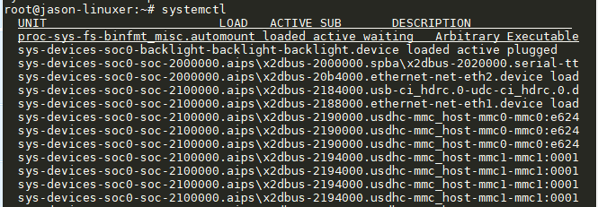

.. code-block:: s

    # 显示系统状态l
    $ systemctl status -l

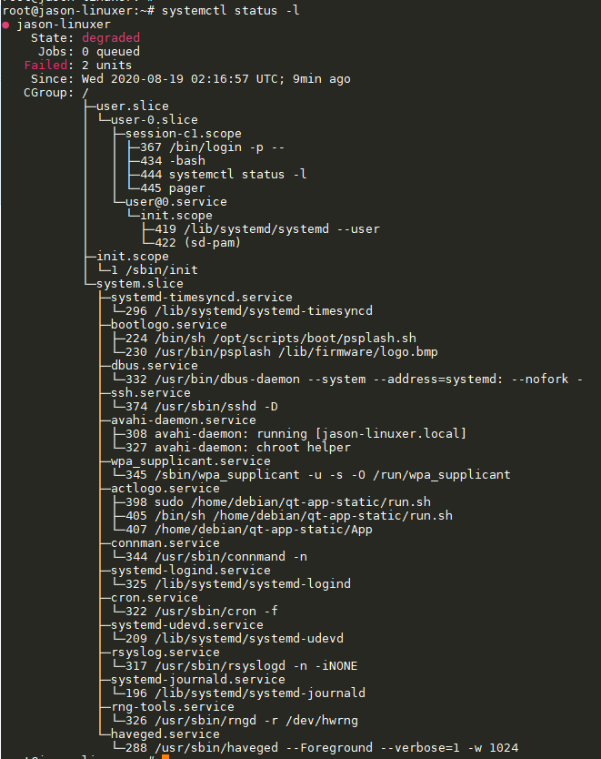

.. code-block:: s

    # 显示 cgroup slice, 内存和父 PID
    $ systemctl status pid

.. code-block:: s

    # 重启系统
    $ sudo systemctl reboot

    # 暂停系统
    $ sudo systemctl suspend

    # 关闭系统，切断电源
    $ sudo systemctl poweroff

    # CPU停止工作
    $ sudo systemctl halt

    # 让系统进入冬眠状态
    $ sudo systemctl hibernate

    # 让系统进入交互式休眠状态
    $ sudo systemctl hybrid-sleep

    # 启动进入救援状态（单用户状态）
    $ sudo systemctl rescue

    # 输出运行失败的单元
    $ systemctl --failed

systemd-analyze
^^^^^^^^^^^^^^^^^^^^^^^^^^^^^^^

systemd-analyze命令用于查看启动耗时。

.. code-block:: s

    # 查看启动耗时
    $ systemd-analyze          

.. code-block:: s

    # 查看每个服务的启动耗时
    $ systemd-analyze blame

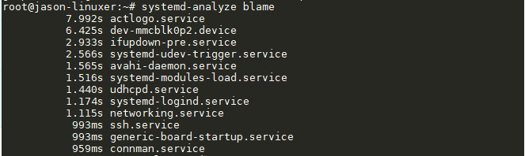

.. code-block:: s

    # 显示瀑布状的启动过程流
    $ systemd-analyze critical-chain

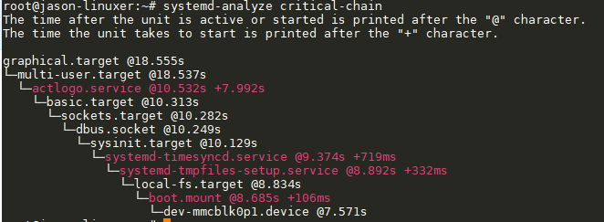

.. code-block:: s

    # 显示指定服务的启动流
    $ systemd-analyze critical-chain atd.service

hostnamectl
^^^^^^^^^^^^^^^^^^^^^^^^^^^^^^^

hostnamectl命令可用于查看当前的主机信息，当然也可以直接输入hostname来查看，但是当我们
想要修改主机名的时候就显得没那么方便，每次都要找到hostname文件，并将其打开再做修改，hostnamectl
使得我们对主机名的操作更加简便。

.. code-block:: s

    # 显示当前主机的信息
    $ hostnamectl

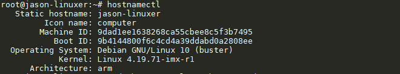

.. code-block:: s

    # 设置主机名
    $ sudo hostnamectl set-hostname jason

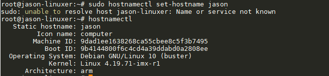

可以看到主机名Static hostname已被修改。 

localectl
^^^^^^^^^^^^^^^^^^^^^^^^^^^^^^^

localectl命令可用于查询与修改系统的本地化(locale)与键盘布局的设置。 
它通过与 systemd-localed.service(8) 通信来修改例如 /etc/locale.conf 与 /etc/vconsole.conf 
之类的配置文件。本地化设置控制着 用户界面的语言、字符类型与字符编码、 日期时间与货币符号的表达方式 等许多细节。

.. code-block:: s

    # 查看本地化设置
    $ localectl

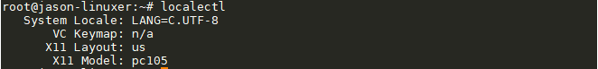

.. code-block:: s

    # 设置本地化参数。
    $ sudo localectl set-locale LANG=en_GB.utf8
    $ sudo localectl set-keymap en_GB

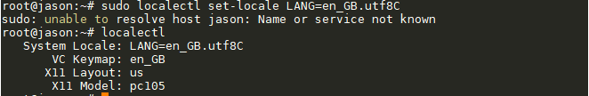

timedatectl
^^^^^^^^^^^^^^^^^^^^^^^^^^^^^^^

timedatectl命令可以查询和更改系统时钟和设置，
你可以使用此命令来设置或更改当前的日期，时间和时区，或实现与远程NTP服务器的自动系统时钟同步。

.. code-block:: s

    # 查看当前时区设置
    $ timedatectl

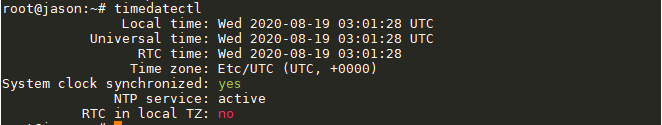

.. code-block:: s

    # 显示所有可用的时区
    $ timedatectl list-timezones     

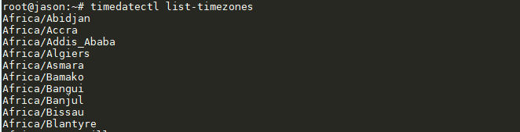

.. code-block:: s

    # 选择中国上海的时区
    $ timedatectl set-timezone "Asia/Shanghai"  

.. image:: media/systemd_pre012.PNG
   :align: center
   :alt: 未找到图片12| 

.. code-block:: s

    # 设置时间和日期
    $ timedatectl set-time 12:58:20
    $ timedatectl set-time 2020-8-20

注意在设置时间与日期时要关闭时间同步功能，输入“timedatectl set-ntp no”命令来关闭时间同步，
输入“timedatectl set-ntp yes”命令来开启时间同步，

timedatectl
^^^^^^^^^^^^^^^^^^^^^^^^^^^^^^^

loginctl命令可用于检查和控制systemd的状态；查看已经登录的用户会话消息。

.. code-block:: s

    # 显示所有会话及属性
    $ loginctl -a 

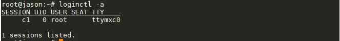

.. code-block:: s

    # 显示会话配置消息
    $ loginctl show-session

.. image:: media/systemd_pre014.PNG
   :align: center
   :alt: 未找到图片14| 

.. code-block:: s

    # 列出显示指定用户的信息
    $ loginctl show-user root

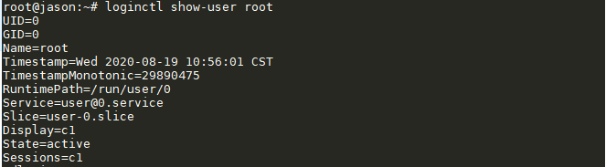

Systemd--核心概念
~~~~~~~~~~~~~~~~~~~~~~~~

unit
^^^^^^^^^^^^^^^^^^^^^^^^^^^^^^^

单元文件是 ini 风格的纯文本文件，Systemd 可以管理所有系统资源，不同的资源统称为 Unit（单位）。
其封装了12种对象的信息：服务(service)、套接字(socket)、设备(device)、挂载点(mount)、
自动挂载点(automount)、 启动目标(target)、交换分区或交换文件(swap)、被监视的路径(path)、
任务计划(timer)、 资源控制组(slice)、一组外部创建的进程(scope)、快照(snapshot)。

 - service：一个后台服务进程，其封装了守护进程的启动、停止、重启与重载等操作。

 - socket：此类配置单元封装系统和互联网中的一个套接字。当下，systemd支持流式，数据报和连续包的 AF_INET，AF_INET6，AF_UNIX socket。每个套接字配置单元都有一个相应的服务配置单元，相应的服务在第一个“连接”进入套接字时就会启动（例如：nscd.socket在有新连接后便启动nscd.service），监控系统或者网络的数据信息。

 - device：此类配置单元封装一个存在于Linux设备树中的设备。每个使用udev规则标记的设备都将会在systemd中作为一个设备配置单元出现，定义设备之间的依赖关系。

 - mount：此类配置单元封装文件系统结构层次中的一个挂载点。systemd将对这个挂载点进行监控和管理。比如，可以在启动时自动将其挂载，可以在某些条件下自动卸载。systemd会将/etc/fstab中的条目都转换为挂载点，并在开机时处理。

 - automount：此类配置单元封装系统结构层次中的一个自挂载点。每个自挂载配置单元对应一个挂载配置单元，当该自动挂载点被访问时，systemd执行挂载点中定义的挂载行为。

 - Swap：和挂载配置单元类似，交换配置单元用来管理交换分区。用户可以用交换配置单元来定义系统中的交换分区，可以让这些交换分区在启动时被激活。

 - target：此类配置单元为其他配置单元进行逻辑分组。它们本身实际上并不做什么，只是引用其他配置单元而已，这样便可以对配置单元做一个统一的控制，就可以实现大家都非常熟悉的运行级别的概念。比如，想让系统进入图形化模式，需要运行许多服务和配置命令，这些操作都由一个个的配置单元表示，将所有的这些配置单元组合为一个目标（target），就表示需要将这些配置单元全部执行一遍，以便进入目标所代表的系统运行状态（例如：multi-user.target相当于在传统使用sysv的系统中运行级别5）。

 - timer：定时器配置单元用来定时触发用户定义的操作。这类配置单元取代了atd，crond等传统的定时服务。

 - snapshot：与target配置单元相似，快照是一组配置单元，它保存了系统当前的运行状态。

 - slice：表示一个CGroup 的树。

 - path：监控指定目录或文件的变化，并触发其它 Unit 的运行。

 - scope：它用于描述一些系统服务的分组信息。

每个配置单元都有一个对应的配置文件，比如一个avahi-daemon服务对应一个avahi-daemon.service文件。
这种配置文件的语法非常简单，用户不需要再编写和维护复杂的sysv脚本了。

.. code-block:: s

    # 列出正在运行的 Unit
    $ systemctl list-units

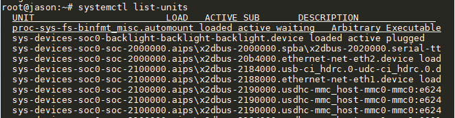

.. code-block:: s

    # 列出所有Unit，包括没有找到配置文件的或者启动失败的
    $ systemctl list-units --all

    # 列出所有没有运行的 Unit
    $ systemctl list-units --all --state=inactive

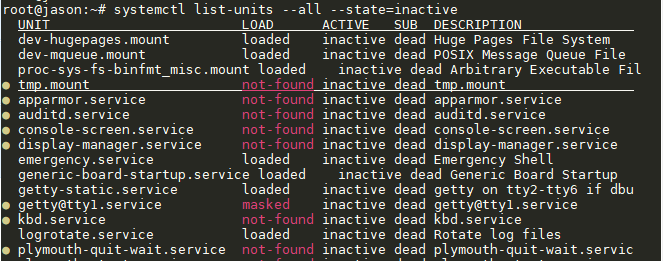

.. code-block:: s

    # 列出所有加载失败的 Unit
    $ systemctl list-units --failed

    # 列出所有正在运行的、类型为 service 的 Unit
    $ systemctl list-units --type=service

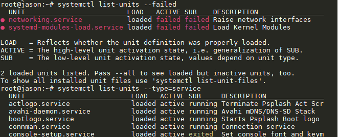

.. code-block:: s

    # 显示某个 Unit 是否正在运行
    $ systemctl is-active systemd-timesyncd.service

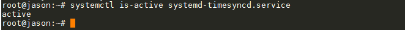

.. code-block:: s

    # 显示某个 Unit 服务是否建立了启动链接
    $ systemctl is-enabled systemd-timesyncd.service

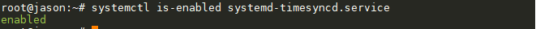

unit--管理
^^^^^^^^^^^^^^^^^^^^^^^^^^^^^^^

.. code-block:: s

    # 立即启动一个服务
    $ sudo systemctl start bootlogo.service

    # 立即停止一个服务
    $ sudo systemctl stop bootlogo.service

    # 重启一个服务
    $ sudo systemctl restart bootlogo.service

    # 杀死一个服务的所有子进程
    $ sudo systemctl kill bootlogo.service

    # 重新加载一个服务的配置文件
    $ sudo systemctl reload bootlogo.service

    # 重载所有修改过的配置文件
    $ sudo systemctl daemon-reload

    # 显示某个 Unit 的所有底层参数
    $ systemctl show httpd.service

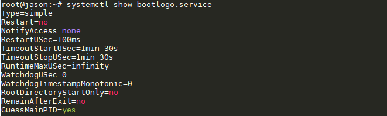

.. code-block:: s

    # 显示某个 Unit 的指定属性的值
    $ systemctl show -p CPUShares avahi-daemon.service

    # 设置某个 Unit 的指定属性
    $ sudo systemctl set-property avahi-daemon.service CPUShares=500

unit--依赖
^^^^^^^^^^^^^^^^^^^^^^^^^^^^^^^

尽管systemd将大量的启动工作解除了依赖，使得它们可以并行启动。但还是存在一些任务，
它们之间存在天生的依赖关系，不能用“套接字激活”（socket activation）,
D-Bus activation和autofs三大方法来解除依赖。比如，挂载必须等待挂载点在文件系统中被创建； 
挂载也必须等待相应的物理设备就绪。为了解决这类依赖问题，systemd的配置单元之间可以彼此定义依赖关系。
比如，unit Q依赖unit W，可以在unit W的定义中用“require Q”来表示，这样systemd就会保证先启动Q再启动W。
systemd能保证事务完整性。systemd的事务概念和数据库中的有所不同，
主要是为了保证多个依赖的配置单元之间没有环形引用。若存在循环依赖，那么systemd将无法启动任意一个服务。
此时，systemd将会尝试解决这个问题，因为配置单元之间的依赖关系有两种：requireds为强依赖，wants为弱依赖，
systemd将去掉wants关键字指定的依赖看看是否能打破循环。如果无法修复，systemd会报错。
systemd能够自动检测和修复这类配置错误，极大地减轻了管理员的拔锚负担。

.. code-block:: s

    # 命令列出一个 Unit 的所有依赖
    $ systemctl list-dependencies avahi-daemon.service

.. image:: media/systemd_pre022.PNG
   :align: center
   :alt: 未找到图片22| 

上面命令的输出结果之中，有些依赖是 Target 类型，而 Target 类型默认是不会展开显示的。
若要展开显示 Target，则需要添加--all参数。

.. code-block:: s

    # 命令列出一个 Unit 的所有依赖，并展开显示Target 依赖类型
    $ systemctl list-dependencies --all avahi-daemon.service

unit--配置文件
^^^^^^^^^^^^^^^^^^^^^^^^^^^^^^^

上一章节和大家介绍了init进程的配置文件/etc/inittab，与此类似，systemd的unit也有一个配置文件，
systemd的配置文件默认会存放于文件系统中的/etc/systemd/system目录下，我们输入“ls -al”命令查看一下该目录的内容。

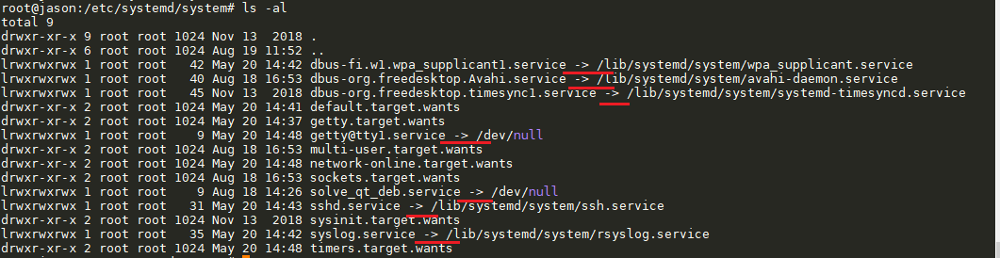

可以看到该目录下有很多链接符号“->”，这代表着文件的实体是“->”指向的文件，可以说是软链接的关系，和windows上的快捷
方式类似（有点类似月老牵线^-^），而这些软链接所指向的目录绝大多数是/lib/systemd/system目录，也有指向/dev/null文件的，这代表它是一个空文件，
初始化过程中systemd只执行/etc/systemd/system目录里面的配置文件。当你安装完systemd程序之后，他会自动的在/lib/systemd/system
目录下生成一个与该程序对应的配置文件。
你可以使用“systemctl enable xxx.service”的方式来建立一个服务软链接，若设置了开机启动，则“systemctl enable”
相当于使能开机启动，而“systemctl disable”命令与之相反，他会断开软链接，所以开机就不会启动。

.. code-block:: s

    # 检查某个单元是否是开机自启动的（建立的启动链接）
    $ systemctl is-enabled avahi-daemon.service

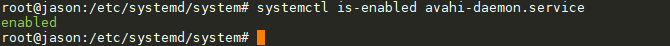

unit--系统管理
^^^^^^^^^^^^^^^^^^^^^^^^^^^^^^^

.. code-block:: s

    # 重启系统（异步操作）
    $ systemctl reboot

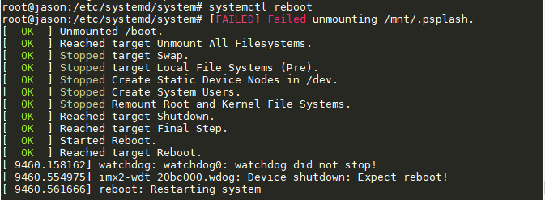

.. code-block:: s

    # 关闭系统，切断电源（异步操作）
    $ systemctl poweroff

    # 仅CPU停止工作，其他硬件仍处于开机状态（异步操作）
    $ systemctl halt

    # 暂停系统（异步操作），执行suspend.target
    $ systemctl suspend

    # 使系统进入冬眠状态（异步操作），执行hibernate.target
    $ systemctl hibernate

unit--日志管理
^^^^^^^^^^^^^^^^^^^^^^^^^^^^^^^

Systemd 统一管理所有 Unit 的启动日志。带来的好处就是，可以只用journalctl一个命令，查看所有日志（内核日志和应用日志）。

日志配置文件位于/etc/systemd/journald.conf，其保存目录为/var/log/journal/
默认情况下日志最大限制为所在文件系统容量的 10%，可通过/etc/systemd/journald.conf 中的 SystemMaxUse 字段来指定日志最大限制。

.. attention:: /var/log/journal/目录是 systemd 软件包的一部分。若被删除，systemd 不会自动创建它，直到下次升级软件包时重建该目录。如果该目录缺失，systemd 会将日志记录写入 /run/systemd/journal。这意味着，系统重启后日志将丢失。

.. code-block:: s

    # 查看所有日志
    $ sudo journalctl

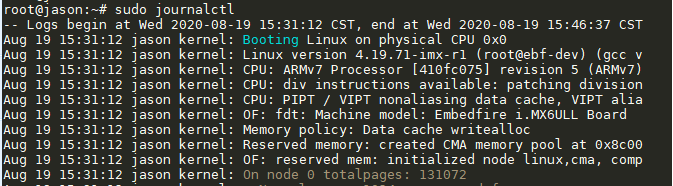

.. code-block:: s

    # 指定日志文件占据的最大空间
    $ sudo journalctl --vacuum-size=8M

关于systemd的知识点还有很多，这里做简单介绍，主要是让大家了解systemd的基本用法，
感兴趣的可以在网上查阅相关文档。