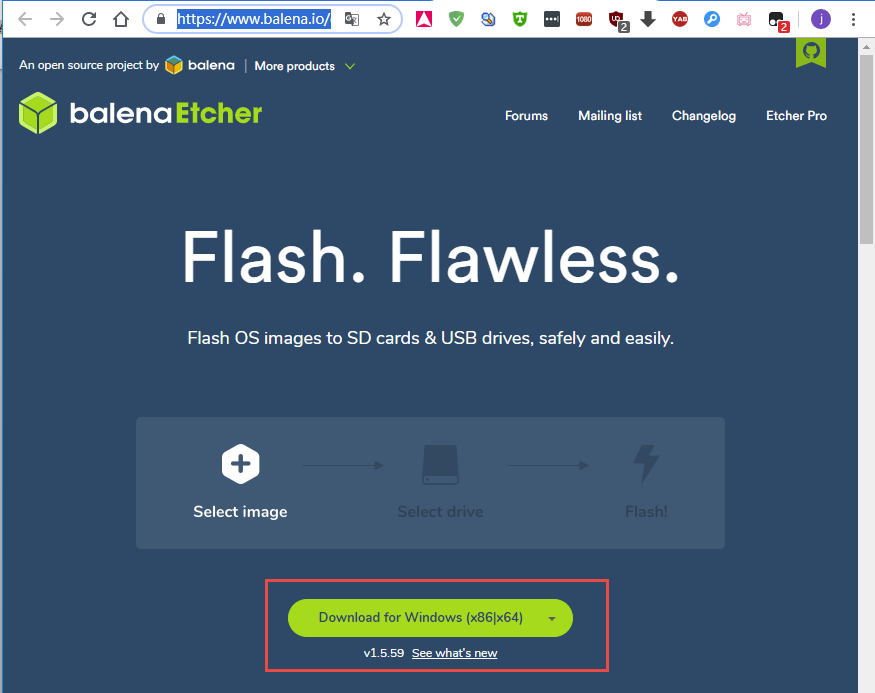
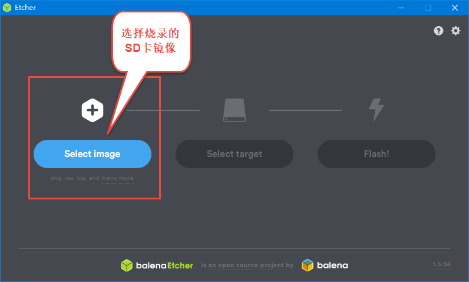
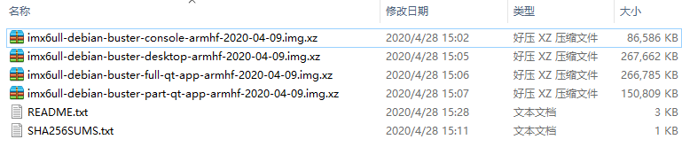
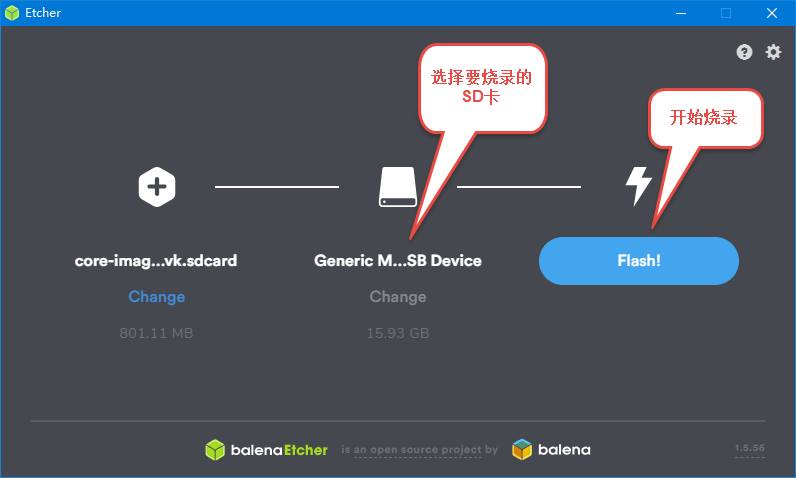
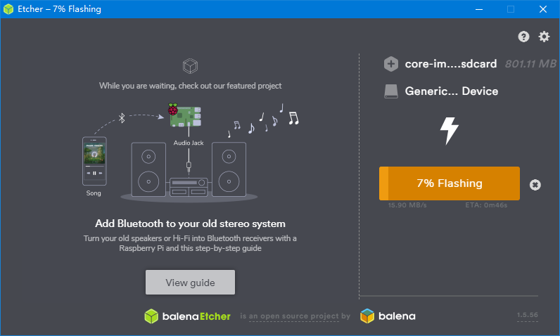
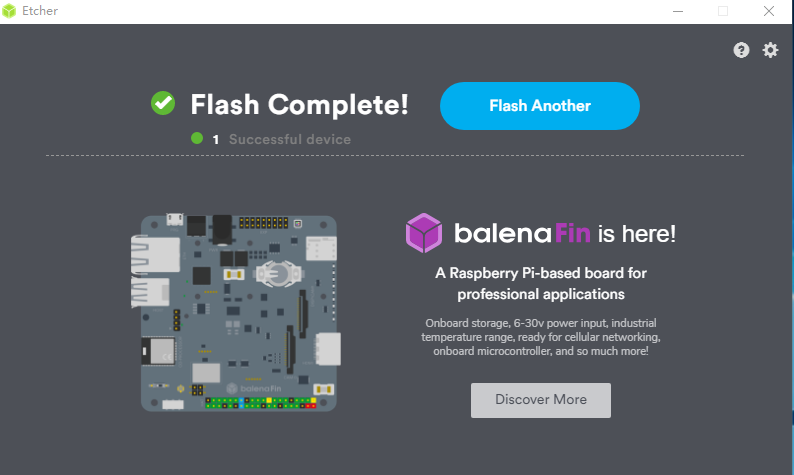

.. vim: syntax=rst

SD卡烧录Debian镜像
---------------------
本章节讲解如何把Debian镜像烧录到SD卡，如果想把镜像烧录至板载eMMC或NAND FLASH，也要先制作这个SD卡镜像，从SD卡启动开发板。然后再参考下一章节，使用SD卡镜像系统中的fire-config工具刷机到eMMC或NAND FLASH。

Etcher工具简介
~~~~~~~~~~~~~~~~~

Etcher是一款简易好用的镜像烧录工具，主要用于刻录镜像到USB设备，包括SD卡和U盘，
支持ios、img、zip、raw、sdcard等多种镜像格式。它的用户界面清爽美观，操作简单，
在软件自动识别到USB设备后，点击几次鼠标就能完成镜像的烧录。

同时Etcher是一个跨平台工具，支持 Mac、Windows 和 Linux ，
国内外开发者常用它将树莓派SD卡启动镜像烧录到SD卡中。

下载安装Etcher工具
~~~~~~~~~~~~~~~~~~~~~~

打开Etcher官网地址: \ https://www.balena.io/etcher/\,
在官网首页有Etcher工具的下载链接，用户可以根据自己的操作系统类型，来下载对应版本的软件安装包。

下载完成后，直接安装软件即可。

烧录Debian镜像
~~~~~~~~~~~~~~~~~~~~~

1、下载野火最新发布的Debian系统镜像：

百度云网盘:

.. code-block:: sh
   :linenos:

    https://pan.baidu.com/s/1pji1U1vvgP8sl_TTZp59qg
    提取码:b5wb

SOURCEFORGE:

.. code-block:: sh
   :linenos:

   https://sourceforge.net/projects/ebf-debian-firmware/files/

2、打开安装好的Etcher工具，软件界面如下图所示:

3、选择要烧录的镜像，野火提供的Debian镜像三个不同版本，如下图所示:

镜像标注的解压后容量为SD、eMMC、NAND等目标存储器需要的最小空间:

- imx6ull-debian-buster-console-armhf-2020-04-09.img.xz:

    Debian的纯净版固件，没有带桌面环境和野火的QT App。（解压后约340M）

- imx6ull-debian-buster-desktop-armhf-2020-04-09.img.xz: 
    
    带有桌面环境的Debian固件，系统启动后会进入桌面环境。（解压后约1.1G）

- imx6ull-debian-buster-full-qt-app-armhf-2020-04-09.img.xz: 
    
    具有完整QT App功能的Debian固件,系统启动后会进入QT App的界面。
    
    但是该固件体积超过了Nandflash 512M的容量，因此不能烧录到Nandflash中。只可烧录于eMMC。（解压后约900M）

- imx6ull-debian-buster-part-qt-app-armhf-2020-04-09.img.xz: 

    该固件移除了音视频播放功能的QT App，系统启动后会进入QT App的界面。
    
    该固件体积小于Nandflash 512M的容量，可以分别烧录到Nandflash和eMMC中。(解压后约420M)

- README.txt:文件有固件的使用说明以及版本改动的记录。

- SHA256SUMS.txt:记录各个固件的sha256校验值。

4、选择好Debian镜像后，继续选择要烧录的SD卡，然后点击"flash"按钮开始进行烧录。

烧录过程会显示镜像的烧录进度，如下图

5、等到软件出现出现如下界面时，表示镜像已经成功烧录完毕。

6、开发板插入烧录好Debian镜像的SD卡，调整拨码开关为SD卡启动方式，上电后开发板就能正常启动。

注意:开发板第一次从SD卡启动时，系统会自动进行SD卡扩容，
以保证充分利用SD卡存储空间。扩容完毕后，系统自动重启生效。

系统启动以后，输入用户密码登录即可：

普通用户:

.. code-block:: sh
   :emphasize-lines: 2
   :linenos:

   账户:debian
   密码:temppwd

ROOT用户:

.. code-block:: sh
   :emphasize-lines: 2
   :linenos:

   账户:root
   密码:root
