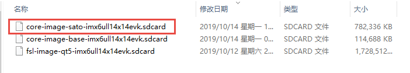

.. vim: syntax=rst

使用Etcher烧录镜像到SD卡
----------------

本章节内容处于开发笔记状态，还待整理至最终版的教程。

本章节内容处于开发笔记状态，还待整理至最终版的教程。

Etcher工具简介
~~~~~~~~~~

Etcher 是一个快速将镜像文件烧录到 USB 设备或 SD 卡中的工具，Etcher 的界面十分简洁、美观，而且操作简单，整个操作只需要点三下鼠标：

1. 先选择要刻录的镜像文件（支持 .iso、.img、.sdcard 以及 .zip 等类型的文件）。

2. 然后选择要刻录的目标设备。

3. 就可以点击按钮进行刻录了。

如果你只插上了一个设备的话，还会自动识别，无需选择。同时Etcher 是一个跨平台工具，支持 Mac、Windows 和 Linux ，国内外开发者常用它将树莓派SD卡启动镜像烧录到SD卡中。

下载Etcher
~~~~~~~~

首先打开官网：\ https://www.balena.io/etcher/\ ，在首页就可以看到Etcher工具的下载位置，如图 26‑1所示，下载完毕直接安装即可。

|instal002|

图 26‑1下载Etcher

使用Etcher工具烧录
~~~~~~~~~~~~

首先打开已经安装完成的Etcher，启动界面如图 26‑2所示。

|instal003|

图 26‑2 Etcher启动界面

然后选择要烧录的SD卡镜像，野火提供的SD卡镜像是.sdcard格式的，如图 26‑3所示，可以直接烧录到SD卡中，我们可以选择core-image-sato-imx6ull14x14evk.sdcard镜像烧录即可。

|instal004|

图 26‑3 SD卡镜像

接着选择要烧录的SD卡，如果你的电脑只是插入一个SD卡，那么Etcher会自动识别你的SD卡，在烧录的过程中，SD卡会被分区并且格式化，选择完毕后直接点击“Flash”进行烧录操作，具体见图 26‑4与图 26‑5。

|instal005|

图 26‑4 选择SD卡与烧录

|instal006|

图 26‑5 烧录界面

当制作成功后，将SD卡插入开发板中，并且将拨码开关的2/5/8打到ON档（SD启动方式），然后给开发板上电就可以看到开发板正常启动。

.. |instal002| image:: media/instal002.png
   :width: 5.31343in
   :height: 4.20831in
.. |instal003| image:: media/instal003.png
   :width: 5.76806in
   :height: 3.46306in

.. |instal005| image:: media/instal005.png
   :width: 5.76806in
   :height: 3.46306in
.. |instal006| image:: media/instal006.png
   :width: 5.76806in
   :height: 3.46306in
