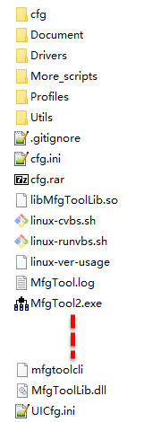

.. vim: syntax=rst

MFGtool工具
---------

本章节内容处于开发笔记状态，还待整理至最终版的教程。

本章节内容处于开发笔记状态，还待整理至最终版的教程。

从前面的文章了解到，Linux能正常启动必须有Uboot、Kernel、dtb以及文件系统，那么这些东西就需要通过某些开发工具将它烧录到存储板子上，这样子上电后开发板才能正常启动，而NXP就推出了MFGtool工具，用于烧录Uboot、Kernel、dtb以及文件系统这些内容到开发板上。

MFGtool工具的作用
~~~~~~~~~~~~

MFGTool工具是freescale官方推荐的一个使用OTG来升级镜像的软件工具，它是freescale针对i.MX系列处理器专门使用的烧录工具，可以用来升级linux，单独烧录某一系统分区，独立地烧录spi flash、 nor flash、sd card、nand
flash，emmc等，只需简单的配置，就可以使用该工具将编译好的文件系统和镜像文件烧录到开发板上，使用起来非常方便。而且MFGtool工具作为一个可量产性的工具，它支持多通道的烧录，在实际量产中，可以直接使用MFGtool工具同时将文件系统与镜像文件烧录到多个开发板上。

MFGtool工具目录主要有以下内容，具体见图 28‑1。

|mfgtoo002|

图 28‑1MFGtool工具目录

该目录其实是已省略很多内容的，其中主要的文件夹是Profile，里面存放着的是镜像文件，这里面镜像文件分为两种：第一种是作为媒介用途的镜像，包括uboot、dtb与uImage；第二种是真正烧录到emmc、sdcard或者nand
flash的镜像文件。之所以存在这两种镜像，是因为MFGTools的烧录原理是先烧录媒介镜像到ram里面，然后启动，再通过这个启动了的媒介镜像把目标镜像烧录到emmc、sdcard或者nand flash里面。

除此之外还有配置文件也是非常重要的，如cfg.ini、UICfg.ini以及ucl2.xml（该文件位于Profiles\Linux\OS Firmware目录下，此处就不再截图说明）。

MfgTool2.exe则是MFGtool工具的可执行程序文件，在Windows系统下可以双击运行，在运行后就可以进行烧录操作（前提是将配置文件配置完成）。

Document文件夹中存放了与该工具相关的文档。

Driver目录为Windows 32位和64位操作系统的驱动，驱动一般都不会出现问题，也就无需理会。

More_scripts目录主要存放一些脚本文件，如果只是单纯使用MFGtool工具也无需修这些脚本文件，此处暂时无需理会。

对于MFGtool工具目录下的其他文件以及文件夹，就暂时无需理会。

MFGtool工具的工作原理
~~~~~~~~~~~~~~

简单来说MFGtool工具的烧录步骤分为两个阶段：BurnStarp和Updater。第一阶段是烧录前的准备工作，配置设备USB的vid和pid，来选择烧录的设备。第二阶段是MFGtools开始烧录到结束烧录的过程，这个阶段的烧录过程是严格根据ucl2.xml文件来处理的，实际上是将bootload
er加载到ram，然后在运行时将编译好的文件系统和镜像文件烧录到开发板上，烧录的位置由用户指定，可以是sd card、nand flash，emmc等。

使用mfg工具直接烧录所有内容
~~~~~~~~~~~~~~~

UICfg.ini文件
^^^^^^^^^^^

UICfg.ini文件是用来配置同时烧录多少个开发板，即配置其多通道的烧录。我们此处并不量产，默认配置为1，具体见

代码清单 28‑1 UICfg.ini文件内容

1 [UICfg]

2 PortMgrDlg=1

cfg.ini文件
^^^^^^^^^

cfg.ini文件主要是用来配置目标芯片类型和板子信息及存储器的方式等内容的，其主要文件内容包括四部分内容，分别是profiles、platform、list、variable。

profiles
''''''''

[profiles]

chip = Linux

表示要使用Profiles目录下哪个文件夹的内容进行烧录。

如以上配置使用“/profiles/Linux/OS Firmware/ucl2.xml”目录下的ucl2.xml配置烧录。

platform
''''''''

[platform]

board = embedfire_board

开发板名字，目前没有作用，可以忽略

list
''''

[list]

name = NAND Flash

表示使用“/profiles/CHIP_PROFILE/OS Firmware/ucl2.xml”文件中的哪个list配置进行烧录，如将name 设置为 NAND Flash，则使用 ucl2.xml文件中NAND
Flash一栏的配置进行烧录（ucl2.xml文件内容在后续讲解，此处只简单列出部分配置）。

<LIST name="SDCard"

….

<LIST name="eMMC"

….

<LIST name="NAND Flash"

….

variable
''''''''

variable中是一些环境变量，在list列表配置中会引用的环境变量，如initramfs=fsl-image-mfgtool-initramfs-imx_mfgtools.cpio.gz.u-boot，在“/profiles/CHIP_PROFILE/OS
Firmware/ucl2.xml”文件中会被<CMD state="BootStrap" type="load" file="firmware/%initramfs%"
address="0x83800000"…引用，其引用的方式为“%...%”，在两个百分号（%）之间，通过变量initramfs进行传递。

[variable]

board = sabresd

mmc = 1

sxuboot=sabresd

sxdtb=sdb

7duboot=sabresd

7ddtb=sdb

6uluboot=14x14evk

6uldtb=14x14-evk

ldo=

plus=

lite=l

initramfs=fsl-image-mfgtool-initramfs-imx_mfgtools.cpio.gz.u-boot

nand=nand

nanddtb=gpmi-weim

part_uboot=0

part_kernel=1

part_dtb=2

part_rootfs=3

ucl2.xml文件
^^^^^^^^^^

首先我们看一下ucl2.xml文件中的文件内容（已删减）：

<UCL>

<CFG>

<STATE name="BootStrap" dev="MX6ULL" vid="15A2" pid="0080"/>

<STATE name="Updater" dev="MSC" vid="066F" pid="37FF"/>

</CFG>

<LIST name="NAND Flash" desc="Choose NAND as media">

<CMD state="BootStrap" type="load" file="firmware/%initramfs%" address="0x83800000"loadSection="OTH" setSection="OTH" asFlashHeader="FALSE"
ifdev="MX6SL MX6SX MX7D MX6UL MX6ULL">Loading Initramfs.</CMD>

<CMD state="BootStrap" type="jump" > Jumping to OS image.
</CMD>

<CMD state="Updater" type="push" body="send" file="files1/zImage"> Sending kernel zImage</CMD>

<CMD state="Updater" type="push" body="$ ubiformat /dev/mtd%part_rootfs%"/>

<CMD state="Updater" type="push" body="$ ubimkvol /dev/ubi0 -Nrootfs -m"/>

<CMD state="Updater" type="push" body="$ mkdir -p /mnt/mtd%part_rootfs%"/>

<CMD state="Updater" type="push" body="frf">Finishing rootfs write</CMD>

<CMD state="Updater" type="push" body="$ echo Update Complete!">Done</CMD>

</LIST>

</UCL>

整个文件由三部分组成，首先看最外层标签<UCL> <UCL/>，它表示更新命令列表（Update Command List，UCL），会被MFGtool工具中的脚本解析，所有的配置都包含在该标签之下。

在文件的开始会有 <CFG> </CFG>标签，它是MFGtool工具的一些全局配置，如在第一阶段（BootStrap）设备枚举，dev的值可以为MX6SL、MX6D、MX6Q、MX6SX、MX6UL、MX6ULL、MX7D其中的一个或多个（因为MFGtool工具可以同时烧录多个开发板），如果USB
的vid为15A2，pid为0080，那么MFGtool工具会将dev识别为MX6ULL，这USB中的vid与pid是由芯片本身决定的，当dev为MX6ULL时，在后续的烧录任务中会通过ifdev
MX6ULL进行选择执行哪些语句，然后将name设置为BootStrap，标识当前处于第一阶段，不同的阶段执行的处理是不一样的。这个阶段简单来说就是将开发板的USB OTG接口连接电脑，并且被MFGtool工具识别，才能有接下来的烧录操作。

如果USB中的vid为066F，pid为37FF，则表示进入第二阶段，将dev标识为MSG，而name则被设置为Updater。

简单来说，烧录分为两个阶段，BurnStarp和Updater，通过全局配置设备的vid和pid，来选择操作的设备（开发板）。

接下来，可以看到该文件内有多个< LIST > </LIST>标签，这就是前面说的列表配置，list后面有name、desc等参数，name则表示选择cfg.ini文件中的list内容中的配置，可以为SDCard、eMMC、NAND
Flash等。而desc参数用来说明目的，选择烧录的位置，如Choose SD Cardas media、Choose eMMC as media、Choose NAND as media等。

在< LIST > </LIST>标签下有多个<CMD> </CMD>标签，这是命令标签，在不同的阶段命令是不一样的，MFGtool工具的命令分为主机特定命令（Host Specific Commands）与固件特定命令（Firmware Specific
Commands），其中主机特定命令是由MFGtool工具解析和执行，而固件特定命令由目标设备上的固件运行解析和执行。

命令标签下有多个熟悉，如state用于表示该命令在哪个阶段被执行，type表示执行命令的类型，body表示命令的参数，flie则是其他参数，如需要烧录哪个文件，最后的Loading Kernel、Loading U-boot则是命令描述。

主机特定命令（Host Specific Commands）的命令类型有多种，其他参数也有多种，具体见

表格 28‑1（空余处表示无参数）。

表格 28‑1主机特定命令说明

======== ======== ============== =================================================================================================
命令类型 命令参数 其他参数       说明
======== ======== ============== =================================================================================================
load              file           烧录的镜像文件的路径和文件名
\                 Address        镜像存放的RAM地址
\                 loadSection    ROM代码使用的参数，应设置为“OTH”
\                 setSection     设置为OTH，如果还有其他镜像，设置为APP
\                 HasFlashHeader 镜像如果包含flash header，设为TRUE，否则设置为FALSE
\                 CodeOffset     第一次执行的指令的地址偏移量。注意：该命令仅适用于除i.MX50 HID模式设备之外的Bulk-IO模式i.MX设备。
jump                             通知ROM代码跳转到RAM映像运行
boot     保留     flie           加载映像到RAM
\                 if             执行判断
======== ======== ============== =================================================================================================

固件特定命令（Firmware Specific Commands）的命令类型有多种，其他参数也有多种，具体见

（固件特定命令已删减，且空余处表示无参数）。如果命令被命名为“push”即type="push"，这意味着命令由目标设备而不是主机解析和执行，主机唯一要做的就是将命令发送到目标设备，通过body进行发送命令。表格
28‑2（固件特定命令已删减，且空余处表示无参数）。如果命令被命名为“push”即type="push"，这意味着命令由目标设备而不是主机解析和执行，主机唯一要做的就是将命令发送到目标设备，通过body进行发送命令。

表格 28‑2固件特定命令说明

======== ======= ===========================================================================
命令     参数    说明
======== ======= ===========================================================================
?                请求以XML格式发送设备标识信息
!        integer 根据参数进行重启操作
$        string  执行shell命令，这是最常用的命令类型
flush            等待所有数据传输完成并处理
ffs              对SD卡进行分区并将引导流闪存到它
read     string  读取参数指定的文件并将其发送给主机。如果没有这样的文件，将返回相应的状态
send             从主机接收文件
selftest         进行自我诊断， 返回通过或适当状态。在当前版本中未实现
save     string  将命令“send”接收的文件保存到指定为参数的文件中。
pipe     string  执行shell命令并从管道的输入端读取数据。 MFGtool工具会将文件发送到管道输出端
wff              准备将固件写入flash
wfs              准备将固件写入SD Card
ffs              将固件写入SD Card
======== ======= ===========================================================================

MFGtool工具的烧录文件
^^^^^^^^^^^^^^

MFGtool烧录分为两个阶段，第一部分就是将firmware文件夹下的Uboot、Kernel、device tree、Initramfs加载到内存中，然后在第二阶段，将你要烧录的文件夹下的Uboot、Kernel、device tree、rootfs写入NAND Flash、SD
Card或者emmc，然后完成烧录。

野火开发板第1阶段烧录的文件（以烧录到nand为例）：

Uboot：u-boot-imx6ull14x14evk_nand.imx

Kernel：zImage

device tree：zImage-imx6ull-14x14-evk-gpmi-weim.dtb

Initramfs：fsl-image-mfgtool-initramfs-imx_mfgtools.cpio.gz.u-boot

野火开发板第2阶段烧录的文件以烧录到nand为例）：

Uboot：u-boot-emmc-2016.03-r0.imx

Kernel：zImage

device tree：zImage-imx6ull-14x14-evk-emmc-50-70-dht11-leds.dtb

rootfs：my_qt_core_fs.tar.bz2

烧录测试
^^^^

本次使用野火imx6ull开发板进行烧录测试，固件使用我们配套的固件即可，首先将表 11‑1中开发板启动方式的MODE0配置为1，MODE1配置为0，将开发板的USB OTG与电脑相接；然后双击打开MfgTool2.exe烧录工具，如果出现“符合 HID
标准的供应商定义设备”则表示识别成功，而如果出现“No Device Connected”则表示未识别成功，识别成功时其界面如图 28‑2所示。

|mfgtoo003|

图 28‑2 MFGtool工具界面

最后点击“Start”按钮开始烧录到开发板上，而烧录的位置由cfg.Init文件指定，本次我们烧录到nand flash 中，在烧录完成后，将开发板启动方式的MODE0配置为0，MODE1配置为1，打开xShell终端软件，然后复位开发板即可看到系统启动过程，具体见图 28‑3。

|mfgtoo004|

图 28‑3系统启动过程

.. |mfgtoo003| image:: media/mfgtoo003.png
   :width: 4.49583in
   :height: 1.87222in
.. |mfgtoo004| image:: media/mfgtoo004.png
   :width: 5.76806in
   :height: 3.95426in
