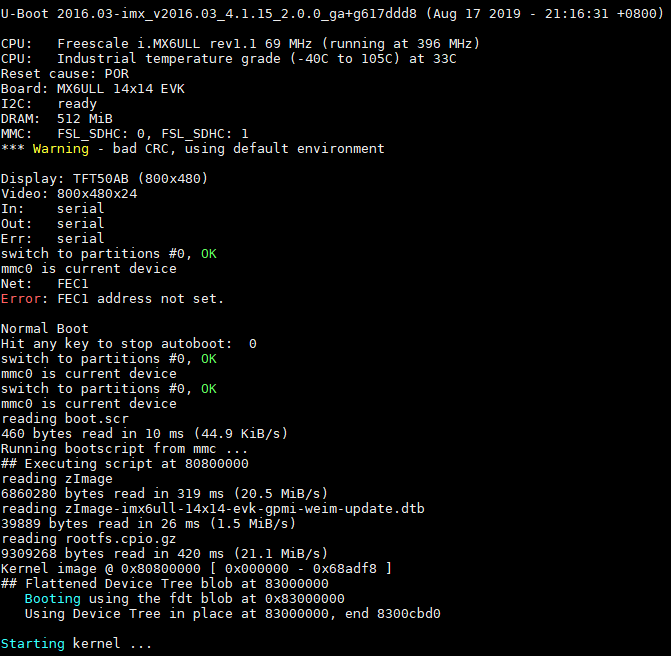

.. vim: syntax=rst

使用sd卡烧录完整镜像
-----------

本章节内容处于开发笔记状态，还待整理至最终版的教程。

本章节内容处于开发笔记状态，还待整理至最终版的教程。

SD卡创建分区
~~~~~~~

和前面的原理类似，即先将一个媒介镜像烧写到SD卡上，系统在SD卡启动后，再将保存在SD卡的系统烧写到NAND Flash或emmc中，然后再将系统配置为从NAND启动，从而更新系统。

提示：整个实验使用野火提供的资料源码与镜像即可。

首先需要准备一张SD卡与一个读卡器，开发环境为ubuntu14.04虚拟机，使用读卡器将SD卡连接到电脑USB中，然后在虚拟机中将SD卡格式化，再将系统文件拷贝到SD卡中，具体操作如下。

首先通过sudo fdisk /dev/sdb命令对SD卡进行分区，然后通过对应的命令对SD卡进行操作，如p：打印分区表，d：删除分区，n：添加新分区等等，具体命令如下：

提示：fdisk命令产生的更改将停留在内存中，直到您决定将更改写入磁盘。

embedfire@ embedfire:~$ sudo fdisk /dev/sdb

欢迎使用 fdisk (util-linux 2.31.1)。

更改将停留在内存中，直到您决定将更改写入磁盘。

使用写入命令前请三思。

DOS (MBR)

a 开关 可启动 标志

b 编辑嵌套的 BSD 磁盘标签

c 开关 dos 兼容性标志

常规

d 删除分区

F 列出未分区的空闲区

l 列出已知分区类型

n 添加新分区

p 打印分区表

t 更改分区类型

v 检查分区表

i 打印某个分区的相关信息

杂项

m 打印此菜单

u 更改 显示/记录 单位

x 更多功能(仅限专业人员)

脚本

I 从 sfdisk 脚本文件加载磁盘布局

O 将磁盘布局转储为 sfdisk 脚本文件

保存并退出

w 将分区表写入磁盘并退出

q 退出而不保存更改

新建空磁盘标签

g 新建一份 GPT 分区表

G 新建一份空 GPT (IRIX) 分区表

o 新建一份的空 DOS 分区表

s 新建一份空 Sun 分区表

在执行sudo fdisk /dev/sdb命令后，我们需要输入p命令操作SD卡，列出SD卡中已存在的分区（不同的SD卡分区表是不一样的，根据实际情况来处理即可）：

p 打印分区表

输出：

Disk /dev/sdb：7.5 GiB，8053063680 字节，15728640 个扇区单元：扇区 / 1 \* 512 = 512 字节扇区大小(逻辑/物理)：512 字节 / 512 字节I/O 大小(最小/最佳)：512 字节 / 512
字节磁盘标签类型：dos磁盘标识符：0x4357e4a3 设备       启动    起点 末尾     扇区  大小 Id 类型/dev/sdb1         20480  1024000  1003521 490M 83 Linux/dev/sdb2       1228800
15728639 14499840  6.9G 83 Linux

如果此时SD卡本身已存在分区（大多数情况都是为一个分区，少数情况会存在多个分区），那么就需要将SD卡本身的分区进行删除操作（如果有多少个分区就要删除多少次）。如我的SD卡就已存在两个分区，那么我需要删除两次，即输入两次d命令，再输入p命令列出分区表，此时SD卡已经没有分区表了，过程如下：

d 删除分区

输出：

命令(输入 m 获取帮助)： d分区号 (1,2, 默认 2): 分区 2 已删除。命令(输入 m 获取帮助)： d已选择分区 1分区 1 已删除。

命令(输入 m 获取帮助)： pDisk /dev/sdb：7.5 GiB，8053063680 字节，15728640 个扇区单元：扇区 / 1 \* 512 = 512 字节扇区大小(逻辑/物理)：512 字节 / 512 字节I/O 大小(最小/最佳)：512 字节 / 512
字节磁盘标签类型：dos磁盘标识符：0x4357e4a3

SD卡制作新分区，且需要制作两个分区，一个是SD卡烧录本身使用的分区，剩下的SD卡容量作为第二个分区（暂时未使用到），可以输入n命令操作，输入n命令后还需要根据提示输入创建的分区类型、分区号（使用默认值即可）以及分区的大小，我们在输入n命令之后再输入p命令（创建主分区），然后输入分区的大小（分区起始
位置~分区的结束位置，单位为扇区），同理创建第二个分区也是如此，过程如下：

n 添加新分区

输出：

命令(输入 m 获取帮助)： n分区类型 p 主分区 (0个主分区，0个扩展分区，4空闲) e 扩展分区 (逻辑分区容器)选择 (默认 p)： p分区号 (1-4, 默认 1): 1第一个扇区 (2048-15728639, 默认 2048): 20480上个扇区，+sectors 或
+size{K,M,G,T,P} (20480-15728639, 默认 15728639): 1024000创建了一个新分区 1，类型为“Linux”，大小为 490 MiB。

# 创建第二个分区

命令(输入 m 获取帮助)： n分区类型 p 主分区 (1个主分区，0个扩展分区，3空闲) e 扩展分区 (逻辑分区容器)选择 (默认 p)： p分区号 (2-4, 默认 2): 2第一个扇区 (2048-15728639, 默认 2048): 1228800上个扇区，+sectors 或
+size{K,M,G,T,P} (1228800-15728639, 默认 15728639): （默认）创建了一个新分区 2，类型为“Linux”，大小为 6.9 GiB。

在结束后，我们输入p命令查看一下SD卡当前分区情况，确认无误后，就输入w进行同步保存到SD卡中，因为目前的这些更改是暂时存储在内存上的，只有通过w命令保存后才能保存到SD卡中。

p 打印分区表

输出：

命令(输入 m 获取帮助)： pDisk /dev/sdb：7.5 GiB，8053063680 字节，15728640 个扇区单元：扇区 / 1 \* 512 = 512 字节扇区大小(逻辑/物理)：512 字节 / 512 字节I/O 大小(最小/最佳)：512 字节 / 512
字节磁盘标签类型：dos磁盘标识符：0x4357e4a3设备 启动 起点 末尾 扇区 大小 Id 类型/dev/sdb1 20480 1024000 1003521 490M 83 Linux/dev/sdb2 1228800 15728639 14499840 6.9G 83 Linux

w 将分区表写入磁盘并退出

输出：

命令(输入 m 获取帮助)： w分区表已调整。正在同步磁盘。

我们可以在终端中使用以下命令确认SD卡分区更改完成，当输出有sdb1与sdb2则表示完成，可以进行后续操作。

uuu uboot.imx

命令：ls /dev/ \| grep sdb

输出：

sdbsdb1sdb2

烧写SD卡启动的Uboot
~~~~~~~~~~~~~

首先将野火提供的SD卡启动的资料包放入虚拟机，放入的目录可以随意选择，如我是直接放到家目录下，u-boot/sd_update/root存在以下内容：

embedfire@ embedfire:~/u-boot/sd_update/root$ lsmfg-images-emmc update_nand_boot.scrmfg-images-nand zImagerelease.txt zImage-imx6ull-14x14-evk-emmc-
update.dtbrootfs.cpio.gz zImage-imx6ull-14x14-evk-gpmi-weim-update.dtbu-boot-sd-2016.03-r0.imx update_emmc_boot.scr

u-boot-sd-2016.03-r0.imx是我们需要烧写到SD卡的Uboot，我们可以使用以下命令将进行烧录：

输入命令：

sudo dd if=~/u-boot/sd_update/root/u-boot-sd-2016.03-r0.imx of=/dev/sdb bs=512 seek=2 conv=fsync

输出：

[sudo] embedfire 的密码： 记录了830+0 的读入记录了830+0 的写出424960 bytes (425 kB, 415 KiB) copied, 0.176929 s, 2.4 MB/s

提示：if=<Uboot镜像的位置>，位置根据你自己存放的资料路径修改即可。

放入要烧写的文件到SD卡
~~~~~~~~~~~~

因为是从SD卡烧录到NAND Flash或者emmc，因此SD卡要保存烧录到NAND Flash或者emmc的文件，首先要将SD卡的分区进行格式化，用于保存这些文件，具体操作过程如下：

输入命令：sudo mkfs.vfat /dev/sdb1

输出：

~$ mkfs.fat 4.1 (2017-01-24)mkfs.vfat: /dev/sdb1 contains a mounted filesystem.

输入命令：sudo mkfs.ext4 /dev/sdb2

输出：mke2fs 1.44.1 (24-Mar-2018)

首先挂载SD卡，本次试验创建一个挂载目录mountpoint，将SD卡挂载到该目录下，然后将野火提供的SD卡启动的资料包中root目录下所有文件拷贝到fat格式分区（即sdb1）目录下，具体操作如下：

挂载SD卡：

mkdir mountpointsudo mount /dev/sdb1 mountpoint/

拷贝root目录下所有文件到SD卡：

sudo cp -r ~/u-boot/sd_update/root/\* ~/mountpoint/

查看拷贝后的内容：ls

mfg-images-emmc update_nand_boot.scrmfg-images-nand zImagerelease.txt zImage-imx6ull-14x14-evk-emmc-update.dtbrootfs.cpio.gz zImage-imx6ull-14x14-evk-
gpmi-weim-update.dtbu-boot-sd-2016.03-r0.imx

update_emmc_boot.scr

配置SD卡烧录信息
~~~~~~~~~

如果需要从SD卡烧录到NAND Flash，则将mfg-images-nand改名为mfg-images；如果
需要从SD卡烧录到emmc，则将mfg-images-emmc改名为mfg-images；并且将update_nand_boot.scr改名为boot.scr，mfg-
images文件夹中的文件相应的替换，并在Manifest中填写欲烧写文件的文件名即可。然后将sd卡插入开发板，将开发板的WiFi的跳帽取下，同时将boot的拨码开关 2/5/8 拨到 ON档，表示从SD卡启动，在SD卡烧写的时候红灯闪烁，烧写完毕，红灯常亮，烧写失败，红灯熄灭。

修改文件名字可以使用mv命令，具体如下：

进入mountpoint目录：

cd mountpoint/

修改mfg-images-nand文件名字为mfg-images：

sudo mv mfg-images-nand/ mfg-images/

修改update_nand_boot.scr文件为boot.scr：

sudo mv update_nand_boot.scr boot.scr

在烧录工程可以打开串口终端，查看开发板输出的信息，具体见下图。

在烧录完成后，将boot的拨码开关 2/3/6 拨到 ON档，就可以从NAND Flash启动了。

