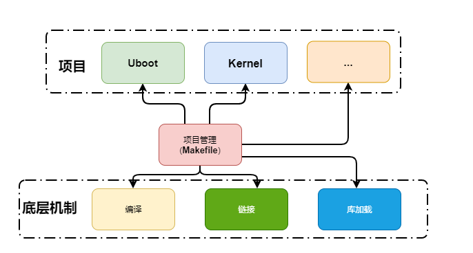

.. vim: syntax=rst

Makefile简介
----------------------------

Makefile是什么
~~~~~~~~~~~~~~~~~~~~~~~~~~~~~~~~~

回顾一下我们前面几个章节，我们使用到的示例代码只有一个hello.c文件，非常简单，所以直接执行下面的指令进行编译也非常方便。

**编译一个文件**

.. code-block:: sh
   :linenos:

   gcc hello.c -o hello 

但是随着我们课程逐渐深入，以后在我们的项目工程中，势必会有越来越多的C文件和H头文件。
当一个工程中有很多C源文件和H头文件时，再直接使用编译器指令就非常麻烦了，光输入文件名都会影响心情，
比如下面的例子:

**编译多个文件**

.. code-block:: sh
   :linenos:

   gcc hello.c aaa.c bbb.c -o hello 

而且哪怕你只是修改一个文件，也需要重新编译所有的文件，白白浪费了很多开发时间。
要解决这个问题，最好的方式就是把工程的编译规则写下来，让编译器自动加载该规则进行编译。
解决方法就是使用make和Makefile，这两个工具是搭配使用的，下面给大家介绍一下:

- **make工具**：它可以帮助我们找出项目里面修改变更过的文件，并根据依赖关系，找出受修改影响的其他相关文件，然后对这些文件按照规则进行单独的编译，这样一来，就能避免重新编译项目的所有的文件。

- **Makefile文件**：上面提到的规则、依赖关系主要是定义在这个Makefile文件中的，我们在其中合理地定义好文件的依赖关系之后，make工具就能精准地进行编译工作。

它们的关系如下图所示:

从我们上面的介绍，大家可以知道，我们管理一个项目工程，实质上就是管理项目文件间的依赖关系。
所以我们在学习和使用Makefile的时候，一定要牢牢抓住它这种面向依赖的思想，
心里一定要谨记，**Makefile中所有的复杂、晦涩的语法都是更好地为解决依赖问题而存在的**。
理解了它的本质目的之后，我们以后在学习它的过程中就不用死记硬背各种语法了，
**只要想想这个本质目的，你会觉得一切都是那么地顺理成章**。

是否真正驾驭Makefile的标志，就在于脑海中是否清晰地知道目标和依赖的关系。当你的大脑能够像make工具一样，
准确无误地解释执行Makefile的时候，就是一个Makefile高手了。我们就是要奔着这个目标去的。

这里再多介绍一下，当工程复杂度再上一个台阶的时候，会觉得手写Makefile也很麻烦，
那个时候可以用CMake、autotools等工具来帮忙生成Makefile。实际上Windows系统下很多IDE工具内部也是使用类似Makefile的方式组织工程文件的，
只不过被封装成图形界面，对用户不可见而已。

Makefile概览
~~~~~~~~~~~~~~~

Makefile对于一个嵌入式Linux开发人员来说，怎么强调它的重要性都不为过。虽然它跟程序员的编程能力并不直接挂钩，
但是它所体现出来的是一种工程能力，**这种工程能力恰恰就是专业程序员和业余程序员的一个分水岭**。因为在Linux开发环境下，
我们并没有太多的集成开发环境IDE，也就是说程序的所有控制权全部在于开发者，你势必要对底层软件的编译、链接、
装载有着相当深入的了解，才能说真正地驾驭了你的程序。虽然前面的章节已经简单介绍了部分底层相关内容，但是还不够深入，
我们以后的课程还要更加深入。

而且我们以后的课程也会陆续讲解Uboot移植开发、Linux内核移植开发和其他的一些开源项目，倘若我们Makefile基础不够扎实，
那么很可能怎么着手分析项目都不知道。程序的架构组织都梳理不清楚，就更别谈修改程序功能了。如下图:

接下来我们先整体了解Makefile的相关语法，这里要提前跟大家说清楚一点，Makefile经过多年发展，虽然功能非常强大，
但是也留下了沉重的历史包袱，我们没有办法详细介绍make的每一个详细知识点(也没有必要)，借鉴于以往的开发经验，
我们总结了80%常用的Makefile知识点，定位在为以后研究Uboot、Linux kernel和其他开源项目打下结实的基础。
虽然这个目标难度还是比较大的，要学习的知识点也不少，不过我们会通过一系列难度逐步迭代的小实验，
来帮助大家无痛学会Makefile。

我一直提倡：学习知识之前，要现在脑海中初步建立知识点的整体框架，以此来指导进一步的学习。
接下来我们先整体看一下要学习Mkaefile的知识点，如下图所示:

图里面的知识点不少，我们在这里先不深入学习具体语法，而是告诉大家每一个语法的出现是为了解决什么问题，
，我们从左上角开始讲起:

1、 基础语法-- 描述目标和依赖的特定格式。

2、 变量-- 记录特定的信息，避免重复输入原始信息。尤其是手动输入原始信息很长时，特别好用。

3、 分支判断-- 灵活控制多个不同的编译过程，方便兼容不同属性。

4、 头文件依赖-- 监控头文件的变化，头文件也是程序的关键内容。

5、 隐含规则-- 利用Makefile的一些默认规则，可以减少编写Makefile的工作量。

6、 自动化变量-- 利用Makefile的默认的自动化变量，可以减少编写Makefile的工作量。

7、 模式规则-- 灵活使用正则表达式，可以减少编写Makefile的工作量。

8、 函数-- 使用Makefile的各种函数，可以更方便地实现Makefile的功能。

了解完Makefile的知识点，从上面的分析可以知道，Makefile的核心在于基础语法，用来描述目标和依赖的关系。
其他语法的目的，是为了减少我们编写Makefile工作量，让我们能够以更加优雅、更加简洁、更好维护的方式来实现Makefile的功能。
这跟我们程序开发是很相似的，不止要实现功能，还要兼顾程序的可读性、拓展性、可维护性等等。
