.. vim: syntax=rst

ARM-GCC和开发板的HelloWorld
-----------------------

为了加深对GCC编译工具链的了解，本章尝试在ARM开发板上运行x86_64平台、Ubuntu系统用各种不同方法编译的HelloWorld。

由于需要在Ubuntu主机及开发板之间共享文件，请按《挂载NFS网络文件系统》章节搭建好NFS网络文件系统环境。

本章的示例代码目录为：base_code/linux_app/hello_crosscompile。

在ARM板上运行x86_64平台的程序
~~~~~~~~~~~~~~

上一章Ubantu编译生成了X86_64平台的Hello World程序，我们尝试ARM开发板上直接运行它。

在开发板的终端上，切换至主机共享目录下的hello_c文件夹，可以直接执行如下命令测试：

::

         #以下命令在开发板上的终端上执行

         #进入共享的NFS目录，下面的目录根据自己的实际配置情况修改

         cd /mnt/example/hello_c

         #查看是否有存在前面编译生成的文件

         ls

         #执行主机编译的x86架构程序

         ./hello

如下图:

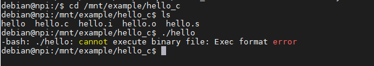

如图所示，程序无法正常运行，终端提示ARM开发板在执行x86架构（Intel或AMD）的hello程序时提示格式错误，原因是x86_64和ARM架构的程序不兼容，本质是由于这些CPU使用的指令集不同。这就是为什么需要针对芯片架构定制文件系统、软件工具，apt使用的源也针对不同架构提供不同的软件包。前
面说Debian系统有支持多种架构的优势，本质上就是说它的文件系统针对不同芯片架构提供了适配的软件包。

当然，对于由Python等跨平台语言编写的源程序，它们不需要编译，只需要使用匹配的解释器即可运行，与芯片架构甚至操作系统无关。

安装并使用交叉编译工具链
~~~~~~~~~~~~

在前面《GCC和Hello World》章节中，我们编译了两个程序，分别是:

- 编译器运行在X86_64架构平台上，编译生成X86_64架构的可执行程序

- 编译器运行在ARM架构平台上，编译生成ARM架构的可执行程序

这种编译器和目标程序都是相同架构的编译过程，被称为 **本地编译** 。

而当前我们希望的是编译器运行在x86架构平台上，编译生成ARM架构的可执行程序，这种编译器和目标程序运行在不同架构的编译过程，被称为 **交叉编译**。

既然已经有本地编译，为什么需要交叉编译？这是因为通常编译工具链对编译环境有较高的要求，编译复杂的程序时，可能需要巨大的存储空间以及强大的CPU运算能力加快编译速度。常见的ARM
架构平台资源有限，无论是存储空间还是CPU运算能力，都与X86平台相去甚远，特别是对于MCU平台，安装编译器根本无从谈起。有了交叉编译，我们就可以在PC上快速编译出针对其他架构的可执行程序。

相对的，能进行架构"交叉"编译过程的编译器，就被称为 **交叉编译器（Cross compiler）**。
交叉编译器听起来是个新概念，但在MCU开发中一直使用的就是交叉编译器，
例如开发STM32、RT1052所使用的IDE软件Keil（MDK）或IAR，就是在Windows x86架构编译，生成MCU平台的应用程序，最后下载到板子执行。

使用APT安装ARM-GCC
^^^^^^^^^^^^^^

安装交叉编译工具链有如下三种方式：

-  直接在Ubuntu下使用APT包管理工具下载安装，操作简单，在本章节我们直接使用该方式安装即可。

-  自行下载第三方制作好的工具链，如Linaro，好处是选择丰富，能找到很多不同的版本。

-  使用crosstool-ng根据需要自己制作，过程复杂，不推荐。

本书中提供的示例程序对编译器版本没什么要求，为简便起见，此处直接在Ubuntu系统下使用APT包管理工具安装。

本书使用的编译器主要有两种类型：

-  arm-linux-gnueabihf-gcc：名称中的Linux表示目标应用程序是运行在Linux操作系统之上的，例如前面的hello.c程序。

-  arm-none-eabi-gcc，名称中的none表示无操作系统，目标应用程序的运行环境是不带操作系统的，例如裸机代码、uboot、内核代码本身。

不过在开发中比较多的开发者对所有程序都直接用arm-linux-gnueabihf-gcc来编译，包括裸机代码和uboot，虽然可能因为代码本身没有调用到Linux相关的内容而不会出错，但这样做不够严谨，条件允许的话，我们还是严格区分开来。

本章节示例代码只需要使用arm-linux-gnueabihf-gcc编译器，可通过APT包管理工具可直接执行以下命令安装：

::

         #在主机上执行如下命令

         sudo apt install gcc-arm-linux-gnueabihf

         #安装完成后使用如下命令查看版本

         arm-linux-gnueabihf-gcc –v

可以看到下图的内容，它表明交叉编译工具链安装成功了，输出信息表明了它是7.4.0版本的编译器，其中的 "Target:arm-linux-gnueabihf"也表明了它的目标架构。

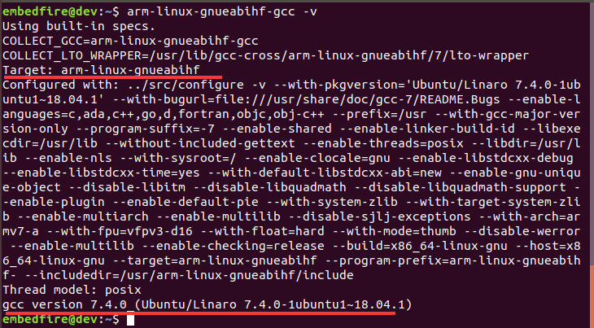

 arm-linux-gnueabi-gcc版本信息

安装完成后输入"arm-linux-gnueabihf-"，再按两下TAB键，终端会提示可用的相关命令，如下图包含了ARM-GCC工具链Binutils的各种工具。

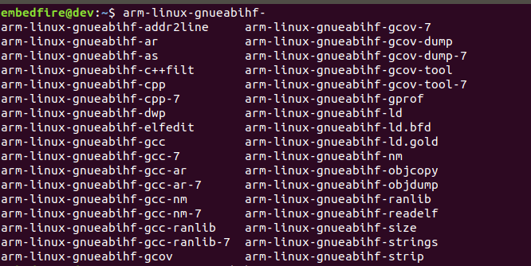

安装后包含的Binutils工具集

交叉编译Hello World程序
^^^^^^^^^^^^^^^^^

安装好交叉编译器后，直接使用它对Hello World程序进行交叉编译即可。

交叉编译器与本地编译器使用起来并没有多大区别。对于源文件的编译过程，都是四个阶段：预处理，编译，汇编以及链接，区别只在于编译工具。因此，我们可以依葫芦画瓢，修改一下前面GCC编译章节的命令，就可以完成这个过程。

在主机上执行如下命令对Hello World程序进行交叉编译：

::

         #以下命令在主机上运行

         #在hello.c程序所在的目录执行如下命令

         arm-linux-gnueabihf-gcc hello.c –o hello

同样的C代码文件，使用交叉编译器编译后，生成的hello已经变成了ARM平台的可执行文件，可以通过readelf工具来查看具体的程序信息。

readelf工具在系统安装GCC编译工具链时一起被安装了，我们可以直接使用。在主机上执行以下命令：

::

         #以下命令在主机上运行

         readelf -a hello

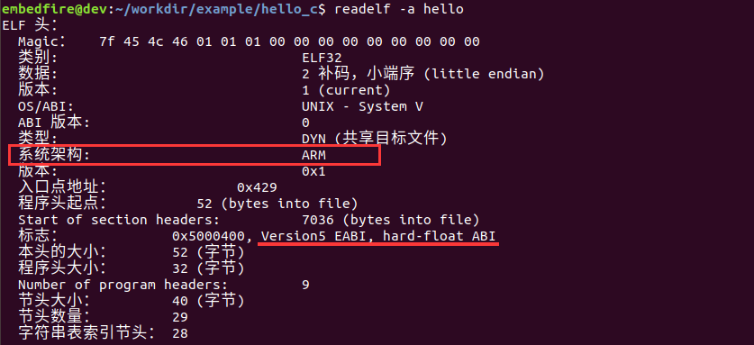

使有readelf查看交叉编译器生成的hello程序

可看到hello程序的系统架构为ARM平台，标志中表明了它是hard-float类型的EABI接口。

编译好后，即可尝试在开发板上运行，在开发板的终端执行以下命令，执行结果如下图所示。

::

         #以下命令在开发板上的终端上执行

         #切换至共享的NFS目录，下面的目录根据自己的配置修改

         cd /mnt/example/hello_c

         #查看是否有存在前面编译生成的文件

         ls

         #执行主机编译的ARM平台程序

         ./hello

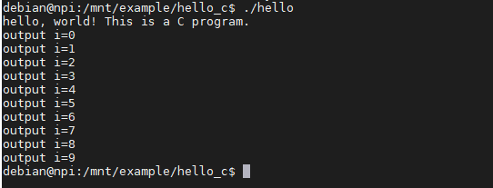

如何选择编译器
~~~~~~~

除了我们安装的arm-linux-gnueabihf-gcc外，编译器还有很多版本，如arm-linux-gnueabi-gcc，《GCC和Hello World》章节中使用的本地编译器gcc全名为x86_64-linux-gnu-gcc。

目前大部分ARM开发者使用的都是由Linaro组织提供的交叉编译器，包括前面使用APT安装的ARM-GCC工具链，它的来源也是Linaro。Linaro是由ARM发起，与其它ARM SOC公司共同投资的非盈利组织。我们可以在它官网的如下地址找到它提供的ARM交叉编译器：\
https://releases.linaro.org/components/toolchain/binaries/ ，如下图所示，在它提供的编译器列表中首先选择版本号，然后可选择ARM架构类型，最后是具体的编译器平台。

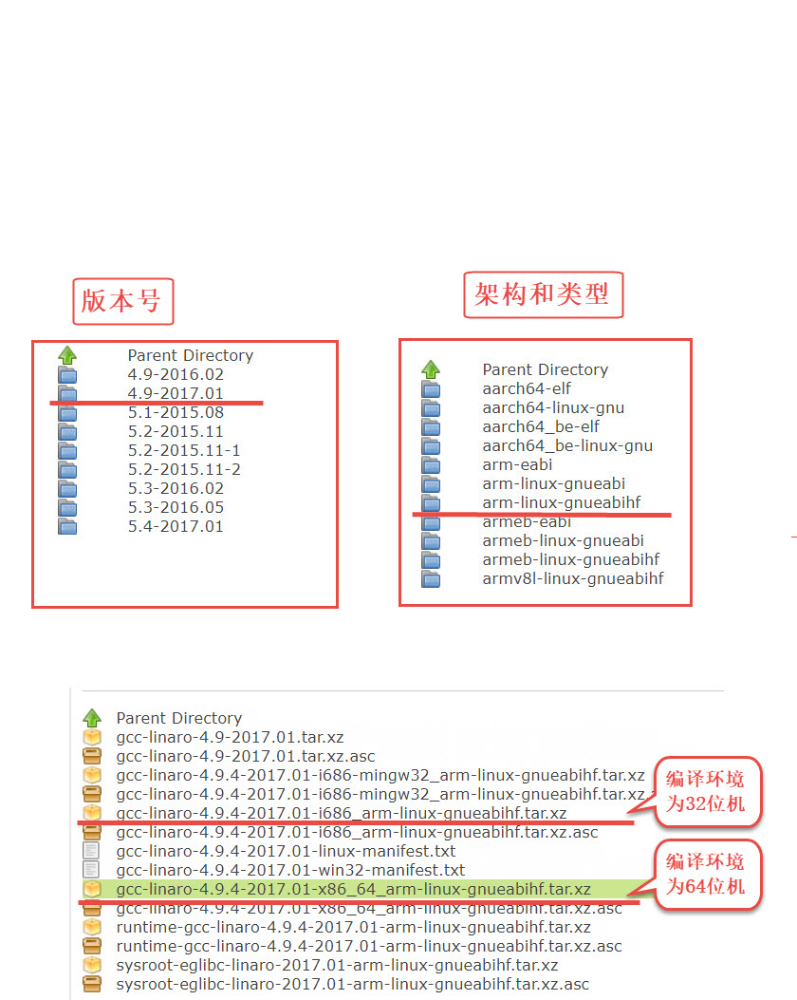

编译器的命名没有严格的规则，但它们的名字中一般包含我们最关心的内容，可根据它们的名字选择要使用的编译器：

arch [-os] [-(gnu)eabi(hf)] -gcc

其中的各字段如下表所示。

 GCC编译器命名格式

==== ==============
字段 含义
==== ==============
arch 目标芯片架构
os   操作系统
gnu  C标准库类型
eabi 应用二进制接口
hf   浮点模式
==== ==============

以我们安装的arm-linux-gnueabihf-gcc编译器为例，表示它的目标芯片架构为ARM，目标操作系统为Linux，使用GNU的C标准库即glibc，使用嵌入式应用二进制接口（eabi），编译器的浮点模式为硬浮点hard-float。而另一种名为arm-linux-gnueabi-
gcc的编译器与它的差别就在于是否带"hf"，不带"hf"表示它使用soft-float模式。

关于编译器的各个字段详细说明如下：

目标芯片架构
^^^^^^^^^^^^^

目标芯片架构就是指交叉编译器生成的程序运行的平台，如ARM、MIPS，其中ARM交叉编译器又分为ARMv7、ARMv8及aarch64架构。本书使用的i.MX 6ULL的内核为Cortex-A7，它使用的是ARMv7架构。
arm-linux-gnueabihf-gcc直接以arm表示ARMv7架构。

大小端
^^^^^^^^

指目标芯片的大小端模式，i.MX 6ULL使用的是小端模式。若是大端模式（big edian），编译器名字中会带"be"或"eb"字段进行标标注。

目标操作系统
^^^^^^^^^^^^^^^

目标操作系统表示编译后的程序运行的系统，主要有Linux或bare-metal（无操作系统）两种，arm-linux-gnueabi-gcc 表示它目标程序的运行环境为Linux系统，程序可以使用Linux下的C标准库或Linux内核提供的API，如fork等进程函数。而arm-
eabi-gcc或arm-none-eabi-gcc表示它们的目标程序运行在无操作系统的环境中。

所以严格来说，我们编译Linux应用程序时应该使用带"linux"的编译器，而编译uboot、裸机程序时，应该使用"bare-metal"类型的裸机编译器，但很多开发者常常把它们混用也没有出现问题，这一般是因为开发者编写的裸机程序本身就没有使用到Linux系统提供的API，所以才不会出错。

C标准库类型
^^^^^^^^^^^^^^

C标准库类型通常有gnu、uclibc等，分别表示GNU的glibc库和uclibc库，这取决于目标操作系统提供的C库类型，不过由于glibc和uclibc库是兼容的，所以开发者在编通常直接使用GNU类型的编译器而不管目标系统中的C库类型。
除了裸机编译器不带C库之外，其它编译器的C库类型都是glibc库的，如arm-linux-gnueabihf-gcc。

应用二进制接口
^^^^^^^^^^^^^^^

应用二进制接口（Application Binary Interface），描述了应用程序和操作系统之间或其他应用程序的低级接口。在编译器选项中主要有"abi"和"eabi"两种类型，abi通常用在x86架构上，而eabi表示embed abi，即嵌入式架构，如ARM、MIPS等。

浮点模式
^^^^^^^^^^^

部分ARM处理器带浮点运算单元，代码需要进行浮点运算时若交给fpu处理，可以加快运算速度。编译器针对浮点运算的不同处理情况提供了以下几种模式：

- hard： 硬浮点类型（hard-float），采用fpu参与浮点运算。 arm-linux-gnueabihf-gcc、armeb-linux-gnueabihf-gcc都是硬浮点类型，即名字中带"hf"。

- soft：软浮点类型（soft-float），即使有fpu浮点运算单元也不用，而是使用软件模式，arm-linux-gnueabi-gcc、armeb-linux-gnueabi-gcc都是软浮点类型，即名字中不带"hf"。

- softfp：允许使用浮点指令，但保持与软浮点ABI的兼容性。

i.MX6ULL带有fpu，对于soft-float和hard-float模式都支持，不过本开发板中提供Linux文件系统中的库都是使用hard模式编译的，所以编写应用程序时也需要使用相同类型的编译器，否则会应用程序运行时会提示找不到库文件。

编译器版本号
^^^^^^^^^^^

通常来说高版本的编译器是向后兼容的，但开发特定程序时会使用固定的某个版本编译器，所以程序可能会依赖该版本的编译器，根据自己要编译的程序的要求选择即可。

编译器类型对程序的影响
~~~~~~~~~~~

讲解编译器类型时提到，编译器名字中带hf和不带hf的差异为硬浮点和软浮点模式，此处通过小实验来进行讲解，对比两种编译器对同样程序的影响。

安装软浮点编译器
^^^^^^^^

首先安装浮点模式为soft-float类型的编译器，即arm-linux-gnueabi-gcc，它与前面使用的arm-linux-gnueabihf-gcc差异为编译器名字不带"hf"：

::

         #在主机上执行如下命令

         sudo apt install gcc-arm-linux-gnueabi

         #安装完成后使用如下命令查看版本

         arm-linux-gnueabi-gcc -v

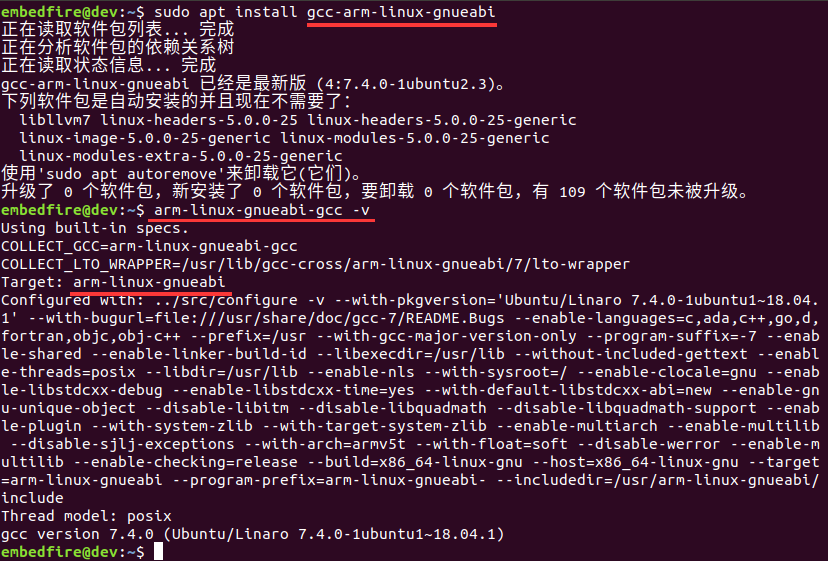

运行软浮点动态编译的程序
^^^^^^^^^^^^

安装好arm-linux-gnueabi-gcc软浮点编译器后，继续使用hello.c程序进行实验。

切换至前面hello.c的目录，使用不带"hf"的软浮点编译器重新编译：

::

         #以下命令在主机上运行

         #在hello.c程序所在的目录执行如下命令，注意编译器名字不带hf

         sudo arm-linux-gnueabi-gcc hello.c –o hello

此处我们使用的是同样的hello.c代码文件，只是编译器的类型不同，再次通过readelf工具来查看具体的程序头信息，在主机上执行以下命令：

::

         #以下命令在主机上运行

         readelf -h hello

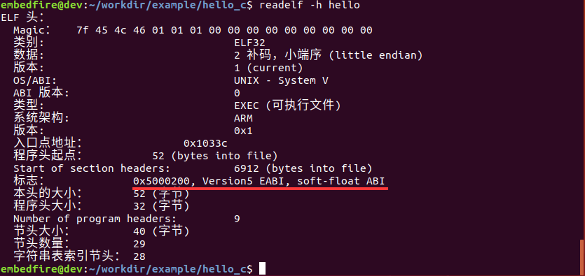

可以看到结果与前面的差异在于此处的是soft-float类型，而前面的是hard-float类型，这正是编译器类型不同导致的。

编译好后，尝试在开发板上运行该程序，在开发板的终端执行以下命令。

::

         #以下命令在开发板上的终端上执行

         #切换至共享的NFS目录，下面的目录根据自己的配置修改

         cd /mnt/example/hello_c

         #查看是否有存在前面编译生成的文件

         ls

         #执行主机编译的ARM平台程序，soft-float类型

         ./hello

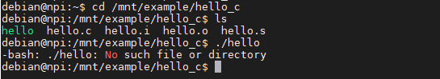

很遗憾，使用arm-linux-gnueabi-gcc软浮点编译的程序无法正常执行，它提示找不到文件或目录，这是因为程序内部调用了软浮点的类库（如glibc库文件libc.so.6），而开发板配套的库文件是硬浮点类型的。

开发板的glibc库类型
^^^^^^^^^^^^

关于库文件的类型，同样可以使用readelf工具查看，在开发板中执行以下命令

::

         #使用readelf查看开发板的libc.so.6类型

         readelf -h libc.so.6

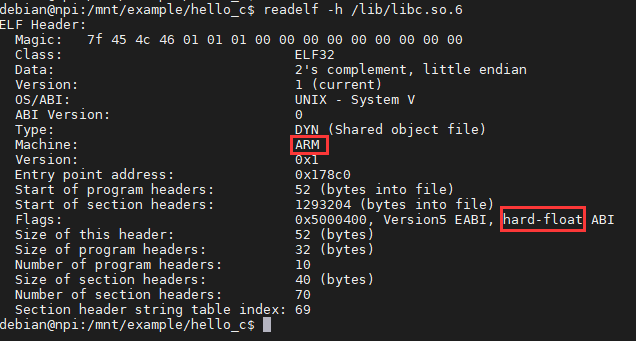

表示开发板的glibc库文件libc.so.6为ARM架构的hard-float类型库，所以不带hf编译器生成的hello程序与它不兼容，无法正常运行。

运行软浮点静态编译的程序
^^^^^^^^^^^^

既然hello程序是因为库不兼容，那如果程序使用静态编译，即程序自带相关库的内容，是不是就可以正常运行呢？答案是可以的。我们继续进行如下测试：

在主机执行如下命令，对hello.c进行静态编译生成hello_static程序：

::

         #以下命令在主机上运行

         #使用不带hf的编译器对hello.c进行静态编译，生成的程序名为hello_static

         sudo arm-linux-gnueabi-gcc hello.c -o hello_static --static

         #查看生成的程序大小

         ls -lh

         #查看hello_static文件头

         readelf -h hello_static

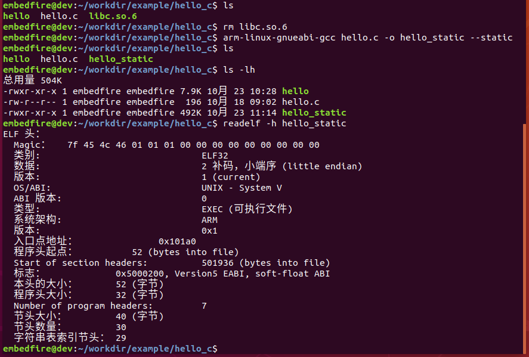

可看到使用静态编译得到的hello_static程序比动态编译的hello大，这是因为它自身包含了库文件，使用readelf也可以看到hello_static程序依然是soft-float类型的。

接着尝试在开发板中执行生成的hello_static静态程序：

::

      #以下命令在开发板上的终端上执行

      #切换至共享的NFS目录，下面的目录根据自己的配置修改

      cd /mnt/example/hello_c

      #查看是否有存在前面编译生成的文件

      ls

      #执行主机编译的ARM平台程序，soft-float类型，静态可执行文件

      ./hello_static

如下图:

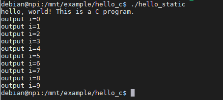

hello_static程序正常运行，这就是编译器及系统库文件对程序运行的影响。

.. |armgcc002| image:: media\armgcc002.png
   :align: center
   :alt: 未找到图片

.. |armgcc003| image:: media\armgcc003.png
   :width: 5.76806in
   :height: 3.18445in

.. |armgcc004| image:: media\armgcc004.png
   :width: 5.69444in
   :height: 2.85577in

.. |armgcc005| image:: media\armgcc005.png
   :width: 5.71528in
   :height: 2.61855in

.. |armgcc006| image:: media\armgcc006.png
   :width: 4.625in
   :height: 2.00549in

.. |armgcc007| image:: media\armgcc007.jpg
   :width: 5.20833in
   :height: 4.99429in

.. |armgcc008| image:: media\armgcc008.png
   :width: 5.76806in
   :height: 3.90812in

.. |armgcc009| image:: media\armgcc009.png
   :width: 5.76806in
   :height: 2.72848in

.. |armgcc010| image:: media\armgcc010.png
   :width: 5.7505in
   :height: 1.19177in

.. |armgcc011| image:: media\armgcc011.png
   :width: 5.77083in
   :height: 0.47222in

.. |armgcc012| image:: media\armgcc012.png
   :width: 5.76159in
   :height: 3.3125in

.. |armgcc013| image:: media\armgcc013.png
   :width: 5.76806in
   :height: 3.89544in

.. |armgcc014| image:: media\armgcc014.png
   :width: 5.76806in
   :height: 1.912in

