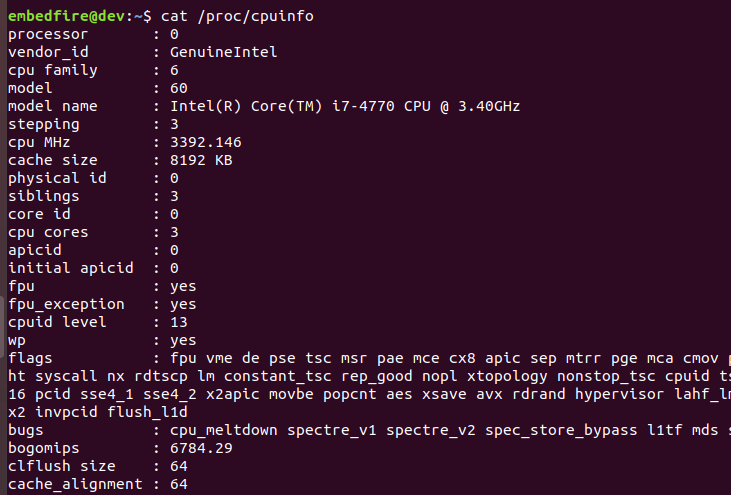
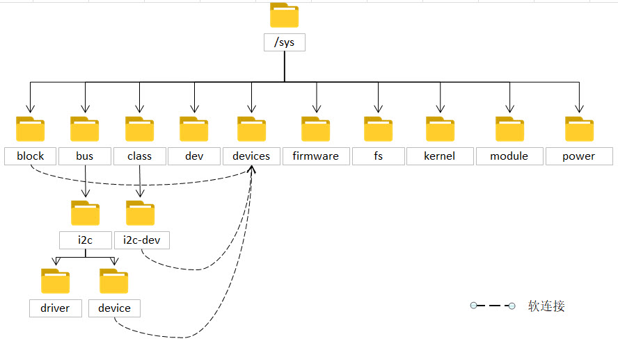
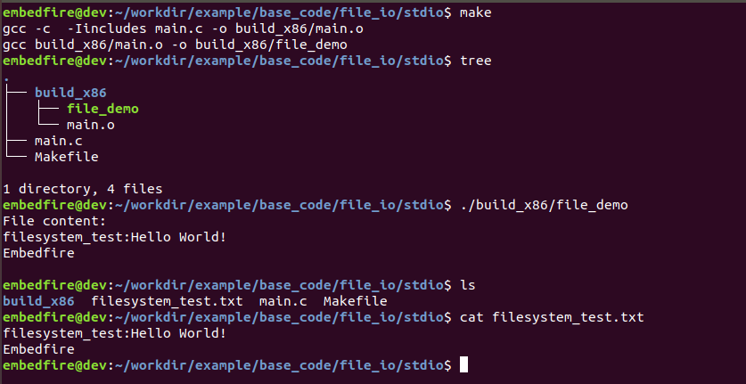
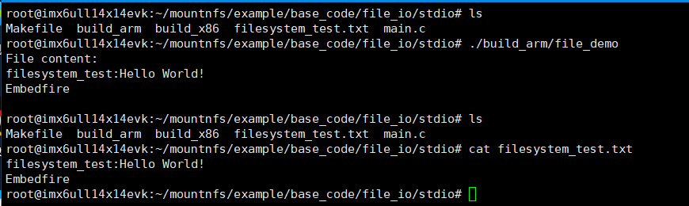
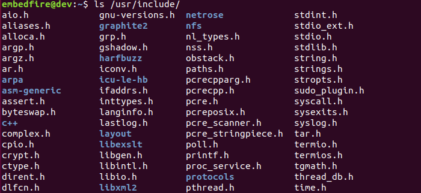
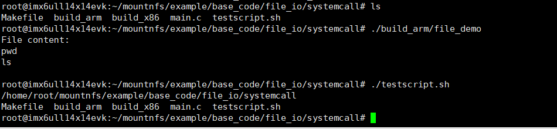

.. vim: syntax=rst

文件操作与系统调用
---------------------------

在Linux系统中有一个重要的概念：一切皆文件，它把一切资源都看作是文件，包括硬件设备，通常称为设备文件。前面我们也尝试过通过脚本读写文件的方式，实现了对硬件的访问。所以如果不了解Linux的文件操作，那想要点亮开发板的LED灯都费劲！

本章通过C标准库及系统调用的方式操作文件，揭示用户应用程序、C标准库与系统调用之间的关系。

本章的示例代码目录为：base_code/section2/file_io。

存储设备文件系统
~~~~~~~~~~~~~~~~~~~~~~~~

提到文件系统时，我们首先想到的通常是Windows下的FAT32、NTFS、exFAT以及Linux下常用的ext2、ext3和ext4的类型格式。这些文件系统都是为了解决如何高效管理存储器空间的问题而诞生的。

从EEPROM、Nor FLASH、NAND FLASH、eMMC到机械硬盘，各种各样的存储器本质就是具有多个能够
存储0和1数据单元的设备，存储内容时，程序需要直接访问这些存储单元的物理地址来保存内容。这样直接
存储数据会带来极大的不便，如难以记录有效数据的位置，难以确定存储介质的剩余空间，以及应以何
种格式来解读数据。就如同一个巨大的图书馆无人管理，杂乱无章地堆放着各种书籍，难以查找。

为了高效地存储和管理数据，文件系统在存储介质上建立了一种组织结构，这些结构包括操作系
统引导区、目录和文件，就如同图书馆给不同类的书籍进行分类、编号，放在不同的书架上。不同的管理
理念引出了不同的文件系统标准，上述的 FAT32、 NTFS、 exFAT、ext2/3/4就是指不同类型的
标准，除此之外，还有专门针对NAND类型设备
的文件系统jffs2、yaffs2等等。

正是有了文件系统，计算机上的数据才能以文件的形式呈现给用户。关于文件系统的基本概
念，学习野火《STM32库开发实战指南》或《i.MX RT库开发实战指南》中Fatfs文件系统章节
的相关内容，可以非常清楚地了解使用MCU直接记录数据与通过文件系统记录文件时的差异。

下面简单介绍一下各种不同标准文件系统的特性：

-  FAT32格式：兼容性好， STM32等MCU也可以通过Fatfs支持FAT32文件系统，大部分SD卡或U盘出厂
   默认使用的就是FAT32文件系统。它的主要缺点是技术老旧，单个文件不能超过4GB，非日志型文件系统。

-  NTFS格式：单个文件最大支持256TB、支持长文件名、服务器文件管理权限等，而且NTFS是日志型
   文件系统。但由于是日志型文件系统，会记录详细的读写操作，相对来说会加快FLASH存储器的损
   耗。文件系统的日志功能是指，它会把文件系统的操作记录在磁盘的某个分区，当系统发生故障时，能够
   尽最大的努力保证数据的完整性。

-  exFAT格式：基于FAT32改进而来，专为FLASH介质的存储器
   设计（如SD卡、U盘），空间浪费少。单个文件最大支持16EB，非日志文件系统。

-  ext2格式：简单，文件少时性能较好，单个文件不能超过2TB。非日志文件系统。

-  ext3格式：相对于ext2主要增加了支持日志功能。

-  ext4格式：从ext3改进而来，ext3实际是ext4的子集。它支持1EB的分区，单个文件最大支
   持16TB，支持无限的子目录数量，使用延迟分配策略优化了文件的数据块分配，允许自主控制是否使用日志的功能。

-  jffs2和yaffs2格式： jffs2和yaffs2是专为FLASH类型存储器设计的文件
   系统，它们针对FLASH存储器的特性加入了擦写平衡和掉电保护等特性。由于Nor、NAND FLASH类
   型存储器的存储块的擦写次数是有限的（通常为10万次），使用这些类型的文件系统可以减少对存储器的损耗。

总的来说，在Linux下，ext2适用于U盘（但为了兼容，使用得比较多的还是FAT32或exFAT），日常应用推
荐使用ext4，而ext3使用的场景大概就只剩下对ext4格式的稳定性还有疑虑的用户了，但ext4从2008年就已结束
实验期，进入稳定版了，可以放心使用。

Linux内核本身也支持FAT32文件系统，而使用NTFS格式则需要安装额外的工具如ntfs-3g。所以使用开发板出厂的
默认Linux系统时，把FAT32格式的U盘直接插入到开发板是可以自动挂载的，而NTFS格式的则不支持。主机上
的Ubuntu对于NTFS或FAT32的U盘都能自动识别并挂载，因为U
buntu发行版安装了相应的支持。目前微软已公开exFAT文件系统的标准，且已把它开源至Linux，未来Linux可能
也默认支持exFAT。

对于非常在意FLASH存储器损耗的场合，则可以考虑使用jffs2或yaffs2等文件系统。

在Linux下，可以通过如下命令查看系统当前存储设备使用的文件系统：

#在主机或开发板上执行如下命令

.. code-block:: sh
   :linenos:

   df -T

.. image:: media/filesy002.png
   :align: center
   :alt: 未找到图片02|

从上图可以看出，主机的硬盘设备为“/dev/sda1”，它使用的文件系统
类型为ext4，挂载点是根目录“/”。

伪文件系统
~~~~~~~~~~~~~~~~

除了前面介绍的专门用于存储设备记录文件的文
件系统外，Linux内核还提供了procfs、sysfs和devfs等伪文件系统。

伪文件系统存在于内存中，通常不占用硬盘空间，它以文
件的形式，向用户提供了访问系统内核数据的接口。用户和应用程序
可以通过访问这些数据接口，得到系统的信息，而且内核允许用户修改内核的某些参数。

procfs文件系统
^^^^^^^^^^^^^^^^^^^^

procfs是“process filesystem”的缩写，所以它
也被称为进程文件系统，procfs通常会自动挂载在根
目录下的/proc文件夹。procfs为用户提供内核状态和进程信息的接口，功能相
当于Windows的任务管理器。在《第12章
查看系统信息》章节我们也尝试过/proc目录查看一些系统信息。

使用如下命令可以查看proc文件系统的内容：

#在主机或开发板上执行如下命令

.. code-block:: sh
   :linenos:

   #查看CPU信息
   cat /proc/cpuinfo
   #查看proc目录
   ls /proc

.. image:: media/filesy004.png
   :align: center
   :alt: 未找到图片04

刚才我们查看了CPU的信息，而上图表示/proc包含了非常多以数字命
名的目录，这些数字就是进程的PID号，其它文件或目录的一些说明见下表。

表   /proc各个文件的作用

=========== ================================================================================================================================================================================
文件名      作用
=========== ================================================================================================================================================================================
pid\*       \*表示的是进程的 PID 号，系统中当前运行的每一个进程都有对应的一个目录，用于记录进程所有相关信息。对于操作系统来说，一个应用程序就是一个进程
self        该文件是一个软链接，指向了当前进程的目录，通过访问/proc/self/目录来获取当前进程的信息，就不用每次都获取pid
thread-self 该文件也是一个软链接，指向了当前线程，访问该文件，等价于访问“当前进程pid/task/当前线程tid”的内容。。一个进程，可以包含多个线程，但至少需要一个进程，这些线程共同支撑进程的运行。
version     记录了当前运行的内核版本，通常可以使用命令”uname –r”
cpuinfo     记录系统中CPU的提供商和相关配置信息
modules     记录了目前系统加载的模块信息
meminfo     记录系统中内存的使用情况，free命令会访问该文件，来获取系统内存的空闲和已使用的数量
filesystems 记录内核支持的文件系统类型，通常mount一个设备时，如果没有指定文件系统并且它无法确定文件系统类型时，mount会尝试包含在该文件中的文件系统，除了那些标有“nodev”的文件系统。
=========== ================================================================================================================================================================================

下面我们以当前bash的进程pid目录，来了解proc文件系统的一些功能。

使用如下命令来查看当前bash进程的PID号。

#在主机上执行如下命令

.. code-block:: sh
   :linenos:

   ps

每个人的计算机运行运行状况不一样，所以得到的进程号也是不一样，如下图所示，当前得
到bash进程的pid是3042。

.. image:: media/filesy005.png
   :align: center
   :alt: 未找到图片05|

根据这个pid号，查看proc/3042目录的内容，它记录了进程运行过程的相关信息。

执行如下命令：

.. code-block:: sh
   :linenos:

   #在主机上执行如下命令
   #把目录中的数字改成自己bash进程的pid号
   ls /proc/3042

.. image:: media/filesy006.png
   :align: center
   :alt: 未找到图片06|

该目录下的一些文件夹和文件的意义如下表。

表    文件夹及文件内容

========= ========================================================================
文件名    文件内容
========= ========================================================================
cmdline   只读文件，记录了该进程的命令行信息，如命令以及命令参数
comm      记录了进程的名字
environ   进程使用的环境变量
exe       软连接文件，记录命令存放的绝对路径
fd        记录进程打开文件的情况，以文件描述符作为目录名
fdinfo    记录进程打开文件的相关信息，包含访问权限以及挂载点，由其文件描述符命名。
io        记录进程读取和写入情况
map_files 记录了内存中文件的映射情况，以对应内存区域起始和结束地址命名
maps      记录当前映射的内存区域，其访问权限以及文件路径。
stack     记录当前进程的内核调用栈信息
status    记录进程的状态信息
syscall   显示当前进程正在执行的系统调用。第一列记录了系统调用号
task      记录了该进程的线程信息
wchan     记录当前进程处于睡眠状态，内核调用的相关函数
========= ========================================================================

如果是文件，可以直接使用cat命令输出对应文件的内容可查看，如查看进程名：

#在主机上执行如下命令

#把目录中的数字改成自己bash进程的pid号

.. code-block:: sh
   :linenos:

   cat /proc/3042/comm

.. image:: media/filesy007.png
   :align: center
   :alt: 未找到图片07|

可看到进程名为“bash”，实际上前面的“ps”命令也
是通过“proc”文件系统获取到相关进程信息的。

sysfs文件系统
^^^^^^^^^^^^^^^^^^

上一节我们提及到的procfs是“任务管理器”，那sysfs同procfs一样，也是一
个伪文件系统，那么它的作用是什么呢？

Linux内核在2.6版本中引入了sysfs文件系统，sysfs通常会自动挂载在根目录下的sys文件夹。sys目录下的文
件/文件夹向用户提供了一些关于设备、内核模块、文件系统以及其他内核组件的信息，如子目录block中存放了所
有的块设备，而bus中存放了系统中所有的总线类型，有i2c，usb，sdi
o，pci等。下图中的虚线表示软连接，可以看到所有跟设备
有关的文件或文件夹都链接到了device目录下，类似于将一个大类，根
据某个特征分为了无数个种类，这样使得/sys文件夹的结构层次清晰明了。

表   /sys各个文件的作用

======= ======================================================================================================================
文件名  作用
======= ======================================================================================================================
block   记录所有在系统中注册的块设备，这些文件都是符号链接，都指向了/sys/devices目录。
bus     该目录包含了系统中所有的总线类型，每个文件夹都是以每个总线的类型来进行命名。
class   包含了所有在系统中注册的设备类型，如块设备，声卡，网卡等。文件夹下的文件同样也是一些链接文件，指向了/sys/devices目录。
devices 包含了系统中所有的设备，到跟设备有关的文件/文件夹，最终都会指向该文件夹。
module  该目录记录了系统加载的所有内核模块，每个文件夹名以模块命名
fs      包含了系统中注册文件系统
======= ======================================================================================================================

概括来说，sysfs文件系统是内核加载驱动时，根据系统上的设备和总
线构成导出的分级目录，它是系统上设备的直观反应，每个设备在sysfs下都有
唯一的对应目录，用户可以通过具体设备目录下的文件访问设备。

在《第13章 使用命令点灯和检测按键第13章 》的示例中，我们就是
通过访问sysfs文件系统达到了控制LED灯的目的。

devfs文件系统
^^^^^^^^^^^^^^^^^^^^^^^^^^^

在Linux 2.6内核之前一直使用的是devfs文件系统管理设备，它通
常挂载于/dev目录下。devfs中的每个文件都对应一个设备，用户也可以通过/dev目录下的文件访
问硬件。在sysfs出现之前，devfs是在制作根文件系统的时候就已经固定的，这不太方便使用，而当
代的devfs通常会在系统运行时
使用名为udev的工具根据sysfs目录生成devfs目录。在后面学习制作根文件系统时，就会接触到
静态devfs以及使用udev动态生成devfs的选项。

在接下来的几个章节我们会通过具体的硬件设备讲解sysfs、devfs的使用，为大家建立起设备文件的概念。

虚拟文件系统
~~~~~~~~~~~~~~~~~~

除了前面提到的存储器文件系统FAT32、ext4，伪文件系统/proc、/sys、/dev外，还有内
存文件系统ramfs，网络文件系统nfs等等，不同的文件系统标准，需要使用不同的程序逻辑实
现访问，对外提供的访问接口可能也稍有差异。但是我们在编写应用程序时，大都可以通
过类似fopen、fread、fwrite等C标准库函数
访问文件，这都是虚拟文件系统的功劳。

Linux内核包含了文件管理子系统组件，它主要实现了虚
拟文件系统（Virtual File System，VFS），虚拟文件系统屏蔽了各种硬件上的差
异以及具体实现的细节，为所有的硬件设备提供统一的接口，从而达到设备无关性的
目的，同时文件管理系统还为应用层提供统一的API接口。

在Linux下，一个与文件操作相关的应用程序结构如下图所示。

.. image:: media/filesy009.png
   :align: center
   :alt: 未找到图片09|

上图解构如下：

-  应用层指用户编写的程序，如我们的hello.c。

-  GNU C库（glibc）即C语言标准库，例如在编译器章节介绍的libc.so.6文件，它
   包含了printf、malloc，以及本章使用的fopen、fread、fwrite等文件操作函数。

-  用户程序和glibc库都是属于用户空间的，本质都是用户程序。

-  应用层的程序和glibc可能会调用到“系统调用层（SCI）”的函数，这些函数
   是Linux内核对外提供的函数接口，用户通过这些函数向系统申请操作。例如，C库
   的printf函数使用了系统的vsprintf和write函数，C库的fopen、fread、fwrite分别
   调用了系统的open、read、w
   rite函数，具体可以阅读glibc的源码了解。

-  由于文件系统种类非常多，跟文件操作相关的open、read、write等函数经过虚
   拟文件系统层，再访问具体的文件系统。

总的来说，为了使不同的文件系统共存， Linux内核在用户层与具体文件
系统之前增加了虚拟文件系统中间层，它对复杂的系统进行抽象化，对用户提供了统
一的文件操作接口。无论是ext2/3/4、FAT32、NTFS存储的文件，还是/proc、/sys提供
的信息还是硬件设备，无论内容是在本地还是网络上，都使用
一样的open、read、write来访问，使得“一切皆文件”的理念被实现，这也正是软件中间层的魅力。

Linux系统调用
~~~~~~~~~~~~~~~~~~~~~~~~~~~

从上图可了解到，系统调用（System Call）是操作系统提供给用
户程序调用的一组“特殊”函数接口API，文件操作就是其中一种类型。实际
上，Linux提供的系统调用包含以下内容：

-  进程控制：如fork、clone、exit 、setpriority等创建、中止、设置进程优先级的操作。

-  文件系统控制：如open、read、write等对文件的打开、读取、写入操作。

-  系统控制：如reboot、stime、init_module等重启、调整系统时间、初始化模块的系统操作。

-  内存管理：如mlock、mremap等内存页上锁重、映射虚拟内存操作。

-  网络管理：如sethostname、gethostname设置或获取本主机名操作。

-  socket控制：如socket、bind、send等进行TCP、UDP的网络通讯操作。

-  用户管理：如setuid、getuid等设置或获取用户ID的操作。

-  进程间通信：包含信号量、管道、共享内存等操作。

从逻辑上来说，系统调用可被看成是一个Linux内核与用户空间程序交互的中间人，它把用户
进程的请求传达给内核，待内核把请求处理完毕后再将处理结果送回给用户空间。它的
存在就是为了对用户空间与内核空间进行隔离，要求用户通过给定的方式访问系统资源，从
而达到保护系统的目的。

也就是说，我们心心念念的Linux应用程序与硬件驱动程序之间，就是各种各样的系统
调用，所以无论出于何种目的，系统调用是学习Linux开发绕不开的话题。

本章通过文件操作的两个实验，来演示使用C标准库与系统调用方式的差异。

文件操作（C标准库）
~~~~~~~~~~~~~~~~~~~~~~~~~~~~~~

本小节讲解使用通用的C标准库接口访问文件，标准库实际是对系统调用再次进行了封装。使用C标准库编写的代码，能方便地在不同的系统上移植。

例如Windows系统打开文件操作的系统API为OpenFile，Linux则为open，C标准库都把它们封装为fopen，Windows下的C库会通过fopen调用OpenFile函数实现操作，而Linux下则通过glibc调用open打开文件。用户代码如果使用fopen，那么只要根据不同的系统重
新编译程序即可，而不需要修改对应的代码。

常用文件操作（C标准库）
^^^^^^^^^^^^^^^^^^^^^^^^^^^^^^^^^^^^

在开发时，遇到不熟悉的库函数或系统调用，要善用man手册，而不要老是从网上查找。C标准库提供的常用文件操作简介如下：

fopen函数
'''''''''''''''''''''

fopen库函数用于打开或创建文件，返回相应的文件流。它的函数原型如下：

.. code-block:: sh
   :linenos:

   #include <stdio.h>
   FILE \*fopen(const char \*pathname, const char \*mode);

-  pathname参数用于指定要打开或创建的文件名。

-  mode参数用于指定文件的打开方式，注意该参数是一个字符串，输入时需要带双引号：

-  “r”：以只读方式打开，文件指针位于文件的开头。

-  “r+”：以读和写的方式打开，文件指针位于文件的开头。

-  “w”：以写的方式打开，不管原文件是否有内容都把原内容清空掉，文件指针位于文件的开头。

-  “w+”： 同上，不过当文件不存在时，前面的“w”模式会返回错误，而此处的“w+”则会创建新文件。

-  “a”：以追加内容的方式打开，若文件不存在会创建新文件，文件指针位于文件的末尾。与“w+”的区别是它不会清空原文件的内容而是追加。

-  “a+”：以读和追加的方式打开，其它同上。

-  fopen的返回值是FILE类型的文件文件流，当它的值不为NULL时表示正常，后续的fread、fwrite等函数可通过文件流访问对应的文件。

fread函数
'''''''''''''''''''''

fread库函数用于从文件流中读取数据。它的函数原型如下：

.. code-block:: sh
   :linenos:

   #include <stdio.h>
   size_t fread(void \*ptr, size_t size, size_t nmemb, FILE \*stream);

stream是使用fopen打开的文件流，fread通过它指定要访问的文件，它从该文件中读取nmemb项
数据，每项的大小为size，读取到的数据会被存储在ptr指向的数组中。fread的返回值为成功读取的项数（项的单位为size）。

fwrite函数
''''''''''''''''''''''''

fwrite库函数用于把数据写入到文件流。它的函数原型如下：

.. code-block:: sh
   :linenos:

   #include <stdio.h>
   size_t fwrite(void \*ptr, size_t size, size_t nmemb, FILE \*stream);

它的操作与fread相反，把ptr数组中的内容写入到stream文件流，写入的项数为nmemb，每项
大小为size，返回值为成功写入的项数（项的单位为size）。

fclose函数
''''''''''''''''''''''''

fclose库函数用于关闭指定的文件流，关闭时它会把尚未写到文件的内容都写出。因为标准
库会对数据进行缓冲，所以需要使用fclose来确保数据被写出。它的函数原型如下：

.. code-block:: sh
   :linenos:

   #include <unistd.h>
   int close(int fd);

fflush函数
''''''''''''''''''''''''

fflush函数用于把尚未写到文件的内容立即写出。常用于确保前面操作的数据被写
入到磁盘上。fclose函数本身也包含了fflush的操作。fflush的函数原型如下：

.. code-block:: sh
   :linenos:

   #include <stdio.h>
   int fflush(FILE \*stream);

fseek函数
''''''''''''''''''''''''''''

fseek函数用于设置下一次读写函数操作的位置。它的函数原型如下：

.. code-block:: sh
   :linenos:

   #include <stdio.h>
   int fseek(FILE \*stream, long offset, int whence);

其中的offset参数用于指定位置，whence参数则定义了offset的意义，whence的可取值如下：

-  SEEK_SET：offset是一个绝对位置。

-  SEEK_END：offset是以文件尾为参考点的相对位置。

-  SEEK_CUR：offset是以当前位置为参考点的相对位置。

实验代码分析
^^^^^^^^^^^^^^^^^^

下面我们使用C标准库进行文件操作实验，如下所示。

.. code-block:: c
   :caption: 文件操作实验-C标准库（file_io/stdio/main.c文件）
   :linenos:
   
   #include <stdio.h>
   #include <string.h>
   //要写入的字符串
   const char buf[] = "filesystem_test:Hello World!\n";
   //文件描述符
   FILE \*fp;
   char str[100];
    int len;
   
   
    int main(void)
    {
    //创建一个文件
    fp = fopen("filesystem_test.txt", "w+");
    //正常返回文件指针
    //异常返回NULL
    if (NULL == fp) {
    printf("Fail to Open File\n");
    return 0;
    }
    //将buf的内容写入文件
    //每次写入1个字节，总长度由strlen给出
    fwrite(buf, 1, strlen(buf), fp);
   
    //写入Embedfire
    //每次写入1个字节，总长度由strlen给出
    fwrite("Embedfire\n", 1, strlen("Embedfire\n"),fp);
   
    //把缓冲区的数据立即写入文件
    fflush(fp);
   
    //此时的文件位置指针位于文件的结尾处，使用fseek函数使文件指针回到文件头
    fseek(fp, 0, SEEK_SET);
   
    //从文件中读取内容到str中
    //每次读取100个字节，读取1次
    //返回读取了多少次，若返回值为0表示到达了文件尾
    len = fread(str, 100, 1, fp);
   
    printf("File content: %s \\nread len=%d\n", str, len);
   
    fclose(fp);
   
    return 0;
    }

如果之前有学习过C语言的文件操作，本实验代码非常容易理解，它的流程就是使用fopen创建文件、使用fwrite写入内容，使用fflush确保缓冲区的内容写到文件，然后使用fseek重置文件位置指针，使用fread把文件的内容读出，最后调用fclose关闭文件。

其中的fopen函数调用时使用了参数“w+”，表示每次都创建新的空文件，且带上读权限打开，函数调用后得到文件描述符fp，在它后面的fwrite、fread、fflush等函数都是通过这个fp文件描述符访问该文件的。

与下一小节中差异最大的就是此处fwrite和fread之间
的fflush函数，C标准库的文
件系统带缓冲区，而系统调用的文件操作不带缓冲区，所以没有相应的flush函数。

Makefile说明
^^^^^^^^^^^^^^^^^^^^^^^^^^^^^^^^^^^^^^^^

Makefile是跟工程目录匹配的，本实验仅有一个main.c文件，且与Makefile处
于同级目录。它的工程文件结构如下图所示。

.. image:: media/filesy010.png
   :align: center
   :alt: 未找到图片10|

此处编写的Makefile与《18.7.2 多级结构工程的Makefile》章节的基本一致，如下所示。

.. code-block:: c
   :caption: 文件操作-C标准库的Makefile（file_io/stdio/Makefile文件）
   :linenos:

   #生成可执行文件的名称
   Target = file_demo
   ARCH ?= x86
   #编译器CC
   #根据传入的参数ARCH，确定使用的编译器
   #默认使用gcc编译器
   #make ARCH=arm 时使用ARM-GCC编译器
   ifeq ($(ARCH), x86)
   CC = gcc
    else
    CC = arm-linux-gnueabihf-gcc
    endif
    #存放中间文件的路径
    build_dir = build_$(ARCH)
    #存放源文件的文件夹
    src_dir = .
    #存放头文件的文件夹
    inc_dir = includes .
   
    #源文件
    sources = $(foreach dir,$(src_dir),$(wildcard $(dir)/*.c))
    #目标文件（*.o）
    objects = $(patsubst %.c,$(build_dir)/%.o,$(notdir $(sources)))
    #头文件
    includes = $(foreach dir,$(inc_dir),$(wildcard $(dir)/*.h))
    #编译参数
    #指定头文件的路径
    CFLAGS = $(patsubst %, -I%, $(inc_dir))
   
    #链接过程
    #开发板上无法使用动态库，因此使用静态链接的方式
    $(build_dir)/$(Target) : $(objects) \| create_build
    $(CC) $^ -o $@
   
    #编译工程
    #编译src文件夹中的源文件，并将生成的目标文件放在objs文件夹中
    $(build_dir)/%.o : $(src_dir)/%.c $(includes) \| create_build
    $(CC) -c $(CFLAGS) $^ -o $@
   
   
    #以下为伪目标，调用方式：make 伪目标
    #clean：用于Clean Project
    #check：用于检查某个变量的值
    .PHONY:clean cleanall check create_build
    #按架构删除
    clean:
    rm -rf $(build_dir)
   
    #全部删除
    cleanall:
    rm -rf build_x86 build_arm
   
    #创建一个新目录create，用于存放过程文件
    create_build:
    @mkdir -p $(build_dir)

与前面讲解的Makefile的差异主要如下：

-  第2行：本工程编译后的可执行文件名为file_demo，以后我们的Makefile都
   在此处定义可执行文件名，配合第14行的build_dir变量的值可找到编译后生成的应用程序的目录。

-  第16行：本工程的源文件跟Makefile在相同的目录，所以表示源文件的src_dir变量赋值为“.”，表示当前目录。

-  54~55行：定义了一个名为create_build的伪目标，它执行的Shell命令为创建编译目录，在下面说明的代码中会被用到。

-  第32行和第37行：分别是生成最终目标文件和*.o文件的依赖，与之前不同的
   时它们的末尾都新增了“\| create_build”的内容，其中“ \|”在此处的
   意义为前置依赖，create_build为上面说明的伪目标，合起来的
   意义是create_build这个伪目标要先被执行，即要先创建编译目录。

编译及测试
^^^^^^^^^^^^^^^^^^^^

x86架构
''''''''''''''''''''

本实验支持x86和ARM架构，在x86上的编译及测试命令如下：

.. code-block:: sh
   :linenos:

   #在主机的实验代码Makefile目录下编译
   #默认编译x86平台的程序
   make
   tree
   #运行
   ./build_x86/file_demo
   #程序运行后本身有输出，并且创建了一个文件
   ls
   #查看文件的内容
   cat filesystem_test.txt

ARM架构
''''''''''''''''''''

对于ARM架构的程序，可使用如下步骤进行编译：

.. code-block:: sh
   :linenos:

   #在主机的实验代码Makefile目录下编译
   #编译arm平台的程序
   make ARCH=arm

编译后生成的ARM平台程序为build_arm/file_demo，使用网络文件系统共
享至开发板，在开发板的终端上运行即可，如下图所示。

文件操作（系统调用）
~~~~~~~~~~~~~~~~~~~~~~~~~~~~~

Linux提供的文件操作系统调用常用的有open、write、read、lseek、close等。

open函数
''''''''''''''''''''''''

.. code-block:: sh
   :linenos:

   #include <sys/types.h>
   #include <sys/stat.h>
   #include <fcntl.h>
   int open(const char \*pathname, int flags);
   int open(const char \*pathname, int flags, mode_t mode);

Linux使用open函数来打开文件，并返回该文件对应的文件描述符。函数参数的具体说明如下：

-  pathname：要打开或创建的文件名；

-  flag：指定文件的打开方式，具体有以下参数，见下表 flag参数值。

表   flag参数值

======== ========================================================
标志位   含义
======== ========================================================
O_RDONLY 以只读的方式打开文件，该参数与O_WRONLY和O_RDWR只能三选一
O_WRONLY 以只写的方式打开文件
O_RDWR   以读写的方式打开文件
O_CREAT  创建一个新文件
O_APPEND 将数据写入到当前文件的结尾处
O_TRUNC  如果pathname文件存在，则清除文件内容
======== ========================================================

C库函数fopen的mode参数与系统调用open的flags参数有如下表中的等价关系。

表   fopen的mode与open的flags参数关系

=============== ===============================
fopen的mode参数 open的flags参数
=============== ===============================
r               O_RDONLY
w               O_WRONLY \| O_CREAT \| O_TRUNC
a               O_WRONLY \| O_CREAT \| O_APPEND
r+              O_RDWR
w+              O_RDWR \| O_CREAT \| O_TRUNC
a+              O_RDWR \| O_CREAT \| O_APPEND
=============== ===============================

-  mode：当open函数的flag值设置为O_CREAT时，必须使用mode参数来设置文件
   与用户相关的权限。mode可用的权限如下表所示，表中各个参数可使用“\| ”来组
   合。

表  文件权限

======== ======= ========================================
标志位   含义
======== ======= ========================================
当前用户 S_IRUSR 用户拥有读权限
\        S_IWUSR 用户拥有写权限
\        S_IXUSR 用户拥有执行权限
\        S_IRWXU 用户拥有读、写、执行权限
当前     S_IRGRP 当前用户组的其他用户拥有读权限

用户组           \        S_IWGRP 当前用户组的其他用户拥有写权限 \        S_IXGRP 当前用户组的其他用户拥有执行权限 \        S_IRWXG 当前用户组的其他用户拥有读、写、执行权限 其他用户 S_IROTH 其他用户拥有读权限 \
S_IWOTH 其他用户拥有写权限 \        S_IXOTH 其他用户拥有执行权限 \        S_IROTH 其他用户拥有读、写、执行权限 其它     S_ISUID 设置文件所属的用户（UID）

标志位           \        S_ISGID 设置文件所属的分组（GID） ======== ======= ========================================

read函数
''''''''''''''''''''''''

.. code-block:: sh
   :linenos:

   #include <unistd.h>
   ssize_t read(int fd, void \*buf, size_t count);

read函数用于从文件中读取若干个字节的数据，保存到数据缓冲区buf中，并返
回实际读取的字节数，具体函数参数如下：

-  fd：文件对应的文件描述符，可以通过fopen函数获得。另外，当一个程序
   运行时，Linux默认有0、1、2这三个已经打开的文件描述符，分别对应了标准输入、标准输出、标准错误输出，即可以直接访问这三种文件描述符；

-  buf：指向数据缓冲区的指针；

-  count：读取多少个字节的数据。

write函数
'''''''''''''''''''''

.. code-block:: sh
   :linenos:

   #include <unistd.h>
   ssize_t write(int fd, const void \*buf, size_t count);

write函数用于往文件写入内容，并返回实际写入的字节长度，具体函数参数如下：

-  fd：文件对应的文件描述符，可以通过fopen函数获得。

-  buf：指向数据缓冲区的指针；

-  count：往文件中写入多少个字节。

close函数
'''''''''''''''''''''

.. code-block:: sh
   :linenos:

   int close(int fd);

当我们完成对文件的操作之后，想要关闭该文件，可以调用close函数，来关闭该fd文件描述符对应的文件。

lseek函数
''''''''''''''''''''''''''''

lseek函数可以用与设置文件指针的位置，并返回文件指针相对于文件头
的位置。其函数原型如下：

.. code-block:: sh
   :linenos:

   off_t lseek(int fd, off_t offset, int whence);

它的用法与flseek一样，其中的offset参数用于指定位置，whence参数则定义了offset的意义，whence的可取值如下：

-  SEEK_SET：offset是一个绝对位置。

-  SEEK_END：offset是以文件尾为参考点的相对位置。

-  SEEK_CUR：offset是以当前位置为参考点的相对位置。

.. _实验代码分析-1:

实验代码分析
^^^^^^^^^^^^^^^^^^

本节我们通过一个实验，来讲解如何使用对文件进行操作。

.. code-block:: c
   :caption: 文件操作实验-系统调用（file_io/systemcall/main.c文件）
   :linenos:

   #include <sys/stat.h>
   #include <unistd.h>
   #include <fcntl.h>
   #include <stdio.h>
   #include <string.h>
   //文件描述符
   int fd;
   char str[100];
   
   
    int main(void)
    {
    //创建一个文件
    fd = open("testscript.sh", O_RDWR|O_CREAT|O_TRUNC, S_IRWXU);
    //文件描述符fd为非负整数
    if (fd < 0) {
    printf("Fail to Open File\n");
    return 0;
    }
    //写入字符串pwd
    write(fd, "pwd\n", strlen("pwd\n"));
   
    //写入字符串ls
    write(fd, "ls\n", strlen("ls\n"));
   
    //此时的文件指针位于文件的结尾处，使用lseek函数使文件指针回到文件头
    lseek(fd, 0, SEEK_SET);
   
   
    //从文件中读取100个字节的内容到str中，该函数会返回实际读到的字节数
    read(fd, str, 100);
   
    printf("File content:\n%s \\n", str);
   
    close(fd);
   
    return 0;
    }
   

执行流程
''''''''''''''''''''''''''''''''''''

本实验与C库文件操作类似，也是创建文件、写入内容然后读出，不过此处使用
的都是系统调用函数如open、write、lseek、read、close，具体说明如下：

-  代码中先调用了open函数以可读写的方式打开一个文本文件，并且O_CREAT指定
   如果文件不存在，则创建一个新的文件，文件的权限为S_IRWXU，即当前用户可读
   可写可执行，当前用户组和其他用户没有任何权限。

-  open与fopen的返回值功能类似，都是文件描述符，不过open使用非负整数
   来表示正常，失败时返回-1，而fopen失败时返回NULL。

-  创建文件后调用write函数写入了“pwd\n”、“ls\n”这样的字符串，实际上就是简单的Shell命令。

-  使用read函数读取内容前，先调用lseek函数重置了文件指针至文件开头处读取。与C库文件
   操作的区别write和read之间不需要使用fflush确保缓冲区的内容并写入，因为系统调用的文件操作是没有缓冲区的。

-  最后关闭文件，释放文件描述符。

头文件目录
'''''''''''''''

示例代码中的开头包含了一系列Linux系统常用的头文件。今后学习Linux的过程中，我们可能会接触各种
各样的头文件，因此了解一下Linux中头文件的用法十分有必要。

在linux中，大部分的头文件在系统的“/usr/include”目录下可以找到，它是
系统自带的GCC编译器默认的头文件目录，如下图所示，如果把该目录下的stdio.h文件删除
掉或更改名字（想尝试请备份，我不负责），那么使用GCC编译hello
world的程序会因为找不到stdio.h文件而报错。

代码中一些头文件前包含了某个目录，比如sys/stat.h，这些头文件
可以在编译器文件夹中的目录下找到。我们通常可以使用locate命令来搜索，如：

#在Ubuntu主机下执行如下命令：

.. code-block:: sh
   :linenos:

   locate sys/stat.h

.. image:: media/filesy014.png
   :align: center
   :alt: 未找到图片14|

在上图中我们查找出sys/stat.h存在三个位置，这是因为示例的主机安装
了三个版本的编译器，每个编译器都有自己的头文件，编译器运行时默认是采用自己目录下的头文件编译的。

常用头文件
''''''''''''''''''''

在后面的学习中我们常常会用到以下头文件，此处进行简单说明，若想查看具体的头文件内容，使用locate命令找到该文件目录后打开即可：

-  头文件stdio.h：C标准输入与输出（standard input & output）头文件，我们经常使用的打印函数printf函数就位于该头文件中。

-  头文件stdlib.h：C标准库（standard library）头文件，该文件包含了常用的malloc函数、free函数。

-  头文件sys/stat.h：包含了关于文件权限定义，如S_IRWXU、S_IWUSR，以
   及函数fstat用于查询文件状态。涉及系统调用文件相关的操作，通常都需要用到sys/stat.h文件。

-  头文件unistd.h：UNIX C标准库头文件，unix，linux系列的操
   作系统相关的C库，定义了unix类系统POSIX标准的符号常量头文件，比如Linux标准的输入文件描述符（STDIN），标准输出文件描述符（STDOUT），还有read、write等系统调用的声明。

-  头文件fcntl.h：unix标准中通用的头文件，其中包含的相关函数有 open，fcntl，close等操作。

-  头文件sys/types.h：包含了Unix/Linux系统的数据类型的头文件，常用的有size_t，time_t，pid_t等类型。

.. _编译及测试-1:

编译及测试
^^^^^^^^^^^^^^^

本实验使用的Makefile与上一小节的完全一样，不再分析。

.. _x86架构-1:

x86架构
'''''''''''''''

本实验支持x86和ARM架构，在x86上的编译及测试命令如下：

.. code-block:: sh
   :linenos:

   #在主机的实验代码Makefile目录下编译
   #默认编译x86平台的程序
   make
   tree
   #运行
   ./build_x86/file_demo
   #程序运行后本身有输出，并且创建了一个文件
   ls
   #查看文件的内容
   cat testsript.sh
   #执行生成的testscript.sh文件
   ./testscript.sh

.. image:: media/filesy015.png
   :align: center
   :alt: 未找到图片15|

从上图可看到，file_demo程序执行后，它创建的testscript.sh文件带有
可执行权限，这是使用C库函数fopen无法直接做到的。运行testscript.h可执行
该文件内记录的Shell指令。

.. _arm架构-1:

ARM架构
''''''''''''''''''''

对于ARM架构的程序，可使用如下步骤进行编译：

.. code-block:: sh
   :linenos:

   #在主机的实验代码Makefile目录下编译
   #编译arm平台的程序
   make ARCH=arm

编译后生成的ARM平台程序为build_arm/file_demo，使用网络文件系统共享
至开发板，在开发板的终端上测试即可。

如何决择
~~~~~~~~~~~~~~~~

既然C标准库和系统调用都能够操作文件，那么应该选择哪种操作呢？考虑的因素如下：

-  使用系统调用会影响系统的性能。执行系统调用时，Linux需要从用
   户态切换至内核态，执行完毕再返回用户代码，所以减少系统调用能减
   少这方面的开销。如库函数写入数据的文件操作fwrite最后也是执行了write系统
   调用，如果是写少量数据的话，直接执行write可能会更高效，但如果是频繁的写入操作，由于f
   write的缓冲区可以减少调用write的次数，这种情况下使用fwrite能更节省时间。

-  硬件本身会限制系统调用本身每次读写数据块的大小。如针对某种存
   储设备的write函数每次可能必须写4kB的数据，那么当要写入的实际数据小于4kB时，write也只能
   按4kB写入，浪费了部分空间，而带缓冲区的fwrite函数面对这种情况，会尽量在满足数据长度要求时才执行系统调用，减少空间开销。

-  也正是由于库函数带缓冲区，使得我们无法清楚地知道它何时才会真正地把内容写入到硬件上，所以在需
   要对硬件进行确定的控制时，我们更倾向于执行系统调用。

下一小节我们将使用库函数和系统调用的文件操作方式控制LED灯，演示这两种方式的差异。

.. |filesy002| image:: media/filesy002.png
   :width: 5.76806in
   :height: 0.86988in

.. |filesy004| image:: media/filesy004.png
   :width: 5.76806in
   :height: 2.80659in
.. |filesy005| image:: media/filesy005.png
   :width: 5.76806in
   :height: 0.80446in
.. |filesy006| image:: media/filesy006.png
   :width: 5.76806in
   :height: 1.73843in
.. |filesy007| image:: media/filesy007.png
   :width: 5.76806in
   :height: 0.28373in

.. |filesy009| image:: media/filesy009.png
   :width: 5.71463in
   :height: 3.6in
.. |filesy010| image:: media/filesy010.png
   :width: 5.76806in
   :height: 0.81113in

.. |filesy014| image:: media/filesy014.png
   :width: 5.52894in
   :height: 0.77148in
.. |filesy015| image:: media/filesy015.png
   :width: 5.76806in
   :height: 4.06902in

