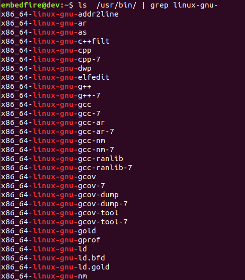
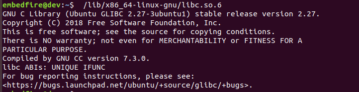
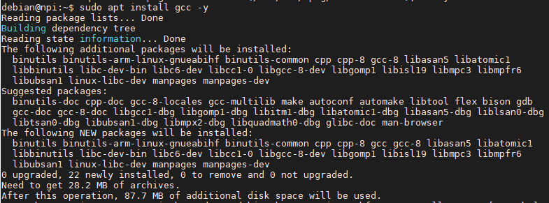
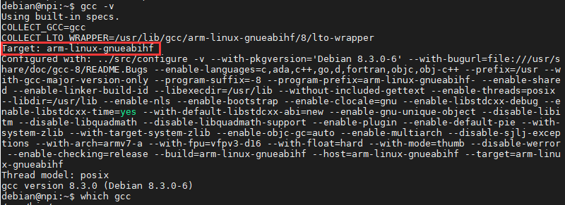
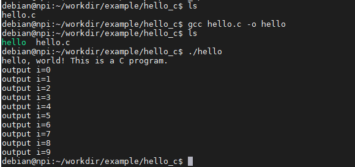
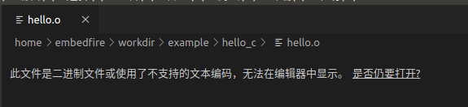

.. vim: syntax=rst

.. highlight:: sh
   :linenothreshold: 5

GCC和Hello World
------------------------------

本章以Linux下使用GCC编译Hello World程序来讲解Linux C编程的相关流程和概念。

在Windows下开发C程序代码可以用Visual
Studio，开发MCU的程序可以使用Keil、IAR等IDE集成开发环境；而在Linux下也有类似的IDE，如eclipse、Clion等。在这些环境下开发通常我们按照它们预定的步骤建立工程模板，再编写具体的代码，直接点击对应的编译、运行按钮即可完成操作。

在开发大型应用程序特别是调试的时候，使用IDE是非常好的选择，
IDE的一个特点是它把各种常用操作封装成图形界面供用户使用，但如同学习Shell命令行的原因一样，在图形界面之下还潜藏着海量的功能，在Linux下的日常开发中常常直接使用命令行来操作，编译时配合其它命令行工具的时候简单快捷，而且非常直观，有利于了解编译的原理。

本章通过解构hello world程序在Linux下的编译运行过程，
掌握GCC、readelf、ldd工具的基本使用，便于理解开发流程以及后期建立编译工具链是要做什么事情。
了解各编译步骤及其生成的文件，这对后期编写Makefile及使用其它工具大有好处。
了解程序的链接过程有利于明白为什么某些程序需要
依赖特定的文件，从而方便专门定制Linux文件系统。

本章的示例代码目录为：base_code/linux_app/hello_c。

GCC编译工具链
~~~~~~~~~~~~~~~~~~~~~~~~

GCC编译工具链（toolchain）是指以GCC编译器为核心的一整套工具，用于把源代码转化成可执行应用程序。它主要包含以下三部分内容：

-  gcc-core：即GCC编译器，用于完成预处理和编译过程，例如把C代码转换成汇编代码。

-  Binutils ：除GCC编译器外的一系列小工具包括了链接器ld，汇编器as、目标文件格式查看器readelf等。

-  glibc：包含了主要的 C语言标准函数库，C语言中常常使用的打印函数printf、malloc函数就在glibc 库中。

在很多场合下会直接用GCC编译器来指代整套GCC编译工具链。

GCC编译器
^^^^^^^^^^^^^^^^^^^^^^^^

GCC（GNU Compiler Collection）是由 GNU 开发的编程语言编译器。
GCC最初代表"GNU C Compiler"，当时只支持C语言。
后来又扩展能够支持更多编程语言，包括 C++、Fortran 和 Java 等。
因此，GCC也被重新定义为"GNU Compiler Collection"，成为历史上最优秀的编译器，
其执行效率与一般的编译器相比平均效率要高 20%~30%。

GCC的官网地址为：https://gcc.gnu.org/，在Ubuntu系统下系统默认已经安装好GCC编译器，可以通过如下命令查看Ubuntu系统中GCC编译器的版本及安装路径：

::

      #在主机上执行如下命令
      gcc -v          #查看gcc编译器版本
      which gcc       #查看gcc的安装路径

.. image:: media/gcchel002.png
   :align: center
   :alt: 系统自带的GCC编译器

图中的两处信息说明如下：

- "Target:x86_64-linux-gnu"表示该GCC的目标平台为x86_64架构（Intel、AMD的CPU），
  表示它编译生成的应用程序只适用于x86架构，不适用于ARM开发板平台。

- "gcc version 7.4.0"表明该GCC的版本为7.4.0，部分程序可能会对编译器版本有要求，
  不过我们演示使用的应用程序比较简单，兼容性好，一开始可以不用在乎这个，
  而编译指定版本的uboot、Linux内核的时候可能会对GCC有版本要求。

Binutils工具集
^^^^^^^^^^^^^^^^^^^^^^

Binutils（bin utility），是GNU二进制工具集，通常跟GCC编译器一起打包安装到系统，它的官方说明网站地址为：\ https://www.gnu.org/software/binutils/\ 。

在进行程序开发的时候通常不会直接调用这些工具，而是在使用GCC编译指令的时候由GCC编译器间接调用。下面是其中一些常用的工具：

-  as：汇编器，把汇编语言代码转换为机器码（目标文件）。

-  ld：链接器，把编译生成的多个目标文件组织成最终的可执行程序文件。

-  readelf：可用于查看目标文件或可执行程序文件的信息。

-  nm ： 可用于查看目标文件中出现的符号。

-  objcopy： 可用于目标文件格式转换，如.bin 转换成 .elf 、.elf 转换成 .bin等。

-  objdump：可用于查看目标文件的信息，最主要的作用是反汇编。

-  size：可用于查看目标文件不同部分的尺寸和总尺寸，例如代码段大小、数据段大小、使用的静态内存、总大小等。

系统默认的Binutils工具集位于/usr/bin目录下，可使用如下命令查看系统中存在的Binutils工具集：

::

      #在Ubantu上执行如下命令
      ls /usr/bin/ | grep linux-gnu-

图中列出的是Binutils工具的完整名字，在终端中使用时通常直接使用它们的别名即可，
在后面的讲解我们会使用到readelf工具。

glibc库
^^^^^^^^^^^^^^^^^^

glibc库是GNU组织为GNU系统以及Linux系统编写的C语言标准库，因为绝大部分C程序都依赖该函数库，该文件甚至会直接影响到系统的正常运行，例如常用的文件操作函数read、write、open，打印函数printf、动态内存申请函数malloc等。

在Ubuntu系统下，libc.so.6是glibc的库文件，可直接执行该库文件查看版本，在主机上执行如下命令：

::

      #在Ubantu上执行如下命令
      #以下是Ubuntu 64位机的glibc库文件路径，可直接执行
      /lib/x86_64-linux-gnu/libc.so.6

图中表示本系统中使用的glibc是2.27版本，是由GCC 7.3.0版本的编译器编译出来的。

学习C语言的时候，可能有同学特别好奇printf、malloc之类的函数是如何实现的，
但是在Windows下的C库是不开源的，无法查看，而在Linux下，
则可以直接研究glibc的源代码，甚至加入开发社区贡献自己的代码，glibc的官网地址为：
https://www.gnu.org/software/libc/ ，可在该网站中下载源代码来学习。

为了更直观地感受GCC编译工具，请跟着以下的步骤来打开新世界的大门吧。

X86_64平台、Ubuntu系统下的HelloWorld
~~~~~~~~~~~~~~~~~~~~~~~~~~~~~~~~~~~~~~~~

创建工作目录
^^^^^^^^^^^^^^^^^^^^^^^^

为方便进行后面的各种实验，首先建立一个工作目录workdir/example，
并在其下建立本章使用的hello_c目录：

::

      #在Ubantu上执行如下命令
      mkdir -p ~/workdir/example/hello_c #创建hello_c目录

编写代码文件
^^^^^^^^^^^^^^^^^^

使用你喜欢的编辑器新建一个名为hello.c的文件，输入如下面的示例代码并保存至hello_c目录下。

.. literalinclude:: ../../base_code/linux_app/hello_c/hello.c
   :caption: ../../base_code/linux_app/hello_c/hello.c
   :language: c
   :linenos:

这是一个非常通用的C Hello World代码，在Windows下和Linux下并没有什么区别，
甚至跟STM32或RT1052等MCU的裸机代码差异也不大，只是在MCU平台下会多了一些硬件初始化的内容。

编译并执行
^^^^^^^^^^^^^^^^^^^^

Ubuntu默认安装GCC编译工具链，写好程序后可以直接进行编译，请尝试执行以下命令：

::

      #在Ubantu的hello_c目录下执行如下命令
      gcc hello.c –o hello #使用gcc把hello.c编译成hello程序

      ls        #查看目录下的文件
      ./hello   #执行生成的hello程序

      #若提示权限不够或不是可执行文件，执行如下命令再运行hello程序
      chmod u+x hello #给hello文件添加可执行权限

如下图:

.. image:: media/gcchel005.png
   :align: center
   :alt: GCC编译结果

如图所示，执行gcc编译命令后看到目录下生成了一个可执行文件hello，
然后通过"./"符号加上程序的名字即可运行，此处的"."表示当前目录，
所以当我们想运行一个可执行程序的时候，输出它的路径名即可执行。
hello程序运行时代码中printf的内容直接输出到了终端。

ARM平台、Debian系统下的HelloWorld
~~~~~~~~~~~~~~~~~~~~~~~~~~~~~~~~~~~~~~~~

安装GCC编译工具链
^^^^^^^^^^^^^^^^^^^^^^^^

野火提供的Debian系统镜像默认不带gcc编译器，开发板启动以后，执行以下命令安装GCC编译工具链

::

      sudo apt install gcc -y

如下图:

GCC工具链包括了binutils、readelf工具,因此GCC安装完成后，binutils、readelf等工具也可以直接使用。

运行以下指令查看GCC版本与安装路径。

::

      gcc -v          #查看gcc编译器版本
      which gcc       #查看gcc的安装路径

如下图:

与前面介绍的Ubuntu中GCC不一样的是，开发板中gcc编译工具链的目标平台是arm架构的，表示它生成的应用程序只能运行于ARM平台的开发板，
而不适合用于X86平台。

创建工作目录
^^^^^^^^^^^^^^^^^^^^^^^^

先在当前用户下创建一个本章节使用的工作目录workdir/example/hello_c。

::

      #在Debian上执行如下命令
      mkdir -p ~/workdir/example/hello_c #创建hello_c目录

编写代码文件
^^^^^^^^^^^^^^^^^^

使用编辑器新建一个名为hello.c的文件，输入如下面的示例代码并保存至hello_c目录下。

.. literalinclude:: ../../base_code/linux_app/hello_c/hello.c
   :caption: ../../base_code/linux_app/hello_c/hello.c
   :language: c
   :linenos:

编译并执行
^^^^^^^^^^^^^^^^^^^^
::

      #在Debian的hello_c目录下执行如下命令
      gcc hello.c –o hello #使用gcc把hello.c编译成hello程序

      ls        #查看目录下的文件
      ./hello   #执行生成的hello程序

      #若提示权限不够或不是可执行文件，执行如下命令再运行hello程序
      chmod u+x hello #给hello文件添加可执行权限

如下图:

运行结果与前面X86_64、Ubantu系统的HelloWorld执行结果一致。

**这就是在Linux下使用GCC开发简单C应用程序并运行的基本流程，下面我们针对GCC编译过程进行讲解。**

GCC编译过程
~~~~~~~~~~~~~~~~~~~~~

基本语法
^^^^^^^^^^^^^^^^

GCC使用的命令语法如下：

gcc [选项] 输入的文件名

常用选项：

-  -o：小写字母"o"，指定生成的可执行文件的名字，不指定的话生成的可执行文件名为a.out。

-  -E：只进行预处理，既不编译，也不汇编。

-  -S：只编译，不汇编。

-  -c：编译并汇编，但不进行链接。

-  -g：生成的可执行文件带调试信息，方便使用gdb进行调试。

-  -Ox：大写字母"O"加数字，设置程序的优化等级，如"-O0""-O1" "-O2" "-O3"，
   数字越大代码的优化等级越高，编译出来的程序一般会越小，但有可能会导致程序不正常运行。

编译过程
"""""""""""""""""
若不了解程序的编译过程，那么GCC的编译选项会让人一头雾水。下面以X86_64平台下Ubuntu的编译过程为例进行初步讲解，
ARM平台下Debian的编译过程也是类似的，不再进行分析。

GCC编译选项除了-g和-Ox选项，其它选项实际上都是编译的分步骤，即只进行某些编译过程。

::

      #直接编译成可执行文件
      gcc hello.c -o hello

      #以上命令等价于执行以下全部操作
      #预处理，可理解为把头文件的代码汇总成C代码，把*.c转换得到*.i文件
      gcc –E hello.c –o hello.i

      #编译，可理解为把C代码转换为汇编代码，把*.i转换得到*.s文件
      gcc –S hello.i –o hello.s

      #汇编，可理解为把汇编代码转换为机器码，把*.s转换得到*.o，即目标文件
      gcc –c hello.s –o hello.o

      #链接，把不同文件之间的调用关系链接起来，把一个或多个*.o转换成最终的可执行文件
      gcc hello.o –o hello

对于有MCU开发经验的读者，建议学习一下野火的《STM32库开发实战指南》、《i.MX
RT库开发实战指南》中《MDK的编译过程及文件详解》章节，它从MCU的角度非常详细地讲解了上述编译过程。GCC的编译过程也是一样的，而且在Linux平台下解构这个过程更加直观，不过本章作为入门章节，仅从表面去建立编译原理的轮廓，不作深入介绍。

GCC 编译工具链在编译一个C源文件时需要经过以下 4 步：

1. 预处理，在预处理过程中，对源代码文件中的文件包含(include)、
   预编译语句(如宏定义define等)进行展开，生成.i文件。
   可理解为把头文件的代码、宏之类的内容转换成更纯粹的C代码，不过生成的文件以.i为后缀。

#. 编译，把预处理后的.i文件通过编译成为汇编语言，生成.s文件，即把代码从C语言转换成汇编语言，这是GCC编译器完成的工作。

#. 汇编，将汇编语言文件经过汇编，生成目标文件.o文件，每一个源文件都对应一个目标文件。即把汇编语言的代码转换成机器码，这是as汇编器完成的工作。

#. 链接，最后将每个源文件对应的.o文件链接起来，就生成一个可执行程序文件，这是链接器ld完成的工作。

以上一节的hello.c为例，后面括号代表的是gcc的参数，分步骤编译过程如下图所示。

.. image:: media/gcchel006.jpg
   :align: center
   :alt: gcc编译过程

关于编译原理，大家可以找专门的书籍阅读加深理解，这对程序开发大有裨益，下面带领大家浏览一下各个阶段生成的文件。

预处理阶段
^^^^^^^^^^^^^^^^^^^^

使用GCC的参数"-E"，可以让编译器生成.i文件，参数"-o"，可以指定输出文件的名字。

具体执行命令如下：

::

      #预处理，可理解为把头文件的代码汇总成C代码，把*.c转换得到*.i文件
      gcc –E hello.c –o hello.i

直接用编辑器打开生成的hello.i，可以看到如下的内容

.. code-block:: c
   :caption: hello.i文件
   :linenos:

   # 1 "hello.c"
   # 1 "<built-in>"
   # 1 "<command-line>"
   # 31 "<command-line>"
   # 1 "/usr/include/stdc-predef.h" 1 3 4
   # 32 "<command-line>" 2
   # 1 "hello.c"
   # 1 "/usr/include/stdio.h" 1 3 4
   # 27 "/usr/include/stdio.h" 3 4
   # 1 "/usr/include/x86_64-linux-gnu/bits/libc-header-start.h" 1 3 4
   # 33 "/usr/include/x86_64-linux-gnu/bits/libc-header-start.h" 3 4
   # 1 "/usr/include/features.h" 1 3 4
   # 424 "/usr/include/features.h" 3 4
   # 1 "/usr/include/x86_64-linux-gnu/sys/cdefs.h" 1 3 4
   # 427 "/usr/include/x86_64-linux-gnu/sys/cdefs.h" 3 4
   # 1 "/usr/include/x86_64-linux-gnu/bits/wordsize.h" 1 3 4
   # 428 "/usr/include/x86_64-linux-gnu/sys/cdefs.h" 2 3 4
   # 1 "/usr/include/x86_64-linux-gnu/bits/long-double.h" 1 3 4
   # 429 "/usr/include/x86_64-linux-gnu/sys/cdefs.h" 2 3 4
   # 425 "/usr/include/features.h" 2 3 4
   # 448 "/usr/include/features.h" 3 4
   # 1 "/usr/include/x86_64-linux-gnu/gnu/stubs.h" 1 3 4
   # 10 "/usr/include/x86_64-linux-gnu/gnu/stubs.h" 3 4
   # 1 "/usr/include/x86_64-linux-gnu/gnu/stubs-64.h" 1 3 4
   # 11 "/usr/include/x86_64-linux-gnu/gnu/stubs.h" 2 3 4
   # 449 "/usr/include/features.h" 2 3 4
   # 34 "/usr/include/x86_64-linux-gnu/bits/libc-header-start.h" 2 3 4
   # 28 "/usr/include/stdio.h" 2 3 4
   # 1 "/usr/lib/gcc/x86_64-linux-gnu/7/include/stddef.h" 1 3 4
   # 216 "/usr/lib/gcc/x86_64-linux-gnu/7/include/stddef.h" 3 4
   # 216 "/usr/lib/gcc/x86_64-linux-gnu/7/include/stddef.h" 3 4
   typedef long unsigned int size_t;
   # 34 "/usr/include/stdio.h" 2 3 4
   # 1 "/usr/include/x86_64-linux-gnu/bits/types.h" 1 3 4
   # 27 "/usr/include/x86_64-linux-gnu/bits/types.h" 3 4
   # 1 "/usr/include/x86_64-linux-gnu/bits/wordsize.h" 1 3 4
   # 28 "/usr/include/x86_64-linux-gnu/bits/types.h" 2 3 4
   typedef unsigned char __u_char;
   typedef unsigned short int __u_short;

   ...中间省略部分内容...

   int main(void)
   {
   printf("hello, world! This is a C program.\n");
   for(int i = 0; i < 10; i++)
   {
   printf("output i = %d\n", i );
   }
   return 0;
   }

文件中以"#"开头的是注释，可看到有非常多的类型定义、函数声明被加入到文件中，
这些就是预处理阶段完成的工作，相当于它把原C代码中包含的头文件中引用的内容汇总到一处。
如果原C代码有宏定义，还可以更直观地看到它把宏定义展开成具体的内容（如宏定义代表的数字）。

编译阶段
^^^^^^^^^^^^^^^^^^^^

GCC可以使用-S选项，让编译程序生成汇编语言的代码文件（.s后缀）。
在这个过程，GCC会检查各个源文件的语法，即使我们调用了一个没有定义的函数，也不会报错。

具体命令如下，生成的hello.s文件可直接使用编辑器打开。

::

      #编译，可理解为把C代码转换为汇编代码，把*.i转换得到*.s文件
      gcc –S hello.i –o hello.s

      #也可以直接以C文件作为输入进行编译，与上面的命令是等价的
      gcc –S hello.c –o hello.s

编译生成的hello.s文件内容如下：

.. code-block:: asm
   :caption: hello.s文件
   :linenos:

   .file "hello.c"
   .text
   .section .rodata
   .align 8
   .LC0:
   .string "hello, world! This is a C program."
   .LC1:
   .string "output i = %d\n"
   .text
   .globl main
   .type main, @function
   main:
   中间省略部分内容
   .L2:
   cmpl $9, -4(%rbp)
   jle .L3
   movl $0, %eax
   leave
   .cfi_def_cfa 7, 8
   ret
   .cfi_endproc
   .LFE0:
   .size main, .-main
   .ident "GCC: (Ubuntu 7.4.0-1ubuntu1~18.04.1) 7.4.0"
   .section .note.GNU-stack,"",@progbits

汇编语言是跟平台相关的，由于本示例的GCC目标平台是x86，所以此处生成的汇编文件是x86的汇编代码。

汇编阶段
^^^^^^^^^^^^^^^^

GCC的参数"c"表示只编译(compile)源文件但不链接，会将源程序编译成目标文件（.o后缀）。计算机只认识0或者1，不懂得C语言，也不懂得汇编语言，经过编译汇编之后，生成的目标文件包含着机器代码，这部分代码就可以直接被计算机执行。一般情况下，可以直接使用参数"c"，跳过上述的两个过程，具体命令
如下：

::

      #汇编，可理解为把汇编代码转换为机器码，把*.s转换得到*.o，即目标文件
      gcc –c hello.s –o hello.o

      #也可以直接以C文件作为输入进行汇编，与上面的命令是等价的
      gcc –c hello.c –o hello.o

*.o是为了让计算机阅读的，所以不像前面生成的*.i和*.s文件直接使用字符串来记录，
如果直接使用编辑器打开，只会看到乱码，如下图。

Linux下生成的*.o目标文件、*.so动态库文件以及下一小节链接阶段生成最终的可执行文件都是elf格式的，
可以使用"readelf"工具来查看它们的内容。

请亲自尝试执行如下命令：

::

      #在hello.o所在的目录执行如下命令
      readelf -a hello.o

.. image:: media/gcchel008.png
   :align: center
   :alt: 使用readelf查看*.o目标文件（部分内容）

从readelf的工具输出的信息，可以了解到目标文件包含ELF头、程序头、节等内容，
对于*.o目标文件或*.so库文件，编译器在链接阶段利用这些信息把多个文件组织起来，
对于可执行文件，系统在运行时根据这些信息加载程序运行。

链接阶段
^^^^^^^^^^^^^^^^

链接过程，是将汇编过程生成的所有目标文件进行链接，生成可执行文件。

例如一个工程里包含了A和B两个代码文件，编译后生成了各自的A.o和B.o目标文件，
如果在代码A中调用了B中的某个函数fun，那么在A的代码中只要包含了fun的函数声明，
编译就会通过，而不管B中是否真的定义了fun函数（当然，如果函数声明都没有，编译也会报错）。
也就是说A.o和B.o目标文件在编译阶段是独立的，而在链接阶段，
链接过程需要把A和B之间的函数调用关系理顺，也就是说要告诉A在哪里能够调用到fun函数，
建立映射关系，所以称之为链接。若链接过程中找不到fun函数的具体定义，则会链接报错。

虽然本示例只有一个hello.c文件，但它调用了C标准代码库的printf函数，
所以链接器会把它和printf函数链接起来，生成最终的可执行文件。

链接分为两种：

-  动态链接，GCC编译时的默认选项。动态是指在应用程序运行时才去加载外部的代码库，
   例如printf函数的C标准代码库*.so文件存储在Linux系统的某个位置，
   hello程序执行时调用库文件*.so中的内容，不同的程序可以共用代码库。
   所以动态链接生成的程序比较小，占用较少的内存。

-  静态链接，链接时使用选项"--static"，它在编译阶段就会把所有用到的库打包到自己的可执行程序中。
   所以静态链接的优点是具有较好的兼容性，不依赖外部环境，但是生成的程序比较大。

请尝试执行如下命令体验静态链接与动态链接的区别：

::

      #在hello.o所在的目录执行如下命令
      #动态链接，生成名为hello的可执行文件

      gcc hello.o –o hello

      #也可以直接使用C文件一步生成，与上面的命令等价
      gcc hello.c -o hello

      #静态链接，使用--static参数，生成名为hello_static的可执行文件
      gcc hello.o –o hello_static --static

      #也可以直接使用C文件一步生成，与上面的命令等价
      gcc hello.c -o hello_static --static

.. image:: media/gcchel009.png
   :align: center
   :alt: 动态链接和静态链接的区别

从图中可以看到，使用动态链接生成的hello程序才8.2KB，
而使用静态链接生成的hello_static程序则高达825KB。

在Ubuntu下，可以使用ldd工具查看动态文件的库依赖，尝试执行如下命令：

::

      #在hello所在的目录执行如下命令      
      ldd hello
      ldd hello_static

.. image:: media/gcchel010.png
   :align: center
   :alt: 使用ldd工具查看动态文件的库依赖

可以看到，动态链接生成的hello程序依赖于库文件linux-vdso.so.1、libc.so.6
以及ld-linux-x86-64.so.2，其中的libc.so.6就是我们常说的C标准代码库，
我们的程序中调用了它的printf库函数。

静态链接生成的hello_static没有依赖外部库文件。

.. |gcchel002| image:: media/gcchel002.png
   :width: 5.99306in
   :height: 2.91542in

.. |gcchel005| image:: media/gcchel005.png
   :width: 5.61111in
   :height: 2.10319in
.. |gcchel006| image:: media/gcchel006.jpg
   :width: 5.275in
   :height: 1.35833in

.. |gcchel008| image:: media/gcchel008.png
   :width: 4.94444in
   :height: 2.38655in
.. |gcchel009| image:: media/gcchel009.png
   :width: 5.56855in
   :height: 1.38769in
.. |gcchel010| image:: media/gcchel010.png
   :width: 5.63529in
   :height: 0.97222in
