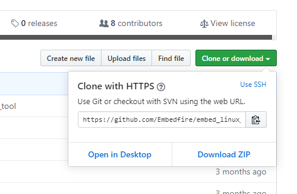
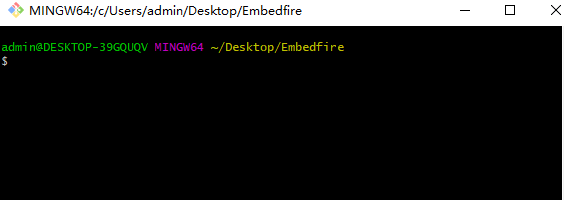
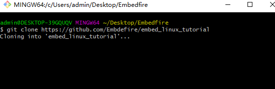

.. vim: syntax=rst

项目资料下载
------------------

本项目通过Git开源，用户可以在GitHub和Gitee下载本项目相关源码：

- GitHub仓库地址：https://github.com/Embdefire/embed_linux_tutorial
- Gitee 仓库地址：https://gitee.com/wildfireteam/embed_linux_tutorial

Git是什么
~~~~~~~~~~~~~~~~~~

Git是一个功能十分强大的分布式版本控制系统，主要用于高效地对各种各样的项目进行版本管理。

Git的诞生，起源于linux社区的一位大牛Andrew(samba之父)写了可连接BitKeeper仓库的外挂，
这引起了BitMover 公司的震怒，收回了对linux社区免费使用BitKeeper的授权。于是Linux之父，
Torvalds，花了十天时间为Linux社区开发了新的版本工具--Git。

Git的特点
~~~~~~~~~~~~~~~~~~

相较于其他版本管理工具，Git有以下几个优点:

- 快照记录。git和其他版本管理工具重要差别在于存储数据的方式。
  其他版本工具通常将它们保存的信息看作是一种原始数据+文件修改的记录。
  而Git在储存时是生成快照来记录全部文件（快照不是所有文件的单纯拷贝，而是一种对全体文件的索引）。

- 分布式。每一位项目开发人员的电脑里，都有项目的完成备份，避免造成资料受损无法挽回的后果。
  同时，本地的项目备份使得所有的版本管理操作都在毫秒级别内完成。
  这与SVN、CVS等集中式版本工具时常要等待中央服务器响应相比,用户体验显得非常好。

- 开源。这与linux内核一样，开放源码保证了Git的可靠性和安全性，也有利于Git的功能越来越强大。

Git与GitHub、Gitee
~~~~~~~~~~~~~~~~~

GitHub和Gitee是一个基于Git的在线项目托管平台,它提供了web界面,用户可以在上面创建远程仓库来存放自己的项目。
所有的开发者可以基于这个远程仓库共同协作，不断地维护和完善该项目。

使用Git下载项目资料
~~~~~~~~~~~~~~~~~

安装Git
^^^^^^^^^^^^

**Windows系统**

到Git官网下载安装包,直接安装即可。

https://gitforwindows.org

**Linux系统**

根据不同发行版，使用相关包管理工具安装即可。

比如Ubantu：在终端执行"sudo apt-get install git -y"即可。

获取项目仓库地址
^^^^^^^^^^^^^^^^^^^^^

1、在GitHub或者Gitee网站上，找到需要下载的项目，复制该项目的克隆链接。
如下图:

GitHub仓库地址

Gitee仓库地址

下载项目
^^^^^^^^^^^^^^^^^^^^^

下面以Windows系统为例，linux系统的操作是类似的。

1、windows安装完Git后，.在将要下载项目的目录中，右键选择"Git Bash Here"项，
打开git bash命令工具。

如下图:

2、在git bash命令工具运行:"git clone +"仓库地址""命令，进行项目下载。
本项目在GitHub的仓库地址为:https://github.com/Embdefire/embed_linux_tutorial。
因此要运行的命令为:

.. code-block:: sh
   :linenos:

    git clone https://github.com/Embdefire/embed_linux_tutorial

如下图:

3、等待项目下载完毕,注意:GitHub网速在国内受限，可能会出现多次下载失败的现象。

4、项目下载完毕后，在项目目录下的base_code文件夹存放了所有实验的相关代码，用户可根据实际需要进行查阅使用。

