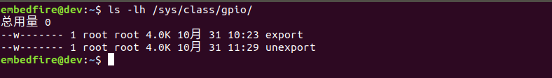
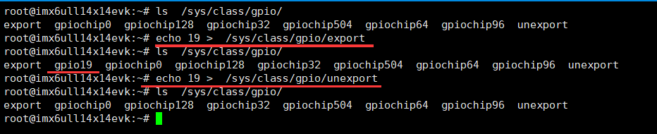
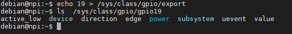
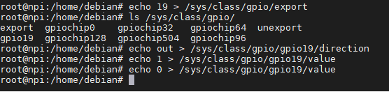
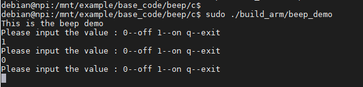

.. vim: syntax=rst

控制蜂鸣器（GPIO子系统）
--------------

本章讲解Linux GPIO子系统驱动相关应用层程序的控制原理。

本章的示例代码目录为：base_code/linux_app/beep。

GPIO子系统
~~~~~~~

GPIO是General Purpose I/O的缩写，即通用输入输出端口，简单来说就是MCU/CPU可控制的引脚，这些引脚通常有多种功能，最基本的是高低电平输入检测和输出，部分引脚还会与主控器的片上外设绑定，如作为串口、I2C、网络、电压检测的通讯引脚。

与LED子系统类似，Linux提供了GPIO子系统驱动框架，使用该驱动框架可以把CPU的GPIO引脚导出到用户空间，用户通过访问/sys文件系统进行控制，GPIO子系统支持把引脚用于基本的输入输出功能，其中输入功能还支持中断检测。在Linux内核源码的“Documentation/gpio”目录可找
到关于GPIO子系统的说明。

通过GPIO子系统可以控制LED、蜂鸣器以及按键检测这类硬件设备，不过由于本开发板出厂的默认镜像中，LED灯使用了LED子系统驱动控制，按键使用了input输入子系统驱动控制，不方便在用户空间使用GPIO的方式进行实验，而蜂鸣器在驱动层中我们是使用GPIO子系统的，本章选择蜂鸣器作为示例讲解。

在Mini开发板上没有蜂鸣器，实验时可使用电压表检测对应引脚的电平输出。

GPIO设备目录
^^^^^^^^

GPIO驱动子系统导出到用户空间的目录是“/sys/class/gpio”。

可使用如下命令查看：

.. code-block:: sh
   :linenos:

   #在主机或开发板的终端使用以下命令查看
   ls -lh /sys/class/gpio

   #以下命令不支持在Ubuntu主机上运行
   #导出GPIO到用户空间
   echo 19 > /sys/class/gpio/export
   #查看目录的变化，增加了gpio19目录
   ls /sys/class/gpio/
   #把gpio19从用户空间中取消导出
   echo 19 > /sys/class/gpio/unexport
   #查看目录变化，gpio19目录消失了
   ls /sys/class/gpio/

如下图:

该目录下的主要内容说明如下：

-  export文件：导出GPIO，该文件只能写不能读，用户向该文件写
   入GPIO的编号N可以向内核申请将该编号的GPIO导出到用户空间，若内核本
   身没有把该GPIO用于其它功能，那么在/sys/class/gpio目录下会新增一
   个对应编号的gpioN目录，如上图一导出了gpio19。

-  unexport文件：export的相反操作，取消导出GPIO，该文件同样只能
   写不能读。上图演示了往unexport写入19后，gpio19目录消失了。

-  gpiochipX目录：该目录是指GPIO控制器外设，Ubuntu主机上默认没有这样的功能。

-  gpioN目录：通过export导出的具体GPIO引脚的控制目录，如上图中的gpio19目录下会包含有
   控制该引脚的相应文件。

GPIO设备属性
^^^^^^^^^^^^^^^^^^^^^^^^^^^^^^^^

gpioN目录下相关的设备文件，可以使用以下命令查看：

.. code-block:: sh
   :linenos:

   #在开发板的终端使用以下命令
   #导出编号为19的GPIO
   echo 19 > /sys/class/gpio/export
   #查看gpio19目录下的内容
   ls -lh /sys/class/gpio/gpio19

如下图:

常用的属性文件介绍如下：

-  direction文件：表示GPIO引脚的方向，它的可取值如下：

-  in：引脚为输入模式。

-  out：引脚为输出模式，且默认输出电平为低。

-  low：引脚为输出模式，且默认输出电平为低。

-  high：引脚为输出模式，且默认输出电平为高。

-  value文件：表示GPIO的电平，1表示高电平，0表示低电平。GPIO被配置为输出
   模式， 那么修改该文件的内容可以改变引脚的电平。

-  edge文件：用于配置GPIO的中断触发方式，当GPIO被配置为中断时，可以通过系统
   的poll函数监听。edge文件可取如下的属性值：

-  none：没有使用中断模式。

-  rising：表示引脚为中断输入模式，上升沿触发。

-  falling：表示引脚为中断输入模式，下降沿触发。

-  both：表示引脚为中断输入模式，边沿触发。

与LED子系统不同，当某个引脚被用于具体的LED设备时，该引脚会被设备占用，它的
功能在用户空间是无法再被修改的，而使用GPIO子系统的设备则可以在用户空间灵活配置作为输入、输出或中断模式。

只要我们知道蜂鸣器的GPIO引脚编号，就可以就可以通过它导出的direction、value文件
控制引脚输出高低电平，从而控制它发声了。当然，如果硬件上临时把该引脚修改为按键
高低电平检测，此时也可以通过这些文件把引脚改为输入模式使用，而不需要修改Linux内核驱动。

引脚编号转换
~~~~~~~~~~~~~~~~~~

与LED驱动设备不一样，LED已经在内核驱动（设备树）绑定了具体引脚的端
口号，最终直接以设备名字导出到用户空间，所以控制时只要通过设备文件即可
控制，而不需要知道具体的硬件连接。使用GPIO子系统时，需要用户自主控制导出
使用哪个引脚，所以我们要根据蜂鸣器的硬件连接来进行实验。

Mini开发板不带蜂鸣器，实验时可以在引出的排针处找到该引脚，使用
电压表测量它的输出电压即可。

如下图:

.. image:: media/gpiosu005.png
   :align: center
   :alt: 未找到图片5|

从上图可了解到，蜂鸣器的控制引脚名为“GPIO1_19”，该引脚输出高电平时，三极
管导通，蜂鸣器响，引脚输出低电平时，电路断开，蜂鸣器不响。

i.MX6ULL芯片GPIO引脚名格式通常为GPIOn_IOx，如此处的GPIO1_19或GPIO4_IO20等等，其
中n是端口号，x为该组端口的引脚号，本开发板采用的芯片有1~5组端口，每组端口包含的引脚从0~31不等。
本开发板中export文件使用的编号index与GPIO引脚名的转换关系如下：

index = GPIOn_IOx = (n-1)*32 + x

例如蜂鸣器使用的引脚编号为：index = GPIO1_19 = (1-1)*32 +19 = 19。

又例如GPIO4_IO20的编号为：index = GPIO4_IO20 = (4-1)*32+20=116。

要注意并不是所有的引脚都能通过export文件导出到用户空间的，例
如GPIO4_IO20引脚已经被用在了LED设备上。

控制蜂鸣器（Shell）
~~~~~~~~~~~~~~~~~~~~~~~~~~~~~~~~~~~~

下面使用命令行控制蜂鸣器，讲解GPIO子系统设备属性的应用。

由于在Ubuntu主机通常无法导出GPIO，请在开发板上执行以下命令测试,测试前需确保当前用户为root用户：

.. code-block:: sh
   :linenos:

   #以下命令在开发板上执行
   #导出蜂鸣器使用的GPIO到用户空间
   echo 19 > /sys/class/gpio/export
   #确认出现了gpio19设备目录
   ls /sys/class/gpio/
   #控制gpio19方向为输出
   echo out > /sys/class/gpio/gpio19/direction
   #控制gpio19输出高电平
   echo 1 > /sys/class/gpio/gpio19/value
   #控制gpio19输出低电平
   echo 0 > /sys/class/gpio/gpio19/value

如下图:

命令执行的原理非常简单：

-  把蜂鸣器的编号写入到export文件，导出GPIO设备。

-  修改蜂鸣器设备属性direction文件值为out，把GPIO设置为输出方向。

-  修改蜂鸣器设备属性文件value的值为1或0，控制蜂鸣器响或不响。

控制蜂鸣器（系统调用）
~~~~~~~~~~~

类似地，也可以通过系统调用的文件操作方式控制蜂鸣器。

工程中的beep_bsp.c文件包含了控制蜂鸣器相关的函数，见如下所示。

.. code-block:: c
   :caption: 蜂鸣器驱动文件（base_code/linux_app/beep/c/sources/bsp_beep.c文件）
   :linenos:

   #include <string.h>
   #include <sys/stat.h>
   #include <unistd.h>
   #include <fcntl.h>
   #include "includes/bsp_beep.h"

   int beep_init(void)
   {
      int fd;
      //index config
      fd = open("/sys/class/gpio/export", O_WRONLY);
      if(fd < 0)
         return 1 ;

      write(fd, BEEP_GPIO_INDEX, strlen(BEEP_GPIO_INDEX));
      close(fd);

      //direction config
      fd = open("/sys/class/gpio/gpio" BEEP_GPIO_INDEX "/direction", O_WRONLY);
      if(fd < 0)
         return 2;

      write(fd, "out", strlen("out"));
      close(fd);	
      
      return 0;
   }

   int beep_deinit(void)
   {
      int fd;
      fd = open("/sys/class/gpio/unexport", O_WRONLY);
      if(fd < 0)
         return 1;

      write(fd, BEEP_GPIO_INDEX, strlen(BEEP_GPIO_INDEX));
      close(fd);
      
      return 0;
   }

   int beep_on(void)
   {
      int fd;

      fd = open("/sys/class/gpio/gpio" BEEP_GPIO_INDEX "/value", O_WRONLY);
      if(fd < 0)
         return 1;

      write(fd, "1", 1);
      close(fd);

      return 0;
   }

   int beep_off(void)
   {
      int fd;

      fd = open("/sys/class/gpio/gpio" BEEP_GPIO_INDEX "/value", O_WRONLY);
      if(fd < 0)
         return 1;

      write(fd, "0", 1);
      close(fd);

      return 0;
   }

该代码说明如下：

-  beep_init函数：它使用了open、write、close等函数修改export和gpioN/direction文件，初始
   化蜂鸣器使用的引脚为输出模式。
-  beep_deinit函数：向unexport文件写入编号，取消导出。

-  beep_on和beep_off函数：往gpioN/value文件写入1和0，控制引脚输出高低电平。

本代码要特别注意的是export和unexport文件是只有写权限的，所以通过open打开时要
使用“O_WRONLY”标志以写入方式打开，不能使用“O_RDWR”等带读模式的标志。

主文件
^^^^^^^^^^^^^^^

编写完 蜂鸣器的控制函数后，就可以在 main 函数中测试了，如下所示。

.. code-block:: c
   :caption: 主函数（base_code/linux_app/beep/c/sources/main.c文件）
   :linenos:

   #include <stdio.h>
   #include <unistd.h>
   #include "includes/bsp_beep.h"

   /**
      * @brief  主函数
      * @param  无
      * @retval 无
      */
   int main(int argc, char *argv[])
   {
      char buf[10];
      int res;
      printf("This is the beep demo\n");
      
      res = beep_init();
      if(res){
         printf("beep init error,code = %d",res);
         return 0;
      }

      while(1){
         printf("Please input the value : 0--off 1--on q--exit\n");
         scanf("%10s", buf);

         switch (buf[0]){
            case '0':
               beep_off();
               break;

            case '1':
               beep_on();
               break;

            case 'q':
               beep_deinit();
               printf("Exit\n");
               return 0;

            default:
               break;
         }
      }
   }

在 main 函数中，调用我们前面定义的beep_init初始化蜂鸣器使用的GPIO，然后使用scanf检测用
户输入，根据用户输入调用对应的函数控制蜂鸣器。

编译及测试
^^^^^^^^^^^^^^^^^^^^

本实验使用的Makefile相对于前面的章节仅修改了最终的可执行文件名为beep_demo。

本实验不支持在Ubuntu主机上进行。

对于ARM架构的程序，可使用如下步骤进行编译：

.. code-block:: sh
   :linenos:

   #在主机的实验代码Makefile目录下编译
   #编译arm平台的程序
   make ARCH=arm

编译后生成的ARM平台程序为build_arm/beep_demo，使用网络文件系统共
享至开发板，在开发板的终端上运行该程序测试即可。

如下图:

程序执行后会提示输入，在终端输入1并回车后蜂鸣器会响，输入0并回车后蜂鸣器不响。

.. |gpiosu005| image:: media/gpiosu005.png
   :width: 3.86864in
   :height: 2.93148in

.. |gpiosu007| image:: media/gpiosu007.png
   :width: 5.76806in
   :height: 1.59089in

