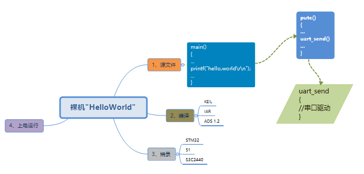
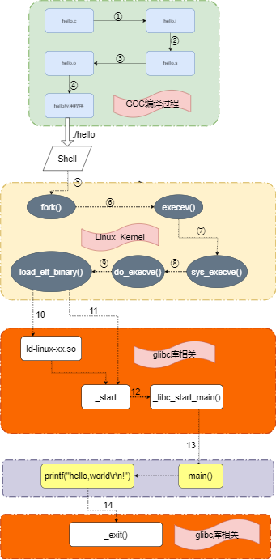

.. vim: syntax=rst

Linux系统下的Hello World
-----------------------

大家如果认真看前面文档的的话，会发现，算上我们这一章，已经是连续第三个章节都有讨论Hello World程序了。
只不过前面两章主要是借助它来给大家介绍GCC编译工具链，并没有涉及太多Hello World程序的核心。
这里可能你会疑惑:Hello World程序有啥核心？但是如果你对Hello World程序掉以轻心，那你就错了。

如此简单的一个程序，却带领了无数的人进入了编程的世界。只不过越简单的事物背后往往蕴含着复杂的机制。
如果我们深入思考一个简单的“Hello World程序”，就会发现很多问题看似简单，
但是实质上我们并没有一个非常清晰的思路，准确来说，应该大部分人脑海中都有一些模糊的印象，
但是真正深入到细节中去的时候，可能又模糊不清了。

尤其是单片机转过来学习Linux开发的学员，因为对单片机下的“Hello World程序”有了非常底层的认识，
所以在学习Linux系统开发的时候，经常不自觉地套用单片机下的“Hello World程序”的知识，来理解Linux
系统的“Hello World程序”，却不知两个程序之间的运行机制已经截然不同。

**“Hello World程序”是一个典型的案例，我们搞懂它在Linux系统下的运行机制，对我们以后开发其他程序，
有非常好的借鉴意义。尤其是当你的程序编译链接出错的时候，可以清晰地判断问题出现在哪个环节。
而不用再一脸懵逼地复制各种报错的信息，到谷歌百度中苦苦寻找解决方法。**

下面以“裸机下的Hello World”为比较对象，给大家扒一扒“Linux系统下的Hello World”。
**在接下来的分析内容里面，大家重点把握整个执行流程。在没有对Linux系统有深入研究之前，
千万不要陷进去其中的大部分细节。在学习初期，掌握宏观思想已经很不错了，
足以指导我们以后进一步学习其他内容**。

裸机下的Hello World
~~~~~~~~~~~~~~~~~~

在单片机中，实现Hello World程序的步骤并不复杂，下面的这张图片基本上涵括了全部的开发过程，非常清晰:

- 第一步；进行源代码的编写，其中关键的点在于printf函数的实现，它需要依赖单片机的串口驱动程序。
- 第二步: 借助一些集成开发环境进行程序的编译。一键编译，无需学习编译链接相关知识。
- 第三步: 借助烧录工具烧录到具体芯片上。一键烧录，无需学习芯片的flash和各种各样启动方式。
- 第四步: 上电启动开发板，串口输出“Hello World”字符串。

Linux系统下的Hello World
~~~~~~~~~~~~~~~~~~~~~~~~~

上面谈到了裸机开发Hello World，其实它也涉及到很多编译链接和烧录的知识，但是因为裸机程序不是本章节的重点，
在这里不适合展开来讲。而我们Linux系统下的Hello World，则是因为它的借鉴意义非常强，
对我们以后进一步学习其他课程起到很好的指导作用，所以在这里会尽可能详细剖析它整体的工作原理。

我们先来看Linux系统下，Hello World程序的流程图，如下所示:

总体上整个程序的编译执行过程，可以按图片从上到下的顺序，分为四大部分的内容：

- 第一部分，上面浅绿色外框部分为程序的编译。
- 第二部分，浅黄色外框部分为Linux内核提供的服务。
- 第三部分，橘色外框部分为glibc库提供的服务。
- 第四部分，浅灰色外框部分，为用户程序。

下面针对每个子步骤做进一步的讲解:

1. 预处理hello.c,主要是处理程序里面的文件包含、处理宏定义、条件编译。

2. 把c文件编译成为汇编文件(.s)，其中进行了词法分析，语法分析，语义分析、生成中间代码、对代码进行优化等工作。

3. 把汇编文件(.s)编译成可重定位文件(.o)。

4. 把可重定位文件(.o)链接成为可执行文件，其中链接可分为静态链接和动态链接

- 静态链接:在编译阶段就会把所有用到的库打包到自己的可执行程序中,其优点是具有较好的兼容性，不依赖外部环境，但是生成的程序比较大。
- 动态链接:在应用程序运行时，链接器去加载外部的共享库，并完成共享库和动态编译程序之间的链接。不同的程序可以共用代码库，节省内存空间。

5. 控制台输入./hello命令后，Shell会创建一个新的进程来执行该程序。fork()函数就是用于创建一个新的进程的。这里的进程可以先简单理解为程序的容器。

6. exeve()函数可以理解为向上一步新建的进程，填充一个可执行程序(hello)。

7. sys_execve()函数为linux系统调用,被exeve()函数调用，这里的系统调用可以理解为是操作系统系统开放给用户的最底层接口。

8. do_exeve()函数是sys_execve()函数的核心。

9. load_elf_binary()函数会去文件系统中读取hello程序到内存，然后判断它是否是动态链接的可执行程序，如果不是，则进一步判断是否是静态链接的文件。

10. ld-linux-xx.so是glibc库中的动态连接器。如果hello程序是动态链接程序，该动态链接器会去加载共享库，并完成共享库和程序的链接工作，
然后准备真正开始执行hell程序。

11. 相反，如果hello程序是静态编译的程序，则无需再加载链接共享库，直接开始准备执行hello程序。

    - 第10和11步分别执行之后.都会开始执行hello程序，_start是程序的真正入口，而该符号在glibc中。也就是说程序的真正入口在glibc。

12. __libc_start_main()也是glibc中的函数，用于在执行用户程序前进行一些初始化工作。

13. 调用用户程序中的mian()函数，开始执行printf打印函数。

14. 程序执行完了之后，调用glibc库中的_exit()函数，来结束当前进程。

整个过程粗略分析完了，对比裸机和linux系统下的“Hello World”,很明显可以看到操作系统为我们做了大量的工作，
甚至为了节省内存空间，还把程序的链接这种非常基础性的工作，交给了glibc中的动态连接器来完成。
避免静态链接的那种低效的开发方式，这是裸机开发难以做到的。

大家可能会对里面的内容有很多陌生的地方，也可能有很多疑惑的地方，
但是这里面的内容实在没有办法展开来讲，每个子步骤的后面都是一个庞然大物。如果在这个地方耗费过多精力，
势必会大大耽误学习的进度。对于深入高阶的内容，还是需要循序渐进的。

但是另一方面，脑海中有了程序执行的整体轮廓之后，我们以后的学习和编程，
就有了指导和前进的方向。我们对程序开发过程中，进行的每个步骤就了然于胸。这才是我们这个章节的意义所在。

