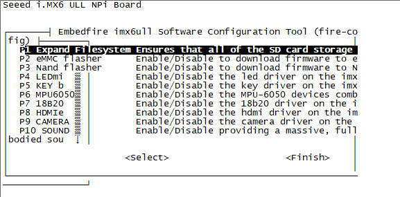
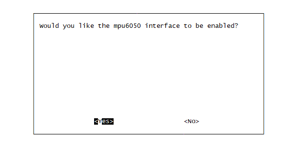
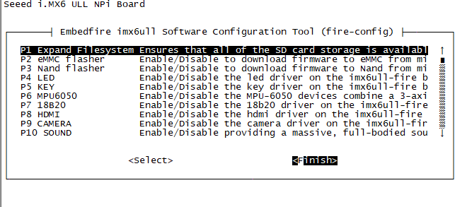
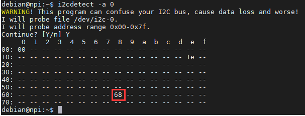
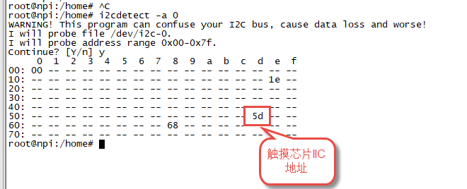
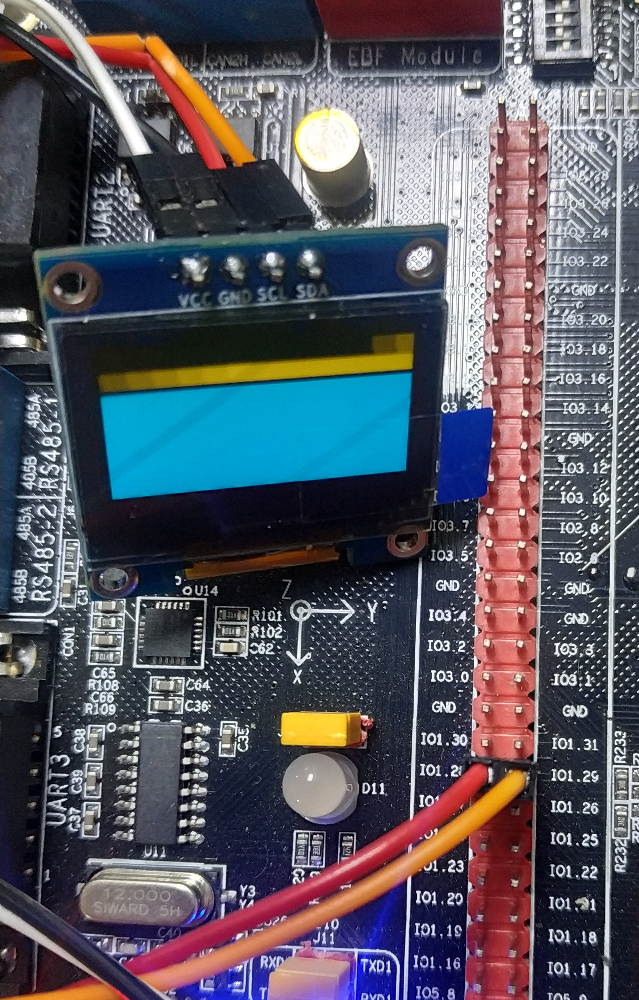

.. vim: syntax=rst

I2C通讯
-----------------

本章通过讲解在应用层中使用I2C总线与外部设备的通讯，讲解Linux系
统总线类型设备驱动架构的应用。

在Linux内核文档的Documentation/i2c目录下有关于I2C驱动非常详细的说明。

本章节的示例代码目录为：base_code/section2/i2c

I2C通讯协议简介
^^^^^^^^^^^^^^^^^^^^^

I2C 通讯协议(Inter－Integrated Circuit)是由Phiilps公司开发的，
由于它引脚少，硬件实现简单，可扩展性强，不需要USART、CAN等通讯协议的外部收发设备，
被广泛地使用在多个集成电路(IC)间的通讯。

下面我们分别对I2C协议的物理层及协议层进行讲解。

I2C物理层
~~~~~~~~~~~~~~~~~~~~~~~~

I2C通讯设备之间的常用连接方式如下图。

.. image:: media/i2c/i2cbus002.png
   :align: center
   :alt: 常见的I2C通讯系统

它的物理层有如下特点：

- 它是一个支持多设备的总线。“总线”指多个设备共用的信号线。
  在一个I2C通讯总线中，可连接多个I2C通讯设备，支持多个通讯主机及多个通讯从机。
- 一个I2C总线只使用两条总线线路，一条双向串行数据线(SDA) ，一条串行时钟线 (SCL)。
  数据线即用来表示数据，时钟线用于数据收发同步。
- 每个连接到总线的设备都有一个独立的设备地址，主机可以利用这个地址进行不同设备之间的访问。
  其中地址是一个七位或十位的数字。
- 总线通过上拉电阻接到电源。当I2C设备空闲时，会输出高阻态，而当所有设备都空闲，
  都输出高阻态时，由上拉电阻把总线拉成高电平。
- 多个主机同时使用总线时，为了防止数据冲突，会利用仲裁方式决定由哪个设备占用总线。
- 具有三种传输模式：标准模式传输速率为100kbit/s ，快速模式为400kbit/s ，
  高速模式下可达 3.4Mbit/s，但目前大多I2C设备尚不支持高速模式。
- 连接到相同总线的 IC 数量受到总线的最大电容 400pF 限制 。

协议层
~~~~~~~~~~~~~~~~~~~~~

I2C的协议定义了通讯的起始和停止信号、数据有效性、响应、仲裁、时钟同步和地址广播等环节。

I2C基本读写过程
"""""""""""""""""""

先看看I2C通讯过程的基本结构，它的通讯过程常有如下三种方式。

.. image:: media/i2c/i2cbus003.jpg
   :align: center
   :alt: 主机写数据到从机

.. image:: media/i2c/i2cbus004.jpg
   :align: center
   :alt: 主机由从机中读数据

.. image:: media/i2c/i2cbus005.jpeg
   :align: center
   :alt: I2C通讯复合格式

图例：

- |i2cbus006| ：数据由主机传输至从机

- S ： 传输开始信号

- SLAVE_ADDRESS: 从机地址

- |i2cbus007| ：数据由从机传输至主机

- R ： 传输方向选择位，1为读，0为写

- A ： 应答(ACK)或非应答(NACK)信号

- P ： 停止传输信号

这些图表示的是主机和从机通讯时，SDA线的数据包序列。

1. 其中S表示由主机的I2C接口产生的传输起始信号(S)，这时连接到I2C总线上的所有从机都会接收到这个信号。

#. 起始信号产生后，所有从机就开始等待主机紧接下来广播 的从机地址信号 (SLAVE_ADDRESS)。
   在I2C总线上，每个设备的地址都是唯一的，当主机广播的地址与某个设备地址相同时，这个设备就被选中了，没被选中的设备将会忽略之后的数据信号。
   根据I2C协议，这个从机地址可以是7位或10位。

#. 在地址位之后，是传输方向的选择位，该位为0，表示后面的数据传输方向是由主机传输至从机，即主机向从机写数据。该位为1，则相反，即主机由从机读数据。

#. 从机接收到匹配的地址后，主机或从机会返回一个应答(ACK)或非应答(NACK)信号，只有接收到应答信号后，主机才能继续发送或接收数据。

写数据方向:
  若配置的方向传输位为 **“写数据”** 方向，即第一幅图的情况，广播完地址，接收到应答信号后，
  主机开始正式向从机 **传输数据(DATA)** ，数据包的大小为8位，主机每发送完一个字节数据，
  都要等待从机的应答信号(ACK)，重复这个过程，可以向从机传输N个数据，这个N没有大小限制。
  当数据传输结束时，主机向从机发送一个停止传输信号(P)，表示不再传输数据。

读数据方向:
  若配置的方向传输位为 **“读数据”** 方向，即第二幅图的情况，广播完地址，接收到应答信号后，
  从机开始向主机 **返回数据(DATA)** ，数据包大小也为8位，从机每发送完一个数据，
  都会等待主机的应答信号(ACK)，重复这个过程，可以返回N个数据，这个N也没有大小限制。
  当主机希望停止接收数据时，就向从机返回一个非应答信号(NACK)，则从机自动停止数据传输。

复合格式:
  除了基本的读写，I2C通讯更常用的是 **复合格式** ，即第三幅图的情况，该传输过程有 **两次起始信号(S)** 。
  一般在第一次传输中，主机通过SLAVE_ADDRESS寻找到从设备后，发送一段“数据”，
  这段数据通常用于表示从设备内部的寄存器或存储器地址(注意区分它与SLAVE_ADDRESS的区别)；
  在第二次的传输中，对该地址的内容进行读或写。也就是说，第一次通讯是告诉从机读写地址，第二次则是读写的实际内容。

以上通讯流程中包含的起始、停止、数据有效性、地址和数据方向以及响应的说明按小节如下。

通讯的起始和停止信号
"""""""""""""""""""""""""""

前文中提到的起始(S)和停止(P)信号是两种特殊的状态，起始和停止信号一般由主机产生。如下图。

- 当 SCL 线是高电平时 SDA 线从高电平向低电平切换，这个情况表示通讯的起始。
- 当 SCL 是高电平时 SDA 线由低电平向高电平切换，表示通讯的停止。

.. image:: media/i2c/i2cbus008.jpg
   :align: center
   :alt: 起始和停止信号

数据有效性
"""""""""""""""""""""""""""

I2C使用SDA信号线来传输数据，使用SCL信号线进行数据同步，如下图。
SDA数据线在SCL的每个时钟周期传输一位数据。

- 传输时，SCL为高电平的时候SDA表示的数据有效，即此时的SDA为高电平时表示数据“1”，为低电平时表示数据“0”。
- 当SCL为低电平时，SDA的数据无效，一般在这个时候SDA进行电平切换，为下一次表示数据做好准备。

.. image:: media/i2c/i2cbus009.jpg
   :align: center
   :alt: 数据有效性

每次数据传输都以字节为单位，每次传输的字节数不受限制。

地址及数据方向
""""""""""""""""""""""""

I2C总线上的每个设备都有自己的独立地址，主机发起通讯时，通过SDA信号线发送设备地址(SLAVE_ADDRESS)来查找从机。
I2C协议规定设备地址可以是7位或10位，实际中7位的地址应用比较广泛。

紧跟设备地址的一个数据位用来表示数据传输方向，它是数据方向位(R/)，第8位或第11位。
数据方向位为“1”时表示主机由从机读数据，该位为“0”时表示主机向从机写数据，如下图。

.. image:: media/i2c/i2cbus010.jpg
   :align: center
   :alt: 设备地址(7位)及数据传输方向

- 读数据方向时，主机会释放对SDA信号线的控制，由从机控制SDA信号线，主机接收信号。
- 写数据方向时，SDA由主机控制，从机接收信号。

响应
""""""""""""""""""""

I2C的数据和地址传输都带响应。响应包括“应答(ACK)”和“非应答(NACK)”两种信号。
作为数据接收端时，当设备(无论主从机)接收到I2C传输的一个字节数据或地址后：

- 若希望对方 **继续发送数据** ，则需要向对方发送 **“应答(ACK)”** 信号，发送方会继续发送下一个数据；
- 若接收端希望 **结束数据传输** ，则向对方发送 **“非应答(NACK)”** 信号，发送方接收到该信号后会产生一个停止信号，结束信号传输。如下图。

.. image:: media/i2c/i2cbus011.jpg
   :align: center
   :alt: 响应与非响应信号

传输时主机产生时钟，在第9个时钟时，数据发送端会释放SDA的控制权，由数据接收端控制SDA，若SDA为高电平，表示非应答信号(NACK)，低电平表示应答信号(ACK)。

添加 IIC 设备驱动
^^^^^^^^^^^^^^^^^^^^^^^^^

使用IIC设备之前首先要使用“fire-config”工具将IIC驱动添加到系统（实际是讲IIC的设备树插件添加到系统）。添加完成重启系统即可。添加步骤介绍如下：

**1.	执行 fire-config 进入配置界面**

.. code-block:: c
   :caption:  进入 fire-config 进入配置界面命令
   :linenos:  

   root@npi:/home# sudo fire-config

执行fire-config命令后弹出界面如下：

通过键盘的 上、下 方向键选择要设置的设备，通过键盘的左、右方向键切换“Select”和“Finish”选项。

**2.	添加MPU6050设并重启**

通过键盘的上、下方向键选中 “MPU6050”，MPU6050是本章需要的设备，它使用的是IIC 1。需要注意的是，MPU6050只是IIC 1总线上的一个设备，只要我们使用IIC 1就需要使用fire-config 添加MPU6050。通过键盘左、右 键选中 “select ”选项，然后按回车，如下所示：

同样，通过键盘的左、右方向键选中“Yes”,然后按回车，此时已经设置完成回到初始界面如下所示：

设置完成后选中“Finish”，按下回车，系统会提示是否现在重启，选择“Yes”重启之后MPU6050设备(严格来说是IIC 1 总线设备)就被加载进来了。后面就可以通过IIC 1 使用MPU6050了。

**查看IIC 设备**

Linux中一切皆文件，IIC设备在系统中对应一个设备文件，我们可以通过这个设备文件了解设备的一些基本信息，下面简单介绍几个查看命令。

.. code-block:: c
   :caption:  查看系统存在的I2C总线
   :linenos:  

   #查看系统存在的I2C总线
   ls  /sys/bus/i2c/devices

输出内容如下：

.. code-block:: c
   :caption:  输出内容
   :linenos: 

   root@npi:/home# ls /sys/bus/i2c/devices/
   0-0068  i2c-0

不同系统输出的内容可能有差别，i2c-0对应IIC 1（驱动是从0开始编号的）。MPU6050连接
到了IIC 1 所以在应用程序是通过操作设备文件i2c-0实现对MPU6050的操作。不
仅仅MPU6050是这样，只要连接到 IIC 1 上的设备（触摸、摄像头、oled）都是通过 i2c-0 设备文件实现具体的功能。

IIC 第三方工具- i2c-detect
^^^^^^^^^^^^^^^^^^^^^^^^^^^^^^^^^^^^^^^^^^^^^^^^^^^^^^^^^^^^^^^^^^^^^^

使用i2c-tools工具包提供了一些非常方便的工具来对系统的I2C总线进行调试。使用之前要使用apt 命令安装i2c-tools。下面介绍i2c-tools的安装步骤并使用i2c-tools提供的命令查看系统IIC 设备。

**i2c-detect工具安装**

在开发板的控制台执行命令：

.. code-block:: c
   :caption:  i2c-detect安装命令
   :linenos: 

   sudo apt install i2c-tools

安装后可使用的命令有i2cdetect、i2cdump、i2cset以及i2cget,它们分别用于扫描I2C总线上的设备、读写指定设备的寄存器内容。命令介绍
如下：

**i2cdetect命令**

i2cdetect ：用于扫描I2C总线上的设备。它会打印一个表，其中包含了总线上检测到的设备。

相关命令语法：

       i2cdetect [-y] [-a] [-q|-r] i2cbus [first last]：
       参数说明：

- 参数y：关闭交互模式，使用该参数时，不会提示警告信息。
- 参数a：扫描总线上的所有设备。
- 参数q：使用SMBus的“quick write”命令进行检测，不建议使用该参数。
- 参数r：使用SMBus的“receive byte”命令进行检测，不建议使用该参数。
- 参数i2cbus：指定i2c总线的编号
- 参数first、last：扫描的地址范围

       返回值说明：
 - '--'：表示该地址被检测，但没有芯片应答；
 - 'UU'：表示该地址当前由内核驱动程序使用。
 - '**'：**表示以十六进制表示的设备地址编号，如 “2d”或“4e”。

**i2cdetect 使用示例：**

i2cdetect主要用于查看当前总线上的设备，我们这里查看IIC 1总线上的设备，重点关注MPU6050、显示屏触摸芯片、oled显示屏（需要使用杜邦线外接）

首先不连接显示屏和oled 执行如下命令：

.. code-block:: c
   :caption:  查看设备命令
   :linenos: 

   root@npi:/home# i2cdetect -a 0

参数 “-a” 扫描总线上的所有设备。 参数“0” 表示标号为0的IIC 总线，既 IIC 1 。

输出内容如下所示：

上图中 “68” 是MPU6050的设备地址。

连接显示屏（显示屏40pin 的排线中包含了触摸的IIC ，所以接上显示屏也就将触摸芯片接入 IIC 1 总线），再次执行查看设备命令，如下所示：

.. code-block:: c
   :caption:  查看设备命令
   :linenos: 

   root@npi:/home# i2cdetect -a 0

输出内容如下所示：

对比上一次输出内容可以看出，这次增加了一个IIC 地址，它就是我们新接入的触摸芯片IIC 地址。

**i2cdetect其他命令**
~~~
 - i2cdetect -F i2cbus：查询i2c总线的功能，参数i2cbus表示i2c总 - 
 - i2cdetect -V：打印软件的 - 
 - i2cdetect -l：检测当前系统有几组i2c总线
~~~

**i2cget命令**

~~~
    相关命令语法：
        i2cget [-f] [-y] i2cbus chip-address [data-address [mode]]
        参数说明：
 - 参数f：强制访问设备。
 - 参数y：关闭交互模式，使用该参数时，不会提示警告信息。
 - 参数i2cbus：指定i2c总线的编号
 - 参数chip-address：i2c设备地址
 - 参数data-address：设备的寄存器的地址
 - 参数mode：参考i2cdump命令。
~~~

**i2cse命令**

+ i2cset 
~~~
    相关命令语法：
       i2cset  [-f]  [-y]  [-m  mask]  [-r]  i2cbus  chip-address data-address [value] ...  [mode]
       参数说明：
 - 参数f：强制访问设备。
 - 参数y：关闭交互模式，使用该参数时，不会提示警告信息。
 - 参数m：
 - 参数r：写入后立即回读寄存器值，并将结果与写入的值进行比较。
 - 参数i2cbus：指定i2c总线的编号
 - 参数chip-address：i2c设备地址
 - 参数data-address：设备的寄存器的地址
 - 参数value：要写入寄存器的值
 - 参数mode：参考i2cdump命令
~~~

** i2cdump命令**

i2cdump：读取I2C总线上某个设备的寄存器值。

~~~
    相关命令语法：
       i2cdump   [-f]   [-r first-last]  [-y]  i2cbus  address  [mode [bank [bankreg]]]
 - 参数r：指定寄存器范围，只扫描从first到last区域；
 - 参数f：强制访问设备。
 - 参数y：关闭人机交互模式；
 - 参数i2cbus：指定i2c总线的编号
 - 参数address：指定设备的地址
 - 参数mode：指定读取的大小， 可以是b, w, s或i，分别对应了字节，字，SMBus块, I2C块
 
i2cdump -V：打印软件的版本号
~~~

读取陀螺仪传感器数据实验
^^^^^^^^^^^^^^^^^^^^^

实验说明
"""""""""""""""""

本教程将通过IIC接口读取板载陀螺仪(MPU6050)的原始数据(MINI开发板没有板载陀螺仪，想要完成本实验需要参照Pro开发板外接MPU6050传感器)。
在测试程序中大约每一秒读取并显示一次MPU6050的原始数据。读取得到的原始数据并没有进行处理，所以不要误以为读取得到的是角度值。

开始实验之前首先确定IIC 驱动已经存在并且已经加载，在开发板的控制端口输入如下命令：

.. code-block:: c
   :caption: 查看IIC 总线设备命令
   :linenos:  

   ls  /sys/bus/i2c/devices

不同系统输出的内容不同，如果使用的我们的系统并且没有修改IIC驱动，输出内容如下：

.. code-block:: c
   :caption: 查看IIC 总线设备
   :linenos:  

   root@npi:/home/nfs_share# ls  /sys/bus/i2c/devices
   0-0068  i2c-0

其中 “i2c-0” 就是MPU6050使用的 IIC 总线设备。

陀螺仪传感器数据读取程序源码分析
"""""""""""""""""""""""""""""""""""""""""

.. code-block:: c
   :caption: MPU6050初始化以及读、写函数实现
   :linenos:  

   /************************第一部分***********************/
   //MPU6050初始化
   static uint8 MPU6050_Init(void)
   {
       fd  = open("/dev/i2c-0", O_RDWR);               // open file and enable read     and  write
   
       if (fd < 0)
       {
           perror("Can't open /dev/MPU6050 \n");       // open i2c dev file fail
           exit(1);
       }
   
       printf("open /dev/i2c-0 success !\n");          // open i2c dev file succes
   
       if (ioctl(fd, I2C_SLAVE, Address) < 0)
       { //set i2c address
           printf("fail to set i2c device slave address!\n");
           close(fd);
           return - 1;
       }
   
       printf("set slave address to 0x%x success!\n", Address);
       i2c_write(fd, PWR_MGMT_1, 0X00);  //配置电源管理，0x00,正常启动
       i2c_write(fd, SMPLRT_DIV, 0X07);   //设置MPU6050的输出分频既设置采样频率
       i2c_write(fd, CONFIG, 0X06);  //配置数字低通滤波器和帧同步引脚采样
       i2c_write(fd, ACCEL_CONFIG, 0X01);  //设置量程和 X、Y、Z 轴加速度自检，
       return (1);
   }
   
   /************************第二部分***********************/
   //MPU6050 wirte byte
   static uint8 i2c_write(int fd, uint8 reg, uint8 val)
   {
       int retries;
       uint8 data[2];
   
       data[0] = reg;
       data[1] = val;
   
       for (retries = 5; retries; retries--)
       {
           if (write(fd, data, 2) == 2)
           {
               return 0;
   
           }
   
           usleep(1000 * 10);
       }
   
       return - 1;
   }
   
   /************************第三部分***********************/
   //MPU6050 read byte
   static uint8 i2c_read(int fd, uint8 reg, uint8 * val)
   {
       int retries;
   
       for (retries = 5; retries; retries--)
       {
           if (write(fd, &reg, 1) == 1)
           {
               if (read(fd, val, 1) == 1)
               {
                   return 0;
               }
   
           }
   
       }
   
       return - 1;
   }
   
   /************************第四部分***********************/
   //get data
   short GetData(unsigned char REG_Address)
   {
       char H, L;
   
       i2c_read(fd, REG_Address, &H);
       usleep(1000);
       i2c_read(fd, REG_Address + 1, &L);
       return (H << 8) +L;
   }

这部分代码由四个函数组成，它们都是由系统接口API（ioctl、read、write）函数实现的，结合代码简单说明如下：

---------------------------------------------------------------------------------

  1. 第一部分，MPU6050初始化函数。初始化的过程实际就是打开设备然后写入配置参数。代码第4行使用可读可写方式打开IIC 设备文件。
  代码第14行，设置MPU6050的IIC 从地址。代码21到25行设置MPU6050采样精度和量程等等。

  2. 第二部分，MPU6050写函数。写入成功，返回0，失败返回 -1。函数参数共有三个，fd,文件描述符。reg，要写入的MPU6050寄存器地址。
  val, 要写入的值。在函数内部实际是使用 write 函数依次写入MPU6050寄存器地址和要写入的值。

  3. 第三部分，MPU6050读函数。返回值与MPU6050写函数相同。在函数中使用 write 函数写入要读取的MPU6050寄存器地址，然后使用read 函数读取即可得到MPU6050寄存器值。

  4. 第四部分，获取MPU6050数据函数。返回值为读取得到的MPU6050数据，函数实现很简单，使用 i2c_read 函数读取MPU6050数据寄存器即可。

.. code-block:: c
   :caption: 读取MPU6050原始数据
   :linenos:  

   /************************第一部分*********************/
   #define ACCEL_XOUT_H                                0x3B
   #define ACCEL_XOUT_L                                0x3C
   #define ACCEL_YOUT_H                                0x3D
   #define ACCEL_YOUT_L                                0x3E
   #define ACCEL_ZOUT_H                                0x3F
   #define ACCEL_ZOUT_L                                0x40
   
   
   #define GYRO_XOUT_H                                 0x43
   #define GYRO_XOUT_L                                 0x44
   #define GYRO_YOUT_H                                 0x45
   #define GYRO_YOUT_L                                 0x46
   #define GYRO_ZOUT_H                                 0x47
   #define GYRO_ZOUT_L                                 0x48
   
   /************************第二部分*********************/
   // main
   int main(int argc, char * argv[])
   {
       MPU6050_Init();
       usleep(1000 * 100);
   
       while (1)
       {
           //printf("\033[2J");
           usleep(1000 * 200);
           printf("ACCE_X:%6d\n ", GetData(ACCEL_XOUT_H));
           usleep(1000 * 200);
           printf("ACCE_Y:%6d\n ", GetData(ACCEL_YOUT_H));
           usleep(1000 * 200);
           printf("ACCE_Z:%6d\n ", GetData(ACCEL_ZOUT_H));
           usleep(1000 * 200);
           printf("GYRO_X:%6d\n ", GetData(GYRO_XOUT_H));
           usleep(1000 * 200);
           printf("GYRO_Y:%6d\n ", GetData(GYRO_YOUT_H));
           usleep(1000 * 200);
           printf("GYRO_Z:%6d\n\n ", GetData(GYRO_ZOUT_H));
           sleep(1);
       }
   
       close(fd);
   }

代码实现非常简单，第一部分是MPU6050数据寄存器，我么就是通过读取这些寄存器来获得MPU6050的三轴加速度和三轴陀螺仪数据的。
第二部分是在main函数中通过GetData函数读取数据并使用printf函数输出，读取间隔大约为1秒。

  下载验证
  """"""""""""""""""""""""""""""""""""""""""""""""""""

以上程序的源码位于 base_code/section2/mpu6050 目录下
，在该目录下执行 make ，编译完成后在 “~/mpu6050/bin”目录下生
成可执行文件"mpu6050_demo"，将可执行文件复制到 NFS 共享目录，运行程序即可(如果无法运行请首先检查当前用户是否具有执行权限)，如下所示：

.. code-block:: c
   :caption: 实验现象
   :linenos:  

   root@npi:/home/nfs_share# ./mpu6050_demo 
   open /dev/i2c-0 success !
   set slave address to 0x68 success!
   ACCE_X:   690
    ACCE_Y:  -456
    ACCE_Z: 15592
    GYRO_X:  -755
    GYRO_Y:   -97
    GYRO_Z:   161

OLED显示屏显示实验
^^^^^^^^^^^^^^^^^^^^^

本实验使用OLED显示屏如下所示

.. image:: media/i2c/i2cbus012.jpg
   :align: center
   :alt: 未找到图片

本实验的配套程序适配 IIC 接口的 OLED 显示屏，分辨率128*64 。如果使用的是其他OLED显示屏必须保证支持IIC接口。

**硬件连接**

本实验和MPU6050使用相同的IIC总线，要讲OLED显示屏连接到 IIC_1 。 如果使用的是野火OLED 显示屏，OLED供
电电压为3.3V（特别注意，OLED不兼容5V，接错电压可能烧坏OLED显示屏），OLED显示屏与Pro
开发板连接如下所示：

**代码分析**

oled 写函数 oled_i2c_write ，oled 写函数用于向oled发送命令（配置参数）和要显示的数据，函数原型如下所示：

.. code-block:: c
   :caption: oled 写函数 oled_i2c_write
   :linenos:  

   static uint8 oled_i2c_write(int fd, uint8 reg, uint8 val)
   {   
       /*******************第一部分************************/
       int retries;
       uint8 data[2];
       int write_error = 0;
   
       data[0] = reg;
       data[1] = val;
       
       ioctl(fd, I2C_SLAVE, OLED_ADDRESS);
       /*******************第二部分************************/
       for (retries = 5; retries; retries--)
       {
           if (write(fd, data, 2) == 2)
           {
               return 0;
           }
           usleep(1000);
       }
       return -1;
   }

函数oled_i2c_write共有三个参数。fd， 打开的设备文件描述符，成功打开IIC设备文件后得到。ueg，指定发送到的类型，这里分为命令和数据，在本程序中
只有两个值可选，并且在程序中已经通过宏定义设置了，具体如下：

.. code-block:: c
   :caption: 写选项
   :linenos: 

   #define OLED_COMMEND_ADDR 0x00
   #define OLED_DATA_ADDR 0x40
ueg = 0x00， 表示发送的是命令，更准确的说是OLED配置参数、控制参数。ueg = 0x40, 表示发送的是数据。
val , 指定要发送的内容。

函数实现分为两部分。第一部分，将函数入口参数保存到局部变量 data[] 中，便于后面执行发送，调用ioctl 函数设置 IIC 从地址既oled 的地址，当oled检测到与自己对应的
地址时就会响应，这时就可通信了。 oled 地址定义如下所示：

.. code-block:: c
   :caption: oled 设备地址定义
   :linenos: 

   #define OLED_ADDRESS 0x3C   //通过调整0R电阻,屏可以0x78和0x7A两个地址 -- 默认0x78 

野火 oled 显示屏默认的IIC从地址为0X78,通过调整电阻可以设置为0X7A,需要注意的是，这里的地址是8位地址，最后一位表示的是读或者写。而我们这里要发送的是IIC设备的
7位地址，如上代码所示，我们在宏定义中设置的IIC 地址是由0x78 左移一位得到的。
第二部分，执行发送，如果一次发送不成功则循环发送5次，都失败的情况下返回-1，有一次成功则返回 0 。如果使用的是其他OLED显示屏必须保证支持IIC接口。

oled 初始化函数OLED_Init。oled初始化函数实现很简单，只需要使用open 打开IIC 总线设备文件然后使用上面所讲的oled_i2c_write函数写入配置参数即可，部分代码如下所示
完整代码请参考本实验源码。

.. code-block:: c
   :caption: oled 初始化函数
   :linenos: 

   void OLED_Init(void)
   {
     /*---------------------第一部分---------------------*/
       fd = open("/dev/i2c-0", O_RDWR); // open file and enable read and  write
   
       if (fd < 0)
       {
           perror("Can't open /dev/i2c-0 \n"); // open i2c dev file fail
           exit(1);
       }
       
       /*发送 从设备地址， 这里就是 oled的地址*/
       if (ioctl(fd, I2C_SLAVE, OLED_ADDRESS) < 0)
       { //set i2c address
           printf("fail to set i2c device slave address!\n");
           close(fd);
       }
      
     /*---------------------第一部分---------------------*/
       oled_i2c_write(fd, OLED_COMMEND_ADDR, 0xAE); //display off
       oled_i2c_write(fd, OLED_COMMEND_ADDR, 0x20); //
       oled_i2c_write(fd, OLED_COMMEND_ADDR, 0x10); //00,Horizontal Addressing Mode;
       oled_i2c_write(fd, OLED_COMMEND_ADDR, 0xb0); //Set Page Start Address for Page Addressing Mode,0-7
       oled_i2c_write(fd, OLED_COMMEND_ADDR, 0xc8); //Set COM Output Scan Direction
   }

结合以上代码讲解如下，

第一部分, 打开IIC 设备文件，使用ioctl函数发送 oled 设备地址。正常情况下 oled 设备会有响应。
第二部分，使用oled_i2c_write向 oled 发送配置信息和控制信息，这部分内容完成了oled的初始化。配置参数非常多这里只列出了部分初始化代码，完整内容请
参考源码。

全屏填充函数OLED_Fill，全屏填充函数和清屏函数相似，全屏填充函数点亮每一个像素点而清屏函数熄灭每一个像素点，在程序中前者是写入0xff，后者写入0x00,
函数实现如下所示：

.. code-block:: c
   :caption: 全屏填充函数OLED_Fill
   :linenos: 

   void OLED_Fill(unsigned char fill_Data) //全屏填充
   {
       unsigned char m, n;
       /*---------------------第一部分---------------------*/
       for (m = 0; m < 8; m++)
       {
           oled_i2c_write(fd, OLED_COMMEND_ADDR, 0xb0 + m); //page0-page1
           oled_i2c_write(fd, OLED_COMMEND_ADDR, 0x00);     //low column start address
           oled_i2c_write(fd, OLED_COMMEND_ADDR, 0x10);     //high column start address
          /*---------------------第二部分---------------------*/
           for (n = 0; n < 128; n++)
           {
               // WriteDat(fill_Data);
               oled_i2c_write(fd, OLED_DATA_ADDR, fill_Data); //high column start address
           }
       }
   }

全屏填充函数由两个嵌套的for 循环组成，默认情况下没每8行像素组成"一行"，oled显示屏一列有64个
像素点，所以外层循环可取0到7。内层循环用于设置“一行”，oled一行有
128个像素点，内层循环要执行128次，oled_i2c_write函数每次写入一个8位的数据代表8个像素点的状
态，准确的说，内层循环执行完成（循环128次）实际写入8行像素点。

oled 字符串显示函数OLED_ShowStr，oled字符串显示函数只能显示F6x8和F8X16两种字体，F6x8既每个
字符宽度为6个像素高度为8个像素，F6x8和F8X16都是通过字库生成软件手动生成
的，字库工具位于“~\野火【OLED屏_I2C_0.96寸】模块资料\3-配套软件”目录，有兴趣可以自己制作
其他字库并添加配套代码。字符串显示函数如下所示。

.. code-block:: c
   :caption: oled 字符串显示函数OLED_ShowStr
   :linenos: 

   void OLED_ShowStr(unsigned char x, unsigned char y, unsigned char ch[], unsigned char TextSize)
   {
   	unsigned char c = 0,i = 0,j = 0;
   	switch(TextSize)
   	{
   
       /*---------------------第一部分---------------------*/
   		case 1:
   		{
   			while(ch[j] != '\0')
   			{
   				c = ch[j] - 32;
   				if(x > 126)
   				{
   					x = 0;
   					y++;
   				}
   				oled_set_Pos(x,y);
   				for(i=0;i<6;i++)
   					oled_i2c_write(fd, OLED_DATA_ADDR,F6x8[c][i]);
   				x += 6;
   				j++;
   			}
   		}break;
       /*---------------------第二部分---------------------*/
   		case 2:
   		{
   			while(ch[j] != '\0')
   			{
   				c = ch[j] - 32;
   				if(x > 120)
   				{
   					x = 0;
   					y++;
   				}  
   				oled_set_Pos(x,y);
   				for(i=0;i<8;i++)
   					oled_i2c_write(fd, OLED_DATA_ADDR,F8X16[c*16+i]);
   				oled_set_Pos(x,y+1);
   				for(i=0;i<8;i++)
   					oled_i2c_write(fd, OLED_DATA_ADDR,F8X16[c*16+i+8]);
   				x += 8;
   				j++;
   			}
   		}break;
   	}
   }

函数共有四个参数, x, y 用于设置字符显示的位置，因字符编码的不同，x和y的取值
范围不是固定的，以F8X16为例，每写入一个字符 x需要自加8，根据oled分辨率可知
x最大可取128-8-1（像素点从零开始），每写入一个字符 Y 需要自增 16个像素。我们知
道8行像素组成“一行”，实际 y 可取 0到7,由于每写入一个字符 y 需要自增16个
像素，所以y可取 0到6。ch[]，指定要写入的字符串。TextSize 指定字体大小，当前该函数只支持两
种字体，TextSize = 1 使用F6x8字体格式，TextSize = 2使用F8X16字体格式。

其他显示函数类似，这里不再一一介绍。

.. code-block:: c
   :caption: oled 测试实现
   :linenos: 

   int main(int argc, char *argv[])
   {
       int i = 0; //用于循环
   
       OLED_Init(); //初始化oled
       usleep(1000 * 100);
       OLED_Fill(0xff); //全屏填充
   
       while (1)
       {
           OLED_Fill(0xff); //全屏填充
           sleep(1);
   
           OLED_CLS(); //清屏
           sleep(1);
   
           OLED_ShowStr(0, 3, (unsigned char *)"Wildfire Tech", 1);  //测试6*8字符
           OLED_ShowStr(0, 4, (unsigned char *)"Hello wildfire", 2); //测试8*16字符
           sleep(1);
           OLED_CLS(); //清屏
   
           for (i = 0; i < 4; i++)
           {
               OLED_ShowCN(22 + i * 16, 0, i); //测试显示中文
           }
           sleep(1);
           OLED_CLS(); //清屏
   
           OLED_DrawBMP(0, 0, 128, 8, (unsigned char *)BMP1); //测试BMP位图显示
           sleep(1);
           OLED_CLS(); //清屏
       }
   
       close(fd);
   }

主函数的实现比较简单，直接调用前面讲解的函数即可。在while(1)死循环中依次执行全屏填充、清屏、显示英文字符、显示汉字、显示图片测试函数
原理很简单，这里不再赘述。

**下载验证**

以上程序的源码位于 base_code/section2/i2c/oled 目录下
，在该目录下执行 make ，编译完成后在 “~/oled/bin”目录下生
成可执行文件"oled_demo"，将可执行文件复制到 NFS 共享目录，运行程序即可(如果无法运行请首先检查当前用户是否具有执行权限)。

.. |i2cbus002| image:: media/i2c/i2cbus002.png
   :width: 5.8812in
   :height: 2.17074in
.. |i2cbus003| image:: media/i2c/i2cbus003.jpg
   :width: 5.34375in
   :height: 1.02083in
.. |i2cbus004| image:: media/i2c/i2cbus004.jpg
   :width: 5.26042in
   :height: 1.20833in
.. |i2cbus005| image:: media/i2c/i2cbus005.jpeg
   :width: 5.44707in
   :height: 1.14179in
.. |i2cbus006| image:: media/i2c/i2cbus006.png
   :width: 0.23958in
   :height: 0.23958in
.. |i2cbus007| image:: media/i2c/i2cbus007.png
   :width: 0.25in
   :height: 0.25in
.. |i2cbus008| image:: media/i2c/i2cbus008.jpg
   :width: 5.54668in
   :height: 1.54478in
.. |i2cbus009| image:: media/i2c/i2cbus009.jpg
   :width: 3.90898in
   :height: 1.98576in
.. |i2cbus010| image:: media/i2c/i2cbus010.jpg
   :width: 5.76806in
   :height: 1.67222in
.. |i2cbus011| image:: media/i2c/i2cbus011.jpg
   :width: 5.78538in
   :height: 2.74747in
.. |i2cbus012| image:: media/i2c/i2cbus012.jpg

