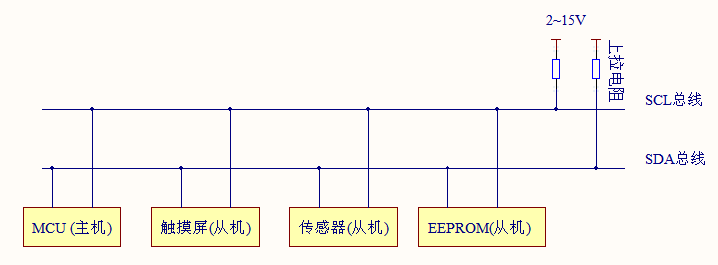
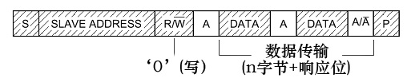
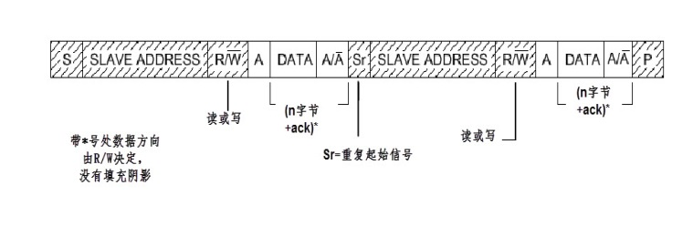
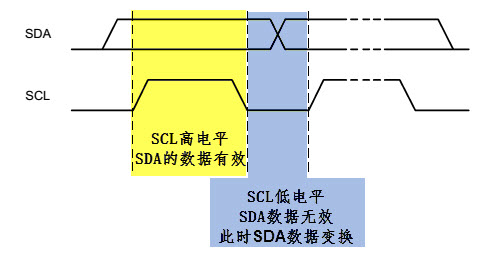
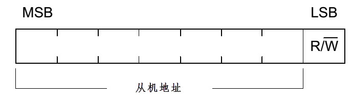
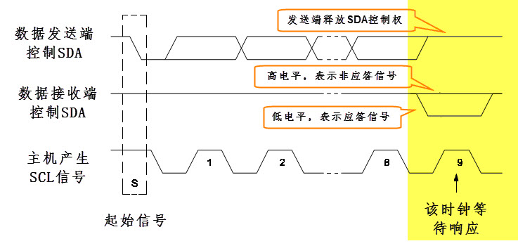
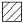

.. vim: syntax=rst

I2C通讯
-----------------

本章通过讲解在应用层中使用I2C总线与外部设备的通讯，讲解Linux系统总线类型设备驱动架构的应用。

在Linux内核文档的Documentation/i2c目录下有关于I2C驱动非常详细的说明。

本章节的示例代码目录为：base_code/section2/i2c

I2C通讯协议简介
^^^^^^^^^^^^^^^^^^^^^

I2C 通讯协议(Inter－Integrated Circuit)是由Phiilps公司开发的，
由于它引脚少，硬件实现简单，可扩展性强，不需要USART、CAN等通讯协议的外部收发设备，
被广泛地使用在多个集成电路(IC)间的通讯。

下面我们分别对I2C协议的物理层及协议层进行讲解。

I2C物理层
~~~~~~~~~~~~~~~~~~~~~~~~

I2C通讯设备之间的常用连接方式如下图。

它的物理层有如下特点：

- 它是一个支持多设备的总线。“总线”指多个设备共用的信号线。
  在一个I2C通讯总线中，可连接多个I2C通讯设备，支持多个通讯主机及多个通讯从机。
- 一个I2C总线只使用两条总线线路，一条双向串行数据线(SDA) ，一条串行时钟线 (SCL)。
  数据线即用来表示数据，时钟线用于数据收发同步。
- 每个连接到总线的设备都有一个独立的设备地址，主机可以利用这个地址进行不同设备之间的访问。
  其中地址是一个七位或十位的数字。
- 总线通过上拉电阻接到电源。当I2C设备空闲时，会输出高阻态，而当所有设备都空闲，
  都输出高阻态时，由上拉电阻把总线拉成高电平。
- 多个主机同时使用总线时，为了防止数据冲突，会利用仲裁方式决定由哪个设备占用总线。
- 具有三种传输模式：标准模式传输速率为100kbit/s ，快速模式为400kbit/s ，
  高速模式下可达 3.4Mbit/s，但目前大多I2C设备尚不支持高速模式。
- 连接到相同总线的 IC 数量受到总线的最大电容 400pF 限制 。

协议层
~~~~~~~~~~~~~~~~~~~~~

I2C的协议定义了通讯的起始和停止信号、数据有效性、响应、仲裁、时钟同步和地址广播等环节。

I2C基本读写过程
"""""""""""""""""""

先看看I2C通讯过程的基本结构，它的通讯过程常有如下三种方式。

.. image:: media/i2c/i2cbus004.jpg
   :align: center
   :alt: 主机由从机中读数据

图例：

- |i2cbus006| ：数据由主机传输至从机

- S ： 传输开始信号

- SLAVE_ADDRESS: 从机地址

- |i2cbus007| ：数据由从机传输至主机

- R ： 传输方向选择位，1为读，0为写

- A ： 应答(ACK)或非应答(NACK)信号

- P ： 停止传输信号

这些图表示的是主机和从机通讯时，SDA线的数据包序列。

1. 其中S表示由主机的I2C接口产生的传输起始信号(S)，这时连接到I2C总线上的所有从机都会接收到这个信号。

#. 起始信号产生后，所有从机就开始等待主机紧接下来广播 的从机地址信号 (SLAVE_ADDRESS)。
   在I2C总线上，每个设备的地址都是唯一的，当主机广播的地址与某个设备地址相同时，这个设备就被选中了，没被选中的设备将会忽略之后的数据信号。
   根据I2C协议，这个从机地址可以是7位或10位。

#. 在地址位之后，是传输方向的选择位，该位为0，表示后面的数据传输方向是由主机传输至从机，即主机向从机写数据。该位为1，则相反，即主机由从机读数据。

#. 从机接收到匹配的地址后，主机或从机会返回一个应答(ACK)或非应答(NACK)信号，只有接收到应答信号后，主机才能继续发送或接收数据。

写数据方向:
  若配置的方向传输位为 **“写数据”** 方向，即第一幅图的情况，广播完地址，接收到应答信号后，
  主机开始正式向从机 **传输数据(DATA)** ，数据包的大小为8位，主机每发送完一个字节数据，
  都要等待从机的应答信号(ACK)，重复这个过程，可以向从机传输N个数据，这个N没有大小限制。
  当数据传输结束时，主机向从机发送一个停止传输信号(P)，表示不再传输数据。

读数据方向:
  若配置的方向传输位为 **“读数据”** 方向，即第二幅图的情况，广播完地址，接收到应答信号后，
  从机开始向主机 **返回数据(DATA)** ，数据包大小也为8位，从机每发送完一个数据，
  都会等待主机的应答信号(ACK)，重复这个过程，可以返回N个数据，这个N也没有大小限制。
  当主机希望停止接收数据时，就向从机返回一个非应答信号(NACK)，则从机自动停止数据传输。

复合格式:
  除了基本的读写，I2C通讯更常用的是 **复合格式** ，即第三幅图的情况，该传输过程有 **两次起始信号(S)** 。
  一般在第一次传输中，主机通过SLAVE_ADDRESS寻找到从设备后，发送一段“数据”，
  这段数据通常用于表示从设备内部的寄存器或存储器地址(注意区分它与SLAVE_ADDRESS的区别)；
  在第二次的传输中，对该地址的内容进行读或写。也就是说，第一次通讯是告诉从机读写地址，第二次则是读写的实际内容。

以上通讯流程中包含的起始、停止、数据有效性、地址和数据方向以及响应的说明按小节如下。

通讯的起始和停止信号
"""""""""""""""""""""""""""

前文中提到的起始(S)和停止(P)信号是两种特殊的状态，起始和停止信号一般由主机产生。如下图。

- 当 SCL 线是高电平时 SDA 线从高电平向低电平切换，这个情况表示通讯的起始。
- 当 SCL 是高电平时 SDA 线由低电平向高电平切换，表示通讯的停止。

.. image:: media/i2c/i2cbus008.jpg
   :align: center
   :alt: 起始和停止信号

数据有效性
"""""""""""""""""""""""""""

I2C使用SDA信号线来传输数据，使用SCL信号线进行数据同步，如下图。
SDA数据线在SCL的每个时钟周期传输一位数据。

- 传输时，SCL为高电平的时候SDA表示的数据有效，即此时的SDA为高电平时表示数据“1”，为低电平时表示数据“0”。
- 当SCL为低电平时，SDA的数据无效，一般在这个时候SDA进行电平切换，为下一次表示数据做好准备。

每次数据传输都以字节为单位，每次传输的字节数不受限制。

地址及数据方向
""""""""""""""""""""""""

I2C总线上的每个设备都有自己的独立地址，主机发起通讯时，通过SDA信号线发送设备地址(SLAVE_ADDRESS)来查找从机。
I2C协议规定设备地址可以是7位或10位，实际中7位的地址应用比较广泛。

紧跟设备地址的一个数据位用来表示数据传输方向，它是数据方向位(R/)，第8位或第11位。
数据方向位为“1”时表示主机由从机读数据，该位为“0”时表示主机向从机写数据，如下图。

- 读数据方向时，主机会释放对SDA信号线的控制，由从机控制SDA信号线，主机接收信号。
- 写数据方向时，SDA由主机控制，从机接收信号。

响应
""""""""""""""""""""

I2C的数据和地址传输都带响应。响应包括“应答(ACK)”和“非应答(NACK)”两种信号。
作为数据接收端时，当设备(无论主从机)接收到I2C传输的一个字节数据或地址后：

- 若希望对方 **继续发送数据** ，则需要向对方发送 **“应答(ACK)”** 信号，发送方会继续发送下一个数据；
- 若接收端希望 **结束数据传输** ，则向对方发送 **“非应答(NACK)”** 信号，发送方接收到该信号后会产生一个停止信号，结束信号传输。如下图。

传输时主机产生时钟，在第9个时钟时，数据发送端会释放SDA的控制权，由数据接收端控制SDA，若SDA为高电平，表示非应答信号(NACK)，低电平表示应答信号(ACK)。

Linux的I2C及总线设备
^^^^^^^^^^^^^^^^^^^^^^^^^
由于一个I2C总线上可以挂载多个设备，

/sys/bus/i2c

::

    #以下命令在开发板上的终端上运行
    #查看系统存在的I2C总线
    ls  /sys/bus/i2c/devices

    #根据具体的输出查看存在的I2C设备和总线

    #查看I2C总线的属性
    ls /sys/bus/i2c/devices/i2c-0
    #查看I2C总线的名字
    cat /sys/bus/i2c/devices/i2c-0/name

    #查看I2C设备的属性
    ls /sys/bus/i2c/deivces/0-005d
    #查看I2C设备的名字
    cat /sys/bus/i2c/devices/0-005d/name

在用户态添加一个I2C设备

::

  #未测试，参数为设备名及设备地址
  echo eeprom 0x50 > /sys/bus/i2c/devices/i2c-3/new_device

在用户态删除一个I2C设备

::

  #未测试,参数为要删除设备的设备地址
  echo 0x50  > /sys/bus/i2c/devices/i2c-3/delete_device

/dev/i2c-0

i2c-detect工具
^^^^^^^^^^^^^^^^^^^^^
使用i2c-tools工具包提供了一些非常方便的工具来对系统的I2C总线进行调试。

可以通过如下指令安装
::

  #以下命令在主机上运行
  sudo apt install i2c-tools

安装后可使用的命令有i2cdetect、i2cdump、i2cset以及i2cget,
它们分别用于扫描I2C总线上的设备、读写指定设备的寄存器内容

+ i2cdetect ：用于扫描I2C总线上的设备。它会打印一个表，其中包含了总线上检测到的设备。

相关命令语法：

       i2cdetect [-y] [-a] [-q|-r] i2cbus [first last]：
       参数说明：

- 参数y：关闭交互模式，使用该参数时，不会提示警告信息。
- 参数a：扫描总线上的所有设备。
- 参数q：使用SMBus的“quick write”命令进行检测，不建议使用该参数。
- 参数r：使用SMBus的“receive byte”命令进行检测，不建议使用该参数。
- 参数i2cbus：指定i2c总线的编号
- 参数first、last：扫描的地址范围

       返回值说明：
 - '--'：表示该地址被检测，但没有芯片应答；
 - 'UU'：表示该地址当前由内核驱动程序使用。
 - '**'：**表示以十六进制表示的设备地址编号，如 “2d”或“4e”。

 - i2cdetect -F i2cbus：查询i2c总线的功能，参数i2cbus表示i2c总 - 
 - i2cdetect -V：打印软件的 - 
 - i2cdetect -l：检测当前系统有几组i2c总线
~~~

+ i2cget 
~~~
    相关命令语法：
        i2cget [-f] [-y] i2cbus chip-address [data-address [mode]]
        参数说明：
 - 参数f：强制访问设备。
 - 参数y：关闭交互模式，使用该参数时，不会提示警告信息。
 - 参数i2cbus：指定i2c总线的编号
 - 参数chip-address：i2c设备地址
 - 参数data-address：设备的寄存器的地址
 - 参数mode：参考i2cdump命令。
~~~

+ i2cset 
~~~~~~~~~~~~~~~
    相关命令语法：
       i2cset  [-f]  [-y]  [-m  mask]  [-r]  i2cbus  chip-address data-address [value] ...  [mode]
       参数说明：
 - 参数f：强制访问设备。
 - 参数y：关闭交互模式，使用该参数时，不会提示警告信息。
 - 参数m：
 - 参数r：写入后立即回读寄存器值，并将结果与写入的值进行比较。
 - 参数i2cbus：指定i2c总线的编号
 - 参数chip-address：i2c设备地址
 - 参数data-address：设备的寄存器的地址
 - 参数value：要写入寄存器的值
 - 参数mode：参考i2cdump命令。
~~~

+ i2cdump：读取I2C总线上某个设备的寄存器值。
~~~
    相关命令语法：
       i2cdump   [-f]   [-r first-last]  [-y]  i2cbus  address  [mode [bank [bankreg]]]
 - 参数r：指定寄存器范围，只扫描从first到last区域；
 - 参数f：强制访问设备。
 - 参数y：关闭人机交互模式；
 - 参数i2cbus：指定i2c总线的编号
 - 参数address：指定设备的地址
 - 参数mode：指定读取的大小， 可以是b, w, s或i，分别对应了字节，字，SMBus块, I2C块
 
       i2cdump -V：打印软件的版本号
~~~

## MPU6050实验

i2cset -f -y -r 0 0x68 0x6B 0

i2cset -f -y -r 0 0x68 0x19 7

i2cset -f -y -r 0 0x68 0x1A 6

i2cset -f -y -r 0 0x68 0x1C 1

i2cdump -f -y -r 0x3B-0x48 0 0x68

读取陀螺仪的ID

::

  i2cget 0 0x68  0x75

其中0x68是陀螺仪设备的7位I2C地址，0x75是陀螺仪的WHO_AM_I寄存器，

数据地址支持的范围为0x00~0xFF,所以对于触摸屏使用16位表示寄存器地址的设备不适用。

读取陀螺仪传感器数据实验
^^^^^^^^^^^^^^^^^^^^^

实验说明
**********************************

本教程将通过IIC接口读取板载陀螺仪(MPU6050)的原始数据(MINI开发板没有板载陀螺仪，想要完成本实验需要参照Pro开发板外接MPU6050传感器)。
在测试程序中大约每一秒读取并显示一次MPU6050的原始数据。读取得到的原始数据并没有进行处理，所以不要误以为读取得到的是角度值。

开始实验之前首先确定IIC 驱动已经存在并且已经加载，在开发板的控制端口输入如下命令：

.. code-block:: c
   :caption: 查看IIC 总线设备
   :linenos:  

   ls  /sys/bus/i2c/devices

不同系统输出的内容不同，如果使用的我们的系统并且没有修改IIC驱动，输出内容如下：

.. code-block:: c
   :caption: 查看IIC 总线设备
   :linenos:  

   root@npi:/home/nfs_share# ls  /sys/bus/i2c/devices
   0-0068  i2c-0

其中 “i2c-0” 就是MPU6050使用的 IIC 总线设备。

陀螺仪传感器数据读取程序源码分析
**************************************

与 uart_tty 类似，主要使用了  open()、write()、read()、close()、ioctl() 接口API函数

   ls  /sys/bus/i2c/devices

   root@npi:/home/nfs_share# ls  /sys/bus/i2c/devices
    

控制OLED显示
^^^^^^^^^^^^^^^^^^^^^

.. |i2cbus004| image:: media/i2c/i2cbus004.jpg
   :width: 5.26042in
   :height: 1.20833in

.. |i2cbus008| image:: media/i2c/i2cbus008.jpg
   :width: 5.54668in
   :height: 1.54478in

