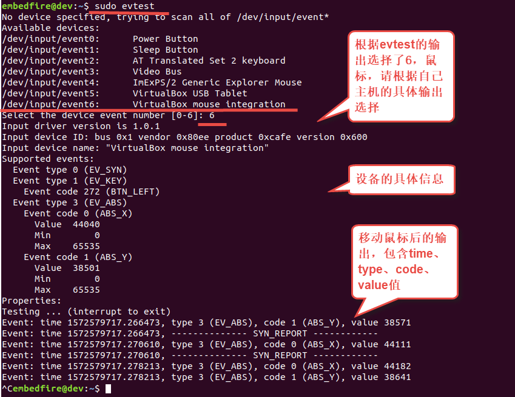
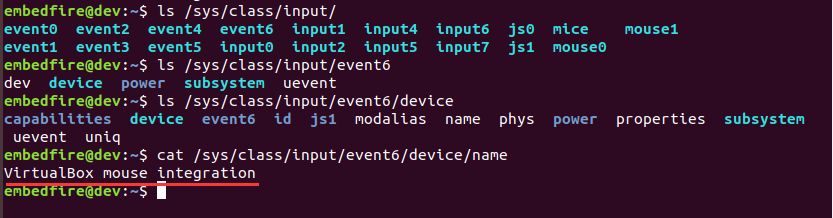
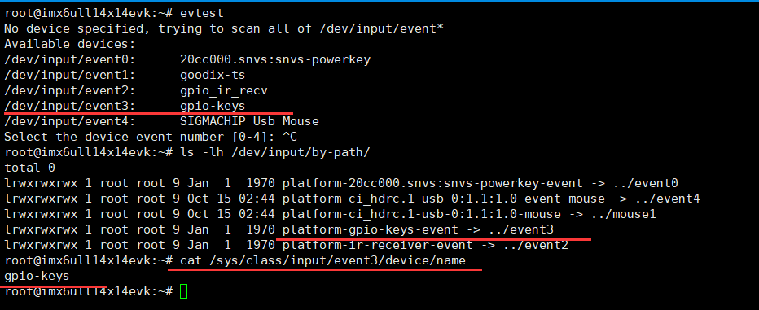
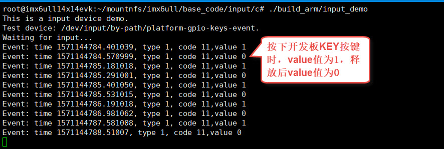

.. vim: syntax=rst

检测按键输入（input子系统）
------------------------------------------------

本章讲解Linux input输入子系统驱动相关应用层程序的控制原理。

本章的示例代码目录为：base_code/linux_app/input。

input子系统
~~~~~~~~~~~~~~~~~~~~~~~~

input子系统是Linux对输入设备提供的统一驱动框架。如按键、键盘、触摸屏和鼠标等输入设备的驱动方式是类似的，当出现按键、触摸等操作时，硬件产生中断，然后CPU直接读取引脚电平，或通过SPI、I2C等通讯方式从设备的寄存器读取具体的按键值或触摸坐标，然后把这些信息提交给内核。使用input子系统
驱动的输入设备可以通过统一的数据结构提交给内核，该数据结构包括输入的时间、类型、代号以及具体的键值或坐标，而内则通过/dev/input目录下的文件接口传递给用户空间。

在Linux内核源码的"Documentation/input"目录包含了input子系统相关的说明。

本开发板默认的出厂镜像中，按键、触摸屏、鼠标、键盘都使用了input子系统驱动，本章使用按键进行讲解。

input事件目录
~~~~~~~~~~~~~~~~~~~~~~~~~~~

使用evtest工具测试
^^^^^^^^^^^^^^^^^^^^^^^^^^^^^^^^^^^^

在开发input子系统驱动时，常常会使用evtest工具进行测试，此处我们通过该工具来了解Ubuntu主机或开发板上的输入设备。

在Ubuntu主机下使用如下命令测试：

.. code-block:: sh
   :linenos:

   #在主机下执行如下命令
   #安装evtest工具
   sudo apt install evtest -y
   #使用sudo权限运行evtest工具
   sudo evtest
   #根据自己主机的输出来选择某个设备测试，下图选择的是"6"，鼠标
   #根据选择的设备测试，如选择的键盘就按键盘，选择鼠标就移植鼠标

如下图:

上图的执行过程说明如下：

-  运行evtest工具，它列出了系统当前可用的/dev/input/event0~6输入事件
   文件，并且列出了这些事件对应的设备名。

-  我们根据设备名的"VirtualBox mouse intergration"推猜它就是接入到电脑
   的鼠标，所以输入了它对应的event6事件编号6，实验时请根据自己电脑的输出来选择。

-  输入编号后它列出了event6的一些设备信息，包括驱动版本、设备ID、设备
   名、支持的事件类型、事件代号以及输入值的取值范围。

-  此时移动鼠标，可以看到它输出了详细的事件信息，如果移动后没有输出，说明
   你选择的不是鼠标设备，请退出重新选择。输出信息中每一行包含了鼠标上报事件的具
   体时间time、事件类型type 3（EV_ABS）、事件代号code
   1或code0（ABS_Y或ABS_X）和具体的值value，该值就是鼠标X/Y的坐标。

input事件结构
^^^^^^^^^^^^^^^^^^^^^^^^^^^

evtest工具的原理并不神秘，学习本章节后也可以尝试自己
使用代码实现它的部分功能。列出可用事件时，它就是通过查
看目录"/dev/input/"实现的。本示例中主机的"/dev/input"目录的内
容如下图所示。

.. image:: media/inputs003.png
   :align: center
   :alt: 未找到图片03|

可看到"/dev/input"目录下，有event*、js*、mouse*及mice文件，它们分别是
驱动层evdev（通用输入事件）、joydev（游戏杆）及遗留的mousedev（鼠标）设备暴露
到用户空间的访问接口文件，读取这些文件的内容可获取到设备上报的信息。

在前面LED、GPIO子系统中，brightness、direction等设备文件直接使用字符串来记
录具体的信息，所以使用cat命令输出文件的内容时，字符串的形式非常方便我们阅读。但是event文件包
含的信息较多，使用字符串不方便其它程序处理，它采用了纯粹的内核事件数据结构来记录内容，其它
程序使用时
应把读取到的内容按数据的结构进行格式化转换，该数据结构定义如下所示。

.. code-block:: c
   :caption: input_event结构体（内核源码的/include/uapi/linux/input.h文件）
   :linenos:

   struct input_event {
   struct timeval time;
   \__u16 type;
   \__u16 code;
   \__s32 value;
   };

-  time：该变量用于记录事件产生的时间戳，既evtest输出的time值。

-  type：输入设备的事件类型。系统常用的默认类型有EV_KEY、 EV_REL和EV_ABS，分别用
   于表示按键状态改变事件、相对坐标改变事件及绝对坐标改变事件，特别地，EV_SYN用于分隔事件，无特别意义。如果选择鼠标（本章第一个图）
   evtest输出的type类型为EV_ABS。相关的枚举值可以参考内核文件include/uapi/linux/input-event-codes.h。

-  code：事件代号，它以更精确的方式表示事件。例如
   在EV_KEY事件类型中，code的值常用于表
   示键盘上具体的按键，其取值范围在0~127之间，例如按键Q对应的是KEY_Q，该枚举变量的
   值为16。如果选择鼠标， evtest输出内容的code分别有ABS_X/ABS_Y，表示上报的是X或Y坐标。

-  value：事件的值。对于EV_KEY事件类型，当按键按下时，该值为1；按键松开时，该值为0。如果选择
   鼠标，中evtest输出的内容里，ABS_X事件类型中的value值表示X坐标，ABS_Y类型中的value值表示Y坐标。

如果同样使用cat命令查看事件文件，当事件出现时，cat把内容转化成字
符串，会看到乱码，使用这样的方式可以简单地查看设备是否上报了事件。

可使用以下方式可进行测试：

.. code-block:: sh
   :linenos:

   #根据自己主机上的事件号修改要查看的具体事件文件
   #此处使用的event6是本主机的鼠标设备，注意要使用sudo权限
   sudo cat /dev/input/event6
   #输入命令后移动鼠标，会看到字符

如下图；

.. image:: media/inputs004.jpg
   :align: center
   :alt: 未找到图片04|

与其它文件不同，通常cat命令读取文件内容后就会返回，而此处读取event文件时，命
令会持续地等待输入。

input事件设备名
^^^^^^^^^^^^^^^^^^^^^^^^^^^^^^

"/dev/input/event*"的事件编号与设备的联系不是固定的，它通常按系统检测
到设备的先号顺序安排event文件的编号，这对编写应用程序控制不太方便，我们
可以通过"/dev/input/by-id"或"/dev/input/by-path"目录查看具体的硬件设备，如
下图所示。

.. image:: media/inputs005.png
   :align: center
   :alt: 未找到图片05|

图中列出了by-path目录下的内容，该目录下的文件实际上都是链接，如第
一行的"pci-0000:00:04.0-event-mouse -> ../event6"表示"pci-0000:00:04.0-event-
mouse"文件就是event6的快捷方式，它就是本主机中使用的鼠标，也就是说访问该
文件就是访问该鼠标的事件设备，而且该文件名与硬件的关系是固定的，后面我们的实验就是采用这样的方式。

由于/dev下的设备都是通过/sys导出的，所以也可以通过"/sys/class/input"目
录查看，如下图所示。

"/sys/class/input"下包含了各个以事件命名的目录，其对应目录
下的device/name文件包含了事件对应的设备名，如本示例中
的"/sys/class/input/event6/device/name"文件的内容为"VirtualBox mouse
integration"，evtest工具列出的事件与设备名的关系，就是从这里读取的。

开发板按键检测实验
~~~~~~~~~~~~~~~~~~

开发板执行以下命令，安装evtest工具:

.. code-block:: sh
   :linenos:

   sudo apt install evtest -y

下面以简单的操作对开发板上的设备进行说明：

.. code-block:: sh
   :linenos:

   #在开发板的终端执行如下命令：
   #查看存在的输入设备，截图中是板子接了鼠标的情况
   evtest
   #查看按键在by-path目录下的文件
   ls -lh /dev/input/by-path
   #查看按键在/sys文件系统中的名字,以下命令中的"event0"根据自己的实验环境修改
   cat /sys/class/input/event0/device/name

如下图：

此处主要针对开发板上的按键设备进行说明，在上图中，event0和event1分别对应
了开发板的"KEY"按键和USB鼠标按键，注意如果开发板上设备树使用了其他按键，按键使用的event*编号可能会发生变化，
所以我们查看了"by-path"目录下的链接文件，
这两个按键的文件链接名分别为"platform-gpio-keys-event"和"platform-ci_hdrc.1-usb-0:1.1:1.0-event-mouse".
下面我们使用这两个文件名编写按键检测的应用程序。

实验代码分析
^^^^^^^^^^^^^^^^^^^^^^^^

在输入事件检测的应用中，通常使用主线程直接
循环读取"/dev/input/event*"设备文件获取事件的数据结构，然后通过消
息队列通知其它子线程，从而响应输入操作。

本实验的代码目录为：base_code/linux_app/input/c。

本实验仅使用了一个main.c文件，如下所示。

.. code-block:: c
   :caption:  输入设备检测（base_code/linux_app/input/c/main.c文件）
   :linenos:

   #include <stdio.h>
   #include <unistd.h>
   #include <stdlib.h>
   #include <sys/types.h>
   #include <sys/stat.h>
   #include <fcntl.h>
   #include <linux/input.h>
   #include <linux/input-event-codes.h>
   

   //开发板上的KEY按键，请根据实际情况修改 
   const char default_path[] = "/dev/input/by-path/platform-gpio-keys-event";

   //开发板上的ON_OFF按键，请根据实际情况修改
   //const char default_path[] = "/dev/input/by-path/platform-ci_hdrc.1-usb-0:1.1:1.0-event-mouse";

   int main(int argc, char *argv[])
   {
      int fd;
      struct input_event event;
      char *path;
      
      printf("This is a input device demo.\n");

      //若无输入参数则使用默认事件设备
      if(argc > 1)
         path = argv[1];
      else
         path = (char *)default_path;

      fd = open(path, O_RDONLY);
      if(fd < 0){
         printf("Fail to open device:%s.\n"
               "Please confirm the path or you have permission to do this.\n", path);
         exit(1);
      }	
      
      printf("Test device: %s.\nWaiting for input...\n", path);
      
      while(1){
         if(read(fd, &event, sizeof(event)) == sizeof(event)){
            
            //EV_SYN是事件分隔标志，不打印
            if(event.type != EV_SYN)
               printf("Event: time %ld.%ld, type %d, code %d,value %d\n",			
                     event.time.tv_sec,event.time.tv_usec,
                     event.type,
                     event.code,
                     event.value);
         }
      }
      close(fd);

      return 0;
   }

本代码的说明如下：

-  第12行：定义默认设备路径，此处使用的是开发板KEY按键
   在"/dev/input/by-path"下的链接文件名，此处不使用"/dev/input/event*"只是
   为了让程序不受其它输入设备而影响了事件编号。

-  第25~29行：检查main函数的输入参数，若程序执行时带输入参数，把第1个输入
   参数作为要打开的事件设备文件路径，若程序不带参数，则使用上面的默认设备KEY按键的事件设备文件。

-  第31~36行：使用O_RDONLY模式打开事件设备文件，O_RDONLY模式默认是阻塞
   型的，而且事件设备文件支持阻塞操作，也就是说，若后面使用read函数读取时，它会
   等待事件上报，一直等待至读取成功或失败才会返回。

-  第41行：在while循环里通过read系统调用读取事件文件，读取到的内容存储在 "struct input_event"类型
   的event变量中，"struct input_event"类型就是前面介绍的内核事件数据结构。
   若成功读取，我们就可以通过该变量的结构体成员访问到事件的时间戳、类型、代号和值。

-  第45~49行：输出读取到的event变量的各个成员值，在上报
   的事件中，通常会有很多类型为EV_SYN的事件，这种事件是用于分隔的，无特别
   意义，所以代码中不输出这类型事件的内容。

值得思考的是，若没有上报事件，第42行的read读取事件设备文件操作会被阻塞，简单来说就是即使第52行的printf代码不注释掉，它也不会在持续地在循环里输出，而只有当出现了事件，触发read退出，后面的printf函数才有机会被执行一次，然后重新read事件再次阻塞。在这种阻塞的过程中，进程会休眠
，释放它对CPU的占用。

假如我们使用的是GPIO子系统框架来编写按键驱动程序，在应用层的操作中，需要使用"/sys/class/gpio/gpio*/direction"文件配置为输入方向，然后使用循环读取"/sys/class/gpio/gpio*/value"文件的值来获得按键的状态，但由于对value文件的read读
取操作不会阻塞，所以进程会不停地读取文件内容来判断按键值，占用CPU宝贵的运算资源。

由于read事件文件操作会阻塞，那么采用这种方式就无法同时检测两个输入设备了，这种时候可以通过select或poll等IO多路复用的操作达成目的，这在后续的章节再进行讲解。

编译及测试
^^^^^^^^^^^^^^^

本实验使用的Makefile相对于前面的章节仅修改了最终的可执行文件名为input_demo。

x86架构
''''''''''''''''''''

本实验的main.c实验代码使用的事件设备文件默认是开发板上的KEY按键，在Ubuntu主机上
并没有这样的设备，如果想尝试在主机上使用，可以根据自己Ubuntu主机上存在的事件作为
程序的输入参数输入运行，在x86平台的编译测试过程如下：

.. code-block:: sh
   :linenos:

   #在主机的实验代码Makefile目录下编译
   #默认编译x86平台的程序
   make
   #运行需要root权限，要使用sudo运行
   #使用evtest查看可用的设备文件
   sudo evtest
   #请根据自己主机上的输出修改设备文件参数
   #程序需要使用sudo运行
   sudo ./build_x86/input_demo /dev/input/event6
   #使用对应的设备输入，终端会打印出事件的信息

如下图:

.. image:: media/inputs008.jpg
   :align: center
   :alt: 未找到图片08|

ARM架构
'''''''''''''''

对于ARM架构的程序，可使用如下步骤进行编译：

.. code-block:: sh
   :linenos:

   #在主机的实验代码Makefile目录下编译
   #编译arm平台的程序
   make ARCH=arm

编译后生成的ARM平台程序为build_arm/input_demo，使用网络文
件系统共享至开发板，程序默认使用KEY按键检测，也可以自行指定输入设备路径。

.. code-block:: sh
   :linenos:

   #以下命令在开发板上的终端执行
   #在NFS共享的工程目录路径执行
   #使用默认的KEY按键运行
   #运行需要root权限，要使用sudo运行
   sudo ./build_arm/input_demo
   #按下开发板的KEY按键会有输出
   #也可以指定要测试的事件文件路径
   sudo ./build_arm/input_demp [事件文件路径]

如下图:

使用默认的KEY事件路径，程序执行后，按下开发板的KEY键时，终端输出
的事件值value为1，释放按键时，输出的事件值value为0。

.. |inputs003| image:: media/inputs003.png
   :width: 5.76806in
   :height: 0.6696in
.. |inputs004| image:: media/inputs004.jpg
   :width: 5.33333in
   :height: 1.58279in
.. |inputs005| image:: media/inputs005.png
   :width: 5.76806in
   :height: 1.24641in

.. |inputs008| image:: media/inputs008.jpg
   :width: 5.76773in
   :height: 3.19847in

