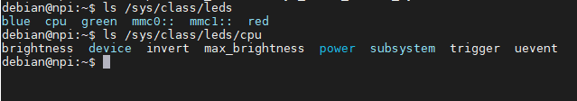
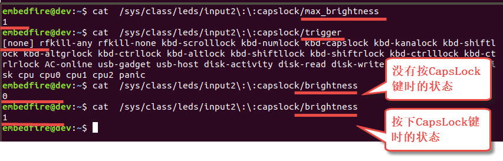
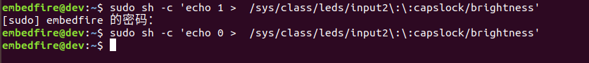
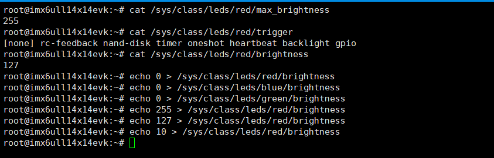
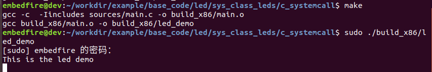
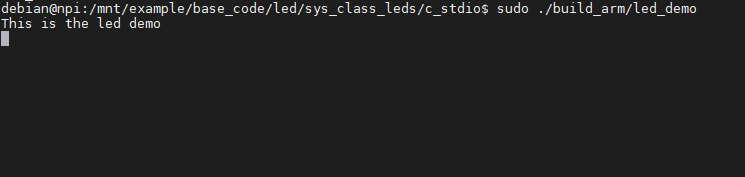
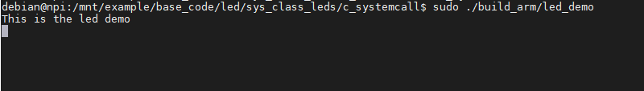

.. vim: syntax=rst

控制LED灯设备（LED子系统）
------------------------------------------------

本章分别使用C库和系统调用的文件操作方式控制开发板的LED灯，展示如何在应用层通过系统提供的设备文件控制相关硬件。

本章的示例代码目录为：base_code/section2/led/sys_class_leds。

LED子系统
~~~~~~~~~~~~

在Linux系统中，绝大多数硬件设备都有非常成熟的驱动框架，驱动工程师使用这些框架添加与板子相关的硬件支持，建立硬件与Linux内核的联系，内核再通过统一文件系统接口呈现给用户，用户通过对应的设备文件控制硬件。

对于LED设备，Linux提供了LED子系统驱动框架，在Linux内核源码中的“Documentation/leds/leds-class.txt”有相关的描述，它实现了一个leds类，用户层通过sysfs文件系统对LED进行控制。

LED设备目录
^^^^^^^^^^^^^^

使用了LED子系统驱动的设备，会被展现在/sys/class/leds目录下，可在主机和开发板使用如下命令查看，命令的输出可能会因为硬件环境不同而不一样：

#在主机或ARM板的终端上执行如下命令：

.. code-block:: sh
   :linenos:

   ls /sys/class/leds/

#根据具体的目录内容继续查看：

#在主机上有input2::capslock目录，可在主机执行如下命令查看

.. code-block:: sh
   :linenos:

   ls /sys/class/leds/input2::capslock

#在开发板上有cpu目录，可在开发板上执行如下命令查看

.. code-block:: sh
   :linenos:

   ls /sys/class/leds/cpu

.. image:: media/ledsub002.png
   :align: center
   :alt: 未找到图片02|

上图可看到，示例中的Ubuntu主机和开发板/sys/class/leds下包含了以LED设备名
字命名的目录，如“input2::capslock”、“input2::numlock”和“blue”、“cpu”等LED灯，这
些目录对应的具体LED灯如下表所示。

表  /sys/class/leds下目录对应的设备

======================= =================================================
/sys/class/leds下的目录 对应的LED灯设备
======================= =================================================
input2::capslock        键盘大写锁定指示灯（input后的数字编号可能不同）
input2::numlock         键盘数字键盘指示灯（input后的数字编号可能不同）
input2::scrolllock      键盘ScrollLock指示灯（input后的数字编号可能不同）
\
cpu                     开发板的心跳灯
red                     Pro开发板RGB灯的红色，Mini开发板的用户灯
green                   Pro开发板RGB灯的绿色，Mini开发板的用户灯
blue                    Pro开发板RGB灯的蓝色，Mini开发板的用户灯
mmc0::                  SD卡指示灯（出厂镜像默认没有启用）
======================= =================================================

LED设备属性
^^^^^^^^^^^^^^^^^^^^^

上图中，在具体的LED目录下又包含brightness、max_brightness、trigger等文件，这些文件包含了LED设备的属性和控制接口。

-  max_brightness文件：表示LED灯的最大亮度值。

-  brightness文件：表示当前LED灯的亮度值，它的可取
   值范围为[0~max_brightness]，一些LED设备不支持多级亮度，直接以非0值来
   表示LED为点亮状态，0值表示灭状态。

-  trigger文件：则指示了LED灯的触发方式，查看该文件的内容时，该文件会
   列出它的所有可用触方式，而当前使用的触发方式会以“[]”符号括起。常见的触
   发方式如下表所示。

表 trigger常见的触发方式

============= ==============
触发方式      说明
============= ==============
none          无触发方式
disk-activity 硬盘活动
nand-disk     nand flash活动
mtd           mtd设备活动
timer         定时器
heartbeat     系统心跳
============= ==============

控制LED实验（Shell）
~~~~~~~~~~~~~~~~~~~~~~~~~~~~~~~~~~~~~~~~~~

下面通过命令行控制LED来讲解LED设备属性文件的应用。

首先以主机Ubuntu上的“input2::capslock”大写锁定指示灯的文件
状态为例，按以下流程进行操作：

.. code-block:: sh
   :linenos:

   #以下命令在主机上执行
   #请把“input2::capslock”替换为自己主机上的大写锁定指示灯的设备名字
   #查看max_brightness文件内容
   cat /sys/class/leds/input2\:\:capslock/max_brightness
   #查看trigger文件内容
   cat /sys/class/leds/input2\:\:capslock/trigger
   #查看brightness文件内容
   cat /sys/class/leds/input2\:\:capslock/brightness
   #按下键盘的CapsLock大写锁定键（Shift键的上面），再次查看brightness文件的内容
   cat /sys/class/leds/input2\:\:capslock/brightness

实验结果如上图，该指示灯的max_brightness文件表示它的最大亮度值
为1，trigger文件中的“[]”括起了“none”，表示当前无触发方式，接着查
看brightness文件的内容，第一次查看时为“0”，然后按一下大写锁定键“CapsLock”后，键盘
该指示灯亮起，再次查看brig
htness文件的内容，可发现它的内容已变为“1”，也就是说它与键盘上大写锁定指
示灯的状态是一致的。 “NumLock”或“ScrollLock”指示灯也是类似的。

特别地，brightness和trigger文件都是可写的，当trigger文件的内容为none时，直接修
改brightness的内容即可控制LED设备的亮度。

在主机上执行以下命令：

.. code-block:: sh
   :linenos:

   #在主机执行以下命令：
   #请把“input2::capslock”替换为自己主机上的大写锁定指示灯的设备名字
   #点亮大写锁定指示灯
   sudo sh -c 'echo 1 > /sys/class/leds/input2\:\:capslock/brightness'
   #关闭大写锁定指示灯
   sudo sh -c 'echo 0 > /sys/class/leds/input2\:\:capslock/brightness'

由于修改sys目录的文件需要root权限，所以我们执行命令时添加了“sudo sh -c”前缀，要求
它以root权限执行echo命令，而echo命令的具体内容就是往brightness文件写1和写0，执行命令
后观察键盘的CapsLock指示灯，它会呈现出brightness文件对应的状态。

类似地，我们也可以使用同样的方式控制开发板的LED设备：

.. code-block:: sh
   :linenos:

   #以下命令在开发板的终端上执行
   #查看red灯的最大亮度值
   cat /sys/class/leds/red/max_brightness
   #查看red灯的触发方式
   cat /sys/class/leds/red/trigger
   #查看red灯当前的亮度值
   cat /sys/class/leds/red/brightness
   #开发板上LED灯默认可能处于亮的状态，我们先把它们全部关闭再一点亮
   echo 0 > /sys/class/leds/red/brightness #关闭red灯
   echo 0 > /sys/class/leds/blue/brightness #关闭blue灯
   echo 0 > /sys/class/leds/green/brightness #关闭green灯
   echo 255 > /sys/class/leds/red/brightness #设置red灯亮度值255
   echo 127 > /sys/class/leds/red/brightness #设置red灯亮度值127
   echo 10 > /sys/class/leds/red/brightness #设置red灯亮度值10

由于开发板上RGB灯的硬件设计和驱动上支持了PWM功能，这几个LED是可以控制
亮度值的，并且把亮度值分为了256个等级，对brightness文件赋予[0~255]的值可
控制LED灯的亮度，Pro开发板的RGB灯是一体的，可以通过控制三盏灯的亮度值进行混色。

特别地，开发板上的cpu灯默认使用的是“heartbeat”系统心跳的触发方式，所以开发板在
上电后它就一直闪烁，在heartbeat方式下LED的亮度是不受brightness文件控制的，要使用
的话需要把trigger文件的触发方式改为none。

通过如下命令可查看及修改触发方式：

.. code-block:: sh
   :linenos:

   #以下命令在开发板上的终端上执行
   #查看触发方式
   cat /sys/class/leds/cpu/trigger
   #修改触发方式为none
   echo none > /sys/class/leds/cpu/trigger
   #修改触发方式为heartbeat
   echo heartbeat > /sys/class/leds/cpu/trigger

.. image:: media/ledsub007.png
   :align: center
   :alt: 未找到图片07|

控制LED实验（C库函数）
~~~~~~~~~~~~~~~~~~~~~~~~~~

前面演示时使用echo命令修改设备文件，实际上也可以使用gedit、Vim等编辑器进
行修改，修改时注意用户权限即可。既然设备是以文件形式提供的，那么自然也可以使用C库函数
或系统调用的方式读写文件，达到控制设备的目的。

实验代码分析
^^^^^^^^^^^^^^^^^^

本小节的示例代码目录为：led/sys_class_leds/c_stdio。

本小节先演示使用C库函数控制LED，具体如下所示。

.. code-block:: c
   :caption: 通过C库函数控制LED（led/sys_class_leds/c_stdio/sources/main.c文件）
   :linenos:

   #include <stdio.h>
   #include <stdlib.h>
   #include <unistd.h>
   //ARM 开发板LED设备的路径
   #define RLED_DEV_PATH "/sys/class/leds/red/brightness"
   #define GLED_DEV_PATH "/sys/class/leds/green/brightness"
   #define BLED_DEV_PATH "/sys/class/leds/blue/brightness"
    //Ubuntu主机LED设备的路径，具体请根据自己的主机LED设备修改
    // #define RLED_DEV_PATH "/sys/class/leds/input2::capslock/brightness"
    // #define GLED_DEV_PATH "/sys/class/leds/input2::numlock/brightness"
    // #define BLED_DEV_PATH "/sys/class/leds/input2::scrolllock/brightness"
   
   
    int main(int argc, char \*argv[])
    {
   
    FILE \*r_fd, \*g_fd, \*b_fd;
   
    printf("This is the led demo\n");
    //获取红灯的设备文件描述符
    r_fd = fopen(RLED_DEV_PATH, "w");
    if (r_fd < 0) {
    printf("Fail to Open %s device\n", RLED_DEV_PATH);
    exit(1);
    }
   
    //获取绿灯的设备文件描述符
    g_fd = fopen(GLED_DEV_PATH, "w");
    if (g_fd < 0) {
    printf("Fail to Open %s device\n", GLED_DEV_PATH);
    exit(1);
    }
   
    //获取蓝灯的设备文件描述符
    b_fd = fopen(BLED_DEV_PATH, "w");
    if (b_fd < 0) {
    printf("Fail to Open %s device\n", BLED_DEV_PATH);
    exit(1);
    }
   
    while (1) {
    //红灯亮
    fwrite("255",3,1,r_fd);
    fflush(r_fd);
    //延时1s
    sleep(1);
    //红灯灭
    fwrite("0",1,1,r_fd);
    fflush(r_fd);
   
    //绿灯亮
    fwrite("255",3,1,g_fd);
    fflush(g_fd);
    //延时1s
    sleep(1);
    //绿灯灭
    fwrite("0",1,1,g_fd);
    fflush(g_fd);
   
    //蓝灯亮
    fwrite("255",3,1,b_fd);
    fflush(b_fd);
    //延时1s
    sleep(1);
    //蓝灯亮
    fwrite("0",1,1,b_fd);
    fflush(b_fd);
    }
    }

可以发现，这个控制LED灯的过程就是一个普通的文件写入流程：

-  第5~13行：定义了三盏LED灯的brightness文件路径。配套的程序默认使用
   开发板RGB灯的路径，如果要在Ubuntu主机上测试请根据自己主机上的设备文件修改10~13行的内容。

-  第18~41行：使用fopen库函数，以“w”的写模式打开了三盏LED的brightness文件，并获得文件描述符。

-  第43~70行：在循环中分别对三盏灯写入"255"和"0"的字符串来控制LED灯的亮
   度，写入后调用了fflush库函数要求立刻把缓冲区的内容写入到文件上。

本代码有两处值得注意的地方：

如果是普通文件，按代码while循环的执行流程，运行一段时间后，由于多次
写入，文件中的内容应该为“255025502550255”这样的字符串，但对于此
处的brightness设备文件，它的最终内容只是“255”或“0”，而不是像普通
文件那样记录了一连串前面输入的字符。这是因为在LED的设备驱动层中
，brightness文件就相当于一个函数的参数接口，每次对文件执行写入操
作时，会触发驱动代码以这次写入的内容作为参数，修改LED灯的亮度；而每次读
取操作时，则触发驱动代码更新当前LED灯亮度值到brightness文件，所以brightness始终
是一个0~255的亮度值，而不是“25502550
2550255”这样的字符串。特别地，如果在一次写入操作中，直接写入“0255025502550”这样的
字符串，驱动层会把它当成数字255025502550，而该数字大于最大亮度值，所以它最终会以255的
亮度控制LED灯，若此时读取brightness文件，也会发现它的值确实是255。关于这些细节，
在学习了LED子系统框架后查看驱动源码可更好地了解。

另一处要注意的是代码中调用fwrite函数写入内容时，它可能只是把内容保存
到了C库的缓冲区，并没有执行真正的系统调用write函数把内容写入到设备文件，这种情况下LED灯
的状态是不会被改变的，代码中在fwrite函数后调用了fflush要求立刻把缓冲区的内容写入到文件，确保
执行了相应的操作。在实验时
可以尝试把代码中的fflush都注释掉，这种情况下有极大的几率是无法正常改变LED灯状态的。

如果不考虑操作的时间开销，其实控制硬件更推荐的做法是，每次控制LED灯都使用fopen—fwrite—fclose的
流程，这样就不需要考虑flseek、fflush的问题了。当然，我们最推崇的还是下一小节直接通过
系统调用来控制硬件的方式。

编译及测试
^^^^^^^^^^^^^^^

本实验使用的Makefile由上一章节修改而来，修改了最终的可执行文件名为led_demo，以及C源
文件目录改为了main.c文件所在的sources，其它方面没有差异。

x86架构
'''''''''''''''

本工程的main.c实验代码使用的设备文件默认是开发板
上的RGB灯，在Ubuntu主机上并没有
这样的设备，如果想尝试在主机上使用，可以根据自己Ubuntu主机上存
在的LED设备修改代码中的LED路径，然后使用make直接编译测试。

.. code-block:: sh
   :linenos:

   #在主机测试请先修改main.c代码中的LED灯路径
   #在主机测试请先修改main.c代码中的LED灯路径
   #在主机的实验代码Makefile目录下编译
   #默认编译x86平台的程序
   make
   #运行需要root权限，要使用sudo运行
   #运行需要root权限，要使用sudo运行
   sudo ./build_x86/led_demo
   #程序运行后终端会输出提示，相应的LED灯设备状态会改变

ARM架构
'''''''''''''''

对于ARM架构的程序，可使用如下步骤进行编译：

.. code-block:: sh
   :linenos:

   #在主机的实验代码Makefile目录下编译
   #编译arm平台的程序
   make ARCH=arm

编译后生成的ARM平台程序为build_arm/led_demo，使用网络文件系统共享至开
发板，在开发板的终端上测试即可。

程序执行后终端会有输出，开发板上的三盏用户LED灯也会轮流闪烁。

控制LED实验（系统调用）
~~~~~~~~~~~~~~~~~~~~~~~~~~~~~~~~~~~~~~~

由于使用C库的文件操作函数存在缓冲机制，使用它来控制硬件时存在不
确定性，所以我们更喜欢直接以系统调用来控制硬件设备。

.. _实验代码分析-1:

实验代码分析
^^^^^^^^^^^^^^^^^^

本小节的示例代码目录为：led/sys_class_leds/c_systemcall。

本小节通过系统调用的文件操作方式控制LED，具体如下所示。

.. code-block:: c
   :caption: 通过系统调用控制LED（led/sys_class_leds/c_systemcall/sources/main.c文件）
   :linenos:

   #include <stdio.h>
   #include <stdlib.h>
   #include <unistd.h>
   #include <sys/stat.h>
   #include <sys/types.h>
   #include <fcntl.h>
   //ARM 开发板LED设备的路径
   #define RLED_DEV_PATH "/sys/class/leds/red/brightness"
    #define GLED_DEV_PATH "/sys/class/leds/green/brightness"
    #define BLED_DEV_PATH "/sys/class/leds/blue/brightness"
   
    //Ubuntu主机LED设备的路径，具体请根据自己的主机LED设备修改
    // #define RLED_DEV_PATH "/sys/class/leds/input2::capslock/brightness"
    // #define GLED_DEV_PATH "/sys/class/leds/input2::numlock/brightness"
    // #define BLED_DEV_PATH "/sys/class/leds/input2::scrolllock/brightness"
   
   
    int main(int argc, char \*argv[])
    {
    int res = 0;
    int r_fd, g_fd, b_fd;
   
    printf("This is the led demo\n");
    //获取红灯的设备文件描述符
    r_fd = open(RLED_DEV_PATH, O_WRONLY);
    if (r_fd < 0) {
    printf("Fail to Open %s device\n", RLED_DEV_PATH);
    exit(1);
    }
    //获取绿灯的设备文件描述符
    g_fd = open(GLED_DEV_PATH, O_WRONLY);
    if (g_fd < 0) {
    printf("Fail to Open %s device\n", GLED_DEV_PATH);
    exit(1);
    }
    //获取蓝灯的设备文件描述符
    b_fd = open(BLED_DEV_PATH, O_WRONLY);
    if (b_fd < 0) {
    printf("Fail to Open %s device\n", BLED_DEV_PATH);
    exit(1);
    }
   
    while (1) {
    //红灯亮
    write(r_fd, "255", 3);
    //延时1s
    sleep(1);
    //红灯灭
    write(r_fd, "0", 1);
   
    //绿灯亮
    write(g_fd, "255", 3);
    //延时1s
    sleep(1);
    //绿灯灭
    write(g_fd, "0", 1);
   
    //蓝灯亮
    write(b_fd, "255", 3);
    //延时1s
    sleep(1);
    //蓝灯亮
    write(b_fd, "0", 1);
    }
    }

本实验代码与上一小节使用C库函数操作的控制流程完全一样，只是把C库的文件操作
替换成了系统调用的文件操作方式，特别之处在于这种方式不需要调用fflush之类的
函数确保缓冲区的内容被写出，而且系统调用也不存在类似这样操作的函数。

相对C库函数的操作方式，通过系统调用更加简单直接，而且这种与设备文件联系比较
紧密的应用，C库函数兼容性好的优点也没有用武之地，所以在编写这类应用通常直接使用系统调用的方式。

.. _编译及测试-1:

编译及测试
^^^^^^^^^^^^^^^

本实验使用的Makefile与上一小节的完全一样，不再分析。

本实验的x86和arm架构的编译、测试步骤也与上一小节完全一样，注意切换到对应的工程路径即可。

对于ARM架构的程序，可使用如下步骤进行编译：

.. code-block:: sh
   :linenos:

   #在主机的实验代码Makefile目录下编译
   #编译arm平台的程序
   make ARCH=arm

编译后生成的ARM平台程序为build_arm/led_demo，使用网络文件系统共享至开发
板，在开发板的终端上测试即可。

程序执行后终端会有输出，开发板上的三盏用户LED灯也会轮流闪烁，实验现象
与使用C库函数操作方式是一样的。

.. |ledsub002| image:: media/ledsub002.png
   :width: 5.74216in
   :height: 0.85007in

.. |ledsub007| image:: media/ledsub007.png
   :width: 5.76806in
   :height: 1.31912in

