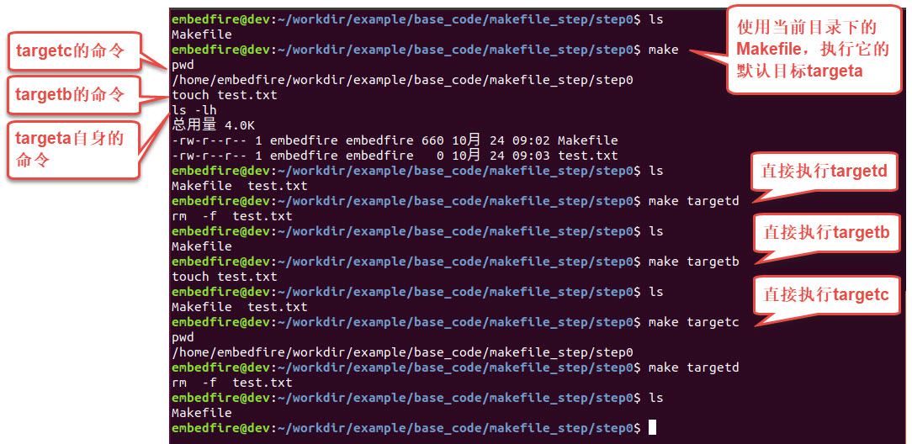
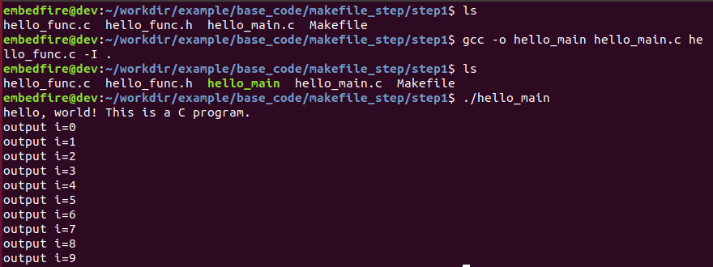
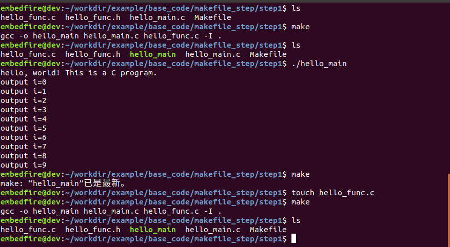
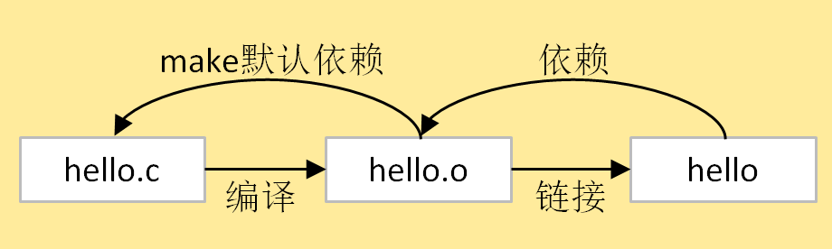
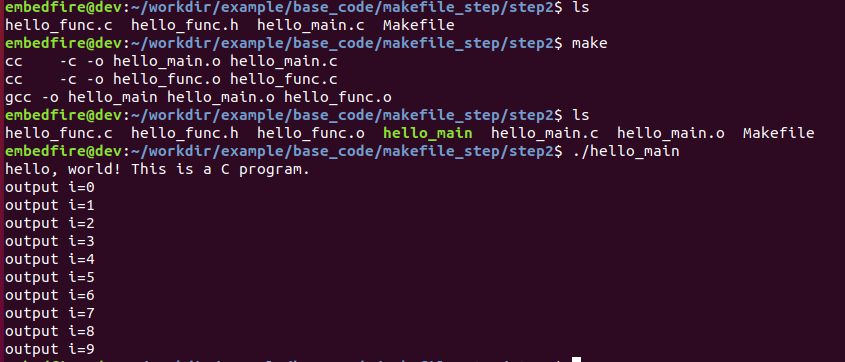
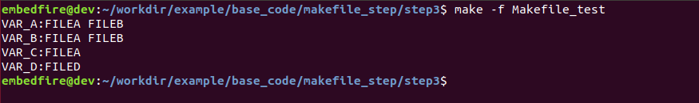
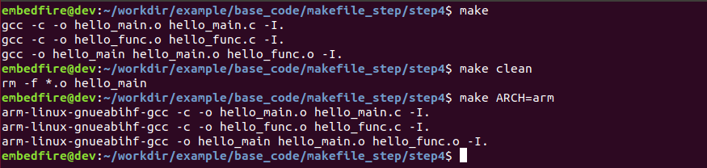
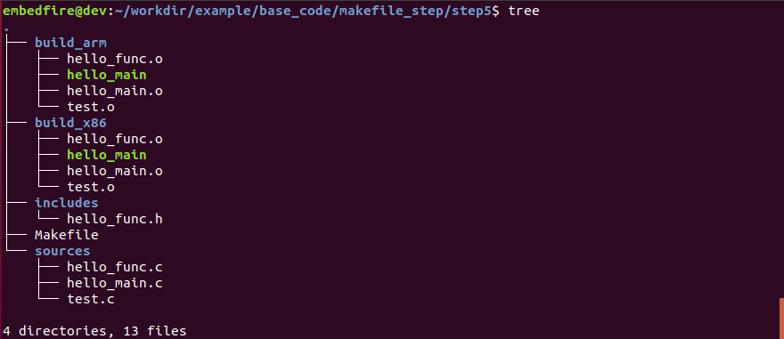

.. vim: syntax=rst

使用Makefile控制编译
----------------------------

关于Makefile的详细使用可参考《跟我一起写Makefile》一书或GNU官方的make说
明文档：\ https://www.gnu.org/software/make/manual\ ，本章仅以示例对Makefile的基础语法进行讲解。

本章的示例代码目录为：base_code/linux_app/makefile_step。

Makefile小实验
~~~~~~~~~~~~~~~~~~~~~~~~~~~~~~~~~

为了直观地演示Makefile的作用，我们使用一个示例进行讲解，首
先使用编辑器创建一个名为"Makefile"的文件，输入如下代码并保存，其中使用"#"开头的
行是注释，自己做实验时可以不输入，另外要注意在"ls -lh"、"touch
test.txt"等命令前要使用Tab键，不能使用空格代替。

该示例代码step0目录下的Makefile文件中找到。

.. code-block:: c
   :caption: Makefile小实验（base_code/linux_app/makefile_step/step0/Makefile）
   :linenos:

   #Makefile格式
   #目标:依赖的文件或其它目标
   #Tab 命令1
   #Tab 命令2
   #第一个目标，是最终目标及make的默认目标
   #目标a，依赖于目标targetc和targetb
   #目标要执行的shell命令 ls -lh，列出目录下的内容
   targeta: targetc targetb
    ls -lh
   
    #目标b，无依赖
    #目标要执行的shell命令，使用touch创建test.txt文件
    targetb:
    touch test.txt
   
    #目标c，无依赖
    #目标要执行的shell命令，pwd显示当前路径
    targetc:
    pwd
   
    #目标d，无依赖
    #由于abc目标都不依赖于目标d，所以直接make时目标d不会被执行
    #可以使用make targetd命令执行
    targetd:
    rm -f test.txt
   
   

这个Makefile文件主要是定义了四个目标
操作，先大致了解它们的关系：

-  targeta：这是Makefile中的第一个目标代号，在符号":"后
   面的内容表示它依赖于targetc和targetb目标，它自身的命令为"ls -lh"，列出当前目录下的内容。

-  targetb：这个目标没有依赖其它内容，它要执行的命令为"touch test.txt"，即创建一个test.txt文件。

-  targetc：这个目标同样也没有依赖其它内容，它要执行的命令为"pwd"，就是简单地显示当前的路径。

-  targetd：这个目标无依赖其它内容，它要执行的命令为"rm -f test.txt"，删除
   目录下的test.txt文件。与targetb、c不同的是，没有任何其它目标依赖于targetd，而且
   它不是默认目标。

下面使用这个Makefile执行各种make命令，对比不同make命令的输出，可以清楚地了解Makefile的机制。
在主机Makefile所在的目录执行如下命令：

::

         #在主机上Makefile所在的目录执行如下命令
         #查看当前目录的内容
         ls

         #执行make命令，make会在当前目录下搜索"Makefile"或"makefile"，并执行
         make

         #可看到make命令后的输出，它执行了Makefile中编写的命令

         #查看执行make命令后的目录内容，多了test.txt文件
         ls

         #执行Makefile的targetd目标，并查看，少了test.txt文件
         make targetd
         ls

         #执行Makefile的targetb目标，并查看，又生成了test.txt文件
         make targetb
         ls

         #执行Makefile的targetc目标
         make targetc

上图中包含的原理说明如下：

make命令：

-  在终端上执行make命令时，make会在当前目录下搜索名为"Makefile"或"makefile"的文件，然后
   根据该文件的规则解析执行。如果要指定其它文件作为输入规则，可以通过"-f"参数指定输
   入文件，如"make -f 文件名"。

-  此处make命令读取我们的Makefile文件后，发现targeta是Makefile的第一个目标，它会被当成默认目标执行。

-  又由于targeta依赖于targetc和targetb目标，所以在执行targeta自身的命令之前，会先去完成targetc和targetb。

-  targetc的命令为pwd，显示了当前的路径。

-  targetb的命令为touch test.txt ，创建了test.txt文件。

-  最后执行targeta自身的命令ls -lh ，列出当前目录的内容，可看到多了一个test.txt文件。

make targetd 、make targetb、make targetc命令：

-  由于targetd不是默认目标，且不被其它任何目标依赖，所以直接make的时
   候targetd并没有被执行，想要单独执行Makefile中的某个目标，可以使用"make 目标
   名"的语法，例如上图中分别执行了"make targetd" 、"make targetb" 和"make
   targetc"指令，在执行"make targetd"目标时，可看到它的命令rm -f test.txt被执行，test.txt文件被删除。

从这个过程，可了解到make程序会根据Makefile中描述的目标与依赖关系，执行达成目标需要的shell命令。简单来说，Makefile就是用来指导make程序如何干某些事情的清单。

使用Makefile编译程序
~~~~~~~~~~~~~~~~~~~~~~~~~~~~~~~~~~~~~~~~~~

使用GCC编译多个文件
^^^^^^^^^^^^^^^^^^^^^^

接着我们使用Makefile来控制程序的编译，为方便说明，先把前面章节
的hello.c程序分开成三个文件来写，分别为hello_main.c主文件，hello_func.c函数文
件，hello_func.h头文件，其内容如下代码所示，这些文件可在示例的step1目录下找到。

.. code-block:: c
   :caption: hello_main.c文件（base_code/linux_app/makefile_step/step1目录）
   :linenos:

   #include "hello_func.h"
   int main()
   {
   hello_func();
   return 0;
   }

.. code-block:: c
   :caption: hello_func.c文件（base_code/linux_app/makefile_step/step1目录）
   :linenos:

   #include <stdio.h>
   #include "hello_func.h"
   void hello_func(void)
   {
   printf("hello, world! This is a C program.\n");
   for (int i=0; i<10; i++ ) {
   printf("output i=%d\n",i);
   }
    }

.. code-block:: c
   :caption: hello_func.h文件（base_code/linux_app/makefile_step/step1目录）
   :linenos:

   void hello_func(void);

也就是说hello_main.c的main主函数调用了hello_func.c文件的打
印函数，而打印函数在hello_func.h文件中声明，在复杂的工程中这是常见的程序结构。

如果我们直接使用GCC进行编译，需要使用如下命令：

::

         #在主机上示例代码目录执行如下命令
         #注意最后的"-I ."包含名点"."
         gcc -o hello_main hello_main.c hello_func.c -I .

         #运行生成的hello_main程序
         ./hello_main

相对于基础的hello.c编译命令，此处主要是增加了输入的文件
数量，如"hello_main.c"、"hello_func.c"，另外新增的"-I ."是告诉编
译器头文件路径，让它在编译时可以在"."（当前目录）寻找头文件，其实不加"-I
."选项也是能正常编译通过的，此处只是为了后面演示Makefile的相关变量。

使用Makefile编译
^^^^^^^^^^^^

可以想像到，只要把gcc的编译命令按格式写入到Makefile，就能直接
使用make编译，而不需要每次手动直接敲gcc编译命令。

操作如下使用编辑器在hello_main.c所在的目录新建一个名为"Makefile"的文件，并
输入如下内容并保存。

.. code-block:: c
   :caption:  Makefile示例文件1
   :linenos:

   #Makefile格式
   #目标:依赖
   #Tab 命令1
   #Tab 命令2
   #默认目标
   #hello_main依赖于hello_main.c和hello_func.c文件
   hello_main: hello_main.c hello_func.c
   gcc -o hello_main hello_main.c hello_func.c -I .
   
   
    #clean目标，用来删除编译生成的文件
    clean:
    rm -f *.o hello_main

该文件定义了默认目标hello_main用于编译程序，clean目标用于删除
编译生成的文件。特别地，其中hello_main目标名与gcc编译生成的文件名"gcc -o
hello_main"设置成一致了，也就是说，此处的目标hello_main在Makefile看来，已经是
一个目标文件hello_main。

这样的好处是make每次执行的时候，会检查hello_main文件和依赖
文件hello_main.c、hello_func.c的修改日期，如果依赖文件的修改日期比hello_main文件的
日期新，那么make会执行目标其下的Shell命令更新hello_main文件，否则不会执行。

请运行如下命令进行实验：

.. code-block:: sh
   :linenos:

   #在主机上Makefile所在的目录执行如下命令   
   #若之前有编译生成hello_main程序，先删除

   rm hello_main
   ls

   #使用make根据Makefile编译程序
   make
   ls

   #执行生成的hello_main程序
   ./hello_main

   #再次make，会提示hello_main文件已是最新
   make

   #使用touch命令更新一下hello_func.c的时间
   touch hello_func.c

   #再次make，由于hello_func.c比hello_main新，所以会再编译
   make
   ls

如上图所示，有了Makefile后，我们实际上只需要执行一下make命令就可以完成
整个编译流程。

图中还演示了make会对目标文件和依赖进行更新检查，当依赖文件
有改动时，才会再
次执行命令更新目标文件。

目标与依赖
~~~~~~~~~~~~~~~

下面我们再总结一下Makefile中跟目标相关的语法：

[目标1]：[依赖]

[命令1]

[命令2]

[目标2]：[依赖]

[命令1]

[命令2]

-  目标：指make要做的事情，可以是一个简单的代号，也可以是目标文件，需要顶格
   书写，前面不能有空格或Tab。一个Makefile可以有多个目标，写在最前面的第一
   个目标，会被Make程序确立为 "默认目标"，例如前面的targeta、hello_main。

-  依赖：要达成目标需要依赖的某些文件或其它目标。例如前面的targeta依赖
   于targetb和targetc，又如在编译的例子中，hello_main依赖于hello_main.c、hello_func.c源文
   件，若这些文件更新了会重新进行编译。

-  命令1，命令2…命令n：make达成目标所需要的命令。只有当目标不存在或依赖
   文件的修改时间比目标文件还要新时，才会执行命令。要特别注意命令的开头要用"Tab"键，不能
   使用空格代替，有的编辑器会把Tab键自动转换成空格导致出错，若出现这种情况请检查自己的编辑器配置。

伪目标
~~~~~~~~~

前面我们在Makefile中编写的目标，在make看来其实都是目标文件，例如make在执行
的时候由于在目录找不到targeta文件，所以每次make
targeta的时候，它都会去执行targeta的命令，期待执行后能得到名为targeta的
同名文件。如果目录下真的有targeta、targetb、targetc的文件，即假如目标文件和依
赖文件都存在且是最新的，那么make targeta就不会被正常执行了，这会引起误会。

为了避免这种情况，Makefile使用".PHONY"前缀来区分目标代号和目标文件，并且这种目
标代号被称为"伪目标"，phony单词翻译过来本身就是假的意思。

也就是说，只要我们不期待生成目标文件，就应该把它定义成伪目标，前面的演示代码
修改如下。

.. code-block:: c
   :caption: 使用.PHONY定义伪目标
   :linenos:

   #使用.PHONY表示targeta是个伪目标
   .PHONY:targeta
   #目标a，依赖于目标targetc和targetb
   #目标要执行的shell命令 ls -lh，列出目录下的内容
   targeta: targetc targetb
   ls -lh
   #使用.PHONY表示targetb是个伪目标
   .PHONY:targetb
   
   #目标b，无依赖
   #目标要执行的shell命令，使用touch创建test.txt文件
   targetb:
   touch test.txt
   
   #使用.PHONY表示targetc是个伪目标
   .PHONY:targetc
   
   #目标c，无依赖
   #目标要执行的shell命令，pwd显示当前路径
   targetc:
   pwd
   
   #使用.PHONY表示targetd是个伪目标
   .PHONY:targetd
   
   #目标d，无依赖
   #由于abc目标都不依赖于目标d，所以直接make时目标d不会被执行
   #可以使用make targetd命令执行
   targetd:
   rm -f test.txt
   
   

.. code-block:: c
   :caption: 使用.PHONY定义伪目标
   :linenos:

   #默认目标
   #hello_main依赖于hello_main.c和hello_func.c文件
   hello_main: hello_main.c hello_func.c
   gcc -o hello_main hello_main.c hello_func.c -I .
   #clean伪目标，用来删除编译生成的文件
   .PHONY:clean
   clean:
   rm -f *.o hello_main

GNU组织发布的软件工程代码的Makefile，常常会有类似以上代码中定义的clean伪目标，用于清
除编译的输出文件。常见
的还有"all"、"install"、"print"、"tar"等分别用于编译所有内容、安装已
编译好的程序、列出被修改的文件及打包成tar文件。虽然并没有固定的要求伪目标必须用这些
名字，但可以参考这些习惯来编写自己的Makefile。

如果以上代码中不写".PHONY:clean"语句，并且在目录下创建一个名为clean的文件，那么当
执行"make clean"时，clean的命令并不会被执行，感兴趣的可以亲自尝试一下。

默认规则
~~~~~~~~~~~~

在前面《GCC编译过程》章节中提到整个编译过程包含如下图中的步骤，make在执行时也是
使用同样的流程，不过在Makefile的实际应用中，通常会把编译和最终的链接过程分开。

也就是说，我们的hello_main目标文件本质上并不是依赖hello_main.c和hello_func.c文件，而是依
赖于hello_main.o和hello_func.o，把这两个文件链接起来就能得到我们最终想要的hello_main目
标文件。另外，由于make有一条默认规则，当找不到xxx.
o文件时，会查找目录下的同名xxx.c文件进行编译。根据这样
的规则，我们可把Makefile改修改如下。

.. code-block:: c
   :caption: Makefile文件（base_code/linux_app/makefile_step/step2）
   :linenos:

   #Makefile格式
   #目标文件:依赖的文件
   #Tab 命令1
   #Tab 命令2
   hello_main: hello_main.o hello_func.o
   gcc -o hello_main hello_main.o hello_func.o
   #以下是make的默认规则，下面两行可以不写
   #hello_main.o: hello_main.c
   # gcc -c hello_main.c
   
   #以下是make的默认规则，下面两行可以不写
   #hello_func.o: hello_func.c
   # gcc -c hello_func.c

以上代码的第5~6行把依赖文件由C文件改成了.o文件，gcc编译命令也做
了相应的修改。第8~14行分别是hello_main.o文件和hello_func.o文件的依赖和
编译命令，不过由于C编译成同名的.o文件是make的默认规则，所以这部分内容通常不会写上去。

使用修改后的Makefile编译结果如下图所示。

从make的输出可看到，它先执行了两条额外的"cc"编译命令，这是由make默认规则执
行的，它们把C代码编译生成了同名的.o文件，然后make根据Makefile的命令链接这两
个文件得到最终目标文件hello_main。

使用变量
~~~~~~~~~~~~

使用C自动编译成*.o的默认规则有个缺陷，由于没有显式地表示*.o依赖于.h头文
件，假如我们修改了头文件的内容，那么*.o并不会更新，这是不可接受的。并且默认
规则使用固定的"cc"进行编译，假如我们想使用ARM-GCC进行交叉编译，那么系统默
认的"cc"会导致编译错误。

要解决这些问题并且让Makefile变得更加通用，需要引入变量和分支进行处理。

基本语法
^^^^^^^^^^^^

在Makefile中的变量，有点像 C语言的宏定义，在引用变量的地方使用变量
值进行替换。变量的命名可以包含字符、数字、下划线，区分大小写，定义变量的方式有以下四种：

-  "=" ：延时赋值，该变量只有在调用的时候，才会被赋值

-  ":=" ：直接赋值，与延时赋值相反，使用直接赋值的话，变量的值定义时就已经确定了。

-  "?=" ：若变量的值为空，则进行赋值，通常用于设置默认值。

-  "+=" ：追加赋值，可以往变量后面增加新的内容。

当我们想使用变量时，其语法如下：

.. code-block:: sh
   :linenos:

   $(变量名)

下面通过一个实验来讲解这四种定义方式，对于后两种赋值方式
比较简单，主要思考延时赋值和直接赋值的差异，实验代码如下所示。

.. code-block:: c
   :caption: Makefile_test变量实验（base_code/linux_app/makefile_step/step3/Makefile_test）
   :linenos:

   VAR_A = FILEA
   VAR_B = $(VAR_A)
   VAR_C := $(VAR_A)
   VAR_A += FILEB
   VAR_D ?= FILED
   .PHONY:check
   check:
   @echo "VAR_A:"$(VAR_A)
   @echo "VAR_B:"$(VAR_B)
   @echo "VAR_C:"$(VAR_C)
   @echo "VAR_D:"$(VAR_D)

这里主要关心VAR_B和VAR_C的赋值方式，实验结果如下图所示。执行完make命令
后，只有VAR_C是FILEA。这是因为VAR_B采用的延时赋值，只有当调用时，才会进行
赋值。当调用VAR_B时，VAR_A的值已经被修改为FILEA FILEB，因此VAR_B的变量值也就等于FILEA
FILEB。

改造默认规则
^^^^^^^^^^^^^^^^^^

接下来使用变量对前面hello_main的Makefile进行大改造，如下所示。

.. code-block:: c
   :caption: 使用变量修改默认规则（base_code/linux_app/makefile_step/step3/Makefile）
   :linenos:

   #定义变量
   CC=gcc
   CFLAGS=-I.
   DEPS = hello_func.h

   #目标文件
   hello_main: hello_main.o hello_func.o
   $(CC) -o hello_main hello_main.o hello_func.o

   #*.o文件的生成规则
   %.o: %.c $(DEPS)
   $(CC) -c -o $@ $< $(CFLAGS)
   
   #伪目标
   .PHONY: clean
   clean:
   rm -f *.o hello_main

-  代码的1~4行：分别定义了CC、CFLAGS、DEPS变量，变量的值就是等号右
   侧的内容，定义好的变量可通过"$(变量名)"的形式引用，如后面
   的"$(CC)"、"$( CFLAGS)"、"$(DEPS)"等价于定义时赋予的变量值"gcc"、"-I."和"hello_func.h"。

-  代码的第8行：使用$(CC)替代了gcc，这样编写的Makefile非常容易更换
   不同的编译器，如要进行交叉编译，只要把开头的编译器名字修改掉即可。

-  代码的第11行："%"是一个通配符，功能类似"*"，如"%.o"表示所
   有以".o"结尾的文件。所以"%.o:%.c"在本例子中等价
   于"hello_main.o: hello_main.c"、"hello_func.o:
   hello_func.c"，即等价于o文件依赖于c文件的默认规则。不过这行代码后面的"$(DEPS)"表示它除了
   依赖c文件，还依赖于变量"$(DEPS)"表示的头文件，所以当头文件修改的话，o文件也会被重新编译。

-  代码的第12行：这行代码出现了特殊的变量"$@"，"$<"，可理解为Makefile文件保
   留的关键字，是系统保留的自动化变量，"$@"代表了目标文件，"$<"代表了第一个依赖
   文件。即"$@"表示"%.o"，"$<"表示"%.c"，所以，当第11行的"%"匹配的字符为"hello_func"的话，第1
   2行代码等价于：

.. code-block:: sh
   :linenos:

   #当"%"匹配的字符为"hello_func"的话：
   $(CC) -c -o $@ $< $(CFLAGS)
   #等价于：
   gcc -c -o hello_func.o func_func.c -I .

也就是说makefile可以利用变量及自动化变量，来重写.o文件的默认生成
规则，以及增加头文件的依赖。

改造链接规则
^^^^^^^^^^^^^^^^^^

与*.o文件的默认规则类似，我们也可以使用变量来修改生成最终目标
文件的链接规则，具体参考如下代码。

.. code-block:: c
   :caption: 使用变量修改链接规则（base_code/linux_app/makefile_step/step4/Makefile）
   :linenos:

   #定义变量
   TARGET = hello_main
   CC = gcc
   CFLAGS = -I.
   DEPS = hello_func.h
   OBJS = hello_main.o hello_func.o

   #目标文件
   $(TARGET): $(OBJS)
    $(CC) -o $@ $^ $(CFLAGS)
   
   #*.o文件的生成规则
   %.o: %.c $(DEPS)
   $(CC) -c -o $@ $< $(CFLAGS)
   
   #伪目标
   .PHONY: clean
   clean:
   rm -f *.o hello_main

这部分说明如下：

-  代码的第2行：定义了TARGET变量，它的值为目标文件名hello_main。

-  代码的第6行：定义了OBJS变量，它的值为依赖的各个o文件，如hello_main.o、hello_func.o文件。

-  代码的第9行：使用TARGET和OBJS变量替换原来固定的内容。

-  代码的第10行：使用自动化变量"$@"表示目标文件"$(TARGET)"，使用自动化变量"$^"表示所有的依赖文件即"$(OBJS)"。

也就是说以上代码中的Makefile把编译及链接的过程都通过变量表示出来了，非常通用。
使用这样的Makefile可以针对不同的工程直接修改变量的内容就可以使用。

其它自动化变量
^^^^^^^^^^^^^^^^^^^^^

Makefile中还有其它自动化变量，此处仅列出方便以后使用到的时候进行查阅，见下表。

表    自动化变量

==== ==============================================
符号 意义
==== ==============================================
$@   匹配目标文件
$%   与$@类似，但$%仅匹配"库"类型的目标文件
$<   依赖中的第一个目标文件
$^   所有的依赖目标，如果依赖中有重复的，只保留一份
$+   所有的依赖目标，即使依赖中有重复的也原样保留
$?   所有比目标要新的依赖目标
==== ==============================================

使用分支
~~~~~~~~~~~~

为方便直接切换GCC编译器，我们还可以使用条件分支增加切换编译器
的功能。在Makefile中的条件分支语法如下：

.. code-block:: sh
   :linenos:

   ifeq(arg1, arg2)
   分支1
   else
   分支2
   endif

分支会比较括号内的参数"arg1"和"arg2"的值是否相
同，如果相同，则为真，执行分支1的内容，否则的话，执行分支2 的内容，参
数arg1和arg2可以是变量或者是常量。

使用分支切换GCC编译器的Makefile如下所示。

.. code-block:: c
   :caption: 给Makefile增加编译器的选择切换（base_code/linux_app/makefile_step/step4/Makefile）
   :linenos:

   #定义变量
   #ARCH默认为x86，使用gcc编译器，
   #否则使用arm编译器
   ARCH ?= x86
   TARGET = hello_main
   CFLAGS = -I.
   DEPS = hello_func.h
   OBJS = hello_main.o hello_func.o
   
   #根据输入的ARCH变量来选择编译器
   #ARCH=x86，使用gcc
   #ARCH=arm，使用arm-gcc
   ifeq ($(ARCH),x86)
   CC = gcc
   else
   CC = arm-linux-gnueabihf-gcc
   endif
   
   #目标文件
   $(TARGET): $(OBJS)
   $(CC) -o $@ $^ $(CFLAGS)
   
   #*.o文件的生成规则
   %.o: %.c $(DEPS)
   $(CC) -c -o $@ $< $(CFLAGS)
   
   #伪目标
   .PHONY: clean
   clean:
   rm -f *.o hello_main

Makefile主要是增加了ARCH变量用于选择目标平台，第4行代
码中使用"?="给ARCH赋予默认值x86，然后在代码11~18行增加了根据ARCH
变量值的内容对CC变量赋予不同的编译器名。

在执行make命令的时候，通过给ARCH赋予不同的变量值切换不同的编译器平台：

.. code-block:: sh
   :linenos:

   #清除编译输出，确保不受之前的编译输出影响
   make clean
   #使用ARM平台
   make ARCH=arm
   #清除编译输出
   make clean
   #默认是x86平台
   make

使用函数
~~~~

在更复杂的工程中，头文件、源文件可能会放在二级目录，编译生成的*.o或
可执行文件也放到专门的编译输出目录方便整理，如下图所示。示例中*.h头文件
放在includes目录下，*.c文件放在sources目录下，不同平台的编译输出分别存
放在build_x86和build_arm中。

实现这些复杂的操作通常需要使用Makefile的函数。

函数格式及示例
^^^^^^^^^^^^^^

在Makefile中调用函数的方法跟变量的使用
类似，以"$()"或"${}"符号包含函数名和参数，具体语法如下：

.. code-block:: sh
   :linenos:

   $(函数名 参数)
   #或者使用花括号
   ${函数名 参数}

下面以常用的notdir、patsubst、wildcard函数为例
进行讲解，并且示例中都是我们后面Makefile中使用到的内容。

notdir函数
''''''''''''''''''''''''

notdir函数用于去除文件路径中的目录部分。它的格式如下：

.. code-block:: sh
   :linenos:

   $(notdir 文件名)

例如输入参数"./sources/hello_func.c"，函数执行后
的输出为"hell_func.c"，也就是说它会把输入中的"./sources/"路径部分去掉，保留
文件名。使用范例如下：

.. code-block:: sh
   :linenos:

   #以下是范例
   $(notdir ./sources/hello_func.c)

#上面的函数执行后会把路径中的"./sources/"部分去掉，输出为：
hello_func.c

wildcard函数
''''''''''''''''''''

wildcard函数用于获取文件列表，并使用空格分隔开。它的格式如下：

$(wildcard 匹配规则)

例如函数调用"$(wildcard *.c)"，函数执行后会把当前目录的所
有c文件列出。假设我们在上图中的Makefile目录下执行该函数，使用范例如下：

.. code-block:: sh
   :linenos:

   #在sources目录下有hello_func.c、hello_main.c、test.c文件
   #执行如下函数
   $(wildcard sources/*.c)
   #函数的输出为：
   sources/hello_func.c sources/hello_main.c sources/test.c

patsubst函数
''''''''''''''''''''''''''''''

patsubst函数功能为模式字符串替换。它的格式如下：

.. code-block:: sh
   :linenos:

   $(patsubst 匹配规则, 替换规则, 输入的字符串)

当输入的字符串符合匹配规则，那么使用替换规则来替换字符串，当匹配规则中有"%"号时，替换规
则也可以例程"%"号来提取"%"匹配的内容加入到最后替换的字符串中。有点抽象，请直接阅读以下示例：

#执行如下函数

.. code-block:: sh
   :linenos:

   $(patsubst %.c, build_dir/%.o, hello_main.c )
   #函数的输出为：
   build_dir/hello_main.o
   #执行如下函数
   $(patsubst %.c, build_dir/%.o, hello_main.xxx )
   #由于hello_main.xxx不符合匹配规则"%.c"，所以函数没有输出

第一个函数调用中，由于"hello_main.c"符合"%.c"的匹配规则（%在Makefile中的类似于*通配符），而且"%"从"hello_main.c"中提取出了"hello_main"字符，把这部分内容放到替换规则"build_dir/%.o"的"%"号中，所以最终的输出为"build_di
r/hello_main.o"。

第二个函数调用中，由于由于"hello_main.xxx"不符合"%.c"的匹配规则，".xxx"与".c"对不上，所以不会进行替换，函数直接返回空的内容。

多级结构工程的Makefile
^^^^^^^^^^^^^^^^^^^^^^^^^^^^^^^^^^^^^^^^^^^^^

接下来我们使用上面三个函数修改我们的Makefile，以适应包含多级目录的工程，修改后的内容如下所示。

.. code-block:: c
   :caption: 使用函数处理多级结构的工程（base_code/linux_app/makefile_step/step5/Makefile）
   :linenos:

   #定义变量
   #ARCH默认为x86，使用gcc编译器，
   #否则使用arm编译器
   ARCH ?= x86
   TARGET = hello_main

   #存放中间文件的路径
   BUILD_DIR = build_$(ARCH)
   #存放源文件的文件夹
   SRC_DIR = sources
   #存放头文件的文件夹
   INC_DIR = includes .
   
   #源文件
   SRCS = $(wildcard $(SRC_DIR)/*.c)
   #目标文件（*.o）
   OBJS = $(patsubst %.c, $(BUILD_DIR)/%.o, $(notdir $(SRCS)))
   #头文件
   DEPS = $(wildcard $(INC_DIR)/*.h)
   
   #指定头文件的路径
   CFLAGS = $(patsubst %, -I%, $(INC_DIR))
   
   #根据输入的ARCH变量来选择编译器
   #ARCH=x86，使用gcc
   #ARCH=arm，使用arm-gcc
   ifeq ($(ARCH),x86)
   CC = gcc
   else
   CC = arm-linux-gnueabihf-gcc
   endif
   
   #目标文件
   $(BUILD_DIR)/$(TARGET): $(OBJS)
   $(CC) -o $@ $^ $(CFLAGS)
   
   #*.o文件的生成规则
   $(BUILD_DIR)/%.o: $(SRC_DIR)/%.c $(DEPS)
   #创建一个编译目录，用于存放过程文件
   #命令前带"@",表示不在终端上输出
   @mkdir -p $(BUILD_DIR)
   $(CC) -c -o $@ $< $(CFLAGS)
   
   #伪目标
   .PHONY: clean cleanall
   #按架构删除
   clean:
   rm -rf $(BUILD_DIR)
   
   #全部删除
   cleanall:
   rm -rf build_x86 build_arm

注意这个Makefile文件需要配合前面上图中的工程结构，否则即使Makefile写对了编译也会错误，因为
目录对不上。具体可以直接参考我们示例代码"step5"中的内容。修改后的Makefile文件分析如下：

-  代码的8~12行：定义了变量BULID_DIR、SRC_DIR、INC_DIR分别赋值为工程的编译输出路径build_$(ARCH)、源文
   件路径sources以及头文件路径includes和当前目录"."。其中编译输出路径包含了架构$(ARCH)的内容，ARCH=x86时编译输出路径为build
   _x86，ARCH=arm时编译输出路径为build_arm，方便区分不同的编译输出。

-  代码的第15行：定义了变量SRCS用于存储所有需要编译的源文件，它的值为wildcard函
   数的输出，本例子中该函数的输出为"sources/hello_func.c sources/hello_main.c sources/test.c"。

-  代码的第17行：定义了OBJS变量用于存储所有要生成的的.o文件，它的值为patsubst函数
   的输出，本例子中该函数是把所有c文件名替换为同名的.o文件，并添加build目录，即函数的输
   出为"build/hello_func.o build /hello_main.o build
   /test.o"。

-  代码的第19行：与SRCS变量类似，定义一个DEPS变量存储所有依赖的头文件，它的值为wildcard函
   数的输出，本例子中该函数的输出为"includes/hello_func.h "。

-  代码的第22行：定义了CFLAGS变量，用于存储包含的头文件路径，它的值为patsubst函数的
   输出，本例子中该函数是把includes目录添加到"-I"后面，函数的输出为"-Iincludes"。

-  代码的第34行：相对于之前的Makefile，我们在$(TARGET)前增加了$(BUILD_DIR)路径，使得最终的可执行程序放在build目录下。

-  代码的第38行：与上面类似，给.o目标文件添加$(BUILD_DIR)路径。

-  代码的第41行：在执行编译前先创建build目录，以存放后面的.o文件，命令前的"@"表示执行该命令时不在终端上输出。

-  代码的第48行：rm删除命令也被修改成直接删除编译目录$(BUILD_DIR)。

-  代码的51~52行：增加了删除所有架构编译目录的伪目标cleanall。

使用该Makefile时，直接在Makefile的目录执行make即可：

.. code-block:: sh
   :linenos:

   #使用tree命令查看目录结构
   #若提示找不到命令，使用 sudo apt install tree安装
   tree

   #编译
   make

如下图:

.. image:: media/makefi010.png
   :align: center
   :alt: 未找到图片10|

本示例中的Makefile目前只支持使用一个源文件目录，如果有多个源文
件目录还需要改进，关于这些，我们在以后的学习中继续积累。

.. |makefi002| image:: media\makefi002.jpg
   :width: 6.04497in
   :height: 2.94441in
.. |makefi003| image:: media\makefi003.png
   :width: 5.76806in
   :height: 2.16302in
.. |makefi004| image:: media\makefi004.png
   :width: 5.76806in
   :height: 3.17043in
.. |makefi005| image:: media\makefi005.png
   :width: 5.76806in
   :height: 1.72937in
.. |makefi006| image:: media\makefi006.png
   :width: 5.75in
   :height: 0.97917in
.. |makefi007| image:: media\makefi007.png
   :width: 5.76806in
   :height: 0.8572in
.. |makefi008| image:: media\makefi008.png
   :width: 5.76806in
   :height: 1.37125in
.. |makefi009| image:: media\makefi009.png
   :width: 5.76806in
   :height: 2.49749in
.. |makefi010| image:: media\makefi010.png
   :width: 5.76806in
   :height: 5.27403in
