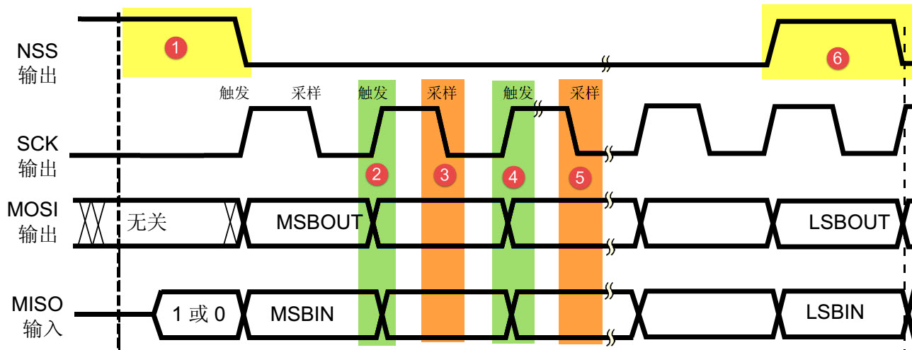
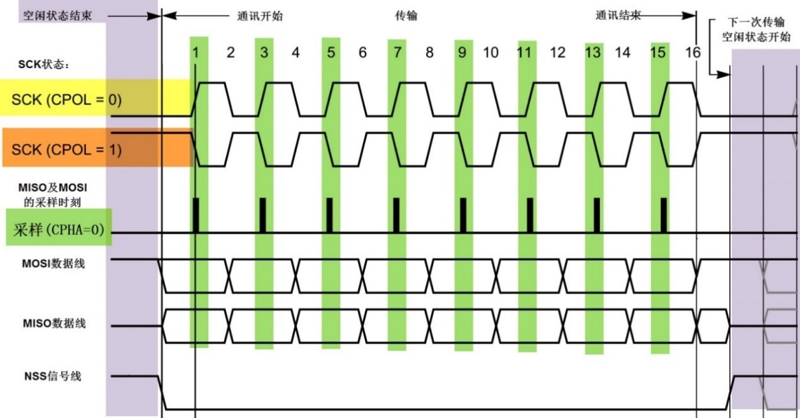
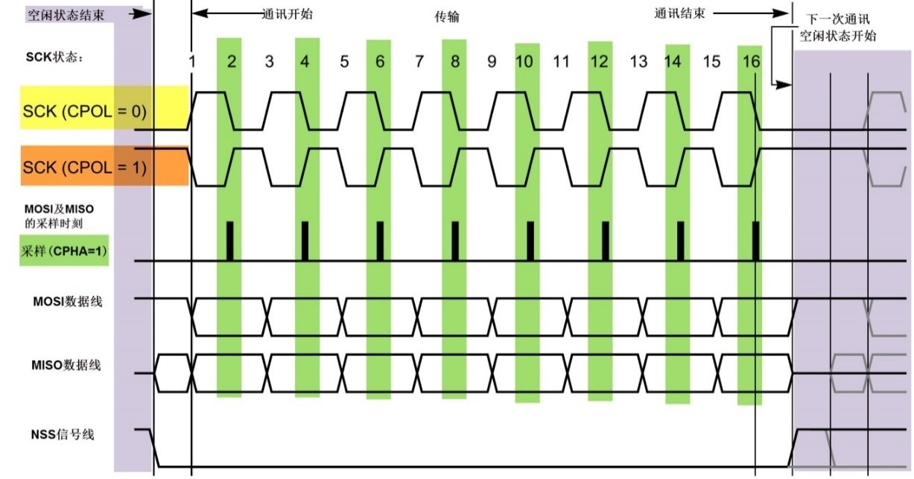
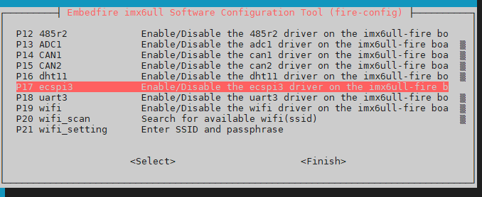
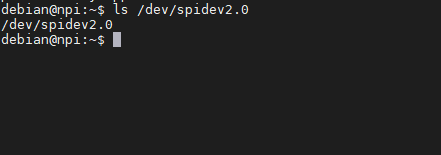
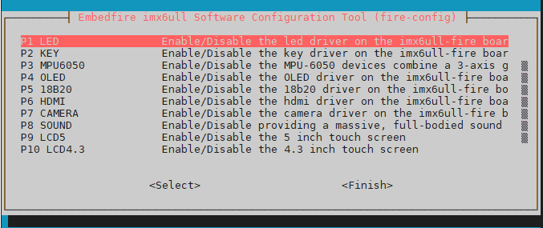
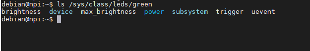
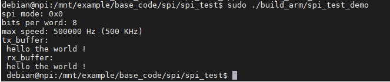

.. vim: syntax=rst

SPI通信
------------------------------

本章通过讲解在应用层中使用SPI总线与外部设备的通讯，讲解Linux系统总线类型设备驱动架构的应用,它与上一章的I2C 总线操作方法非常相似，可以对比学习。

在Linux内核文档的Documentation/SPI目录下有关于SPI驱动非常详细的说明。

本章节的示例代码目录为：base_code/linux_app/spi

SPI通讯协议简介
~~~~~~~~~~~~~~~~~~~~~~~~~~~~~~~~~~~~~~~~~~~~~~~~~~~~~~

SPI 协议是由摩托罗拉公司提出的通讯协议(Serial Peripheral Interface)，即串行外围设
备接口，是一种高速全双工的通信总线。它被广泛地使用在 ADC、 LCD 等设备与 MCU 间，要求通讯速率较高的场合
学习本章时，可与 I2C 章节对比阅读，体会两种通讯总线的差异。下面我们分别对 SPI 协议的物理层及协议层进行讲解。

SPI物理层
^^^^^^^^^^^^^^^^^^^^^^^^^^^^^^^^^^^^^^^^^^^^^^^^^^

SPI通讯设备之间的常用连接方式见下图。

SPI通讯使用3条总线及片选线，3条总线分别为SCK、MOSI、MISO，片选线为 ，它们的作用介绍如下：

(1) ( Slave Select)：从设备选择信号线，常称为片选信号
线，也称为NSS、CS，以下用NSS表示。当有多个SPI从设备与SPI主机相连时，设备的其它信
号线SCK、MOSI及MISO同时并联到相同的SPI总线上，即无论有多少个从设备，都共同只使用这3条总线；而每个从设备都有独立的这一条
NSS信号线，本信号线独占主机的一个引脚，即有多少个从设备，就有多少条片选信号线。I2C协议中通过设备地址来寻址、选中总线上的某个设备并与其进行通讯；而SPI协议中没有设备地址，它使用NSS信号线来寻址，当主机要选择从设备时，把该从设备的NSS信号线设置为低电平，该从设备即被选中，即片选有效，接着主
机开始与被选中的从设备进行SPI通讯。所以SPI通讯以NSS线置低电平为开始信号，以NSS线被拉高作为结束信号。

(2) SCK (Serial Clock)：时钟信号线，用于通讯数据同步。它由通讯主机产生，决定了通讯的速率，不同的
设备支持的最高时钟频率不一样，如RT1052的SPI时钟频率最大为f\ :sub:`pclk`/2，两个设备之
间通讯时，通讯速率受限于低速设备。

(3) MOSI (Master Output， Slave Input)：主设备输出/从设备输入引脚。主机的
数据从这条信号线输出，从机由这条信号线读入主机发送的数据，即这条线上数据的方向为主机到从机。

(4) MISO(Master Input,，Slave Output)：主设备输入/从设备输出引脚。主机从这条信号线读
入数据，从机的数据由这条信号线输出到主机，即在这条线上数据的方向为从机到主机。

协议层
^^^^^^^^^^^^^^^^^^^^^^^^^^^

与I2C的类似，SPI协议定义了通讯的起始和停止信号、数据有效性、时钟同步等环节。

SPI基本通讯过程
'''''''''''''''''''''''''''''''''''''''''''''''''''''''''''''

先看看SPI通讯的通讯时序，如下图所示。

这是一个主机的通讯时序。NSS、SCK、MOSI信号都由主机控制产生，而MISO的信号由从机产生，主机通过该信号线读取从机的数据。MOSI与MISO的信号只在NSS为低电平的时候才有效，在SCK的每个时钟周期MOSI和MISO传输一位数据。

以上通讯流程中包含的各个信号分解如下：

通讯的起始和停止信号
''''''''''''''''''''''''''''''''''''''''''''''''''''''''''''

在上图中的标号处，NSS信号线由高变低，是SPI通讯的起始信号。NSS是每个从机各自独
占的信号线，当从机检在自己的NSS线检测到起始信号后，就知道自己被主机选中了，开始准备与主机
通讯。在图中的标号处，NSS信号由低变高，是SPI通讯的停止信号，表示本次通讯结束，从机的选中状态被取消。

数据有效性
''''''''''''''''''''''''''''''

SPI使用MOSI及MISO信号线来传输数据，使用SCK信号线进行数据同步。MOSI及MISO数据线在SCK的每个时钟周期传输一位数据，且数据输入输出是同时进行的。数据传输时，MSB
先行或LSB先行并没有作硬性规定，但要保证两个SPI通讯设备之间使用同样的协定，一般都会采用上图中的MSB先行模式。

观察图中的标号处，MOSI及MISO的数据在SCK的上升沿期间变化输出，在SCK的下降沿时被采样。即在SCK的下降沿时刻，MOSI及MISO的数据有效，高电平时表示数据"1"，为低电
平时表示数据"0"。在其它时刻，数据无效，MOSI及MISO为下一次表示数据做准备。

SPI每次数据传输可以8位或16位为单位，每次传输的单位数不受限制。

CPOL/CPHA及通讯模式
''''''''''''''''''''''''''''''''''''''''''''''''''''''''''''''''''''''

上面讲述的图中的时序只是SPI中的其中一种通讯模式，SPI一共有四种通讯
模式，它们的主要区别是总线空闲时SCK的时钟状态以及数据采样时刻。为方便说明，在此
引入"时钟极性CPOL"和"时钟相位CPHA"的概念。

时钟极性CPOL是指SPI通讯设备处于空闲状态时，SCK信号线的电平
信号(即SPI通讯开始前、 NSS线为高电平时SCK的状态)。CPOL=0时， SCK在空闲状态时
为低电平，CPOL=1时，则相反。

时钟相位CPHA是指数据的采样的时刻，当CPHA=0时，MOSI或MISO数据线上的信号
将会在SCK时钟线的"奇数边沿"被采样。当CPHA=1时，数据线在SCK的"偶数边沿"采样。

如下图:

我们来分析这个CPHA=0的时序图。首先，根据SCK在空闲状态时的电平，分为两种情况。SCK信号线在空闲状态为低电平时，CPOL=0；空闲状态为高电平时，CPOL=1。

无论CPOL=0还是=1，因为我们配置的时钟相位CPHA=0，在图中可以看到，采样时刻都是在SCK的奇数边沿。注意当CPOL=0的时候，时钟的奇数边沿是上升沿，而CPOL=1的时候，时钟的奇数边沿是下降沿。所以SPI的采样时刻不是由上升/下降沿决定的。MOSI和MISO数据线的有效信号在SCK的奇数
边沿保持不变，数据信号将在SCK奇数边沿时被采样，在非采样时刻，MOSI和MISO的有效信号才发生切换。

类似地，当CPHA=1时，不受CPOL的影响，数据信号在SCK的偶数边沿被采样。

如下图:

由CPOL及CPHA的不同状态，SPI分成了四种模式，见下表，主机与
从机需要工作在相同的模式下才可以正常通讯，实际中采用较多的是"模式0"与"模式3"。

表  SPI的四种模式

======= ==== ==== ============= ========
SPI模式 CPOL CPHA 空闲时SCK时钟 采样时刻
======= ==== ==== ============= ========
0       0    0    低电平        奇数边沿
1       0    1    低电平        偶数边沿
2       1    0    高电平        奇数边沿
3       1    1    高电平        偶数边沿
======= ==== ==== ============= ========

扩展SPI协议（Single/Dual/Quad/Octal SPI）
^^^^^^^^^^^^^^^^^^^^^^^^^^^^^^^^^^^^^^^^^^^^^^^^^^^^^^^^^^^^^^^^^^^^^^^^^^^^^^^

以上介绍的是经典SPI协议的内容，这种也被称为标准SPI协议（Standard SPI）或单
线SPI协议（Single SPI），其中的单线是指该SPI协议中使用单根数据线MOSI进行发送数据，单根数据线MISO进行接收数据。

为了适应更高速率的通讯需求，半导体厂商扩展SPI协议，主要发展出了Dual/Quad/Octal SPI协议，加上
标准SPI协议（Single SPI），这四种协议的主要区别是数据线的数量及通讯方式，具体见下表。

表 四种SPI协议的区别

===================== ================= ========
协议                  数据线数量及功能  通讯方式
===================== ================= ========
Single SPI（标准SPI） 1根发送，1根接收  全双工
Dual SPI（双线SPI）   收发共用2根数据线 半双工
Quad SPI（四线SPI）   收发共用4根数据线 半双工
Octal SPI（八线SPI）  收发共用8根数据线 半双工
===================== ================= ========

扩展的三种SPI协议都是半双工的通讯方式，也就是说它们的数据线是分时进行收发
数据的。例如，标准SPI（Single SPI）与双线SPI（Dual SPI）都是两根数据线，但
标准SPI（Single SPI）的其中一根数据线只用来发送，另一根数据线只用来接收，即全双工；而双线SPI（Dual
SPI）的两根线都具有收发功能，但在同一时刻只能是发送或者是接收，即半
双工，四线SPI（Quad SPI）和 八线SPI（Octal SPI）与双线SPI（Dual SPI）类似，只是数据线量的区别。

SDR和DDR模式
^^^^^^^^^^^^^^^^^^^^^^^^^^^^^^^^^^^^^^^^^^^^^^^^^^^^^^

扩展的SPI协议还增加了SDR模式（单倍速率Single Data Rate）和DDR模式（双倍速率Double Data
Rate）。例如在标准SPI协议的SDR模式下，只在SCK的单边沿进行数据传输，即一个SCK时钟只传输一位数据；而在它的DDR模式下，会在SCK的上升沿和下降沿都进行数据传输，即一个SCK时钟能传输两位数据，传输速率提高一倍。

使能ECSPI_3驱动
^^^^^^^^^^^^^^^^

IMX6ULL的spi接口称为"ECSPI",它在普通spi接口新加入来一些特性。
但是我们不必过分深入，把它当作普通spi接口使用即可。
IMX6ULL有四个ECSPI接口，本实验主要使用它的第三个。
参考前面《fire-config工具简介》章节，使能exspi_3驱动。

如下图:

检查SPI 设备
''''''''''''''''''''''''''''''''''''''''''''''''''''''''

使能exspi_3接口驱动后，我们可以通过SPI设备文件来判断spi驱动是否加载成功。
SPI_3对应的设备文件是spidev2.0，这是因为驱动是从0开始编号的。

.. code-block:: sh
   :linenos:

   #查看命令 
   ls /dev/spidev2.0

如果ECSPI_3驱动使能了，系统输出如下图所示:

不同版本的Debian镜像输出的内容可能有差别。

使能LED设备
~~~~~~~~~~~~~~~~~~~~~~~~~~~~~~~~~~~~~~~~~~~~~~~~~~

本实验中将使用到SPI_OLED 显示屏，它的 D/C 引脚用于控制SPI写入的是命令还是数据，因此需要一个普通IO，连接到SPI_OLED的 D/C引脚。
为简化程序设计，我们直接使用RGB灯的"绿灯"控制引脚，使用前需要使能LED设备。系统默认使能LED设备，如果用户自己禁止了，请重新使能。

参考前面《fire-config工具简介》章节，使能LED设备。

如下图:

检查LED设备
~~~~~~~~~~~~~~~~~~~~~~~~~~~~~~~~~~~~~~~~~~~~~~~~~~

.. code-block:: sh
   :linenos:

   ls /sys/class/leds/green

如果LED设备使能了，系统输出如下图所示

其中brightness就是我们所需IO引脚的设备文件。

SPI回环通讯测试实验
~~~~~~~~~~~~~~~~~~~~~~~~~~~~~~~~~~~~~~~~~~~~~~~~~~~~~~~~~~~~~~~~~~

本章节的示例代码目录为：base_code/linux_app/spi/spi_test

硬件说明：
^^^^^^^^^^^^^^^^^^^^^^^^^^^^^^

上一小节我们添加了SPI 3 的设备驱动，当然这里要操作的是SPI 3。既然是回环测试实
验，我们只需要将SPI 3的 MIOS与MOSI引脚使用跳线帽短接即可。SPI 3 引脚说明以及在开发板上的位置如下所示。

========== ============== ====================
SPI引脚    原理图网络标号 引脚引出位置（排针）
========== ============== ====================
SPI3_MOSI  UART2_CTS      CN4排针 IO1.22 脚
SPI3_MISO  UART2_RTS      CN4排针 IO1.23 脚
SPI3_CLOCK UART2_RXD      CN4排针 IO1.21 脚
========== ============== ====================

代码分析
^^^^^^^^^^^^^^^^^^^^^^^^

SPI代码与上一章的IIC 非常类似。首先打开SPI对应的设备文件，然后写
入配置参数，这样就完成了SPI的初始化，后面的具体功能实现只需要调用对应的API函数即可。SPI初始化代码如下：

SPI 初始化代码
'''''''''''''''''

.. code-block:: c
   :caption: SPI 初始化代码
   :linenos:  

   static  uint32_t mode = SPI_MODE_2;    //用于保存 SPI 工作模式
   static  uint8_t bits = 8;        // 接收、发送数据位数
   static  uint32_t speed = 500000; // 发送速度
   
   /*
   * 初始化SPI
   */
   void spi_init(void)
   {
     int ret = 0;
     /*-------------------第一部分-------------------------*/
     /*打开 SPI 设备*/
     fd = open("/dev/spidev2.0", O_RDWR);
     if (fd < 0)
     {
       pabort("can't open /dev/spidev2.0 ");
     }
   
     /*-------------------第二部分-------------------------*/
     /*
   	 * spi mode 设置SPI 工作模式
   	 */
     ret = ioctl(fd, SPI_IOC_WR_MODE32, &mode);
     if (ret == -1)
       pabort("can't set spi mode");
   
     ret = ioctl(fd, SPI_IOC_RD_MODE32, &mode);
     if (ret == -1)
       pabort("can't get spi mode");
   
     /*-------------------第三部分-------------------------*/
     /*
   	 * bits per word  设置一个字节的位数
   	 */
     ret = ioctl(fd, SPI_IOC_WR_BITS_PER_WORD, &bits);
     if (ret == -1)
       pabort("can't set bits per word");
   
     ret = ioctl(fd, SPI_IOC_RD_BITS_PER_WORD, &bits);
     if (ret == -1)
       pabort("can't get bits per word");
     
     /*-------------------第四部分-------------------------*/
     /*
   	 * max speed hz  设置SPI 最高工作频率
   	 */
     ret = ioctl(fd, SPI_IOC_WR_MAX_SPEED_HZ, &speed);
     if (ret == -1)
       pabort("can't set max speed hz");
   
     ret = ioctl(fd, SPI_IOC_RD_MAX_SPEED_HZ, &speed);
     if (ret == -1)
       pabort("can't get max speed hz");
   
     printf("spi mode: 0x%x\n", mode);
     printf("bits per word: %d\n", bits);
     printf("max speed: %d Hz (%d KHz)\n", speed, speed / 1000);
   }

结合代码，简单说明如下：

第一部分，打开SPI 总线的设备文件。设备文件路径"/dev/spidev2.0"，如果打开失败首先要
查看路径是否正确以及设备文件是否存在。打开方式"O_RDWR"，我们要做SPI回环通信测试，所以要以读、写方式打开。

第二部分，设置SPI 工作模式。根据之前讲解,SPI根据相位和极性的不同分为四
种工作模式，在这里四种工作模式为SPI_MODE_x (x = 0、1、2、3)。这里是回环
测试所以设置为任意一种工作模式都可以。需要注意的是我们可以分开设置SPI的读、写工作模式。

第三部分，设置SPI通信过程中一个字节所占的
位数。默认情况下设置为8即可。同样，这里的读、写是分开设置的。

第四部分，设置SPI通信的波特率，这里设置为500K。

经过以上四部分的初始化，SPI已经可以通信了。

spi发送函数
'''''''''''''

SPI借助SPI发送结构体spi_ioc_transfer 实现发送，程序中我们只需要将要发送的数据以及必要
的配置参数填入结构体，然后调用ioctl函数执行发送即可。发送函数如下所示：

.. code-block:: c
   :caption: SPI 发送函数
   :linenos:  

   void transfer(int fd, uint8_t const *tx, uint8_t const *rx, size_t len)
   {
     int ret;
     /*------------------第一部分--------------------*/
     struct spi_ioc_transfer tr = {
         .tx_buf = (unsigned long)tx,
         .rx_buf = (unsigned long)rx,
         .len = len,
         .delay_usecs = delay,
         .speed_hz = speed,
         .bits_per_word = bits,
         .tx_nbits = 1,
         .rx_nbits = 1
     };
   
     /*------------------第二部分--------------------*/
     ret = ioctl(fd, SPI_IOC_MESSAGE(1), &tr);
     if (ret < 1)
     {
       pabort("can't send spi message");
     }
   }

函数共有四个参数，fd, 打开SPI设备文件时得到的SPI设备文件描述符，tx,要发送的数据地址，rx，如果是双向传输，rx 用于指定
接收缓冲区的地址。len, 指定本次传输的数据长度，单位为字节。函数实现非常简单，结合代码介绍如下：

第一部分，定义并初始化SPI传输结构体。SPI传输结构体的完整定义如下所示：

结合注释很容易理解，简单说明如下，tx_buf和rx_buf分别为发送、接收缓冲区地址，数据类型为"__u64"，兼容64位系统，64位或32位
由系统自动处理，我们不必关心。len,一次传输的数据长度。speed_hz,指定SPI通信的比特率。delay_usecs，如果不为零则用于设置两次传输之间
的时间延迟。bits_per_word，指定字节长度，既一个字节占用多少比特。cs_change，取消
选中，如果设置为真，则在下次传输之前会取消选中当前的SPI设备，更新片选。tx_nbits，指定"写"数据宽度，SPI 支持
1、2、4位宽度，不过我们使用的SPI3只支持1位数据宽度，该值应当设置为1或0（设置为0表示使用默认的宽度既宽度为1）。pad参数我们没有用到，不用设置。

第二部分，调用ioctl执行发送，参数fd,是SPI设备文件描述符，参数SPI_IOC_MESSAGE(1)用于指定执
行传输次数，我们这里只定义并初始化了一个传输结构体tr,所以传输次数为1。tr 是第一部分设置的传输结构体变量。

main函数
'''''''''''''''

有了初始化函数和发送函数，SPI回环测试就非常简单了。我们只需要初始化SPI然后调用发送函数，最后打印传输结果如下所示：

.. code-block:: c
   :caption: main函数
   :linenos:  

   /*-------------------第一部分---------------------*/
   /*SPI 接收 、发送 缓冲区*/
   unsigned char tx_buffer[100] = "hello the world !";
   unsigned char rx_buffer[100];
   
   /*-------------------第二部分---------------------*/
   int main(int argc, char *argv[])
   {
   	/*初始化SPI */
   	spi_init();
   
   	/*执行发送*/
   	transfer(fd, tx_buffer, rx_buffer, sizeof(tx_buffer));
   
   	/*打印 tx_buffer 和 rx_buffer*/
   	printf("tx_buffer: \n %s\n ", tx_buffer);
   	printf("rx_buffer: \n %s\n ", rx_buffer);
   
   	close(fd);
   
   	return 0;
   }

第一部分，tx_buffer是发送缓冲区，rx_buffer是接收缓冲区。第二部分，在main函数中依次调用函数spi_init初始化SPI、调用函数transfer执
行发送。最后分别打印tx_buffer和rx_buffer的内容，正常情况下，程序运行后我们可以在控制终端发现tx_buffer和r
x_buffer的内容一致。

下载验证
~~~~~~~~~~

对于ARM架构的程序，可使用如下步骤进行编译：

.. code-block:: sh
   :linenos:

   #在主机的实验代码Makefile目录下编译
   #编译arm平台的程序
   make ARCH=arm

编译后生成的ARM平台程序为build_arm/spi_test_demo，使用网络文件系统共享至开
发板，在开发板的终端上测试即可。

如下图:

SPI_OLED 显示实验
~~~~~~~~~~~~~~~~~~~~~~~~~~~~~~~~~~~~~~~~~~~~~~~~~~~~~~~~~~~~~~~~~

上一小节我们实现了SPI 回环通信，这一小节实现SPI驱动SPI_OLED显示屏。本小节与上一章的IIC驱动IIC_OLED非常相似，仅仅是发送函数不同。

本章节的示例代码目录为：base_code/linux_app/spi/spi_oled

.. _硬件说明-1:

硬件说明：
^^^^^^^^^^^^^^^^^^^^^^^^^^^^^^

本实验我们仍然使用SPI 3，OLED使用的是SPI接口0.96寸单色显示屏，详细资料可以在野火电子官网找到。实物如下所示：

.. image:: media/spiapp011.png
   :align: center
   :alt: 未找到图片

SPI_OLED显示屏与开发板连接关系如下表所示

============== ========== ============== ====================
SPI_OLED显示屏 SPI引脚    原理图网络标号 引脚引出位置（排针）
============== ========== ============== ====================
MOSI           SPI3_MOSI  UART2_CTS      CN4排针 IO1.22 脚
未使用         SPI3_MISO  UART2_RTS      CN4排针 IO1.23 脚
CLK            SPI3_CLOCK UART2_RXD      CN4排针 IO1.21 脚
D/C            非SPI3引脚 CSI_HSYNC      CN5排针 IO4.20脚
CS             非SPI3引脚                GND
GND            非SPI3引脚                GND
VCC            非SPI3引脚                3.3V
============== ========== ============== ====================

代码分析
^^^^^^^^^^^^^^^^^^^^^^^^^^^^^^^^^^^^

SPI_OLED显示实验由SPI回环测试程序修改得到。其中OLED显示相关代码参照IIC驱动OLED显示屏程序。完整
的代码请参考本小节配套源码（位于 base_code/linux_app/spi/spi_oled 目录下）。

spi初始化函数
'''''''''''''''''

这里的SPI初始化函数与上一小节有两点不同。第一，这里增加了一个GPIO设备，用于控制SPI_OLED的 D/C引脚，第
二，这里要设置SPI工作模式为模式二，并且可以不设置读（SPI_OLED是只写的一个设备）。完整初始化代码如下所示。

.. code-block:: c
   :caption: spi初始化函数
   :linenos:  

   /*---------------第一部分------------------*/
   static uint32_t mode = SPI_MODE_2;           //用于保存 SPI 工作模式
   
   void spi_and_gpio_init(void)
   {
     int ret = 0;
   
     /*打开 SPI 设备*/
     fd = open("/dev/spidev2.0", O_RDWR);
     if (fd < 0)
     {
       pabort("can't open /dev/spidev2.0 ");
     }
    
    /*---------------第二部分------------------*/
     /*打开 LED 设备*/
     data_or_command = open(data_or_command_DEV_path, O_RDWR);
     if (fd < 0)
     {
       pabort("can't open /sys/class/leds/green/brightness");
     }
   
     /*---------------第三部分------------------*/
     /*
   	 * spi mode 设置SPI 工作模式
   	 */
     ret = ioctl(fd, SPI_IOC_WR_MODE32, &mode);
     if (ret == -1)
       pabort("can't set spi mode");
   
     ret = ioctl(fd, SPI_IOC_RD_MODE32, &mode);
     if (ret == -1)
       pabort("can't get spi mode");
   
     /*
   	 * bits per word  设置一个字节的位数
   	 */
     ret = ioctl(fd, SPI_IOC_WR_BITS_PER_WORD, &bits);
     if (ret == -1)
       pabort("can't set bits per word");
   
     ret = ioctl(fd, SPI_IOC_RD_BITS_PER_WORD, &bits);
     if (ret == -1)
       pabort("can't get bits per word");
   
     /*
   	 * max speed hz  设置SPI 最高工作频率
   	 */
     ret = ioctl(fd, SPI_IOC_WR_MAX_SPEED_HZ, &speed);
     if (ret == -1)
       pabort("can't set max speed hz");
   
     ret = ioctl(fd, SPI_IOC_RD_MAX_SPEED_HZ, &speed);
     if (ret == -1)
       pabort("can't get max speed hz");
   
     printf("spi mode: 0x%x\n", mode);
     printf("bits per word: %d\n", bits);
     printf("max speed: %d Hz (%d KHz)\n", speed, speed / 1000);
   }

对比上一小节我们只关心两部分内容。第一部分，将工作模式mode设置为SPI_MODE_2，在第三部分将会用该变量初始化SPI的读（读设置可省略）、写。第二部分，打开一个LED设备，LED设备实际是一个GPIO，我们程序中将会使用这个引脚控制SPI_OLED的D/C引脚。

SPI_OLED命令发送和数据发送函数
''''''''''''''''''''''''''''''

根据之前讲解，SPI_OLED的D/C引脚用于表示显示屏接收到的是命令还是数据，D/C为低电平，发送的是命令，D/C为高电平发送的是数据。命令发送函数和数据发送函数仅仅是在执行发送之前设置D/C对应引脚的高、低电平。如下所示。

.. code-block:: c
   :caption: 命令发送和数据发送函数
   :linenos:  

   /*
   * 向 SPI_OLED 发送控制命令
   * cmd， 要发送的命令。 
   */
   void spi_oled_send_commend(unsigned char cmd)
   {
     uint8_t tx = cmd;
     uint8_t rx;
   
     write(data_or_command, "255", 3); //设置 SPI_OLED 的 D/C 为低电平
     transfer(fd, &tx, &rx, 1);        //发送控制命令
   }
   
   /*
   * 向 SPI_OLED 发送数据
   * cmd， 要发送的数据。 
   */
   void spi_oled_send_data(unsigned char dat)
   {
     uint8_t tx = dat;
     uint8_t rx;
   
     write(data_or_command, "0", 1); //设置 SPI_OLED 的 D/C 为高电平
     transfer(fd, &tx, &rx, 1);      //发送数据
   }

SPI_OLED初始化代码
'''''''''''''''''''''

SPI_OLED初始化分为两部分，首先初始化SPI，然后通过SPI向OLED发送配置参数。部分初始化代码如下所示：

.. code-block:: c
   :caption: SPI_OLED初始化代码
   :linenos:  

   void oled_init(void)
   {
     /*---------------第一部分------------------*/
     /*初始化SPI和D/C控制引脚*/
     spi_and_gpio_init();
   
     /*---------------第二部分------------------*/
     spi_oled_send_commend(0xae);
     spi_oled_send_commend(0xae); //--turn off oled panel
     spi_oled_send_commend(0x00); //---set low column address
     /*---------------一下代码省略----------------*/
     spi_oled_send_commend(0x8d); //--set Charge Pump enable/disable
     spi_oled_send_commend(0x14); //--set(0x10) disable
     spi_oled_send_commend(0xa4); // Disable Entire Display On (0xa4/0xa5)
     spi_oled_send_commend(0xa6); // Disable Inverse Display On (0xa6/a7)
     spi_oled_send_commend(0xaf); //--turn on oled panel
     
     /*---------------第三部分------------------*/
     OLED_Fill(0x00);  //清屏
     OLED_SetPos(0, 0); //设置光标到 （0,0）地址处。
   }

结合代码，简单说明如下：

第一部分，调用spi_and_gpio_init初始化函数，根据之前讲解，该函数初始化了SPI和一个GPIO。初始化完成后我们就可以使用SPI与OLED通信同时也可以通过GPIO控制发送的是命令还是数据。

第二部分，发送OLED初始化参数。第三部分，依次调用清屏函数（使屏幕不显示）和OLED光标设置函
数（将光标设置到起始位置）。

程序中OLED清屏函数、显示字符函数、显示汉字函数以及显示图片函数与IIC驱动IIC_OLED非常相似，只是函数的简单替换，这里不再赘述。

main 函数实现
''''''''''''''''''''

main函数中调用OLED基本的显示函数测试OLED，完整代码如下所示：

.. code-block:: c
   :caption: main 函数实现
   :linenos:  

   int main(int argc, char *argv[])
   {
   	int i = 0; //用于循环
   
   	/*---------------第一部分------------------*/
   	oled_init();
   	OLED_Fill(0xFF);
   	sleep(1);
   
   	while (1)
   	{
           /*---------------第二部分------------------*/
   		OLED_Fill(0x00); //清屏
   		sleep(1);
   
   		/*---------------第三部分------------------*/
   		OLED_ShowStr(0, 3, (unsigned char *)"Wildfire Tech", 1);  //测试6*8字符
   		OLED_ShowStr(0, 4, (unsigned char *)"Hello wildfire", 2); //测试8*16字符
   		sleep(1);
   		OLED_Fill(0x00); //清屏
   
   		/*---------------第四部分------------------*/
   		for (i = 0; i < 4; i++)
   		{
   			OLED_ShowCN(22 + i * 16, 0, i); //测试显示中文
   		}
   		sleep(1);
   		OLED_Fill(0x00); //清屏
   
   		/*---------------第五部分------------------*/
   		OLED_DrawBMP(0, 0, 128, 8, (unsigned char *)BMP1); //测试BMP位图显示
   		sleep(1);
   		OLED_Fill(0x00); //清屏
   	}
   
   	close(fd);
   	return 0;
   }

结合代码各部分简单说明如下：

第一部分，初始化oled并全屏显示，我们使用的oled分辨率是128*64（64行，128列）。每个像素点只有亮、灭两种状态（0或1）。

第二部分，清屏。清屏与全屏填充只是函数参数不同，清屏将每个像素点都设置为0，屏幕不亮，全屏填充将所有像素点设置为1，屏幕全亮。

第三部分，设置显示字符串。字符串显示函数在IIC驱动OLED章节已经详细介绍，这里再次简单说明，函数前两个参数分别用于设置字符串起始位置的x、y 坐标，根据选择的字体不同（第四个参数）x,y
的取值范围也不同，以6*8字体为例，x可取0到（128-1-6），减1是因为从零开始计数，减6是因为一个字符宽度为6个像素点，一行剩余的像素点小于6则显示不全，y可取0到7，oled显示屏有64行，每8行像素点被分成一组，所以共有8组，字符的其实位置的y坐标只能取0到7。

第四部分，显示中文。使用中文要有对应的点阵字库，字库制作工具以及制作方法请参考SPI_OLED模块资料，这里不再介绍。

第五部分，显示图片。与显示中文相似，使用显示图片函数之前要将图片转化为点阵数据，制作工具以及制作方法请参考SPI_OLED模块资料。

下载验证
~~~~~~~~~~

对于ARM架构的程序，可使用如下步骤进行编译：

.. code-block:: sh
   :linenos:

   #在主机的实验代码Makefile目录下编译
   #编译arm平台的程序
   make ARCH=arm

编译后生成的ARM平台程序为build_arm/spi_oled_demo，使用网络文件系统共享至开
发板，在开发板的终端上测试即可。

.. |spiapp002| image:: media\spiapp002.png
   :width: 4.81944in
   :height: 3.48611in
.. |spiapp003| image:: media\spiapp003.jpeg
   :width: 5.75694in
   :height: 2.20833in
.. |spiapp004| image:: media\spiapp004.jpeg
   :width: 5.63889in
   :height: 2.99306in
.. |spiapp005| image:: media\spiapp005.jpeg
   :width: 5.57639in
   :height: 2.92361in
.. |spiapp006| image:: media\spiapp006.png
   :width: 5.76806in
   :height: 2.53819in
.. |spiapp007| image:: media\spiapp007.png
   :width: 5.76806in
   :height: 2.53472in
.. |spiapp008| image:: media\spiapp008.png
   :width: 5.76806in
   :height: 3.03958in
.. |spiapp009| image:: media\spiapp009.png
   :width: 5.64513in
   :height: 2.87464in
.. |spiapp010| image:: media\spiapp010.png
   :width: 5.76806in
   :height: 2.38403in
.. |spiapp011| image:: media\spiapp011.png
   :width: 3.60372in
   :height: 3.33292in

