.. vim: syntax=rst

串口通讯与终端设备
---------------------------

本章主要讲解串口和终端设备的基本使用，并且通过这个过程解构如何使用ioctl系统调用
向设备文件写入特别的命令，控制硬件。我们需要熟悉ioctl的使用，是因为在后面编写驱
动时，某些硬件需要向内核提供ioctl所需的操作方法。

本章节的示例代码目录为：base_code/linux_app/tty

串口通讯简介
~~~~~~~~~~~~~~~~~~~~~~~~

串口通讯(Serial Communication)是一种设备间非常常用的串行
通讯方式，因为它简单便捷，大部分电子设备都支持，电子工程师在调试设备
时也经常使用串口来输出调试信息，在计算机的上古时代，键盘、鼠标、MODEM以及终
端都是使用串口通讯的。本书配套的开发板默认也是使用串口终端，不过为了方便使
用，开发板上添加了USB转串口芯片，使得我们可以直接用USB线连接主机和开发板的串口。

串口在旧式的台式计算机中一般会以RS-232标准的COM口出现(也称DB9接口)，见下图。

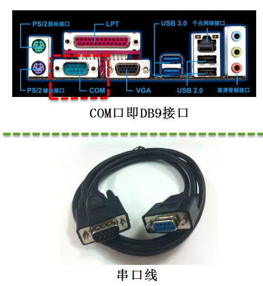

对于没有COM口的电脑，可以使用类似下图的USB转串口线，把USB端接
入电脑并安装对应的驱动程序即可。

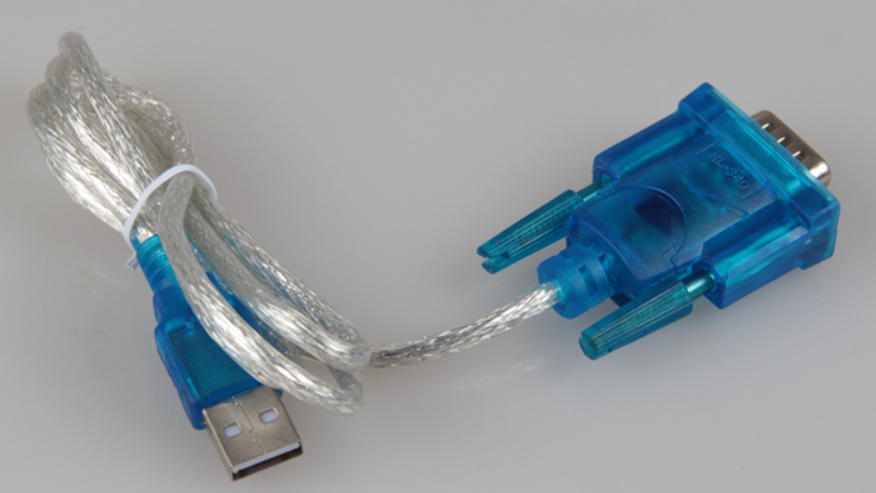

Windows上有很多串口通讯工具，如野火串口调试助手，终端
工具putty、xShell等，如下图所示。

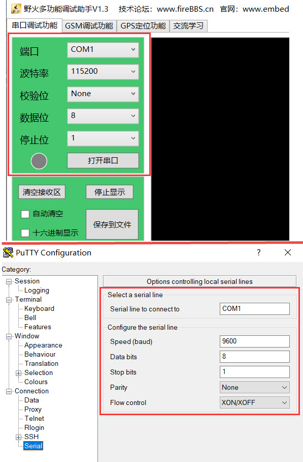

使用这些工具时，我们通常需要配置端口号、波特率、校验位、数据位以及停止位的参数。

-  端口号：在Windows上通常以COM1、COM2等方式命名，用于区
   分同一台电脑上的不同串口设备。

-  波特率：串口最常用的是异步通讯，它没有时钟信号同步数据，所以通讯双
   方需要约定好数据的传输速率，波特率就是指每秒传输的比特位数（bits per second）。常
   见的波特率为4800、9600、115200等，表示通讯双方传输时每秒传输4800、9600以及115200个二
   进制数据位。

-  通讯的起始和停止信号：串口通讯的一个数据包从起始信号开始，直到停止信号结束。数
   据包的起始信号由一个逻辑0的数据位表示，而数据包的停止信号可以用0.5、1、1.5或2个逻辑1的数
   据位表示。

-  有效数据：在数据包的起始位之后紧接着的就是要传输的主体数据内容，也称
   为有效数据，有效数据的长度常被约定为5、6、7或8位长。

-  数据校验：由于通信容易受到外部干扰导致传输出现偏差，在有效数据之后，有一个
   可选的数据校验位。校验方法有奇校验(odd)、偶校验(even)、0校验(space)、1校验(mark)以及无
   校验(noparity)。

在本章的学习中，对于上述概念的细节不了解也没有关系，只要知道串口通讯需要配置
这些参数，而且通讯双方的这些配置都一致即可。本章节聚焦于如何使用串口通讯、使用终端设备
文件，若想了解串口通讯协议的详细内容请参考裸机章节。

终端设备
~~~~~~~~~~~~

最初的计算机价格比较昂贵，往往带有一块控制计算机的面板，可用于对计算机进行一些
简单操作，这种被称为控制台（console）。每个用户通过终端（terminal）连接到主
机，终端和主机之间采用通信电缆相连接，甚至可以通过电信网络连接到另一个城市的
电脑。控制台与终端都是用于用户与系统进行交互的设备，区别
在于主机对于控制台的信任度高于终端。随着物理元器件的变化，计算机主机经历了
更新换代 ，"控制台终端"、"终端"这些名词都是表示的一个意思，基本没有什么区别了。

Teletype是最早出现的一种终端设备，类似于电传打字机，tty是 Teletype的缩写。最初tty是指
连接到Unix系统上的物理或者虚拟终端。但是随着时间的推移，tty也用于串口设备，如ttyn、ttySACn等，Linux系统
对终端设备的支持非常强大。

本章通过Linux的终端设备文件进行串口通讯。

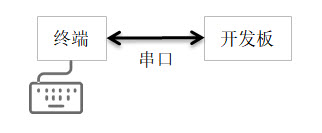

终端设备文件
^^^^^^^^^^^^^^^^^^

在Linux下终端的设备文件都位于/dev/目录下，以tty*开头的字符命名，可使用如下命令查看：

.. code-block:: sh
   :linenos:

   #查看/dev目录下的"tty"名字开头的设备，"*"表示匹配任意字符
   ls /dev/tty\*

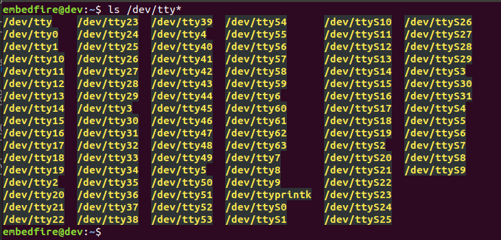

虽然/dev目录下有很多这样的设备，但它们并不是都可用的，为便于讲解，我们使用开发板上的tty设备进行说明。

在开发板的终端上执行同样的"ls /dev/tty*"命令，如下图所示。

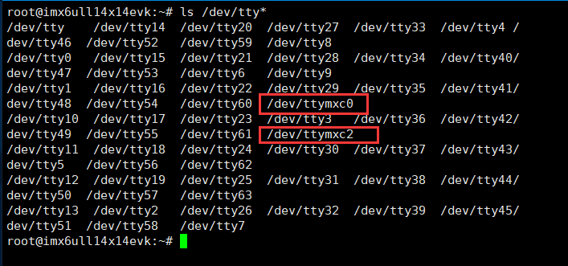

可以看到有个名为"ttymxc0"的设备，"ttymxc0"就是开发板的串口1，它已被默认被用在命令行的终端上。

stty命令
^^^^^^^^^^^^^^^^^^^^^^^^

Linux下有一个专门的stty命令可以查看或设置终端的参数。

在开发板的终端执行如下命令：

.. code-block:: sh
   :linenos:

   #在开发板的终端执行如下命令
   #它会输出当前终端的参数
   stty
   #查看ttymxc0设备参数
   stty -F /dev/ttymxc0

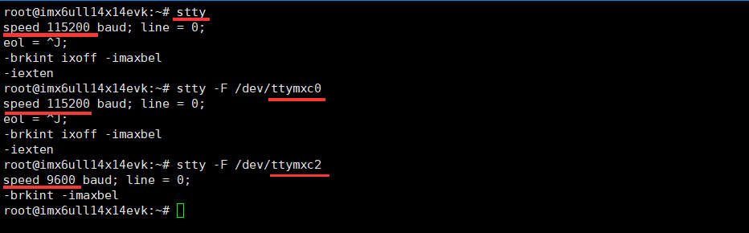

从上图中命令的执行结果可看到，ttymxc0的通讯速率"speed"为115200，
这就是串口通讯的波特率，这些是在驱动中设置的默认值。若用户想修改tty设备的配置，可以使用如下命令：

.. code-block:: sh
   :linenos:

   #在开发板的终端执行如下命令
   #查看设备参数
   stty -F /dev/ttymxc0
   #设置通讯速率，其中ispeed为输入速率，ospeed为输出速率
   stty -F /dev/ttymxc0 ispeed 9600 ospeed 9600

**注意:如果修改了串口1的波特率，相应的串口调试助手也要修改为对应波特率，否则开发板的串口终端将不能再使用**

命令中的ispeed和ospeed分别表示要设置的输入速率和输出速率，并不是所有设备
都支持不同的输入输出速率，所以最好把它们设置成一样。

串口通讯实验（Shell）
~~~~~~~~~~~~~~~~~~~~~~~~~~~~~~~~~~~~~~~

本实验使用开发板上的串口3进行实验，对应的设备文件为/dev/ttymxc2，这是因为驱动是从0开始编号的。
对tty的设备文件直接读写就可以控制设备通过串口接收或发送数据，下面我们使用开发板配合Windows下的串口调试助手或Linux下的minicom进行测试。

使能串口3
^^^^^^^^^^^

开发板串口3默认没有使能，参考前面《fire-config工具简介》章节，使能开发板的串口3外设。

如下图:

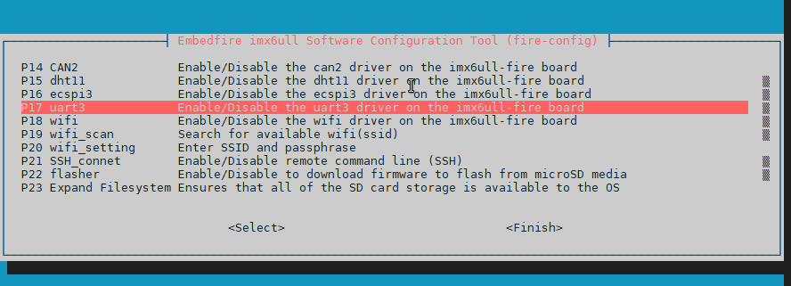

查询串口3的通信参数
^^^^^^^^^^^^^^^^^^^

串口3外设使能后，在/dev目录下生成ttymxc2设备文件，用stty工具查询其通信参数

.. code-block:: sh
   :linenos:

   #在开发板的终端执行如下命令
   stty -F /dev/ttymxc2

如下图:

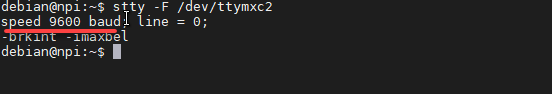

连接串口线及跳线帽
^^^^^^^^^^^^^^^^^^^^^^^^^^^

实验前需要使用串口线或USB转串口线把它与开发板与电脑连接起来，并且使用跳线帽连接
排针"UART3_TXD<---->T2IN"、"UART3_RXD<---->R2OUT"，如下图所示。

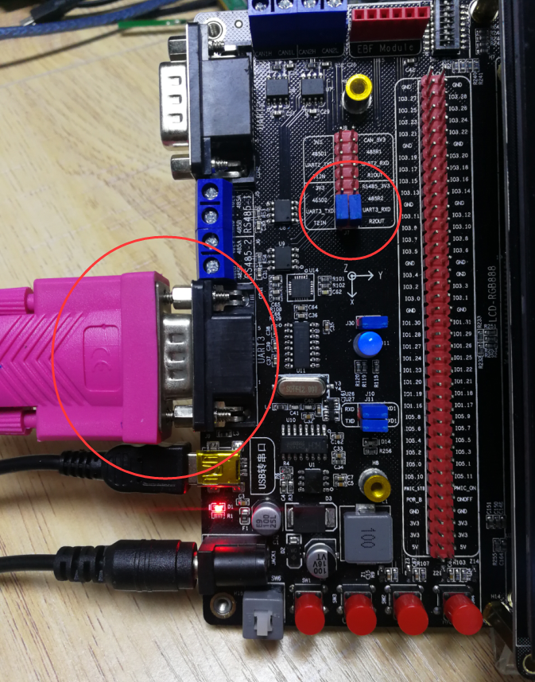

与Windows主机通讯
^^^^^^^^^^^^^^^^^^^^^^^^^^^^^^^^^^^^

配置串口调试助手
''''''''''''''''''''''''

在Windows的电脑端，打开串口调试助手，如下图所示。

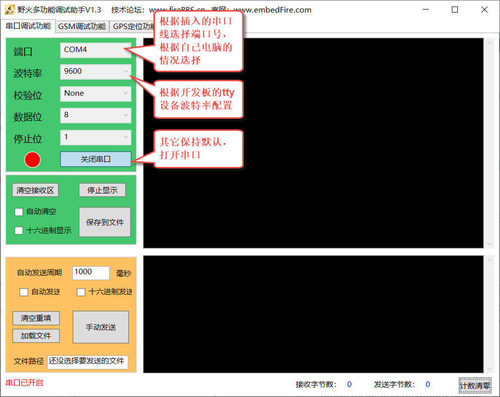

使用串口调试助手时，要注意端口号，如果是使用USB转串口线的话，可以在Windows系
统的设备管理器中查找到，把线从电脑上拔掉或插入可以看到设备列表的更新，从下图中可以
看到本电脑有两个CH340 USB转串口设备，其中COM4
是连接到开发板串口3的设备，COM5是连接到开发板的串口1终端的设备，请根据自己电脑的实际情况选择。

.. image:: media/uarttt012.png
   :align: center
   :alt: 未找到图片12|

另外还要注意串口的波特率，串口调试助手的波特率要与开发板串口的设置一致。

串口通讯实验
''''''''''''''''''

配置好串口调试助手后，尝试使用如下命令测试发送数据：

.. code-block:: sh
   :linenos:

   #在开发板上的终端执行如下指令
   #使用echo命令向终端设备文件写入字符串"board"、"embedfire"
   echo board > /dev/ttymxc2
   echo embedfire > /dev/ttymxc2
   #Windows上的串口调试助手会接收到内容

如下图:

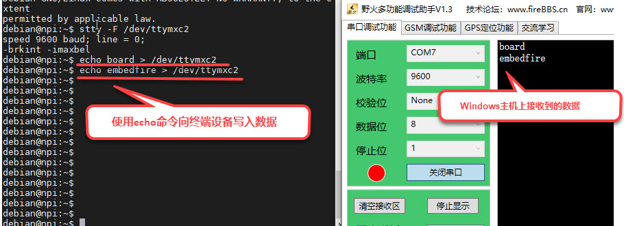

可以看到，往/dev/ttymxc2设备文件写入的内容会直接通过串口线发送至Winodws的主机。

而读取设备文件则可接收Winodws主机发往开发板的内容，可以使用cat命令来读取：

.. code-block:: sh
   :linenos:

   #在开发板上的终端执行如下指令
   #使用cat命令读取终端设备文件
   cat /dev/ttymxc2
   #cat命令会等待
   #使用串口调试助手发送字符串
   #字符串最后必须加回车！
   #开发板的终端会输出接收到的内容

如下图:

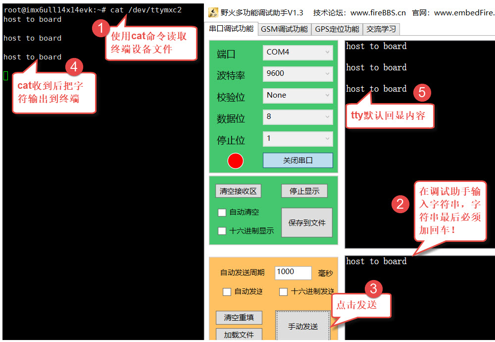

与Ubuntu主机通讯
^^^^^^^^^^^^^^^^^^^^^^^^^^^^^^^^^

分配USB转串口设备
''''''''''''''''''''''''''''''

在Linux下串口调试的过程也是类似的，不过要注意虚拟机的配置。

实验前同样要先接上USB转串口线到电脑上，并且在虚拟机界面的右下方设置把该USB设备分配到虚拟机上。

如下图:

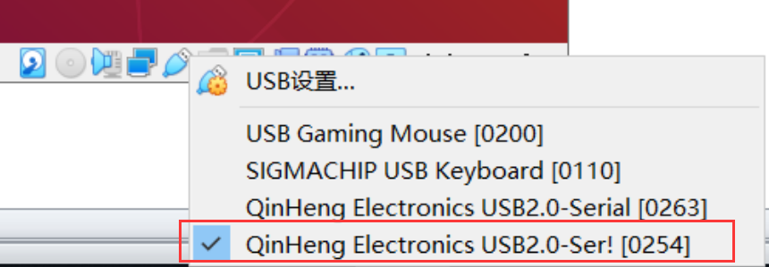

通过对比分配设备前后/dev/ 目录下的tty*文件，可以了解到插入的USB转串口线对应
的是哪个设备文件。在本主机中，新增的设备文件是"/dev/ttyUSB0"，如下图，请根据自己主机的情
况确认具体的设备文件，在后面配置串口参数时需要用到。

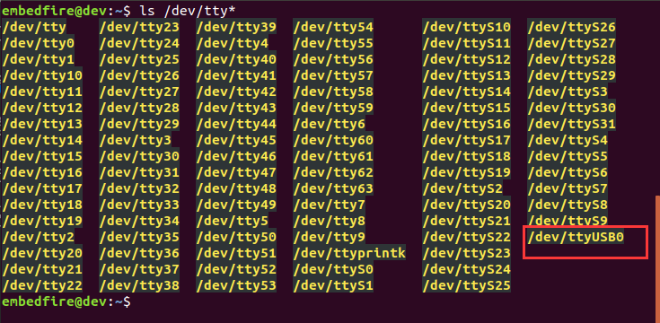

安装和配置minicom
''''''''''''''''''''''''''''''''''''

Linux下也有类似Windows的图形界面串口调试助手，不过此处想推荐大家
学习一款在Linux终端下的工具minicom，使用该工具可以在无界面的系统上调试串口。

在Ubuntu主机上可以直接用以下命令安装和配置minicom：

.. code-block:: sh
   :linenos:

   #以下命令在主机上执行
   sudo apt install minicom
   #安装成功后使用如下命令运行配置
   #需要使用sudo权限运行
   sudo minicom -s

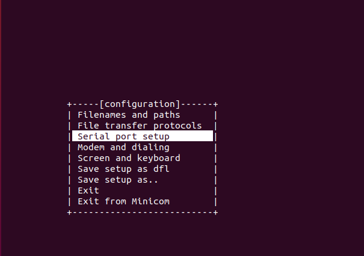

上图是minicom运行时的配置界面，注意执行minicom命令时需要使用sudo获取权限，否则无法
修改设备的参数。在该界面中使用键盘的上下方向键和回车键可以进入菜单进行配置，此处我
们选择"Serial port setup"菜单配置串口参数，如下图所示。

.. image:: media/uarttt018.png
   :align: center
   :alt: 未找到图片18|

在配置串口参数页面中根据提示的按键"A"、"E"、"F"配置串口设备为"/dev/ttyUSB0"（根据自己的电
脑设备选择）、波特率为"9600"、以及不使用硬件流控"No"，配置完成后按回车键退出当前菜
单。然后再选择"Save setup as dfl"菜单保存配置，见下图（若提示无法保
存，请确保前面是使用"sudo"权限运行minicom的），保存完成后选
择"Exit"菜单或按键盘的"Esc"键即可进入终端界面。

如下图:

.. image:: media/uarttt019.png
   :align: center
   :alt: 未找到图片19|

从配置菜单退出后可进入minicom的终端界面，也可以在保存
配置完全退出minicom后，重新执行命令打开它的终端：

#以下命令在Ubuntu主机上执行

.. code-block:: sh
   :linenos:

   sudo minicom

下图是minicom打开的终端界面，默认包含了当前打开的串口
设备信息，当该设备接收到内容时，会在终端上显示出来，而在终端输入的内容则会通过串口发送出去。

如下图:

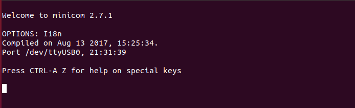

在minicom的终端界面中，按下Ctrl+A键再按下Z
键可以查看帮助，按下Ctrl+A键再按下X键可以退出。

.. _串口通讯实验-1:

串口通讯实验
''''''''''''''''''

配置好minicom后，就可以使用它与开发板进行串口通讯
实验了，操作方式与Windows下是类似的，在开发板使用echo和cat命令
对终端设备文件进行读写，实现串口通讯。

使用如下命令测试收发数据：

.. code-block:: sh
   :linenos:

   #在开发板上的终端执行如下指令
   #使用echo命令向终端设备文件写入字符串"board"、"embedfire"
   echo board > /dev/ttymxc2
   echo embedfire > /dev/ttymxc2

Ubuntu主机上的minicom会显示接收到内容

如下图:

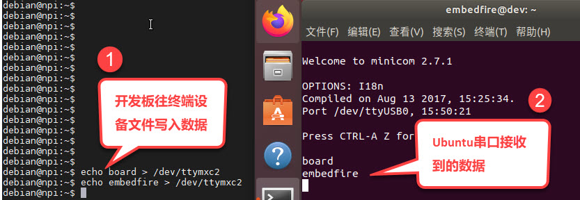

开发板接收串口内容的实验步骤如下：

.. code-block:: sh
   :linenos:

   #在开发板上的终端执行如下指令
   #使用cat命令读取终端设备文件
   cat /dev/ttymxc2
   #cat命令会等待
   #在Ubuntu主机的minicom界面输入内容
   #字符串最后必须加回车！
   #开发板的终端会输出接收到的内容

如下图:

.. image:: media/uarttt022.jpg
   :align: center
   :alt: 未找到图片22|

串口通讯实验（系统调用）
~~~~~~~~~~~~~~~~~~~~~~~~~~~~~~~~~~~~

如果只是想通过串口终端设备收发数据，那么使用open、read、write等系统调
用能轻易实现，操作的原理和前面的led、gpio、input设备并无区别，都是读写设备
文件。但是led、gpio和input除了主设备文件，还有众多的属性文件配合用于设置设备的运
行参数，如led的trigger文件，g
pio的direction文件，而终端设备却没有其它的属性文件，那
么stty命令和minicom工具是如何配置终端设备参数的呢？

实验代码分析
^^^^^^^^^^^^^^^^^^

我们直接通过修改串口终端参数的示例代码来解答这个疑惑，源码如下所示。

.. code-block:: c
   :caption: 串口通讯示例（base_code/linux_app/tty/c/source/main.c文件）
   :linenos: 

   #include <stdio.h>
   #include <stdlib.h>
   #include <unistd.h>
   #include <fcntl.h>
   #include <sys/stat.h>
   #include <sys/types.h>
   #include <termios.h>
   #include <string.h>
   #include <sys/ioctl.h>
   
   /第一部分代码/
   //根据具体的设备修改
   const char default_path[] = "/dev/ttymxc2";
   // const char default_path[] = "/dev/ttymxc2";
   
   
   int main(int argc, char \*argv[])
   {
   int fd;
   int res;
   char \*path;
   char buf[1024] = "Embedfire tty send test.\n";
   
   /第二部分代码/
   
   //若无输入参数则使用默认终端设备
   if (argc > 1)
   path = argv[1];
   else
   path = (char \*)default_path;
   
   //获取串口设备描述符
   printf("This is tty/usart demo.\n");
   fd = open(path, O_RDWR);
   if (fd < 0) {
   printf("Fail to Open %s device\n", path);
   return 0;
   }
   
   /第三部分代码/
   struct termios opt;
   
   //清空串口接收缓冲区
   tcflush(fd, TCIOFLUSH);
   // 获取串口参数opt
   tcgetattr(fd, &opt);
   
   //设置串口输出波特率
   cfsetospeed(&opt, B9600);
   //设置串口输入波特率
   cfsetispeed(&opt, B9600);
   //设置数据位数
   opt.c_cflag &= ~CSIZE;
   opt.c_cflag \|= CS8;
   //校验位
   opt.c_cflag &= ~PARENB;
   opt.c_iflag &= ~INPCK;
   //设置停止位
   opt.c_cflag &= ~CSTOPB;
   
   //更新配置
   tcsetattr(fd, TCSANOW, &opt);
   
   printf("Device %s is set to 9600bps,8N1\n",path);
   
   /第四部分代码/
   
   do {
   //发送字符串
   write(fd, buf, strlen(buf));
   //接收字符串
   res = read(fd, buf, 1024);
   if (res >0 ) {
   //给接收到的字符串加结束符
   buf[res] = '\0';
   printf("Receive res = %d bytes data: %s\n",res, buf);
   }
   } while (res >= 0);
   
   printf("read error,res = %d",res);
   
   close(fd);
   return 0;
   }

为便于讲解，我们把代码分成四个部分：

-  第一部分：定义了默认使用的串口终端设备路径及其它一些变量。

-  第二部分：根据main是否有输入参数确认使用哪个设备路径，并通过open的O_RDWR读写模式打开该设备。

-  第三部分：定义了一个结构体termios用于获取、设置终端设备的参数，包括波特率、数据位数、校验位等，这是
   本章的重点，在下一小节详细说明。

-  第四部分：在while循环中对终端设备使用read和write进行读写，从而
   控制串口收发数据。代码中在接收到的内容末尾加了’\0’结束符，主要是为了方便使用字符串的方式处理内容。

termios结构体
^^^^^^^^^^^^^^^^^^^^^^^^^^^^^^

示例代码中的第三部分，使用了termios结构体，它是在POSIX规范中定义的标准接口。Linux系统利
用termios来设置串口的参数，它是在头文件<termios.h>包含的<bits/termios.h>中定义的，该文
件中还包含了各个结构体成员可使用的宏值，请自己使用locate命令查找该文件
打开来阅读，关于termios结构体的定义摘录如下所示。

.. code-block:: c
   :caption: termios结构体（位于主机/usr/include/bits/termios.h文件）
   :linenos:  

   struct termios {
   tcflag_t c_iflag; /\* input mode flags \*/
   tcflag_t c_oflag; /\* output mode flags \*/
   tcflag_t c_cflag; /\* control mode flags \*/
   tcflag_t c_lflag; /\* local mode flags \*/
   cc_t c_line; /\* line discipline \*/
   cc_t c_cc[NCCS]; /\* control characters \*/
   speed_t c_ispeed; /\* input speed \*/
   speed_t c_ospeed; /\* output speed \*/
    #define \_HAVE_STRUCT_TERMIOS_C_ISPEED 1
    #define \_HAVE_STRUCT_TERMIOS_C_OSPEED 1
    };

下面我们介绍一下各个结构体成员，主要是关注c_iflag、c_cflag以及c_ispeed、c_ospeed即可：

-  c_iflag：输入（input）模式标志，用于控制如何对串口输入的字符进行处理，常用的选项值见下表。

表    c_iflag选项值

====== ========================
选项值 作用
====== ========================
INPCK  启用输入奇偶检测
IGNPAR 忽略帧错误和奇偶检验错误
IGNCR  忽略输入中的回车
IXON   开启XON/XOFF流控制
IXOFF  关闭XON/XOFF流控制
====== ========================

-  c_oflag：输出（output）模式标志，用于控制串口的输出模式，常用的选项值见下表。

表    c_oflag选项值

====== ===================================
选项值 作用
====== ===================================
ONLCR  将输出中的换行符NL映射为回车-换行CR
OCRNL  将输出的回车映射为换行符
ONLRET 不输出回车
OFILL  发送填充字符串
====== ===================================

-  c_cflag：控制（control）模式标志，用于控制串口的基本参数，如数据位、停止位等，常
用配置见下表，特别地，c_cflag结构体成员还包含了波特率的参数。

表   c_cflag选项值

====== ==============================================
选项值 作用
====== ==============================================
CSIZE  设置数据位长度，可以配置为CS5、CS6、CS7、CS8。
CSTOPB 如果设置 CSTOPB 标志，则使用两位停止位
PARENB 使能奇偶检验
PARODD 设置为奇校验
====== ==============================================

-  c_lflag：本地（local）模式标志，主要用于控制驱动程序与用户的交互，在串口通信中，实际上用不到该成员变量。

====== ===============================================================================
选项值 作用
====== ===============================================================================
ISIG   如果设置 ISIG 标志，当接收到字符INTR、QUIT等字符，系统会产生相应的信号。
ECHO   是否需要回显字符
ICANON 若设置了 ICANON 标志，则表示终端处于规范式输入状态，允许使用特殊字符EOF、KILL等
ECHONL 若该标志位和ICANON标志位同时被设置，则回显换行符NL
====== ===============================================================================

-  c_cc[NCCS]：该数组包含了终端的所有特殊字符，可以修改特殊字符对应
的键值（Ctrl+C产生的^C，ASCII码为0x03），部分内容如下表。

表   c_cc中各成员对应的下标值

============ =====================================================================================================
数组的下标值 作用
============ =====================================================================================================
VINTR        中断字符，若接收到该字符时，会发送SIGINT信号。当设置了c_lflag的ISIG标志位时，该字母不再作为输入传递。
VERASE       删除字符，删除上一个字符。
VIM          设置非标准模式读取的最小字节数
VTIM         设置非标准模式读取时的延时值，单位为十分之一秒。
============ =====================================================================================================

-  c_ispeed和c_ospeed：记录串口的输入和输出波特率（input speed和output speed），部分可
   取值如下代码所示，宏定义中的数字以"0"开头，在C语言中这是表示8进制数字的方式。

.. code-block:: c
   :caption: 波特率定义（位于/usr/include/bits/termios.h）
   :linenos:  

   //注意以0开头的数字在是C语言的8进制数字形式
   #define B1200 0000011
   #define B1800 0000012
   #define B2400 0000013
   #define B4800 0000014
   #define B9600 0000015
   #define B19200 0000016
   #define B38400 0000017

-  宏定义：termios结构体内部有_HAVE_STRUCT_TERMIOS_C_ISPEED和_HAVE_STRUCT_TERMIOS_C_OSPEED两个
   宏定义，它们的宏值都为1，表示它
   支持c_ispeed和c_ospeed表示方式，部分标准中不支持使用这两个结构体成员表示波特率，而只使用c_cflag来表示。

直接看结构体的定义比较抽象，下面我们以修改串口波特率、数据位、校验位和停止位的示例代码进行讲解。接下来几个小节的代码，是我们从base_code/linux_app/tty/c_full/sources/bsp_uart.c文件截取的，该文件以比较完善的方式封装了串口的配置，而本书提取出了代码中的重点
进行分析，感兴趣的读者可以打开配套的工程文件阅读。

配置串口波特率
'''''''''''''''''''''

修改终端串口波特率的示例代码如下所示。

.. code-block:: c
   :caption: 示例代码-修改串口波特率
   :linenos: 

   //定义termios型变量opt
   struct termios opt;
   //fd是使用open打开设备文件得到的文件句柄
   // 获取串口参数opt
   tcgetattr(fd, &opt);
   //设置串口输出波特率
   cfsetospeed(&opt, B9600);
   //设置串口输入波特率
    cfsetispeed(&opt, B9600);
    //更新配置
    tcsetattr(fd, TCSANOW, &opt);

代码中使用到了头文件termios.h的库函数tcgetattr、cfsetispeed、cfsetospeed和tcsetattr。

其中tcgetattr和tcsetattr函数分别用于读取和设置串口的参数，原型如下：

.. code-block:: sh
   :linenos:

   #include <termios.h>
   
   #include <unistd.h>
   
   int tcgetattr(int fd, struct termios \*termios_p);
   
   int tcsetattr(int fd, int optional_actions, const struct termios \*termios_p);

-  形参fd：指定串口设备文件的文件描述符。

-  形参termios_p：指向串口参数的结构体termios，tcgetattr读取到的参数会
   保存在该结构体中，而tcsetattr则根据该结构体配置设备参数。

-  形参optional_actions：仅tcsetattr函数有这个参数，它用于指示配置什么时候生效，它支持的配置参数如下：

-  TCSANOW表示立即生效。

-  TCSADRAIN表示待所有数据传输结束后配置生效。

-  TCSAFLUSH表示输入输出缓冲区为空时配置有效。

跟示例代码中的一样，通常都使用选项TCSANOW，让写入的参数配置立马生效。

代码中的cfsetispeed和cfsetospeed函数分别用于设置termios结构体的输入和输出波
特率，另外还有cfsetspeed函数可以同时设置输入和输出波特率参数为相
同的值，原型如下：

.. code-block:: sh
   :linenos:

   int cfsetispeed(struct termios \*termios_p, speed_t speed);
   
   int cfsetospeed(struct termios \*termios_p, speed_t speed);
   
   int cfsetspeed(struct termios \*termios_p, speed_t speed);

使用这些函数要注意两点：

-  speed参数需要使用类似前面代码定义的宏值。

-  这三个函数只是修改了termios的opt变量的内容，并没有写入到设备文件，因此在修改完
   它的内容后，还需要调用tcsetattr函数，把opt变量中的配置写入到设备，使它生效。

这就是修改终端设备参数的过程，读取原配置、修改termios参数、写入termios参数。

配置串口停止位
'''''''''''''''''''''

c_cflag中的标志位CSTOPB，用于设置串口通信停止位的长度。若该值为0，则停止位的长
度为1位；若设置该位为1，则停止位的长度为两位，具体实现如下所示。

.. code-block:: c
   :caption: 示例代码-配置停止位
   :linenos:  

   //在bits/termios.h文件中关于CSTOPB的定义
   //注意以0开头的数字在是C语言的8进制数字形式
   #define CSTOPB 0000100
   //
   //设置停止位示例
   //定义termios型变量opt
   struct termios opt;
   // 获取串口参数opt
    tcgetattr(fd, &opt);
   
    /\* 设置停止位*/
    switch (stopbits)
    {
    //设置停止位为1位
    case 1:
    opt.c_cflag &= ~CSTOPB;
    break;
    //设置停止位为2位
    case 2:
    opt.c_cflag \|= CSTOPB;
    break;
    }
   
    //更新配置
    tcsetattr(fd, TCSANOW, &opt);

示例代码依然是采取了获取当前参数、修改配置、更新配置的套路。

修改配置的代码中使用了"&=~"、"|="这种位操作
方法，主要是为了避免影响到变量
中的其它位，因为在c_cflag的其它位还包含了校验位、数据位和波特率相关的配置，如果直
接使用"="赋值，那其它配置都会受到影响，而且操作不方便。在后面学习裸机开发，对寄存器操作
时会经常用到这种方式。若没接触过这些位操
作方式，可参考本书附录中《第65章 位操作方法》的说明。

简单来说，示例中的"&=~"把c_cflag变量中CSTOPB对应的数
据位清0，而"|="则把c_cflag变量中CSTOPB对应的
数据位置1，达到在不影响其它配置的情况下把停止位配置为1位或两位。

配置串口校验位
''''''''''''''''''''''''''''

配置串口的校验位涉及到termios成员c_cflag的标志位PARENB、PARODD 以及c_iflag的标志
位INPCK，其中PARENB和INPCK共同决定是否使能奇偶校验，而PARODD 决定使用奇校验还是偶校验，配置的示例代码如下所示。

.. code-block:: c
   :caption: 示例代码-配置奇偶校验
   :linenos:  

   //bits/termios.h的位定义
   //注意以0开头的数字在是C语言的8进制数字形式
   /\* c_cflag bit meaning \*/
   #define PARENB 0000400
   #define PARODD 0001000
   /\* c_iflag bits \*/
   #define INPCK 0000020
   //
    //定义termios型变量opt
    struct termios opt;
    // 获取串口参数opt
    tcgetattr(fd, &opt);
   
    switch (parity)
    {
    case 'n':
    case 'N':
    options.c_cflag &= ~PARENB; /\* 不使用奇偶校验 \*/
    options.c_iflag &= ~INPCK; /\* 禁止输入奇偶检测 \*/
    break;
    case 'o':
    case 'O':
    options.c_cflag \|= PARENB; /\* 启用奇偶效验 \*/
    options.c_iflag \|= INPCK; /\* 启用输入奇偶检测 \*/
    options.c_cflag \|= PARODD ; /\* 设置为奇效验 \*/
    break;
    case 'e':
    case 'E':
    options.c_cflag \|= PARENB; /\* 启用奇偶效验 \*/
    options.c_iflag \|= INPCK; /\* 启用输入奇偶检测 \*/
    options.c_cflag &= ~PARODD; /\* 设置为偶效验*/
    break;
    }
   
    //更新配置
    tcsetattr(fd, TCSANOW, &opt);

配置非常简单，不校验时同时把PARENB和INPCK位清零，启用校验时把PARENB和INPCK同时置1，而PARODD为1时指定为奇校验，为0时是偶校验。

配置串口数据位
'''''''''''''''''''''

串口的数据位是由c_cflag中的CSIZE配置的，由于串
口支持5、6、7、8位的配置，一共有四种，所以在c_cflag中使用了两个数据
位进行配置，在配置前我们需要先对CSIZE数据位清零，然后再赋予5、6、7、8的宏配置值，具体代码如下所示。

.. code-block:: c
   :caption: 示例代码-设置数据位长度位
   :linenos:  

   //bits/termios.h的位定义
   //注意以0开头的数字在是C语言的8进制数字形式
   #define CSIZE 0000060
   #define CS5 0000000
   #define CS6 0000020
   #define CS7 0000040
   #define CS8 0000060
   //
    //定义termios型变量opt
    struct termios opt;
    // 获取串口参数opt
    tcgetattr(fd, &opt);
   
    //先清除CSIZE数据位的内容
    opt.c_cflag &= ~CSIZE;
   
    switch (databits) /*设置数据位数*/
    {
    case 5:
    opt.c_cflag \|= CS5;
    break;
    case 6:
    opt.c_cflag \|= CS6;
    break;
    case 7:
    opt.c_cflag \|= CS7;
    break;
    case 8:
    opt.c_cflag \|= CS8;
    break;
    }
    //更新配置
    tcsetattr(fd, TCSANOW, &opt);

学习了使用termios结构体配置串口参数的各种方式后，请再回过头看看前面的main.c示例文件代码，相信已经不用再介绍了。

编译及测试
^^^^^^^^^^^^^^^^^^^^

本实验使用的Makefile相对于前面的章节仅修改了最终的可执行文件名为tty_demo。

x86架构
''''''''''''''''''''

本实验的main.c实验代码使用的终端设备文件默认是开发板上的ttymxc2按键，在Ubuntu主机上并没
有这样的设备，如果想尝试在主机上使用，可以根据自己Ubuntu主机上可用的串口设备作为程
序的输入参数输入运行，如本书示例的"/dev/ttyUSB0"，它使用USB转串口线连接至了开发板的串口3
，并且连接了跳线帽。

实验的硬件连接和minicom的配置,请参考前面小节的内容，通讯时注意串口波特率要匹配。

在x86平台的编译测试过程如下：

.. code-block:: sh
   :linenos:

   #在主机的实验代码Makefile目录下编译
   #默认编译x86平台的程序
   make
   #查看可用的tty设备文件
   ls /dev/tty\*
   #请根据自己主机上的输出修改设备文件参数
   #程序需要使用sudo运行
   sudo ./build_x86/tty_demo /dev/ttyUSB0
   #在另一个设备通过串口发送内容至Ubuntu主机
   #本示例中是开发板与电脑连接，此处在开发板中使用echo命令发送内容至串口3
   #以下命令在开发板的终端执行
   #以下命令在开发板的终端执行
   #确认串口波特率
   stty -F /dev/ttymxc2
   #发送数据
   echo board > /dev/ttymxc2
   #Ubuntu主机端会收到数据并显示

如下图:

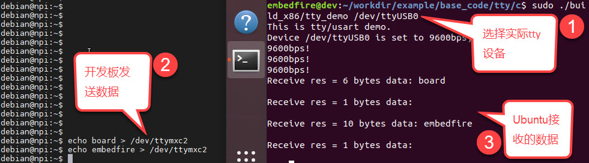

ARM架构
'''''''''''''''

对于ARM架构的程序，可使用如下步骤进行编译：

.. code-block:: sh
   :linenos:

   #在主机的实验代码Makefile目录下编译
   #编译arm平台的程序
   make ARCH=arm
   编译后生成的ARM平台程序为build_arm/tty_demo，使用网络文件系统
   共享至开发板，程序默认使用ttymxc2通讯，也可以自行指定输入设备路径。
   #以下命令在Ubuntu主机执行
   #以下命令在Ubuntu主机执行
   #根据自己主机的设备配置minicom，注意波特率要匹配
   #关于minicom的配置请参考前面小节的内容
   sudo minicom /dev/ttyUSB0
   #配置完毕打开minicom终端

----------------------------------------------------------------------

.. code-block:: sh
   :linenos:

   #以下命令在开发板上的终端执行
   #在NFS共享的工程目录路径执行
   #使用默认的ttymxc2设备通讯
   ./build_arm/tty_demo
   #程序会通过串口发送内容至主机
   #主机使用minicom可发送内容至开发板

如下图:

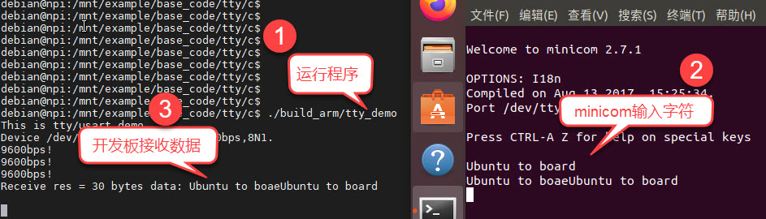

ioctl系统调用
~~~~~~~~~~~~~~~~~~~~~~~~~~~

通过前面的学习我们已经掌握了配置串口参数的方法，就是对设备文件操作，前面代码中使用
到的文件操作摘录如下所示。

.. code-block:: c
   :caption: 跟设备文件相关的函数操作
   :linenos:  

   //前面实验中对设备文件操作的函数
   fd = open(path, O_RDWR);
   write(fd, buf, strlen(buf));
   read(fd, buf, 1024);
   close(fd);
   tcgetattr(fd, &opt);
   tcsetattr(fd, TCSANOW, &opt);

仔细分析这些操作，发现万里晴空出现了两朵乌云。open、write、read、close都是Linux的系统调
用，而tcgetattr、tcsetattr则是库函数。而且按照传统的认知，文件操作大都是跟
内容挂勾的，上一章节的input事件设备文件记录了上报的事件信息，而tty设备的文件却不是记录串口
终端的配置参数，因为对文件的write操作是对外发送数据，而read则是读取接收
到的数据，也就是说，"tty*"文件并没有记录串口终端的配置信息，那么tcgetattr、tcsetattr这两个函数究竟做了什么神仙操作？

它们实际上都是对ioctl系统调用的封装。

ioctl原型
^^^^^^^^^^^^^^^^^^^^^

ioctl系统调用的功能是向设备文件发送命令，控制一些特殊操作，它的函数原型如下：

.. code-block:: sh
   :linenos:

   #include <sys/ioctl.h>
   int ioctl(int fd, unsigned long request, ...);

-  参数fd：与write、read类似，fd文件句柄指定要操作哪个文件。

-  参数reques：操作请求的编码，它是跟硬件设备驱动相关的，不同驱动设备支持不同的编码，驱动程序通常会使用头文件提供可用的编码给上层用户。

-  参数"…"：这是一个没有定义类型的指针，它与printf函数定义中的"…"类似，不过ioctl此处只能
   传一个参数。部分驱动程序执行操作请求时可能需要配置参数，或者操作完成时需要返回数据，都是通过此处传的指针进行访问的。

使用ioctl代替tcgetattr和tcsetattr
^^^^^^^^^^^^^^^^^^^^^^^^^^^^^^^^^^^^^^^^^^^^^^^^^^^^^

我们编写了工程文件来进行说明，本小节的工程目录：base_code/linux_app/tty/c_ioctl。

工程示例文件如下所示。

.. code-block:: c
   :caption: 使用ioctl的示例（base_code/linux_app/tty/c_ioctl/source/main.c文件）
   :linenos:  

   #include <stdio.h>
   #include <stdlib.h>
   #include <unistd.h>
   #include <fcntl.h>
   #include <sys/stat.h>
   #include <sys/types.h>
   #include <termios.h>
   #include <string.h>
   #include <sys/ioctl.h>

   //根据具体的设备修改
   const char default_path[] = "/dev/ttymxc2";
   // const char default_path[] = "/dev/ttymxc2";

   int main(int argc, char *argv[])
   {
      int fd;
      int res;
      struct termios opt;
      char *path;
      char buf[1024] = "Embedfire tty send test.\n";

      //若无输入参数则使用默认终端设备
      if(argc > 1)
         path = argv[1];
      else
         path = (char *)default_path;

      //获取串口设备描述符
      printf("This is tty/usart demo.\n");
      fd = open(path, O_RDWR);
      if(fd < 0){
         printf("Fail to Open %s device\n", path);
         return 0;
      }
      //清空串口接收缓冲区
      tcflush(fd, TCIOFLUSH);
      // 获取串口参数opt
      // tcgetattr(fd, &opt);

      res = ioctl(fd,TCGETS, &opt);

      opt.c_ispeed = opt.c_cflag & (CBAUD | CBAUDEX);
      opt.c_ospeed = opt.c_cflag & (CBAUD | CBAUDEX);

      //输出宏定义的值，方便对比
      printf("Macro B9600 = %#o\n",B9600);
      printf("Macro B115200 = %#o\n",B115200);
      //输出读取到的值
      printf("ioctl TCGETS,opt.c_ospeed = %#o\n", opt.c_ospeed);
      printf("ioctl TCGETS,opt.c_ispeed = %#o\n", opt.c_ispeed);
      printf("ioctl TCGETS,opt.c_cflag = %#x\n", opt.c_cflag);

      speed_t change_speed = B9600;
      if(opt.c_ospeed == B9600)
         change_speed = B115200;

      //设置串口输出波特率
      cfsetospeed(&opt, change_speed);
      //设置串口输入波特率
      cfsetispeed(&opt, change_speed);
      //设置数据位数
      opt.c_cflag &= ~CSIZE;
      opt.c_cflag |= CS8;
      //校验位
      opt.c_cflag &= ~PARENB;
      opt.c_iflag &= ~INPCK;
      //设置停止位
      opt.c_cflag &= ~CSTOPB;

      //更新配置
      // tcsetattr(fd, TCSANOW, &opt);   
      res = ioctl(fd,TCSETS, &opt);

      //再次读取
      res = ioctl(fd,TCGETS, &opt);

      opt.c_ispeed = opt.c_cflag & (CBAUD | CBAUDEX);
      opt.c_ospeed = opt.c_cflag & (CBAUD | CBAUDEX);

      printf("ioctl TCGETS after TCSETS\n");

      //输出读取到的值
      printf("ioctl TCGETS,opt.c_ospeed = %#o\n", opt.c_ospeed);
      printf("ioctl TCGETS,opt.c_ispeed = %#o\n", opt.c_ispeed);
      printf("ioctl TCGETS,opt.c_cflag = %#x\n", opt.c_cflag);

      do{
         //发送字符串
         write(fd, buf, strlen(buf));
         //接收字符串
         res = read(fd, buf, 1024);		
         if(res >0 ){
            //给接收到的字符串加结束符
            buf[res] = '\0';
            printf("Receive res = %d bytes data: %s\n",res, buf);
         }
      }while(res >= 0);

      printf("read error,res = %d",res);

      close(fd);
      return 0;
   }

本实验代码就是直接通过ioctl系统调用代替了tcgetattr和tcsetattr这两个库函数。

-  在示例代码中的第41行和76行，使用ioctl向设备文件发送了"TCGETS"请求，在tty设备
   的驱动层，会根据这个请求返回配置参数，并通过传入的&opt指针传出。

-  类似地，示例代码中的第73行，使用ioctl向设备文件发送了"TCSETS"请求，在tty设备
   的驱动层，会根据这个请求设置由指针&opt传入的配置参数，修改设备的属性。

-  特别地，由于使用ioctl获取配置参数时，波特率的值不会直接写入到termios结构体
   的c_ispeed和c_ospeed成员，需要通过c_cflag的值运算得出，所以第43、44行和78、79行加入了运算转
   换，运算出来的值是B9600或B115200之类的值。如果不进行这样的运算操作，c_ispeed和c_ospeed得到的值可能是不对的。

-  代码的其它部分是输出的一些调试信息，方便在实验时验证获取到的信息是否正确。

关于ioctl的TCGETS和TCSETS参数，可以在man手册中查看，使用如下命令：

.. code-block:: sh
   :linenos:

   man ioctl_tty

如下图:

.. image:: media/uarttt025.png
   :align: center
   :alt: 未找到图片25|

ioctl系统调用应用非常广泛，因为并不是所有设备都仅有读写操作，例如控制CD-ROM的
弹出和收回，特殊设备的机械操作，又或者我们自己编写LED驱动程序也可以对
上层提供指令
实现花式点灯，在以后编写驱动程序时，我们再来学习与ioctl系统调用相关的接口。

.. _编译及测试-1:

编译及测试
^^^^^^^^^^^^^^^

本实验使用的Makefile相对于前面的章节仅修改了最终的可执行文件名为tty_demo。

.. _x86架构-1:

x86架构
'''''''''''''''

本实验主要是为了验证ioctl是否能获取或设置串口终端设备的参数，如果想进行通
讯测试请参照上一小节的说明，操作是类似的，匹配波特率即可。

在x86平台的编译测试过程如下：

.. code-block:: sh
   :linenos:

   #在主机的实验代码Makefile目录下编译
   #默认编译x86平台的程序
   make
   #查看可用的tty设备文件
   ls /dev/tty\*
   #请根据自己主机上的输出修改设备文件参数
   #可以使用stty命令查看当前设备参数
   sudo stty -F /dev/ttyUSB0
   #程序需要使用sudo运行
   sudo ./build_x86/tty_demo /dev/ttyUSB0
   #程序运行时会输出获取到的波特率及c_cflag配置，并把波特率设置为B9600或B115200

如下图:

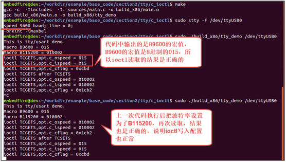

.. _arm架构-1:

ARM架构
'''''''''''''''

对于ARM架构的程序，可使用如下步骤进行编译：

.. code-block:: sh
   :linenos:

   #在主机的实验代码Makefile目录下编译
   #编译arm平台的程序
   make ARCH=arm

编译后生成的ARM平台程序为build_arm/tty_demo，使用网络文件系
统共享至开发板，程序默认使用ttymxc2设备，也可以自行指定输入设备路径。

.. code-block:: sh
   :linenos:

   #以下命令在开发板上的终端执行
   #以下命令在开发板上的终端执行
   
   #请根据自己主机上的输出修改设备文件参数
   
   #可以使用stty命令查看当前设备参数
   
   stty -F /dev/ ttymxc2
   
   #程序需要使用sudo运行
   
   ./build_arm/tty_demo /dev/ttymxc2
   
   #程序运行时会输出获取到的波特率及c_cflag配置，并把波特率设置为B9600或B115200

如下图:

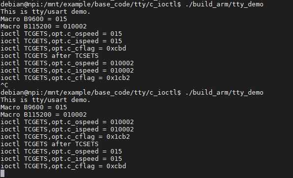

查看glibc源码
~~~~~~~~~~~~~~~~~~~~~~~~~~~

如果你问我，是怎么知道这些的tcgetattr.c和tcsetattr.c是通过ioctl系统调
用实现的，又是如何知道c_ispeed和c_ospeed需要通过c_cflag成员运算得出的？答案
是查看源码，我们一直在强调Linux是开放的，就看我们如何挖掘这些宝藏了。

既然它们是库函数，那我们就到glibc的源码中找找，glibc的源码可以到其
官网下载：\ http://www.gnu.org/software/libc/\ ，下载到源码后，使用VS Code编辑
器的搜索功能，就可以搜到相关的内容，如下图所示。

.. image:: media/uarttt028.png
   :align: center
   :alt: 未找到图片28|

这两个函数的定义位于glibc源码的如下目录： glibc/sysdeps/unix/sysv/linux/，该
目录中的tcgetattr.c和tcsetattr.c文件分别定义了这两个函数。这两个文件
我们也拷贝了一份到工程的如下目录，方便查看：
base_code/linux_app/tty/c_ioctl/glibc_file。

tcgetattr.c文件的内容如下。

.. code-block:: c
   :caption: tcgetattr的glibc源码（glibc/sysdeps/unix/sysv/linux/tcgetattr.c文件）
   :linenos:  

   int
   __tcsetattr (int fd, int optional_actions, const struct termios *termios_p)
   {
   struct __kernel_termios k_termios;
   unsigned long int cmd;

   switch (optional_actions)
      {
      case TCSANOW:
         cmd = TCSETS;
         break;
      case TCSADRAIN:
         cmd = TCSETSW;
         break;
      case TCSAFLUSH:
         cmd = TCSETSF;
         break;
      default:
         return INLINE_SYSCALL_ERROR_RETURN_VALUE (EINVAL);
      }

   k_termios.c_iflag = termios_p->c_iflag & ~IBAUD0;
   k_termios.c_oflag = termios_p->c_oflag;
   k_termios.c_cflag = termios_p->c_cflag;
   k_termios.c_lflag = termios_p->c_lflag;
   k_termios.c_line = termios_p->c_line;
   #if _HAVE_C_ISPEED && _HAVE_STRUCT_TERMIOS_C_ISPEED
   k_termios.c_ispeed = termios_p->c_ispeed;
   #endif
   #if _HAVE_C_OSPEED && _HAVE_STRUCT_TERMIOS_C_OSPEED
   k_termios.c_ospeed = termios_p->c_ospeed;
   #endif
   memcpy (&k_termios.c_cc[0], &termios_p->c_cc[0],
      __KERNEL_NCCS * sizeof (cc_t));

   return INLINE_SYSCALL (ioctl, 3, fd, cmd, &k_termios);
   }
   
   libc_hidden_def (__tcgetattr)
   weak_alias (__tcgetattr, tcgetattr)

代码看起来有点复杂，但刚接触的时候我们不需要完全弄清楚它的所有细节：

-  第7行：它使用ioctl发送了TCGETS请求，并传入了&k_termios指针记录参数。

-  第10行开始，都是把读取到的k_termios内容复制到__tcgetattr传入的termios_p中指针指向的
   变量中，而c_ispeed和c_ospeed就是在第19、26行通过c_cflag运算得到的，所以我们使用tcgetattr库函
   数的时候，不需要自己再运算赋值，而自己通过ioctl读取
   配置时则要加上运算转换。

glibc源码中使用了很多特别的宏或封装，如INLINE_SYSCALL、__glibc_likely、weak_alias等，感兴趣
的读者可以查阅glibc官方的相关文档学习。

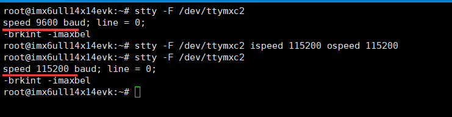

.. |uarttt012| image:: media/uarttt012.png
   :width: 3.12377in
   :height: 3.125in

.. |uarttt018| image:: media/uarttt018.png
   :width: 5.76806in
   :height: 1.64802in
.. |uarttt019| image:: media/uarttt019.png
   :width: 3.88889in
   :height: 1.86806in

.. |uarttt022| image:: media/uarttt022.jpg
   :width: 5.76806in
   :height: 1.61667in

.. |uarttt025| image:: media/uarttt025.png
   :width: 5.76806in
   :height: 4.52499in
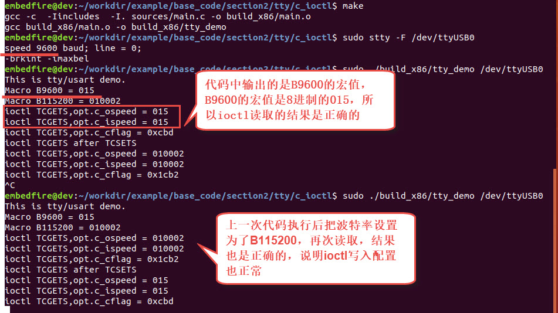

.. |uarttt028| image:: media/uarttt028.png
   :width: 2.83751in
   :height: 3.15972in
