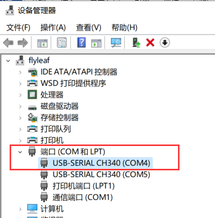
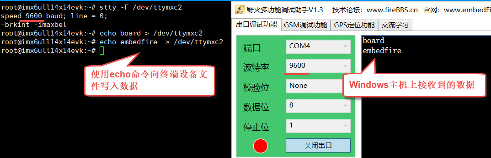
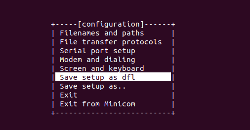
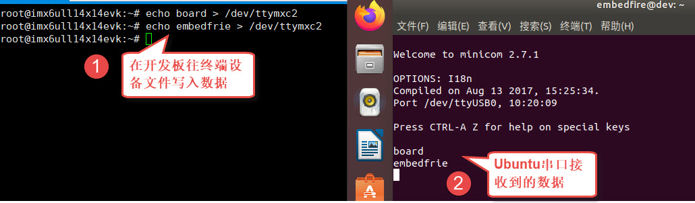
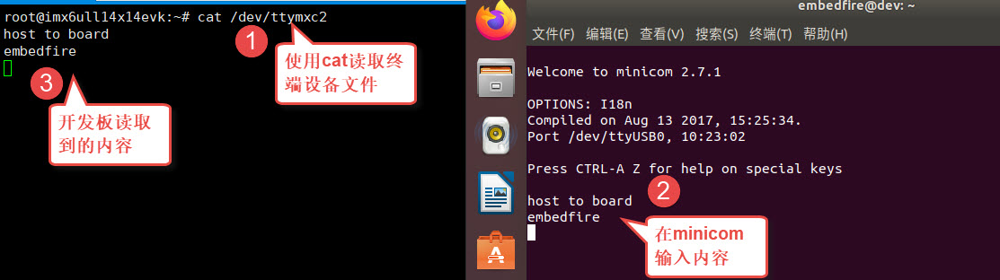
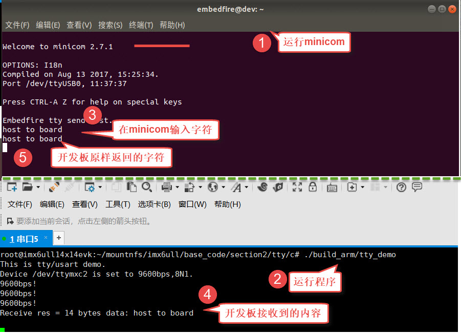
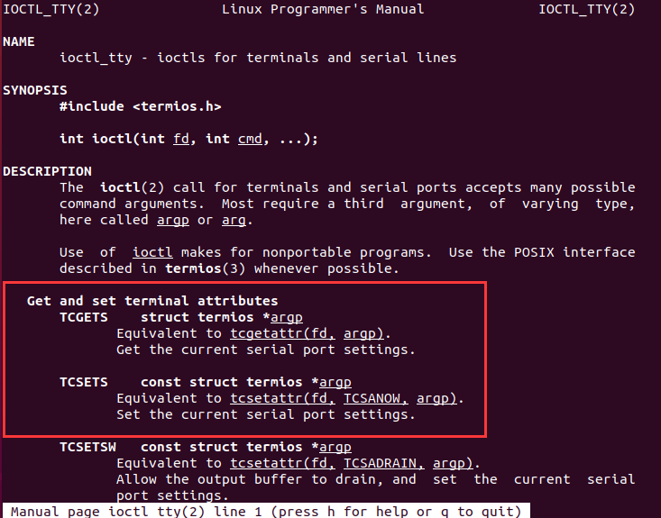
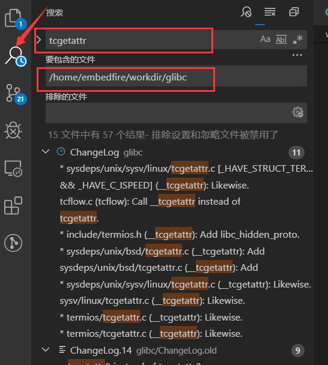

.. vim: syntax=rst

串口通讯与终端设备
---------

本章主要讲解串口和终端设备的基本使用，并且通过这个过程解构如何使用ioctl系统调用向设备文件写入特别的命令，控制硬件。我们需要熟悉ioctl的使用，是因为在后面编写驱动时，某些硬件需要向内核提供ioctl所需的操作方法。

本章节的示例代码目录为：base_code/section2/tty

串口通讯简介
~~~~~~

串口通讯(Serial Communication)是一种设备间非常常用的串行通讯方式，因为它简单便捷，大部分电子设备都支持，电子工程师在调试设备时也经常使用串口来输出调试信息，在计算机的上古时代，键盘、鼠标、MODEM以及终端都是使用串口通讯的。本书配套的开发板默认也是使用串口终端，不过为了方便使
用，开发板上添加了USB转串口芯片，使得我们可以直接用USB线连接主机和开发板的串口。

串口在旧式的台式计算机中一般会以RS-232标准的COM口出现(也称DB9接口)，见图 23‑1。

|uarttt002|

图 23‑1 电脑主板上的COM口及串口线

对于没有COM口的电脑，可以使用类似图 23‑2的USB转串口线，把USB端接入电脑并安装对应的驱动程序即可。

|uarttt003|

图 23‑2 USB转串口线

Windows上有很多串口通讯工具，如野火串口调试助手，终端工具putty、xShell等，如图 23‑3。

|uarttt004|

图 23‑3 串口调试工具

使用这些工具时，我们通常需要配置端口号、波特率、校验位、数据位以及停止位的参数。

-  端口号：在Windows上通常以COM1、COM2等方式命名，用于区分同一台电脑上的不同串口设备。

-  波特率：串口最常用的是异步通讯，它没有时钟信号同步数据，所以通讯双方需要约定好数据的传输速率，波特率就是指每秒传输的比特位数（bits per second）。常见的波特率为4800、9600、115200等，表示通讯双方传输时每秒传输4800、9600以及115200个二进制数据位。

-  通讯的起始和停止信号：串口通讯的一个数据包从起始信号开始，直到停止信号结束。数据包的起始信号由一个逻辑0的数据位表示，而数据包的停止信号可以用0.5、1、1.5或2个逻辑1的数据位表示。

-  有效数据：在数据包的起始位之后紧接着的就是要传输的主体数据内容，也称为有效数据，有效数据的长度常被约定为5、6、7或8位长。

-  数据校验：由于通信容易受到外部干扰导致传输出现偏差，在有效数据之后，有一个可选的数据校验位。校验方法有奇校验(odd)、偶校验(even)、0校验(space)、1校验(mark)以及无校验(noparity)。

在本章的学习中，对于上述概念的细节不了解也没有关系，只要知道串口通讯需要配置这些参数，而且通讯双方的这些配置都一致即可。本章节聚焦于如何使用串口通讯、使用终端设备文件，若想了解串口通讯协议的详细内容请参考裸机章节。

终端设备
~~~~

最初的计算机价格比较昂贵，往往带有一块控制计算机的面板，可用于对计算机进行一些简单操作，这种被称为控制台（console）。每个用户通过终端（terminal）连接到主机，终端和主机之间采用通信电缆相连接，甚至可以通过电信网络连接到另一个城市的电脑。控制台与终端都是用于用户与系统进行交互的设备，区别
在于主机对于控制台的信任度高于终端。随着物理元器件的变化，计算机主机经历了更新换代 ，“控制台终端”、“终端”这些名词都是表示的一个意思，基本没有什么区别了。

Teletype是最早出现的一种终端设备，类似于电传打字机，tty是 Teletype的缩写。最初tty是指连接到Unix系统上的物理或者虚拟终端。但是随着时间的推移，tty也用于串口设备，如ttyn、ttySACn等，Linux系统对终端设备的支持非常强大。

本章通过Linux的终端设备文件进行串口通讯。

|uarttt005|

图 23‑4 终端与开发板

终端设备文件
^^^^^^

在Linux下终端的设备文件都位于/dev/目录下，以tty*开头的字符命名，可使用如下命令查看：

#查看/dev目录下的“tty”名字开头的设备，“*”表示匹配任意字符

ls /dev/tty\*

|uarttt006|

图 23‑5 /dev目录下的tty设备

虽然/dev目录下有很多这样的设备，但它们并不是都可用的，为便于讲解，我们使用开发板上的tty设备进行说明。

在开发板的终端上执行同样的“ls /dev/tty*”命令，如图 23‑6。

|uarttt007|

图 23‑6 开发板上的终端设备

可以看到有两个分别名为“ttymxc0”和“ttymxc2”的设备，其中“ttymxc0”是开发板的串口1，它已被默认被用在命令行的终端上，“ttymxc2”是开发板的串口3。

stty命令
^^^^^^

Linux下有一个专门的stty命令可以查看或设置终端的参数。

在开发板的终端执行如下命令：

#在开发板的终端执行如下命令

#它会输出当前终端的参数

stty

#查看ttymxc0设备参数

stty -F /dev/ttymxc0

#查看ttymxc2设备参数

stty -F /dev/ttymxc2

|uarttt008|

图 23‑7 输出当前终端的参数

从图 23‑7中命令的执行结果可看到，ttymxc0的通讯速率“speed”为115200，ttymxc2的通讯速率为9600，这就是串口通讯的波特率，这些是在驱动中设置的默认值。若用户想修改tty设备的配置，可以使用如下命令：

#在开发板的终端执行如下命令

#查看设备参数

stty -F /dev/ttymxc2

#设置通讯速率，其中ispeed为输入速率，ospeed为输出速率

stty -F /dev/ttymxc2 ispeed 115200 ospeed 115200

#查看设备参数

stty -F /dev/ttymxc2

|uarttt009|

图 23‑8 使用stty修改终端参数

命令中的ispeed和ospeed分别表示要设置的输入速率和输出速率，并不是所有设备都支持不同的输入输出速率，所以最好把它们设置成一样。可以看到命令执行后ttymxc2设备的速率变为了115200。

串口通讯实验（Shell）
~~~~~~~~~~~~~

对tty的设备文件直接读写就可以控制设备通过串口接收或发送数据，下面我们使用开发板配合Windows下的串口调试助手或Linux下的minicom进行测试

连接串口线及跳线帽
^^^^^^^^^

本实验使用/dev/ttymxc2设备文件进行实验，也就是开发板上的串口3，实验前需要使用串口线或USB转串口线把它与开发板与电脑连接起来，并且使用跳线帽连接排针“UART3_TXD<---->T2IN”、“UART3_RXD<---->R2OUT”，如图 23‑9。

|uarttt010|

图 23‑9 连接串口线和跳帽

与Windows主机通讯
^^^^^^^^^^^^

配置串口调试助手
''''''''

在Windows的电脑端，打开串口调试助手，如图 23‑10。

|uarttt011|

图 23‑10 Windows的串口调试助手配置

使用串口调试助手时，要注意端口号，如果是使用USB转串口线的话，可以在Windows系统的设备管理器中查找到，把线从电脑上拔掉或插入可以看到设备列表的更新，从图 23‑11中可以看到本电脑有两个CH340 USB转串口设备，其中COM4
是连接到开发板串口3的设备，COM5是连接到开发板的串口1终端的设备，请根据自己电脑的实际情况选择。

|uarttt012|

图 23‑11 设备管理器下的COM设备

另外还要注意串口的波特率，串口调试助手的波特率要与开发板串口的设置一致。

串口通讯实验
''''''

配置好串口调试助手后，尝试使用如下命令测试发送数据：

#在开发板上的终端执行如下指令

#查看设备参数，确认波特率与串口调试助手的一致

stty -F /dev/ttymxc2

#使用echo命令向终端设备文件写入字符串“board”

echo board > /dev/ttymxc2

#Windows上的串口调试助手会接收到内容

|uarttt013|

图 23‑12 使用串口从开发板向Windows主机发送内容

从图 23‑12可看到，往/dev/ttymxc2设备文件写入的内容会直接通过串口线发送至Winodws的主机。

而读取设备文件则可接收Winodws主机发往开发板的内容，可以使用cat命令来读取：

#在开发板上的终端执行如下指令

#使用cat命令读取终端设备文件

cat /dev/ttymxc2

#cat命令会等待

#使用串口调试助手发送字符串

#字符串最后必须加回车！

#开发板的终端会输出接收到的内容

|uarttt014|

图 23‑13 从串口接收Windows主机发送到板子的内容

与Ubuntu主机通讯
^^^^^^^^^^^

分配USB转串口设备
''''''''''

在Linux下串口调试的过程也是类似的，不过要注意虚拟机的配置。

实验前同样要先接上前面图 23‑2中的USB转串口线到电脑上，并且在虚拟机界面的右下方设置把该USB设备分配到虚拟机上。

|uarttt015|

图 23‑14分配USB转串口设备到虚拟机上

通过对比分配设备前后/dev/ 目录下的tty*文件，可以了解到插入的USB转串口线对应的是哪个设备文件。在本主机中，新增的设备文件是“/dev/ttyUSB0”，如图 23‑15，请根据自己主机的情况确认具体的设备文件，在后面配置串口参数时需要用到。

|uarttt016|

图 23‑15 插入USB转串口线后新增的设备

安装和配置minicom
''''''''''''

Linux下也有类似Windows的图形界面串口调试助手，不过此处想推荐大家学习一款在Linux终端下的工具minicom，使用该工具可以在无界面的系统上调试串口。

在Ubuntu主机上可以直接用以下命令安装和配置minicom：

#以下命令在主机上执行

sudo apt install minicom

#安装成功后使用如下命令运行配置

#需要使用sudo权限运行

sudo minicom -s

|uarttt017|

图 23‑16 minicom运行配置界面

图 23‑16是minicom运行时的配置界面，注意执行minicom命令时需要使用sudo获取权限，否则无法修改设备的参数。在该界面中使用键盘的上下方向键和回车键可以进入菜单进行配置，此处我们选择“Serial port setup”菜单配置串口参数，如图 23‑17。

|uarttt018|

图 23‑17 minicom修改串口配置

在配置串口参数页面中根据提示的按键“A”、“E”、“F”配置串口设备为“/dev/ttyUSB0”（根据自己的电脑设备选择）、波特率为“9600”、以及不使用硬件流控“No”，配置完成后按回车键退出当前菜单。然后再选择“Save setup as dfl”菜单保存配置，见图
23‑18（若提示无法保存，请确保前面是使用“sudo”权限运行minicom的），保存完成后选择“Exit”菜单或按键盘的“Esc”键即可进入终端界面。

|uarttt019|

图 23‑18 minicom保存配置

从配置菜单退出后可进入minicom的终端界面，也可以在保存配置完全退出minicom后，重新执行命令打开它的终端：

#以下命令在Ubuntu主机上执行

minicom

图 23‑19是minicom打开的终端界面，默认包含了当前打开的串口设备信息，当该设备接收到内容时，会在终端上显示出来，而在终端输入的内容则会通过串口发送出去。

|uarttt020|

图 23‑19 minicom终端运行界面

在minicom的终端界面中，按下Ctrl+A键再按下Z键可以查看帮助，按下Ctrl+A键再按下X键可以退出。

.. _串口通讯实验-1:

串口通讯实验
''''''

配置好minicom后，就可以使用它与开发板进行串口通讯实验了，操作方式与Windows下是类似的，在开发板使用echo和cat命令对终端设备文件进行读写，实现串口通讯。

使用如下命令测试收发数据：

#在开发板上的终端执行如下指令

#查看设备参数，确认波特率与串口调试助手的一致

stty -F /dev/ttymxc2

#使用echo命令向终端设备文件写入字符串“board”

echo board > /dev/ttymxc2

#Ubuntu主机上的minicom会显示接收到内容

|uarttt021|

图 23‑20 使用minicom接收开发板的数据

开发板接收串口内容的实验步骤如下：

#在开发板上的终端执行如下指令

#使用cat命令读取终端设备文件

cat /dev/ttymxc2

#cat命令会等待

#在Ubuntu主机的minicom界面输入内容

#字符串最后必须加回车！

#开发板的终端会输出接收到的内容

|uarttt022|

图 23‑21 使用minicom发送数据到开发板

串口通讯实验（系统调用）
~~~~~~~~~~~~

如果只是想通过串口终端设备收发数据，那么使用open、read、write等系统调用能轻易实现，操作的原理和前面的led、gpio、input设备并无区别，都是读写设备文件。但是led、gpio和input除了主设备文件，还有众多的属性文件配合用于设置设备的运行参数，如led的trigger文件，g
pio的direction文件，而终端设备却没有其它的属性文件，那么stty命令和minicom工具是如何配置终端设备参数的呢？

实验代码分析
^^^^^^

我们直接通过修改串口终端参数的示例代码来解答这个疑惑，见代码清单 23‑1。

代码清单 23‑1 串口通讯示例（base_code/section2/tty/c/source/main.c文件）

1 #include <stdio.h>

2 #include <stdlib.h>

3 #include <unistd.h>

4 #include <fcntl.h>

5 #include <sys/stat.h>

6 #include <sys/types.h>

7 #include <termios.h>

8 #include <string.h>

9 #include <sys/ioctl.h>

10

11 /第一部分代码/

12 //根据具体的设备修改

13 const char default_path[] = "/dev/ttymxc2";

14 // const char default_path[] = "/dev/ttymxc2";

15

16

17 int main(int argc, char \*argv[])

18 {

19 int fd;

20 int res;

21 char \*path;

22 char buf[1024] = "Embedfire tty send test.\n";

23

24 /第二部分代码/

25

26 //若无输入参数则使用默认终端设备

27 if (argc > 1)

28 path = argv[1];

29 else

30 path = (char \*)default_path;

31

32 //获取串口设备描述符

33 printf("This is tty/usart demo.\n");

34 fd = open(path, O_RDWR);

35 if (fd < 0) {

36 printf("Fail to Open %s device\n", path);

37 return 0;

38 }

39

40 /第三部分代码/

41 struct termios opt;

42

43 //清空串口接收缓冲区

44 tcflush(fd, TCIOFLUSH);

45 // 获取串口参数opt

46 tcgetattr(fd, &opt);

47

48 //设置串口输出波特率

49 cfsetospeed(&opt, B9600);

50 //设置串口输入波特率

51 cfsetispeed(&opt, B9600);

52 //设置数据位数

53 opt.c_cflag &= ~CSIZE;

54 opt.c_cflag \|= CS8;

55 //校验位

56 opt.c_cflag &= ~PARENB;

57 opt.c_iflag &= ~INPCK;

58 //设置停止位

59 opt.c_cflag &= ~CSTOPB;

60

61 //更新配置

62 tcsetattr(fd, TCSANOW, &opt);

63

64 printf("Device %s is set to 9600bps,8N1\n",path);

65

66 /第四部分代码/

67

68 do {

69 //发送字符串

70 write(fd, buf, strlen(buf));

71 //接收字符串

72 res = read(fd, buf, 1024);

73 if (res >0 ) {

74 //给接收到的字符串加结束符

75 buf[res] = '\0';

76 printf("Receive res = %d bytes data: %s\n",res, buf);

77 }

78 } while (res >= 0);

79

80 printf("read error,res = %d",res);

81

82 close(fd);

83 return 0;

84 }

为便于讲解，我们把代码分成四个部分：

-  第一部分：定义了默认使用的串口终端设备路径及其它一些变量。

-  第二部分：根据main是否有输入参数确认使用哪个设备路径，并通过open的O_RDWR读写模式打开该设备。

-  第三部分：定义了一个结构体termios用于获取、设置终端设备的参数，包括波特率、数据位数、校验位等，这是本章的重点，在下一小节详细说明。

-  第四部分：在while循环中对终端设备使用read和write进行读写，从而控制串口收发数据。代码中在接收到的内容末尾加了’\0’结束符，主要是为了方便使用字符串的方式处理内容。

termios结构体
^^^^^^^^^^

示例代码中的第三部分，使用了termios结构体，它是在POSIX规范中定义的标准接口。Linux系统利用termios来设置串口的参数，它是在头文件<termios.h>包含的<bits/termios.h>中定义的，该文件中还包含了各个结构体成员可使用的宏值，请自己使用locate命令查找该文件
打开来阅读，关于termios结构体的定义摘录如代码清单 23‑2。

代码清单 23‑2 termios结构体（位于主机/usr/include/bits/termios.h文件）

1 struct termios {

2 tcflag_t c_iflag; /\* input mode flags \*/

3 tcflag_t c_oflag; /\* output mode flags \*/

4 tcflag_t c_cflag; /\* control mode flags \*/

5 tcflag_t c_lflag; /\* local mode flags \*/

6 cc_t c_line; /\* line discipline \*/

7 cc_t c_cc[NCCS]; /\* control characters \*/

8 speed_t c_ispeed; /\* input speed \*/

9 speed_t c_ospeed; /\* output speed \*/

10 #define \_HAVE_STRUCT_TERMIOS_C_ISPEED 1

11 #define \_HAVE_STRUCT_TERMIOS_C_OSPEED 1

12 };

下面我们介绍一下各个结构体成员，主要是关注c_iflag、c_cflag以及c_ispeed、c_ospeed即可：

-  c_iflag：输入（input）模式标志，用于控制如何对串口输入的字符进行处理，常用的选项值见表 23‑1。

表 23‑1 c_iflag选项值

====== ========================
选项值 作用
====== ========================
INPCK  启用输入奇偶检测
IGNPAR 忽略帧错误和奇偶检验错误
IGNCR  忽略输入中的回车
IXON   开启XON/XOFF流控制
IXOFF  关闭XON/XOFF流控制
====== ========================

-  c_oflag：输出（output）模式标志，用于控制串口的输出模式，常用的选项值见表 23‑2。

表 23‑2 c_oflag选项值

====== ===================================
选项值 作用
====== ===================================
ONLCR  将输出中的换行符NL映射为回车-换行CR
OCRNL  将输出的回车映射为换行符
ONLRET 不输出回车
OFILL  发送填充字符串
====== ===================================

-  c_cflag：控制（control）模式标志，用于控制串口的基本参数，如数据位、停止位等，常用配置见表 23‑3，特别地，c_cflag结构体成员还包含了波特率的参数。

表 23‑3 c_cflag选项值

====== ==============================================
选项值 作用
====== ==============================================
CSIZE  设置数据位长度，可以配置为CS5、CS6、CS7、CS8。
CSTOPB 如果设置 CSTOPB 标志，则使用两位停止位
PARENB 使能奇偶检验
PARODD 设置为奇校验
====== ==============================================

-  c_lflag：本地（local）模式标志，主要用于控制驱动程序与用户的交互，在串口通信中，实际上用不到该成员变量。

====== ===============================================================================
选项值 作用
====== ===============================================================================
ISIG   如果设置 ISIG 标志，当接收到字符INTR、QUIT等字符，系统会产生相应的信号。
ECHO   是否需要回显字符
ICANON 若设置了 ICANON 标志，则表示终端处于规范式输入状态，允许使用特殊字符EOF、KILL等
ECHONL 若该标志位和ICANON标志位同时被设置，则回显换行符NL
====== ===============================================================================

-  c_cc[NCCS]：该数组包含了终端的所有特殊字符，可以修改特殊字符对应的键值（Ctrl+C产生的^C，ASCII码为0x03），部分内容如表 23‑4。

表 23‑4 c_cc中各成员对应的下标值

============ =====================================================================================================
数组的下标值 作用
============ =====================================================================================================
VINTR        中断字符，若接收到该字符时，会发送SIGINT信号。当设置了c_lflag的ISIG标志位时，该字母不再作为输入传递。
VERASE       删除字符，删除上一个字符。
VIM          设置非标准模式读取的最小字节数
VTIM         设置非标准模式读取时的延时值，单位为十分之一秒。
============ =====================================================================================================

-  c_ispeed和c_ospeed：记录串口的输入和输出波特率（input speed和output speed），部分可取值如代码清单 23‑3所示，宏定义中的数字以“0”开头，在C语言中这是表示8进制数字的方式。

代码清单 23‑3 波特率定义（位于/usr/include/bits/termios.h）

1 //注意以0开头的数字在是C语言的8进制数字形式

2 #define B1200 0000011

3 #define B1800 0000012

4 #define B2400 0000013

5 #define B4800 0000014

6 #define B9600 0000015

7 #define B19200 0000016

8 #define B38400 0000017

-  宏定义：termios结构体内部有_HAVE_STRUCT_TERMIOS_C_ISPEED
  和_HAVE_STRUCT_TERMIOS_C_OSPEED两个宏定义，它们的宏值都为1，表示它支持c_ispeed和c_ospeed表示方式，部分标准中不支持使用这两个结构体成员表示波特率，而只使用c_cflag来表示。

直接看结构体的定义比较抽象，下面我们以修改串口波特率、数据位、校验位和停止位的示例代码进行讲解。接下来几个小节的代码，是我们从base_code/section2/tty/c_full/sources/bsp_uart.c文件截取的，该文件以比较完善的方式封装了串口的配置，而本书提取出了代码中的重点
进行分析，感兴趣的读者可以打开配套的工程文件阅读。

配置串口波特率
'''''''

修改终端串口波特率的示例代码如代码清单 23‑4。

代码清单 23‑4 示例代码-修改串口波特率

1 //定义termios型变量opt

2 struct termios opt;

3

4 //fd是使用open打开设备文件得到的文件句柄

5 // 获取串口参数opt

6 tcgetattr(fd, &opt);

7 //设置串口输出波特率

8 cfsetospeed(&opt, B9600);

9 //设置串口输入波特率

10 cfsetispeed(&opt, B9600);

11 //更新配置

12 tcsetattr(fd, TCSANOW, &opt);

代码中使用到了头文件termios.h的库函数tcgetattr、cfsetispeed、cfsetospeed和tcsetattr。

其中tcgetattr和tcsetattr函数分别用于读取和设置串口的参数，原型如下：

#include <termios.h>

#include <unistd.h>

int tcgetattr(int fd, struct termios \*termios_p);

int tcsetattr(int fd, int optional_actions, const struct termios \*termios_p);

-  形参fd：指定串口设备文件的文件描述符。

-  形参termios_p：指向串口参数的结构体termios，tcgetattr读取到的参数会保存在该结构体中，而tcsetattr则根据该结构体配置设备参数。

-  形参optional_actions：仅tcsetattr函数有这个参数，它用于指示配置什么时候生效，它支持的配置参数如下：

-  TCSANOW表示立即生效。

-  TCSADRAIN表示待所有数据传输结束后配置生效。

-  TCSAFLUSH表示输入输出缓冲区为空时配置有效。

跟示例代码中的一样，通常都使用选项TCSANOW，让写入的参数配置立马生效。

代码中的cfsetispeed和cfsetospeed函数分别用于设置termios结构体的输入和输出波特率，另外还有cfsetspeed函数可以同时设置输入和输出波特率参数为相同的值，原型如下：

int cfsetispeed(struct termios \*termios_p, speed_t speed);

int cfsetospeed(struct termios \*termios_p, speed_t speed);

int cfsetspeed(struct termios \*termios_p, speed_t speed);

使用这些函数要注意两点：

-  speed参数需要使用类似前面代码清单 23‑3定义的宏值。

-  这三个函数只是修改了termios的opt变量的内容，并没有写入到设备文件，因此在修改完它的内容后，还需要调用tcsetattr函数，把opt变量中的配置写入到设备，使它生效。

这就是修改终端设备参数的过程，读取原配置、修改termios参数、写入termios参数。

配置串口停止位
'''''''

c_cflag中的标志位CSTOPB，用于设置串口通信停止位的长度。若该值为0，则停止位的长度为1位；若设置该位为1，则停止位的长度为两位，具体实现见代码清单 23‑5。

代码清单 23‑5 示例代码-配置停止位

1 //在bits/termios.h文件中关于CSTOPB的定义

2 //注意以0开头的数字在是C语言的8进制数字形式

3 #define CSTOPB 0000100

4 //

5 //设置停止位示例

6 //定义termios型变量opt

7 struct termios opt;

8

9 // 获取串口参数opt

10 tcgetattr(fd, &opt);

11

12 /\* 设置停止位*/

13 switch (stopbits)

14 {

15 //设置停止位为1位

16 case 1:

17 opt.c_cflag &= ~CSTOPB;

18 break;

19 //设置停止位为2位

20 case 2:

21 opt.c_cflag \|= CSTOPB;

22 break;

23 }

24

25 //更新配置

26 tcsetattr(fd, TCSANOW, &opt);

示例代码依然是采取了获取当前参数、修改配置、更新配置的套路。

修改配置的代码中使用了“&=~”、“|=”这种位操作方法，主要是为了避免影响到变量中的其它位，因为在c_cflag的其它位还包含了校验位、数据位和波特率相关的配置，如果直接使用“=”赋值，那其它配置都会受到影响，而且操作不方便。在后面学习裸机开发，对寄存器操作时会经常用到这种方式。若没接触过这些位操
作方式，可参考本书附录中《第65章 位操作方法》的说明。

简单来说，示例中的“&=~”把c_cflag变量中CSTOPB对应的数据位清0，而“|=”则把c_cflag变量中CSTOPB对应的数据位置1，达到在不影响其它配置的情况下把停止位配置为1位或两位。

配置串口校验位
'''''''

配置串口的校验位涉及到termios成员c_cflag的标志位PARENB、PARODD 以及c_iflag的标志位INPCK，其中PARENB和INPCK共同决定是否使能奇偶校验，而PARODD 决定使用奇校验还是偶校验，配置的示例代码清单 23‑6。

代码清单 23‑6 示例代码-配置奇偶校验

1 //bits/termios.h的位定义

2 //注意以0开头的数字在是C语言的8进制数字形式

3 /\* c_cflag bit meaning \*/

4 #define PARENB 0000400

5 #define PARODD 0001000

6 /\* c_iflag bits \*/

7 #define INPCK 0000020

8

9 //

10 //定义termios型变量opt

11 struct termios opt;

12 // 获取串口参数opt

13 tcgetattr(fd, &opt);

14

15 switch (parity)

16 {

17 case 'n':

18 case 'N':

19 options.c_cflag &= ~PARENB; /\* 不使用奇偶校验 \*/

20 options.c_iflag &= ~INPCK; /\* 禁止输入奇偶检测 \*/

21 break;

22 case 'o':

23 case 'O':

24 options.c_cflag \|= PARENB; /\* 启用奇偶效验 \*/

25 options.c_iflag \|= INPCK; /\* 启用输入奇偶检测 \*/

26 options.c_cflag \|= PARODD ; /\* 设置为奇效验 \*/

27 break;

28 case 'e':

29 case 'E':

30 options.c_cflag \|= PARENB; /\* 启用奇偶效验 \*/

31 options.c_iflag \|= INPCK; /\* 启用输入奇偶检测 \*/

32 options.c_cflag &= ~PARODD; /\* 设置为偶效验*/

33 break;

34 }

35

36 //更新配置

37 tcsetattr(fd, TCSANOW, &opt);

配置非常简单，不校验时同时把PARENB和INPCK位清零，启用校验时把PARENB和INPCK同时置1，而PARODD为1时指定为奇校验，为0时是偶校验。

配置串口数据位
'''''''

串口的数据位是由c_cflag中的CSIZE配置的，由于串口支持5、6、7、8位的配置，一共有四种，所以在c_cflag中使用了两个数据位进行配置，在配置前我们需要先对CSIZE数据位清零，然后再赋予5、6、7、8的宏配置值，见代码清单 23‑7。

代码清单 23‑7 示例代码-设置数据位长度位

1 //bits/termios.h的位定义

2 //注意以0开头的数字在是C语言的8进制数字形式

3 #define CSIZE 0000060

4 #define CS5 0000000

5 #define CS6 0000020

6 #define CS7 0000040

7 #define CS8 0000060

8

9 //

10 //定义termios型变量opt

11 struct termios opt;

12 // 获取串口参数opt

13 tcgetattr(fd, &opt);

14

15 //先清除CSIZE数据位的内容

16 opt.c_cflag &= ~CSIZE;

17

18 switch (databits) /*设置数据位数*/

19 {

20 case 5:

21 opt.c_cflag \|= CS5;

22 break;

23 case 6:

24 opt.c_cflag \|= CS6;

25 break;

26 case 7:

27 opt.c_cflag \|= CS7;

28 break;

29 case 8:

30 opt.c_cflag \|= CS8;

31 break;

32 }

33 //更新配置

34 tcsetattr(fd, TCSANOW, &opt);

学习了使用termios结构体配置串口参数的各种方式后，请再回过头看看前面的代码清单 23‑1 main.c示例文件代码，相信已经不用再介绍了。

编译及测试
^^^^^

本实验使用的Makefile相对于前面的章节仅修改了最终的可执行文件名为tty_demo。

x86架构
'''''

本实验的main.c实验代码使用的终端设备文件默认是开发板上的ttymxc2按键，在Ubuntu主机上并没有这样的设备，如果想尝试在主机上使用，可以根据自己Ubuntu主机上可用的串口设备作为程序的输入参数输入运行，如本书示例的“/dev/ttyUSB0”，它使用USB转串口线连接至了开发板的串口3
，并且连接了跳线帽。

实验的硬件连接和minicom的配置请参考前面《23.3 串口通讯实验（Shell）》小节的内容，通讯时注意串口波特率要匹配。

在x86平台的编译测试过程如下：

#在主机的实验代码Makefile目录下编译

#默认编译x86平台的程序

make

#查看可用的tty设备文件

ls /dev/tty\*

#请根据自己主机上的输出修改设备文件参数

#程序需要使用sudo运行

sudo ./build_x86/tty_demo /dev/ttyUSB0

----------------------------------------------------------------------

#在另一个设备通过串口发送内容至Ubuntu主机

#本示例中是开发板与电脑连接，此处在开发板中使用echo命令发送内容至串口3

#以下命令在开发板的终端执行

#以下命令在开发板的终端执行

#确认串口波特率

stty -F /dev/ttymxc2

#发送数据

echo board > /dev/ttymxc2

#Ubuntu主机端会收到数据并显示

|uarttt023|

图 23‑22在Ubuntu主机上的运行程序与开发板端通讯

ARM架构
'''''

对于ARM架构的程序，可使用如下步骤进行编译：

#在主机的实验代码Makefile目录下编译

#编译arm平台的程序

make ARCH=arm

编译后生成的ARM平台程序为build_arm/tty_demo，使用网络文件系统共享至开发板，程序默认使用ttymxc2通讯，也可以自行指定输入设备路径。

#以下命令在Ubuntu主机执行

#以下命令在Ubuntu主机执行

#根据自己主机的设备配置minicom，注意波特率要匹配

#关于minicom的配置请参考前面小节的内容

sudo minicom /dev/ttyUSB0

#配置完毕打开minicom终端

----------------------------------------------------------------------

#以下命令在开发板上的终端执行

#以下命令在开发板上的终端执行

#在NFS共享的工程目录路径执行

#使用默认的ttymxc2设备通讯

./build_arm/tty_demo

#程序会通过串口发送内容至主机

#主机使用minicom可发送内容至开发板

|uarttt024|

图 23‑23 实验现象

ioctl系统调用
~~~~~~~~~

通过前面的学习我们已经掌握了配置串口参数的方法，就是对设备文件操作，前面代码中使用到的文件操作摘录如代码清单 23‑8。

代码清单 23‑8 跟设备文件相关的函数操作

1 //前面实验中对设备文件操作的函数

2 fd = open(path, O_RDWR);

3 write(fd, buf, strlen(buf));

4 read(fd, buf, 1024);

5 close(fd);

6 tcgetattr(fd, &opt);

7 tcsetattr(fd, TCSANOW, &opt);

仔细分析这些操作，发现万里晴空出现了两朵乌云。open、write、read、close都是Linux的系统调用，而tcgetattr、tcsetattr则是库函数。而且按照传统的认知，文件操作大都是跟内容挂勾的，上一章节的input事件设备文件记录了上报的事件信息，而tty设备的文件却不是记录串口
终端的配置参数，因为对文件的write操作是对外发送数据，而read则是读取接收到的数据，也就是说，“tty*”文件并没有记录串口终端的配置信息，那么tcgetattr、tcsetattr这两个函数究竟做了什么神仙操作？

它们实际上都是对ioctl系统调用的封装。

ioctl原型
^^^^^^^

ioctl系统调用的功能是向设备文件发送命令，控制一些特殊操作，它的函数原型如下：

#include <sys/ioctl.h>

int ioctl(int fd, unsigned long request, ...);

-  参数fd：与write、read类似，fd文件句柄指定要操作哪个文件。

-  参数reques：操作请求的编码，它是跟硬件设备驱动相关的，不同驱动设备支持不同的编码，驱动程序通常会使用头文件提供可用的编码给上层用户。

-  参数“…”：这是一个没有定义类型的指针，它与printf函数定义中的“…”类似，不过ioctl此处只能传一个参数。部分驱动程序执行操作请求时可能需要配置参数，或者操作完成时需要返回数据，都是通过此处传的指针进行访问的。

使用ioctl代替tcgetattr和tcsetattr
^^^^^^^^^^^^^^^^^^^^^^^^^^^^

我们编写了工程文件来进行说明，本小节的工程目录：base_code/section2/tty/c_ioctl。

工程示例文件见代码清单 23‑9。

代码清单 23‑9 使用ioctl的示例（base_code/section2/tty/c_ioctl/source/main.c文件）

1 #include <stdio.h>

2 #include <stdlib.h>

3 #include <unistd.h>

4 #include <fcntl.h>

5 #include <sys/stat.h>

6 #include <sys/types.h>

7 #include <termios.h>

8 #include <string.h>

9 #include <sys/ioctl.h>

10

11 //根据具体的设备修改

12 const char default_path[] = "/dev/ttymxc2";

13 // const char default_path[] = "/dev/ttymxc2";

14

15

16 int main(int argc, char \*argv[])

17 {

18 int fd;

19 int res;

20 struct termios opt;

21 char \*path;

22 char buf[1024] = "Embedfire tty send test.\n";

23

24 //若无输入参数则使用默认终端设备

25 if (argc > 1)

26 path = argv[1];

27 else

28 path = (char \*)default_path;

29

30 //获取串口设备描述符

31 printf("This is tty/usart demo.\n");

32 fd = open(path, O_RDWR);

33 if (fd < 0) {

34 printf("Fail to Open %s device\n", path);

35 return 0;

36 }

37 //清空串口接收缓冲区

38 tcflush(fd, TCIOFLUSH);

39 // 获取串口参数opt

40 // tcgetattr(fd, &opt);

41

**42 res = ioctl(fd,TCGETS, &opt);**

**43**

**44 opt.c_ispeed = opt.c_cflag & (CBAUD \| CBAUDEX);**

**45 opt.c_ospeed = opt.c_cflag & (CBAUD \| CBAUDEX);**

46

47 //输出宏定义的值，方便对比

48 printf("Macro B9600 = %#o\n",B9600);

49 printf("Macro B115200 = %#o\n",B115200);

50 //输出读取到的值

51 printf("ioctl TCGETS,opt.c_ospeed = %#o\n", opt.c_ospeed);

52 printf("ioctl TCGETS,opt.c_ispeed = %#o\n", opt.c_ispeed);

53 printf("ioctl TCGETS,opt.c_cflag = %#x\n", opt.c_cflag);

54

55 speed_t change_speed = B9600;

56 if (opt.c_ospeed == B9600)

57 change_speed = B115200;

58

59 //设置串口输出波特率

60 cfsetospeed(&opt, change_speed);

61 //设置串口输入波特率

62 cfsetispeed(&opt, change_speed);

63 //设置数据位数

64 opt.c_cflag &= ~CSIZE;

65 opt.c_cflag \|= CS8;

66 //校验位

67 opt.c_cflag &= ~PARENB;

68 opt.c_iflag &= ~INPCK;

69 //设置停止位

70 opt.c_cflag &= ~CSTOPB;

71

72 //更新配置

73 // tcsetattr(fd, TCSANOW, &opt);

**74 res = ioctl(fd,TCSETS, &opt);**

75

76 //再次读取

**77 res = ioctl(fd,TCGETS, &opt);**

**78**

**79 opt.c_ispeed = opt.c_cflag & (CBAUD \| CBAUDEX);**

**80 opt.c_ospeed = opt.c_cflag & (CBAUD \| CBAUDEX);**

81

82 printf("ioctl TCGETS after TCSETS\n");

83

84 //输出读取到的值

85 printf("ioctl TCGETS,opt.c_ospeed = %#o\n", opt.c_ospeed);

86 printf("ioctl TCGETS,opt.c_ispeed = %#o\n", opt.c_ispeed);

87 printf("ioctl TCGETS,opt.c_cflag = %#x\n", opt.c_cflag);

88

89 do {

90 //发送字符串

91 write(fd, buf, strlen(buf));

92 //接收字符串

93 res = read(fd, buf, 1024);

94 if (res >0 ) {

95 //给接收到的字符串加结束符

96 buf[res] = '\0';

97 printf("Receive res = %d bytes data: %s\n",res, buf);

98 }

99 } while (res >= 0);

100

101 printf("read error,res = %d",res);

102

103 close(fd);

104 return 0;

105 }

本实验代码就是直接通过ioctl系统调用代替了tcgetattr和tcsetattr这两个库函数。

-  在示例代码中的第42行和77行，使用ioctl向设备文件发送了“TCGETS”请求，在tty设备的驱动层，会根据这个请求返回配置参数，并通过传入的&opt指针传出。

-  类似地，示例代码中的第74行，使用ioctl向设备文件发送了“TCSETS”请求，在tty设备的驱动层，会根据这个请求设置由指针&opt传入的配置参数，修改设备的属性。

-  特别地，由于使用ioctl获取配置参数时，波特率的值不会直接写入到termios结构体的c_ispeed和c_ospeed成员，需要通过c_cflag的值运算得出，所以第44、45行和79、80行加入了运算转换，运算出来的值是B9600或B115200之类的值。如果不进行这样的运算操作，c_isp
  eed和c_ospeed得到的值可能是不对的。

-  代码的其它部分是输出的一些调试信息，方便在实验时验证获取到的信息是否正确。

关于ioctl的TCGETS和TCSETS参数，可以在man手册中查看，使用如下命令：

man ioctl_tty

|uarttt025|

图 23‑24 man ioctl_tty的说明

ioctl系统调用应用非常广泛，因为并不是所有设备都仅有读写操作，例如控制CD-ROM的弹出和收回，特殊设备的机械操作，又或者我们自己编写LED驱动程序也可以对上层提供指令实现花式点灯，在以后编写驱动程序时，我们再来学习与ioctl系统调用相关的接口。

.. _编译及测试-1:

编译及测试
^^^^^

本实验使用的Makefile相对于前面的章节仅修改了最终的可执行文件名为tty_demo。

.. _x86架构-1:

x86架构
'''''

本实验主要是为了验证ioctl是否能获取或设置串口终端设备的参数，如果想进行通讯测试请参照上一小节的说明，操作是类似的，匹配波特率即可。

在x86平台的编译测试过程如下：

#在主机的实验代码Makefile目录下编译

#默认编译x86平台的程序

make

#查看可用的tty设备文件

ls /dev/tty\*

#请根据自己主机上的输出修改设备文件参数

#可以使用stty命令查看当前设备参数

sudo stty -F /dev/ttyUSB0

#程序需要使用sudo运行

sudo ./build_x86/tty_demo /dev/ttyUSB0

#程序运行时会输出获取到的波特率及c_cflag配置，并把波特率设置为B9600或B115200

|uarttt026|

图 23‑25在Ubuntu主机上的运行程序

.. _arm架构-1:

ARM架构
'''''

对于ARM架构的程序，可使用如下步骤进行编译：

#在主机的实验代码Makefile目录下编译

#编译arm平台的程序

make ARCH=arm

编译后生成的ARM平台程序为build_arm/tty_demo，使用网络文件系统共享至开发板，程序默认使用ttymxc2设备，也可以自行指定输入设备路径。

#以下命令在开发板上的终端执行

#以下命令在开发板上的终端执行

#请根据自己主机上的输出修改设备文件参数

#可以使用stty命令查看当前设备参数

stty -F /dev/ ttymxc2

#程序需要使用sudo运行

./build_arm/tty_demo /dev/ttymxc2

#程序运行时会输出获取到的波特率及c_cflag配置，并把波特率设置为B9600或B115200

|uarttt027|

图 23‑26 实验现象

查看glibc源码
~~~~~~~~~

如果你问我，是怎么知道这些的tcgetattr.c和tcsetattr.c是通过ioctl系统调用实现的，又是如何知道c_ispeed和c_ospeed需要通过c_cflag成员运算得出的？答案是查看源码，我们一直在强调Linux是开放的，就看我们如何挖掘这些宝藏了。

既然它们是库函数，那我们就到glibc的源码中找找，glibc的源码可以到其官网下载：\ http://www.gnu.org/software/libc/\ ，下载到源码后，使用VS Code编辑器的搜索功能，就可以搜到相关的内容，如图 23‑27。

|uarttt028|

图 23‑27 在glibc源码目录下搜索tcgetattr

这两个函数的定义位于glibc源码的如下目录： glibc/sysdeps/unix/sysv/linux/，该目录中的tcgetattr.c和tcsetattr.c文件分别定义了这两个函数。这两个文件我们也拷贝了一份到工程的如下目录，方便查看：
base_code/section2/tty/c_ioctl/glibc_file。

tcgetattr.c文件的内容见代码清单 23‑10。

代码清单 23‑10 tcgetattr的glibc源码（glibc/sysdeps/unix/sysv/linux/tcgetattr.c文件）

1 int

2 \__tcgetattr (int fd, struct termios \*termios_p)

3 {

4 struct \__kernel_termios k_termios;

5 int retval;

6

**7 retval = INLINE_SYSCALL (ioctl, 3, fd, TCGETS, &k_termios);**

8

9 if (__glibc_likely (retval == 0)) {

10 termios_p->c_iflag = k_termios.c_iflag;

11 termios_p->c_oflag = k_termios.c_oflag;

12 termios_p->c_cflag = k_termios.c_cflag;

13 termios_p->c_lflag = k_termios.c_lflag;

14 termios_p->c_line = k_termios.c_line;

15 #if \_HAVE_STRUCT_TERMIOS_C_ISPEED

16 # if \_HAVE_C_ISPEED

17 termios_p->c_ispeed = k_termios.c_ispeed;

18 # else

**19 termios_p->c_ispeed = k_termios.c_cflag & (CBAUD \| CBAUDEX);**

20 # endif

21 #endif

22 #if \_HAVE_STRUCT_TERMIOS_C_OSPEED

23 # if \_HAVE_C_OSPEED

24 termios_p->c_ospeed = k_termios.c_ospeed;

25 # else

**26 termios_p->c_ospeed = k_termios.c_cflag & (CBAUD \| CBAUDEX);**

27 # endif

28 #endif

29 if (sizeof (cc_t) == 1 \|\| \_POSIX_VDISABLE == 0

30 \|\| (unsigned char) \_POSIX_VDISABLE == (unsigned char) -1)

31 memset (__mempcpy (&termios_p->c_cc[0], &k_termios.c_cc[0],

32 \__KERNEL_NCCS \* sizeof (cc_t)),

33 \_POSIX_VDISABLE, (NCCS - \__KERNEL_NCCS) \* sizeof (cc_t));

34 else {

35 memcpy (&termios_p->c_cc[0], &k_termios.c_cc[0],

36 \__KERNEL_NCCS \* sizeof (cc_t));

37

38 for (size_t cnt = \__KERNEL_NCCS; cnt < NCCS; ++cnt)

39 termios_p->c_cc[cnt] = \_POSIX_VDISABLE;

40 }

41 }

42

43 return retval;

44 }

45

46 libc_hidden_def (__tcgetattr)

47 weak_alias (__tcgetattr, tcgetattr)

代码看起来有点复杂，但刚接触的时候我们不需要完全弄清楚它的所有细节：

-  第7行：它使用ioctl发送了TCGETS请求，并传入了&k_termios指针记录参数。

-  第10行开始，都是把读取到的k_termios内容复制到__tcgetattr传入的termios_p中指针指向的变量中，而c_ispeed和c_ospeed就是在第19、26行通过c_cflag运算得到的，所以我们使用tcgetattr库函数的时候，不需要自己再运算赋值，而自己通过ioctl读取
  配置时则要加上运算转换。

glibc源码中使用了很多特别的宏或封装，如INLINE_SYSCALL、__glibc_likely、weak_alias等，感兴趣的读者可以查阅glibc官方的相关文档学习。

.. |uarttt002| image:: media/uarttt002.jpg
   :width: 4.07996in
   :height: 4.4288in
.. |uarttt003| image:: media/uarttt003.png
   :width: 4.20751in
   :height: 2.3677in
.. |uarttt004| image:: media/uarttt004.jpg
   :width: 3.47659in
   :height: 5.28767in
.. |uarttt005| image:: media/uarttt005.jpg
   :width: 2.68333in
   :height: 1.10833in
.. |uarttt006| image:: media/uarttt006.png
   :width: 5.76806in
   :height: 2.76519in
.. |uarttt007| image:: media/uarttt007.png
   :width: 5.76806in
   :height: 2.70046in
.. |uarttt008| image:: media/uarttt008.png
   :width: 5.76806in
   :height: 1.79451in
.. |uarttt009| image:: media/uarttt009.png
   :width: 5.76806in
   :height: 1.49475in
.. |uarttt010| image:: media/uarttt010.png
   :width: 3.85417in
   :height: 3.78262in
.. |uarttt011| image:: media/uarttt011.jpg
   :width: 5.76793in
   :height: 4.58194in

.. |uarttt014| image:: media/uarttt014.jpg
   :width: 5.76806in
   :height: 3.97986in
.. |uarttt015| image:: media/uarttt015.png
   :width: 4.5625in
   :height: 1.58631in
.. |uarttt016| image:: media/uarttt016.png
   :width: 5.76806in
   :height: 2.82528in
.. |uarttt017| image:: media/uarttt017.png
   :width: 5.03969in
   :height: 1.97222in
.. |uarttt018| image:: media/uarttt018.png
   :width: 5.76806in
   :height: 1.64802in

.. |uarttt020| image:: media/uarttt020.png
   :width: 5.76806in
   :height: 1.75369in

.. |uarttt023| image:: media/uarttt023.jpg
   :width: 5.68816in
   :height: 3.39414in

.. |uarttt026| image:: media/uarttt026.jpg
   :width: 5.72608in
   :height: 3.21528in
.. |uarttt027| image:: media/uarttt027.png
   :width: 5.76806in
   :height: 2.63368in

