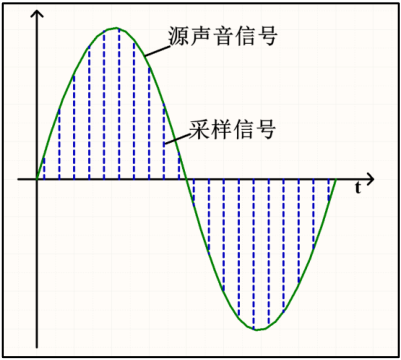
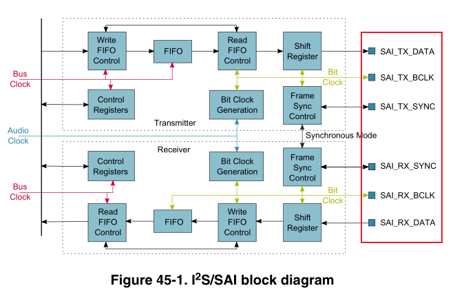
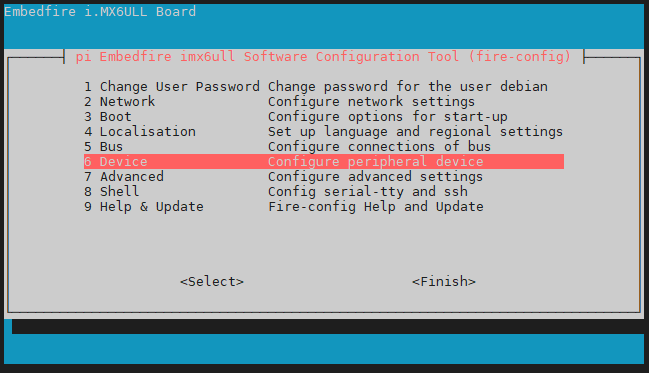
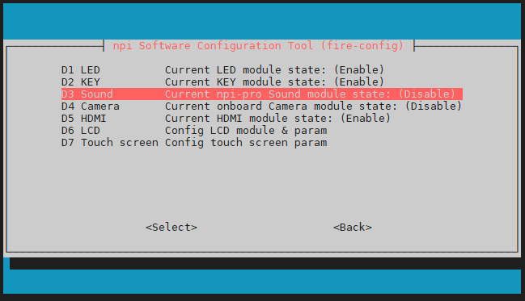
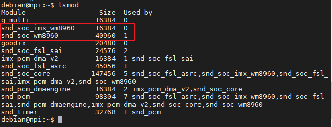
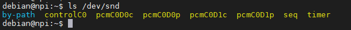
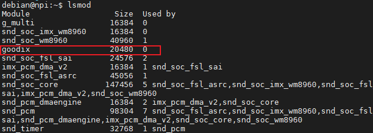

.. vim: syntax=rst

音频与视频播放
-----

音视频是人类在日常生活里面使用非常广泛的信息获取方式，它的本质就是声音和图像信息的采集、存储和回放。
本章我们来介绍音视频播放的相关基础概念，并且给大家演示如何在开发板上进行音视频的播放。

接口概述
~~~~~~~

i.MX 6ull芯片上具有iic、sai和lcd fpc接口，其中iic和sai接口用来控制和播放音频，
fpc接口用来播放视频。通过这些接口，用户可以把相关外设连接到芯片上，从而来实现音视频的播放。

在野火ebf6ull pro开发板上，iic2和sai接口已经连接到WM8960音频编解码芯片上，
我们可以直接使用它来播放音频。而对于lcd fpc接口，则需要用户另行购买屏幕，
通过排线连接到开发板上。

数字音频技术
~~~~~~~

现实生活中的声音是通过一定介质传播的连续的波，它可以由周期和振幅两个重要指
标描述。正常人可以听到的声音频率范围为 20Hz~20KHz。现实存在的声音是模拟量，这
对声音保存和长距离传输造成很大的困难，一般的做法是把模拟量转成对应的数字量保存，
在需要还原声音的地方再把数字量的转成模拟量输出，如下图：

模拟量转成数字量过程，一般可以分为三个过程，分别为采样、量化、编码。如下图：

用一个比源声音频率高的采样信号去量化源声音，记录每个采样点的值，最后如果
把所有采样点数值连接起来与源声音曲线是互相吻合的，只是它不是连续的。在图中两条
蓝色虚线距离就是采样信号的周期，即对应一个采样频率(F S )，可以想象得到采样频率越
高最后得到的结果就与源声音越吻合，但此时采样数据量越越大，一般使用 44.1KHz采样
频率即可得到高保真的声音。每条蓝色虚线长度决定着该时刻源声音的量化值，该量化值
有另外一个概念与之挂钩，就是量化位数。量化位数表示每个采样点用多少位表示数据范
围，常用有 16bit、24bit或 32bit，位数越高最后还原得到的音质越好，数据量也会越大。

WM8978，是一个低功耗、高质量的立体声多媒体数字信号编解码器，英文名字是Audio CODEC，
所以我们在音频驱动资料或者芯片手册的介绍中看到“CODEC”这个词语，一般说的都是音频编解码。
它内部集成了DAC和ADC，可以实现声音信号量化成数字量输出，也可以实现数字量音频数据转换为模拟量声
音驱动扬声器。这样使用 WM8978芯片解决了声音与数字量音频数据转换问题，并且通过
配置 WM8978 芯片相关寄存器可以控制转换过程的参数，比如采样频率，量化位数，增益、
滤波等等。

WM8978芯片是一个音频编解码器，但本身没有保存音频数据功能，它只能接收其它
设备传输过来的音频数据进行转换输出到扬声器，或者把采样到的音频数据输出到其它具
有存储功能的设备保存下来。该芯片与其他设备进行音频数据传输接口就是I2S协议的音频接口。

SAI总线接口
~~~~~~~

SAI 接口（串行音频接口）适用于许多立体声或单声道应用。例如，它可配置为支持
I2S 标准、LSB 或 MSB 对齐、PCM/DSP、TDM 和 AC’97 等协议。将音频模块配置为发
送器时，SAI 接口可提供 SPDIF 输出。SAI 通过两个完全独立的音频子模块来实现这种灵
活性和可配置性。每个模块都有自己的时钟发生器和 I/O 线控制器。SAI 可以配置为主模
式或配置为从模式。音频子模块既可作为接收器，又可作为发送器；既可与另一模块同步，
又可以不同步。SAI 可与其它 SAI 相连接来同步运行。

I.MX6ULL 的 SAI 是一个全双工、支持帧同步的串行接口，支持 I2S、AC97、TDM 和音频
DSP，SAI 主要特性如下：

- 帧最大为 32 个字

- 字大小可选择 8bit 或 32bit

- 每个接收和发送通道拥有 32×32bit 的 FIFO

- FIFO 错误以后支持平滑重启

在I.MX6ULL 芯片手册第45章（Chapter 45 Synchronous Audio Interface (SAI)）上，有对SAI接口的详细介绍，
它的功能框图如下所示:

其中，红框部分引脚就是sai接口进行数据传输时的相关引脚:

- SAI_TX_DATA：数据发送

- SAI_RX_DATA：数据接收

- SAI_TX_BCLK：数据发送时钟

- SAI_RX_BCLK：数据接收时钟

- SAI_TX_SYNC：数据发送同步

- SAI_RX_SYNC：数据接收同步

音频播放实验
~~~~~~~

1.使能音频设备树插件

执行sudo fire-config命令，选中device选项，如下图：

进一步选择sound选项，如下图：

选择"enable"后，重启开发板。

2.重启后，使用lsmod命令确认音频驱动模块加载成功，如下图:

图中snd_soc_imx_wm8960、snd_soc_wm8960即为wm8960驱动模块。

**注意:** 在开发板启动时，大家可能在启动log里面，看到一直有打印"No soundcards found."。
这其实是由于音频驱动没有编译进内核引起的。在检查声卡设备的时候，音频驱动模块尚没加载进内核。

3.查看/dev/snd目录

- controlC0：用于声卡控制，C0 表示声卡 0。

- pcmC0D0c和pcmC0D1c ：用于录音的 pcm 设备，其中的“COD0”和“C0D1”分别表示声卡0中的设备0和设备 1，最后面的“c”是 capture 的缩写，表示录音。

- pcmC0D0p和pcmC0D1p：用于播放的 pcm 设备，其中的“COD0”和“C0D1”分别表示声卡0中的设备0和设备1，最后面的“p”是 playback 的缩写，表示放音。

- timer ：定时器

4.安装alsa-utils工具

alsa-utils是alsa的一个工具包,里面包含有声卡测试和音频编辑的工具，比如alsactl、alsamixer、amixer、aplay等。

.. code-block:: sh
    :linenos:

    sudo apt install alsa-utils -y

5.使用amixer设置声卡

第一次使用声卡之前一定要先使用 amixer 设置声卡，打开耳机和喇叭，并且设置喇叭和耳
机音量，输入如下命令：

.. code-block:: sh
    :linenos:

    amixer sset 'Right Output Mixer PCM' on
    amixer sset 'Left Output Mixer PCM' on
    amixer sset Headphone 80,80
    amixer sset Speaker 100,100

6.使用aplay播放WAV格式音乐

网上搜索一首自己喜欢的wav格式歌曲，拷贝到开发板后，使用以下命令即可播放:
    
.. code-block:: sh
    :linenos:

    aplay xxx.wav

如果没有网络环境，则可以先进行录音，生成wav文件后再进行播放

7.使用arecord进行录音

.. code-block:: sh
    :linenos:

    arecord -f cd -d 10 test.wav

- -f 是设置录音质量,cd表示录音质量为 cd 级别
- d 是指定录音时间，单位是 s
- test.wav是生成的录音文件名

8.使用alsactl保存声卡设置

当我们需要保存当前声卡设置，需要使用如下命令生成声卡配置文件:

.. code-block:: sh
   :linenos:

   alsactl store

声卡配置文件默认保存在/var/lib/alsa目录下，名字为asound.state。有了该配置文件，
可以使用以下命令来使该配置文件生效：

.. code-block:: sh
   :linenos:

   alsactl restore

视频播放实验
~~~~~~~

1.使能lcd设备树插件，具体方法类似音频设备树插件，这里不再重复讲解

2.重启后，使用lsmod命令确认触摸屏驱动模块加载成功，如下图:

3.查看/dev/fb*目录

/dev/fb*为各种显示设备，其中一个为lcd设备

4.安装 mplayer工具

mplayer 是一款有悠久开源历史的多媒体播放器，它自带多种格式的解码器，方便进行各种视频格式播放。
最重要的是它支持命令行界面，这使得我们无需安装各种发行版图形界面，就能安装使用它。

.. code-block:: sh
   :linenos:

   sudo apt install mplayer -y

5.使用 mplayer工具播放视频

网上搜索一个自己喜欢的视频(mp4\avi\...)，拷贝到开发板后，使用以下命令即可播放:

.. code-block:: sh
   :linenos:

   mplayer xxx.mp4/.avi/...

注意：播放视频时，请先配置声卡，确保音频播放正常。否则音频数据将无法播放，引起画面卡死