.. vim: syntax=rst

让开发板跑起来
------------------------------------------

本章主要讲解如何使用配套的开发板，让开发板的系统运行起来！

了解开发板的启动方式
~~~~~~~~~~~~~~~~~~~~~~~~~~~~~~~~~~~~~~~~~~~~~~~~~~~~~~~~~~~~

i.MX系列芯片支持多种启动方式，在我们配套的开发板上主要使用其中的Nand-FLASH、eMMC、SD卡及USB启动方式。

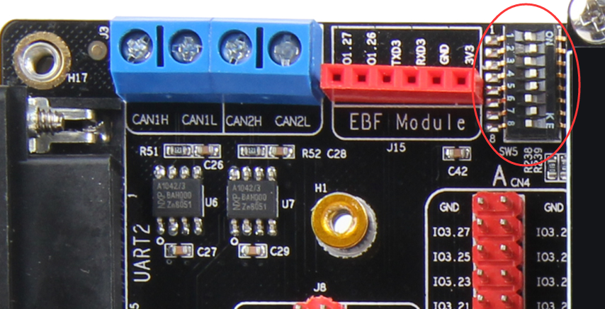

拨码开关的一侧会写着ON字样，把拨码调至该侧表示对应的选项为高电平1，调至另一侧为0，不
同启动方式的见下表，也可以直接查看开发板上的丝印说明（一般印在板子背面），表中的X表示任意电平均可。

表 拨码开关配置的启动方式

==== ====== ========== ==== == ===
编号 名称   Nand FLASH eMMC SD USB
==== ====== ========== ==== == ===
1    MODE0  0          0    0  1
2    MODE1  1          1    1  0
3    CFG1-4 1          0    0  X
4    CFG1-5 0          1    0  X
5    CFG1-6 0          1    1  X
6    CFG1-7 1          0    0  X
7    CFG2-3 0          1    0  X
8    CFG2-5 0          0    1  X
==== ====== ========== ==== == ===

开发板上电后会根据拨码开关的状态从不同的存储器加载代码运行，故上电前需要根据自
己开发板使用的存储器进行配置，如Nand FLASH核心板就配置为0-1-1-0-0-1-0-0，其它依次类推。

其中的USB启动模式主要用来配合NXP官方的mfgtool工具烧录镜像。

硬件准备
~~~~~~~~~~~~~~~~~~~~~~~~

要进行本章的实验操作，需要准备如下硬件：

-  EBF6ULL Mini或Pro开发板

-  EBF6ULL Mini开发板使用5V电源，EBF6ULL Pro开发板使用DC 12V电源！

-  USB Mini接口的USB线

-  一台Windows系统的电脑

-  配套的屏幕（可选）

启动步骤
~~~~~~~~~~~~~~~~~~~~~~~~

开发板出厂时默认都烧录了Linux系统，确认设置了正确的boot启动方式，只要上电就会自动运行。

以下为开发板的启动操作步骤：

(1) 根据自己开发板的版本和表 11‑1设置拨码开关（出厂配置通常是配套的，检查确认即可）。

(2) 若使用HDMI显示屏，需要在开发板上电前要连接好显示屏。

(3) 使用DC电源给开发板供电（Mini开发板使用5V电源，Pro开发板使用DC 12V电源！），注意由于Pro开发板底板设备较多，功耗大。只使用USB线给开发板供电是无法正常运行的！Mini开发板功耗较小，可直接通过USB线接口供电。

(4) 按下电源开关，给开发板上电。

(5) 对于带屏幕的开发板，可以直接通过触摸屏控制开发板。

(6) 开发板支持鼠标和键盘，有需要可以通过USB接口连接至开发板。

(7) 对于不带屏幕的开发板，可以通过串口终端控制开发板。关于串口终端的使用请参考下一小节的内容。

设置Putty连接终端
~~~~~~~~~~~~~~~~~~~~~~~~~~~~~~~~~~~~~~~~~~~~

开发板支持使用串口终端进行控制，并且为方便使用，开发板上的串口通过CH340转换成USB通讯，使得开发板与电脑连接时直接用USB线即可。使用时需要在电脑先安装CH340芯片的USB转串口驱动。

连接串口终端时可以使用普通的串口调试工具收发字符串，不过这样控制起来非常不方便，此处我们推荐使用Putty终端软件。如果使用的不是Putty软件，以下连接开发板串口终端的操作步骤也大体相似，可以参考它来操作。

以下操作步骤在Windows系统的开发主机进行：

(1) 安装CH340芯片的USB转串口驱动，该驱动安装程序可在开发板配套的资料里找到。

(2) 使用Mini USB线连接电脑与开发板，注意在开发板端要接入到板子上的"USB转串口"接口，并通过DC电源供电，不能只使用USB线供电。

(3) 连接并供电后，在"我的电脑"设备管理器的"端口"设备下会新增一个"USB-SERIAL CH340"设备，请查看自
    己电脑上该COM口的编号，这在不同的电脑上编号是不同的，如下图所示。

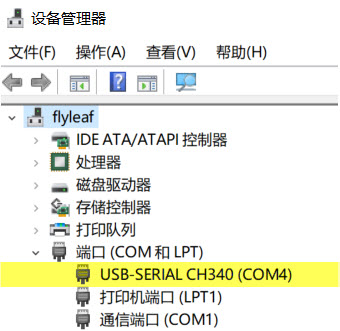

(4) 安装并打开Putty软件，新建会话，在连接的协议处选择使用"Serial"，表示
通过串口连接终端，把Putty的串口的通讯速率配置成开发板默认值，即"115200"，本例子使用的
端口号为"COM4"，注意该端口号要根据自己的实验环境进行选择，即在步骤（3）中查看的端口号。具体见下图。

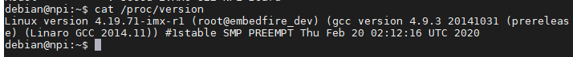

登录到终端
~~~~~~~~~~~~~~~~~~~~~~~~~

设置好连接软件后，打开终端软件的连接即可连接至开发板的串口终端。

(1) 如果是在开发板开机前就建立了串口终端连接，那么在开机时会看到开发板在启动时的信息输出，见下图。

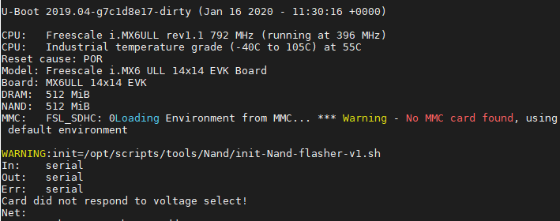

(2) 如果是在开发板开机后才建立的连接，开发板没有输出，这时直接按几下回车即可，见下图。

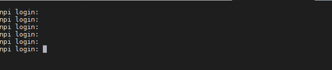

(3) 无论是以上哪种情况，开发板的启动流程执行完毕时，只要按回车后终端都会提示login，此时终
端在等待用户的输入，它需要知道我们希望以哪个用户名登录终端。我们的开发板默认
用户为：debian，密码：temppwd。所以在提示界面中输入用户密码并回车登录即可，见下图。

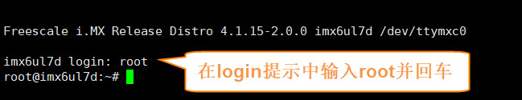

(4) 至此，我们就成功通过串口登录到开发板的终端了，接下来我们就可以使用各种命令来控制开发板。

连接网络
~~~~~~~~~~~~~~~~~~~~~~~~~~~~

在前面的基础上，需要的额外硬件准备：

-  网线

-  路由器

使用网线通过开发板的任意一个以太网接口与路由器连接起来，即可把开发板连接至网络。

连接外网测试
^^^^^^^^^^^^^^^^^^^^^^^^^^^^^^^^^^^^^^^^^^

若开发板连接的路由器支持连接到公网，直接在终端输入如下命令即可进行连接测试：

#在开发板的终端执行以下命令

.. code-block:: sh
   :linenos:

   ping www.firebbs.cn

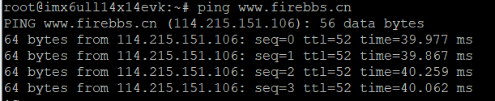

出现类似上图的输出表示网络连接成功，使用"Ctrl + C"可退出命令。

ping路由测试
^^^^^^^^^^^^^^^^^^^^^^^^^^^^^^^^

若连接的路由不支持连接到公网，可以直接ping路由的IP地址，如本例子中的路由IP地址为192.168.0.1。请把以
下命令中的IP地址换成自己实验环境的路由IP：

.. code-block:: sh
   :linenos:

   ping 192.168.0.1

查看开发板的IP地址
^^^^^^^^^^^^^^^^^^^^^^^^^^^^^^

如果使用无法ping通，请使用ifconfig命令查看开发板的IP地址，见下图。

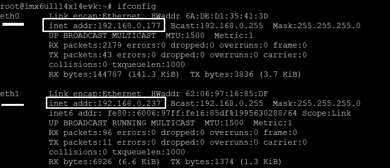

在上图中开发板使用ifconfig命令可查看到开发板eth0网口的IP地址，为192.168.0.177。若
使用ifconfig命令查看不到IP地址，请检查网络连接，或尝试使用以下命令申请IP：

.. code-block:: sh
   :linenos:

   #eth1表示第一路以太网口，eth2表示第二路以太网口
   sudo udhcpc  -b  -i  eth1  

若命令执行正常，会出现图 11‑9中的输出，并且再次输入ifconfig命令会查看到eth1具有正常的IP地址。

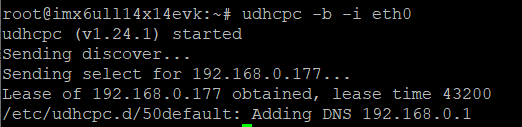

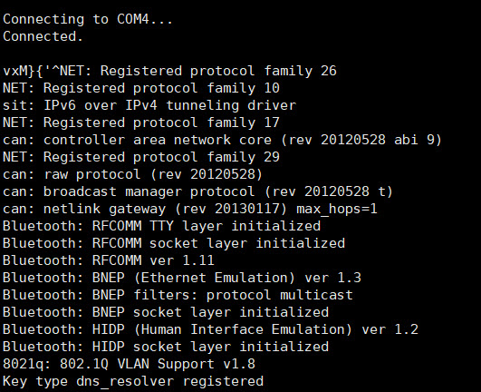
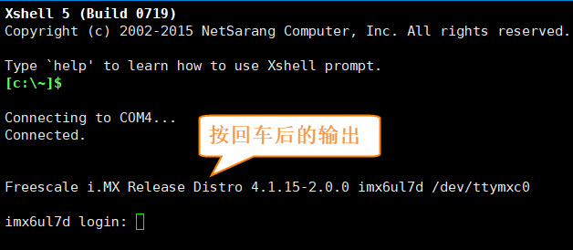

