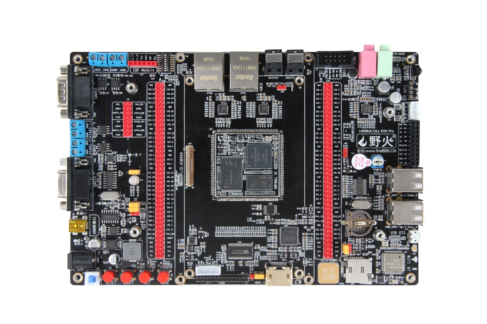
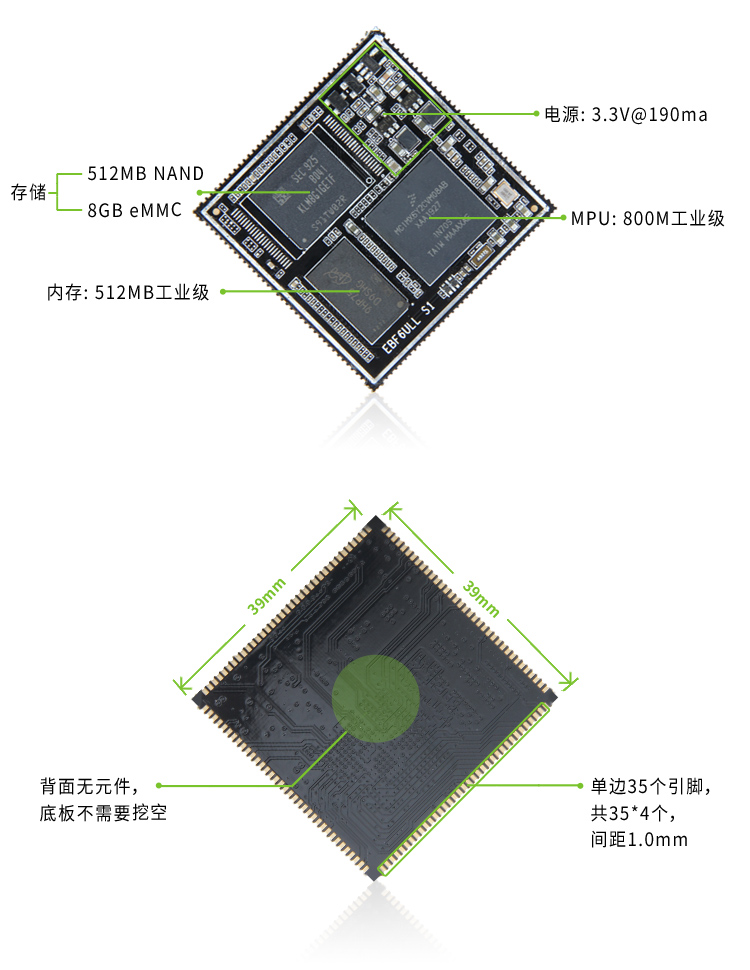
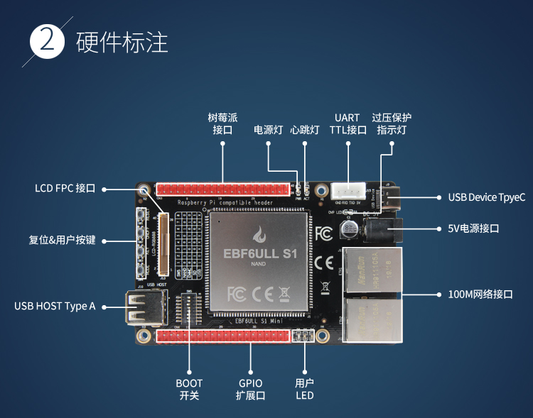
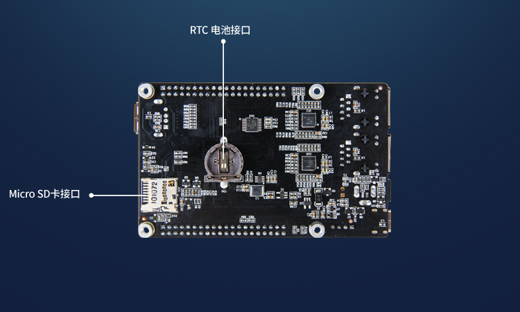
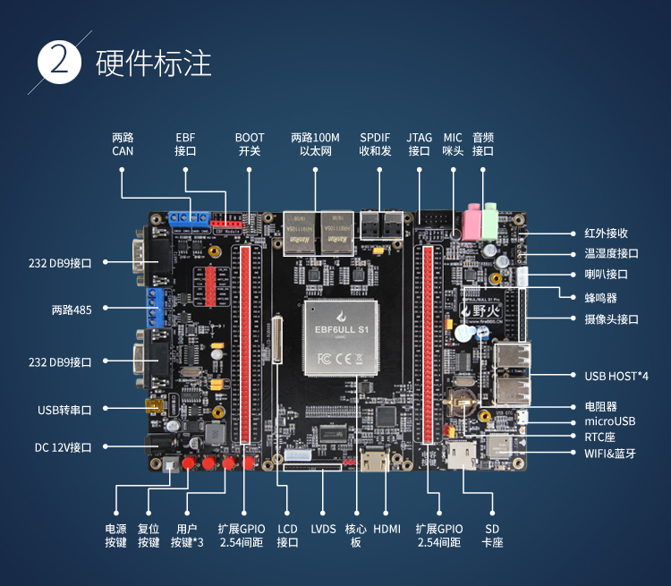

.. vim: syntax=rst

硬件资源介绍——野火EBF 6ULL 开发板
----------------------------------------

在PC上通过Ubuntu熟悉了Linux系统的基础使用后，我们尝试体验一下在嵌入式开发板上的Linux系统。先来了解一下开发板的硬件资源。

关于开发板的硬件原理图、参考设计、封装库、尺寸图以及引脚分配表的更详细信息请参考以下链接中的文档：https://ebf-6ull-hardware.readthedocs.io 。

野火接受针对i.MX6 ULL核心板的软、硬件项目定制，且有丰富的成功定制案例，如核心板存储器容量定制、底板定制、制作驱动固件等。有需要可以直接发送邮件咨询：embedfire@embedfire.com 。

EBF6ULL Mini及Pro开发板
~~~~~~~~~~~~~~~~~~~~~~~~~~~~~~

EBF6ULL 系列开发板是野火电子基于NXP i.MX 6ULL系列处理器设计的一款低功耗单板电
脑，工业级主频最高可达 792MHz，按底板功能主要分为Mini和Pro两个版本，具体见下图。

.. image:: media/ebf6ul002.jpeg
   :align: center
   :alt: 未找到图片2|

EBF6ULL开发板提供完整的SDK驱动开发包、核心板封装库，底板应用参考设计原理图，可帮助客户大大缩减产品的开发时间，加快产品上市。
目前提供Linux 4.19.71版本的内核，配套的系统镜像有纯净版、Qt_demo、桌面系统三个版本。

开发板整板由EBF6ULL S1核心板模组和底板组成，具体见下图，元件采用工业级选料，其中核心板板载主控芯片512MB DDR3L内存，
256/512MB Nand-FLASH（或8GB eMMC）。

.. image:: media/ebf6ul004.jpeg
   :align: center
   :alt: 未找到图片4|

.. hint::

    eMMC版与NAND版本的区别：

    1. 温度等级：NAND是-40~80°工业级，eMMC是-20~80°商业级；

    #. 容量大小：NAND容量较小，最大可支持到2GB；eMMC容量较大，最大可支持到256GB；

    #. 如何选择：学习可选择eMMC，容量大，可存放大量的应用程序；做产品则按需选择，如果需要工业级，则选择NAND；

    #. 程序兼容：基于NAND和eMMC开发的程序除了U-boot不一样，其它都一样，很容易切换，不存在学习买了eMMC，做产品换成NAND很困难的情况。

核心板PCB采用8层黑色沉金设计，单面放元件，整体尺寸39x39mm，共140个引脚，引脚间距1.0mm，除了SEMC总线引脚外，芯片其余IO均引出。
该核心板适用于工业控制、手持扫码、喷墨打印机、轨道交通、无人机控制和音频输出等领域。

EBF6ULL核心板硬件资源
~~~~~~~~~~~~~~~~~~~~~~~~~~~~

野火EBF6ULL核心板包含多种配置版本，它按照核心板上FLASH存储器类型进行区分，具体见下图。

EBF6ULL S1核心板模组参数如下：

===============    =========================================================

MPU                 NXP i.MX6ULL ，Cortex-A7 单核；

频率                800MHZ 工业级（实际为792MHZ）；

内存                256/512MB DDR3；

FALSH               256/512MB NAND和8GB eMMC可选；

电源                3.3V@190MA单电源供电；

PCB                 8层黑色沉金，尺寸为39mm x 39mm；

引脚                140个引脚，引脚间距为1.0mm；

封装                邮票孔封装，单面元件，背面没有元件，底板不需要挖槽。

IO                  全引出，其中GPIO 107个，差分时钟一组，USB专用口2个，POR_B复位脚1个，电源控制口2个；

网口                2路百兆以太网，带PHY

串口                8路

I2C                 4路

CAN                 2路

SPI                 4个

ADC                 10路

PWM                 8路

I2S                 3路

USB OTG             2路

Camera              1路，8位并行摄像头接口

JTAG                1路

LCD                 1路，RGB888，最高支持1366*768分辨率

触摸                1路，电容触摸
===============    =========================================================

注意：以上数据为最大值，可能有复用，请根据EBF6ULL S1核心板引脚说明作为参考设计

EBF6ULL Mini底板硬件资源
~~~~~~~~~~~~~~~~~~~~~~~~~~~

EBF6ULL Mini底板硬件资源见下图。

.. _EBF6ULL Mini底板硬件资源图正面:

   EBF6ULL Mini底板硬件资源正面图

.. _EBF6ULL Mini底板硬件资源图背面:

   EBF6ULL Mini底板硬件资源背面图

EBF6ULL S1 Mini底板参数如下：

===============    =================================================================

PCB                 6层黑色沉金，尺寸为100x61.8mm

100M以太网接口      2路百兆以太网接口

5V电源接口          使用5V±2%单电源供电

过压保护指示灯      该灯亮时表示电压超出范围

USB Device接口     使用Type C接口引出

UART TTL接口       主控器串口引脚直接引出，TTL电平

树莓派接口          包含UART、I2C、SPI、PWM等兼容树莓派的IO接口

心跳灯与电源灯      系统运行后心跳灯会持续闪烁

LCD FPC接口         含24位RGB 接口及I2C触摸屏控制接口

复位&按键           共4个按键，分别为复位、ON/OFF、普通按键及Mode模式切换按键

USB Host Type A     1路使用Type A引出USB Host接口

Boot开关            一个8位拨码开关，支持切换NAND、eMMC、SD及USB启动方式

GPIO扩展口          包含主控器的其它GPIO

RTC电池接口         可接入型号为CR1220的电池为RTC模块供电

SD卡槽              micro SD卡插槽，支持SD卡3.0

IO扩展              包含一个74LV595PW芯片，把某4路IO扩展成8路
===============    =================================================================

EBF6ULL Pro底板硬件资源
~~~~~~~~~~~~~~~~~~~~~~~~~~~~~~~

野火EBF6ULL Pro底板硬件资源见下图。

.. _EBF6ULL Pro底板硬件资源图:

   EBF6ULL Pro底板硬件资源图

表   EBF6ULL S1 Pro底板硬件资源表

============ ============================================================================================
尺寸         200*13.5MM
PCB          2层、黑色沉金
DC12V 接口   DC 12V@2A 直流输入，不支持电脑USB供电，因为电流不够
USB转串口    使用MiniUSB接口，使用CH340驱动
KEY          RESET 1个，ONOFF 1个，WAKEUP 1个，MODE1个
RGB灯        由三个独立的R、G、B小灯组成
六轴陀螺仪   型号MPU6050
DB9接口      2路，1路母头DB9，1路公头DB9，使用RS232协议
485接口      2路，2线接线柱引出， 使用RS485协议
CAN接口      2路，2线接线柱引出 ，使用CAN协议
EBF接口      1个，使用1*6P 2.54间距排母引出，适用于连接使用串口协议的小模块
启动配置     通过1个8位的拨码开关配合实现
以太网       2路百兆以太网，型号KSZ8081RNB
SPDIF收发    1x SPDIFIN，DLT-1150光纤座；1x SPDIFOUT，DLR-1150光纤座，用于音频光纤输入输出
JTAG接口     1个，使用2*5P 2.54间距牛角座引出
音频接口     1x LINE IN，3.5mm音频座；1x LINE OUT，3.5mm音频座；1x MIC IN，电容咪头，使用WM8960编解码芯片
环境光传感器 型号AP3216C
红外接收     型号HS1838
温湿度接口   可接入DHT11/DS18B20传感器
喇叭接口     1x4p XH2.0接口引出，可用型号：3080
摄像头接口   可直接配套野火OV5640摄像头
蜂鸣器       有源蜂鸣器，3.3V驱动
USB HOST     4路通过芯片原生外扩，A型母座双层USB接口
电位器       1K阻值变动
micro USB    原生引出，支持OTG
RTC座子      电池座，适用电池型号CR1220
WIFI&蓝牙    型号：AP6236，不能与SD卡同时使用
SD卡座       microSD卡卡座，支持SD3.0，不能与WIFI同时使用
电容按键     可检测到触摸开关状态
HDMI接口     RGB转HDMI
LVDS接口     RGB转LVDS，通过2x15P 2.0间距排针引出
LCD接口      FPC接口，RGB888及I2C触摸信号，支持直接连接野火的5寸/7寸/4.3寸屏
GPIO         通过两排2*40P的2.54间距排针引出，可自主连接各种外部设备
============ ============================================================================================

