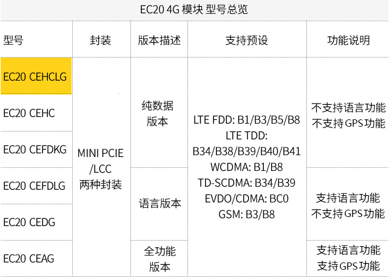
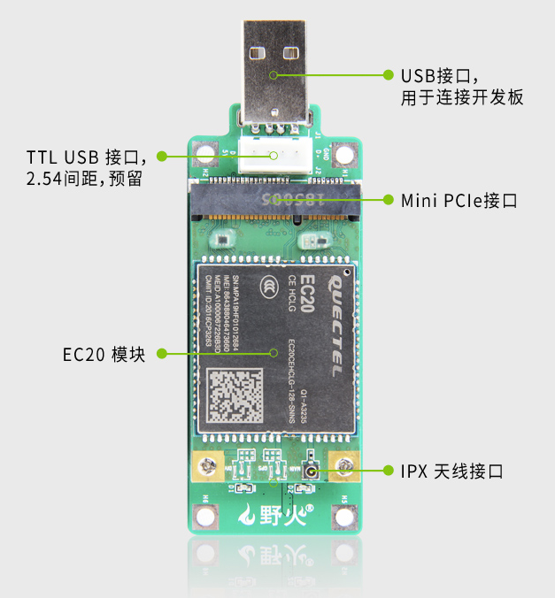
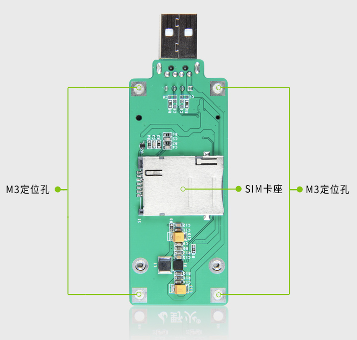
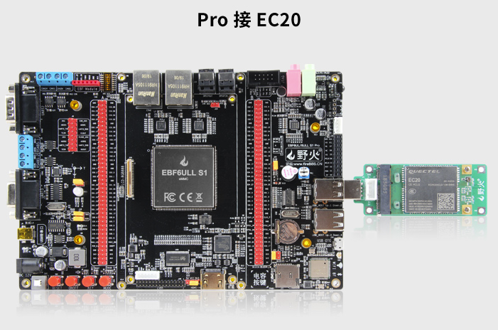
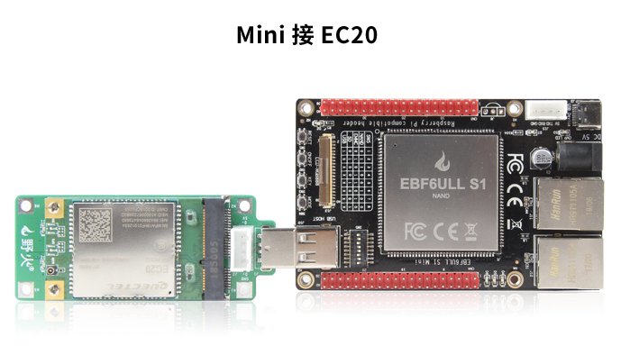
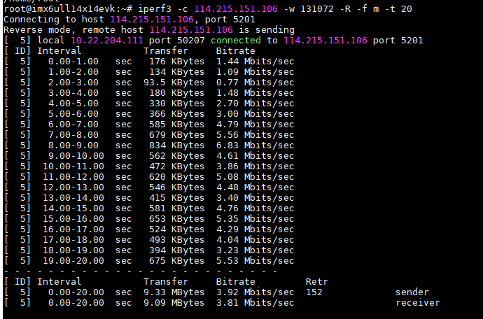
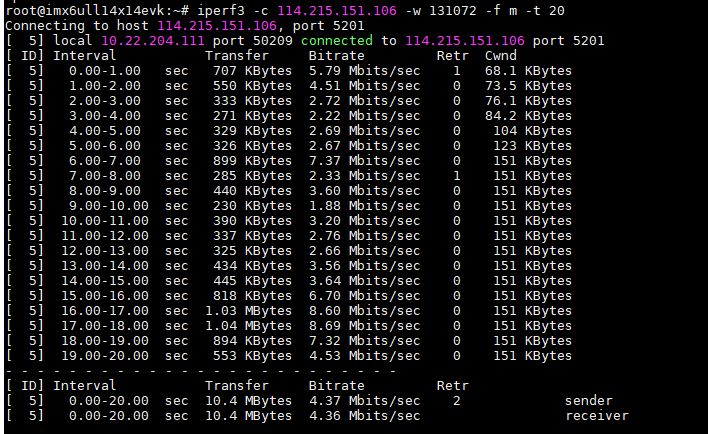
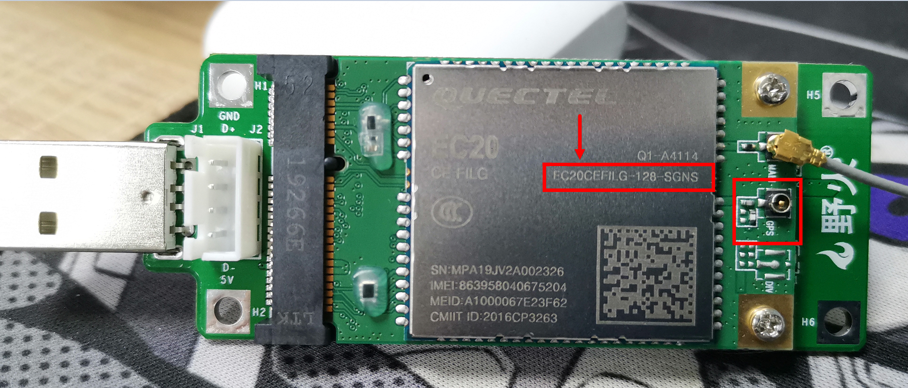
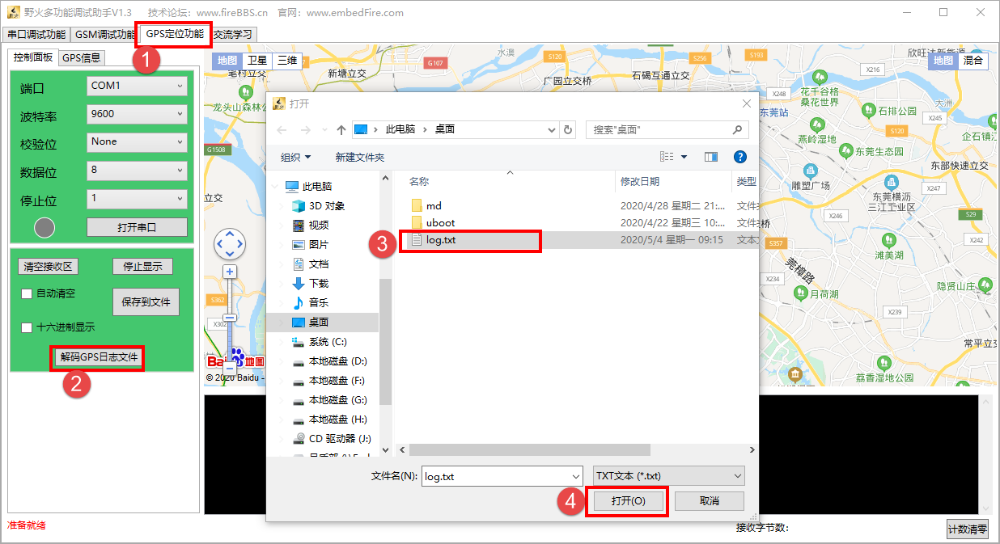
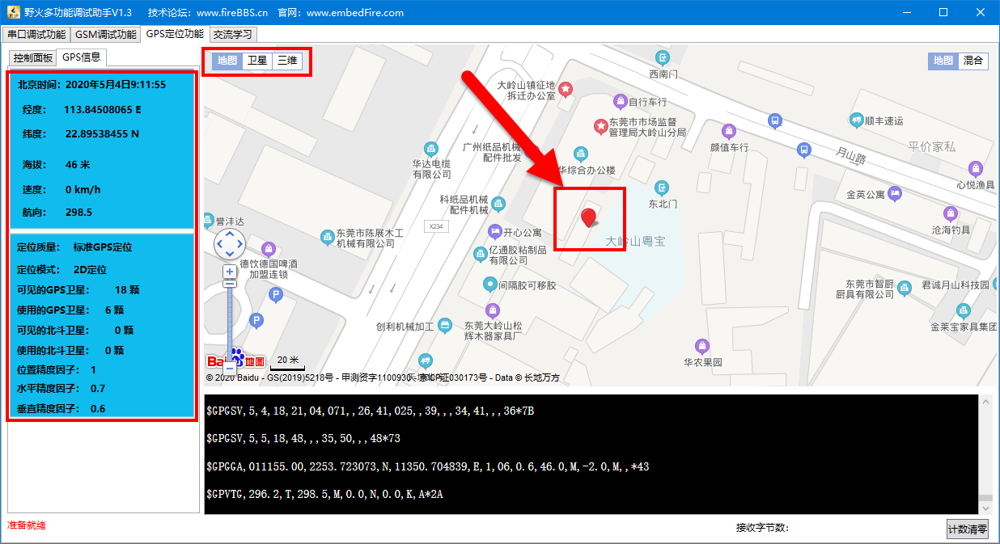

在Debian使用4G模块
==================

-  平台：野火imx6ull开发板
-  系统：Debian
-  Debian版本：需要使用最新的Debian镜像，必须是2020年5月1日以后的镜像，否则无法ppp拨号成功。
-  需要使用野火4G模块

野火4G模块
----------

野火EC20 4G模块是由EC20
Pcie接口模组加一个USB转接板构成，可方便插接到带有USB接口的Linux主板上。EC20型号众多，我们选用的型号是CEHCLG，全网通，7模，纯数据、单天线版本。

   EC20\_4G\_module001.png

EC20是移远的一款4G模组，有Mini PCle和LCC两种封装，与处理器通信的协议为USB。即你们在市面上看到的那些通过板载的PCle接口与EC20连接的开发板，他们通信时也是通过USB通信，并不是一些初学用户说的通过PCle通信，PCle只是一种封装而已，最终通信都是通过USB。

   EC20\_4G\_module002.png

   EC20\_4G\_module003.png

野火开发板使用4G模块
--------------------

野火开发板出厂固件已经支持4G模块的，所以在收到开发板后可以直接使用，使用方式也非常简单，首先插入4G的电话卡到SIM卡座上，这张电话卡必须是可以上网的，然后接上IPX天线（4G模块在发货的时候就已经接好天线的了），最终连接到开发板上，Pro或者mini开发板都可以使用野火4G模块。

   EC20\_4G\_module004.png

   EC20\_4G\_module005.png

等待大约6S，可以看到4G模块的蓝色LED灯在闪烁，然后可以在终端输入dmesg命令，能看到以下内容，就代表模块启动成功：

.. code:: bash

    dmesg

    ···
    [83577.336314] usb 1-1.1: new high-speed USB device number 13 using ci_hdrc
    [83577.607805] option 1-1.1:1.0: GSM modem (1-port) converter detected
    [83577.617195] usb 1-1.1: GSM modem (1-port) converter now attached to ttyUSB0
    [83577.619058] option 1-1.1:1.1: GSM modem (1-port) converter detected
    [83577.646781] usb 1-1.1: GSM modem (1-port) converter now attached to ttyUSB1
    [83577.648866] option 1-1.1:1.2: GSM modem (1-port) converter detected
    [83577.654863] usb 1-1.1: GSM modem (1-port) converter now attached to ttyUSB2
    [83577.659113] option 1-1.1:1.3: GSM modem (1-port) converter detected
    [83577.660546] usb 1-1.1: GSM modem (1-port) converter now attached to ttyUSB3
    [83577.662514] option 1-1.1:1.4: GSM modem (1-port) converter detected
    [83577.686784] usb 1-1.1: GSM modem (1-port) converter now attached to ttyUSB4

更新
----

为了确保我们的软件包版本是最新版本，让我们使用apt命令更新本地apt包索引和升级系统：

.. code:: bash

    sudo apt-get update

安装必要的依赖
--------------

首先安装ppp拨号相关的依赖，安装过程中出现任何输入的内容，直接按\ **回车**\ 即可：

.. code:: bash

    sudo apt-get -y install ipppd

安装野火提供的4g模块拨号脚本，在安装完成后在\ ``/home/debian``\ 目录下出现\ ``peripheral``\ 文件夹：

.. code:: bash

    sudo apt-get -y install peripheral

拨号上网
--------

模块想要上网则需要拨号，进入 ``~/peripheral/ec20-4g``
目录下，可以看到该目录存在以下文件（部分）：

-  ec20\_options
-  ec20\_ppp\_dialer
-  ppp-on.sh

ppp-on.sh就是拨号脚本，直接运行它可以进行拨号，ec20\_options是拨号的配置文件，而ec20\_ppp\_dialer
则是拨号的一些指令。

三个文件的内容如下：

**ec20\_options：**

.. code:: bash

    /dev/ttyUSB2
    115200
    crtscts
    modem
    persist
    lock
    noauth
    noipdefault
    debug
    nodetach
    user Anyname
    password Anypassword
    ipcp-accept-local
    ipcp-accept-remote
    #replacedefaultroute
    defaultroute
    usepeerdns
    noccp
    nobsdcomp
    novj
    #Dump

**ec20\_ppp\_dialer：**

.. code:: bash

    ABORT "NO CARRIER"
    ABORT "ERROR"
    TIMEOUT 120
    "" ATE
    SAY "ATE"
    ECHO ON
    OK ATH
    OK ATP
    OK AT+CGDCONT=1,\"IP\",\"CMNET\"
    #OK AT+ZSNT=0,0,0
    OK ATD*98*1#
    CONNECT

**ppp-on.sh：**

.. code:: bash

    #!/bin/sh
    #clear
    #ppp-on.sh
    OPTION_FILE="ec20_options"
    DIALER_SCRIPT="ec20_ppp_dialer"
    pppd file $OPTION_FILE connect '/usr/sbin/chat -v -f ec20_ppp_dialer' &

那么我们直接运行ppp-on.sh即可，注意：需要sudo权限运行。

.. code:: bash

    sudo ./ppp-on.sh

    Removed stale lock on ttyUSB2 (pid 4125)
    ➜  ec20-4g ATE
    +CMTI: "ME",2

    +CMTI: "ME",3

    +CMTI: "ME",4
    ATE
    OK
    ATH
    OK
    ATP
    OK
    AT+CGDCONT=1,"IP","CMNET"
    OK
    ATD*98*1#
    CONNECT
    Script /usr/sbin/chat -v -f ec20_ppp_dialer finished (pid 5776), status = 0x0
    Serial connection established.
    using channel 9
    Using interface ppp0
    Connect: ppp0 <--> /dev/ttyUSB2
    sent [LCP ConfReq id=0x1 <asyncmap 0x0> <magic 0x64c762f8> <pcomp> <accomp>]
    rcvd [LCP ConfReq id=0x0 <asyncmap 0x0> <auth chap MD5> <magic 0xa326b19> <pcomp> <accomp>]
    sent [LCP ConfAck id=0x0 <asyncmap 0x0> <auth chap MD5> <magic 0xa326b19> <pcomp> <accomp>]
    rcvd [LCP ConfAck id=0x1 <asyncmap 0x0> <magic 0x64c762f8> <pcomp> <accomp>]
    sent [LCP EchoReq id=0x0 magic=0x64c762f8]
    rcvd [LCP DiscReq id=0x1 magic=0xa326b19]
    rcvd [CHAP Challenge id=0x1 <163eafbf8714ed417edfd556ca784e60>, name = "UMTS_CHAP_SRVR"]
    sent [CHAP Response id=0x1 <d2f3e94b688d9898ea55893da7cfd10e>, name = "Anyname"]
    rcvd [LCP EchoRep id=0x0 magic=0xa326b19 64 c7 62 f8]
    rcvd [CHAP Success id=0x1 ""]
    CHAP authentication succeeded
    CHAP authentication succeeded
    sent [IPCP ConfReq id=0x1 <addr 0.0.0.0> <ms-dns1 0.0.0.0> <ms-dns2 0.0.0.0>]
    rcvd [IPCP ConfReq id=0x0]
    sent [IPCP ConfNak id=0x0 <addr 0.0.0.0>]
    rcvd [IPCP ConfNak id=0x1 <addr 10.17.241.161> <ms-dns1 202.96.134.33> <ms-dns2 202.96.128.166>]
    sent [IPCP ConfReq id=0x2 <addr 10.17.241.161> <ms-dns1 202.96.134.33> <ms-dns2 202.96.128.166>]
    rcvd [IPCP ConfReq id=0x1]
    sent [IPCP ConfAck id=0x1]
    rcvd [IPCP ConfAck id=0x2 <addr 10.17.241.161> <ms-dns1 202.96.134.33> <ms-dns2 202.96.128.166>]
    Could not determine remote IP address: defaulting to 10.64.64.64
    not replacing default route to eth1 [192.168.0.1]
    local  IP address 10.17.241.161
    remote IP address 10.64.64.64
    primary   DNS address 202.96.134.33
    secondary DNS address 202.96.128.166
    Script /etc/ppp/ip-up started (pid 5783)
    Script /etc/ppp/ip-up finished (pid 5783), status = 0x0

当你看到拨号返回的内容后有IP地址时，就证明拨号成功，当然你也可以通过\ ``ifconfig``\ 命令去查看4g模块的IP地址。

.. code:: bash

    rcvd [IPCP ConfNak id=0x1 <addr 10.17.241.161> <ms-dns1 202.96.134.33> <ms-dns2 202.96.128.166>]
    sent [IPCP ConfReq id=0x2 <addr 10.17.241.161> <ms-dns1 202.96.134.33> <ms-dns2 202.96.128.166>]

验证4G网卡
----------

一旦拨号成功，可以使用\ ``ifconfig``\ 命令验证4G网卡是否存在，如果成功此时会多出来一个ppp0的网卡，并且已经获取到IP地址了。可以很明显看到，我们目前有了一个4g模块的网卡ppp0，存在IP地址，那么说明我们可以使用ppp0进行网络通信：

.. code:: bash

    ifconfig

    ppp0: flags=4305<UP,POINTOPOINT,RUNNING,NOARP,MULTICAST>  mtu 1500
            inet 10.17.241.161  netmask 255.255.255.255  destination 10.64.64.64
            ppp  txqueuelen 3  (Point-to-Point Protocol)
            RX packets 4  bytes 52 (52.0 B)
            RX errors 0  dropped 0  overruns 0  frame 0
            TX packets 4  bytes 58 (58.0 B)
            TX errors 0  dropped 0 overruns 0  carrier 0  collisions 0

然后我们可以验证一下ping功能，是否可以访问互联网（此处以ping
baidu.com为示例）：

.. code:: bash

    ping baidu.com

    PING baidu.com (39.156.69.79): 56 data bytes
    64 bytes from 39.156.69.79: seq=0 ttl=48 time=60.056 ms
    64 bytes from 39.156.69.79: seq=1 ttl=48 time=62.634 ms
    64 bytes from 39.156.69.79: seq=2 ttl=48 time=50.397 ms

可能你是接了网线的（假设使用了eth1接口），而默认路由表却不是4G模块，如果想使用网卡上网，则需要更新路由表，解决办法如下：

.. code:: bash

    route del-net 0.0.0.0 eth1
    route add-net 0.0.0.0 ppp0

网速测试
--------

本次测试使用阿里云服务器4M带宽主机，经测试，4G模块已经将4M带宽跑满了，但是还未到模块上限，由于测试主机带宽有限，暂不能做更高速度的测试，但足以证明本模块的性能。

测试结果：

**接收模式：**

   EC20\_4G\_module006.png

**发送模式：**

   EC20\_4G\_module007.png

可能出现的问题
--------------

经过实测，目前的脚本是可以连接到移动、联通、电信的，如果出现一些其他的问题，可以参考以下内容：

APN设置:

.. code:: bash

    移动：at+cgdcont=1，"ip"，"cmnet"
    联通：at+cgdcont=1，"ip"，"3gnet"
    电信：at+cgdcont=1，"ip"，"ctnet"

拨号：

.. code:: bash

    移动：*99***1#或*98*1#
    联通：*99#电信：#777

使用GPS功能（需要4G模块支持GPS功能）
------------------------------------

野火在售的4G模块有两个版本，一个是带GPS功能的，一个是不带GPS功能的，具体型号与说明如下：

-  EC20CEHCLG：不带GPS功能的。
-  EC20CEFILG：带GPS功能的。

   EC20\_4G\_module008.png

**注意，以下的操作必须是带GPS功能版本的4G模块才能使用，请悉知。更重要的是模块需要使用GPS天线，并且天线需要放置在户外，才能正常接收到卫星信号**

本文主要讲解EC20莫块的GPS功能的基本使用方法，更多详细的指令操作细节、参数、示例可参考官网提供的手册：Quectel\_EC20\_GNSS\_AT\_Commands\_Manual，可以从野火官方git仓库下载：\ https://github.com/Embedfire/ebf_gsm_ec20\ 。

EC20挂载系统成功后，在Windows环境下会有四个/dev/ttyUSBx设备文件，也就是我们一开始看到的识别成功4G模块的设备信息，其中ttyUSB2用于AT指令收发，ttyUSB1用于GPS
NMEA的接收。

主要的指令有以下：

+--------------+-------------------------+
| 指令         | 功能                    |
+==============+=========================+
| AT+QGPSCFG   | 用于进行GPS功能的配置   |
+--------------+-------------------------+
| AT+QGPS      | 启动GPS会话             |
+--------------+-------------------------+
| AT+QGPSEND   | 结束GPS会话             |
+--------------+-------------------------+

以上只列举了简单启用EC20模块GPS功能并获取到NMEA数据所需的AT指令说明，其他功能诸如节能模式、其他定位系统模式、频次控制等操作可通过官网GNSS
AT指令手册了解。

实现验证:

1. 从\ ``/dev/ttyUSB1``\ 读取GPS数据，并将其存储到自定义的文件中\ ``ec20_gps_data.txt``\ ，下面这一行命令就是在后台读取\ ``/dev/ttyUSB1``\ 设备的数据并存储到\ ``ec20_gps_data.txt``\ 文件中，\ ``&``
   表示后台运行。

.. code:: bash

    cat /dev/ttyUSB1 > ~/ec20_gps_data.txt &

2. 启动GPS会话

.. code:: bash

    echo -e "AT+QGPS=1\r\n" > /dev/ttyUSB2

在启动的时候，可能不会立即收到所有卫星的信号，可以等待一段时间，注意，必须使用GPS天线并且放置在户外，户内可能搜不到信号。

3. 查看GPS信息，直接cat这个\ ``ec20_gps_data.txt``\ 文件即可。

.. code:: bash

    cat ~/ec20_gps_data.txt

    $GPGSV,5,1,18,03,18,246,29,04,41,313,34,08,29,195,34,09,07,320,23*75

    $GPGSV,5,2,18,11,02,194,21,14,28,149,30,21,04,071,30,23,,,23*48

    $GPGSV,5,3,18,27,57,170,49,31,34,077,23,32,05,149,29,16,60,336,*7A

    $GPGSV,5,4,18,18,,,,22,14,222,,26,41,025,,38,,,34*75

    $GPGSV,5,5,18,41,,,34,50,,,48*7B

    $GPGGA,011113.00,2253.723057,N,11350.704943,E,1,07,0.6,46.6,M,-2.0,M,,*4C

    $GPVTG,296.2,T,298.5,M,0.0,N,0.0,K,A*2A

    $GPRMC,011113.00,A,2253.723057,N,11350.704943,E,0.0,296.2,040520,2.4,W,A*27

    $GPGSA,A,2,03,04,08,14,22,27,32,,,,,,0.9,0.6,0.7*35

4. 当数据正常以后，可以关闭GPS会话

.. code:: bash

    echo -e "AT+QGPSEND\r\n" > /dev/ttyUSB2

5. 结束从ttyUSB1读取数据的后台进程

.. code:: bash

    ps -aux | grep ttyUSB1 | awk '{print $2}' | sudo xargs kill -9

6. 使用野火多功能调试助手查看GPS数据信息，首先将数据复制到Windows平台下，放入一个txt文件，比如我就放在桌面的log.txt文件中，然后打开野火多功能调试助手，选择GPS定位功能->解码GPS日志文件->选择你的GPS数据文件，注意，这个GPS数据不要太多，因为定位信息的数据本来就是差不多的，只需要几组即可，否则软件可能卡死。

   EC20\_4G\_module009.png

得到的位置信息如下（地图可以放大缩小）：

   EC20\_4G\_module010.png

获取GPS数据的同时使用4G上网
---------------------------

由于所有的数据指令都是通过\ ``ttyUSB2``\ 去控制的，如果你先进行4G拨号上网后，这个\ ``ttyUSB2``\ 就已经被占用了，无法通过命令去设置企业GPS功能，那么必须按以下步骤才能获取GPS数据的同时使用4G上网。

1. 启动GPS会话。
2. 进行ppp拨号上网。
3. 关闭ppp拨号上网。
4. 关闭GPS会话。

测试：

-  启动GPS会话。

   .. code:: bash

       echo -e "AT+QGPS=1\r\n" > /dev/ttyUSB2

-  查看GPS信息是否正常。

.. code:: bash

    cat /dev/ttyUSB1 

-  进入\ ``~/peripheral/ec20-4g`` 目录下，进行ppp拨号上网。

.. code:: bash

    sudo ./ppp-on.sh 

-  查看IP信息是否正常，并且\ ``ping``\ 一下\ ``baidu.com``\ ，如果都能成功表示此时可以通过4G模块上网了。

.. code:: bash

    ifconfig

.. code:: bash

    ping baidu.com -I ppp0

-  关闭ppp拨号上网，可以在关闭后再看看IP信息，下面这句命令返回什么信息都不用管。

.. code:: bash

    ps -aux | grep ppp | awk '{print $2}' | sudo xargs kill -9

-  关闭GPS会话。

.. code:: bash

    echo -e "AT+QGPSEND\r\n" > /dev/ttyUSB2

按着以上的步骤操作即可在获取GPS数据的同时使用4G上网。
