.. vim: syntax=rst

使用编辑器
-----------------------------------

我们在开发时使用Ubuntu桌面版，有各种的图形编辑器，如系统自带的gedit或跨平台的VS Code，这些图形编辑器对用户非常友好，易于使用。尤其是VS Code，它是我们推荐的在开发时使用的工具。另外还有一些大神喜欢用的Vi/Vim编辑器，它对新手来说实在不算友好，但是在一些场合根本没得选，因为
在使用Linux时很多时候并没有图形界面，此时只能通过终端使用命令行来控制，在终端下Vi/Vim的编辑功能非常强大，当在终端下需要对系统的一些配置文件进行修改时，使用Vi/Vim非常方便。

我们不建议Linux新手刚开始就拼命折腾Vim编辑器，并不是说它不好，只是希望大家聚焦于Linux开发学习本身，不要让它成为劝退大家学习Linux的拦路虎。

gedit编辑器
~~~~~~~~~~~~~~~~~~~~~~~~~~~~~~~~

不要跳过本小节哦！本小节可以让你尽量避免使用烦人的Vi/Vim编辑器。

不要跳过本小节哦！本小节可以让你尽量避免使用烦人的Vi/Vim编辑器。

gedit是在Ubuntu系统下的地位就如同Windows系统下的记事本软件，它的功能不算强大，但因为是系统自带的，说不上什么时候我们就会图方便使用它用来轻度编辑和记录一些内容。

在图形界面下使用gedit编辑器在前面已经介绍过，此处我们演示下在终端打开该编辑器。在前面的《8.4.5 命令究竟是什么》中提到，命令的本质就是一些应用程序，Ubuntu系统自带的gedit编辑器，我们也可以通过终端来打开：

gedit 要打开或新建的文件名

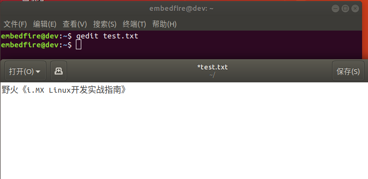

为什么要用终端打开gedit？因为在修改系统配置文件时，通常需要管理员权限，而在图形界面下通过gedit打开文件，只能使用当前用户的身份，这种情况下是无法对这些文件进行修改的。但是，如果我们在终端下，使用sudo命令为gedit增加权限来打开这些文件，则可以对它进行修改，在《8.2.2
修改软件源（命令行）》小节就介绍了这样的方式对/etc/apt/sources.list 文件进行了修改。

执行以下命令可进行对比，使用普通用户权限与sudo权限打开配置文件的差异如下图所示。

#在后面的说明中，#号表示注释，它后面的内容不要输入到终端中

.. code-block:: sh
   :linenos:

   gedit /etc/apt/sources.list #以普通用户身份打开配置文件
   sudo gedit /etc/apt/sources.list #使用sudo增加权限打开配置文件

.. image:: media/editor003.png
   :align: center
   :alt: 未找到图片3|

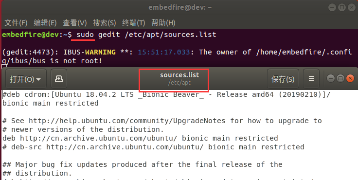

总而言之，当我们使用有图形界面的Ubuntu桌面版进行开发时，使用sudo gedit的方式修改配置文件是一个非常好的选择。

Linux新手在配置开发环境时，对Linux本来就不熟悉，刚学习配置开发环境时一般又一头雾水，再加上网上的教程一般是使用Vim来修改配置文件，新手照着敲命令使用Vim编辑器来改内容，经过Vim的一番操作后，直接就劝退了，我们从此损失了一位未来的技术大牛。

在网上以及我们后面的各种修改配置文件的命令中，默认都是使用Vi/Vim来修改，因为系统一般自带Vi，而且不需要区分系统是否需要使用图形界面。但是对于刚学习Linux的用户，能不用Vim就不去用，在使用带图形界面的Ubuntu时，看到命令中的vim时心里就默认把命令中的“vim”替换成“gedit”即
可。

例如：

.. code-block:: sh
   :linenos:

   #使用sudo权限通过vim打开文件
   sudo vim /etc/apt/sources.list
   #使用sudo权限通过gedit打开文件
   sudo gedit /etc/apt/sources.list

以上命令区别仅为“vim”和“gedit”，即使是Vim编辑器同样也是需要sudo权限才能对文件进行编辑的，如果不使用sudo，以普通用户的身份使用Vim编辑器打开配置文件，同样也是只有“只读”权限。所以，千万不要把Vi/Vim编辑器神圣化了。

VS Code编辑器
~~~~~~~~~~~~~~~~~~~~~~~~~~~~~~~~~~~~~~~~~~~~~~~~~~

VS Code是微软制作的开源编辑器，跨Windows、Linux及iOS平台都有一致的易用体验，推出后广受程序员们的欢迎，配合各种插件可以打造丰富的功能，支持各种文件格式的语法高亮，甚至可以远程编辑服务器或开发板上的文件，本书中的例子基本上都是使用VS Code编辑器写的。

下载安装
^^^^^^^^^^^^^^^^^^^^^^^^

在Ubuntu自带的软件中心可以找到VS Code软件，通过搜索“vscode”即可安装，但目前Ubunut采用Snap软件市场来安装软件，暂时还没有国内的镜像下载源，所以下载可能需要花比较长的时间。

我们推荐直接在Ubuntu下使用浏览器在VS Code官网下载deb包进行安装，顺便学习deb包的安装方法。

VS Code官网地址：\ https://code.visualstudio.com/

VS Code 的安装步骤如下：

(1) 到官网找到下载的选项，可看到Linux平台下分deb和rpm安装包，Debian和Ubuntu系统都是用deb包，如下图所示。

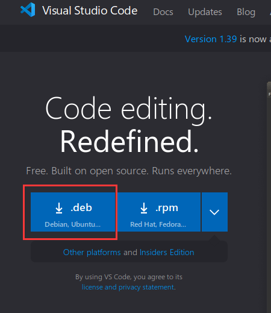

(2) 下载后可以在浏览器中打开下载目录，默认的目录一般为用户家目录下的“/home/下载”。

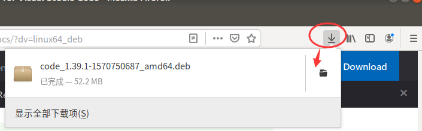

   找到下载好的deb包，直接双击即可安装。

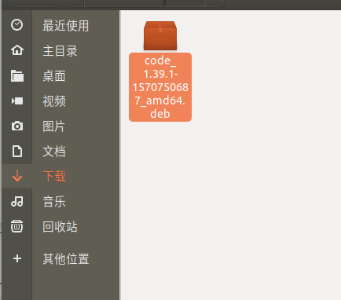

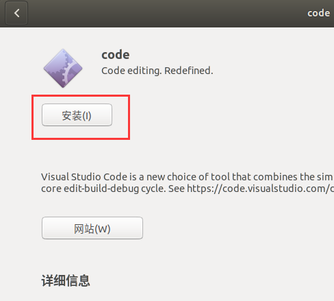

(3) 如果想体验命令行安装deb包，可以使用以下命令：

.. code-block:: sh
   :linenos:

   sudo dpkg -i 安装包的名字

使用命令行安装过程如下图所示。

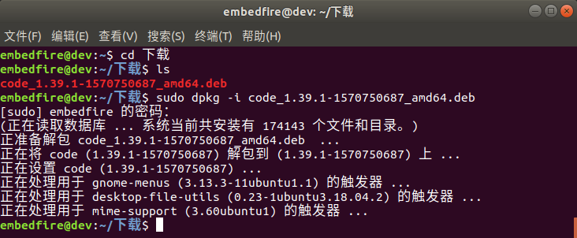

(4) 安装完成后，可以通过“显示应用程序“中打开，如下图所示。

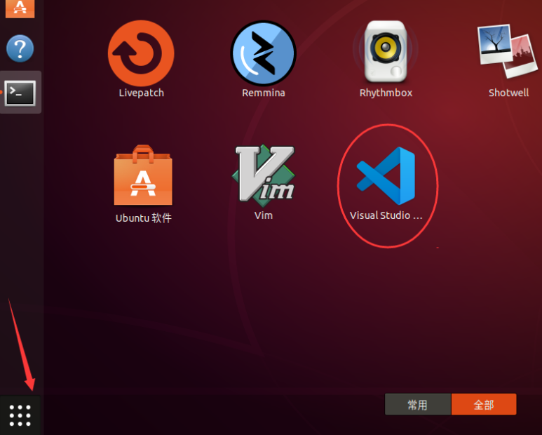

也可以通过终端打开，在终端下VS Code的打开命令为“code”：

code

输入命令回车后稍等一会即可。

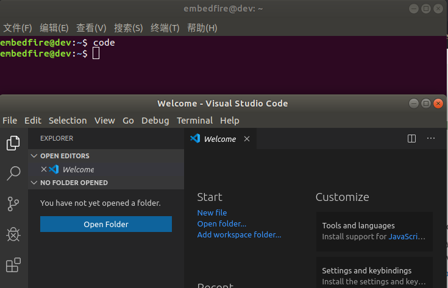

(5) 类似地，如果希望用VS Code修改配置文件，使用sudo命令增加权限即可：

.. code-block:: sh
   :linenos:

   sudo code 文件名 --user-data-dir

其中的“--user-data-dir”参数是VS Code提示要输入的，如下图所示。

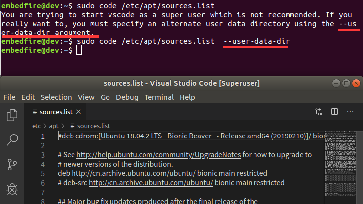

添加插件
^^^^^^^^^^^^^^^^^^^^^^^^

VS Code的强大之处在于它的插件，刚开始的时候我们安装中文支持和c/c++插件即可。

中文支持
''''''''''''''''''''''''''''

点击VS Code界面左侧的“插件图标”，在输入框中输入“chinese”后搜索，可以找到插件“Language pack extension for Chinese (Simplified)”，点击插件下的install按钮即可安装。

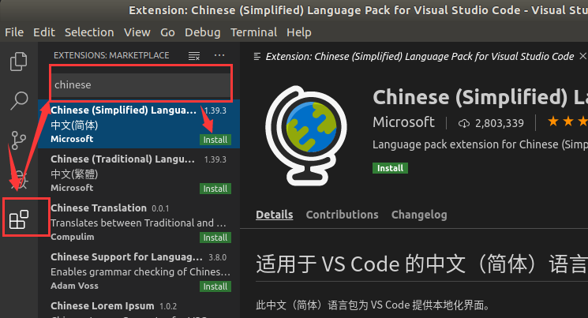

安装插件后一般需要重启VS Code才能生效，平时界面的右下角通常也会有各种提示，如下图所示。

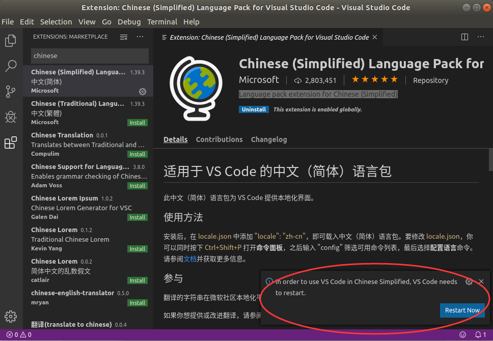

C/C++插件
'''''''''''''''''''''''''''''''''''

VS Code本身就支持C/C++的语法高亮，但并不支持编译、运行、调试等功能，通过安装“C/C++”插件可扩展相应
的功能。在插件安装栏中输入“c”即可搜索到“C/C++”插件，直接安装，如下图所示。

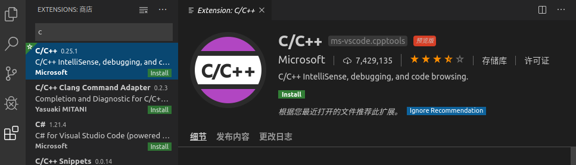

Vi/Vim编辑器
~~~~~~~~~~~~~~~~~~~~~~~~~~~~~~~~~~~~

前面已多次提到Vi/Vim编辑器，大部分Linux系统中都会自带Vi编辑器已方便用户在终端上编辑文件，而Vim是Vi的升级版本，它在Vi的基础上改进和增加了很多特性，是一个功能更强大、高度可定制的文本编辑器。如支持代码折叠、插件、多国语言支持、垂直分割视窗、拼字检查、上下文相关补完，标签页编辑等功能
。热爱Vim编辑器的用户，能把它玩出花来，甚至直接把它打造成IDE。

在对Linux服务器进行运维或控制嵌入式开发板的时候，绝大部分情况下我们只能使用终端，而在终端编辑文件时使用Vi/Vim编辑器几乎是最好的选择，所以即使它上手不易，但我们也绝不能逃避学习。对新手来说，要求能熟练使用Vi/Vim编辑器对文件进行基本的读写修改。

Vim使用演示
^^^^^^^^^^^^^^^^^^^^^^^^^^^^

安装Vim
''''''''''''''''''''''''''''''

在Ubuntu下，使用apt可安装Vim编辑器，执行如下命令安装：

.. code-block:: sh
   :linenos:

   sudo apt install vim

打开Vi/Vim
''''''''''''''''''''''''''''''''

安装后使用vi或vim命令都可以打开，它们的基础使用方法是一样的：

.. code-block:: sh
   :linenos:

   vi #若系统安装了vim，该命令会自动打开vim软件
   vim #打开vim软件

也可以使用如下命令创建或打开文件：

.. code-block:: sh
   :linenos:

   vi 文件名 #若文件存在则打开，文件不存在则创建
   vim 文件名

退出Vim
'''''''''''''''''''''''''

由于Vim是在终端下使用，没有图形界面的，所以对它的所有控制都只能通过命令来实现，包括退出。对于新手来说如何退出Vim都是个问题。

我们通过退出Vim的步骤来体验Vim的“一般模式”和“命令行模式”。

打开Vim后，请按如下步骤进行操作，注意若开启了输入法，要先把输入法设置成英文：

(1) 按下退出键“Esc”，Vim会进入到“一般模式”。

(2) 输入英文冒号“:”，Vim会进入到“命令行模式”。

(3) 输入强制退出命令“q!”，即字母“q”及英文叹号“!”。

(4) 按回车执行命令，会退出Vim，返回到终端。

执行时终端显示的内容如下图所示。

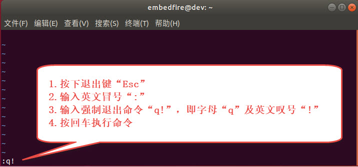

输入内容
''''''''''''''''''''

初次使用Vim时，想要在编辑器输入内容也并非易事， Vim打开后默认是在“一般模式”的，键盘的输入都会被当成一般命令而不是文本的内容，即在该模式下的所有输入就如同在其它常用编辑器中按了快捷键。运气好按了进入“插入模式”的快捷键，后续的输入才会被当成文本内容。

可通过以下步骤进入到“插入模式”输入内容并保存文件：

(1) 按下退出键“Esc”进入“一般模式”。

(2) 输入一般命令“i”，即直接按字母“i”，进入“插入模式”，如下图所示。

(3) 随意输入一些内容。

(4) 按下退出键“Esc”再次进入“一般模式”。

(5) 输入英文冒号“:”，Vim会进入到“命令行”模式。

(6) 输入保存退出命令“wq”。

(7) 按回车执行命令，会退出Vim，返回到终端。

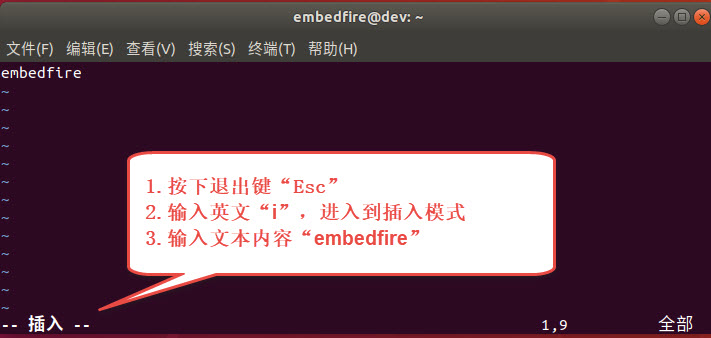

Vim的三种模式
^^^^^^^^^^^^^^^^^^^^^^^^^^^^^^^^^^^^^^^^

经过以上的使用演示，我们体验到了Vim编辑器的三种工作模式：

-  一般模式（normal mode）：一般模式用来浏览文本，查找内容，但是不可以编辑，在该模式下的键盘输入会被当成快捷键，如复制粘贴等。打开Vim时，默认是工作在一般模式。

-  插入模式（insert mode）：插入模式下具有普通编辑器的功能，该模式下的键盘输入会被当成文本内容。

-  命令行模式（command-line mode）：命令行模式支持保存、退出、替换等命令，以及Vim的高级功能。

我们在使用Vim时，常常会在这三种模式之间进行切换，切换方式可以参考下图。

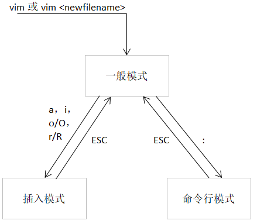

上图的意义就是：

-  在任意模式下，我们可以通过按键“Esc”进入到一般模式。

-  在一般模式下，通过按键“a” “i” “o” “O” “r” “R”等可进入到插入模式。

-  在一般模式下，通过按键“:”可进入到命令行模式。

插入模式
^^^^^^^^^^^^^^^^^^^^

Vim提供多个快捷键来从一般模式进入插入模式，见下表。进入插入模式之后，就可以正常地编辑文本了，使用方向键来移动光标，回车键进行换行，操作方式与Windows记事本没有什么区别。

表 进入/退出插入模式的快捷键

====== ===================================================
快捷键 功能描述
====== ===================================================
i      在当前光标所在位置插入文本
a      在当前光标所在位置的下一个字符插入文本
o      在光标所在位置后插入新行
r      替换当前光标所在位置的字符
R      可以替换当前光标所在位置之后的字符，按下“Esc”则退出
ESC    退出插入模式
====== ===================================================

一般模式
^^^^^^^^^^^^^^^^^^^^

在任意模式下按按键“Esc”可进入到一般模式。下表列出了一般模式下常用的快捷键。在一般模式下，可以进行复制，粘贴，删除，查找替换某个关键字等。

表  一般模式快捷键

====================== ==================== ===============================================================================================================================
\                      快捷键               功能描述
====================== ==================== ===============================================================================================================================
光标移动               k / ↑                光标向上移动
\                      j / ↓                光标向下移动
\                      h / ←                光标向左移动
\                      l / →                光标向右移动
\                      PageUp               向上翻页
\                      PageDown             向下翻页
\                      nG                   跳转到第n行
文本查找与替换         /word                在文件中搜索关键字word
\                      n                    查找下一个关键字
\                      N                    查找上一个关键字
\                      :1,$s/word1/word2/gc 将文本中的所有关键字word1用word2进行替换，需要用户进行确认。（使用:1,$s/word1/word2/g则直接全部替换）。这实际是运行在命令模式。
撤销重做               u                    撤销上一步的操作，等价于Windows的Ctrl+Z
\                      Ctrl+r               重做上一步的操作。
删除、剪切、复制、粘贴 d                    删除光标所选的内容
\                      dd                   删除当前行
\                      ndd                  删除光标后n行
\                      x                    剪切光标选中的字符
\                      y                    复制光标所选的内容
\                      yy                   复制当前行
\                      nyy                  复制当前行后n行
\                      p                    将复制的数据粘贴在当前行的下一行
\                      P                    将复制的数据粘贴在当前行的上一行
区块操作               v                    选择多个字符
\                      V                    可以选择多行
\                      ctrl+v               可以选择多列
====================== ==================== ===============================================================================================================================

命令行模式
^^^^^^^^^^^^^^^^^^^^^^^^^

在一般命令模式下，按下键盘的冒号键“:”，就可以进入命令行模式，继续输入要执行的命令按回车即可执行。

表  命令行模式快捷键

============ ==================================================
快捷键       功能描述
============ ==================================================
w            保存文档
w <filename> 另存为以<filename>为文件名的文档
r <filename> 读取文件名为filename的文档
q            直接退出软件，前提是文档未做任何修改
q!           不保存修改，直接退出软件
wq           保存文档，并退出软件。
set nu       在行首加入行号
set nonu     不显示行号
set hlsearch 搜索结果高亮显示
! command    回到终端窗口，执行command命令，按回车键可切回vim。
============ ==================================================

用Vi/Vim软件编写简单的sh脚本
^^^^^^^^^^^^^^^^^^^^^^^^^^^^^^^^^^^^^^^^^^^^^^^^^^^^^^^^^^^^^^^^^^^^^^^^

到此为止，Vim的基本操作就介绍完了，最后我们尝试用Vim编写一个输出hello world的脚本，熟悉Vim的操作。

在终端中执行行下列命令：

.. code-block:: sh
   :linenos:

   vim hello_world.sh

然后进入插入模式（在一般模式下按“i”键），输入下列代码后，保存文
件并退出（退出插入模式，进入命令行模式后，输入wq并回车），注意以下内
容全为英文符号。

.. code-block:: sh
   :linenos:

   echo "helloworld,this is a script test!"

此脚本文件中的echo命令的作用是将其后面的文本内容直接输出到终端上。

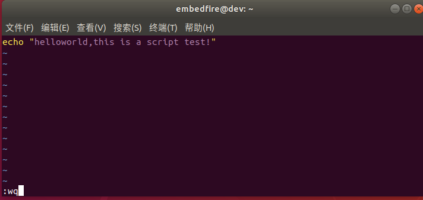

Vim退出后回到终端，通过source命令运行刚刚编写的脚本文件：

.. code-block:: sh
   :linenos:

   source hello_world.sh

可以看到终端会输出“helloworld,this is a script test!”字样。

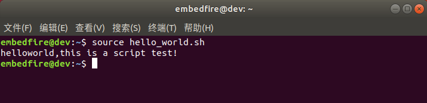

.. |editor003| image:: media/editor003.png
   :width: 5.33333in
   :height: 3.07236in

