.. vim: syntax=rst

fire-config工具简介
-------------------

**注意:该工具专用于野火新发布的Debian系统镜像,不适合用于野火旧版本镜像和其他任何的Linux系统上，望知悉!**  
（新版Debian镜像的下载和烧录方法详见《SD卡烧录Debian镜像》章节）。

fire-config是野火IMX-6ULL开发板自带的一个系统配置工具，
通过串口终端或远程终端可以方便地使用它来进行系统功能的使能或禁止。

使用方法
~~~~~~~~~~~~~~~~~~~~~

在登录系统以后，如果要使用fire-config工具，只需要运行以下命令

.. code-block:: sh
   :emphasize-lines: 2
   :linenos:

   sudo fire-config

   注意:由于该工具会改变一系列不属于当前用户的文件，sudo是必须要加的。

执行指令后，在终端的显示界面如下:

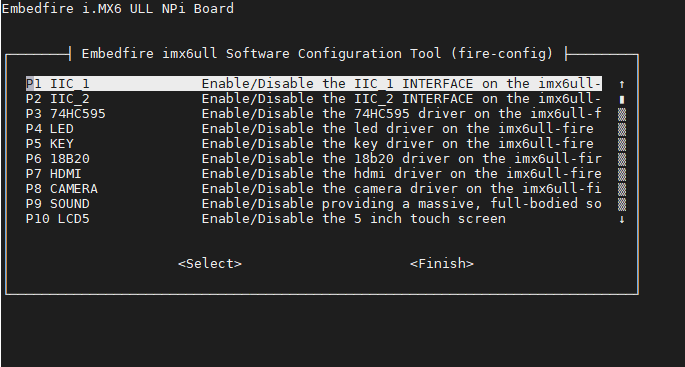

串口终端界面

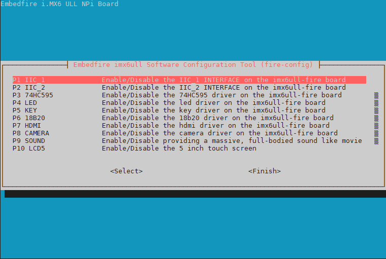

ssh远程终端界面

菜单选择和移动
~~~~~~~~~~~~~~~~~~~~~

在该菜单中，使用up和down箭头键可以在不同的选项中切换，被选中的一项将会高亮显示，
使用right箭头键将跳出"选项"，并跳转到<Select>和<Finish>按钮。按下left将使您返回选项。
<Select>按钮表示该项被选中，<Finish>按钮表示已完成全部配置项。

fire-config机制
~~~~~~~~~~~~~~~~~~~~~
一般而言，fire-config旨在提供一些常见的系统功能配置服务，在进行配置过程中，
这可能会导致/boot/uEnv.txt或者是其他各种标准的linux配置文件被自动更改了，
某些选项需要重启才能生效，如果您修改了其中一个，fire-config 会在<Finish>
按钮被选择时，询问您是否要立即重启，如果您希望配置马上生效，确定重启系统即可。

Device Tree Overlays
~~~~~~~~~~~~~~~~~~~~~

fire-config工具集成了Device Tree Overlays机制，用来管理一些硬件资源的分配和模块的加载，
从而缓解多个驱动程序争用系统资源的问题。

在传统开发模式中，这个机制通常是由设备树来完成的：在开发之前根据项目需求，
提前确定系统中所有用到的硬件设备。在设备树中把所有的外围设备信息以设备树特定的语法进行描述，
在设备树被编译为dtb文件后，被linux内核加载使用。

可以看到，在传统开发过程，一旦硬件资源发生变化，就要重新修改、编译、下载设备树。比较极端的情况是:
当项目中要支持多种的硬件模块，而不同模块间往往会共用某些系统资源(如IO引脚)。
一旦系统要兼容模块任意组合使用，那么随着模块数量增加，需要编译的设备树数量将爆炸增长。

因此，使用传统设备树是不利于项目的维护和扩展的。内核为了解决这个提出了一套新的解决方案，
那就是Device Tree Overlays，中文上可理解为"设备树插件"。
它的核心原理是，通过扩展传统的设备树语法，使得各个硬件模块的信息可以独立地用新的设备树语法来描述。
这样一来，传统的主设备树中只需要保留最基础的硬件信息(主要是cpu和内存)，其他模块单独编译成"设备树插件"。
在系统实际使用时，根据实际应用情景，需要用到哪些硬件模块就把对应的设备树插件加入到主设备树即可。

如下为实际内存中设备树的示意图:

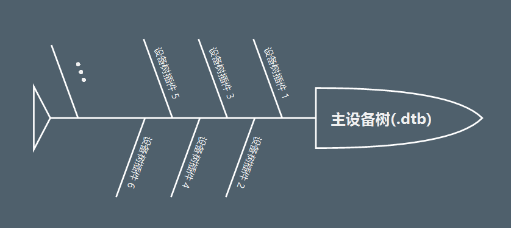

"设备树插件"无疑提高了系统的可维护性和减少了大量的重复工作，目前，
我们已经把常见的硬件模块都编译成了"设备树插件",比如LCD、HDMI、WiFi等等。
用户可以通过fire-config工具轻松地实现对硬件模块的便捷管理。

fire-config功能项
~~~~~~~~~~~~~~

LED
^^^^

使能或者禁止LED灯

KEY
^^^^

使能或者禁止独立按键

MPU6050
^^^^^^^^

使能或者禁止MPU6050陀螺仪

OLED
^^^^^^^^

使能或者禁止OLED显示器

18b20
^^^^^^^^

使能或者禁止18b20温度传感器

HDMI
^^^^^^^^

使能或者禁止HDMI显示器

CAMERA
^^^^^^^^

使能或者禁止摄像头模块

SOUND
^^^^^^^^

使能或者禁止声卡模块

LCD5
^^^^^^^^

使能或者禁止5寸触摸屏

LCD4.3
^^^^^^^^

使能或者禁止4.3寸触摸屏

485r1
^^^^^^^^

使能或者禁止第一路485串口

485r2
^^^^^^^^

使能或者禁止第二路485串口

ADC1
^^^^^^^^

使能或者禁止第一路ADC采样

CAN1
^^^^^^^^

使能或者禁止第一路CAN通信

CAN2
^^^^^^^^

使能或者禁止第二路CAN通信

dht11
^^^^^^^^

使能或者禁止dht11温湿度传感器

ecspi3
^^^^^^^^

使能或者禁止spi通信

uart3
^^^^^^^^

使能或者禁止第三路串口通信

wifi
^^^^^^

使能wifi接口。wifi与sd卡共用一个sdio接口，两者不能同时使用

wifi_scan
^^^^^^^^^^^^

扫描并显示当前存在的wifi网络

wifi_setting
^^^^^^^^^^^^^^^

设置目标wifi的账号与密码

SSH_connect
^^^^^^^^^^^^^^^^

远程登录会话

flasher
^^^^^^^^^^^^^^^^^^

使能或者禁止SD卡刷机，用于将SD卡的系统固件烧录到eMMC或者nandflash

Expand Filesystem
^^^^^^^^^^^^^^^^^^

扩展SD卡容量，解决SD卡镜像烧录完毕后，出现储存容量大幅减小的问题

fire-config设置ssh
~~~~~~~~~~~~~~~~~~~~~~

1、上电启动开发板，开发板默认开启ssh服务。系统正常登录后，输入以下命令查看ssh服务是否已经运行：

.. code-block:: sh
   :emphasize-lines: 2
   :linenos:

   sudo systemctl status ssh

如下图所示:active状态说明ssh服务正常运行

.. image:: media/fire-config_ssh.png
   :align: center
   :alt: 查看ssh服务是否运行

2、确保网络连接正常(注意wifi要先正确配置后才能使用)。输入以下命令查看当前主机的ip地址:

.. code-block:: sh
   :emphasize-lines: 2
   :linenos:

   ifconfig

以太网ip地址如下图所示:

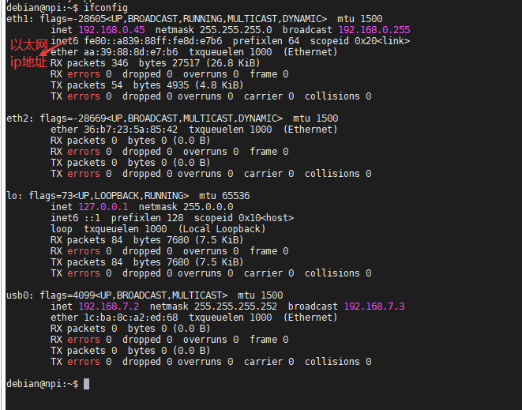

正确配置wifi后，wifi的ip地址如下图所示:

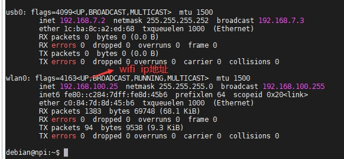

3、使用ssh客户端登录，这里使用vscode的Remote-SSH插件为例。
vscode安装完Remote-SSH插件后，使用"ctrl+shift+P"快捷键打开命令面板，
输入"Remote-SSH"迅速找到"Remote-ssh: connect to host"选项，
如下图所示:

.. image:: media/fire-config_ssh3.png
   :align: center
   :alt: Remote-SSH插件

4、进一步选择"Add New SSH Host"选项，如下图

.. image:: media/fire-config_ssh4.png
   :align: center
   :alt: Remote-SSH插件

5、根据开发板的ip地址，在ssh登录框中输入登录命令，
这里以本人实际开发环境中的以太网IP地址为例。

.. image:: media/fire-config_ssh5.png
   :align: center
   :alt: Remote-SSH插件

6、选择配置文件来保存主机ip和用户名，一般选择用户名下的config进行配置即可，
如下图所示:

.. image:: media/fire-config_ssh6.png
   :align: center
   :alt: Remote-SSH插件

7、提示检查主机公钥指纹，选择"continue",如下图:

.. image:: media/fire-config_ssh7.png
   :align: center
   :alt: Remote-SSH插件

8、输入主机用户的密码，debian用户默认密码为"temppwd"。
如果弹出登录失败串口，点击"retry"选项，重复登录2~3次。

.. image:: media/fire-config_ssh8.png
   :align: center
   :alt: Remote-SSH插件

9、登录成功后，在菜单栏打开"Terminal"选项，新建一个终端。
如下图:

.. image:: media/fire-config_ssh9.png
   :align: center
   :alt: Remote-SSH插件

10、输入"sudo fire-config"命令，选择"SSH-connect"项。
如下图:

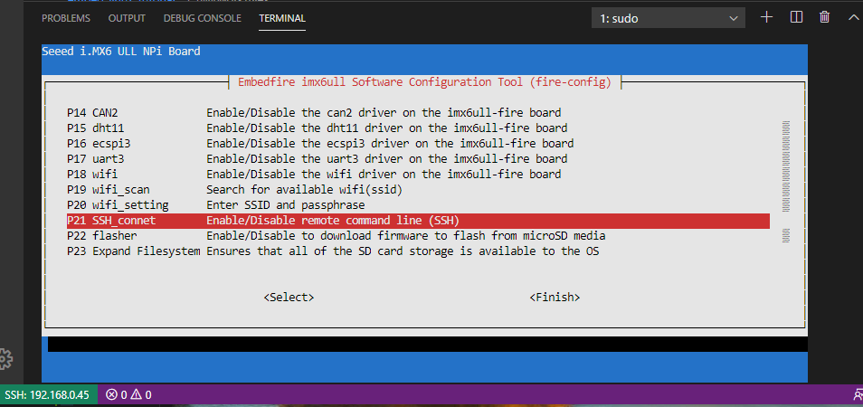

11、系统提示: "Would you like the SSH server to be enabled?"。选择<Yes>或<No>来
分别对ssh进行使能和禁止即可。
如下图:

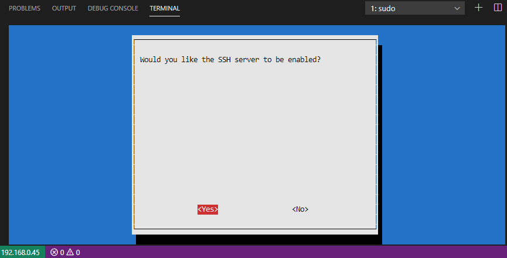

fire-config使能硬件模块
~~~~~~~~~~~~~~~~~~~~~~

1、开发板正常启动后，执行sudo fire-config，这里以"LED"外设为例，选择"LED"项。
其他硬件模块的使能方法与"LED"类似。

如下图:

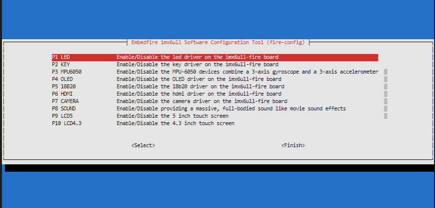

2、系统提示: "Would you like the led to be enabled?"，选择<Yes>项。

如下图:

3、系统提示: "The flasher is enabled"，选择<OK>项，返回主界面。

如下图:

4、在初始界面,选择<Finish>项。系统默认使能"LED"外设，因此不会提示重启。

注意:**如果系统的外设本来已经是使能状态，那么此时会直接退出fire-config工具；
如果系统的外设原本是禁止状态，在设置为使能状态后，系统会提示重启:"Would you like to reboot now?",
选择<Yes>项，等系统重启后，相关外设已经被使能**。

fire-config刷机
~~~~~~~~~~~~~~

注意:
**刷机不建议用ssh远程登录来操作，避免开发板重启后，
ssh断开连接而不能及时看到相关的刷机信息提示**。

1、开发板正常启动后，在串口终端登录debian系统。

.. code-block:: sh
   :emphasize-lines: 2
   :linenos:

   账户:debian
   密码:temppwd

系统正常登录界面如下所示:

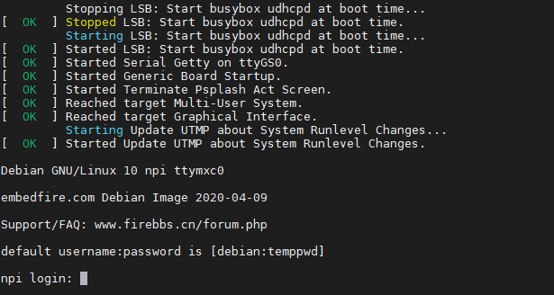

2、执行sudo fire-config，选择"flasher"项。

如下图所示:

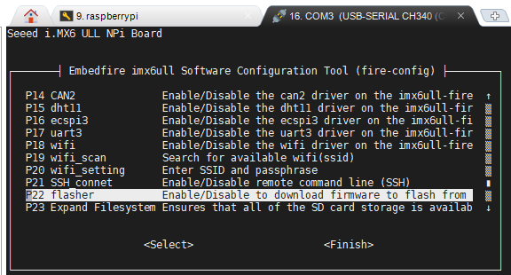

3、系统提示: "Would you like the flasher to be enabled?"，选择<Yes>。

如下图所示:

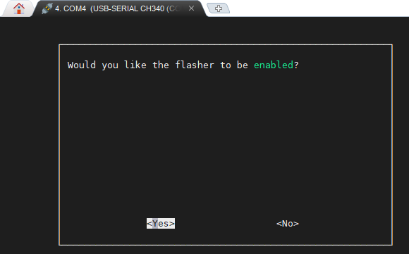

3、系统提示: "The flasher is enabled"，选择<OK>。

如下图所示:

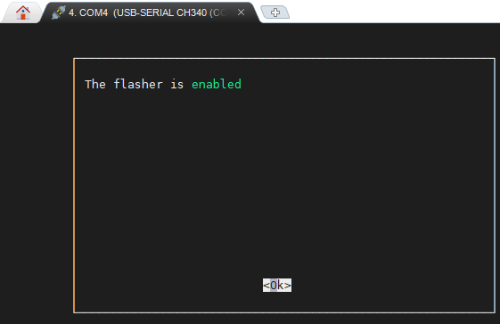

4、返回fire-config初始界面,选择<Finish>。

如下图所示:

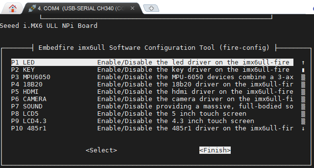

5、系统提示:"Would you like to reboot now?"，选择<Yes>。

如下图所示:

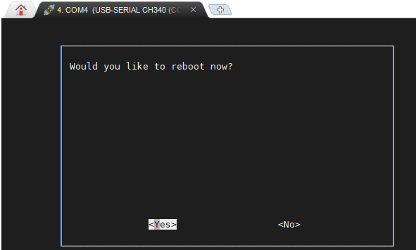

6、系统自动重启。

如下图所示:

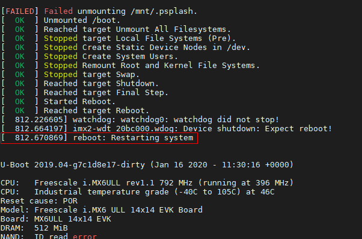

7、重启后的系统将自动进行eMMC或者nandflash刷机。

如下图所示(以eMMC刷机为例):

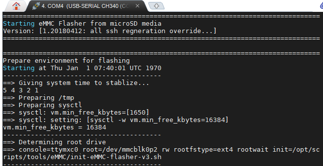

8、耐心等待刷机结束，刷机过程大约持续2分30秒左右。刷机完成后，控制台会重新进入串口登录页面，
此时观察开发板的LED灯，如果LED在持续闪烁，说明刷机成功。

如下图所示

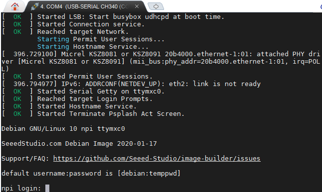

9、无论是eMMC，还是nandflash，刷机成功后，调整拨码开关为相应启动方式，重新上电启动系统即可。

fire-config连接wifi
~~~~~~~~~~~~~~

wifi配置前提
^^^^^^^^^^^^^

- wifi与sd卡共用同一个sdio接口，进行配置wifi之前，要先通过fire-config工具来刷机。
  确认开发板可以正常从nandflash或者eMMC启动后，才能进行wifi的配置连接。

- 刷机步骤完成后，修改跳线帽为下图中连接方式，确保wifi模块连接在该sdio接口上。

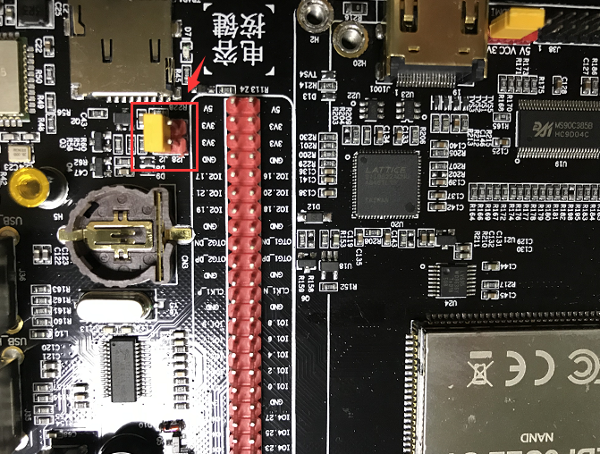

wifi连接步骤
^^^^^^^^^^^^^

1、在终端执行sudo fire-config命令，选择"wifi"项。
如下图:

.. image:: media/fire-config_wifi1.png
   :align: center
   :alt: fire-config配置wifi

2、系统提示:"Would you like the wifi interface to be enabled?",选择<yes>项，表示使能wifi模块。

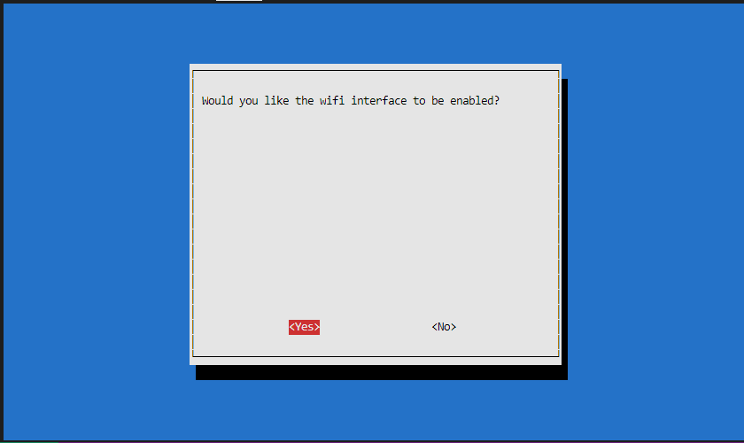

3、系统提示:"The wifi interface is enabled"，选择<ok>项返回主菜单。

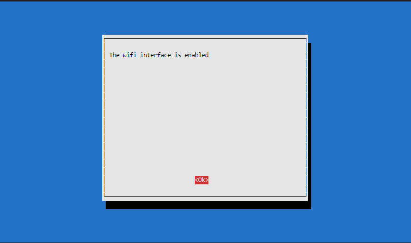

4、在主菜单选择<Finish>项，系统会提示重启：
"Would you like to reboot now?",选择<Yes>项，等待系统重启。
此时wifi模块驱动和wifi自动连接服务已经配置完成。

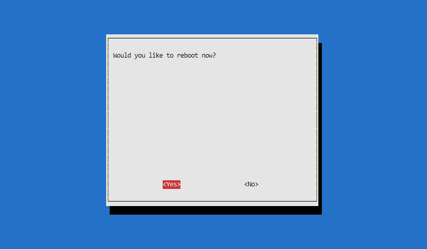

5、系统重启后，继续在系统中执行sudo fire-config命令，选择"wifi_scan"项，
系统会扫描搜索所有周围的无线网络，并在界面显示wifi的名字和信号强弱。
如下图:

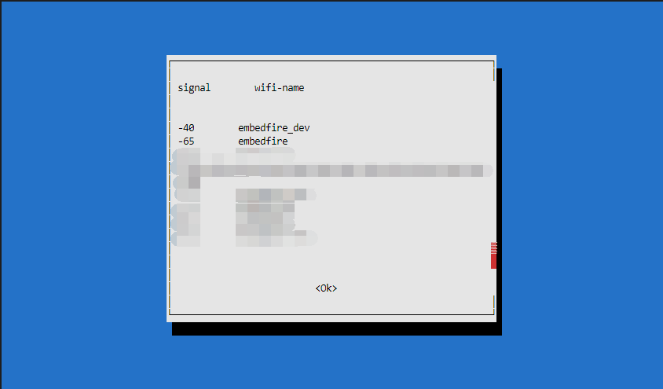

6、确保系统搜索到目标wifi后，选择<ok>项返回主菜单，选择"wifi_setting"项。
如下图:

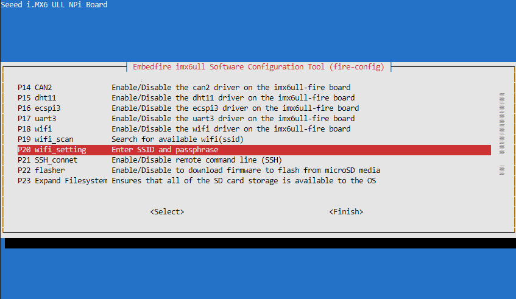

7、输入目标wifi的账号，输入完成后选择<oK>项。

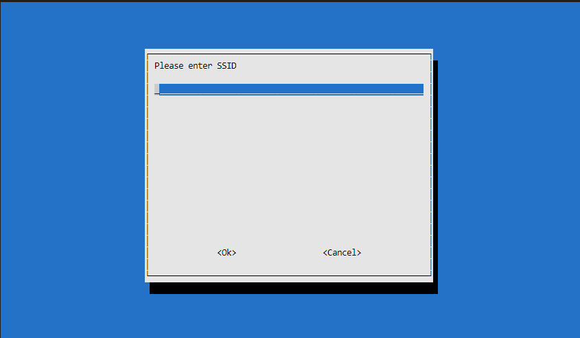

8、继续输入目标wifi的密码，输入完成后选择<ok>项返回主菜单。

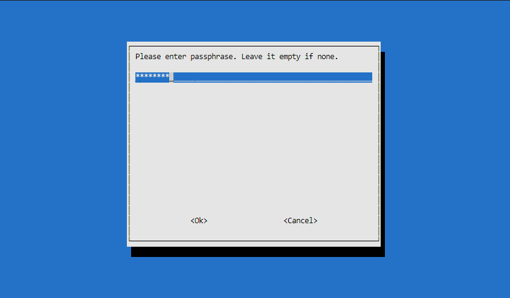

9、选择主菜单<Finsh>项，退出fire-config工具。
执行ifconfig命令，可以看到开发板wifi的ip地址已经分配成功。

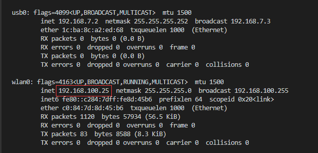